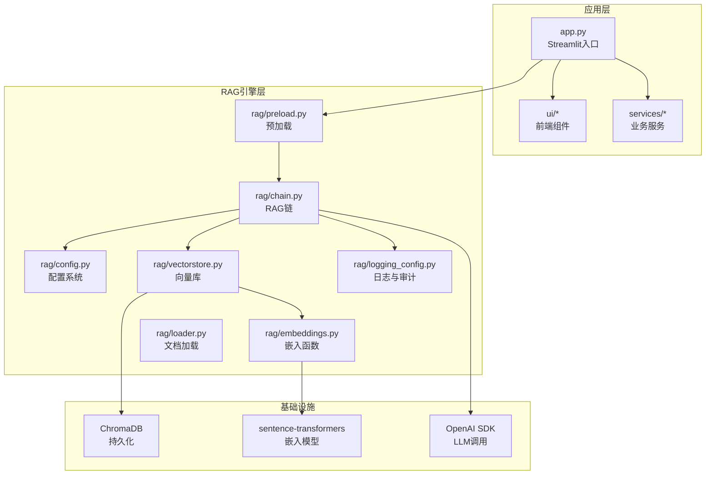
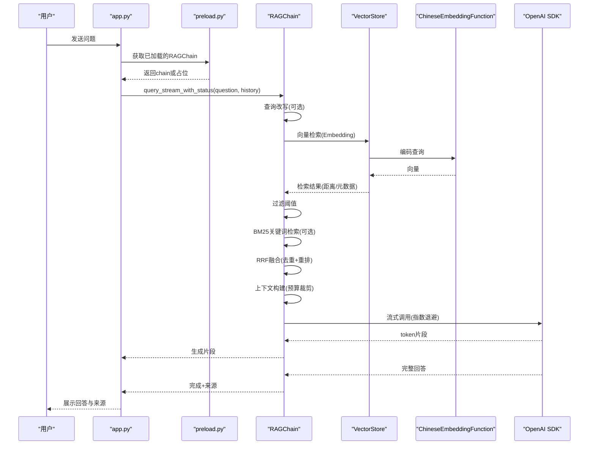
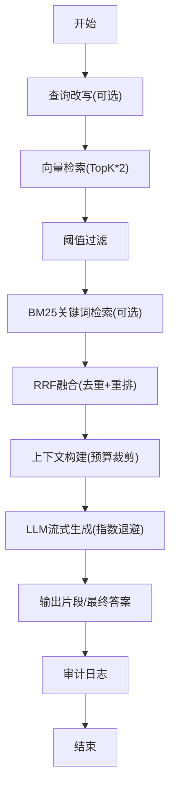
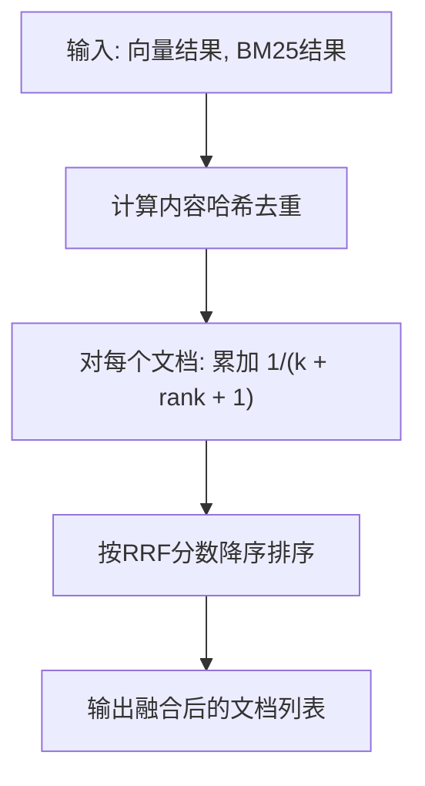
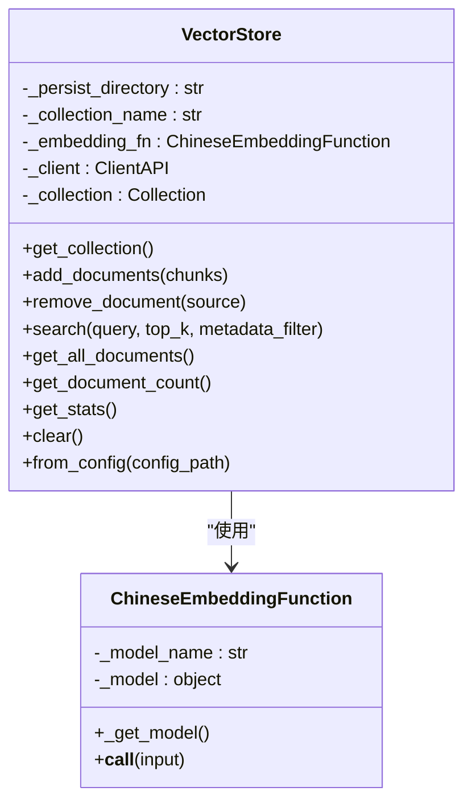
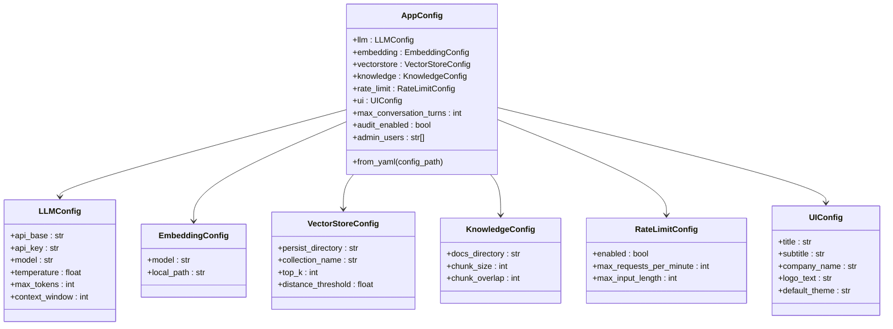
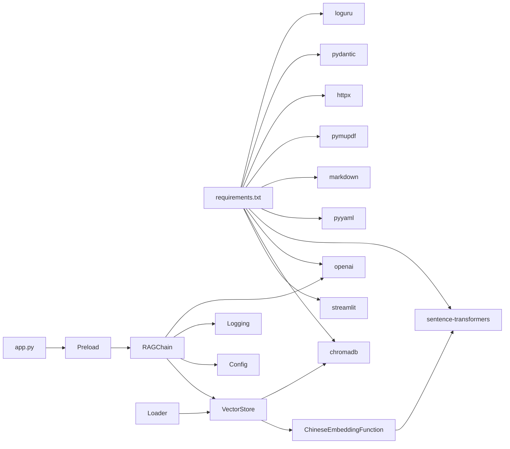

# RAG核心引擎

<cite>
**本文档引用的文件**
- [rag/__init__.py](file://rag/__init__.py)
- [rag/chain.py](file://rag/chain.py)
- [rag/config.py](file://rag/config.py)
- [rag/embeddings.py](file://rag/embeddings.py)
- [rag/vectorstore.py](file://rag/vectorstore.py)
- [rag/loader.py](file://rag/loader.py)
- [rag/logging_config.py](file://rag/logging_config.py)
- [rag/preload.py](file://rag/preload.py)
- [app.py](file://app.py)
- [config.yaml](file://config.yaml)
- [scripts/ingest.py](file://scripts/ingest.py)
- [tests/test_chain.py](file://tests/test_chain.py)
- [requirements.txt](file://requirements.txt)
</cite>

## 目录
1. [简介](#简介)
2. [项目结构](#项目结构)
3. [核心组件](#核心组件)
4. [架构总览](#架构总览)
5. [详细组件分析](#详细组件分析)
6. [依赖关系分析](#依赖关系分析)
7. [性能考量](#性能考量)
8. [故障排查指南](#故障排查指南)
9. [结论](#结论)
10. [附录](#附录)

## 简介
本文件面向RAG（检索增强生成）核心引擎，系统性阐述其在本项目中的实现方式与工程细节，包括：
- 检索链设计：向量检索、关键词检索（BM25）、交叉编码重排序（Reranker）、混合检索策略与Reciprocal Rank Fusion融合算法
- 向量数据库管理：ChromaDB持久化、集合管理、文档增删改查、增量更新
- 配置系统：Pydantic模型校验、环境变量替换、全局单例配置
- 嵌入模型集成：sentence-transformers中文嵌入函数、离线/在线模型加载
- 文档加载器：Markdown/TXT/PDF多格式解析、语义分块、元数据保留
- 流式响应生成机制：OpenAI兼容流式接口、指数退避重试、降级回退
- 错误处理与审计日志：统一日志、审计JSONL、异常捕获与降级
- 扩展与优化建议：性能瓶颈定位、缓存策略、并发与资源管理

## 项目结构
项目采用“模块化+分层”的组织方式：
- rag/：RAG核心引擎模块（检索链、配置、嵌入、向量库、文档加载、日志、预加载）
- scripts/：工具脚本（文档入库、清理数据库等）
- services/：业务服务（历史、分析、限流等）
- ui/：Streamlit前端界面组件
- tests/：单元测试
- app.py：Streamlit入口应用
- config.yaml：应用配置文件
- requirements.txt：依赖清单

图表来源
- [app.py:1-184](file://app.py#L1-L184)
- [rag/chain.py:160-590](file://rag/chain.py#L160-L590)
- [rag/vectorstore.py:24-209](file://rag/vectorstore.py#L24-L209)
- [rag/embeddings.py:19-48](file://rag/embeddings.py#L19-L48)
- [rag/config.py:102-184](file://rag/config.py#L102-L184)
- [rag/logging_config.py:78-129](file://rag/logging_config.py#L78-L129)
- [rag/preload.py:22-73](file://rag/preload.py#L22-L73)

章节来源
- [app.py:1-184](file://app.py#L1-L184)
- [config.yaml:1-46](file://config.yaml#L1-L46)
- [requirements.txt:1-11](file://requirements.txt#L1-L11)

## 核心组件
- RAGChain：检索增强生成主流程，负责混合检索、RRF融合、上下文构建、LLM调用与流式输出
- VectorStore：ChromaDB封装，提供集合管理、文档增删、检索与统计
- ChineseEmbeddingFunction：sentence-transformers中文嵌入函数，支持离线/在线加载
- BM25Retriever：简易中文BM25关键词检索器
- reciprocal_rank_fusion：RRF融合算法，跨检索源去重与重排
- AppConfig/配置模块：Pydantic模型校验、环境变量替换、全局单例
- DocumentChunk：文档分块数据结构
- 日志与审计：统一日志、彩色控制台、文件输出、审计JSONL
- 预加载：后台线程加载RAGChain，避免Streamlit重渲染导致的重复初始化

章节来源
- [rag/chain.py:160-590](file://rag/chain.py#L160-L590)
- [rag/vectorstore.py:24-209](file://rag/vectorstore.py#L24-L209)
- [rag/embeddings.py:19-48](file://rag/embeddings.py#L19-L48)
- [rag/loader.py:22-259](file://rag/loader.py#L22-L259)
- [rag/config.py:102-184](file://rag/config.py#L102-L184)
- [rag/logging_config.py:78-129](file://rag/logging_config.py#L78-L129)
- [rag/preload.py:22-73](file://rag/preload.py#L22-L73)

## 架构总览
RAG核心引擎围绕“检索-融合-生成”闭环展开，数据流如下：
- 输入问题经查询改写（可选）→ 向量检索（TopK*2）→ 过滤阈值 → BM25关键词检索（兜底）→ RRF融合（去重+重排）→ 上下文构建（token预算）→ LLM流式生成（指数退避重试）→ 输出流式片段与最终答案 → 审计日志

图表来源
- [app.py:32-41](file://app.py#L32-L41)
- [rag/preload.py:22-73](file://rag/preload.py#L22-L73)
- [rag/chain.py:408-508](file://rag/chain.py#L408-L508)
- [rag/vectorstore.py:124-142](file://rag/vectorstore.py#L124-L142)
- [rag/embeddings.py:31-47](file://rag/embeddings.py#L31-L47)

## 详细组件分析

### 检索链与混合检索策略
- 查询改写：针对极短查询且存在历史时，拼接最后一条用户消息，提升意图明确性
- 向量检索：使用ChromaDB集合查询，返回文档内容、元数据与距离；按阈值过滤低相关度
- BM25关键词检索：延迟构建索引（与向量库文档同步），关键词匹配得分
- RRF融合：对两路结果按rank计算倒数和，使用内容MD5去重，避免重复文档影响
- Cross-Encoder重排序：类级别缓存模型，避免重复加载；对query+content对预测得分并重排

图表来源
- [rag/chain.py:236-298](file://rag/chain.py#L236-L298)
- [rag/chain.py:129-157](file://rag/chain.py#L129-L157)
- [rag/chain.py:300-330](file://rag/chain.py#L300-L330)
- [rag/chain.py:408-508](file://rag/chain.py#L408-L508)

章节来源
- [rag/chain.py:213-234](file://rag/chain.py#L213-L234)
- [rag/chain.py:236-298](file://rag/chain.py#L236-L298)
- [rag/chain.py:129-157](file://rag/chain.py#L129-L157)
- [rag/chain.py:300-330](file://rag/chain.py#L300-L330)
- [rag/chain.py:408-508](file://rag/chain.py#L408-L508)

### Reciprocal Rank Fusion融合算法
- 输入：向量检索结果与BM25检索结果（均为文档列表）
- 去重：对每个文档计算内容MD5哈希，跨源去重
- 计分：对每个文档，累加Σ 1/(k + rank + 1)，k通常取60
- 排序：按最终RRF分数降序返回

图表来源
- [rag/chain.py:124-157](file://rag/chain.py#L124-L157)

章节来源
- [rag/chain.py:129-157](file://rag/chain.py#L129-L157)

### 向量数据库管理（VectorStore）
- 初始化：延迟创建ChromaDB客户端与集合，设置嵌入函数
- 文档入库：支持增量更新（同ID覆盖），删除同名ID后再新增
- 检索：支持where过滤、返回内容、元数据与距离
- 统计：集合名、总数、不同来源文件数
- 单例缓存：相同配置仅创建一次实例，避免重复加载嵌入模型

图表来源
- [rag/vectorstore.py:24-209](file://rag/vectorstore.py#L24-L209)
- [rag/embeddings.py:19-48](file://rag/embeddings.py#L19-L48)

章节来源
- [rag/vectorstore.py:24-209](file://rag/vectorstore.py#L24-L209)
- [rag/embeddings.py:19-48](file://rag/embeddings.py#L19-L48)

### 配置系统（Pydantic + 环境变量替换）
- AppConfig：集中管理LLM、Embedding、VectorStore、Knowledge、RateLimit、UI、审计等配置
- 环境变量替换：支持${VAR}与${VAR:-default}语法，递归替换字典值
- 全局单例：get_config()/reload_config()保证全局一致性
- load_config()：兼容旧接口返回dict

图表来源
- [rag/config.py:48-184](file://rag/config.py#L48-L184)

章节来源
- [rag/config.py:16-44](file://rag/config.py#L16-L44)
- [rag/config.py:102-184](file://rag/config.py#L102-L184)
- [config.yaml:1-46](file://config.yaml#L1-L46)

### 嵌入模型集成（sentence-transformers）
- 支持在线模型名与本地路径两种加载方式
- 首次调用延迟加载，打印进度与维度信息
- 与ChromaDB集合绑定，作为embedding_function

章节来源
- [rag/embeddings.py:19-48](file://rag/embeddings.py#L19-L48)
- [rag/vectorstore.py:36](file://rag/vectorstore.py#L36)

### 文档加载器（多格式解析与语义分块）
- 支持：.md、.txt、.pdf
- 解析：PDF使用pymupdf/fitz；文本直接UTF-8读取
- 分块：按二级标题优先切分，超长段落按段落与代码块完整性切分，支持重叠
- 元数据：source、title、chunk_index、file_type
- 元数据枚举：仅列出文件元数据（不加载全文）

章节来源
- [rag/loader.py:18-259](file://rag/loader.py#L18-L259)

### 流式响应生成机制
- 流式调用：OpenAI兼容流式接口，逐片输出token
- 指数退避重试：最多3次，等待时间2^attempt秒
- 降级回退：流式失败尝试非流式一次性请求
- 状态分发：{"status": "searching/generating/done/error"}

章节来源
- [rag/chain.py:408-508](file://rag/chain.py#L408-L508)
- [rag/chain.py:509-582](file://rag/chain.py#L509-L582)

### 日志与审计
- 彩色控制台输出、文件输出、统一格式
- 审计日志：按日期JSONL文件，记录用户、动作、详情、查询、摘要、结果数、耗时

章节来源
- [rag/logging_config.py:27-129](file://rag/logging_config.py#L27-L129)

### 预加载与应用入口
- 预加载：后台线程加载RAGChain，避免Streamlit重渲染导致的重复初始化
- 应用入口：Streamlit页面初始化主题、会话状态、登录态，按页渲染聊天面板或仪表盘

章节来源
- [rag/preload.py:22-73](file://rag/preload.py#L22-L73)
- [app.py:23-86](file://app.py#L23-L86)

## 依赖关系分析
- 外部依赖：streamlit、chromadb、openai、sentence-transformers、pyyaml、markdown、pymupdf、httpx、pydantic、loguru
- 内部耦合：RAGChain依赖VectorStore、Config、Logging；VectorStore依赖EmbeddingFunction；Loader与VectorStore配合入库；Preload为应用提供链实例

图表来源
- [requirements.txt:1-11](file://requirements.txt#L1-L11)
- [rag/chain.py:14-18](file://rag/chain.py#L14-L18)
- [rag/vectorstore.py:12-15](file://rag/vectorstore.py#L12-L15)
- [rag/embeddings.py:12-14](file://rag/embeddings.py#L12-L14)
- [rag/loader.py:12-13](file://rag/loader.py#L12-L13)
- [rag/preload.py:37-38](file://rag/preload.py#L37-L38)
- [app.py:15-17](file://app.py#L15-L17)

章节来源
- [requirements.txt:1-11](file://requirements.txt#L1-L11)

## 性能考量
- 检索性能
  - 向量检索：TopK扩大2倍以提高召回，随后阈值过滤降低无效文档
  - BM25索引：与向量库文档数量同步，避免重复构建
  - RRF融合：常数k=60，兼顾向量与关键词贡献
- 上下文预算
  - 估算字符→token：CHARS_PER_TOKEN≈1.5，结合系统提示、问题、历史与预留空间动态计算
- LLM调用
  - 流式优先，失败指数退避重试，必要时降级为非流式一次性请求
- 模型加载
  - 类级别缓存Reranker模型，避免重复加载
  - EmbeddingFunction延迟加载，首次耗时较长但后续复用
- 存储与IO
  - ChromaDB持久化目录与集合名配置化，支持多集合隔离
  - 增量入库：同ID覆盖，减少全量重建成本

章节来源
- [rag/chain.py:170-186](file://rag/chain.py#L170-L186)
- [rag/chain.py:192-208](file://rag/chain.py#L192-L208)
- [rag/chain.py:376-388](file://rag/chain.py#L376-L388)
- [rag/chain.py:300-330](file://rag/chain.py#L300-L330)
- [rag/embeddings.py:31-39](file://rag/embeddings.py#L31-L39)
- [rag/vectorstore.py:181-209](file://rag/vectorstore.py#L181-L209)

## 故障排查指南
- 检索无结果
  - 检查向量库是否为空或文档未入库
  - 调整distance_threshold或开启BM25兜底
  - 确认文档分块大小与overlap配置合理
- LLM调用失败
  - 查看流式调用日志与重试记录
  - 切换非流式模式确认模型可用性
  - 检查api_base、api_key、model配置
- 模型加载缓慢
  - 首次加载Embedding与Reranker模型耗时较长属正常
  - 确保HF_ENDPOINT镜像可用，避免下载超时
- 审计日志未生成
  - 确认audit_enabled开关
  - 检查logs/audit目录权限与磁盘空间

章节来源
- [rag/chain.py:440-495](file://rag/chain.py#L440-L495)
- [rag/logging_config.py:86-129](file://rag/logging_config.py#L86-L129)
- [scripts/ingest.py:25-57](file://scripts/ingest.py#L25-L57)

## 结论
本RAG核心引擎以清晰的模块划分与稳健的工程实践实现了“检索-融合-生成”的闭环：
- 混合检索策略结合向量与关键词优势，RRF融合有效提升召回质量
- 配置系统与单例缓存保障运行时一致性与性能
- 流式响应与指数退避重试提升用户体验与鲁棒性
- 文档加载与向量库管理支持增量更新与多格式解析
- 日志与审计体系便于运维与合规追踪

## 附录
- 配置项参考
  - LLM：api_base、api_key、model、temperature、max_tokens、context_window
  - Embedding：model、local_path
  - VectorStore：persist_directory、collection_name、top_k、distance_threshold
  - Knowledge：docs_directory、chunk_size、chunk_overlap
  - RateLimit：enabled、max_requests_per_minute、max_input_length
  - UI：title、subtitle、company_name、logo_text、default_theme
  - 其他：max_conversation_turns、audit_enabled、admin_users

章节来源
- [rag/config.py:48-116](file://rag/config.py#L48-L116)
- [config.yaml:4-46](file://config.yaml#L4-L46)