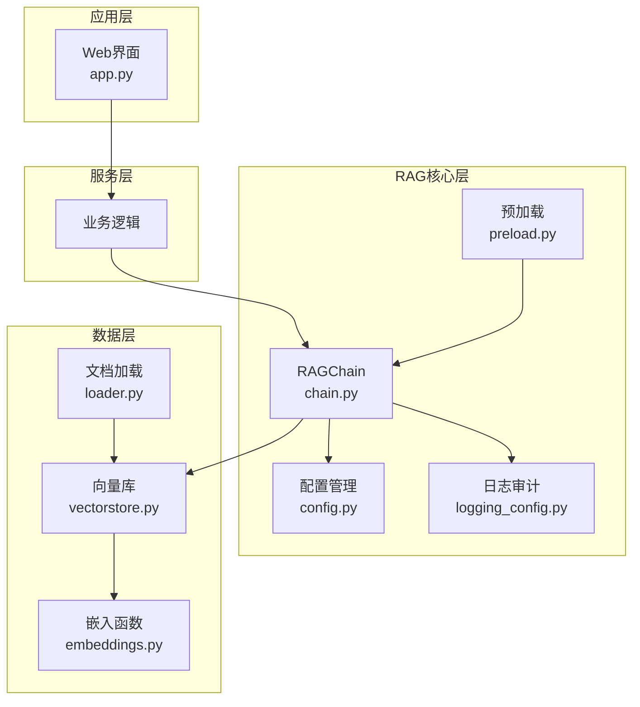
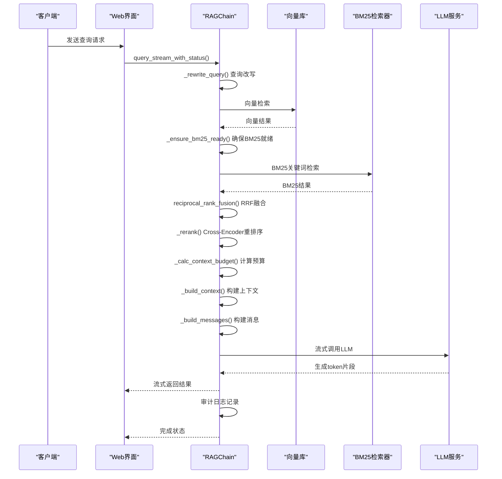
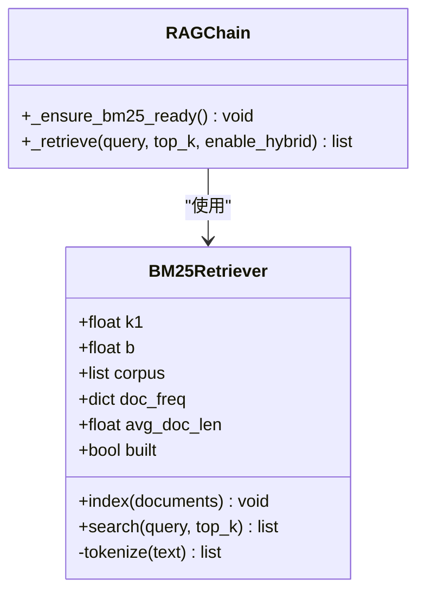
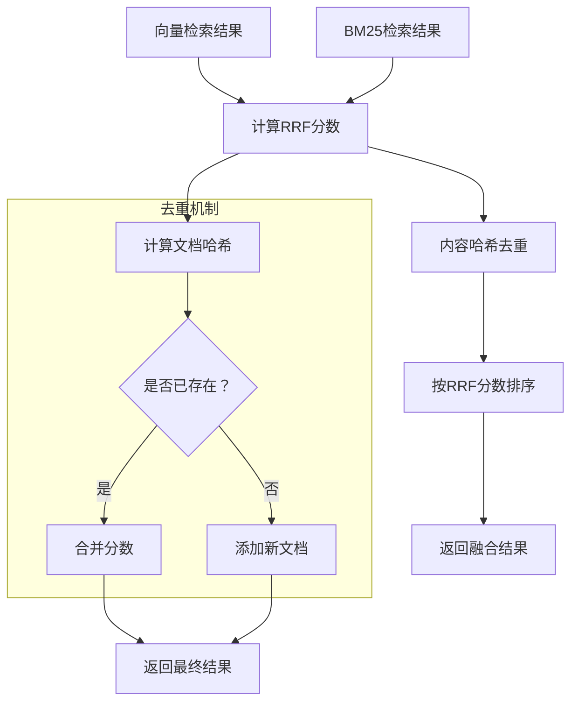
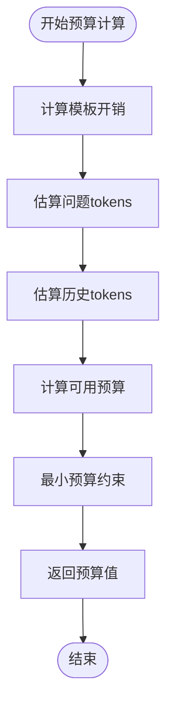
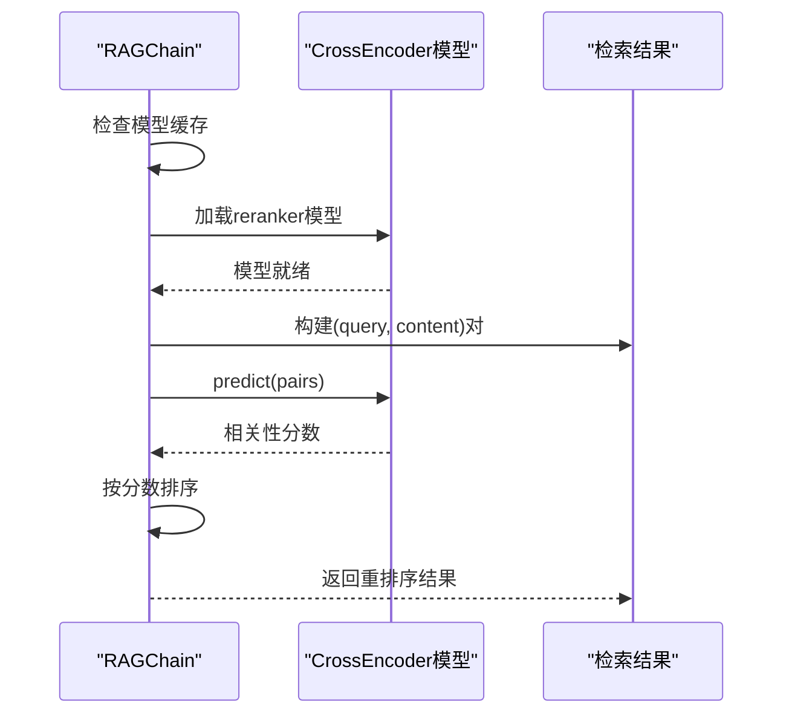
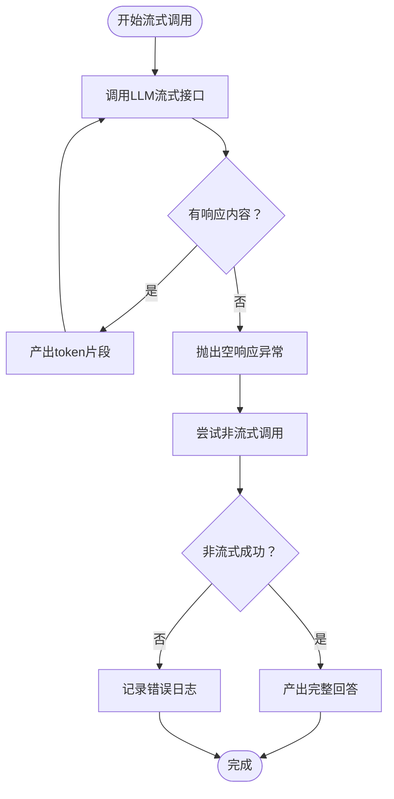
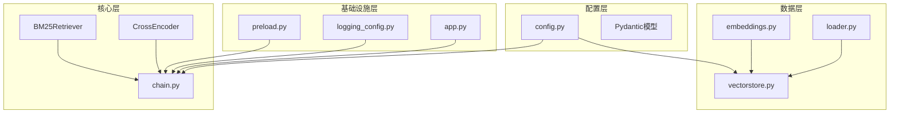

# RAG检索链实现

<cite>
**本文档引用的文件**
- [rag/chain.py](file://rag/chain.py)
- [rag/config.py](file://rag/config.py)
- [rag/vectorstore.py](file://rag/vectorstore.py)
- [rag/embeddings.py](file://rag/embeddings.py)
- [rag/loader.py](file://rag/loader.py)
- [rag/preload.py](file://rag/preload.py)
- [rag/logging_config.py](file://rag/logging_config.py)
- [config.yaml](file://config.yaml)
- [app.py](file://app.py)
- [scripts/ingest.py](file://scripts/ingest.py)
- [tests/test_chain.py](file://tests/test_chain.py)
</cite>

## 目录
1. [简介](#简介)
2. [项目结构](#项目结构)
3. [核心组件](#核心组件)
4. [架构总览](#架构总览)
5. [详细组件分析](#详细组件分析)
6. [依赖关系分析](#依赖关系分析)
7. [性能考虑](#性能考虑)
8. [故障排除指南](#故障排除指南)
9. [结论](#结论)
10. [附录](#附录)

## 简介
本项目实现了一个完整的RAG（检索增强生成）检索链，支持多轮对话、混合检索（向量检索+BM25关键词检索+RRF融合）、Cross-Encoder重排序、查询改写以及流式响应生成。系统采用模块化设计，包含配置管理、向量库管理、文档加载与分块、检索链执行、预加载与日志审计等功能模块，旨在为诊断知识管理系统提供高效的问答能力。

## 项目结构
项目采用分层架构，主要模块如下：
- rag/：RAG核心实现
  - chain.py：RAGChain主类及检索链逻辑
  - config.py：配置管理与Pydantic模型
  - vectorstore.py：ChromaDB向量库管理
  - embeddings.py：中文嵌入函数封装
  - loader.py：文档加载与分块
  - preload.py：后台预加载
  - logging_config.py：日志与审计
- scripts/：工具脚本
  - ingest.py：文档入库脚本
- tests/：单元测试
  - test_chain.py：RAG链测试
- app.py：Streamlit Web界面入口
- config.yaml：应用配置文件

**图表来源**
- [app.py:54-184](file://app.py#L54-L184)
- [rag/chain.py:160-590](file://rag/chain.py#L160-L590)
- [rag/config.py:102-184](file://rag/config.py#L102-L184)
- [rag/vectorstore.py:24-209](file://rag/vectorstore.py#L24-L209)
- [rag/embeddings.py:19-48](file://rag/embeddings.py#L19-L48)
- [rag/loader.py:22-259](file://rag/loader.py#L22-L259)
- [rag/preload.py:22-73](file://rag/preload.py#L22-L73)
- [rag/logging_config.py:46-129](file://rag/logging_config.py#L46-L129)

**章节来源**
- [app.py:1-184](file://app.py#L1-L184)
- [rag/chain.py:1-590](file://rag/chain.py#L1-L590)
- [rag/config.py:1-184](file://rag/config.py#L1-L184)

## 核心组件
本节深入分析RAG检索链的关键组件及其职责。

### RAGChain类设计架构
RAGChain是整个系统的中枢，负责协调检索、重排序、上下文构建和LLM调用等全流程。

#### 主要特性
- **混合检索策略**：向量检索 + BM25关键词检索 + RRF融合
- **查询改写机制**：将对话上下文中的指代消解为独立查询
- **Cross-Encoder重排序**：二次精排提升相关性
- **流式响应生成**：支持实时流式输出
- **多轮对话历史注入**：自动注入最近几轮对话
- **令牌预算计算**：动态计算上下文可用token数
- **错误处理与重试**：指数退避重试策略

#### 关键配置参数
- LLM配置：api_base、api_key、model、temperature、max_tokens、context_window
- 向量库配置：persist_directory、collection_name、top_k、distance_threshold
- 知识库配置：docs_directory、chunk_size、chunk_overlap
- 速率限制：enabled、max_requests_per_minute、max_input_length
- UI配置：title、subtitle、company_name、logo_text、default_theme

**章节来源**
- [rag/chain.py:160-590](file://rag/chain.py#L160-L590)
- [rag/config.py:48-184](file://rag/config.py#L48-L184)

## 架构总览
系统采用分层架构，各层职责清晰分离，便于维护和扩展。

**图表来源**
- [rag/chain.py:408-583](file://rag/chain.py#L408-L583)
- [rag/chain.py:236-299](file://rag/chain.py#L236-L299)
- [rag/chain.py:300-331](file://rag/chain.py#L300-L331)
- [rag/chain.py:376-407](file://rag/chain.py#L376-L407)

## 详细组件分析

### 检索子系统

#### 向量检索
向量检索使用ChromaDB作为向量数据库，支持相似度检索和距离阈值过滤。

**图表来源**
- [rag/chain.py:251-269](file://rag/chain.py#L251-L269)
- [rag/vectorstore.py:124-142](file://rag/vectorstore.py#L124-L142)

#### BM25关键词检索
实现了一个简易但有效的BM25检索器，支持中文分词和IDF/TDF计算。

**图表来源**
- [rag/chain.py:192-208](file://rag/chain.py#L192-L208)
- [rag/chain.py:236-299](file://rag/chain.py#L236-L299)
- [rag/chain.py:39-120](file://rag/chain.py#L39-L120)

#### RRF融合算法
Reciprocal Rank Fusion算法将向量检索和BM25检索结果进行融合，使用内容哈希去重。

**图表来源**
- [rag/chain.py:129-158](file://rag/chain.py#L129-L158)
- [rag/chain.py:124-127](file://rag/chain.py#L124-L127)

**章节来源**
- [rag/chain.py:39-158](file://rag/chain.py#L39-L158)

### 上下文构建与令牌预算

#### 令牌预算计算
系统采用动态令牌预算计算，考虑系统提示词、问题、对话历史和最大生成长度。

**图表来源**
- [rag/chain.py:376-389](file://rag/chain.py#L376-L389)

#### 上下文构建
将检索结果拼接为上下文字符串，自动裁剪以适配上下文窗口。

**章节来源**
- [rag/chain.py:332-361](file://rag/chain.py#L332-L361)
- [rag/chain.py:376-389](file://rag/chain.py#L376-L389)

### 查询改写机制
针对多轮对话场景，将简短查询改写为包含完整上下文的独立查询。

**图表来源**
- [rag/chain.py:213-235](file://rag/chain.py#L213-L235)

**章节来源**
- [rag/chain.py:213-235](file://rag/chain.py#L213-L235)

### Cross-Encoder重排序
使用sentence-transformers的CrossEncoder模型进行二次精排。

**图表来源**
- [rag/chain.py:300-331](file://rag/chain.py#L300-L331)
- [rag/chain.py:310-319](file://rag/chain.py#L310-L319)

**章节来源**
- [rag/chain.py:300-331](file://rag/chain.py#L300-L331)

### 流式响应生成与错误处理

#### 流式调用LLM
支持OpenAI兼容的流式API，提供实时响应体验。

**图表来源**
- [rag/chain.py:509-550](file://rag/chain.py#L509-L550)
- [rag/chain.py:551-582](file://rag/chain.py#L551-L582)

#### 指数退避重试
实现指数退避重试策略，提高系统稳定性。

**章节来源**
- [rag/chain.py:509-582](file://rag/chain.py#L509-L582)

### 数据加载与向量化

#### 文档加载与分块
支持Markdown、纯文本、PDF格式，按标题和语义边界进行分块。

**图表来源**
- [rag/loader.py:131-197](file://rag/loader.py#L131-L197)
- [rag/loader.py:29-89](file://rag/loader.py#L29-L89)

#### 向量库管理
基于ChromaDB的向量库管理，支持持久化和增量更新。

**章节来源**
- [rag/loader.py:131-197](file://rag/loader.py#L131-L197)
- [rag/vectorstore.py:24-209](file://rag/vectorstore.py#L24-L209)

## 依赖关系分析

### 组件耦合关系
系统采用松耦合设计，各模块职责明确：

**图表来源**
- [rag/chain.py:14-18](file://rag/chain.py#L14-L18)
- [rag/vectorstore.py:12-15](file://rag/vectorstore.py#L12-L15)
- [rag/embeddings.py:12-17](file://rag/embeddings.py#L12-L17)
- [rag/loader.py:12-14](file://rag/loader.py#L12-L14)
- [rag/preload.py:7-10](file://rag/preload.py#L7-L10)
- [rag/logging_config.py:6-11](file://rag/logging_config.py#L6-L11)

### 外部依赖
- **OpenAI SDK**：用于调用LLM服务
- **ChromaDB**：向量数据库
- **sentence-transformers**：嵌入和重排序模型
- **Pydantic**：配置验证
- **Streamlit**：Web界面框架

**章节来源**
- [rag/chain.py:12-18](file://rag/chain.py#L12-L18)
- [rag/config.py:13](file://rag/config.py#L13)
- [rag/embeddings.py:34-37](file://rag/embeddings.py#L34-L37)

## 性能考虑

### 缓存策略
- **类级别模型缓存**：Reranker模型和Embedding模型在类级别缓存，避免重复加载
- **全局向量库缓存**：VectorStore使用全局单例缓存，相同配置只创建一个实例
- **BM25索引缓存**：与向量库文档数量同步，文档数量不变时不重建索引

### 优化建议
1. **批量处理**：在高并发场景下考虑批量向量化和检索
2. **模型量化**：可考虑使用量化模型减少内存占用
3. **预取策略**：结合用户行为预测提前加载常用模型
4. **连接池**：为LLM服务配置连接池管理
5. **异步处理**：将耗时操作（模型加载、向量化）改为异步执行

### 性能监控
- **审计日志**：记录查询耗时、结果数量等指标
- **系统日志**：监控关键操作的执行时间和错误情况
- **向量库统计**：监控文档数量、文件数量等指标

## 故障排除指南

### 常见问题与解决方案

#### 模型加载失败
- **症状**：Embedding或Reranker模型加载超时
- **原因**：网络环境或镜像源问题
- **解决**：检查HF_ENDPOINT环境变量，确认网络连通性

#### 向量库连接异常
- **症状**：向量检索失败或无法连接ChromaDB
- **原因**：磁盘空间不足或权限问题
- **解决**：检查磁盘空间和目录权限

#### LLM调用失败
- **症状**：流式调用失败，回退到非流式调用
- **原因**：网络波动或服务端限流
- **解决**：检查网络连接，调整重试参数

#### 检索结果为空
- **症状**：查询无匹配结果
- **原因**：文档入库不完整或查询过于具体
- **解决**：检查文档入库状态，调整查询策略

**章节来源**
- [rag/logging_config.py:86-129](file://rag/logging_config.py#L86-L129)
- [rag/chain.py:442-447](file://rag/chain.py#L442-L447)
- [rag/chain.py:475-495](file://rag/chain.py#L475-L495)

## 结论
本RAG检索链实现提供了完整的检索增强生成解决方案，具有以下特点：
- **模块化设计**：各组件职责清晰，便于维护和扩展
- **混合检索策略**：结合向量检索和关键词检索的优势
- **智能重排序**：通过Cross-Encoder提升检索质量
- **流式响应**：提供良好的用户体验
- **完善的错误处理**：指数退避重试和降级策略
- **审计日志**：完整的操作追踪

系统适用于知识密集型应用场景，可通过配置文件灵活调整参数，满足不同规模的需求。

## 附录

### 配置参数说明

#### LLM配置
- `api_base`：LLM服务API基础URL
- `api_key`：API密钥
- `model`：使用的模型名称
- `temperature`：采样温度（0.0-2.0）
- `max_tokens`：最大生成token数
- `context_window`：上下文窗口大小

#### 向量库配置
- `persist_directory`：持久化目录
- `collection_name`：集合名称
- `top_k`：返回结果数
- `distance_threshold`：距离阈值

#### 知识库配置
- `docs_directory`：文档目录
- `chunk_size`：分块大小
- `chunk_overlap`：分块重叠

### 开发者指南

#### 扩展建议
1. **自定义检索器**：实现新的检索策略
2. **多模态支持**：添加图片、音频等多模态检索
3. **缓存优化**：实现更精细的缓存策略
4. **监控集成**：集成Prometheus等监控系统

#### 测试策略
- **单元测试**：覆盖核心算法逻辑
- **集成测试**：验证端到端流程
- **性能测试**：评估不同配置下的性能表现

**章节来源**
- [rag/config.py:48-184](file://rag/config.py#L48-L184)
- [tests/test_chain.py:15-160](file://tests/test_chain.py#L15-L160)