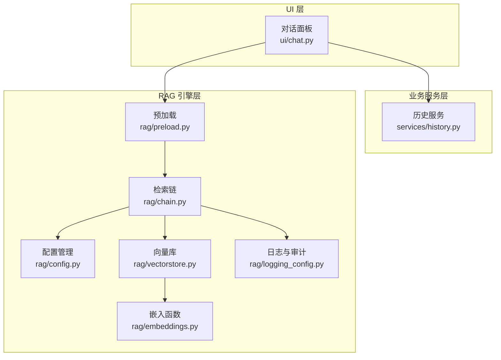
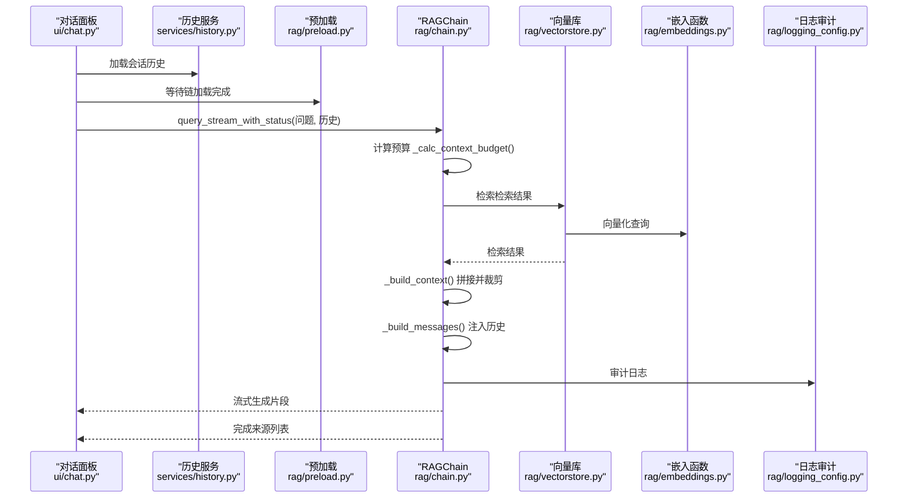
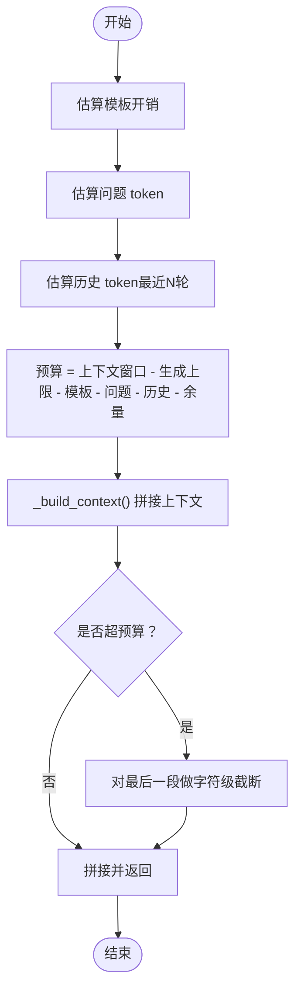
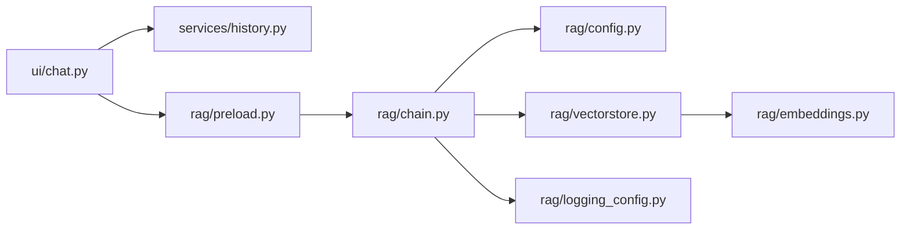

# 上下文构建与预算管理

<cite>
**本文引用的文件**
- [config.py](file://rag/config.py)
- [config.yaml](file://config.yaml)
- [chain.py](file://rag/chain.py)
- [vectorstore.py](file://rag/vectorstore.py)
- [embeddings.py](file://rag/embeddings.py)
- [preload.py](file://rag/preload.py)
- [chat.py](file://ui/chat.py)
- [history.py](file://services/history.py)
- [logging_config.py](file://rag/logging_config.py)
- [test_chain.py](file://tests/test_chain.py)
</cite>

## 目录
1. [简介](#简介)
2. [项目结构](#项目结构)
3. [核心组件](#核心组件)
4. [架构总览](#架构总览)
5. [详细组件分析](#详细组件分析)
6. [依赖关系分析](#依赖关系分析)
7. [性能考量](#性能考量)
8. [故障排查指南](#故障排查指南)
9. [结论](#结论)
10. [附录](#附录)

## 简介
本技术文档聚焦“上下文构建与预算管理”，围绕以下主题展开：
- 上下文窗口限制与令牌预算计算策略
- 内容裁剪与拼接格式
- 多轮对话历史注入方法
- 令牌估算算法、消息构建流程
- 来源信息提取与兜底策略
- 预算分配最佳实践与性能优化技巧

目标是帮助开发者深入理解系统如何在有限上下文内高效组织检索结果、注入历史、并稳定生成高质量回答。

## 项目结构
本项目采用“UI 层 + 业务服务层 + 检索增强生成（RAG）引擎”三层架构：
- UI 层：Streamlit 页面与对话面板
- 业务服务层：历史管理、速率限制、分析统计
- RAG 引擎层：配置、向量库、嵌入、检索链、日志审计

图表来源
- [chat.py:19-190](file://ui/chat.py#L19-L190)
- [history.py:1-270](file://services/history.py#L1-L270)
- [preload.py:1-73](file://rag/preload.py#L1-L73)
- [chain.py:174-651](file://rag/chain.py#L174-L651)
- [vectorstore.py:24-209](file://rag/vectorstore.py#L24-L209)
- [embeddings.py:19-48](file://rag/embeddings.py#L19-L48)
- [config.py:103-185](file://rag/config.py#L103-L185)
- [logging_config.py:86-129](file://rag/logging_config.py#L86-L129)

章节来源
- [chat.py:19-190](file://ui/chat.py#L19-L190)
- [history.py:1-270](file://services/history.py#L1-L270)
- [preload.py:1-73](file://rag/preload.py#L1-L73)
- [chain.py:174-651](file://rag/chain.py#L174-L651)
- [vectorstore.py:24-209](file://rag/vectorstore.py#L24-L209)
- [embeddings.py:19-48](file://rag/embeddings.py#L19-L48)
- [config.py:103-185](file://rag/config.py#L103-L185)
- [logging_config.py:86-129](file://rag/logging_config.py#L86-L129)

## 核心组件
- 配置与预算参数
  - LLM 上下文窗口、最大生成 token、温度、模型等
  - 向量库 top_k、距离阈值
  - 多轮对话轮数上限
- 检索链（RAGChain）
  - 查询改写、混合检索（向量+BM25）、RRF 融合、交叉编码重排
  - 令牌预算计算、上下文拼接、消息构建、流式/非流式 LLM 调用
- 向量库与嵌入
  - ChromaDB 持久化、中文嵌入函数、集合管理
- 历史与会话
  - 多会话管理、消息持久化、导出
- 预加载与状态
  - 后台线程加载 RAGChain，避免每次 rerun 重置
- 日志与审计
  - 结构化日志、审计日志记录

章节来源
- [config.py:48-117](file://rag/config.py#L48-L117)
- [chain.py:174-651](file://rag/chain.py#L174-L651)
- [vectorstore.py:24-209](file://rag/vectorstore.py#L24-L209)
- [embeddings.py:19-48](file://rag/embeddings.py#L19-L48)
- [history.py:19-153](file://services/history.py#L19-L153)
- [preload.py:22-73](file://rag/preload.py#L22-L73)
- [logging_config.py:46-129](file://rag/logging_config.py#L46-L129)

## 架构总览
RAGChain 作为核心，负责：
- 从配置读取上下文窗口与生成上限
- 计算可用 token 预算
- 拼接检索结果为上下文，必要时截断
- 注入多轮对话历史
- 构建最终消息序列并调用 LLM

图表来源
- [chat.py:96-190](file://ui/chat.py#L96-L190)
- [history.py:182-191](file://services/history.py#L182-L191)
- [preload.py:22-59](file://rag/preload.py#L22-L59)
- [chain.py:437-569](file://rag/chain.py#L437-L569)
- [vectorstore.py:124-142](file://rag/vectorstore.py#L124-L142)
- [embeddings.py:41-47](file://rag/embeddings.py#L41-L47)
- [logging_config.py:86-129](file://rag/logging_config.py#L86-L129)

## 详细组件分析

### 令牌估算与预算计算
- 估算策略
  - 使用字符/token 比率常量进行估算，便于快速预算分配
  - 估算函数用于模板开销、问题、历史、上下文等各部分
- 预算计算
  - 预算 = 上下文窗口 − 最大生成 token − 模板开销 − 问题 token − 历史 token − 安全余量
  - 历史仅取最近若干轮，避免过度占用预算
- 截断策略
  - 逐条拼接上下文，超过预算即停止；若剩余空间足够，对最后一段进行字符级截断并提示“已截断”

图表来源
- [chain.py:405-417](file://rag/chain.py#L405-L417)
- [chain.py:346-390](file://rag/chain.py#L346-L390)

章节来源
- [chain.py:184](file://rag/chain.py#L184)
- [chain.py:405-417](file://rag/chain.py#L405-L417)
- [chain.py:346-390](file://rag/chain.py#L346-L390)
- [test_chain.py:96-109](file://tests/test_chain.py#L96-L109)
- [test_chain.py:126-147](file://tests/test_chain.py#L126-L147)

### 上下文拼接格式与内容截断
- 拼接格式
  - 每条检索结果包含“来源 + 标题 + 内容”
  - 多条之间以分隔线连接
- 截断策略
  - 低置信度场景：在最前插入强提醒，强调必须遵循“无关即拒绝”的规则
  - 超预算时：优先保留高相关度结果；对最后一条进行字符级截断，并追加“已截断”提示
- 来源提取
  - 去重收集来源与标题，用于最终展示

章节来源
- [chain.py:346-390](file://rag/chain.py#L346-L390)
- [chain.py:391-403](file://rag/chain.py#L391-L403)

### 多轮对话历史注入
- 历史来源
  - UI 将当前会话的消息列表（除最新回答外）传递给 RAGChain
- 注入策略
  - 仅注入最近若干轮（由配置决定），并对每条内容做长度限制
- 会话管理
  - 支持多会话、标题更新、导出为 Markdown/JSON

章节来源
- [chat.py:136-142](file://ui/chat.py#L136-L142)
- [chain.py:419-435](file://rag/chain.py#L419-L435)
- [history.py:73-90](file://services/history.py#L73-L90)
- [history.py:182-191](file://services/history.py#L182-L191)

### LLM 调用与兜底策略
- 主流程
  - 若检索命中：构建上下文与消息，流式调用 LLM，失败则降级为非流式
- 兜底策略
  - 若无检索命中：使用“通用知识兜底”系统提示，允许 LLM 基于自身知识回答，但需标注来源
- 审计日志
  - 记录查询、结果数、耗时、摘要等，便于运营与合规

章节来源
- [chain.py:478-512](file://rag/chain.py#L478-L512)
- [chain.py:570-643](file://rag/chain.py#L570-L643)
- [logging_config.py:86-129](file://rag/logging_config.py#L86-L129)

### 配置与参数
- 关键参数
  - LLM：上下文窗口、最大生成 token、温度、模型
  - 向量库：top_k、距离阈值、集合名、持久化目录
  - 知识库：文档目录、分块大小、重叠
  - 多轮对话：最大轮数
  - 速率限制：启用、每分钟请求数、最大输入长度
- 配置来源
  - YAML 文件与环境变量替换
  - 运行时单例访问与热重载

章节来源
- [config.py:48-117](file://rag/config.py#L48-L117)
- [config.yaml:4-50](file://config.yaml#L4-L50)
- [config.py:118-152](file://rag/config.py#L118-L152)

### 向量库与嵌入
- 向量库
  - ChromaDB 持久化、集合管理、文档增删查、统计信息
- 嵌入
  - 中文嵌入函数封装，支持在线/离线模型加载
- 全局缓存
  - 相同配置仅创建一次 VectorStore 实例，避免重复加载嵌入模型

章节来源
- [vectorstore.py:24-209](file://rag/vectorstore.py#L24-L209)
- [embeddings.py:19-48](file://rag/embeddings.py#L19-L48)

### 预加载与状态
- 后台线程加载 RAGChain，避免 Streamlit rerun 导致状态丢失
- 提供完成状态、错误信息、重置能力

章节来源
- [preload.py:22-73](file://rag/preload.py#L22-L73)

## 依赖关系分析
- 组件耦合
  - RAGChain 依赖配置、向量库、日志；向量库依赖嵌入函数
  - UI 依赖历史服务与预加载；通过会话 ID 与历史交互
- 外部依赖
  - OpenAI SDK、ChromaDB、sentence-transformers、Streamlit
- 循环依赖
  - 未发现循环依赖

图表来源
- [chat.py:19-190](file://ui/chat.py#L19-L190)
- [history.py:1-270](file://services/history.py#L1-270)
- [preload.py:1-73](file://rag/preload.py#L1-L73)
- [chain.py:174-651](file://rag/chain.py#L174-L651)
- [config.py:103-185](file://rag/config.py#L103-L185)
- [vectorstore.py:24-209](file://rag/vectorstore.py#L24-L209)
- [embeddings.py:19-48](file://rag/embeddings.py#L19-L48)
- [logging_config.py:86-129](file://rag/logging_config.py#L86-L129)

## 性能考量
- 令牌估算
  - 使用固定字符/token 比率，简单高效；对于复杂格式（如代码块、表格）可能与真实 token 存在偏差，建议结合实际模型 tokenizer 进行校准
- 预算分配
  - 模板开销与历史占用需预留安全余量；建议在高复杂度任务中适当降低历史轮数或增大余量
- 检索与重排
  - 向量检索 + BM25 + RRF 融合提升召回质量；Cross-Encoder 重排可显著提升相关性，但首次加载较慢，利用类级缓存避免重复加载
- 流式输出
  - 优先使用流式 LLM 调用，失败时再降级为非流式；指数退避重试提高稳定性
- 向量库与嵌入
  - 全局缓存 VectorStore 与嵌入模型，避免重复初始化；首次加载时间较长，可通过预加载缩短等待

章节来源
- [chain.py:184](file://rag/chain.py#L184)
- [chain.py:405-417](file://rag/chain.py#L405-L417)
- [chain.py:314-344](file://rag/chain.py#L314-L344)
- [chain.py:570-643](file://rag/chain.py#L570-L643)
- [vectorstore.py:181-209](file://rag/vectorstore.py#L181-L209)
- [preload.py:22-59](file://rag/preload.py#L22-L59)

## 故障排查指南
- 初始化失败
  - 检查 LLM API 配置与网络连通性；通过重试按钮触发重新加载
- 检索无结果
  - 确认知识库已入库、分块参数合理、距离阈值设置恰当；可尝试降低阈值或调整查询
- 回答质量不佳
  - 调整检索 top_k、启用/禁用 Reranker、增加历史轮数或放宽输入长度限制
- 超时或空内容
  - 查看审计日志定位耗时与错误详情；必要时降低生成上限或扩大上下文窗口
- 日志审计
  - 审计日志位于 logs/audit/ 年-月-日.jsonl，包含查询、结果数、耗时、摘要等字段

章节来源
- [chat.py:37-44](file://ui/chat.py#L37-L44)
- [chain.py:478-512](file://rag/chain.py#L478-L512)
- [logging_config.py:86-129](file://rag/logging_config.py#L86-L129)

## 结论
本系统通过“预算驱动的上下文构建”与“多轮历史注入”实现了在有限上下文窗口内的高效检索与生成。关键在于：
- 明确的预算计算与安全余量
- 精准的上下文拼接与截断策略
- 多源检索融合与重排
- 稳定的流式调用与兜底机制

建议在生产环境中结合实际模型 tokenizer 校准估算精度，并持续监控审计日志以优化参数与策略。

## 附录

### 配置参数参考
- LLM
  - 上下文窗口、最大生成 token、温度、模型
- 向量库
  - top_k、距离阈值、集合名、持久化目录
- 知识库
  - 文档目录、分块大小、重叠
- 多轮对话
  - 最大轮数
- 速率限制
  - 启用、每分钟请求数、最大输入长度

章节来源
- [config.py:48-117](file://rag/config.py#L48-L117)
- [config.yaml:4-50](file://config.yaml#L4-L50)

### 代码示例路径（不含具体代码内容）
- 配置加载与单例访问
  - [get_config:139-144](file://rag/config.py#L139-L144)
  - [reload_config:147-151](file://rag/config.py#L147-L151)
- 预算计算
  - [_calc_context_budget:405-417](file://rag/chain.py#L405-L417)
- 上下文拼接与截断
  - [_build_context:346-390](file://rag/chain.py#L346-L390)
- 消息构建与历史注入
  - [_build_messages:419-435](file://rag/chain.py#L419-L435)
- LLM 调用与兜底
  - [query_stream_with_status:437-569](file://rag/chain.py#L437-L569)
  - [FALLBACK_SYSTEM_PROMPT:39-48](file://rag/chain.py#L39-L48)
- 向量库与嵌入
  - [VectorStore.from_config:181-209](file://rag/vectorstore.py#L181-L209)
  - [ChineseEmbeddingFunction:19-48](file://rag/embeddings.py#L19-L48)
- 历史与会话
  - [load_session_history:182-191](file://services/history.py#L182-L191)
  - [update_session_title:92-113](file://services/history.py#L92-L113)
- 预加载
  - [start:22-31](file://rag/preload.py#L22-L31)
  - [get_chain:56-58](file://rag/preload.py#L56-L58)
- 审计日志
  - [audit_log:86-129](file://rag/logging_config.py#L86-L129)