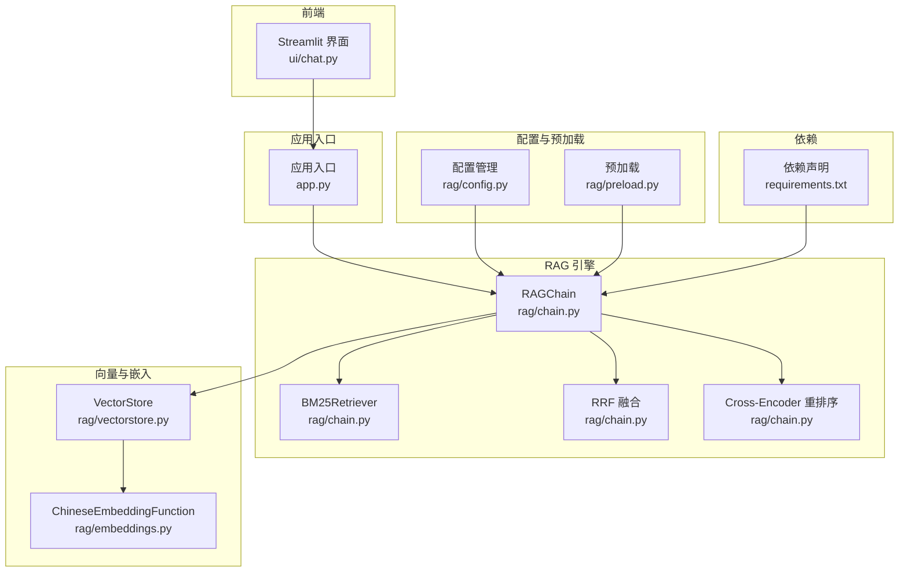
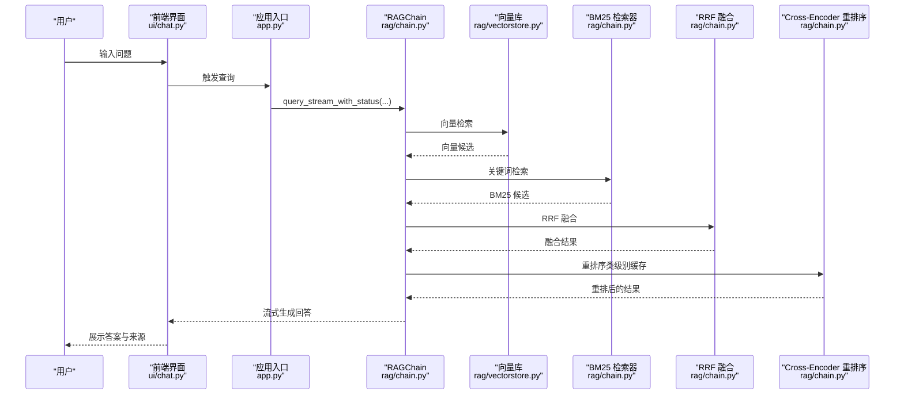
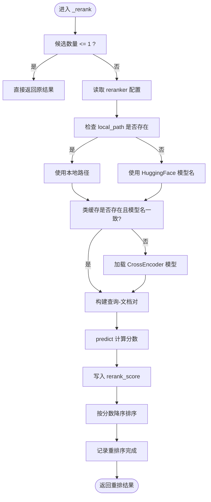
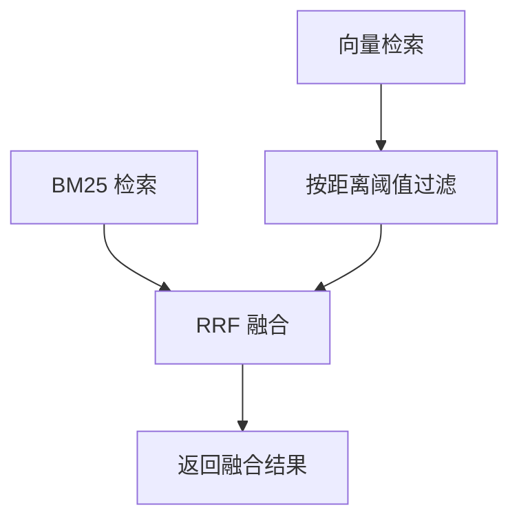
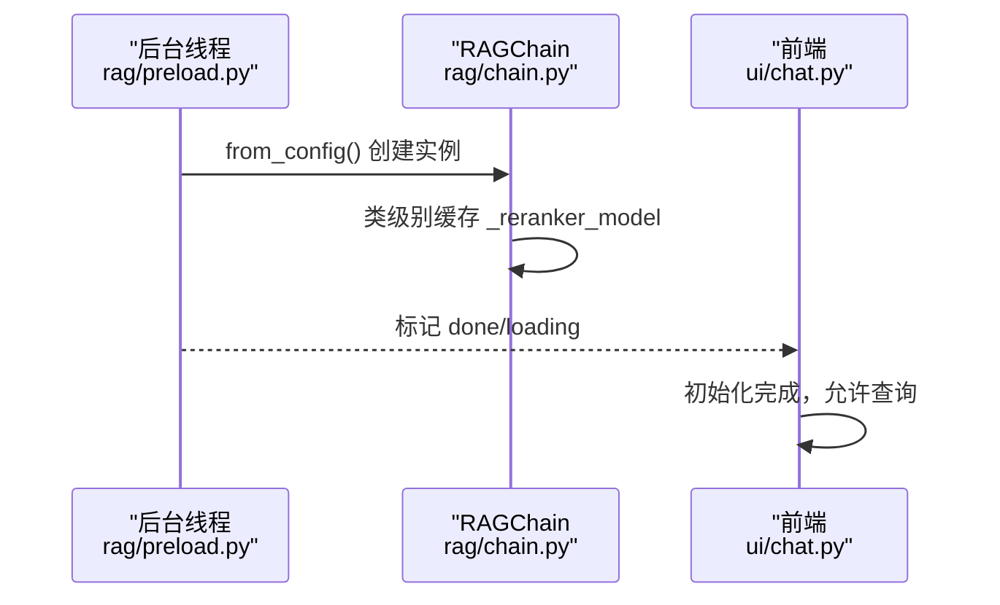
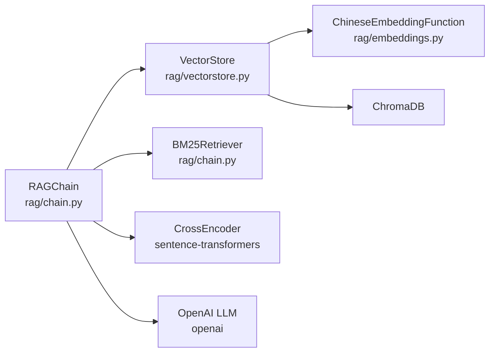

# 交叉编码器重排序

<cite>
**本文引用的文件**
- [rag/chain.py](file://rag/chain.py)
- [rag/config.py](file://rag/config.py)
- [config.yaml](file://config.yaml)
- [requirements.txt](file://requirements.txt)
- [rag/preload.py](file://rag/preload.py)
- [rag/embeddings.py](file://rag/embeddings.py)
- [rag/vectorstore.py](file://rag/vectorstore.py)
- [ui/chat.py](file://ui/chat.py)
- [app.py](file://app.py)
- [AGENTS.md](file://AGENTS.md)
- [tests/test_chain.py](file://tests/test_chain.py)
</cite>

## 更新摘要
**变更内容**
- 新增类级别缓存机制，避免重复加载交叉编码器模型
- 添加本地路径离线加载支持，提升部署灵活性
- 新增reranker配置选项，支持自定义模型路径
- 更新重排序实现流程，包含模型加载策略优化

## 目录
1. [简介](#简介)
2. [项目结构](#项目结构)
3. [核心组件](#核心组件)
4. [架构总览](#架构总览)
5. [详细组件分析](#详细组件分析)
6. [依赖分析](#依赖分析)
7. [性能考量](#性能考量)
8. [故障排查指南](#故障排查指南)
9. [结论](#结论)
10. [附录](#附录)

## 简介
本技术文档围绕"交叉编码器重排序"（Cross-Encoder Reranker）展开，系统阐述其在检索增强生成（RAG）链路中的作用、实现细节、性能优化策略与工程实践。重点包括：
- Cross-Encoder 模型工作原理与 BAAI/bge-reranker-base 的选择理由
- 类级别缓存机制与模型加载/缓存管理
- 查询-文档对构建、相似度分数计算与结果排序算法
- RRF 融合与混合检索的整体流程
- 配置项解读、异常处理与性能优化建议
- 重排序对检索质量的提升、缓存策略的内存管理与局限性

## 项目结构
与交叉编码器重排序直接相关的模块与文件如下：
- 检索链与重排序：[rag/chain.py](file://rag/chain.py)
- 配置管理：[rag/config.py](file://rag/config.py)、[config.yaml](file://config.yaml)
- 预加载与后台初始化：[rag/preload.py](file://rag/preload.py)
- 向量与嵌入：[rag/embeddings.py](file://rag/embeddings.py)、[rag/vectorstore.py](file://rag/vectorstore.py)
- 前端集成与调用：[ui/chat.py](file://ui/chat.py)、[app.py](file://app.py)
- 依赖声明：[requirements.txt](file://requirements.txt)
- 项目说明与要点：[AGENTS.md](file://AGENTS.md)
- 单元测试（含 RRF 与 Token 估算等）：[tests/test_chain.py](file://tests/test_chain.py)

**图表来源**
- [rag/chain.py:174-344](file://rag/chain.py#L174-L344)
- [rag/vectorstore.py:24-209](file://rag/vectorstore.py#L24-L209)
- [rag/embeddings.py:19-48](file://rag/embeddings.py#L19-L48)
- [rag/config.py:103-185](file://rag/config.py#L103-L185)
- [rag/preload.py:22-73](file://rag/preload.py#L22-L73)
- [requirements.txt:1-11](file://requirements.txt#L1-L11)

**章节来源**
- [rag/chain.py:1-691](file://rag/chain.py#L1-L691)
- [rag/config.py:1-199](file://rag/config.py#L1-L199)
- [config.yaml:1-62](file://config.yaml#L1-L62)
- [requirements.txt:1-12](file://requirements.txt#L1-L12)
- [rag/preload.py:1-73](file://rag/preload.py#L1-L73)
- [rag/embeddings.py:1-48](file://rag/embeddings.py#L1-L48)
- [rag/vectorstore.py:1-209](file://rag/vectorstore.py#L1-L209)
- [ui/chat.py:1-190](file://ui/chat.py#L1-L190)
- [app.py:1-189](file://app.py#L1-L189)
- [AGENTS.md:1-76](file://AGENTS.md#L1-L76)
- [tests/test_chain.py:1-161](file://tests/test_chain.py#L1-L161)

## 核心组件
- Cross-Encoder 重排序器（Reranker）
  - 作用：对检索候选进行细粒度打分与重排，显著提升检索质量
  - 模型：BAAI/bge-reranker-base（本地加载，类级别缓存）
  - 实现位置：[rag/chain.py](file://rag/chain.py) 中的 _rerank 方法
- 混合检索与 RRF 融合
  - 向量检索 + BM25 关键词检索 + RRF 融合，提升召回与排序稳定性
  - 实现位置：[rag/chain.py](file://rag/chain.py) 中的 _retrieve 与 reciprocal_rank_fusion
- 类级别缓存与预加载
  - 避免每次查询重复加载模型，降低延迟与资源消耗
  - 预加载：[rag/preload.py](file://rag/preload.py)；类缓存：[rag/chain.py](file://rag/chain.py)
- 配置与依赖
  - 配置：[rag/config.py](file://rag/config.py)、[config.yaml](file://config.yaml)
  - 依赖：[requirements.txt](file://requirements.txt)

**章节来源**
- [rag/chain.py:349-388](file://rag/chain.py#L349-L388)
- [rag/preload.py:22-73](file://rag/preload.py#L22-L73)
- [rag/config.py:64-68](file://rag/config.py#L64-L68)
- [config.yaml:22-27](file://config.yaml#L22-L27)
- [requirements.txt:1-12](file://requirements.txt#L1-L12)

## 架构总览
下图展示了从用户输入到最终回答的完整流程，突出交叉编码器重排序在检索链路中的关键位置。

**图表来源**
- [ui/chat.py:150-184](file://ui/chat.py#L150-L184)
- [rag/chain.py:481-608](file://rag/chain.py#L481-L608)
- [rag/chain.py:276-347](file://rag/chain.py#L276-L347)
- [rag/chain.py:349-388](file://rag/chain.py#L349-L388)
- [rag/vectorstore.py:57-142](file://rag/vectorstore.py#L57-L142)

## 详细组件分析

### Cross-Encoder 重排序器（Reranker）
- 工作原理
  - 将"查询-文档"对拼接为成对输入，调用 CrossEncoder.predict 计算相关性分数
  - 依据分数对候选进行降序排序，得到最终排序结果
- 模型选择：BAAI/bge-reranker-base
  - 本地可加载、推理快速、中文场景表现良好，适合企业内部署
- 类级别缓存策略
  - 首次或模型名变更时加载；后续查询复用已加载模型，避免重复 IO
  - 缓存字段：_reranker_model、_reranker_model_name
- 本地路径离线加载
  - 支持从配置的 local_path 离线加载模型，提升部署灵活性
  - 优先使用本地路径，否则回退到 HuggingFace 模型名在线下载
- 异常处理
  - 捕获加载与预测异常，记录日志并跳过重排序，保证主流程可用

**图表来源**
- [rag/chain.py:349-388](file://rag/chain.py#L349-L388)

**章节来源**
- [rag/chain.py:349-388](file://rag/chain.py#L349-L388)

### 混合检索与 RRF 融合
- 向量检索
  - 使用向量库检索候选，并按距离阈值过滤低相关度
- BM25 关键词检索
  - 作为向量检索的补充，覆盖语义盲点
- RRF 融合
  - 使用倒数排名融合公式，结合内容哈希去重，综合排序

**图表来源**
- [rag/chain.py:276-347](file://rag/chain.py#L276-L347)
- [rag/chain.py:158-186](file://rag/chain.py#L158-L186)
- [rag/chain.py:153-155](file://rag/chain.py#L153-L155)

**章节来源**
- [rag/chain.py:276-347](file://rag/chain.py#L276-L347)
- [rag/chain.py:158-186](file://rag/chain.py#L158-L186)
- [rag/chain.py:153-155](file://rag/chain.py#L153-L155)

### 类级别缓存与预加载
- 类级别缓存
  - RAGChain 类内静态缓存 _reranker_model，避免重复加载
  - 仅在首次或模型名变化时触发加载
- 预加载
  - 后台线程加载 RAGChain，提升首屏体验
  - 前端轮询状态，加载完成后方可交互

**图表来源**
- [rag/preload.py:33-48](file://rag/preload.py#L33-L48)
- [rag/chain.py:205-222](file://rag/chain.py#L205-L222)
- [ui/chat.py:24-45](file://ui/chat.py#L24-L45)

**章节来源**
- [rag/preload.py:22-73](file://rag/preload.py#L22-L73)
- [rag/chain.py:201-203](file://rag/chain.py#L201-L203)
- [ui/chat.py:24-45](file://ui/chat.py#L24-L45)

### 配置与依赖
- 配置项
  - 向量库：top_k、distance_threshold 等
  - LLM：api_base、model、temperature、max_tokens、context_window
  - 知识库：docs_directory、chunk_size、chunk_overlap
  - **新增** 重排序：model、local_path
- 依赖
  - sentence-transformers：CrossEncoder 与 SentenceTransformer
  - chromadb：向量库
  - openai：LLM 调用

**章节来源**
- [rag/config.py:48-199](file://rag/config.py#L48-L199)
- [config.yaml:8-41](file://config.yaml#L8-L41)
- [requirements.txt:1-12](file://requirements.txt#L1-L12)

### 前端集成与调用
- 前端通过 query_stream_with_status 流式接收"searching/generating/done/error"状态
- 重排序在"generating"阶段之后进行，不影响前端状态流转

**章节来源**
- [ui/chat.py:150-184](file://ui/chat.py#L150-L184)
- [rag/chain.py:481-608](file://rag/chain.py#L481-L608)

## 依赖分析
- 模块耦合
  - RAGChain 依赖 VectorStore、BM25Retriever、CrossEncoder
  - VectorStore 依赖 ChineseEmbeddingFunction 与 ChromaDB
- 外部依赖
  - sentence-transformers：模型加载与推理
  - chromadb：向量检索与持久化
  - openai：LLM 调用

**图表来源**
- [rag/chain.py:174-344](file://rag/chain.py#L174-L344)
- [rag/vectorstore.py:24-209](file://rag/vectorstore.py#L24-L209)
- [rag/embeddings.py:19-48](file://rag/embeddings.py#L19-L48)
- [requirements.txt:1-12](file://requirements.txt#L1-L12)

**章节来源**
- [rag/chain.py:174-344](file://rag/chain.py#L174-L344)
- [rag/vectorstore.py:24-209](file://rag/vectorstore.py#L24-L209)
- [rag/embeddings.py:19-48](file://rag/embeddings.py#L19-L48)
- [requirements.txt:1-12](file://requirements.txt#L1-L12)

## 性能考量
- 类级别缓存
  - 避免重复加载模型，显著降低延迟与显存占用
  - 适用于高并发场景，建议保持模型版本稳定
- 预加载
  - 后台线程异步加载，提升首屏体验
  - 前端轮询状态，加载完成后才允许查询
- 检索与融合
  - 向量检索 + BM25 + RRF 融合，兼顾召回与排序稳定性
  - 距离阈值过滤低相关度，减少下游 LLM 负担
- 上下文构建与裁剪
  - 基于 token 估算与预算分配，动态裁剪内容，避免越界
- LLM 调用
  - 流式优先，失败自动降级为非流式；带指数退避重试
- **新增** 本地路径加载优化
  - 支持离线部署，避免网络依赖
  - 提升部署灵活性和安全性

**章节来源**
- [rag/chain.py:201-203](file://rag/chain.py#L201-L203)
- [rag/preload.py:22-73](file://rag/preload.py#L22-L73)
- [rag/chain.py:276-347](file://rag/chain.py#L276-L347)
- [rag/chain.py:390-433](file://rag/chain.py#L390-L433)
- [rag/chain.py:610-683](file://rag/chain.py#L610-L683)

## 故障排查指南
- 重排序不可用
  - 现象：日志显示"Reranker 不可用，跳过"
  - 可能原因：模型加载失败、predict 异常
  - 处理：检查网络与模型缓存、确认 sentence-transformers 版本
- 模型加载缓慢
  - 现象：首次查询耗时较长
  - 可能原因：模型首次下载/解码
  - 处理：使用预加载、离线模型路径或镜像加速
- **新增** 本地路径加载失败
  - 现象：本地模型路径不存在或加载失败
  - 可能原因：local_path 配置错误、权限问题、模型文件损坏
  - 处理：检查 config.yaml 中的 reranker.local_path 配置、确认文件路径正确、验证模型完整性
- 向量检索无结果
  - 现象：向量检索为空，回退至 BM25
  - 处理：检查向量库是否已入库、embedding 是否正常
- LLM 调用失败
  - 现象：流式/非流式均失败
  - 处理：检查 API 配置、网络连通性、重试策略

**章节来源**
- [rag/chain.py:385-387](file://rag/chain.py#L385-L387)
- [rag/chain.py:471-476](file://rag/chain.py#L471-L476)
- [rag/chain.py:610-683](file://rag/chain.py#L610-L683)
- [rag/preload.py:42-48](file://rag/preload.py#L42-L48)

## 结论
交叉编码器重排序通过细粒度相关性打分，有效提升了检索质量与 LLM 生成的准确性。配合类级别缓存与预加载机制，系统在性能与稳定性方面达到良好平衡。**新增的本地路径离线加载功能**进一步提升了部署灵活性和安全性。建议在生产环境中：
- 固定模型版本，充分利用类缓存
- 使用预加载提升首屏体验
- 合理设置 top_k 与距离阈值，控制上下文规模
- **新增** 在离线环境中配置 reranker.local_path，避免网络依赖
- 持续监控 LLM 调用与重排序异常，完善告警与降级策略

## 附录
- 配置项速查
  - 向量库：top_k、distance_threshold、persist_directory、collection_name
  - LLM：api_base、api_key、model、temperature、max_tokens、context_window
  - 知识库：docs_directory、chunk_size、chunk_overlap
  - **新增** 重排序：model、local_path
- 依赖版本参考
  - sentence-transformers、chromadb、openai 等

**章节来源**
- [rag/config.py:48-199](file://rag/config.py#L48-L199)
- [config.yaml:8-41](file://config.yaml#L8-L41)
- [requirements.txt:1-12](file://requirements.txt#L1-L12)