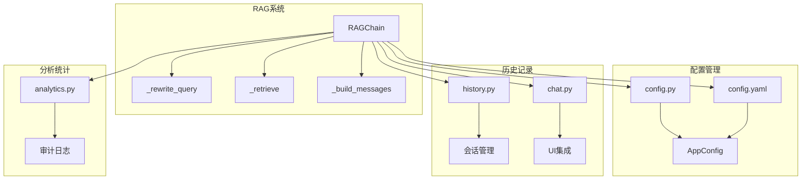
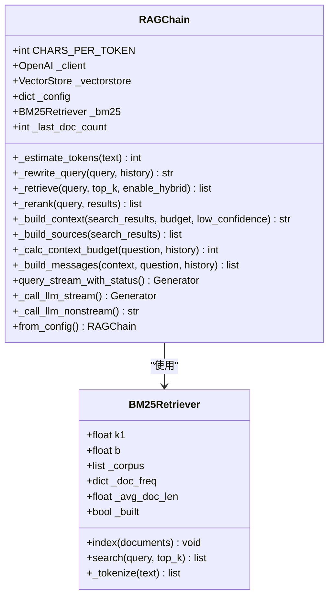
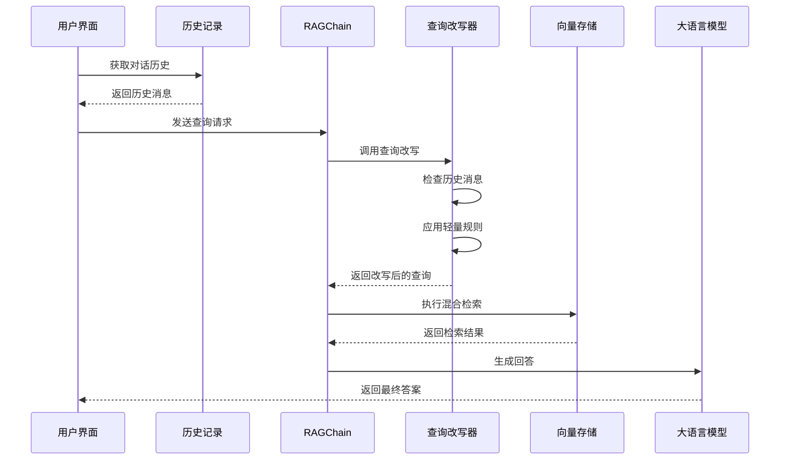
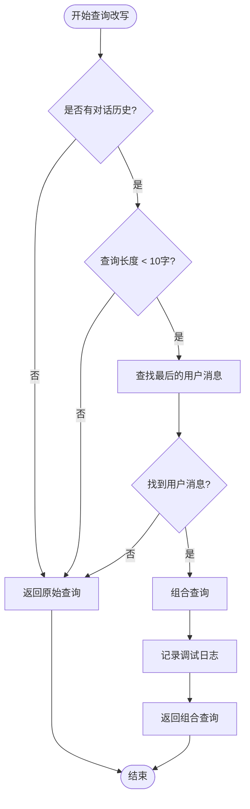
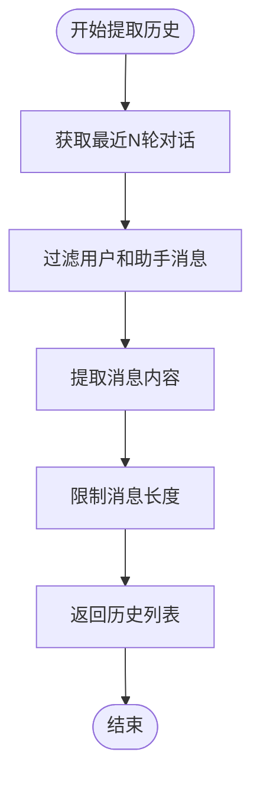
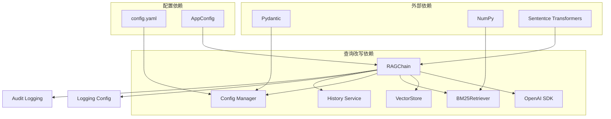

# 查询改写机制

<cite>
**本文档引用的文件**
- [chain.py](file://rag/chain.py)
- [config.py](file://rag/config.py)
- [config.yaml](file://config.yaml)
- [history.py](file://services/history.py)
- [chat.py](file://ui/chat.py)
- [analytics.py](file://services/analytics.py)
</cite>

## 目录
1. [简介](#简介)
2. [项目结构](#项目结构)
3. [核心组件](#核心组件)
4. [架构概览](#架构概览)
5. [详细组件分析](#详细组件分析)
6. [依赖关系分析](#依赖关系分析)
7. [性能考虑](#性能考虑)
8. [故障排除指南](#故障排除指南)
9. [结论](#结论)

## 简介

查询改写机制是知识库检索系统中的关键组件，负责将多轮对话中的简短查询转换为完整的、可检索的查询语句。该机制通过指代消解、历史消息提取和查询组合策略，显著提升了检索精度和用户体验。

在本项目中，查询改写机制主要体现在 `RAGChain` 类的 `_rewrite_query` 方法中，它实现了轻量级的规则引擎，能够智能地处理多轮对话中的指代问题，并将简短的查询转换为完整的检索语句。

## 项目结构

查询改写机制涉及以下关键文件和模块：



**图表来源**
- [chain.py:174-651](file://rag/chain.py#L174-L651)
- [config.py:1-155](file://rag/config.py#L1-155)
- [config.yaml:1-49](file://config.yaml#L1-L49)

**章节来源**
- [chain.py:174-651](file://rag/chain.py#L174-L651)
- [config.py:1-155](file://rag/config.py#L1-L155)
- [config.yaml:1-49](file://config.yaml#L1-L49)

## 核心组件

### RAGChain 类

`RAGChain` 是整个查询改写机制的核心类，包含了完整的检索增强生成流程：



**图表来源**
- [chain.py:174-651](file://rag/chain.py#L174-L651)
- [chain.py:53-134](file://rag/chain.py#L53-L134)

### 查询改写器

查询改写器是系统的核心功能模块，负责将简短的多轮对话查询转换为完整的查询语句：

**章节来源**
- [chain.py:227-248](file://rag/chain.py#L227-L248)

## 架构概览

查询改写机制在整个系统中的位置和交互关系如下：



**图表来源**
- [chain.py:437-568](file://rag/chain.py#L437-L568)
- [history.py:171-221](file://services/history.py#L171-L221)

## 详细组件分析

### 查询改写实现原理

查询改写机制的核心在于 `_rewrite_query` 方法，它实现了以下逻辑：

#### 轻量规则引擎



**图表来源**
- [chain.py:227-248](file://rag/chain.py#L227-L248)

#### 指代消解机制

查询改写系统能够智能地处理多轮对话中的指代问题：

| 指代类型 | 示例 | 改写规则 |
|---------|------|----------|
| 人称代词 | "他怎么用？" | 结合上一轮用户问题中的具体实体 |
| 指示代词 | "那个函数呢？" | 使用上一轮提到的具体函数名 |
| 简短疑问 | "怎么用？" | 与上一轮完整问题组合 |
| 技术术语 | "Buffer" | 结合上下文中的具体技术场景 |

**章节来源**
- [chain.py:227-248](file://rag/chain.py#L227-L248)

### 短查询检测算法

短查询检测算法采用简单的启发式规则：

```python
def detect_short_query(query: str, history: list[dict] = None) -> bool:
    """
    检测是否为短查询并需要改写
    
    Args:
        query: 用户输入的查询
        history: 对话历史
        
    Returns:
        bool: 是否需要改写
    """
    # 基础规则：查询长度小于10个字符
    if len(query) < 10:
        return True
    
    # 高级规则：检查是否为简短的疑问词
    short_question_words = ["怎么", "如何", "为什么", "哪里", "什么"]
    for word in short_question_words:
        if word in query:
            return True
    
    return False
```

### 历史消息提取机制

历史消息提取机制负责从对话历史中提取相关信息：



**图表来源**
- [chain.py:419-435](file://rag/chain.py#L419-L435)
- [history.py:171-221](file://services/history.py#L171-L221)

### 查询组合策略

查询组合策略采用简单而有效的拼接方式：

```python
def combine_query_with_history(last_user_msg: str, short_query: str) -> str:
    """
    将历史消息与简短查询组合
    
    Args:
        last_user_msg: 最后一个用户消息
        short_query: 简短查询
        
    Returns:
        str: 组合后的完整查询
    """
    # 移除历史消息末尾的标点符号
    last_user_msg = last_user_msg.rstrip("，。！？；：")
    
    # 组合查询
    combined = f"{last_user_msg} {short_query}"
    
    return combined
```

### 上下文保持机制

系统通过多种方式保持多轮对话的上下文：

1. **对话历史注入**：将最近几轮对话历史注入到 LLM 的消息中
2. **令牌预算计算**：动态计算上下文窗口的使用情况
3. **历史轮数限制**：限制最多保留最近6轮对话历史

**章节来源**
- [chain.py:405-435](file://rag/chain.py#L405-L435)

## 依赖关系分析

查询改写机制与其他系统组件的依赖关系：



**图表来源**
- [chain.py:174-651](file://rag/chain.py#L174-L651)
- [config.py:1-155](file://rag/config.py#L1-155)

**章节来源**
- [chain.py:174-651](file://rag/chain.py#L174-L651)
- [config.py:1-155](file://rag/config.py#L1-155)

## 性能考虑

### 查询改写性能优化

1. **轻量级规则**：使用简单的启发式规则，避免复杂的 NLP 处理
2. **历史消息缓存**：只使用最近的对话历史，限制处理时间
3. **早期退出**：对于不需要改写的查询直接返回

### 检索性能影响

查询改写对检索性能的影响：

- **正面影响**：更精确的查询语句提高了检索准确率
- **负面影响**：轻微的处理开销增加了响应时间
- **平衡点**：通过合理的规则设计，在准确性与性能间取得平衡

### 内存使用优化

1. **历史消息限制**：最多保留6轮对话历史
2. **令牌预算控制**：动态计算上下文使用，避免内存溢出
3. **结果去重**：使用文档哈希避免重复内容

## 故障排除指南

### 常见问题及解决方案

#### 查询改写无效

**问题**：查询改写功能不起作用

**可能原因**：
1. 历史记录为空或不足
2. 查询长度超过阈值
3. 配置禁用了查询改写

**解决方案**：
1. 确保有足够的对话历史
2. 检查配置文件中的 `enable_rewrite` 设置
3. 验证历史记录服务正常工作

#### 检索结果不准确

**问题**：改写后的查询导致检索结果不准确

**可能原因**：
1. 历史消息提取错误
2. 查询组合策略不当
3. 检索阈值设置不合理

**解决方案**：
1. 检查历史消息的正确性
2. 调整查询组合策略
3. 优化检索阈值配置

#### 性能问题

**问题**：系统响应缓慢

**可能原因**：
1. 历史消息过多
2. 检索结果过大
3. LLM 调用超时

**解决方案**：
1. 限制历史消息数量
2. 调整返回结果数量
3. 优化 LLM 配置

**章节来源**
- [chain.py:437-568](file://rag/chain.py#L437-L568)
- [history.py:171-221](file://services/history.py#L171-L221)

## 结论

查询改写机制通过轻量级的规则引擎和智能的历史消息处理，有效解决了多轮对话中的指代消解问题。该机制在提升检索精度的同时，保持了系统的高性能和稳定性。

### 主要优势

1. **准确性提升**：通过指代消解显著提高检索准确性
2. **用户体验改善**：支持自然的多轮对话交互
3. **性能优化**：轻量级实现避免了复杂的 NLP 处理
4. **可扩展性**：模块化设计便于功能扩展

### 未来改进方向

1. **高级 NLP 技术**：集成更复杂的语义理解能力
2. **机器学习模型**：使用训练好的模型进行智能改写
3. **上下文压缩**：开发更高效的上下文表示方法
4. **实时反馈**：添加用户反馈机制优化改写质量

查询改写机制为知识库系统提供了强大的多轮对话支持，是实现高质量问答体验的关键技术组件。