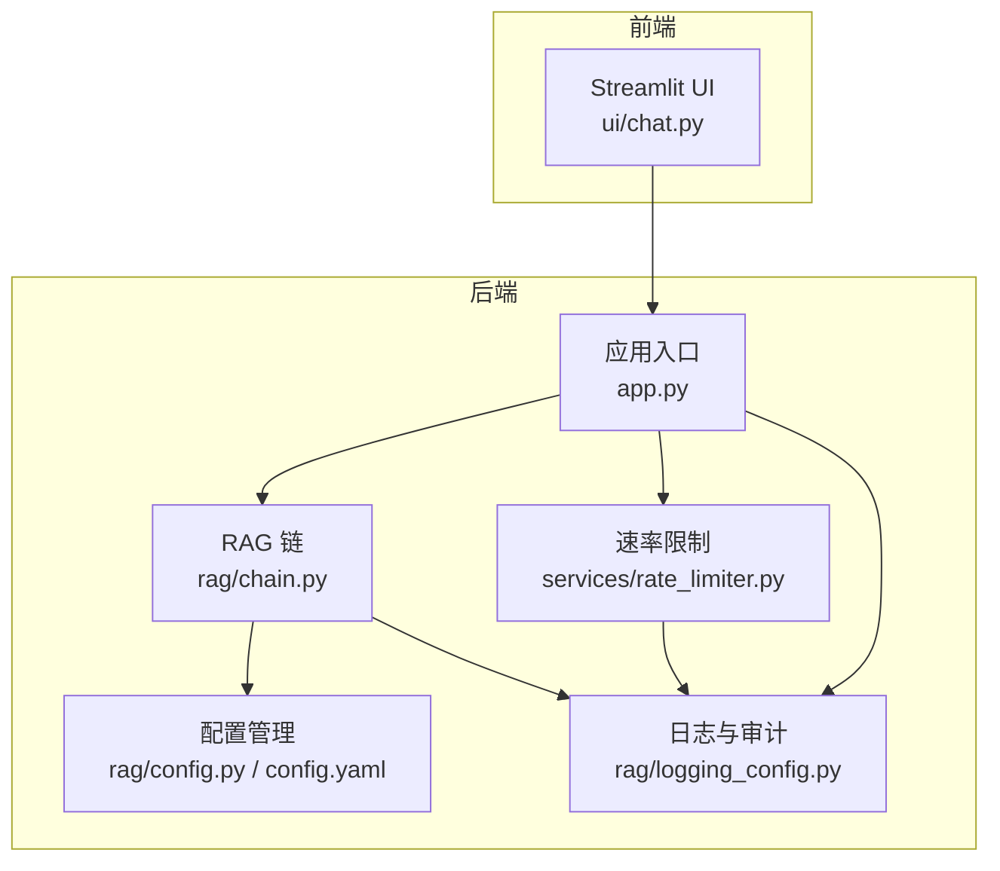
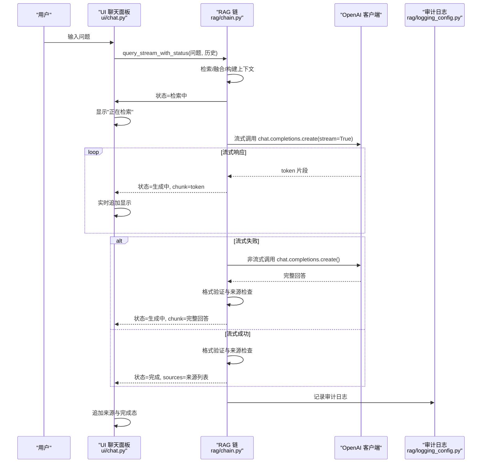
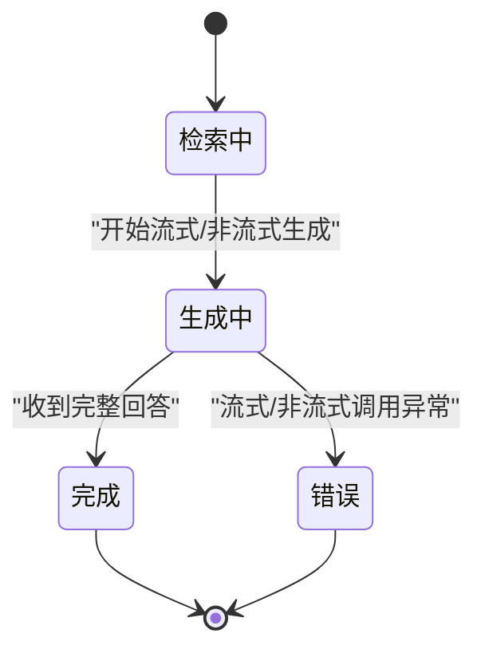
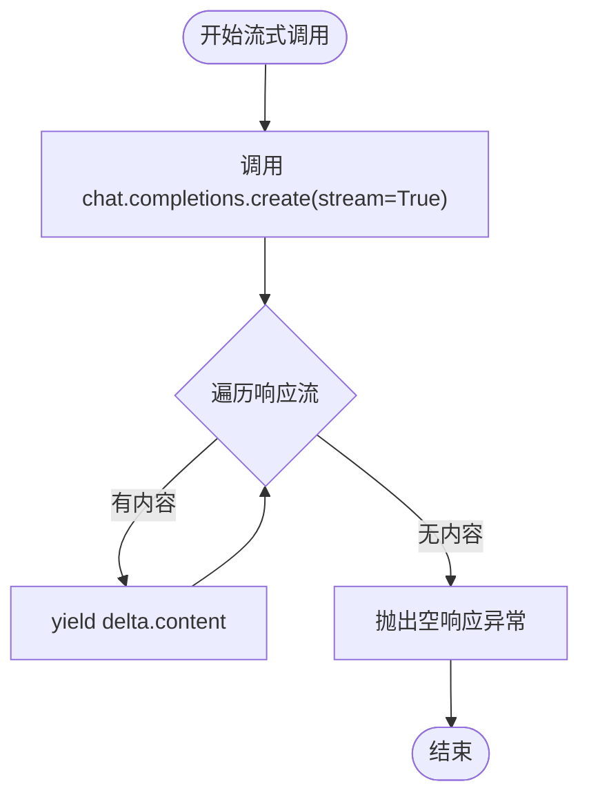
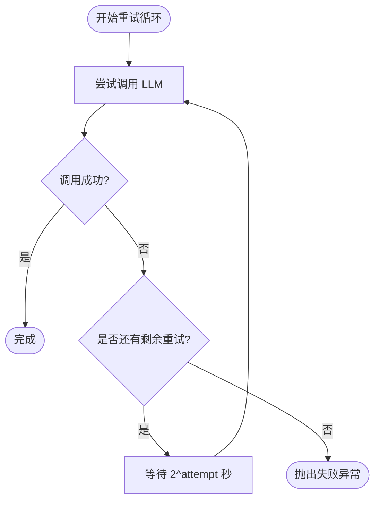
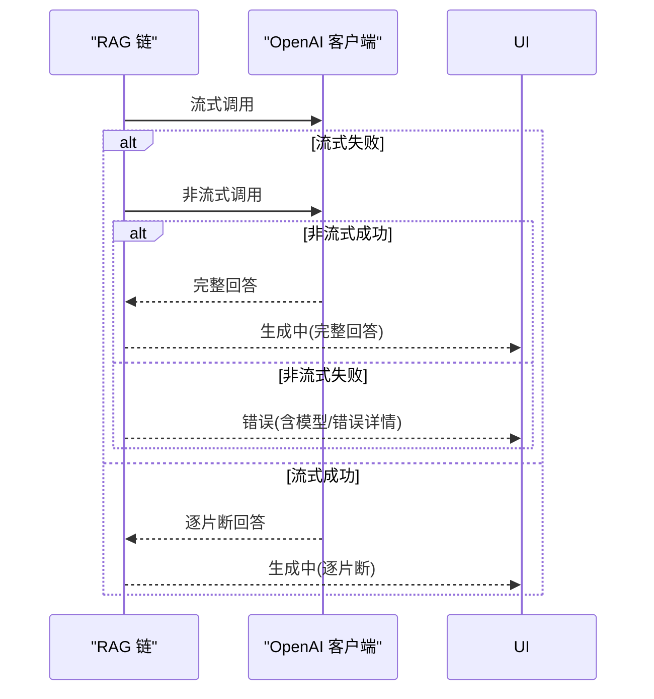
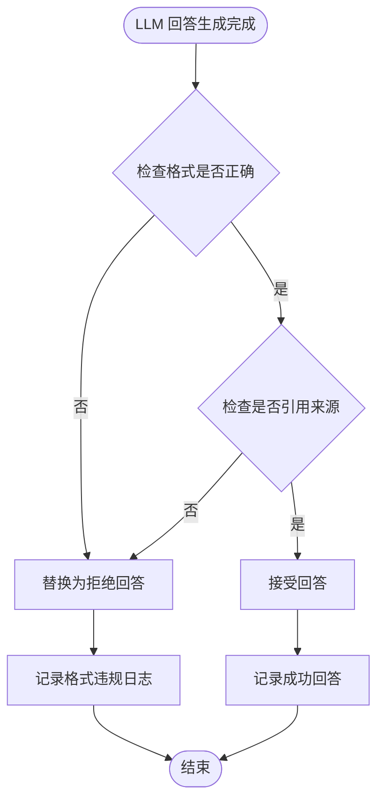
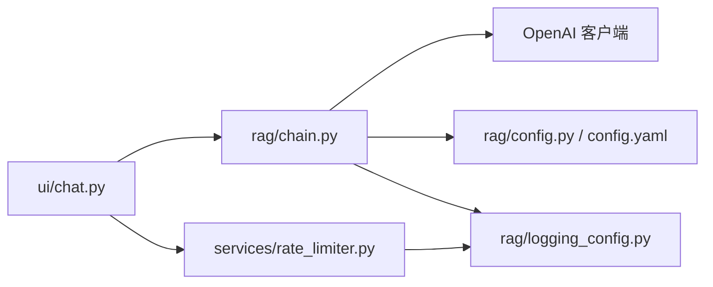

# 流式响应生成

<cite>
**本文引用的文件**
- [app.py](file://app.py)
- [config.yaml](file://config.yaml)
- [rag/config.py](file://rag/config.py)
- [rag/chain.py](file://rag/chain.py)
- [ui/chat.py](file://ui/chat.py)
- [services/rate_limiter.py](file://services/rate_limiter.py)
- [rag/logging_config.py](file://rag/logging_config.py)
- [tests/test_chain.py](file://tests/test_chain.py)
</cite>

## 更新摘要
**变更内容**
- 新增指数退避重试策略的详细实现
- 添加流式/非流式自动降级机制的完整流程
- 增强错误处理与格式验证机制
- 完善LLM调用的健壮性保障措施
- 更新流式响应生成的可靠性保障体系

## 目录
1. [简介](#简介)
2. [项目结构](#项目结构)
3. [核心组件](#核心组件)
4. [架构总览](#架构总览)
5. [详细组件分析](#详细组件分析)
6. [依赖分析](#依赖分析)
7. [性能考量](#性能考量)
8. [故障排除指南](#故障排除指南)
9. [结论](#结论)
10. [附录](#附录)

## 简介
本技术文档围绕"流式响应生成"展开，系统性阐述如下主题：
- 流式生成的实现原理与 OpenAI API 的流式调用机制
- 指数退避重试策略与非流式降级方案
- 流式响应的状态管理、token 片段处理、错误恢复机制
- 重试策略的指数增长算法与降级触发条件
- 配置生成参数、处理流式异常、优化生成性能的方法
- 流式生成对用户体验的改善、重试机制的可靠性保障、降级策略的容错能力
- **新增**：格式验证机制与来源引用检查，确保回答符合刚性格式要求

## 项目结构
该项目采用"UI 层 + 业务层 + 检索增强生成（RAG）链"的分层架构：
- UI 层：Streamlit 页面与聊天面板，负责实时渲染与交互
- 业务层：速率限制、审计日志、历史会话管理
- RAG 链：检索、融合、上下文构建、LLM 调用（含流式与非流式）

**图表来源**
- [app.py:54-90](file://app.py#L54-L90)
- [ui/chat.py:19-73](file://ui/chat.py#L19-L73)
- [rag/chain.py:437-568](file://rag/chain.py#L437-L568)
- [rag/config.py:139-144](file://rag/config.py#L139-L144)
- [services/rate_limiter.py:45-71](file://services/rate_limiter.py#L45-L71)
- [rag/logging_config.py:86-129](file://rag/logging_config.py#L86-L129)

**章节来源**
- [app.py:54-90](file://app.py#L54-L90)
- [ui/chat.py:19-73](file://ui/chat.py#L19-L73)
- [rag/chain.py:437-568](file://rag/chain.py#L437-L568)
- [rag/config.py:139-144](file://rag/config.py#L139-L144)
- [services/rate_limiter.py:45-71](file://services/rate_limiter.py#L45-L71)
- [rag/logging_config.py:86-129](file://rag/logging_config.py#L86-L129)

## 核心组件
- 流式生成状态机：在 UI 中以"检索中/生成中/完成/错误"四态推进，实时更新回答
- 指数退避重试：对流式与非流式调用分别实施最多 N 次重试，等待时间呈 2^attempt 指数增长
- 非流式降级：当流式调用失败时，自动回退至一次性非流式调用
- **新增**：格式验证机制：严格检查回答是否符合刚性格式要求，确保以"知识库回答"或"拒绝回答"开头
- **新增**：来源引用检查：验证回答是否引用了知识库中的具体文档来源
- 审计日志：记录查询耗时、检索条数、回答长度等指标，便于监控与排障
- 速率限制：按用户维度限制每分钟请求数，定期清理不活跃用户

**章节来源**
- [rag/chain.py:437-568](file://rag/chain.py#L437-L568)
- [rag/chain.py:570-643](file://rag/chain.py#L570-L643)
- [rag/chain.py:580-608](file://rag/chain.py#L580-L608)
- [ui/chat.py:144-189](file://ui/chat.py#L144-L189)
- [rag/logging_config.py:86-129](file://rag/logging_config.py#L86-L129)
- [services/rate_limiter.py:45-71](file://services/rate_limiter.py#L45-L71)

## 架构总览
下图展示了从用户输入到最终回答呈现的端到端流程，包括流式生成、重试与降级的关键节点。

**图表来源**
- [ui/chat.py:144-189](file://ui/chat.py#L144-L189)
- [rag/chain.py:437-568](file://rag/chain.py#L437-L568)
- [rag/chain.py:570-643](file://rag/chain.py#L570-L643)
- [rag/logging_config.py:86-129](file://rag/logging_config.py#L86-L129)

## 详细组件分析

### 流式生成状态管理与 UI 更新
- 状态推进：RAG 链在检索完成后先发出"生成中"占位，随后逐片断推送 token，UI 实时追加显示
- 完成态：当流式/非流式调用返回完整回答后，发送"完成"状态并附带来源列表
- 错误态：若检索或生成失败，发送"错误"状态并在 UI 中提示

**图表来源**
- [rag/chain.py:437-568](file://rag/chain.py#L437-L568)
- [ui/chat.py:144-189](file://ui/chat.py#L144-L189)

**章节来源**
- [rag/chain.py:437-568](file://rag/chain.py#L437-L568)
- [ui/chat.py:144-189](file://ui/chat.py#L144-L189)

### OpenAI API 的流式调用机制
- 流式接口：通过 chat.completions.create(..., stream=True) 获取流式响应
- 片段解析：遍历响应流，读取 choices[0].delta.content 并逐片断产出
- 空响应保护：若整个流未产生有效内容，抛出异常以触发重试/降级

**图表来源**
- [rag/chain.py:570-610](file://rag/chain.py#L570-L610)

**章节来源**
- [rag/chain.py:570-610](file://rag/chain.py#L570-L610)

### 指数退避重试策略
- 重试次数：默认最多重试 N 次（可在方法参数中指定）
- 等待时间：第 attempt 次等待时间为 2^attempt 秒（attempt 从 0 开始）
- 异常捕获：流式与非流式调用分别捕获异常并记录警告日志
- 失败上限：超过最大重试次数后抛出聚合错误

**图表来源**
- [rag/chain.py:570-610](file://rag/chain.py#L570-L610)
- [rag/chain.py:612-643](file://rag/chain.py#L612-L643)

**章节来源**
- [rag/chain.py:570-610](file://rag/chain.py#L570-L610)
- [rag/chain.py:612-643](file://rag/chain.py#L612-L643)

### 非流式降级方案
- 触发条件：流式调用抛出异常时，自动尝试一次性非流式调用
- 降级行为：若非流式返回空内容，记录"模型返回了空内容"，并向 UI 发送错误状态
- 失败兜底：若非流式再次失败，汇总错误详情并发送错误状态

**图表来源**
- [rag/chain.py:530-568](file://rag/chain.py#L530-L568)

**章节来源**
- [rag/chain.py:530-568](file://rag/chain.py#L530-L568)

### **新增**：格式验证与来源检查机制
- **刚性格式要求**：回答必须以"【知识库回答】"或"【拒绝回答】"开头，否则被视为无效
- **来源引用检查**：验证回答是否引用了知识库中的具体文档来源
- **智能降级**：当回答不符合格式要求或未引用来源时，自动替换为"拒绝回答"
- **多模式检测**：支持直接文档引用和常见文件引用模式检测

**图表来源**
- [rag/chain.py:580-608](file://rag/chain.py#L580-L608)

**章节来源**
- [rag/chain.py:580-608](file://rag/chain.py#L580-L608)

### 生成参数配置与上下文预算
- 配置来源：config.yaml 与 rag/config.py 提供 LLM 参数（api_base、api_key、model、temperature、max_tokens、context_window）
- 上下文预算：根据系统提示模板、问题、历史与生成上限估算可用 token 预算，并据此裁剪检索上下文
- 低置信度提示：当最佳匹配距离较高时，在上下文中插入强提醒，约束模型严格遵循知识库回答

**章节来源**
- [config.yaml:4-11](file://config.yaml#L4-L11)
- [rag/config.py:48-56](file://rag/config.py#L48-L56)
- [rag/chain.py:405-417](file://rag/chain.py#L405-L417)
- [rag/chain.py:346-389](file://rag/chain.py#L346-L389)

### 审计日志与错误恢复
- 审计字段：用户名、动作、详情、查询原文、回答摘要、结果数量、耗时（毫秒）
- 记录时机：查询开始、检索失败、生成失败、完成态
- 错误恢复：在各阶段捕获异常并向上游返回错误状态，同时记录审计日志

**章节来源**
- [rag/logging_config.py:86-129](file://rag/logging_config.py#L86-L129)
- [rag/chain.py:469-476](file://rag/chain.py#L469-L476)
- [rag/chain.py:536-556](file://rag/chain.py#L536-L556)
- [rag/chain.py:558-566](file://rag/chain.py#L558-L566)

### UI 侧流式渲染与交互
- 实时渲染：UI 以 st.empty() 占位，接收"生成中"事件后增量追加 markdown
- 多轮对话：自动截断最近若干轮历史，避免超出上下文窗口
- 反馈与导出：支持对回答进行点赞/点踩，支持下载当前会话为 Markdown

**章节来源**
- [ui/chat.py:144-189](file://ui/chat.py#L144-L189)
- [app.py:92-104](file://app.py#L92-L104)

## 依赖分析
- RAG 链依赖 OpenAI 客户端进行 LLM 调用；依赖配置模块与日志模块
- UI 依赖 RAG 链的状态事件流，实时更新界面
- 速率限制模块与审计日志模块贯穿于查询生命周期

**图表来源**
- [rag/chain.py:12-200](file://rag/chain.py#L12-L200)
- [ui/chat.py:19-73](file://ui/chat.py#L19-L73)
- [services/rate_limiter.py:45-71](file://services/rate_limiter.py#L45-L71)
- [rag/logging_config.py:86-129](file://rag/logging_config.py#L86-L129)

**章节来源**
- [rag/chain.py:12-200](file://rag/chain.py#L12-L200)
- [ui/chat.py:19-73](file://ui/chat.py#L19-L73)
- [services/rate_limiter.py:45-71](file://services/rate_limiter.py#L45-L71)
- [rag/logging_config.py:86-129](file://rag/logging_config.py#L86-L129)

## 性能考量
- 流式渲染降低首屏延迟，提升交互体验
- 指数退避避免瞬时重试风暴，平滑网络抖动影响
- 非流式降级保证在弱网或上游不稳定时仍可获得完整回答
- 上下文预算与裁剪避免越界，减少无效 token 消耗
- 低置信度提示减少模型误判风险，提高回答质量
- **新增**：格式验证机制确保回答质量，避免无效输出

## 故障排除指南
- 流式调用失败
  - 现象：UI 显示"系统异常"或长时间无响应
  - 排查：查看审计日志中的错误详情与耗时；确认网络连通与 API Key 有效性
  - 处理：系统会自动进行指数退避重试；若持续失败，将触发非流式降级
- 非流式降级后仍失败
  - 现象：UI 显示"LLM 调用失败 + 模型/错误详情"
  - 排查：检查 LLM 配置（api_base、api_key、model）、温度与最大 token 设置
- 空内容返回
  - 现象：UI 显示"模型返回了空内容"
  - 排查：确认提示词与上下文长度、是否命中知识库
- **新增**：格式验证失败
  - 现象：回答被替换为"拒绝回答"
  - 排查：检查系统提示词配置、LLM 输出格式、是否正确引用知识库来源
- 速率限制
  - 现象：UI 提示"请求过于频繁，请 X 秒后再试"
  - 处理：等待冷却时间或降低请求频率

**章节来源**
- [rag/chain.py:536-556](file://rag/chain.py#L536-L556)
- [rag/chain.py:570-643](file://rag/chain.py#L570-L643)
- [rag/chain.py:580-608](file://rag/chain.py#L580-L608)
- [services/rate_limiter.py:45-71](file://services/rate_limiter.py#L45-L71)
- [rag/logging_config.py:86-129](file://rag/logging_config.py#L86-L129)

## 结论
本系统通过"流式生成 + 指数退避重试 + 非流式降级 + 格式验证"的综合策略，在保证用户体验的同时提升了鲁棒性与稳定性。新增的格式验证机制确保回答严格遵循刚性格式要求，来源引用检查保障了回答的可信度和可追溯性。配合严格的上下文预算、低置信度提示与完善的审计日志，能够在复杂网络环境下持续提供高质量的检索增强回答。

## 附录

### 代码示例路径（用于配置与调试）
- 配置生成参数
  - [config.yaml:4-11](file://config.yaml#L4-L11)
  - [rag/config.py:48-56](file://rag/config.py#L48-L56)
- 处理流式异常
  - [rag/chain.py:536-556](file://rag/chain.py#L536-L556)
- 优化生成性能
  - [rag/chain.py:405-417](file://rag/chain.py#L405-L417)
  - [rag/chain.py:346-389](file://rag/chain.py#L346-L389)
- 审计日志记录
  - [rag/logging_config.py:86-129](file://rag/logging_config.py#L86-L129)
- **新增**：格式验证机制
  - [rag/chain.py:580-608](file://rag/chain.py#L580-L608)