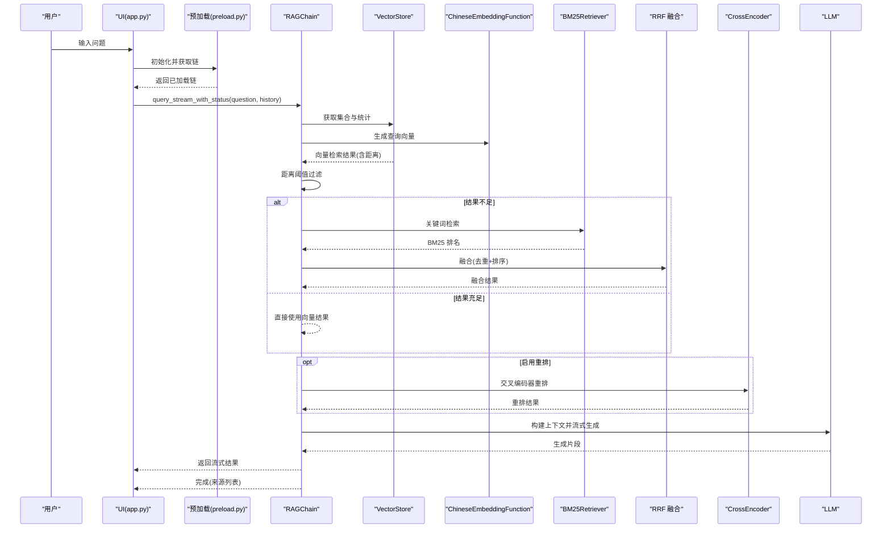
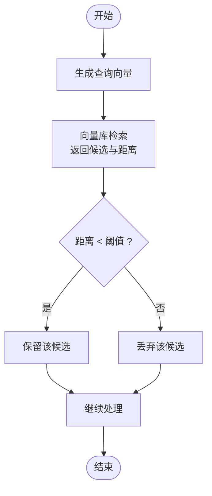
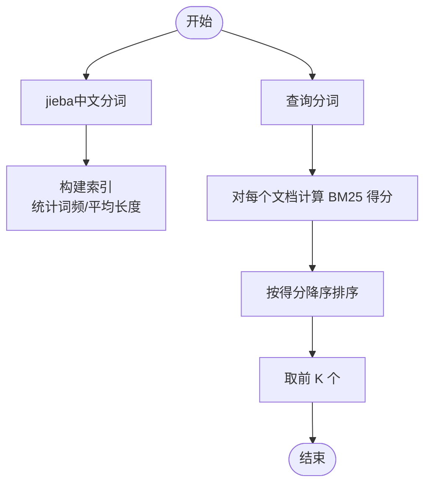
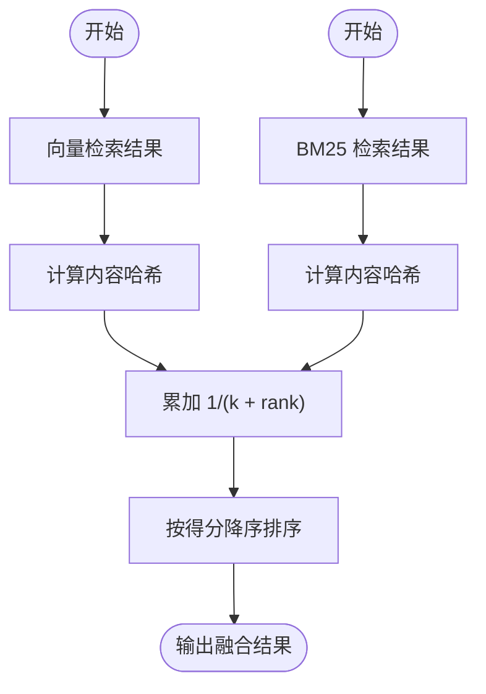
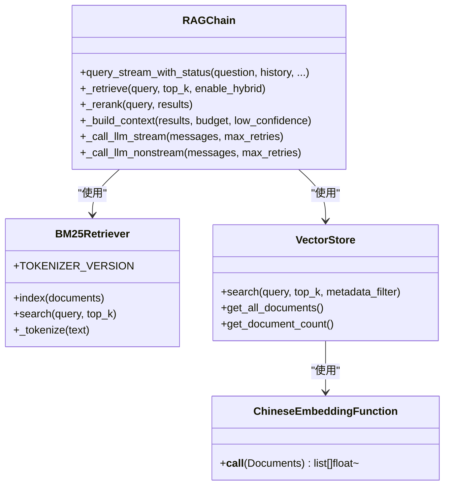
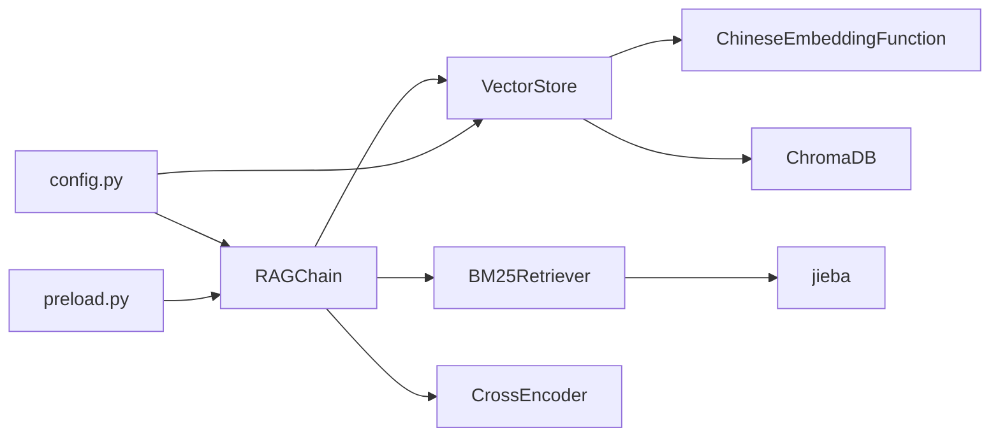

# 混合检索实现

<cite>
**本文引用的文件**
- [rag/vectorstore.py](file://rag/vectorstore.py)
- [rag/embeddings.py](file://rag/embeddings.py)
- [rag/chain.py](file://rag/chain.py)
- [rag/config.py](file://rag/config.py)
- [rag/loader.py](file://rag/loader.py)
- [rag/preload.py](file://rag/preload.py)
- [config.yaml](file://config.yaml)
- [app.py](file://app.py)
- [tests/test_chain.py](file://tests/test_chain.py)
</cite>

## 更新摘要
**变更内容**
- BM25检索器从简单正则分词升级为jieba中文分词，提升中文处理精度
- 新增tokenizer版本跟踪机制，确保分词器升级时自动重建索引
- RRF融合算法从ID去重改为内容哈希去重，提高去重准确性
- 更新分词策略和索引一致性保障机制

## 目录
1. [简介](#简介)
2. [项目结构](#项目结构)
3. [核心组件](#核心组件)
4. [架构总览](#架构总览)
5. [详细组件分析](#详细组件分析)
6. [依赖关系分析](#依赖关系分析)
7. [性能考量](#性能考量)
8. [故障排查指南](#故障排查指南)
9. [结论](#结论)
10. [附录](#附录)

## 简介
本技术文档围绕混合检索实现展开，系统性阐述向量检索、BM25关键词检索与Reciprocal Rank Fusion（RRF）融合算法的实现细节与工程实践。文档覆盖嵌入向量生成、距离阈值过滤、分词策略、IDF公式计算、RRF融合公式的数学原理与去重机制，并提供配置参数说明、结果处理流程、性能优化建议及在不同场景下的适用性分析。目标是帮助开发者快速理解并高效优化混合检索系统。

## 项目结构
该项目采用清晰的分层组织：UI层（Streamlit）、服务层（业务逻辑）、RAG层（检索与生成）。与混合检索直接相关的关键模块包括：
- 向量库与嵌入：VectorStore、ChineseEmbeddingFunction
- 检索链：BM25Retriever、RAGChain、reciprocal_rank_fusion
- 配置与预加载：config、preload
- 文档加载与分块：loader

```mermaid
graph TB
subgraph "UI 层"
UI_App["app.py<br/>Streamlit 应用入口"]
end
subgraph "RAG 层"
VS["VectorStore<br/>向量库管理"]
EMB["ChineseEmbeddingFunction<br/>嵌入函数"]
BM25["BM25Retriever<br/>关键词检索"]
RRF["reciprocal_rank_fusion<br/>RRF 融合"]
RC["RAGChain<br/>检索-重排-生成链"]
end
subgraph "配置与工具"
CFG["config.py<br/>Pydantic 配置"]
PRE["preload.py<br/>后台预加载"]
LDR["loader.py<br/>文档加载与分块"]
end
subgraph "外部依赖"
CHROMA["ChromaDB"]
ST["sentence-transformers"]
CE["CrossEncoder"]
JIEBA["jieba 中文分词"]
END
UI_App --> PRE
PRE --> RC
RC --> VS
VS --> EMB
VS --> CHROMA
RC --> BM25
RC --> RRF
RC --> CE
CFG --> VS
CFG --> RC
LDR --> VS
```

**图表来源**
- [app.py:1-189](file://app.py#L1-L189)
- [rag/preload.py:1-73](file://rag/preload.py#L1-L73)
- [rag/chain.py:162-610](file://rag/chain.py#L162-L610)
- [rag/vectorstore.py:24-209](file://rag/vectorstore.py#L24-L209)
- [rag/embeddings.py:19-48](file://rag/embeddings.py#L19-L48)
- [rag/config.py:48-185](file://rag/config.py#L48-L185)
- [rag/loader.py:22-259](file://rag/loader.py#L22-L259)

**章节来源**
- [app.py:1-189](file://app.py#L1-L189)
- [rag/preload.py:1-73](file://rag/preload.py#L1-L73)
- [rag/chain.py:162-610](file://rag/chain.py#L162-L610)
- [rag/vectorstore.py:24-209](file://rag/vectorstore.py#L24-L209)
- [rag/embeddings.py:19-48](file://rag/embeddings.py#L19-L48)
- [rag/config.py:48-185](file://rag/config.py#L48-L185)
- [rag/loader.py:22-259](file://rag/loader.py#L22-L259)

## 核心组件
- 向量库与嵌入
  - VectorStore：封装 ChromaDB 客户端与集合，提供文档入库、检索、统计与切换集合能力；内置全局单例缓存，避免重复加载嵌入模型。
  - ChineseEmbeddingFunction：基于 sentence-transformers 的中文嵌入函数，支持在线/离线模型加载，延迟初始化与进度日志。
- 检索链
  - BM25Retriever：基于jieba的中文分词BM25关键词检索，包含中文分词、词频统计、IDF计算与评分排序，支持tokenizer版本跟踪。
  - RAGChain：混合检索主控制器，负责向量检索、距离阈值过滤、BM25关键词检索补充、RRF融合、交叉编码器重排、上下文构建与流式生成。
  - reciprocal_rank_fusion：RRF 融合算法，基于内容哈希去重，综合向量与 BM25 排名。
- 配置与预加载
  - config.py：Pydantic 配置模型，统一管理 LLM、嵌入、向量库、知识库、限流、UI 等配置；提供环境变量替换与单例访问。
  - preload.py：后台线程预加载 RAGChain，避免每次页面刷新导致的冷启动延迟。
- 文档加载与分块
  - loader.py：支持 .md/.txt/.pdf 的递归扫描、标题驱动的语义切分、保留元数据（来源、标题、块索引等）。

**章节来源**
- [rag/vectorstore.py:24-209](file://rag/vectorstore.py#L24-L209)
- [rag/embeddings.py:19-48](file://rag/embeddings.py#L19-L48)
- [rag/chain.py:41-332](file://rag/chain.py#L41-L332)
- [rag/config.py:48-185](file://rag/config.py#L48-L185)
- [rag/loader.py:22-259](file://rag/loader.py#L22-L259)
- [rag/preload.py:22-73](file://rag/preload.py#L22-L73)

## 架构总览
混合检索的整体流程如下：用户输入经 RAGChain 预处理后，先执行向量检索并按距离阈值过滤，若结果不足则用 BM25 关键词检索补充，最后通过 RRF 融合去重并排序，必要时使用 Cross-Encoder 进行二次精排，最终构建上下文并调用 LLM 生成回答。



**图表来源**
- [rag/chain.py:238-527](file://rag/chain.py#L238-L527)
- [rag/vectorstore.py:124-147](file://rag/vectorstore.py#L124-L147)
- [rag/embeddings.py:41-47](file://rag/embeddings.py#L41-L47)
- [rag/preload.py:33-48](file://rag/preload.py#L33-L48)

**章节来源**
- [rag/chain.py:238-527](file://rag/chain.py#L238-L527)
- [rag/vectorstore.py:124-147](file://rag/vectorstore.py#L124-L147)
- [rag/embeddings.py:41-47](file://rag/embeddings.py#L41-L47)
- [rag/preload.py:33-48](file://rag/preload.py#L33-L48)

## 详细组件分析

### 向量检索与嵌入生成
- 嵌入向量生成
  - ChineseEmbeddingFunction 延迟加载模型，首次调用时打印进度与维度信息，保证用户体验与可观测性。
  - 向量维度与距离范围由配置文件注释给出，便于理解阈值设置的合理性。
- 向量检索与距离阈值过滤
  - VectorStore.search 返回包含 content、metadata、distance 的结果列表；RAGChain 中对距离进行阈值过滤，剔除低相关度文档块，提升下游质量。
  - 阈值配置位于 vectorstore.distance_threshold，默认值为较小正值，适合中文语料的典型分布。



**图表来源**
- [rag/chain.py:253-271](file://rag/chain.py#L253-L271)
- [rag/vectorstore.py:124-142](file://rag/vectorstore.py#L124-L142)
- [config.yaml:20-22](file://config.yaml#L20-L22)

**章节来源**
- [rag/embeddings.py:31-47](file://rag/embeddings.py#L31-L47)
- [rag/vectorstore.py:124-142](file://rag/vectorstore.py#L124-L142)
- [rag/chain.py:253-271](file://rag/chain.py#L253-L271)
- [config.yaml:20-22](file://config.yaml#L20-L22)

### BM25关键词检索
- 分词策略
  - **更新**：从简单正则分词升级为基于jieba的中文分词，同时保持英文/数字的处理能力。
  - 使用jieba.lcut进行中文分词，对包含中文字符的词直接作为token，对纯英文/数字/混合词使用正则表达式拆分。
  - 分词器版本跟踪：通过TOKENIZER_VERSION常量（当前为2）确保分词器升级时自动重建索引。
- IDF 公式与评分
  - 采用经典 BM25 公式：IDF = log((N - df + 0.5)/(df + 0.5))，并结合词频、文档长度归一化项 (k1+1)/(tf + k1·...)，其中 k1、b 为可调参数。
- 索引与查询
  - index 阶段统计词频与平均文档长度；search 阶段对每个候选文档计算总分并按降序返回前 K 名。



**图表来源**
- [rag/chain.py:56-121](file://rag/chain.py#L56-L121)

**章节来源**
- [rag/chain.py:56-121](file://rag/chain.py#L56-L121)

### Reciprocal Rank Fusion 融合
- 数学原理
  - 对每个文档 d，其 RRF 得分为各检索源的倒数秩次之和：Σ 1/(k + rank_i(d))，k 为调参常数（默认 60）。
- 去重机制
  - **更新**：从ID去重改为基于内容哈希去重，使用MD5哈希计算文档内容的唯一标识，避免同一文档在不同源中重复计分。
  - _doc_hash函数实现内容哈希计算，确保语义相同的文档即使ID不同也能被正确识别为重复。
- 融合流程
  - 先遍历向量检索结果，再遍历 BM25 结果，累加得分并排序输出。



**图表来源**
- [rag/chain.py:131-159](file://rag/chain.py#L131-L159)

**章节来源**
- [rag/chain.py:131-159](file://rag/chain.py#L131-L159)

### RAGChain 检索-重排-生成链
- 混合检索控制
  - _retrieve：组合向量检索、阈值过滤、BM25补充与 RRF 融合；支持开关混合检索与重排。
  - **更新**：新增_tokenizer_version字段，配合BM25Retriever.TOKENIZER_VERSION实现分词器版本跟踪。
- 重排与上下文
  - _rerank：使用 CrossEncoder 模型进行二次精排，类级缓存避免重复加载。
  - _build_context：按 token 预算裁剪上下文，低置信度时插入强提醒。
- 流式生成与降级
  - _call_llm_stream/_call_llm_nonstream：支持流式与非流式调用，带指数退避重试与错误降级。



**图表来源**
- [rag/chain.py:162-610](file://rag/chain.py#L162-L610)
- [rag/vectorstore.py:24-209](file://rag/vectorstore.py#L24-L209)
- [rag/embeddings.py:19-48](file://rag/embeddings.py#L19-L48)

**章节来源**
- [rag/chain.py:162-610](file://rag/chain.py#L162-L610)
- [rag/vectorstore.py:24-209](file://rag/vectorstore.py#L24-L209)
- [rag/embeddings.py:19-48](file://rag/embeddings.py#L19-L48)

## 依赖关系分析
- 组件耦合
  - RAGChain 依赖 VectorStore 与 BM25Retriever；VectorStore 依赖 ChromaDB 与 ChineseEmbeddingFunction；BM25Retriever 为自包含模块。
- 外部依赖
  - ChromaDB：向量检索与持久化
  - sentence-transformers：嵌入与 CrossEncoder
  - Streamlit：前端交互
  - **更新**：jieba：中文分词处理
- 配置与预加载
  - config.py 提供统一配置；preload.py 在后台线程加载链，避免 UI 刷新带来的冷启动。



**图表来源**
- [rag/chain.py:162-610](file://rag/chain.py#L162-L610)
- [rag/vectorstore.py:24-209](file://rag/vectorstore.py#L24-L209)
- [rag/embeddings.py:19-48](file://rag/embeddings.py#L19-L48)
- [rag/config.py:48-185](file://rag/config.py#L48-L185)
- [rag/preload.py:22-73](file://rag/preload.py#L22-L73)

**章节来源**
- [rag/chain.py:162-610](file://rag/chain.py#L162-L610)
- [rag/vectorstore.py:24-209](file://rag/vectorstore.py#L24-L209)
- [rag/embeddings.py:19-48](file://rag/embeddings.py#L19-L48)
- [rag/config.py:48-185](file://rag/config.py#L48-L185)
- [rag/preload.py:22-73](file://rag/preload.py#L22-L73)

## 性能考量
- 向量检索
  - 使用 top_k 倍增策略（如 max(top_k*2, 10)）降低阈值过滤后的空结果风险。
  - 距离阈值与嵌入维度、归一化范围相关，合理设置可显著提升命中质量。
- BM25 检索
  - **更新**：jieba分词相比正则分词提供更准确的中文处理，但会增加一定的计算开销。
  - k1、b 参数影响词频饱和与长度归一化程度，建议结合领域语料微调。
  - **更新**：tokenizer版本跟踪机制确保分词器升级时自动重建索引，避免索引不一致问题。
  - 仅在向量结果不足时触发，避免不必要的开销。
- RRF 融合
  - k 值越大，不同源贡献越平滑；默认 60 在多数场景下平衡了多样性与相关性。
  - **更新**：内容哈希去重比ID去重更准确，避免语义相同但ID不同的重复文档。
- 重排与上下文
  - CrossEncoder 类级缓存减少重复加载成本；token 预算动态计算，避免上下文溢出。
- 预加载
  - 后台线程预加载链，显著降低首屏延迟，提升用户体验。

**章节来源**
- [rag/chain.py:257-271](file://rag/chain.py#L257-L271)
- [rag/chain.py:311-332](file://rag/chain.py#L311-L332)
- [rag/chain.py:393-405](file://rag/chain.py#L393-L405)
- [rag/preload.py:33-48](file://rag/preload.py#L33-L48)

## 故障排查指南
- 向量检索无结果
  - 检查向量库是否已入库、集合名称是否正确、阈值是否过高。
  - 参考：[rag/vectorstore.py:124-142](file://rag/vectorstore.py#L124-L142)、[rag/chain.py:259-260](file://rag/chain.py#L259-L260)
- BM25 检索异常
  - **更新**：确认分词器版本是否正确，检查TOKENIZER_VERSION是否与索引构建时一致。
  - 确认索引是否已构建、查询分词是否为空；查看日志"BM25 检索跳过"。
  - 参考：[rag/chain.py:277-289](file://rag/chain.py#L277-L289)
- 融合结果为空
  - **更新**：检查内容哈希去重逻辑与输入列表是否为空；参考单元测试用例。
  - 参考：[tests/test_chain.py:85-94](file://tests/test_chain.py#L85-L94)
- 重排失败
  - CrossEncoder 模型加载失败或预测异常，检查网络与模型缓存。
  - 参考：[rag/chain.py:311-332](file://rag/chain.py#L311-L332)
- 上下文溢出
  - 调整上下文预算或减少历史轮次；参考预算计算逻辑。
  - 参考：[rag/chain.py:393-405](file://rag/chain.py#L393-L405)

**章节来源**
- [rag/vectorstore.py:124-142](file://rag/vectorstore.py#L124-L142)
- [rag/chain.py:277-289](file://rag/chain.py#L277-L289)
- [tests/test_chain.py:85-94](file://tests/test_chain.py#L85-L94)
- [rag/chain.py:311-332](file://rag/chain.py#L311-L332)
- [rag/chain.py:393-405](file://rag/chain.py#L393-L405)

## 结论
混合检索通过向量检索的语义匹配与 BM25 关键词检索的精确召回相结合，利用 RRF 融合实现互补优势，显著提升检索质量与鲁棒性。**更新后的版本**引入了基于jieba的中文分词、tokenizer版本跟踪机制和内容哈希去重，进一步提升了中文处理精度、索引一致性和去重准确性。配合 Cross-Encoder 二次精排与上下文预算控制，系统在不同场景下具备良好的稳定性与可扩展性。建议在生产环境中结合业务语料对 k1/b、k、阈值等参数进行实证调优，并充分利用预加载与缓存机制优化响应时间。

## 附录

### 配置参数说明与示例路径
- LLM 配置
  - 参考：[config.yaml:4-10](file://config.yaml#L4-L10)、[rag/config.py:48-56](file://rag/config.py#L48-L56)
- 嵌入模型配置
  - 参考：[config.yaml:12-14](file://config.yaml#L12-L14)、[rag/config.py:58-62](file://rag/config.py#L58-L62)
- 向量库配置
  - 参考：[config.yaml:16-22](file://config.yaml#L16-L22)、[rag/config.py:64-70](file://rag/config.py#L64-L70)
- 知识库配置
  - 参考：[config.yaml:24-27](file://config.yaml#L24-L27)、[rag/config.py:72-84](file://rag/config.py#L72-L84)
- UI 与限流配置
  - 参考：[config.yaml:29-48](file://config.yaml#L29-L48)、[rag/config.py:86-117](file://rag/config.py#L86-L117)

### 检索结果处理与优化建议
- 结果处理
  - 参考：[rag/chain.py:238-301](file://rag/chain.py#L238-L301)
- 上下文构建与裁剪
  - 参考：[rag/chain.py:334-377](file://rag/chain.py#L334-L377)
- 重排与流式生成
  - 参考：[rag/chain.py:302-332](file://rag/chain.py#L302-L332)、[rag/chain.py:529-602](file://rag/chain.py#L529-L602)

### 测试用例与验证
- BM25 检索测试
  - 参考：[tests/test_chain.py:15-64](file://tests/test_chain.py#L15-L64)
- RRF 融合测试
  - **更新**：测试内容哈希去重机制，验证相同内容文档的正确去重。
  - 参考：[tests/test_chain.py:66-94](file://tests/test_chain.py#L66-L94)
- Token 估算与上下文预算
  - 参考：[tests/test_chain.py:96-147](file://tests/test_chain.py#L96-L147)