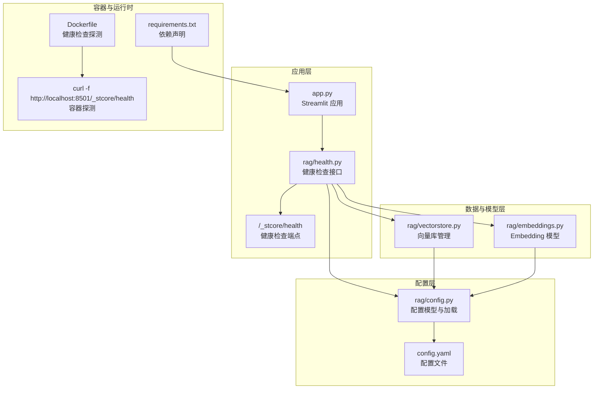
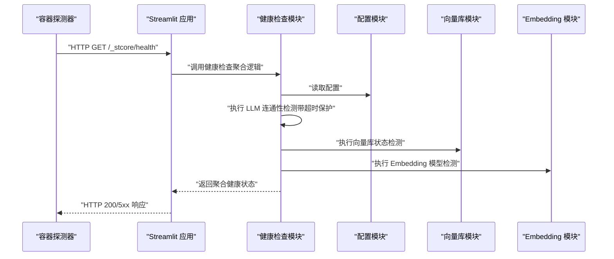
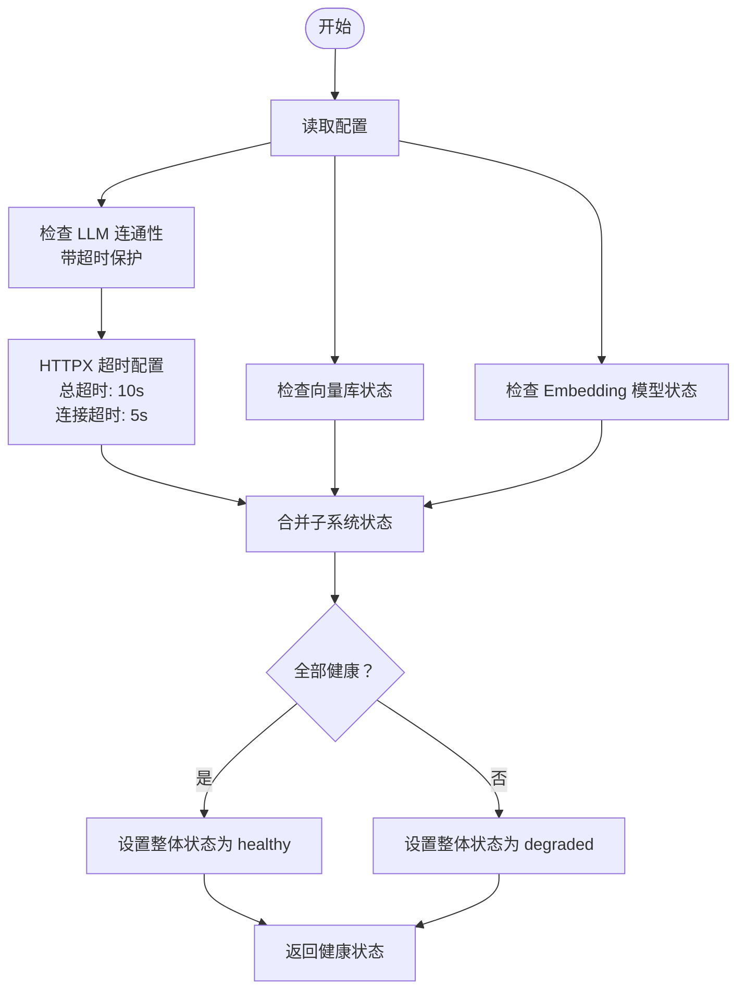
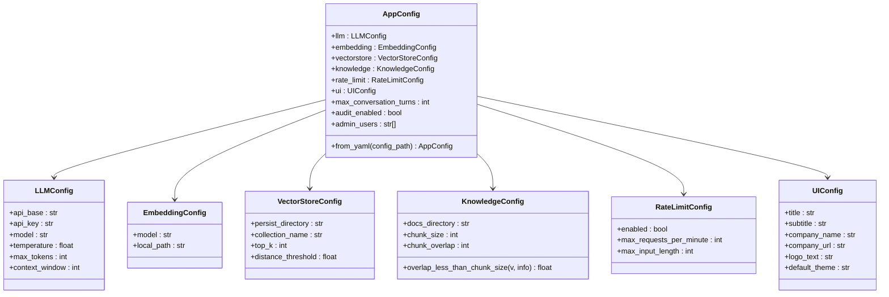
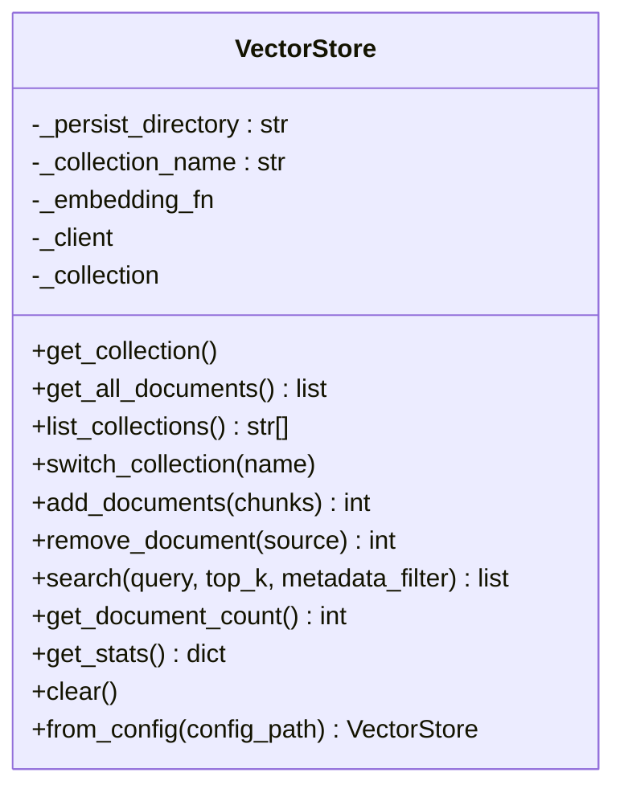
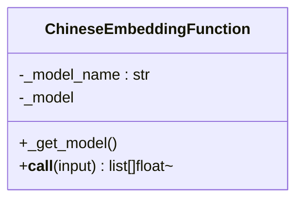
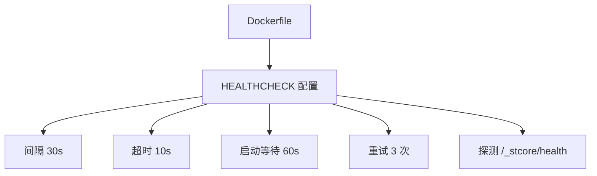
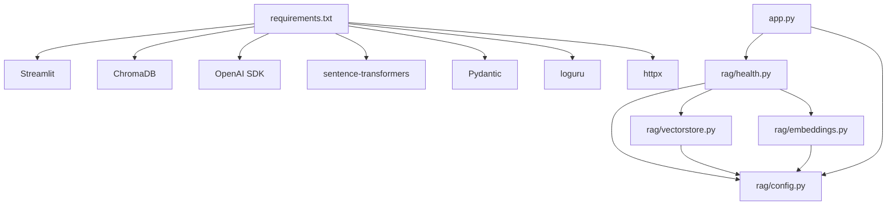

# 健康检查系统

<cite>
**本文引用的文件**
- [rag/health.py](file://rag/health.py)
- [rag/config.py](file://rag/config.py)
- [rag/vectorstore.py](file://rag/vectorstore.py)
- [rag/embeddings.py](file://rag/embeddings.py)
- [Dockerfile](file://Dockerfile)
- [config.yaml](file://config.yaml)
- [requirements.txt](file://requirements.txt)
- [app.py](file://app.py)
</cite>

## 更新摘要
**变更内容**
- 更新了 LLM 连接检查的超时保护机制，增强了系统可靠性和用户体验
- 新增了 HTTPX 超时配置的详细说明和最佳实践
- 完善了健康检查系统的性能考虑和故障排查指南

## 目录
1. [简介](#简介)
2. [项目结构](#项目结构)
3. [核心组件](#核心组件)
4. [架构总览](#架构总览)
5. [详细组件分析](#详细组件分析)
6. [依赖分析](#依赖分析)
7. [性能考虑](#性能考虑)
8. [故障排查指南](#故障排查指南)
9. [结论](#结论)
10. [附录](#附录)

## 简介
本文件为"健康检查系统"的技术文档，聚焦于系统状态监控、自动恢复机制、异常告警与健康指标采集等核心能力。文档详细说明了健康检查的实现方式、检查周期设置、告警阈值配置、恢复策略等实现细节，并提供配置示例、监控指标说明、告警规则设置建议，以及与系统其他组件的集成方式、健康状态评估标准与故障处理流程。面向开发者提供系统监控与维护的最佳实践。

## 项目结构
健康检查系统主要由以下模块构成：
- 健康检查核心模块：负责对外暴露健康检查接口、执行各子系统健康检查、汇总健康状态。
- 配置管理模块：提供统一的配置读取、校验与环境变量替换能力。
- 向量库模块：负责向量数据库的连接、查询与统计信息获取。
- Embedding 模块：负责中文嵌入模型的加载与向量化能力。
- 容器与运行时：通过 Dockerfile 配置健康检查探测策略。
- 应用入口：Streamlit 应用启动与页面渲染，承载健康检查的前端展示与统计信息。

**图表来源**
- [app.py:1-237](file://app.py#L1-L237)
- [rag/health.py:1-84](file://rag/health.py#L1-L84)
- [rag/config.py:1-183](file://rag/config.py#L1-L183)
- [rag/vectorstore.py:1-209](file://rag/vectorstore.py#L1-L209)
- [rag/embeddings.py:1-48](file://rag/embeddings.py#L1-L48)
- [Dockerfile:55-68](file://Dockerfile#L55-L68)
- [config.yaml:1-49](file://config.yaml#L1-L49)
- [requirements.txt:1-12](file://requirements.txt#L1-L12)

**章节来源**
- [app.py:1-237](file://app.py#L1-L237)
- [rag/health.py:1-84](file://rag/health.py#L1-L84)
- [rag/config.py:1-183](file://rag/config.py#L1-L183)
- [rag/vectorstore.py:1-209](file://rag/vectorstore.py#L1-L209)
- [rag/embeddings.py:1-48](file://rag/embeddings.py#L1-L48)
- [Dockerfile:55-68](file://Dockerfile#L55-L68)
- [config.yaml:1-49](file://config.yaml#L1-L49)
- [requirements.txt:1-12](file://requirements.txt#L1-L12)

## 核心组件
- 健康检查接口模块：提供完整的健康检查状态聚合，包含 LLM 连通性、向量库状态、Embedding 模型状态三部分，并输出整体健康状态与版本信息。
- 配置管理模块：基于 Pydantic 的配置模型，支持环境变量替换、字段校验与全局单例访问；为健康检查提供 LLM、Embedding、向量库等配置参数。
- 向量库模块：提供向量库客户端初始化、集合管理、文档检索与统计信息获取，健康检查通过查询文档数量进行状态判断。
- Embedding 模块：封装中文嵌入函数，负责模型加载与向量化，健康检查通过尝试加载模型进行状态判断。
- 容器与运行时：Dockerfile 中配置了健康检查探测策略，结合 Streamlit 内部健康端点进行容器级健康监测。

**章节来源**
- [rag/health.py:57-84](file://rag/health.py#L57-L84)
- [rag/config.py:48-117](file://rag/config.py#L48-L117)
- [rag/vectorstore.py:144-169](file://rag/vectorstore.py#L144-L169)
- [rag/embeddings.py:31-47](file://rag/embeddings.py#L31-L47)
- [Dockerfile:57-59](file://Dockerfile#L57-L59)

## 架构总览
健康检查系统采用"模块化分层"架构：
- 外部探测层：容器运行时通过 Dockerfile 的 HEALTHCHECK 对应用内部健康端点发起探测。
- 应用层：Streamlit 应用启动后，健康检查模块提供统一的健康状态聚合接口。
- 数据与模型层：健康检查分别调用 LLM 连通性检测、向量库状态检测与 Embedding 模型检测。
- 配置层：统一读取配置，确保健康检查使用的参数一致且经过校验。

**图表来源**
- [Dockerfile:57-59](file://Dockerfile#L57-L59)
- [rag/health.py:57-84](file://rag/health.py#L57-L84)
- [rag/config.py:139-144](file://rag/config.py#L139-L144)
- [rag/vectorstore.py:144-169](file://rag/vectorstore.py#L144-L169)
- [rag/embeddings.py:31-47](file://rag/embeddings.py#L31-L47)

## 详细组件分析

### 健康检查接口模块
- 功能职责
  - LLM 连通性检测：构造 LLM 客户端，调用模型列表接口以验证连通性，并记录延迟。**新增超时保护机制，防止无限期挂起**。
  - 向量库状态检测：通过向量库实例查询文档数量，作为可用性指标。
  - Embedding 模型状态检测：尝试加载嵌入模型，验证模型可用性。
  - 聚合健康状态：综合三个子系统的状态，生成整体健康状态与组件详情。
- 关键行为
  - 异常捕获：任一子系统异常均返回"不健康"，并附带错误信息。
  - 版本与时间戳：返回系统版本与检查时间戳，便于审计与追踪。
  - **超时保护**：LLM 连接检查包含 HTTPX 超时配置（10 秒总超时，5 秒连接超时）。
- 输出结构
  - 整体状态：healthy/degraded
  - 时间戳：检查时间
  - 组件详情：llm、vectorstore、embedding 的状态与附加信息
  - 版本：系统版本号

**图表来源**
- [rag/health.py:17-32](file://rag/health.py#L17-L32)
- [rag/health.py:57-84](file://rag/health.py#L57-L84)

**章节来源**
- [rag/health.py:15-84](file://rag/health.py#L15-L84)

### 配置管理模块
- 功能职责
  - 环境变量替换：支持 ${VAR} 与 ${VAR:-默认值} 语法，递归替换配置中的字符串值。
  - 配置模型：使用 Pydantic 定义 LLM、Embedding、向量库、知识库、速率限制、UI 等配置模型，并进行字段校验。
  - 单例访问：提供全局配置单例与重载能力，保证健康检查与其他模块使用一致配置。
- 关键行为
  - 字段校验：如温度范围、上下文窗口、分块大小与重叠等。
  - 加载兼容：提供字典形式的配置导出，兼容旧接口。
- 与健康检查的关系
  - 健康检查通过配置模块读取 LLM 地址、密钥、模型名、向量库路径、集合名、TopK、距离阈值等参数。

**图表来源**
- [rag/config.py:48-117](file://rag/config.py#L48-L117)

**章节来源**
- [rag/config.py:1-183](file://rag/config.py#L1-L183)
- [config.yaml:1-49](file://config.yaml#L1-L49)

### 向量库模块
- 功能职责
  - 客户端初始化：延迟初始化向量库客户端，确保首次使用时才创建。
  - 集合管理：获取或创建集合，支持多集合切换。
  - 文档操作：批量添加、删除、查询与统计。
  - 统计信息：提供文档数量、文件数量等统计指标。
- 与健康检查的关系
  - 健康检查通过查询文档数量判断向量库可用性；同时提供统计信息用于前端展示。

**图表来源**
- [rag/vectorstore.py:24-209](file://rag/vectorstore.py#L24-L209)

**章节来源**
- [rag/vectorstore.py:144-169](file://rag/vectorstore.py#L144-L169)

### Embedding 模块
- 功能职责
  - 模型封装：基于 sentence-transformers 的中文嵌入函数，支持在线与离线两种加载方式。
  - 延迟加载：首次调用时加载模型，避免启动时阻塞。
  - 向量化：将文档列表编码为向量列表，返回二维浮点数组。
- 与健康检查的关系
  - 健康检查通过尝试加载模型判断 Embedding 可用性。

**图表来源**
- [rag/embeddings.py:19-48](file://rag/embeddings.py#L19-L48)

**章节来源**
- [rag/embeddings.py:31-47](file://rag/embeddings.py#L31-L47)

### 容器与运行时
- Dockerfile 中的健康检查配置
  - 探测间隔：30 秒
  - 超时：10 秒
  - 启动等待：60 秒
  - 重试次数：3 次
  - 探测目标：访问应用内部健康端点
- 与健康检查的关系
  - 容器运行时通过该探测策略监控应用存活与就绪状态，健康检查模块提供探测所需的响应内容。

**图表来源**
- [Dockerfile:57-59](file://Dockerfile#L57-L59)

**章节来源**
- [Dockerfile:57-59](file://Dockerfile#L57-L59)

## 依赖分析
- 外部依赖
  - Streamlit：应用框架与健康端点
  - ChromaDB：向量库存储
  - OpenAI SDK：LLM 连接
  - sentence-transformers：中文嵌入模型
  - Pydantic：配置模型与校验
  - loguru：日志记录
  - **httpx：HTTP 客户端，提供超时保护功能**
- 内部模块依赖
  - 健康检查模块依赖配置模块、向量库模块与 Embedding 模块
  - 向量库模块依赖配置模块与 Embedding 模块
  - 应用入口依赖健康检查模块与配置模块

**图表来源**
- [requirements.txt:1-12](file://requirements.txt#L1-L12)
- [rag/health.py:1-84](file://rag/health.py#L1-L84)
- [rag/config.py:1-183](file://rag/config.py#L1-L183)
- [rag/vectorstore.py:1-209](file://rag/vectorstore.py#L1-L209)
- [rag/embeddings.py:1-48](file://rag/embeddings.py#L1-L48)
- [app.py:1-237](file://app.py#L1-L237)

**章节来源**
- [requirements.txt:1-12](file://requirements.txt#L1-L12)
- [rag/health.py:1-84](file://rag/health.py#L1-L84)
- [rag/config.py:1-183](file://rag/config.py#L1-L183)
- [rag/vectorstore.py:1-209](file://rag/vectorstore.py#L1-L209)
- [rag/embeddings.py:1-48](file://rag/embeddings.py#L1-L48)
- [app.py:1-237](file://app.py#L1-L237)

## 性能考虑
- 健康检查开销控制
  - LLM 连通性检测仅调用模型列表接口，避免大负载请求。
  - 向量库检测仅查询文档数量，避免全量扫描。
  - Embedding 模型检测仅尝试加载，不进行大规模编码。
- 缓存与延迟初始化
  - 向量库模块提供全局单例缓存，避免重复加载 Embedding 模型。
  - Embedding 模型采用延迟加载，首次使用时才加载，减少启动时延。
- 探测频率与超时
  - 容器健康检查间隔为 30 秒，超时 10 秒，启动等待 60 秒，重试 3 次，平衡探测精度与系统负载。
- **超时保护机制**
  - **LLM 连接检查包含 HTTPX 超时配置：总超时 10 秒，连接超时 5 秒，有效防止无限期挂起**
  - **超时保护显著提升了系统可靠性和用户体验，避免因网络延迟或服务不可达导致的长时间阻塞**

**更新** 新增了超时保护机制的详细说明，强调了 HTTPX 超时配置对系统可靠性的重要影响。

**章节来源**
- [rag/health.py:17-32](file://rag/health.py#L17-L32)
- [Dockerfile:57-59](file://Dockerfile#L57-L59)

## 故障排查指南
- 健康检查返回"不健康"
  - LLM 连通性异常：检查 LLM 地址、密钥与网络连通性；查看错误信息定位问题。**注意：现在具有超时保护，如果出现超时错误，可能是网络延迟过高或服务不可达**。
  - 向量库异常：检查向量库持久化目录权限与磁盘空间；确认集合存在且可访问。
  - Embedding 模型异常：检查模型名称或本地路径；确认网络可达或本地模型存在。
- 容器健康检查失败
  - 确认应用已启动并监听 8501 端口。
  - 检查 /_stcore/health 是否可达；查看容器日志定位错误。
- 配置问题
  - 使用配置校验确保字段范围正确；通过环境变量替换注入敏感配置。
- **超时相关故障排查**
  - **LLM 连接超时**：检查网络延迟、防火墙设置、代理配置；确认 LLM 服务可用性。
  - **超时保护生效**：系统会在 10 秒内自动返回超时错误，避免长时间阻塞。
  - **性能监控**：关注 LLM 延迟指标，识别潜在的网络或服务问题。
- 最佳实践
  - 在生产环境中启用审计日志与监控告警。
  - 定期检查健康检查日志，关注异常模式与趋势。
  - **合理设置网络环境**，确保 LLM 服务的稳定性和响应速度。

**更新** 新增了超时相关故障排查指南，强调了超时保护机制的作用和相应的排查方法。

**章节来源**
- [rag/health.py:15-84](file://rag/health.py#L15-L84)
- [Dockerfile:57-59](file://Dockerfile#L57-L59)
- [rag/config.py:78-83](file://rag/config.py#L78-L83)

## 结论
健康检查系统通过模块化设计实现了对 LLM、向量库与 Embedding 模型的全面监控，并提供了统一的健康状态聚合与容器级健康探测。**最新的超时保护增强显著提升了系统的可靠性和用户体验，HTTPX 超时配置（10 秒总超时，5 秒连接超时）有效防止了 LLM 连接检查的无限期挂起**。配合严格的配置校验与缓存/延迟初始化策略，系统在保证可观测性的同时兼顾性能与稳定性。建议在生产环境中结合容器健康检查与应用内健康端点，建立完善的告警与恢复机制，持续优化检查周期与阈值，提升系统的可靠性与可维护性。

**更新** 强调了超时保护增强对系统可靠性的重要贡献。

## 附录

### 配置示例与说明
- LLM 配置
  - api_base：LLM API 基础地址
  - api_key：API 密钥
  - model：模型名称
  - temperature/max_tokens/context_window：推理参数
- Embedding 配置
  - model：模型名称（支持在线或离线）
  - local_path：本地模型路径（为空则使用在线）
- 向量库配置
  - persist_directory：持久化目录
  - collection_name：集合名称
  - top_k：检索返回条数
  - distance_threshold：距离阈值（用于过滤低相关度文档块）

**章节来源**
- [config.yaml:4-22](file://config.yaml#L4-L22)
- [rag/config.py:48-70](file://rag/config.py#L48-L70)

### 健康指标与告警规则建议
- 指标
  - 整体健康状态：healthy/degraded/unhealthy
  - LLM 延迟：毫秒级，用于评估响应性能
  - 向量库文档数量：反映索引完整性
  - Embedding 模型可用性：布尔值
  - **LLM 连接超时率：监控超时保护触发频率**
- 告警规则
  - 整体状态长时间为 unhealthy 或 degraded
  - LLM 延迟持续高于阈值
  - 向量库文档数量骤降或为 0
  - Embedding 模型加载失败
  - **LLM 连接超时率异常升高**
- 恢复策略
  - 自动重试：对临时性网络异常进行指数退避重试
  - 降级策略：在 Embedding 不可用时使用简化检索
  - 人工干预：对持续性异常触发告警并通知运维
  - **超时保护**：系统自动处理超时情况，避免长时间阻塞
- **最佳实践**
  - **监控超时保护触发频率，识别网络或服务问题**
  - **合理配置网络环境，确保 LLM 服务的稳定性和响应速度**
  - **定期检查健康检查日志，关注异常模式与趋势**

**更新** 新增了超时相关指标、告警规则和恢复策略的建议。