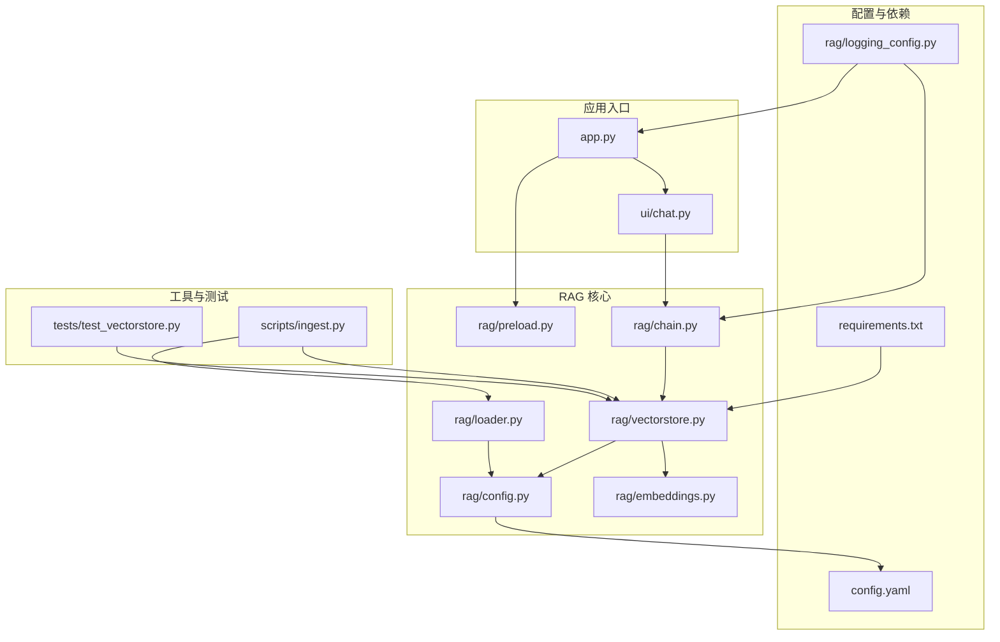
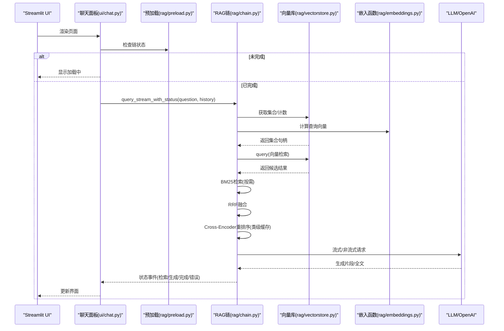
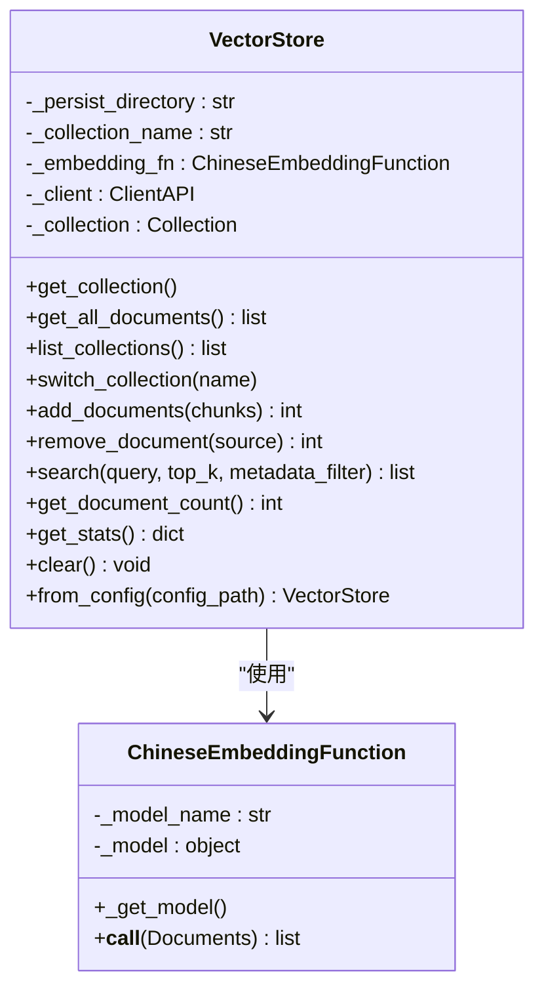
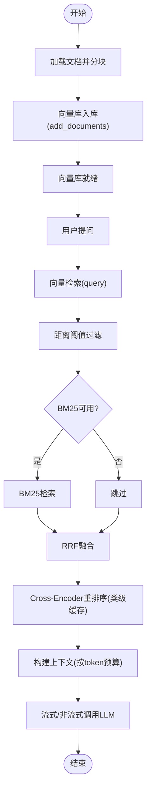

# 向量数据库管理

<cite>
**本文引用的文件**
- [rag/vectorstore.py](file://rag/vectorstore.py)
- [rag/embeddings.py](file://rag/embeddings.py)
- [rag/chain.py](file://rag/chain.py)
- [rag/loader.py](file://rag/loader.py)
- [rag/config.py](file://rag/config.py)
- [rag/preload.py](file://rag/preload.py)
- [scripts/ingest.py](file://scripts/ingest.py)
- [tests/test_vectorstore.py](file://tests/test_vectorstore.py)
- [app.py](file://app.py)
- [ui/chat.py](file://ui/chat.py)
- [config.yaml](file://config.yaml)
- [requirements.txt](file://requirements.txt)
- [rag/logging_config.py](file://rag/logging_config.py)
</cite>

## 目录
1. [简介](#简介)
2. [项目结构](#项目结构)
3. [核心组件](#核心组件)
4. [架构总览](#架构总览)
5. [详细组件分析](#详细组件分析)
6. [依赖分析](#依赖分析)
7. [性能考虑](#性能考虑)
8. [故障排除指南](#故障排除指南)
9. [结论](#结论)
10. [附录](#附录)

## 简介
本技术文档围绕向量数据库管理展开，重点解析 VectorStore 类的设计与实现，涵盖 ChromaDB 集成、文档存储策略、集合管理、嵌入函数封装等核心能力；同时梳理文档添加、删除、查询、批量操作等 API 接口，总结性能优化策略（批处理、缓存机制），并给出与 RAG 检索链的集成方式、数据一致性保障与内存管理策略。文档面向开发者与运维人员，提供最佳实践与故障排除建议。

## 项目结构
项目采用“模块化 + 配置驱动”的组织方式，核心位于 rag/ 子目录，包含配置、嵌入、向量库、检索链、文档加载、预加载与日志等模块；UI 层由 Streamlit 实现，入口为 app.py；脚本层提供文档入库工具 scripts/ingest.py；测试覆盖向量库关键行为。

图表来源
- [app.py:1-189](file://app.py#L1-L189)
- [ui/chat.py:1-190](file://ui/chat.py#L1-L190)
- [rag/config.py:1-184](file://rag/config.py#L1-L184)
- [rag/embeddings.py:1-48](file://rag/embeddings.py#L1-L48)
- [rag/vectorstore.py:1-209](file://rag/vectorstore.py#L1-L209)
- [rag/loader.py:1-259](file://rag/loader.py#L1-L259)
- [rag/preload.py:1-73](file://rag/preload.py#L1-L73)
- [rag/chain.py:1-590](file://rag/chain.py#L1-L590)
- [scripts/ingest.py:1-62](file://scripts/ingest.py#L1-L62)
- [tests/test_vectorstore.py:1-146](file://tests/test_vectorstore.py#L1-L146)
- [config.yaml:1-46](file://config.yaml#L1-L46)
- [requirements.txt:1-11](file://requirements.txt#L1-L11)
- [rag/logging_config.py:1-129](file://rag/logging_config.py#L1-L129)

章节来源
- [app.py:1-189](file://app.py#L1-L189)
- [rag/config.py:1-184](file://rag/config.py#L1-L184)
- [config.yaml:1-46](file://config.yaml#L1-L46)

## 核心组件
- VectorStore：ChromaDB 向量库管理器，负责客户端延迟初始化、集合获取/创建、文档增删查、集合切换、统计与清理等。
- ChineseEmbeddingFunction：SentenceTransformers 中文嵌入函数封装，支持在线/离线模型加载与延迟初始化。
- RAGChain：检索增强生成链，整合向量检索、BM25 关键词检索、RRF 融合、Cross-Encoder 重排序、上下文构建与流式 LLM 调用。
- DocumentChunk：文档分块数据结构，承载内容与元数据。
- 预加载模块：后台线程加载 RAGChain，避免 Streamlit 重绘导致状态丢失。
- 文档加载器：递归扫描知识库目录，按 Markdown 标题与代码块边界切分，生成分块并保留元数据。
- 配置系统：Pydantic 校验与环境变量替换，提供全局单例配置对象。

章节来源
- [rag/vectorstore.py:24-209](file://rag/vectorstore.py#L24-L209)
- [rag/embeddings.py:19-48](file://rag/embeddings.py#L19-L48)
- [rag/chain.py:160-590](file://rag/chain.py#L160-L590)
- [rag/loader.py:22-259](file://rag/loader.py#L22-L259)
- [rag/preload.py:22-73](file://rag/preload.py#L22-L73)
- [rag/config.py:48-184](file://rag/config.py#L48-L184)

## 架构总览
下图展示从 UI 到向量库与 LLM 的端到端流程，突出 VectorStore 与 RAGChain 的协作关系及关键优化点（嵌入模型缓存、Reranker 类级缓存、BM25 索引复用）。

图表来源
- [ui/chat.py:96-190](file://ui/chat.py#L96-L190)
- [rag/preload.py:22-73](file://rag/preload.py#L22-L73)
- [rag/chain.py:408-590](file://rag/chain.py#L408-L590)
- [rag/vectorstore.py:40-147](file://rag/vectorstore.py#L40-L147)
- [rag/embeddings.py:31-48](file://rag/embeddings.py#L31-L48)

## 详细组件分析

### VectorStore 类设计与实现
- 延迟初始化：首次访问客户端时创建持久化目录并建立 ChromaDB PersistentClient。
- 集合管理：按 collection_name 获取或创建集合，支持切换集合与列出集合。
- 文档存储策略：以 DocumentChunk 为单位入库，使用 source+chunk_index 组合为唯一 ID，先删除同名 ID 再新增，实现增量更新。
- 查询与过滤：支持 top_k 与元数据 where 过滤；返回 content、metadata、distance。
- 统计与清理：提供总数、文件数统计；支持按来源路径删除；支持清空集合。
- 单例缓存：from_config 基于配置键缓存实例，避免重复加载嵌入模型。

图表来源
- [rag/vectorstore.py:24-209](file://rag/vectorstore.py#L24-L209)
- [rag/embeddings.py:19-48](file://rag/embeddings.py#L19-L48)

章节来源
- [rag/vectorstore.py:24-209](file://rag/vectorstore.py#L24-L209)

### 嵌入函数封装 ChineseEmbeddingFunction
- 支持在线模型名与本地路径两种加载方式，优先使用本地路径。
- 延迟加载模型并在日志中输出进度提示，避免重复初始化。
- 编码时启用进度条，返回二维浮点数组并转换为列表。

章节来源
- [rag/embeddings.py:19-48](file://rag/embeddings.py#L19-L48)

### 文档加载与分块 loader
- 支持 .md/.txt/.pdf，递归扫描知识库目录。
- 按 Markdown 二级标题切分，保留标题上下文；代码块完整性优先，不截断。
- 生成 DocumentChunk，包含 source、title、chunk_index、file_type 等元数据。
- 提供仅元数据扫描接口，便于前端展示文件清单。

章节来源
- [rag/loader.py:18-259](file://rag/loader.py#L18-L259)

### RAG 检索链与集成
- 检索策略：向量检索（距离阈值过滤）+ BM25 关键词检索（按需构建索引）+ RRF 融合。
- 重排序：Cross-Encoder 类级缓存，避免重复加载。
- 上下文构建：按 token 预算裁剪，保留来源与标题信息。
- LLM 调用：支持流式与非流式，指数退避重试，失败降级与审计日志。
- 与 VectorStore 集成：通过 from_config 获取共享实例，确保嵌入模型与集合一致。

图表来源
- [rag/chain.py:236-330](file://rag/chain.py#L236-L330)
- [rag/vectorstore.py:89-147](file://rag/vectorstore.py#L89-L147)
- [rag/embeddings.py:31-48](file://rag/embeddings.py#L31-L48)

章节来源
- [rag/chain.py:160-590](file://rag/chain.py#L160-L590)

### UI 与预加载
- app.py 初始化主题、日志与预加载，将 chain 注入会话状态。
- ui/chat.py 渲染对话面板，等待预加载完成，调用 RAGChain 流式生成。
- 预加载模块在后台线程加载 RAGChain，避免 Streamlit 重绘导致状态丢失。

章节来源
- [app.py:23-90](file://app.py#L23-L90)
- [ui/chat.py:19-190](file://ui/chat.py#L19-L190)
- [rag/preload.py:22-73](file://rag/preload.py#L22-L73)

### 配置与日志
- config.yaml 定义 LLM、嵌入、向量库、知识库、速率限制、UI 等参数。
- rag/config.py 使用 Pydantic 校验与环境变量替换，提供全局单例。
- rag/logging_config.py 统一日志输出，支持审计日志 JSONL 文件。

章节来源
- [config.yaml:1-46](file://config.yaml#L1-L46)
- [rag/config.py:48-184](file://rag/config.py#L48-L184)
- [rag/logging_config.py:46-129](file://rag/logging_config.py#L46-L129)

## 依赖分析
- 向量库：chromadb 0.5.23，PersistentClient 与 Collection API。
- 嵌入：sentence-transformers 3.3.1，支持在线/离线模型。
- LLM：openai 1.58.1，OpenAI Chat Completions 流式/非流式。
- 文档解析：pymupdf 1.25.0（PDF），markdown 3.7。
- 配置与校验：pyyaml 6.0.2，pydantic 2.10.3。
- UI：streamlit 1.40.2。
- 日志：loguru 0.7.3。

章节来源
- [requirements.txt:1-11](file://requirements.txt#L1-L11)

## 性能考虑
- 批处理入库：add_documents 一次性 add，减少多次往返；先 delete 同 ID 再 add，避免重复。
- 嵌入模型缓存：VectorStore.from_config 全局单例缓存；ChineseEmbeddingFunction 延迟加载。
- Reranker 类级缓存：RAGChain._reranker_model 避免重复加载。
- BM25 索引复用：_ensure_bm25_ready 检测文档计数，一致则复用，避免重复构建。
- Token 预算与裁剪：_calc_context_budget 与 _build_context 控制上下文长度，防止越界。
- 流式 LLM：优先流式输出，失败自动降级为非流式，提升交互体验。
- 离线加载：嵌入模型通过 local_files_only=True 支持离线加载，本地路径存在时禁止联网。

章节来源
- [rag/vectorstore.py:89-112](file://rag/vectorstore.py#L89-L112)
- [rag/embeddings.py:31-48](file://rag/embeddings.py#L31-L48)
- [rag/chain.py:172-191](file://rag/chain.py#L172-L191)
- [rag/chain.py:300-330](file://rag/chain.py#L300-L330)
- [rag/chain.py:376-398](file://rag/chain.py#L376-L398)
- [rag/chain.py:408-590](file://rag/chain.py#L408-L590)

## 故障排除指南
- 模型加载失败
  - 现象：首次启动日志显示模型加载超时或下载失败。
  - 处理：推荐使用离线本地模型；在线环境需检查网络连通性；确认 config.yaml 中 model_root 配置正确。
  - 参考：[rag/embeddings.py:10](file://rag/embeddings.py#L10)
- 向量库不可用
  - 现象：UI 显示“向量库状态获取失败”。
  - 处理：确认 chroma_db 目录权限；检查配置 persist_directory；重启应用。
  - 参考：[app.py:162-172](file://app.py#L162-L172)
- 检索无结果
  - 现象：query 返回空列表。
  - 处理：确认文档已入库；检查 distance_threshold；尝试增大 top_k；启用混合检索。
  - 参考：[rag/chain.py:247-298](file://rag/chain.py#L247-L298)
- LLM 调用失败
  - 现象：生成回答时报错或空内容。
  - 处理：检查 api_base/api_key/model；查看重试日志；降级为非流式；确认上下文未越界。
  - 参考：[rag/chain.py:509-582](file://rag/chain.py#L509-L582)
- 文档入库异常
  - 现象：ingest 输出“未找到有效文档”或入库数为 0。
  - 处理：确认 knowledge/ 目录存在 .md/.txt/.pdf；检查 chunk_size/chunk_overlap；查看日志。
  - 参考：[scripts/ingest.py:25-61](file://scripts/ingest.py#L25-L61)
- 预加载卡住
  - 现象：页面长时间显示“系统初始化中”。
  - 处理：重试加载；检查配置与网络；查看后台线程日志。
  - 参考：[rag/preload.py:22-73](file://rag/preload.py#L22-L73)

章节来源
- [rag/embeddings.py:10](file://rag/embeddings.py#L10)
- [app.py:162-172](file://app.py#L162-L172)
- [rag/chain.py:247-298](file://rag/chain.py#L247-L298)
- [rag/chain.py:509-582](file://rag/chain.py#L509-L582)
- [scripts/ingest.py:25-61](file://scripts/ingest.py#L25-L61)
- [rag/preload.py:22-73](file://rag/preload.py#L22-L73)

## 结论
本项目通过 VectorStore 与 ChineseEmbeddingFunction 实现稳定的向量数据库管理，结合 RAGChain 的混合检索与重排序策略，提供高效、可扩展的知识问答能力。通过全局单例缓存、类级缓存与索引复用等手段，显著降低冷启动与重复计算成本。配合完善的日志与审计机制，便于问题定位与运营监控。建议在生产环境中固定模型版本、合理设置阈值与上下文预算，并定期维护知识库与集合。

## 附录

### API 接口与使用示例（路径指引）
- 初始化向量库（全局单例）
  - [rag/vectorstore.py:181-209](file://rag/vectorstore.py#L181-L209)
- 添加文档（批量）
  - [rag/vectorstore.py:89-112](file://rag/vectorstore.py#L89-L112)
- 删除文档（按来源）
  - [rag/vectorstore.py:114-122](file://rag/vectorstore.py#L114-L122)
- 查询（支持过滤）
  - [rag/vectorstore.py:124-142](file://rag/vectorstore.py#L124-L142)
- 获取统计
  - [rag/vectorstore.py:149-169](file://rag/vectorstore.py#L149-L169)
- 文档入库脚本
  - [scripts/ingest.py:25-61](file://scripts/ingest.py#L25-L61)
- 文档加载与分块
  - [rag/loader.py:131-197](file://rag/loader.py#L131-L197)

章节来源
- [rag/vectorstore.py:89-209](file://rag/vectorstore.py#L89-L209)
- [scripts/ingest.py:25-61](file://scripts/ingest.py#L25-L61)
- [rag/loader.py:131-197](file://rag/loader.py#L131-L197)

### 配置参数说明（节选）
- LLM 配置
  - api_base、api_key、model、temperature、max_tokens、context_window
  - 参考：[config.yaml:4-10](file://config.yaml#L4-L10)
- 嵌入配置
  - model、local_path
  - 参考：[config.yaml:12-14](file://config.yaml#L12-L14)
- 向量库配置
  - persist_directory、collection_name、top_k、distance_threshold
  - 参考：[config.yaml:16-20](file://config.yaml#L16-L20)
- 知识库配置
  - docs_directory、chunk_size、chunk_overlap
  - 参考：[config.yaml:22-25](file://config.yaml#L22-L25)

章节来源
- [config.yaml:4-25](file://config.yaml#L4-L25)

### 数据一致性与内存管理
- 数据一致性
  - 同 ID 覆盖入库，保证同一文档的增量更新；元数据包含 source/title/chunk_index，便于溯源与删除。
  - 参考：[rag/vectorstore.py:99-112](file://rag/vectorstore.py#L99-L112)
- 内存管理
  - 嵌入模型与 Reranker 类级缓存，避免重复加载；BM25 索引按文档计数复用；UI 侧会话状态持久化，减少重复计算。
  - 参考：[rag/embeddings.py:31-48](file://rag/embeddings.py#L31-L48), [rag/chain.py:172-191](file://rag/chain.py#L172-L191)

章节来源
- [rag/vectorstore.py:99-112](file://rag/vectorstore.py#L99-L112)
- [rag/embeddings.py:31-48](file://rag/embeddings.py#L31-L48)
- [rag/chain.py:172-191](file://rag/chain.py#L172-L191)