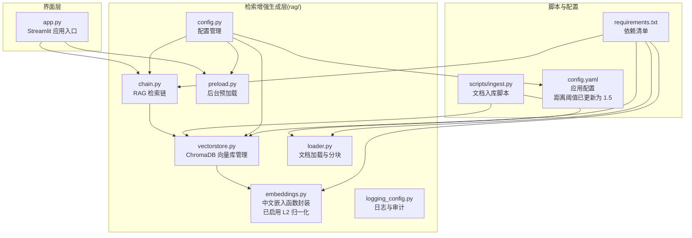
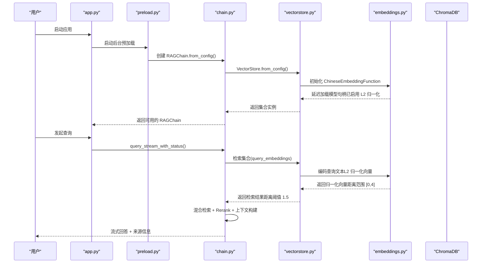
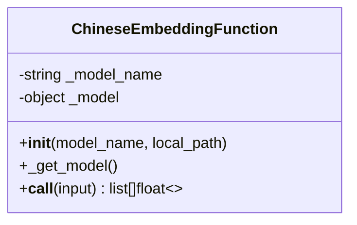
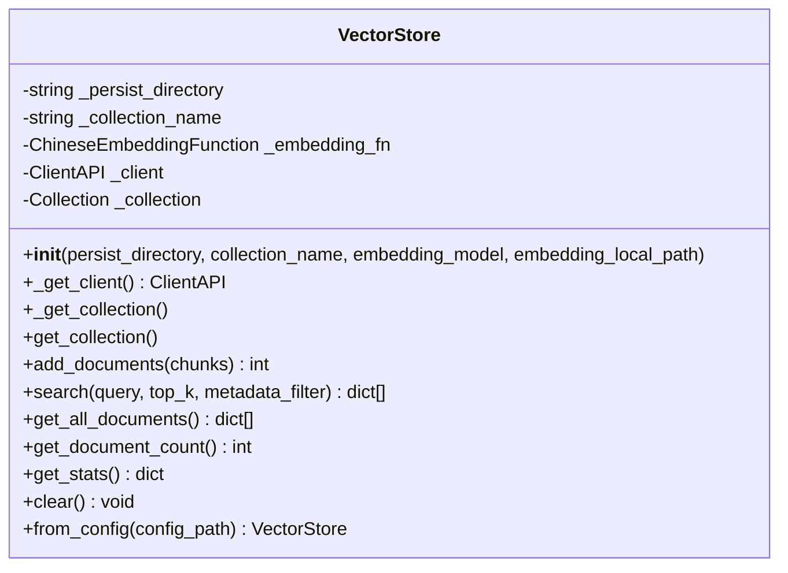
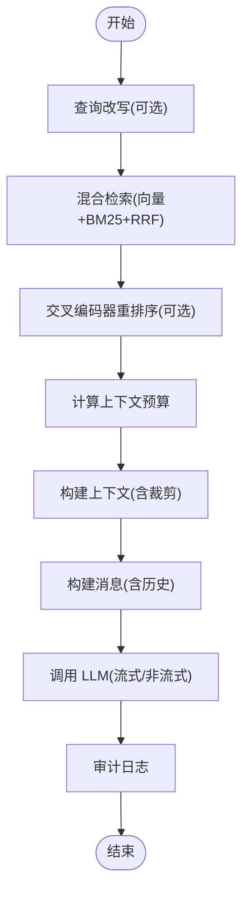
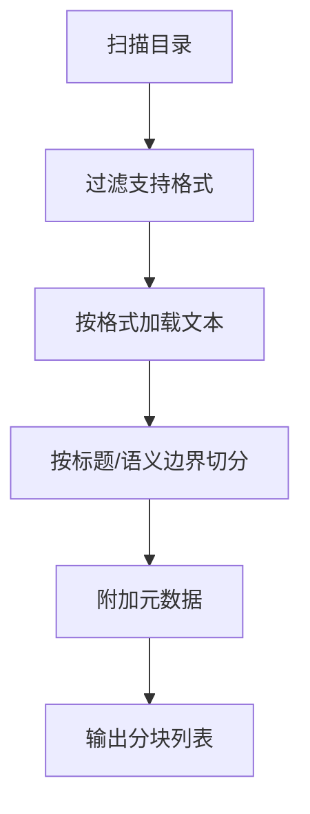
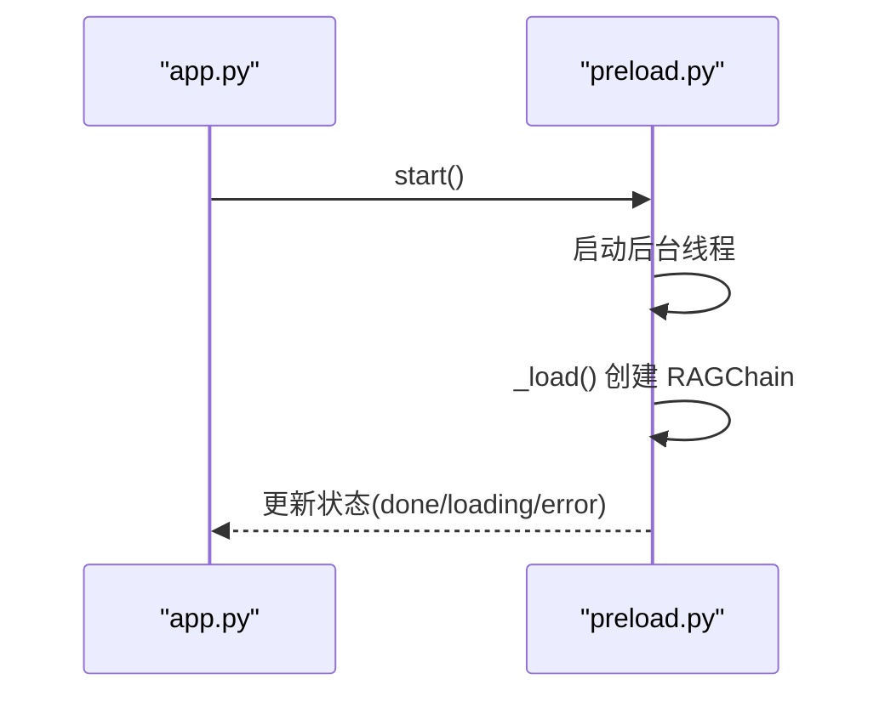
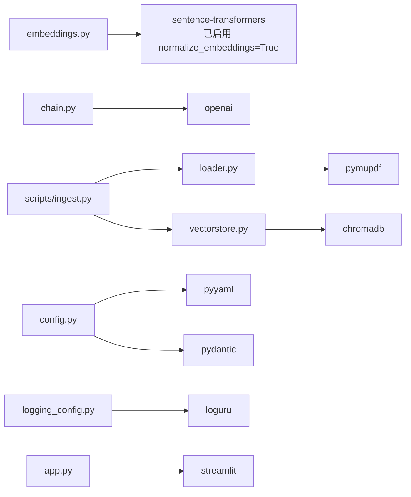

# 嵌入模型集成

<cite>
**本文引用的文件**
- [embeddings.py](file://rag/embeddings.py)
- [vectorstore.py](file://rag/vectorstore.py)
- [chain.py](file://rag/chain.py)
- [config.py](file://rag/config.py)
- [preload.py](file://rag/preload.py)
- [logging_config.py](file://rag/logging_config.py)
- [loader.py](file://rag/loader.py)
- [ingest.py](file://scripts/ingest.py)
- [app.py](file://app.py)
- [config.yaml](file://config.yaml)
- [requirements.txt](file://requirements.txt)
- [test_embeddings.py](file://tests/test_embeddings.py)
</cite>

## 更新摘要
**变更内容**
- 更新嵌入向量归一化架构说明，反映 L2 归一化对距离计算的影响
- 调整性能考量章节中关于距离阈值和相似度计算的说明
- 更新模型参数说明，反映新的距离范围和阈值设置
- 修正故障排查指南中关于距离阈值的参考信息

## 目录
1. [简介](#简介)
2. [项目结构](#项目结构)
3. [核心组件](#核心组件)
4. [架构总览](#架构总览)
5. [详细组件分析](#详细组件分析)
6. [依赖关系分析](#依赖关系分析)
7. [性能考量](#性能考量)
8. [故障排查指南](#故障排查指南)
9. [结论](#结论)
10. [附录](#附录)

## 简介
本技术文档聚焦于知识库系统的嵌入模型集成，围绕中文嵌入模型的选择与封装、模型缓存机制、性能优化策略、向量生成与批量处理、内存管理与模型加载优化等方面展开。文档还涵盖与向量数据库的集成方式、嵌入维度设置、相似度计算方法，并提供模型参数说明、使用示例与性能调优建议，帮助开发者快速上手并稳定运行。

**重要架构变更**：嵌入向量现已采用 L2 归一化，使平方欧几里得距离范围限定在 [0, 4] 区间，提供更直观的距离阈值选择和数学上更稳健的相关性评分。

## 项目结构
本项目采用"界面层(ui/) + 业务层(services/) + 检索增强生成层(rag/)"的分层架构。嵌入模型集成位于 rag/ 子模块，包括嵌入函数封装、向量库管理、RAG 检索链、文档加载与分块、以及后台预加载等关键组件。

**图表来源**
- [app.py:1-189](file://app.py#L1-L189)
- [embeddings.py:1-88](file://rag/embeddings.py#L1-L88)
- [vectorstore.py:1-217](file://rag/vectorstore.py#L1-L217)
- [chain.py:1-746](file://rag/chain.py#L1-L746)
- [loader.py:1-259](file://rag/loader.py#L1-L259)
- [preload.py:1-73](file://rag/preload.py#L1-L73)
- [logging_config.py:1-129](file://rag/logging_config.py#L1-L129)
- [config.py:1-183](file://rag/config.py#L1-L183)
- [ingest.py:1-62](file://scripts/ingest.py#L1-L62)
- [config.yaml:1-79](file://config.yaml#L1-L79)
- [requirements.txt:1-11](file://requirements.txt#L1-L11)

**章节来源**
- [app.py:1-189](file://app.py#L1-L189)
- [config.py:1-183](file://rag/config.py#L1-L183)
- [config.yaml:1-79](file://config.yaml#L1-L79)

## 核心组件
- 中文嵌入函数封装：基于 sentence-transformers 的中文嵌入函数，支持在线与离线两种加载模式，延迟加载模型并提供进度提示。**现已启用 L2 归一化，输出向量位于单位球面，平方 L2 距离范围为 [0, 4]**。
- 向量库管理：基于 ChromaDB 的持久化客户端与集合管理，提供文档入库、检索、统计与清空等功能；通过全局单例缓存避免重复加载嵌入模型。
- RAG 检索链：实现混合检索（向量 + BM25 + RRF 融合）、查询改写、交叉编码器重排序、上下文预算与裁剪、多轮对话历史注入、流式与非流式 LLM 调用及重试。
- 文档加载与分块：支持 Markdown、纯文本、PDF，按标题与语义边界切分，保留元数据；提供元数据查询接口。
- 后台预加载：在后台线程中预热 RAGChain，避免首次请求冷启动延迟。
- 日志与审计：统一日志输出与审计日志记录，便于问题定位与合规审计。
- 配置管理：Pydantic 驱动的配置校验与环境变量替换，支持全局单例访问。

**章节来源**
- [embeddings.py:48-88](file://rag/embeddings.py#L48-L88)
- [vectorstore.py:32-217](file://rag/vectorstore.py#L32-L217)
- [chain.py:162-746](file://rag/chain.py#L162-L746)
- [loader.py:22-259](file://rag/loader.py#L22-L259)
- [preload.py:22-73](file://rag/preload.py#L22-L73)
- [logging_config.py:46-129](file://rag/logging_config.py#L46-L129)
- [config.py:48-183](file://rag/config.py#L48-L183)

## 架构总览
嵌入模型集成贯穿"文档入库 → 向量库持久化 → 检索增强生成"的完整链路。下图展示从配置到检索的关键交互：

**图表来源**
- [app.py:32-41](file://app.py#L32-L41)
- [preload.py:22-49](file://rag/preload.py#L22-L49)
- [chain.py:425-528](file://rag/chain.py#L425-L528)
- [vectorstore.py:47-63](file://rag/vectorstore.py#L47-L63)
- [embeddings.py:77-87](file://rag/embeddings.py#L77-L87)

## 详细组件分析

### 中文嵌入函数封装（ChineseEmbeddingFunction）
- 设计目标：将 sentence-transformers 的中文模型封装为 ChromaDB 兼容的 embedding function，支持在线与离线两种加载方式。
- 延迟加载：首次调用时才实例化模型，避免启动时阻塞；加载过程提供进度提示。
- 编码接口：接收文档列表，返回向量列表；日志记录输入数量与输出维度。
- **L2 归一化**：输出向量经过 L2 归一化，位于单位球面上，平方 L2 距离范围为 [0, 4]，便于使用合理的距离阈值（约 1.5）过滤低相关度结果。
- 镜像加速：默认设置国内 HuggingFace 镜像地址，提升下载稳定性。

**图表来源**
- [embeddings.py:48-88](file://rag/embeddings.py#L48-L88)

**章节来源**
- [embeddings.py:48-88](file://rag/embeddings.py#L48-L88)

### 向量库管理（VectorStore）
- 单例缓存：通过全局变量与配置键缓存 VectorStore 实例，避免重复加载嵌入模型。
- 集合管理：延迟初始化客户端与集合，支持获取、创建、切换集合。
- 文档入库：支持增量更新（同 ID 删除后新增），自动去重。
- 检索接口：支持元数据过滤与 top_k 返回；返回包含内容、元数据与距离。
- 统计与清空：提供文档数量统计、文件数统计、清空集合等辅助能力。

**图表来源**
- [vectorstore.py:32-217](file://rag/vectorstore.py#L32-L217)

**章节来源**
- [vectorstore.py:32-217](file://rag/vectorstore.py#L32-L217)

### RAG 检索链（RAGChain）
- 混合检索：向量检索（ChromaDB）+ BM25 关键词检索 + RRF 融合，提升召回质量。
- 查询改写：对短查询结合历史上下文进行改写，提高检索准确性。
- 交叉编码器重排序：类级别缓存 CrossEncoder 模型，避免重复加载。
- 上下文构建：估算 token 预算，自动裁剪，支持低置信度提示。
- 多轮对话：注入最近若干轮对话历史，控制上下文长度。
- LLM 调用：支持流式与非流式，带指数退避重试与降级处理。
- 审计日志：记录查询详情、耗时、结果数量等。

**图表来源**
- [chain.py:238-449](file://rag/chain.py#L238-L449)
- [chain.py:529-746](file://rag/chain.py#L529-L746)

**章节来源**
- [chain.py:162-746](file://rag/chain.py#L162-L746)

### 文档加载与分块（Loader）
- 支持格式：Markdown、纯文本、PDF（依赖 pymupdf）。
- 分块策略：按标题与语义边界切分，保留代码块完整性，支持重叠。
- 元数据：包含来源路径、标题、块索引、文件类型等。
- 元数据查询：提供仅读取元数据的接口，避免加载全文。

**图表来源**
- [loader.py:131-197](file://rag/loader.py#L131-L197)

**章节来源**
- [loader.py:22-259](file://rag/loader.py#L22-L259)

### 后台预加载（Preload）
- 目标：在应用启动时后台加载 RAGChain，避免首次请求冷启动。
- 状态管理：线程安全的状态字典，支持启动、完成、错误、加载中等状态。
- 幂等设计：多次调用只启动一次后台线程。

**图表来源**
- [preload.py:22-49](file://rag/preload.py#L22-L49)
- [app.py:32-41](file://app.py#L32-L41)

**章节来源**
- [preload.py:22-73](file://rag/preload.py#L22-L73)
- [app.py:23-41](file://app.py#L23-L41)

### 日志与审计（Logging & Audit）
- 结构化日志：控制台彩色输出 + 文件完整日志，统一格式。
- 审计日志：按日期写入 JSONL 文件，记录查询、耗时、结果数量等。

**章节来源**
- [logging_config.py:46-129](file://rag/logging_config.py#L46-L129)

### 配置管理（Config）
- Pydantic 验证：对各模块配置进行字段校验与默认值设置。
- 环境变量替换：支持 ${VAR} 与 ${VAR:-default} 语法。
- 全局单例：提供 get_config/reload_config/load_config 访问方式。

**章节来源**
- [config.py:48-183](file://rag/config.py#L48-L183)

## 依赖关系分析
- 嵌入模型依赖：sentence-transformers（中文嵌入）、chromadb（向量库）、openai（LLM 调用）。
- 文档解析依赖：pymupdf（PDF 解析）。
- 配置与日志：pyyaml、pydantic、loguru。
- UI 与服务：streamlit、httpx。

**图表来源**
- [requirements.txt:1-11](file://requirements.txt#L1-L11)
- [embeddings.py:10-16](file://rag/embeddings.py#L10-L16)
- [vectorstore.py:10-15](file://rag/vectorstore.py#L10-L15)
- [chain.py:12-16](file://rag/chain.py#L12-L16)
- [loader.py:104-118](file://rag/loader.py#L104-L118)
- [config.py:12-13](file://rag/config.py#L12-L13)
- [logging_config.py:6-10](file://rag/logging_config.py#L6-L10)
- [app.py:11](file://app.py#L11)
- [ingest.py:17-21](file://scripts/ingest.py#L17-L21)

**章节来源**
- [requirements.txt:1-11](file://requirements.txt#L1-L11)

## 性能考量
- 模型加载优化
  - 延迟加载：嵌入模型与 reranker 模型均采用延迟加载，首次调用时实例化，避免启动阻塞。
  - 类级别缓存：RAGChain 对 reranker 模型进行类级别缓存，避免重复加载。
  - 全局单例缓存：VectorStore 通过配置键缓存实例，避免重复初始化嵌入函数。
- 内存管理
  - 向量库持久化：ChromaDB 采用持久化客户端，减少重复加载开销。
  - 文档分块：按语义边界切分，避免大段文本导致内存峰值过高。
- 批量处理
  - 文档入库：按 ID 列表进行批量 add，支持增量更新（先 delete 后 add）。
  - 检索：ChromaDB query 支持批量向量检索，返回 top_k 结果。
- I/O 与网络
  - 国内镜像：默认设置 HF_ENDPOINT 为国内镜像，提升模型下载稳定性。
  - 重试与降级：LLM 调用采用指数退避重试，失败时降级为非流式调用。
- **相似度与阈值**
  - **L2 归一化**：嵌入向量现已启用 L2 归一化，输出向量位于单位球面，平方 L2 距离范围为 [0, 4]。
  - **距离阈值**：配置中提供 distance_threshold，默认 1.5，过滤平方 L2 距离大于 1.5 的低相关度文档块。
  - **相似度换算**：平方 L2 距离 1.5 对应余弦相似度约 0.25，提供更直观的距离阈值选择。
  - **阈值调优**：可根据业务需求调整阈值，范围 0-4，数值越小表示相关性越高。

**章节来源**
- [embeddings.py:77-87](file://rag/embeddings.py#L77-L87)
- [chain.py:290-310](file://rag/chain.py#L290-L310)
- [vectorstore.py:132-150](file://rag/vectorstore.py#L132-L150)
- [config.yaml:42-44](file://config.yaml#L42-L44)

## 故障排查指南
- 模型下载失败
  - 现象：首次加载嵌入模型报网络错误。
  - 处理：确认 HF_ENDPOINT 设置为国内镜像；检查代理与网络连通性；必要时使用离线本地路径。
  - 参考：[embeddings.py:10](file://rag/embeddings.py#L10)、[ingest.py:11-12](file://scripts/ingest.py#L11-L12)、[app.py:19-20](file://app.py#L19-L20)
- 向量库初始化异常
  - 现象：ChromaDB 客户端或集合创建失败。
  - 处理：检查 persist_directory 权限与磁盘空间；确认配置项正确；尝试清空集合后重试。
  - 参考：[vectorstore.py:40-45](file://rag/vectorstore.py#L40-L45)、[vectorstore.py:47-55](file://rag/vectorstore.py#L47-L55)
- 检索无结果
  - 现象：query 返回空列表。
  - 处理：**降低 distance_threshold（当前默认为 1.5）；检查入库文档是否正确；确认 chunk_size 与 overlap 合理**。
  - 参考：[chain.py:290-310](file://rag/chain.py#L290-L310)、[config.yaml:42-44](file://config.yaml#L42-L44)
- LLM 调用失败
  - 现象：流式或非流式调用抛出异常。
  - 处理：查看重试日志；检查 api_base 与 api_key；确认模型名称与限额。
  - 参考：[chain.py:529-746](file://rag/chain.py#L529-L746)
- 审计日志未生成
  - 现象：审计文件未出现。
  - 处理：确认 audit_enabled 开启；检查日志目录权限。
  - 参考：[logging_config.py:86-129](file://rag/logging_config.py#L86-L129)

**章节来源**
- [embeddings.py:10](file://rag/embeddings.py#L10)
- [vectorstore.py:40-55](file://rag/vectorstore.py#L40-L55)
- [chain.py:290-310](file://rag/chain.py#L290-L310)
- [chain.py:529-746](file://rag/chain.py#L529-L746)
- [logging_config.py:86-129](file://rag/logging_config.py#L86-L129)

## 结论
本嵌入模型集成方案以 sentence-transformers 为基础，结合 ChromaDB 与自研检索链路，实现了中文场景下的高效检索增强生成。通过延迟加载、类级别缓存与全局单例缓存等策略，有效降低了冷启动与重复加载成本；通过混合检索、重排序与上下文预算控制，提升了检索质量与回答稳定性。

**重要改进**：嵌入向量现已启用 L2 归一化，将平方欧几里得距离范围限定在 [0, 4] 区间，提供更直观的距离阈值选择（默认 1.5）和数学上更稳健的相关性评分。这一架构变更显著改善了相似度计算的可解释性和稳定性。

配合完善的日志与审计体系，便于运维与问题定位。建议在生产环境中结合硬件资源与业务负载，合理设置 chunk_size、overlap、top_k 与距离阈值，并定期评估 reranker 模型与 LLM 的性能表现。

## 附录

### 使用示例与最佳实践
- 文档入库
  - 使用脚本扫描知识库目录，按配置分块并入库。
  - 参考：[ingest.py:25-58](file://scripts/ingest.py#L25-L58)
- 启动应用与预加载
  - 应用启动即触发后台预加载，避免首次查询延迟。
  - 参考：[app.py:32-41](file://app.py#L32-L41)、[preload.py:22-49](file://rag/preload.py#L22-L49)
- 查询流程
  - 支持流式回答与来源标注；可关闭混合检索或重排序以对比性能。
  - 参考：[chain.py:425-528](file://rag/chain.py#L425-L528)

**章节来源**
- [ingest.py:25-58](file://scripts/ingest.py#L25-L58)
- [app.py:32-41](file://app.py#L32-L41)
- [chain.py:425-528](file://rag/chain.py#L425-L528)

### 模型参数说明
- 嵌入模型
  - 默认模型：shibing624/text2vec-base-chinese
  - **维度**：768（经 L2 归一化，平方 L2 距离范围 [0, 4]）
  - **归一化**：已启用 normalize_embeddings=True，输出向量位于单位球面
  - 加载方式：在线（HuggingFace）或离线（本地路径）
  - 参考：[embeddings.py:77-87](file://rag/embeddings.py#L77-L87)、[config.yaml:19-25](file://config.yaml#L19-L25)
- 向量库
  - 持久化目录：./chroma_db
  - 集合名称：knowledge_base
  - top_k：默认 5
  - **距离阈值**：默认 1.5（平方 L2 距离，过滤低相关度）
  - **阈值含义**：平方 L2 距离 1.5 对应余弦相似度约 0.25
  - 参考：[config.yaml:38-44](file://config.yaml#L38-L44)、[vectorstore.py:132-150](file://rag/vectorstore.py#L132-L150)
- 检索链
  - 重排序模型：BAAI/bge-reranker-base（类级别缓存）
  - 查询改写：对短查询结合历史上下文改写
  - 参考：[chain.py:351-449](file://rag/chain.py#L351-L449)、[chain.py:254-275](file://rag/chain.py#L254-L275)

**章节来源**
- [embeddings.py:77-87](file://rag/embeddings.py#L77-L87)
- [config.yaml:19-44](file://config.yaml#L19-L44)
- [chain.py:351-449](file://rag/chain.py#L351-L449)
- [chain.py:254-275](file://rag/chain.py#L254-L275)

### 性能基准测试建议
- 模型加载
  - 记录首次加载时间与内存峰值；对比在线与离线加载差异。
- 检索性能
  - **测试不同距离阈值（0-4）对召回与延迟的影响；对比 L2 归一化前后的相似度计算稳定性**。
  - 测试不同 top_k、距离阈值对召回与延迟的影响；对比仅向量检索与混合检索。
- 生成性能
  - 对比流式与非流式 LLM 调用的首 Token 延迟与总耗时；评估重排序带来的额外开销。
- 建议指标
  - P95/P99 延迟、吞吐量、错误率、重试次数、审计日志落盘耗时。

### 开发者选择与调优建议
- 模型选择
  - 中文场景优先考虑 shibing624/text2vec-base-chinese；若对召回质量要求更高，可评估更大模型并评估延迟与内存。
- 向量库参数
  - chunk_size 与 overlap：平衡语义完整性与检索粒度；建议从 500/50 开始调整。
  - top_k：根据业务召回需求与 LLM 上下文窗口综合确定。
  - **距离阈值**：**从 1.5 开始，逐步调整以平衡召回与准确率；范围 0-4，数值越小相关性越高**。
- 缓存与并发
  - 启用类级别 reranker 缓存与全局 VectorStore 单例缓存。
  - 后台预加载结合多轮对话历史注入，减少重复初始化。
- 稳定性
  - 开启审计日志；为 LLM 调用配置重试与降级；监控日志输出与异常告警。
- **相似度理解**
  - **平方 L2 距离范围 [0, 4]，阈值 1.5 对应余弦相似度约 0.25；距离越小表示相关性越高**。