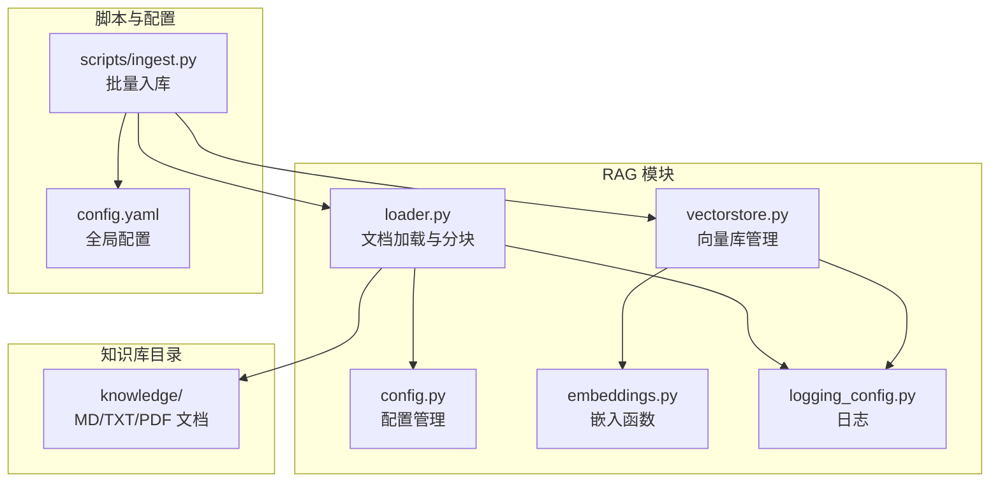
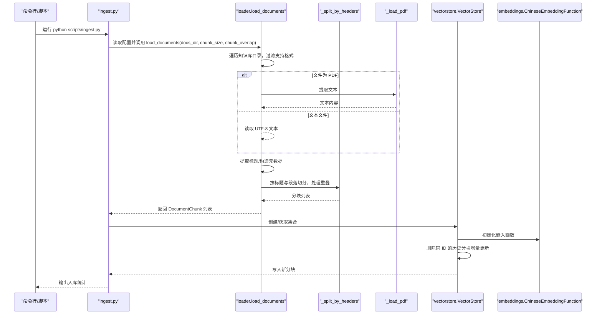
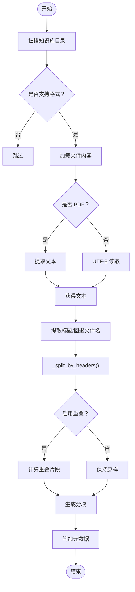
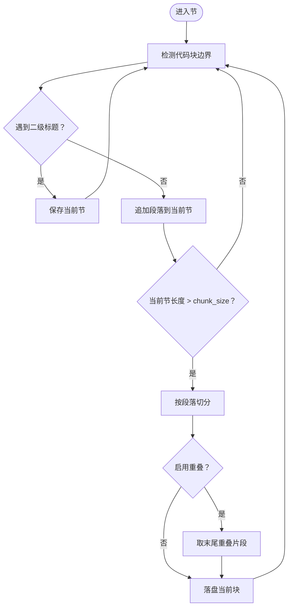
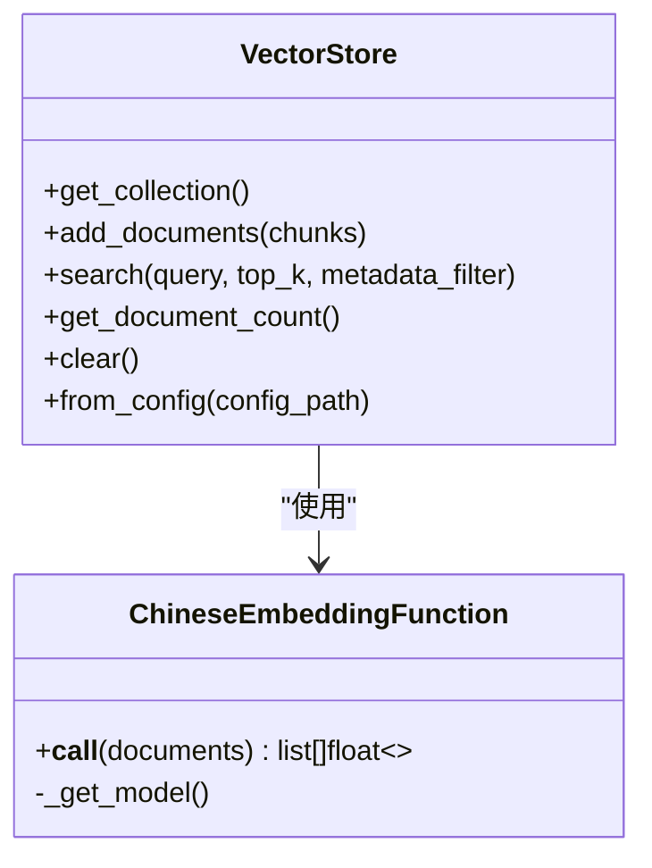
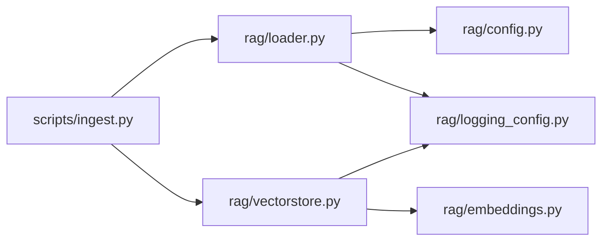

# 文档加载器

<cite>
**本文引用的文件**
- [rag/loader.py](file://rag/loader.py)
- [rag/config.py](file://rag/config.py)
- [rag/vectorstore.py](file://rag/vectorstore.py)
- [rag/embeddings.py](file://rag/embeddings.py)
- [rag/logging_config.py](file://rag/logging_config.py)
- [scripts/ingest.py](file://scripts/ingest.py)
- [tests/test_loader.py](file://tests/test_loader.py)
- [config.yaml](file://config.yaml)
- [knowledge/README.md](file://knowledge/README.md)
- [knowledge/_acceptor_8cc.md](file://knowledge/_acceptor_8cc.md)
- [knowledge/_async_logging_8cc.md](file://knowledge/_async_logging_8cc.md)
</cite>

## 目录
1. [简介](#简介)
2. [项目结构](#项目结构)
3. [核心组件](#核心组件)
4. [架构总览](#架构总览)
5. [详细组件分析](#详细组件分析)
6. [依赖关系分析](#依赖关系分析)
7. [性能考量](#性能考量)
8. [故障排查指南](#故障排查指南)
9. [结论](#结论)
10. [附录](#附录)

## 简介
本文档面向开发者，系统性阐述“文档加载器”的技术实现与最佳实践，涵盖以下主题：
- 多格式文档支持（MD、TXT、PDF）
- 文档解析流程与分块策略
- 元数据提取与编码处理
- 重叠处理与语义边界切分
- 与嵌入模型的集成方式
- 批量处理优化与错误处理机制
- 使用示例、支持格式说明、分块参数配置
- 扩展新格式的指导

## 项目结构
文档加载器位于 rag/loader.py，配合配置、向量库、嵌入函数与日志模块协同工作；脚本入口 scripts/ingest.py 负责批量入库流程。



图表来源
- [rag/loader.py:1-259](file://rag/loader.py#L1-L259)
- [rag/config.py:1-184](file://rag/config.py#L1-L184)
- [rag/vectorstore.py:1-209](file://rag/vectorstore.py#L1-L209)
- [rag/embeddings.py:1-48](file://rag/embeddings.py#L1-L48)
- [rag/logging_config.py:1-129](file://rag/logging_config.py#L1-L129)
- [scripts/ingest.py:1-62](file://scripts/ingest.py#L1-L62)
- [config.yaml:1-48](file://config.yaml#L1-L48)

章节来源
- [rag/loader.py:1-259](file://rag/loader.py#L1-L259)
- [scripts/ingest.py:1-62](file://scripts/ingest.py#L1-L62)
- [config.yaml:1-48](file://config.yaml#L1-L48)

## 核心组件
- 文档加载与分块：负责扫描知识库目录、识别支持格式、提取标题、按语义边界切分、生成分块并附加元数据。
- 配置管理：提供 Pydantic 模型化的配置对象，含知识库分块参数、嵌入模型、向量库、LLM 等。
- 向量库管理：封装 ChromaDB，提供集合创建、文档入库、检索、统计与清理能力。
- 嵌入函数：封装 sentence-transformers 的中文向量模型，支持在线/离线加载。
- 日志系统：统一输出与审计日志，便于问题定位与运行监控。
- 批量入库脚本：串联加载、分块、向量化与入库流程。

章节来源
- [rag/loader.py:131-197](file://rag/loader.py#L131-L197)
- [rag/config.py:72-84](file://rag/config.py#L72-L84)
- [rag/vectorstore.py:24-209](file://rag/vectorstore.py#L24-L209)
- [rag/embeddings.py:19-48](file://rag/embeddings.py#L19-L48)
- [rag/logging_config.py:46-84](file://rag/logging_config.py#L46-L84)
- [scripts/ingest.py:25-58](file://scripts/ingest.py#L25-L58)

## 架构总览
文档加载器的端到端流程如下：



图表来源
- [scripts/ingest.py:25-58](file://scripts/ingest.py#L25-L58)
- [rag/loader.py:131-197](file://rag/loader.py#L131-L197)
- [rag/loader.py:29-89](file://rag/loader.py#L29-L89)
- [rag/loader.py:101-118](file://rag/loader.py#L101-L118)
- [rag/vectorstore.py:89-112](file://rag/vectorstore.py#L89-L112)
- [rag/embeddings.py:27-47](file://rag/embeddings.py#L27-L47)

## 详细组件分析

### 文档加载与分块（loader）
- 支持格式：.md、.txt、.pdf
- 目录扫描：递归遍历知识库目录，排除 README.md，可选 file_filter 过滤特定文件
- 编码处理：文本文件以 UTF-8 解码；PDF 通过第三方库提取文本
- 标题提取：优先取文档首行标题，否则回退为文件名
- 分块策略：
  - 一级：按 Markdown 二级标题“##”切分，保留标题作为上下文
  - 二级：当某节超过 chunk_size，按段落“空行分隔”进一步切分
  - 三级：代码块“```”内不被截断，确保完整性
  - 重叠：当启用重叠时，相邻分块末尾保留 overlap 字符，形成平滑过渡
- 元数据：包含 source（相对路径）、title、chunk_index、file_type



图表来源
- [rag/loader.py:157-197](file://rag/loader.py#L157-L197)
- [rag/loader.py:29-89](file://rag/loader.py#L29-L89)
- [rag/loader.py:101-118](file://rag/loader.py#L101-L118)
- [rag/loader.py:92-98](file://rag/loader.py#L92-L98)

章节来源
- [rag/loader.py:18-19](file://rag/loader.py#L18-L19)
- [rag/loader.py:131-197](file://rag/loader.py#L131-L197)
- [rag/loader.py:29-89](file://rag/loader.py#L29-L89)
- [rag/loader.py:92-98](file://rag/loader.py#L92-L98)
- [rag/loader.py:101-118](file://rag/loader.py#L101-L118)

### 分块算法与重叠处理
- 标题优先：遇到“##”即视为新节起点，当前节结束
- 代码块保护：检测“```”成对出现，整块不被截断
- 段落切分：节内按“空行”分割段落，逐段拼接，超过阈值则落盘并结合重叠策略
- 重叠策略：若开启重叠，当前块末尾截取 overlap 字符作为下一块开头，保证语义连续性



图表来源
- [rag/loader.py:29-89](file://rag/loader.py#L29-L89)

章节来源
- [rag/loader.py:29-89](file://rag/loader.py#L29-L89)

### PDF 文本提取
- 优先尝试“pymupdf”，失败回退“fitz”
- 逐页提取文本并合并，返回纯文本
- 异常时抛出导入错误提示，指引安装依赖

章节来源
- [rag/loader.py:101-118](file://rag/loader.py#L101-L118)

### 元数据提取与文件清单
- get_knowledge_files_meta：仅读取文件头信息，不加载全文，快速生成文件元数据（路径、标题、大小、修改时间、图标）
- PDF 元数据：由于无法快速提取标题，回退为文件名
- 文本文件：读取前若干行，提取首标题或回退文件名

章节来源
- [rag/loader.py:200-244](file://rag/loader.py#L200-L244)

### 配置管理（config）
- 知识库配置：docs_directory、chunk_size、chunk_overlap，并校验重叠不得大于分块大小
- 嵌入模型配置：模型名或本地路径
- 向量库配置：持久化目录、集合名、top_k、距离阈值
- 应用配置：统一入口，支持环境变量替换与单例缓存

章节来源
- [rag/config.py:72-84](file://rag/config.py#L72-L84)
- [rag/config.py:118-150](file://rag/config.py#L118-L150)
- [config.yaml:24-28](file://config.yaml#L24-L28)

### 向量库与嵌入函数（vectorstore + embeddings）
- VectorStore：延迟初始化客户端与集合，支持集合切换、增删改查、统计与清理
- 增量更新：入库前按 ID 删除历史同名分块，确保覆盖最新版本
- ChineseEmbeddingFunction：封装 sentence-transformers，支持在线/离线模型加载，带进度条与调试日志
- 单例缓存：相同配置复用同一实例，避免重复加载模型



图表来源
- [rag/vectorstore.py:24-209](file://rag/vectorstore.py#L24-L209)
- [rag/embeddings.py:19-48](file://rag/embeddings.py#L19-L48)

章节来源
- [rag/vectorstore.py:89-112](file://rag/vectorstore.py#L89-L112)
- [rag/embeddings.py:27-47](file://rag/embeddings.py#L27-L47)

### 批量入库脚本（ingest）
- 设置 HF 镜像环境变量，加速模型下载
- 读取配置，扫描知识库目录，加载并分块
- 向量化并写入 ChromaDB，输出统计信息

章节来源
- [scripts/ingest.py:25-58](file://scripts/ingest.py#L25-L58)

### 日志与审计（logging_config）
- 控制台彩色输出 + 文件完整日志
- 审计日志：按天写入 JSONL，包含用户、动作、查询、结果数、耗时等字段

章节来源
- [rag/logging_config.py:46-84](file://rag/logging_config.py#L46-L84)
- [rag/logging_config.py:86-129](file://rag/logging_config.py#L86-L129)

## 依赖关系分析
- 组件耦合
  - loader 依赖 config（读取分块参数），依赖 logging（记录警告/统计）
  - vectorstore 依赖 embeddings（向量化），依赖 config（读取向量库与嵌入配置）
  - ingest 脚本串联 loader 与 vectorstore，并读取 config.yaml
- 外部依赖
  - PDF：pymupdf/fitz
  - 向量：sentence-transformers、chromadb
  - 配置：Pydantic、yaml
- 循环依赖：无



图表来源
- [scripts/ingest.py:17-19](file://scripts/ingest.py#L17-L19)
- [rag/loader.py:12-15](file://rag/loader.py#L12-L15)
- [rag/vectorstore.py:12-15](file://rag/vectorstore.py#L12-L15)
- [rag/embeddings.py:12](file://rag/embeddings.py#L12)
- [rag/logging_config.py:6-15](file://rag/logging_config.py#L6-L15)

章节来源
- [scripts/ingest.py:17-19](file://scripts/ingest.py#L17-L19)
- [rag/loader.py:12-15](file://rag/loader.py#L12-L15)
- [rag/vectorstore.py:12-15](file://rag/vectorstore.py#L12-L15)
- [rag/embeddings.py:12](file://rag/embeddings.py#L12)
- [rag/logging_config.py:6-15](file://rag/logging_config.py#L6-L15)

## 性能考量
- 扫描与过滤：使用递归遍历与集合过滤，避免不必要的 IO
- 重叠策略：适度重叠提升召回但增加向量数量，需权衡检索速度与精度
- 增量更新：入库前删除同 ID 历史分块，避免重复向量化
- 模型加载：嵌入函数延迟加载并单例缓存，减少重复开销
- PDF 提取：逐页读取，内存占用与页数线性相关，建议合理设置 chunk_size
- 日志级别：生产环境建议 INFO，避免过多 DEBUG 输出影响吞吐

[本节为通用性能建议，无需特定文件来源]

## 故障排查指南
- PDF 无法读取
  - 现象：导入错误提示缺少 pymupdf
  - 处理：安装依赖后重试
  - 参考
    - [rag/loader.py:109-111](file://rag/loader.py#L109-L111)
- 文档未入库
  - 现象：未找到有效文档
  - 处理：确认知识库目录存在且包含 .md/.txt/.pdf 文件，README.md 默认被忽略
  - 参考
    - [scripts/ingest.py:39-41](file://scripts/ingest.py#L39-L41)
    - [rag/loader.py:162-165](file://rag/loader.py#L162-L165)
- 分块重叠异常
  - 现象：重叠过大导致报错
  - 处理：检查配置中 chunk_overlap 是否小于 chunk_size
  - 参考
    - [rag/config.py:78-83](file://rag/config.py#L78-L83)
- 向量库为空
  - 现象：检索无结果
  - 处理：确认已执行入库脚本，检查集合名与持久化目录
  - 参考
    - [rag/vectorstore.py:144-147](file://rag/vectorstore.py#L144-L147)
- 模型加载缓慢
  - 现象：首次加载耗时较长
  - 处理：使用离线本地路径或提前下载模型
  - 参考
    - [rag/embeddings.py:35-38](file://rag/embeddings.py#L35-L38)

章节来源
- [rag/loader.py:109-111](file://rag/loader.py#L109-L111)
- [scripts/ingest.py:39-41](file://scripts/ingest.py#L39-L41)
- [rag/config.py:78-83](file://rag/config.py#L78-L83)
- [rag/vectorstore.py:144-147](file://rag/vectorstore.py#L144-L147)
- [rag/embeddings.py:35-38](file://rag/embeddings.py#L35-L38)

## 结论
文档加载器以清晰的职责划分与稳健的实现，提供了从多格式文档到向量库的完整链路。其分块策略兼顾语义完整性与检索效率，重叠处理与增量更新机制满足实际业务需求。通过配置驱动与单例缓存，系统具备良好的可维护性与性能表现。建议在生产环境中结合日志与审计功能进行持续监控，并根据业务场景调整分块参数与检索阈值。

[本节为总结性内容，无需特定文件来源]

## 附录

### 使用示例
- 基本使用
  - 将 .md/.txt/.pdf 放入知识库目录
  - 运行入库脚本，自动加载、分块、向量化并写入向量库
  - 参考
    - [scripts/ingest.py:25-58](file://scripts/ingest.py#L25-L58)
    - [knowledge/README.md:5-9](file://knowledge/README.md#L5-L9)
- 交互式示例（参考知识库文档）
  - 参考
    - [knowledge/_acceptor_8cc.md:13-104](file://knowledge/_acceptor_8cc.md#L13-L104)
    - [knowledge/_async_logging_8cc.md:13-151](file://knowledge/_async_logging_8cc.md#L13-L151)

章节来源
- [scripts/ingest.py:25-58](file://scripts/ingest.py#L25-L58)
- [knowledge/README.md:5-9](file://knowledge/README.md#L5-L9)
- [knowledge/_acceptor_8cc.md:13-104](file://knowledge/_acceptor_8cc.md#L13-L104)
- [knowledge/_async_logging_8cc.md:13-151](file://knowledge/_async_logging_8cc.md#L13-L151)

### 支持格式说明
- .md：Markdown，按标题与段落切分，保留代码块完整性
- .txt：纯文本，UTF-8 编码读取
- .pdf：二进制 PDF，通过第三方库提取文本

章节来源
- [rag/loader.py:18-19](file://rag/loader.py#L18-L19)
- [rag/loader.py:121-128](file://rag/loader.py#L121-L128)
- [rag/loader.py:101-118](file://rag/loader.py#L101-L118)

### 分块参数配置
- docs_directory：知识库目录
- chunk_size：分块最大字符数
- chunk_overlap：分块重叠字符数（必须小于 chunk_size）

章节来源
- [rag/config.py:72-84](file://rag/config.py#L72-L84)
- [config.yaml:24-28](file://config.yaml#L24-L28)

### 与嵌入模型的集成方式
- 模型选择：支持在线模型名或本地路径
- 加载策略：延迟加载，首次使用时下载/加载
- 向量维度：由模型决定，入库时自动编码

章节来源
- [rag/embeddings.py:27-47](file://rag/embeddings.py#L27-L47)
- [config.yaml:12-14](file://config.yaml#L12-L14)

### 批量处理优化
- 增量更新：按 ID 删除历史分块，避免重复向量化
- 单例缓存：相同配置复用 VectorStore 实例
- 日志与审计：统一输出与审计，便于问题定位

章节来源
- [rag/vectorstore.py:105-112](file://rag/vectorstore.py#L105-L112)
- [rag/vectorstore.py:182-209](file://rag/vectorstore.py#L182-L209)
- [rag/logging_config.py:46-84](file://rag/logging_config.py#L46-L84)
- [rag/logging_config.py:86-129](file://rag/logging_config.py#L86-L129)

### 错误处理机制
- 文件读取异常：记录警告并跳过该文件
- PDF 依赖缺失：抛出导入错误并提示安装
- 配置校验：重叠参数校验，防止非法配置

章节来源
- [rag/loader.py:167-171](file://rag/loader.py#L167-L171)
- [rag/loader.py:109-111](file://rag/loader.py#L109-L111)
- [rag/config.py:78-83](file://rag/config.py#L78-L83)

### 扩展新格式的支持指导
- 新增格式步骤
  - 在 SUPPORTED_EXTENSIONS 中加入新扩展名
  - 实现新的 _load_file 分支，处理新格式读取与编码
  - 如需特殊解析（如表格、代码块），在分块逻辑中补充相应规则
  - 更新 get_knowledge_files_meta 以支持新格式的快速元数据提取
- 测试建议
  - 编写单元测试覆盖新格式的读取、解析与分块行为
  - 参考现有测试风格
    - [tests/test_loader.py:16-66](file://tests/test_loader.py#L16-L66)
    - [tests/test_loader.py:84-121](file://tests/test_loader.py#L84-L121)

章节来源
- [rag/loader.py:18-19](file://rag/loader.py#L18-L19)
- [rag/loader.py:121-128](file://rag/loader.py#L121-L128)
- [tests/test_loader.py:16-66](file://tests/test_loader.py#L16-L66)
- [tests/test_loader.py:84-121](file://tests/test_loader.py#L84-L121)