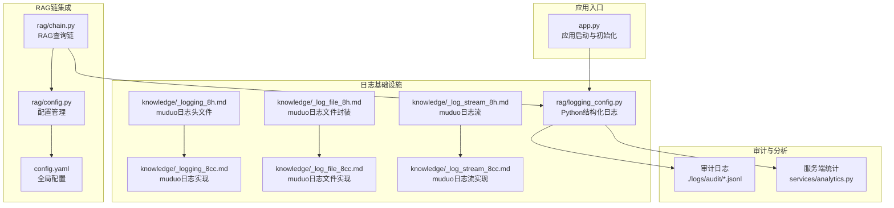
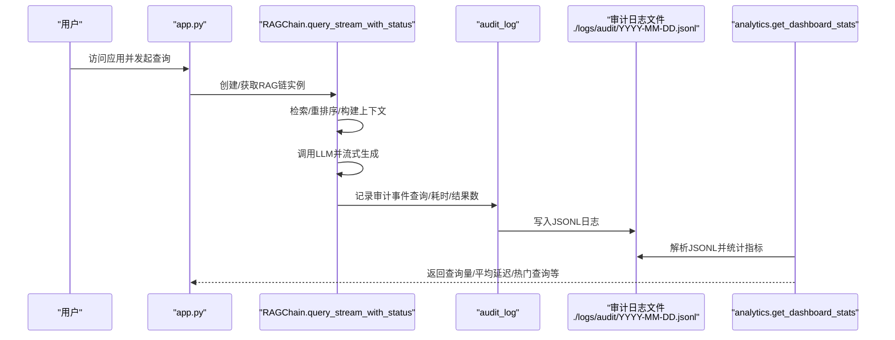
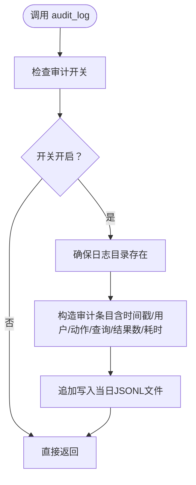
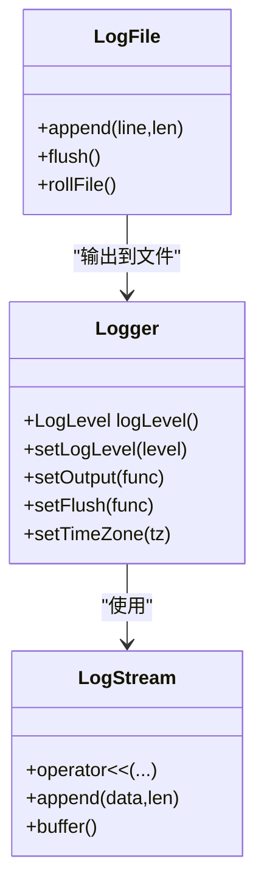
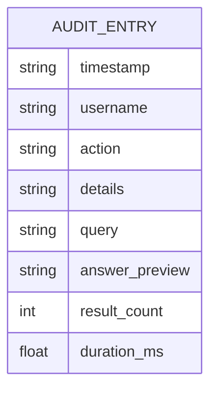
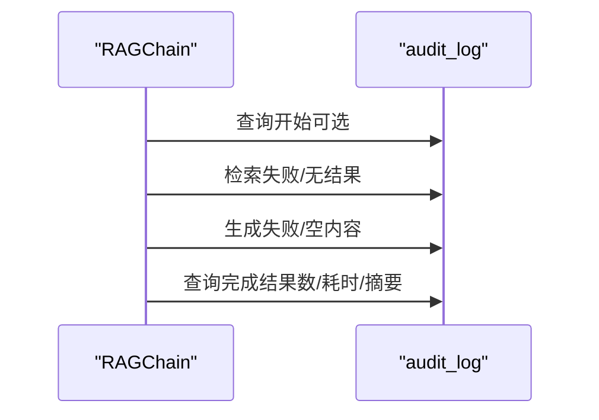
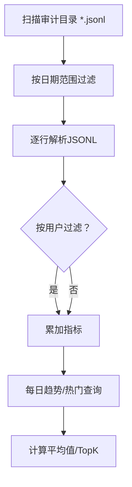
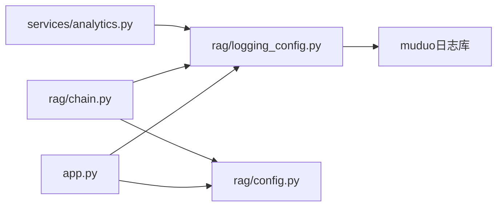

# 日志审计系统

<cite>
**本文档引用的文件**
- [rag/logging_config.py](file://rag/logging_config.py)
- [knowledge/_logging_8h.md](file://knowledge/_logging_8h.md)
- [knowledge/_logging_8cc.md](file://knowledge/_logging_8cc.md)
- [knowledge/_log_file_8h.md](file://knowledge/_log_file_8h.md)
- [knowledge/_log_file_8cc.md](file://knowledge/_log_file_8cc.md)
- [knowledge/_log_stream_8h.md](file://knowledge/_log_stream_8h.md)
- [knowledge/_log_stream_8cc.md](file://knowledge/_log_stream_8cc.md)
- [rag/config.py](file://rag/config.py)
- [app.py](file://app.py)
- [rag/chain.py](file://rag/chain.py)
- [services/analytics.py](file://services/analytics.py)
- [config.yaml](file://config.yaml)
- [scripts/ingest.py](file://scripts/ingest.py)
</cite>

## 目录
1. [简介](#简介)
2. [项目结构](#项目结构)
3. [核心组件](#核心组件)
4. [架构总览](#架构总览)
5. [详细组件分析](#详细组件分析)
6. [依赖关系分析](#依赖关系分析)
7. [性能考虑](#性能考虑)
8. [故障排查指南](#故障排查指南)
9. [结论](#结论)
10. [附录](#附录)

## 简介
本技术文档围绕日志审计系统展开，重点阐述结构化日志配置、审计跟踪机制、性能监控、日志级别管理等核心功能。文档详细描述日志格式规范、审计事件类型、敏感信息过滤、日志轮转策略等实现细节，并给出与RAG链的集成方式、审计日志的生成与存储、日志分析工具的使用方法。最后提供开发者最佳实践与故障诊断指导。

## 项目结构
日志审计系统由三层组成：
- 结构化日志基础设施层：基于Python标准库logging与muduo C++日志库，提供统一的日志输出、格式化与持久化能力。
- 审计日志管理层：负责审计事件的生成、落盘与聚合分析。
- RAG链集成层：在RAG查询流程中埋点审计事件，记录关键指标与行为轨迹。

**图表来源**
- [app.py:72](file://app.py#L72)
- [rag/logging_config.py:46](file://rag/logging_config.py#L46)
- [rag/chain.py:18](file://rag/chain.py#L18)
- [services/analytics.py:17](file://services/analytics.py#L17)
- [rag/config.py:103](file://rag/config.py#L103)
- [config.yaml:39](file://config.yaml#L39)

**章节来源**
- [app.py:72](file://app.py#L72)
- [rag/logging_config.py:46](file://rag/logging_config.py#L46)
- [rag/chain.py:18](file://rag/chain.py#L18)
- [services/analytics.py:17](file://services/analytics.py#L17)
- [rag/config.py:103](file://rag/config.py#L103)
- [config.yaml:39](file://config.yaml#L39)

## 核心组件
- Python结构化日志模块：提供控制台彩色输出与文件双通道日志，支持审计日志专用的JSONL格式落盘。
- muduo C++日志库：提供高性能日志流、时间戳格式化、线程安全与日志轮转能力。
- 审计日志管理：按日期切分的JSONL文件，记录查询、反馈等审计事件，支持统计分析。
- RAG链审计埋点：在查询生命周期的关键节点记录耗时、结果数量、错误详情等指标。
- 配置管理：集中管理审计开关、模型参数、向量库参数等，支持环境变量替换。

**章节来源**
- [rag/logging_config.py:46](file://rag/logging_config.py#L46)
- [knowledge/_logging_8h.md:130](file://knowledge/_logging_8h.md#L130)
- [knowledge/_log_file_8h.md:50](file://knowledge/_log_file_8h.md#L50)
- [rag/chain.py:425](file://rag/chain.py#L425)
- [rag/config.py:103](file://rag/config.py#L103)

## 架构总览
下图展示了从应用启动到审计日志生成与分析的全链路：

**图表来源**
- [app.py:72](file://app.py#L72)
- [rag/chain.py:425](file://rag/chain.py#L425)
- [rag/logging_config.py:86](file://rag/logging_config.py#L86)
- [services/analytics.py:17](file://services/analytics.py#L17)

## 详细组件分析

### Python结构化日志模块
- 双通道输出：控制台彩色高亮（便于开发调试），文件完整日志（便于生产审计）。
- 彩色格式化器：为级别与时间添加颜色，提升可读性。
- 审计日志函数：按日期切分JSONL文件，记录用户、动作、查询、结果数、耗时等字段；受配置开关控制。

**图表来源**
- [rag/logging_config.py:86](file://rag/logging_config.py#L86)
- [rag/logging_config.py:111](file://rag/logging_config.py#L111)

**章节来源**
- [rag/logging_config.py:27](file://rag/logging_config.py#L27)
- [rag/logging_config.py:46](file://rag/logging_config.py#L46)
- [rag/logging_config.py:86](file://rag/logging_config.py#L86)

### muduo C++日志库与日志轮转
- 日志级别与宏：提供TRACE到FATAL的级别体系与便捷宏，支持函数名、行号、时间戳等元信息。
- 日志流：固定缓冲区、高效整数/浮点格式化，减少内存分配。
- 日志文件：按大小与时间周期滚动，支持线程安全写入与定时刷新。

**图表来源**
- [knowledge/_logging_8h.md:130](file://knowledge/_logging_8h.md#L130)
- [knowledge/_log_stream_8h.md:110](file://knowledge/_log_stream_8h.md#L110)
- [knowledge/_log_file_8h.md:50](file://knowledge/_log_file_8h.md#L50)

**章节来源**
- [knowledge/_logging_8h.md:130](file://knowledge/_logging_8h.md#L130)
- [knowledge/_logging_8cc.md:74](file://knowledge/_logging_8cc.md#L74)
- [knowledge/_log_stream_8h.md:110](file://knowledge/_log_stream_8h.md#L110)
- [knowledge/_log_stream_8cc.md:261](file://knowledge/_log_stream_8cc.md#L261)
- [knowledge/_log_file_8h.md:50](file://knowledge/_log_file_8h.md#L50)
- [knowledge/_log_file_8cc.md:108](file://knowledge/_log_file_8cc.md#L108)

### 审计日志格式与事件类型
- 文件组织：按日期命名的JSONL文件，便于按天归档与清理。
- 字段规范：时间戳、用户名、动作类型、详情、查询原文、回答摘要、结果数量、耗时。
- 事件类型：查询、反馈等；未来可扩展登录、登出、管理操作等。

**图表来源**
- [rag/logging_config.py:116](file://rag/logging_config.py#L116)

**章节来源**
- [rag/logging_config.py:116](file://rag/logging_config.py#L116)

### RAG链审计埋点
- 生命周期埋点：检索开始、生成开始、完成/错误、异常路径均有审计记录。
- 指标采集：结果数量、耗时、错误详情、查询原文摘要。
- 与配置联动：通过配置开关控制是否记录审计日志。

**图表来源**
- [rag/chain.py:457](file://rag/chain.py#L457)
- [rag/chain.py:467](file://rag/chain.py#L467)
- [rag/chain.py:509](file://rag/chain.py#L509)
- [rag/chain.py:518](file://rag/chain.py#L518)

**章节来源**
- [rag/chain.py:425](file://rag/chain.py#L425)
- [rag/chain.py:457](file://rag/chain.py#L457)
- [rag/chain.py:518](file://rag/chain.py#L518)

### 日志分析与仪表盘
- 数据来源：解析审计目录下的JSONL文件，按日期过滤。
- 统计维度：查询总量、活跃用户、零结果查询、平均结果数、平均延迟、每日趋势、热门查询TopK。
- 隐私保护：默认按用户过滤，管理员可切换全局视图。

**图表来源**
- [services/analytics.py:17](file://services/analytics.py#L17)
- [services/analytics.py:49](file://services/analytics.py#L49)

**章节来源**
- [services/analytics.py:17](file://services/analytics.py#L17)
- [services/analytics.py:49](file://services/analytics.py#L49)

### 配置与环境变量替换
- 配置模型：使用Pydantic定义各子系统配置，含校验与默认值。
- 审计开关：全局控制是否记录审计日志。
- 环境变量：支持${VAR}与${VAR:-默认值}语法，自动替换配置中的字符串值。

**章节来源**
- [rag/config.py:103](file://rag/config.py#L103)
- [rag/config.py:17](file://rag/config.py#L17)
- [config.yaml:39](file://config.yaml#L39)

## 依赖关系分析
- 应用启动依赖：app.py在启动时初始化日志系统并加载配置。
- RAG链依赖：RAGChain在查询过程中调用审计日志函数与配置模块。
- 分析服务依赖：analytics从审计目录读取JSONL并统计指标。
- C++日志库：muduo日志头文件与实现为底层高性能日志提供基础。

**图表来源**
- [app.py:72](file://app.py#L72)
- [rag/chain.py:18](file://rag/chain.py#L18)
- [services/analytics.py:12](file://services/analytics.py#L12)
- [rag/logging_config.py:46](file://rag/logging_config.py#L46)

**章节来源**
- [app.py:72](file://app.py#L72)
- [rag/chain.py:18](file://rag/chain.py#L18)
- [services/analytics.py:12](file://services/analytics.py#L12)
- [rag/logging_config.py:46](file://rag/logging_config.py#L46)

## 性能考虑
- Python日志：双通道输出在开发环境友好，生产建议降低控制台输出级别或关闭彩色，减少ANSI转义开销。
- JSONL写入：按天切分，避免单文件过大；写入采用追加模式，顺序IO更稳定。
- RAG链审计：仅在关键路径埋点，避免高频细粒度过记录；耗时与结果数等指标为常量空间。
- C++日志：固定缓冲区与格式化优化，适合高吞吐场景；日志文件封装支持线程安全与定时刷新。

[本节为通用性能讨论，无需列出具体文件来源]

## 故障排查指南
- 审计日志未生成
  - 检查配置开关：确认全局审计开关开启。
  - 检查目录权限：确保审计目录可写。
  - 检查异常捕获：RAG链在异常路径会记录错误详情。
- JSONL解析异常
  - 检查文件完整性：逐行解析时忽略无效行。
  - 检查编码：统一UTF-8编码。
- 性能瓶颈
  - 控制台输出过多：调整日志级别或关闭彩色。
  - IO阻塞：确认磁盘写入速度与日志轮转策略。

**章节来源**
- [rag/logging_config.py:108](file://rag/logging_config.py#L108)
- [services/analytics.py:63](file://services/analytics.py#L63)
- [rag/chain.py:461](file://rag/chain.py#L461)

## 结论
本日志审计系统通过Python结构化日志与muduo高性能日志库相结合，实现了可控、可观测、可分析的日志体系。RAG链在关键节点埋点审计，配合服务端统计工具，形成从“采集—存储—分析”的闭环。配置管理与环境变量替换提升了部署灵活性。建议在生产环境中合理设置日志级别与轮转策略，持续监控审计指标，保障系统稳定性与合规性。

[本节为总结性内容，无需列出具体文件来源]

## 附录

### 日志格式说明
- 输出通道
  - 控制台：彩色高亮，便于开发调试。
  - 文件：完整日志，包含时间戳、级别、模块名与消息。
- 审计日志
  - 文件位置：按日期切分的JSONL文件。
  - 字段：时间戳、用户名、动作、详情、查询原文、回答摘要、结果数量、耗时。

**章节来源**
- [rag/logging_config.py:46](file://rag/logging_config.py#L46)
- [rag/logging_config.py:116](file://rag/logging_config.py#L116)

### 审计事件类型与字段
- 事件类型
  - 查询：记录检索与生成过程的关键指标。
  - 反馈：后续可扩展为正向/负向反馈统计。
- 字段含义
  - 时间戳：精确到毫秒。
  - 用户名：当前操作用户。
  - 动作：事件类型标识。
  - 详情：事件描述或错误信息。
  - 查询原文：用户输入的原始查询（限制长度）。
  - 回答摘要：LLM回答的前若干字符。
  - 结果数量：检索到的文档块数量。
  - 耗时：从开始到结束的总耗时（毫秒）。

**章节来源**
- [rag/logging_config.py:86](file://rag/logging_config.py#L86)
- [rag/logging_config.py:116](file://rag/logging_config.py#L116)

### 监控指标定义
- 查询量：按天统计查询总数。
- 平均延迟：按天统计平均耗时。
- 热门查询：按查询词出现频次TopK。
- 零结果查询：检索无结果的比例。
- 平均结果数：检索结果数量的均值。
- 活跃用户：按天独立用户的数量。

**章节来源**
- [services/analytics.py:17](file://services/analytics.py#L17)
- [services/analytics.py:109](file://services/analytics.py#L109)

### 配置示例与说明
- 审计开关：全局控制是否记录审计日志。
- 环境变量替换：支持${ENV_VAR}与${ENV_VAR:-默认值}语法。
- 其他关键配置：模型参数、向量库参数、速率限制、UI主题等。

**章节来源**
- [config.yaml:39](file://config.yaml#L39)
- [rag/config.py:17](file://rag/config.py#L17)
- [rag/config.py:103](file://rag/config.py#L103)

### 日志轮转策略
- Python日志：按天滚动，文件名包含日期与主机名、进程ID。
- C++日志：按大小与时间周期滚动，支持线程安全写入与定时刷新。

**章节来源**
- [knowledge/_log_file_8cc.md:108](file://knowledge/_log_file_8cc.md#L108)
- [knowledge/_log_file_8h.md:50](file://knowledge/_log_file_8h.md#L50)

### 与RAG链的集成方式
- 初始化：应用启动时调用日志初始化函数。
- 埋点：在RAG链查询生命周期的关键节点调用审计日志函数。
- 配置：通过配置模块读取审计开关与相关参数。

**章节来源**
- [app.py:72](file://app.py#L72)
- [rag/chain.py:425](file://rag/chain.py#L425)
- [rag/config.py:103](file://rag/config.py#L103)

### 日志分析工具
- 仪表盘统计：按天解析JSONL，计算查询量、延迟、热门查询等。
- 隐私保护：默认按用户过滤，管理员可切换全局视图。

**章节来源**
- [services/analytics.py:17](file://services/analytics.py#L17)
- [services/analytics.py:49](file://services/analytics.py#L49)