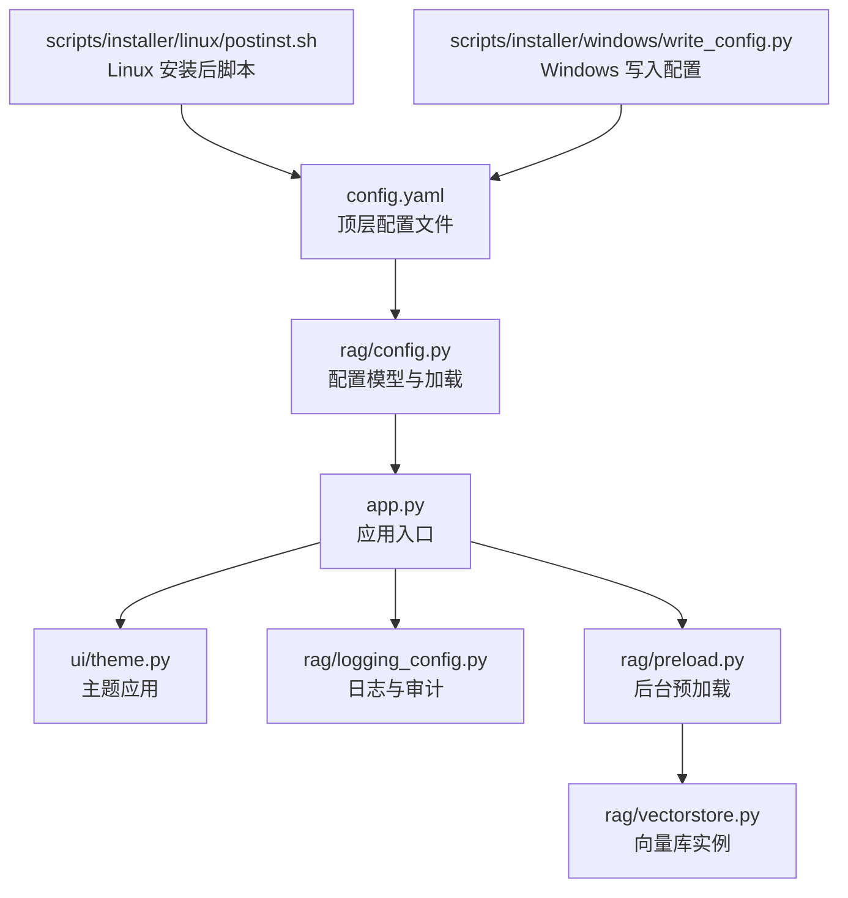
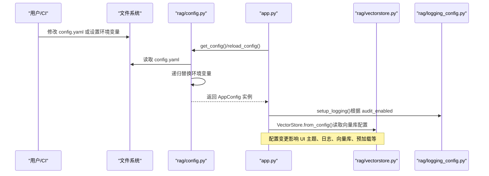
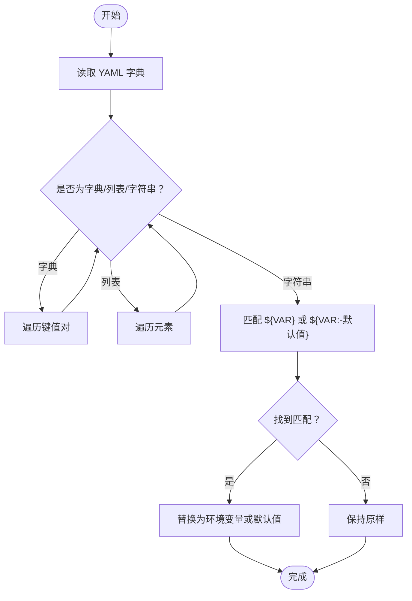
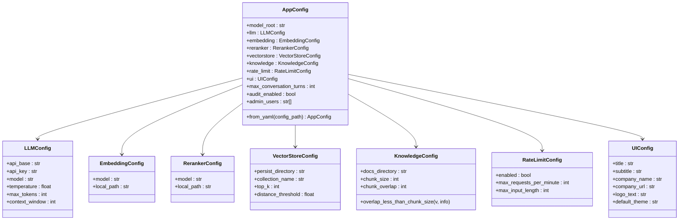
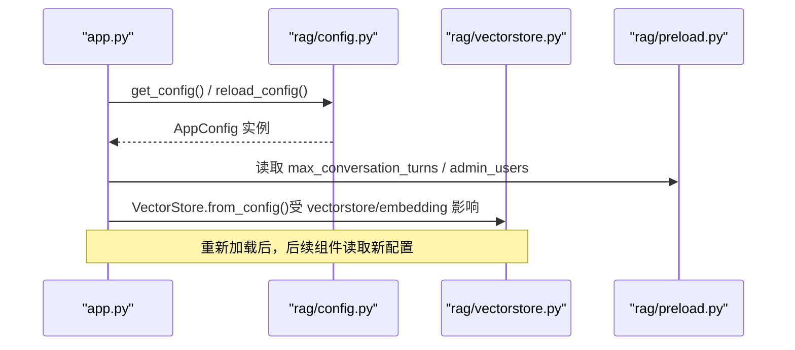
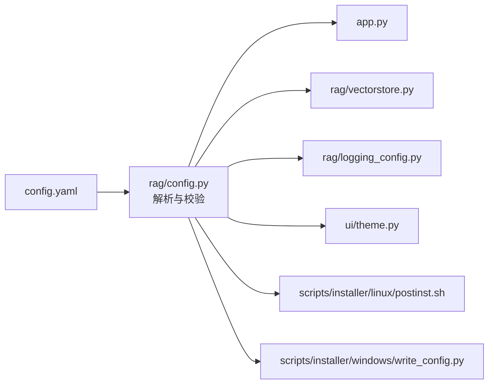

# 配置管理系统

<cite>
**本文引用的文件**
- [config.yaml](file://config.yaml)
- [rag/config.py](file://rag/config.py)
- [app.py](file://app.py)
- [rag/logging_config.py](file://rag/logging_config.py)
- [rag/vectorstore.py](file://rag/vectorstore.py)
- [rag/preload.py](file://rag/preload.py)
- [scripts/installer/linux/postinst.sh](file://scripts/installer/linux/postinst.sh)
- [scripts/installer/windows/write_config.py](file://scripts/installer/windows/write_config.py)
- [tests/test_config.py](file://tests/test_config.py)
- [ui/theme.py](file://ui/theme.py)
</cite>

## 目录
1. [简介](#简介)
2. [项目结构](#项目结构)
3. [核心组件](#核心组件)
4. [架构总览](#架构总览)
5. [详细组件分析](#详细组件分析)
6. [依赖分析](#依赖分析)
7. [性能考虑](#性能考虑)
8. [故障排查指南](#故障排查指南)
9. [结论](#结论)
10. [附录](#附录)

## 简介
本配置管理系统基于 YAML 配置文件与 Pydantic 类型验证，结合环境变量替换与单例模式，提供类型安全、可扩展且易于维护的配置能力。系统支持：
- 配置文件层次结构与默认值
- 环境变量注入与回退机制
- 运行时配置热更新（通过强制重新加载）
- 组件间配置绑定与影响范围
- 审计日志开关与配置联动

## 项目结构
配置相关的核心文件与职责如下：
- 配置文件：config.yaml（顶层 YAML 配置）
- 配置解析与模型：rag/config.py（Pydantic 模型、环境变量替换、单例与加载）
- 应用入口：app.py（读取配置、初始化 UI、日志与预加载）
- 日志与审计：rag/logging_config.py（结构化日志、审计日志）
- 向量库：rag/vectorstore.py（从配置创建向量库实例）
- 预加载：rag/preload.py（后台加载链，避免重复初始化）
- 安装脚本：scripts/installer/linux/postinst.sh、scripts/installer/windows/write_config.py（系统集成与安装时写入）
- 测试：tests/test_config.py（环境变量替换、模型校验、文件加载）

**图表来源**
- [config.yaml](file://config.yaml)
- [rag/config.py](file://rag/config.py)
- [app.py](file://app.py)
- [ui/theme.py](file://ui/theme.py)
- [rag/logging_config.py](file://rag/logging_config.py)
- [rag/vectorstore.py](file://rag/vectorstore.py)
- [rag/preload.py](file://rag/preload.py)
- [scripts/installer/linux/postinst.sh](file://scripts/installer/linux/postinst.sh)
- [scripts/installer/windows/write_config.py](file://scripts/installer/windows/write_config.py)

**章节来源**
- [config.yaml](file://config.yaml)
- [rag/config.py](file://rag/config.py)
- [app.py](file://app.py)

## 核心组件
- 配置模型层（Pydantic）：定义各子系统的配置结构、默认值与约束（如数值范围、枚举、字段间校验）。
- 环境变量替换：支持 ${VAR} 与 ${VAR:-默认值} 两种语法，递归替换字典中的字符串值。
- 单例与加载：提供 get_config()/reload_config()，确保全局唯一配置实例；from_yaml() 支持从文件加载并自动替换环境变量。
- 组件绑定：UI 主题、日志与审计、向量库、预加载等均从全局配置读取关键参数。

**章节来源**
- [rag/config.py](file://rag/config.py)
- [tests/test_config.py](file://tests/test_config.py)

## 架构总览
配置系统采用“文件驱动 + 类型验证 + 单例访问”的架构，贯穿应用启动、运行时与安装部署阶段。

**图表来源**
- [rag/config.py](file://rag/config.py)
- [app.py](file://app.py)
- [rag/vectorstore.py](file://rag/vectorstore.py)
- [rag/logging_config.py](file://rag/logging_config.py)

## 详细组件分析

### 配置文件结构与层次
- 顶层键包括：model_root、llm、embedding、reranker、vectorstore、knowledge、rate_limit、ui、max_conversation_turns、audit_enabled、admin_users 等。
- 子模块键：
  - model_root：模型根目录（支持环境变量 `${MODEL_ROOT:-model}`）
  - llm：api_base、api_key、model、temperature、max_tokens、context_window
  - embedding：model、local_path
  - reranker：model、local_path（Cross-Encoder 重排序模型）
  - vectorstore：persist_directory、collection_name、top_k、distance_threshold
  - knowledge：docs_directory、chunk_size、chunk_overlap
  - ui：title、subtitle、company_name、company_url、logo_text、default_theme
  - 其他：max_conversation_turns、audit_enabled、admin_users

默认值与约束来源于 Pydantic 模型定义，例如：
- llm.temperature ∈ [0.0, 2.0]，max_tokens ∈ [1, 128000]，context_window ∈ [1024, 256000]
- knowledge.chunk_overlap < knowledge.chunk_size
- vectorstore.top_k ≥ 1，distance_threshold ≥ 0
- ui.default_theme ∈ {"dark","light"}

**章节来源**
- [config.yaml](file://config.yaml)
- [rag/config.py](file://rag/config.py)

### 环境变量处理
- 语法支持：${VAR} 与 ${VAR:-默认值}
- 替换范围：递归遍历字典/列表/字符串，仅对字符串进行替换
- 优先级：环境变量存在时优先使用；否则使用默认值；若无默认值则保留原样

**图表来源**
- [rag/config.py](file://rag/config.py)

**章节来源**
- [rag/config.py](file://rag/config.py)
- [tests/test_config.py](file://tests/test_config.py)

### 类型安全验证与字段间校验
- 使用 Pydantic BaseModel 与 Field 约束范围
- 使用 field_validator 实现跨字段校验（如 chunk_overlap < chunk_size）
- 通过 AppConfig.from_yaml() 将字典转换为强类型对象，自动触发校验

**图表来源**
- [rag/config.py](file://rag/config.py)

**章节来源**
- [rag/config.py](file://rag/config.py)
- [tests/test_config.py](file://tests/test_config.py)

### 运行时配置更新（热更新）
- 单例缓存：get_config() 返回全局唯一实例
- 强制刷新：reload_config() 清除缓存并重新加载，适用于运行时切换配置
- 影响范围：UI 主题、日志与审计、向量库、预加载链等

**图表来源**
- [rag/config.py](file://rag/config.py)
- [app.py](file://app.py)
- [rag/vectorstore.py](file://rag/vectorstore.py)
- [rag/preload.py](file://rag/preload.py)

**章节来源**
- [rag/config.py](file://rag/config.py)
- [app.py](file://app.py)

### 配置与组件绑定关系
- UI 主题：ui.default_theme → ui/theme.py 应用主题
- 日志与审计：audit_enabled → rag/logging_config.py 控制审计日志开关
- 向量库：vectorstore 与 embedding → rag/vectorstore.py 创建/复用实例
- 预加载：max_conversation_turns / admin_users → app.py 初始化与仪表盘展示

**章节来源**
- [app.py](file://app.py)
- [ui/theme.py](file://ui/theme.py)
- [rag/logging_config.py](file://rag/logging_config.py)
- [rag/vectorstore.py](file://rag/vectorstore.py)

### 配置优先级规则
- 文件优先：config.yaml 中显式配置覆盖默认值
- 环境变量：存在时覆盖文件中的对应值；不存在时使用默认值；无默认值则保留原样
- 运行时刷新：reload_config() 使最新配置立即生效

**章节来源**
- [rag/config.py](file://rag/config.py)
- [config.yaml](file://config.yaml)

### 安装与部署中的配置
- Linux 安装后脚本：创建数据目录、复制初始配置、更新路径（向量库、知识库、本地模型路径），并建立符号链接
- Windows 安装工具：通过 write_config.py 更新 LLM 配置（api_base、api_key、model）

**章节来源**
- [scripts/installer/linux/postinst.sh](file://scripts/installer/linux/postinst.sh)
- [scripts/installer/windows/write_config.py](file://scripts/installer/windows/write_config.py)

## 依赖分析
- 配置文件依赖：config.yaml 是唯一来源，通过 rag/config.py 解析
- 组件依赖：
  - app.py 依赖 rag/config.py 提供的全局配置
  - rag/vectorstore.py 依赖 rag/config.py 的向量库与嵌入配置
  - rag/logging_config.py 依赖 rag/config.py 的审计开关
  - ui/theme.py 依赖 rag/config.py 的主题配置
  - 安装脚本依赖 config.yaml 的初始模板

**图表来源**
- [config.yaml](file://config.yaml)
- [rag/config.py](file://rag/config.py)
- [app.py](file://app.py)
- [rag/vectorstore.py](file://rag/vectorstore.py)
- [rag/logging_config.py](file://rag/logging_config.py)
- [ui/theme.py](file://ui/theme.py)
- [scripts/installer/linux/postinst.sh](file://scripts/installer/linux/postinst.sh)
- [scripts/installer/windows/write_config.py](file://scripts/installer/windows/write_config.py)

**章节来源**
- [rag/config.py](file://rag/config.py)
- [app.py](file://app.py)

## 性能考虑
- 单例与缓存：get_config() 缓存全局实例，避免重复 IO 与解析
- 向量库实例缓存：VectorStore.from_config() 基于配置键缓存实例，减少重复加载嵌入模型的成本
- 预加载：后台线程加载链，避免首次交互时的冷启动延迟
- 环境变量替换：仅对字符串执行正则替换，复杂度与字符串长度线性相关

**章节来源**
- [rag/config.py](file://rag/config.py)
- [rag/vectorstore.py](file://rag/vectorstore.py)
- [rag/preload.py](file://rag/preload.py)

## 故障排查指南
- 配置加载失败
  - 检查 config.yaml 是否存在且可读
  - 确认 YAML 语法正确，缩进与键名无拼写错误
  - 使用 reload_config() 强制重新加载
- 环境变量未生效
  - 确认环境变量名与 ${VAR} 一致
  - 若未设置且未提供默认值，将保留原样；检查默认值是否正确
- 校验失败
  - 数值越界：检查范围约束（如 temperature、max_tokens、top_k 等）
  - 字段间关系：如 chunk_overlap < chunk_size
- 审计日志未记录
  - 确认 audit_enabled 为真
- UI 主题未切换
  - 检查 ui.default_theme 是否为 "dark" 或 "light"

**章节来源**
- [rag/config.py](file://rag/config.py)
- [rag/logging_config.py](file://rag/logging_config.py)
- [tests/test_config.py](file://tests/test_config.py)

## 结论
该配置管理系统以 YAML 为单一事实来源，结合 Pydantic 的强类型校验与环境变量替换，实现了高可靠性与可维护性。通过单例与缓存策略，兼顾了性能与一致性；通过安装脚本与运行时刷新，覆盖了部署与运维场景。建议在生产环境中：
- 明确环境变量命名与默认值约定
- 在 CI 中加入配置校验与覆盖率测试
- 对关键配置（如 LLM 凭证、向量库路径）进行权限与路径检查

## 附录

### 配置项速查与示例
- model_root：模型根目录（支持 ${MODEL_ROOT:-model} 环境变量）
- llm
  - api_base：LLM API 基础地址
  - api_key：访问密钥
  - model：模型名称
  - temperature：采样温度（范围见模型约束）
  - max_tokens：最大生成长度
  - context_window：上下文窗口大小
- embedding
  - model：嵌入模型名称
  - local_path：本地模型路径（支持 ${MODEL_ROOT} 变量）
- reranker
  - model：重排序模型名称（如 BAAI/bge-reranker-base）
  - local_path：本地模型路径（支持 ${MODEL_ROOT} 变量）
- vectorstore
  - persist_directory：持久化目录
  - collection_name：集合名称
  - top_k：检索返回条数
  - distance_threshold：距离阈值（当前 10000，适配未归一化嵌入）
- knowledge
  - docs_directory：知识库文档目录
  - chunk_size：分块大小
  - chunk_overlap：分块重叠大小（必须小于 chunk_size）
- rate_limit
  - enabled：是否启用
  - max_requests_per_minute：每分钟最大请求数
  - max_input_length：最大输入长度
- ui
  - title：页面标题
  - subtitle：副标题
  - company_name：公司名称
  - company_url：公司网址（用于版权落款）
  - logo_text：页面图标文本
  - default_theme：主题（dark/light）
- 其他
  - max_conversation_turns：最大对话轮数
  - audit_enabled：是否启用审计日志
  - admin_users：管理员用户名列表

**章节来源**
- [config.yaml](file://config.yaml)
- [rag/config.py](file://rag/config.py)