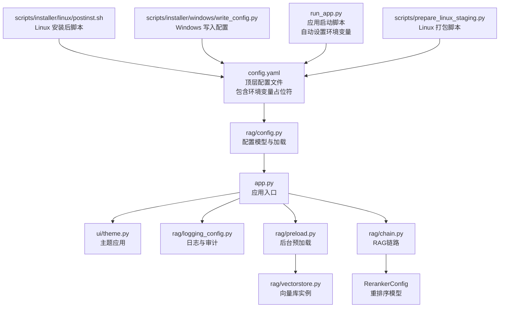
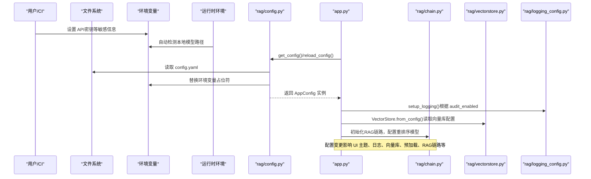
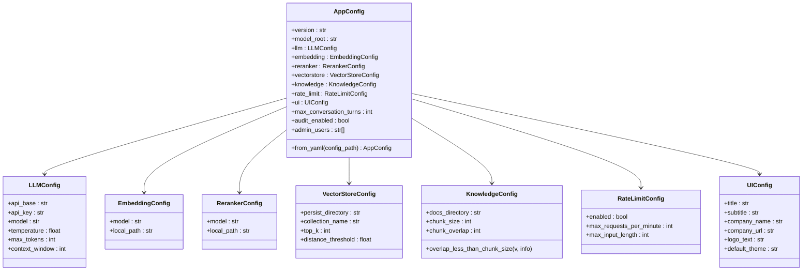
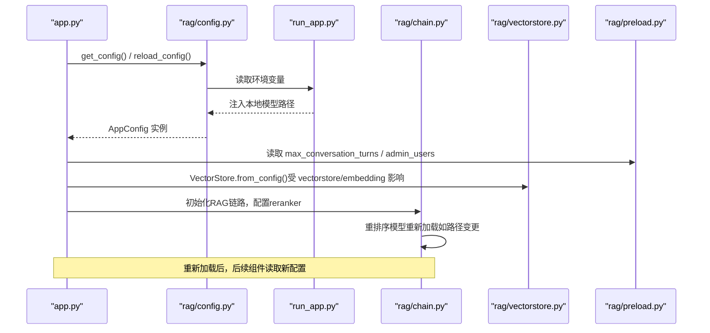
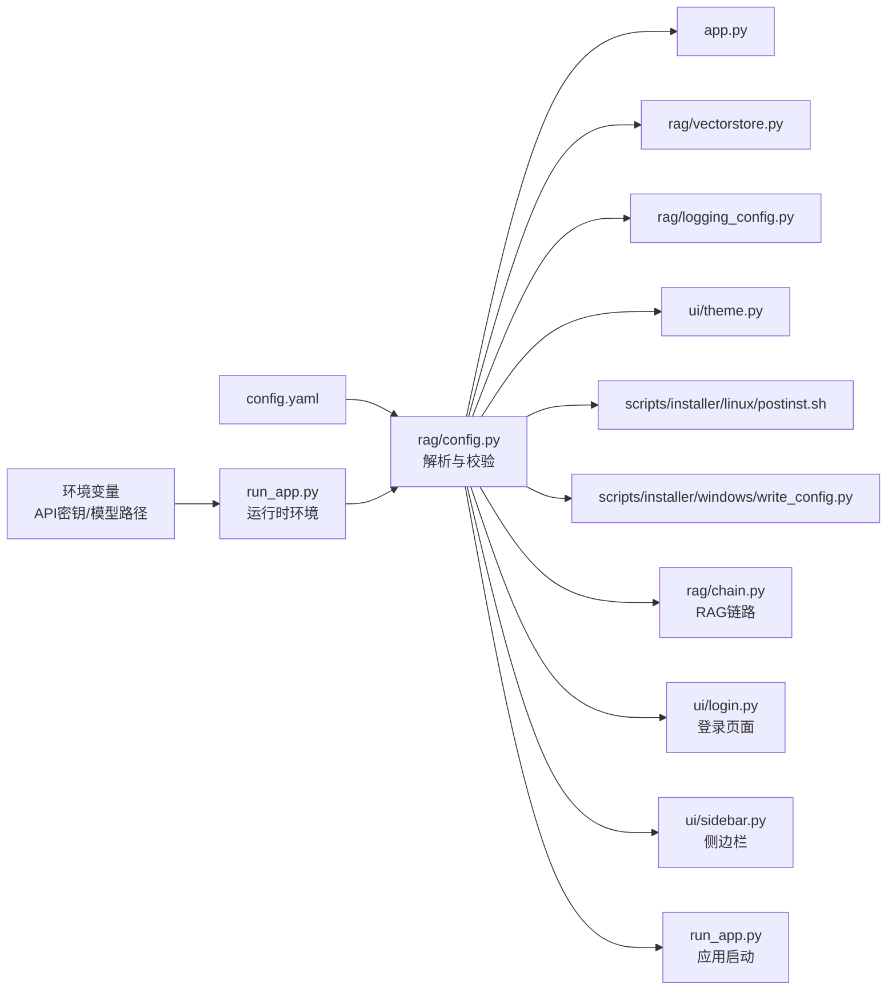

# 配置管理系统

<cite>
**本文引用的文件**
- [config.yaml](file://config.yaml)
- [rag/config.py](file://rag/config.py)
- [app.py](file://app.py)
- [rag/logging_config.py](file://rag/logging_config.py)
- [rag/vectorstore.py](file://rag/vectorstore.py)
- [rag/preload.py](file://rag/preload.py)
- [rag/chain.py](file://rag/chain.py)
- [scripts/installer/linux/postinst.sh](file://scripts/installer/linux/postinst.sh)
- [scripts/installer/windows/write_config.py](file://scripts/installer/windows/write_config.py)
- [tests/test_config.py](file://tests/test_config.py)
- [ui/theme.py](file://ui/theme.py)
- [ui/login.py](file://ui/login.py)
- [ui/sidebar.py](file://ui/sidebar.py)
- [run_app.py](file://run_app.py)
- [scripts/prepare_linux_staging.py](file://scripts/prepare_linux_staging.py)
</cite>

## 更新摘要
**变更内容**
- API密钥管理从config.yaml迁移到环境变量，提升安全性
- 新增${ENV_VAR:-default}语法支持，增强配置灵活性
- 改进的嵌入模型和重排序配置结构，支持本地模型缓存
- 安装脚本自动检测和设置本地模型路径
- 运行时环境变量自动注入，简化部署流程

## 目录
1. [简介](#简介)
2. [项目结构](#项目结构)
3. [核心组件](#核心组件)
4. [架构总览](#架构总览)
5. [详细组件分析](#详细组件分析)
6. [依赖分析](#依赖分析)
7. [性能考虑](#性能考虑)
8. [故障排查指南](#故障排查指南)
9. [结论](#结论)
10. [附录](#附录)

## 简介
本配置管理系统基于 YAML 配置文件与 Pydantic 类型验证，结合环境变量替换与单例模式，提供类型安全、可扩展且易于维护的配置能力。系统支持：
- 配置文件层次结构与默认值
- 环境变量注入与回退机制（${VAR} 与 ${VAR:-默认值}）
- 运行时配置热更新（通过强制重新加载）
- 组件间配置绑定与影响范围
- 审计日志开关与配置联动
- **新增**：API密钥安全管理、本地模型缓存、安装时自动配置

## 项目结构
配置相关的核心文件与职责如下：
- 配置文件：config.yaml（顶层 YAML 配置，包含环境变量占位符）
- 配置解析与模型：rag/config.py（Pydantic 模型、环境变量替换、单例与加载）
- 应用入口：app.py（读取配置、初始化 UI、日志与预加载）
- 日志与审计：rag/logging_config.py（结构化日志、审计日志）
- 向量库：rag/vectorstore.py（从配置创建向量库实例）
- 预加载：rag/preload.py（后台加载链，避免重复初始化）
- RAG链路：rag/chain.py（集成重排序模型的检索增强生成）
- 安装脚本：scripts/installer/linux/postinst.sh、scripts/installer/windows/write_config.py（系统集成与安装时写入）
- 运行时环境：run_app.py（自动检测和设置本地模型路径）
- 测试：tests/test_config.py（环境变量替换、模型校验、文件加载）
- UI组件：ui/login.py、ui/sidebar.py（集成公司链接显示）

**图表来源**
- [config.yaml](file://config.yaml)
- [rag/config.py](file://rag/config.py)
- [app.py](file://app.py)
- [ui/theme.py](file://ui/theme.py)
- [rag/logging_config.py](file://rag/logging_config.py)
- [rag/vectorstore.py](file://rag/vectorstore.py)
- [rag/preload.py](file://rag/preload.py)
- [rag/chain.py](file://rag/chain.py)
- [scripts/installer/linux/postinst.sh](file://scripts/installer/linux/postinst.sh)
- [scripts/installer/windows/write_config.py](file://scripts/installer/windows/write_config.py)
- [run_app.py](file://run_app.py)
- [scripts/prepare_linux_staging.py](file://scripts/prepare_linux_staging.py)

**章节来源**
- [config.yaml](file://config.yaml)
- [rag/config.py](file://rag/config.py)
- [app.py](file://app.py)

## 核心组件
- **配置模型层（Pydantic）**：定义各子系统的配置结构、默认值与约束（如数值范围、枚举、字段间校验）。
- **环境变量替换**：支持 ${VAR} 与 ${VAR:-默认值} 两种语法，递归替换字典中的字符串值。
- **单例与加载**：提供 get_config()/reload_config()，确保全局唯一配置实例；from_yaml() 支持从文件加载并自动替换环境变量。
- **组件绑定**：UI 主题、日志与审计、向量库、预加载、RAG链路等均从全局配置读取关键参数。
- **新增**：API密钥安全管理、本地模型缓存、安装时自动配置。

**章节来源**
- [rag/config.py](file://rag/config.py)
- [tests/test_config.py](file://tests/test_config.py)

## 架构总览
配置系统采用"文件驱动 + 类型验证 + 单例访问 + 环境变量注入"的架构，贯穿应用启动、运行时与安装部署阶段。

**图表来源**
- [rag/config.py](file://rag/config.py)
- [app.py](file://app.py)
- [rag/chain.py](file://rag/chain.py)
- [rag/vectorstore.py](file://rag/vectorstore.py)
- [rag/logging_config.py](file://rag/logging_config.py)
- [run_app.py](file://run_app.py)

## 详细组件分析

### 配置文件结构与层次
- **顶层键**包括：model_root、llm、embedding、reranker、vectorstore、knowledge、rate_limit、ui、max_conversation_turns、audit_enabled、admin_users 等。
- **子模块键**：
  - **llm**：api_base、api_key（**已迁移到环境变量**）、model、temperature、max_tokens、context_window
  - **embedding**：model、local_path（支持环境变量覆盖）
  - **reranker**：model、local_path（支持环境变量覆盖，**新增**）
  - **vectorstore**：persist_directory、collection_name、top_k、distance_threshold
  - **knowledge**：docs_directory、chunk_size、chunk_overlap
  - **ui**：title、subtitle、company_name、company_url、logo_text、default_theme
  - **其他**：max_conversation_turns、audit_enabled、admin_users

**新增**：API密钥管理从config.yaml迁移到环境变量，提升安全性。新增${ENV_VAR:-default}语法支持，增强配置灵活性。

默认值与约束来源于 Pydantic 模型定义，例如：
- llm.temperature ∈ [0.0, 2.0]，max_tokens ∈ [1, 128000]，context_window ∈ [1024, 256000]
- knowledge.chunk_overlap < knowledge.chunk_size
- vectorstore.top_k ≥ 1，distance_threshold ≥ 0
- ui.default_theme ∈ {"dark","light"}
- **新增**：reranker.model默认"BAAI/bge-reranker-base"，支持local_path离线加载

**章节来源**
- [config.yaml](file://config.yaml)
- [rag/config.py](file://rag/config.py)

### 环境变量处理
- **语法支持**：${VAR} 与 ${VAR:-默认值}
- **替换范围**：递归遍历字典/列表/字符串，仅对字符串进行替换
- **优先级**：环境变量存在时优先使用；否则使用默认值；若无默认值则保留原样
- **新增**：API密钥通过环境变量注入，config.yaml中仅保留占位符
- **新增**：本地模型路径通过环境变量覆盖，支持离线部署

**图表来源**
- [rag/config.py](file://rag/config.py)

**章节来源**
- [rag/config.py](file://rag/config.py)
- [tests/test_config.py](file://tests/test_config.py)

### 类型安全验证与字段间校验
- 使用 Pydantic BaseModel 与 Field 约束范围
- 使用 field_validator 实现跨字段校验（如 chunk_overlap < chunk_size）
- 通过 AppConfig.from_yaml() 将字典转换为强类型对象，自动触发校验
- **新增**：RerankerConfig类提供重排序模型配置验证

**图表来源**
- [rag/config.py](file://rag/config.py)

**章节来源**
- [rag/config.py](file://rag/config.py)
- [tests/test_config.py](file://tests/test_config.py)

### 运行时配置更新（热更新）
- **单例缓存**：get_config() 返回全局唯一实例
- **强制刷新**：reload_config() 清除缓存并重新加载，适用于运行时切换配置
- **影响范围**：UI 主题、日志与审计、向量库、预加载链、RAG链路等
- **新增**：RerankerConfig配置变更时，RAG链路中的重排序模型会重新加载
- **新增**：API密钥变更时，LLM配置会重新加载

**图表来源**
- [rag/config.py](file://rag/config.py)
- [app.py](file://app.py)
- [rag/chain.py](file://rag/chain.py)
- [rag/vectorstore.py](file://rag/vectorstore.py)
- [rag/preload.py](file://rag/preload.py)
- [run_app.py](file://run_app.py)

**章节来源**
- [rag/config.py](file://rag/config.py)
- [app.py](file://app.py)
- [run_app.py](file://run_app.py)

### 配置与组件绑定关系
- **UI主题**：ui.default_theme → ui/theme.py 应用主题
- **日志与审计**：audit_enabled → rag/logging_config.py 控制审计日志开关
- **向量库**：vectorstore 与 embedding → rag/vectorstore.py 创建/复用实例
- **预加载**：max_conversation_turns / admin_users → app.py 初始化与仪表盘展示
- **RAG链路**：reranker → rag/chain.py 集成重排序模型，提升检索质量
- **LLM配置**：api_base、api_key → app.py 初始化LLM客户端
- **新增**：UI组件集成company_url → ui/login.py、ui/sidebar.py 显示公司链接

**章节来源**
- [app.py](file://app.py)
- [ui/theme.py](file://ui/theme.py)
- [rag/logging_config.py](file://rag/logging_config.py)
- [rag/vectorstore.py](file://rag/vectorstore.py)
- [rag/chain.py](file://rag/chain.py)
- [ui/login.py](file://ui/login.py)
- [ui/sidebar.py](file://ui/sidebar.py)

### 配置优先级规则
- **文件优先**：config.yaml 中显式配置覆盖默认值
- **环境变量**：存在时覆盖文件中的对应值；不存在时使用默认值；无默认值则保留原样
- **运行时刷新**：reload_config() 使最新配置立即生效
- **新增**：API密钥优先从环境变量读取，config.yaml中仅保留占位符
- **新增**：本地模型路径优先从环境变量读取，支持离线部署

**章节来源**
- [rag/config.py](file://rag/config.py)
- [config.yaml](file://config.yaml)
- [run_app.py](file://run_app.py)

### 安装与部署中的配置
- **Linux安装后脚本**：创建数据目录、复制初始配置、更新路径（向量库、知识库、本地模型路径），并建立符号链接
- **Windows安装工具**：通过 write_config.py 更新 LLM 配置（api_base、api_key、model）
- **运行时环境**：run_app.py 自动检测本地模型并设置环境变量，简化部署流程
- **新增**：安装脚本自动设置MODEL_ROOT环境变量，确保相对路径正确解析
- **新增**：打包脚本自动检测本地模型并设置EMBEDDING_LOCAL_PATH和RERANKER_LOCAL_PATH

**章节来源**
- [scripts/installer/linux/postinst.sh](file://scripts/installer/linux/postinst.sh)
- [scripts/installer/windows/write_config.py](file://scripts/installer/windows/write_config.py)
- [run_app.py](file://run_app.py)
- [scripts/prepare_linux_staging.py](file://scripts/prepare_linux_staging.py)

## 依赖分析
- **配置文件依赖**：config.yaml 是唯一来源，通过 rag/config.py 解析
- **环境变量依赖**：API密钥、本地模型路径等敏感信息通过环境变量注入
- **组件依赖**：
  - app.py 依赖 rag/config.py 提供的全局配置
  - rag/vectorstore.py 依赖 rag/config.py 的向量库与嵌入配置
  - rag/logging_config.py 依赖 rag/config.py 的审计开关
  - ui/theme.py 依赖 rag/config.py 的主题配置
  - ui/login.py、ui/sidebar.py 依赖 rag/config.py 的UI配置
  - rag/chain.py 依赖 rag/config.py 的RerankerConfig配置
  - 安装脚本依赖 config.yaml 的初始模板
  - 运行时环境依赖 run_app.py 的环境变量设置

**图表来源**
- [config.yaml](file://config.yaml)
- [rag/config.py](file://rag/config.py)
- [app.py](file://app.py)
- [rag/vectorstore.py](file://rag/vectorstore.py)
- [rag/logging_config.py](file://rag/logging_config.py)
- [ui/theme.py](file://ui/theme.py)
- [scripts/installer/linux/postinst.sh](file://scripts/installer/linux/postinst.sh)
- [scripts/installer/windows/write_config.py](file://scripts/installer/windows/write_config.py)
- [rag/chain.py](file://rag/chain.py)
- [ui/login.py](file://ui/login.py)
- [ui/sidebar.py](file://ui/sidebar.py)
- [run_app.py](file://run_app.py)

**章节来源**
- [rag/config.py](file://rag/config.py)
- [app.py](file://app.py)
- [run_app.py](file://run_app.py)

## 性能考虑
- **单例与缓存**：get_config() 缓存全局实例，避免重复 IO 与解析
- **向量库实例缓存**：VectorStore.from_config() 基于配置键缓存实例，减少重复加载嵌入模型的成本
- **预加载**：后台线程加载链，避免首次交互时的冷启动延迟
- **环境变量替换**：仅对字符串执行正则替换，复杂度与字符串长度线性相关
- **新增**：Reranker模型类级别缓存，避免重复加载重排序模型
- **新增**：本地模型缓存，减少网络依赖，提升启动速度
- **新增**：安装时自动检测本地模型，避免运行时网络下载

**章节来源**
- [rag/config.py](file://rag/config.py)
- [rag/vectorstore.py](file://rag/vectorstore.py)
- [rag/preload.py](file://rag/preload.py)
- [rag/chain.py](file://rag/chain.py)
- [run_app.py](file://run_app.py)

## 故障排查指南
- **配置加载失败**
  - 检查 config.yaml 是否存在且可读
  - 确认 YAML 语法正确，缩进与键名无拼写错误
  - 使用 reload_config() 强制重新加载
- **环境变量未生效**
  - 确认环境变量名与 ${VAR} 一致
  - 若未设置且未提供默认值，将保留原样；检查默认值是否正确
  - **新增**：确认API密钥环境变量已正确设置（BIGMODEL_API_KEY）
  - **新增**：确认MODEL_ROOT环境变量已正确设置（安装脚本会自动设置）
- **校验失败**
  - 数值越界：检查范围约束（如 temperature、max_tokens、top_k 等）
  - 字段间关系：如 chunk_overlap < chunk_size
  - **新增**：reranker配置验证，确保模型名称格式正确
- **审计日志未记录**
  - 确认 audit_enabled 为真
- **UI主题未切换**
  - 检查 ui.default_theme 是否为 "dark" 或 "light"
- **新增**：重排序模型加载失败
  - 检查reranker.model配置是否正确
  - 确认local_path路径是否存在（相对model_root）
  - 查看RAG链路日志，确认模型加载状态
- **新增**：API密钥认证失败
  - 检查BIGMODEL_API_KEY环境变量是否设置
  - 确认api_base和model配置正确
  - 查看LLM客户端初始化日志

**章节来源**
- [rag/config.py](file://rag/config.py)
- [rag/logging_config.py](file://rag/logging_config.py)
- [tests/test_config.py](file://tests/test_config.py)
- [rag/chain.py](file://rag/chain.py)
- [run_app.py](file://run_app.py)

## 结论
该配置管理系统以 YAML 为单一事实来源，结合 Pydantic 的强类型校验与环境变量替换，实现了高可靠性与可维护性。通过单例与缓存策略，兼顾了性能与一致性；通过安装脚本与运行时刷新，覆盖了部署与运维场景。

**主要改进**：
- **API密钥安全管理**：从config.yaml迁移到环境变量，提升安全性
- **增强的环境变量支持**：新增${ENV_VAR:-default}语法，增强配置灵活性
- **本地模型缓存**：支持离线部署，减少网络依赖
- **安装时自动配置**：运行时自动检测和设置本地模型路径
- **UI增强**：company_url字段支持公司链接显示，提升用户体验
- **配置完整性**：完整的配置体系覆盖从基础到高级的所有需求

建议在生产环境中：
- 明确环境变量命名与默认值约定
- 在 CI 中加入配置校验与覆盖率测试
- 对关键配置（如 LLM 凭证、向量库路径、重排序模型）进行权限与路径检查
- **新增**：合理配置API密钥环境变量，确保安全存储
- **新增**：设置MODEL_ROOT环境变量，确保离线部署时模型路径正确

## 附录

### 配置项速查与示例
- **model_root**
  - 作用：本地模型根目录（离线部署时设置环境变量 MODEL_ROOT）
  - 默认值："model"
  - 示例："/opt/knowledge/model"
- **llm**
  - api_base：LLM API 基础地址
  - api_key：访问密钥（**已迁移到环境变量**）
  - model：模型名称
  - temperature：采样温度（范围见模型约束）
  - max_tokens：最大生成长度
  - context_window：上下文窗口大小
- **embedding**
  - model：嵌入模型名称
  - local_path：本地模型路径（可选，相对model_root，支持环境变量覆盖）
- **reranker**（**新增**）
  - model：重排序模型名称（默认"BAAI/bge-reranker-base"）
  - local_path：本地重排序模型路径（可选，相对model_root，支持环境变量覆盖）
- **vectorstore**
  - persist_directory：持久化目录
  - collection_name：集合名称
  - top_k：检索返回条数
  - distance_threshold：距离阈值
- **knowledge**
  - docs_directory：知识库文档目录
  - chunk_size：分块大小
  - chunk_overlap：分块重叠大小（必须小于 chunk_size）
- **rate_limit**
  - enabled：是否启用
  - max_requests_per_minute：每分钟最大请求数
  - max_input_length：最大输入长度
- **ui**
  - title：页面标题
  - subtitle：副标题
  - company_name：公司名称
  - company_url：公司URL链接（**新增**）
  - logo_text：页面图标文本
  - default_theme：主题（dark/light）
- **其他**
  - max_conversation_turns：最大对话轮数
  - audit_enabled：是否启用审计日志
  - admin_users：管理员用户名列表

### 环境变量配置示例
- **API密钥**：BIGMODEL_API_KEY=your_api_key_here
- **模型根目录**：MODEL_ROOT=/opt/knowledge/model
- **嵌入模型本地路径**：EMBEDDING_LOCAL_PATH=/opt/knowledge/model/text2vec-base-chinese
- **重排序模型本地路径**：RERANKER_LOCAL_PATH=/opt/knowledge/model/bge-reranker-base

**章节来源**
- [config.yaml](file://config.yaml)
- [rag/config.py](file://rag/config.py)
- [run_app.py](file://run_app.py)