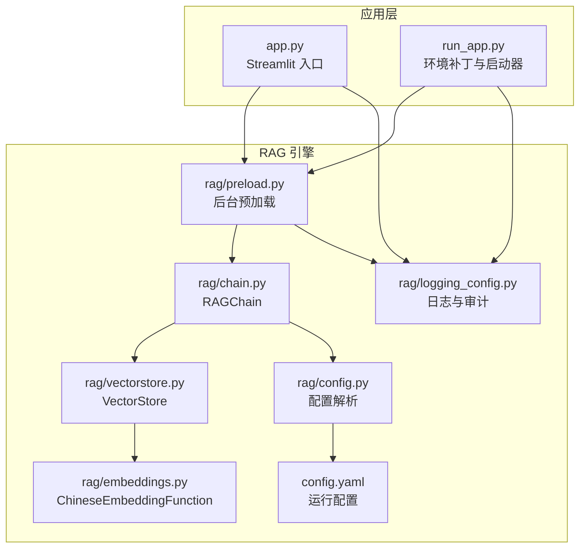
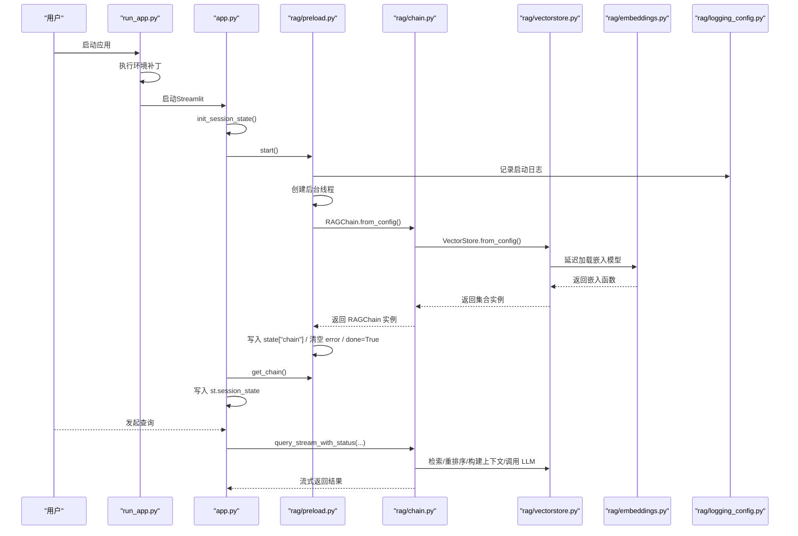
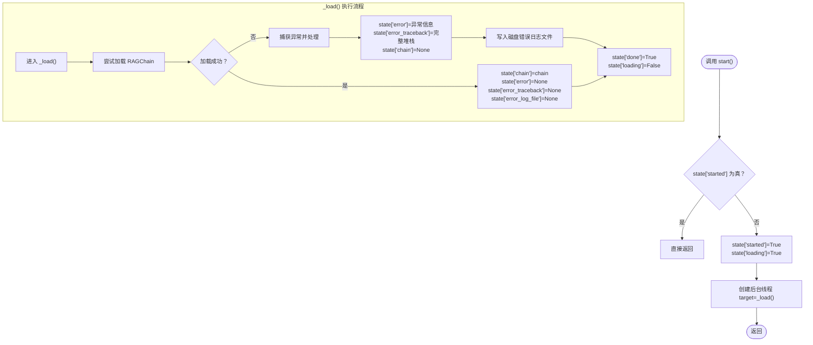
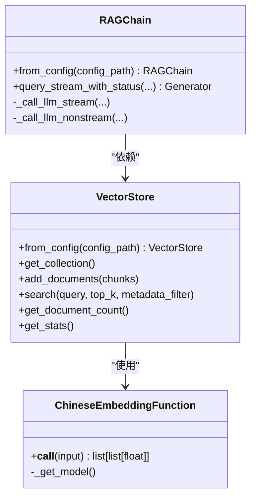
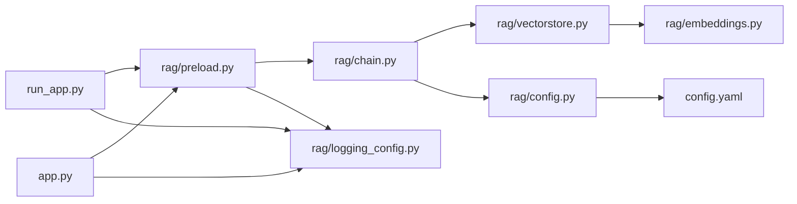

# 预加载机制

<cite>
**本文引用的文件**
- [rag/preload.py](file://rag/preload.py)
- [run_app.py](file://run_app.py)
- [app.py](file://app.py)
- [rag/chain.py](file://rag/chain.py)
- [rag/vectorstore.py](file://rag/vectorstore.py)
- [rag/config.py](file://rag/config.py)
- [rag/embeddings.py](file://rag/embeddings.py)
- [rag/logging_config.py](file://rag/logging_config.py)
- [config.yaml](file://config.yaml)
- [tests/test_preload.py](file://tests/test_preload.py)
</cite>

## 更新摘要
**变更内容**
- 新增run_app.py中的环境补丁机制，增强PyInstaller打包后的兼容性
- 改进错误处理机制，新增importlib.metadata版本检测和BaseException处理
- 增强错误日志记录和诊断信息，支持磁盘日志文件输出
- 完善SystemExit和KeyboardInterrupt等特殊异常的捕获和处理

## 目录
1. [简介](#简介)
2. [项目结构](#项目结构)
3. [核心组件](#核心组件)
4. [架构总览](#架构总览)
5. [详细组件分析](#详细组件分析)
6. [依赖关系分析](#依赖关系分析)
7. [性能考量](#性能考量)
8. [故障排查指南](#故障排查指南)
9. [结论](#结论)
10. [附录](#附录)

## 简介
本文件面向开发者，系统性阐述知识库检索引擎中的"预加载机制"。该机制通过后台线程在应用启动阶段提前加载 RAGChain 及其依赖（向量库、嵌入模型等），从而缩短首次查询响应时间，提升用户体验。文档涵盖后台线程管理、缓存策略、触发条件、错误恢复、调度与资源管理、性能监控与优化、与系统启动流程的集成以及调优建议。

**更新** 本版本增强了环境兼容性和错误处理能力，特别针对PyInstaller打包场景提供了专门的环境补丁机制，确保在各种部署环境下都能稳定运行。

## 项目结构
预加载相关的核心代码集中在 rag 子包与入口应用文件中：
- 预加载模块：负责后台线程的启动、状态管理与幂等控制
- 应用入口：在页面初始化时触发预加载，并在会话状态中复用已加载的链
- 环境补丁：run_app.py提供PyInstaller打包后的环境修复和版本检测
- 检索链与向量库：提供从配置创建实例的能力，支持延迟初始化与类级缓存
- 配置与日志：提供统一配置解析与审计日志能力

**图表来源**
- [app.py:32-41](file://app.py#L32-L41)
- [run_app.py:16-61](file://run_app.py#L16-L61)
- [rag/preload.py:22-49](file://rag/preload.py#L22-L49)
- [rag/chain.py:604-609](file://rag/chain.py#L604-L609)
- [rag/vectorstore.py:181-209](file://rag/vectorstore.py#L181-L209)
- [rag/embeddings.py:19-48](file://rag/embeddings.py#L19-L48)
- [rag/config.py:138-184](file://rag/config.py#L138-L184)
- [rag/logging_config.py:46-84](file://rag/logging_config.py#L46-L84)
- [config.yaml:1-48](file://config.yaml#L1-L48)

**章节来源**
- [app.py:32-41](file://app.py#L32-L41)
- [run_app.py:16-61](file://run_app.py#L16-L61)
- [rag/preload.py:22-49](file://rag/preload.py#L22-L49)
- [rag/chain.py:604-609](file://rag/chain.py#L604-L609)
- [rag/vectorstore.py:181-209](file://rag/vectorstore.py#L181-L209)
- [rag/embeddings.py:19-48](file://rag/embeddings.py#L19-L48)
- [rag/config.py:138-184](file://rag/config.py#L138-L184)
- [rag/logging_config.py:46-84](file://rag/logging_config.py#L46-L84)
- [config.yaml:1-48](file://config.yaml#L1-L48)

## 核心组件
- 预加载模块（后台线程与状态机）
  - 幂等启动：防止重复创建线程
  - 状态字段：链实例、错误信息、完成标志、启动标志、加载中标志
  - 后台线程：加载 RAGChain，捕获异常，最终设置完成标志
  - 增强错误处理：支持BaseException捕获，提供详细诊断信息
- 环境补丁（PyInstaller兼容性）
  - importlib.metadata版本检测：处理打包后元数据缺失问题
  - DLL搜索路径修复：解决Windows平台DLL加载失败
  - 环境变量设置：统一模型缓存和镜像源配置
- 应用入口（与系统启动流程集成）
  - 初始化会话状态时触发预加载
  - 从预加载状态中获取链实例并写入会话状态
- 检索链与向量库（延迟初始化与缓存）
  - RAGChain.from_config：从配置创建链，内部依赖 VectorStore.from_config
  - VectorStore.from_config：全局单例缓存，避免重复加载嵌入模型
  - Embeddings：延迟加载模型，首次运行需下载模型
- 配置与日志
  - 配置解析：支持环境变量替换与 Pydantic 校验
  - 审计日志：记录查询耗时、结果数等关键指标

**章节来源**
- [rag/preload.py:12-73](file://rag/preload.py#L12-L73)
- [run_app.py:16-61](file://run_app.py#L16-L61)
- [app.py:32-41](file://app.py#L32-L41)
- [rag/chain.py:604-609](file://rag/chain.py#L604-L609)
- [rag/vectorstore.py:181-209](file://rag/vectorstore.py#L181-L209)
- [rag/embeddings.py:19-48](file://rag/embeddings.py#L19-L48)
- [rag/config.py:138-184](file://rag/config.py#L138-L184)
- [rag/logging_config.py:86-129](file://rag/logging_config.py#L86-L129)

## 架构总览
预加载机制在应用启动阶段即开始后台加载，目标是让后续查询无需等待初始化开销。整体流程如下：

**图表来源**
- [run_app.py:174-274](file://run_app.py#L174-L274)
- [app.py:32-41](file://app.py#L32-L41)
- [rag/preload.py:22-49](file://rag/preload.py#L22-L49)
- [rag/chain.py:604-609](file://rag/chain.py#L604-L609)
- [rag/vectorstore.py:181-209](file://rag/vectorstore.py#L181-L209)
- [rag/embeddings.py:19-48](file://rag/embeddings.py#L19-L48)
- [rag/logging_config.py:46-84](file://rag/logging_config.py#L46-L84)

## 详细组件分析

### 预加载模块（后台线程与状态机）
- 设计要点
  - 独立模块：模块只导入一次，不受 Streamlit rerun 影响
  - 幂等启动：state["started"] 防止重复创建线程
  - 状态字段：chain、error、done、started、loading，便于 UI 与业务感知
  - 后台线程：daemon=True，避免阻塞进程退出
- 触发条件
  - 应用初始化会话状态时调用 start()
  - 若链已存在则直接返回，不重复加载
- 错误恢复（增强）
  - 异常被捕获并写入 state["error"]，同时清理 chain
  - 新增BaseException处理，确保SystemExit、KeyboardInterrupt等特殊异常也能被捕获
  - 提供详细错误日志记录，包括完整堆栈跟踪和磁盘日志文件
  - finally 中统一设置 done=True、loading=False
- 重置机制
  - reset() 清空所有状态，支持重新加载

**图表来源**
- [rag/preload.py:22-49](file://rag/preload.py#L22-L49)

**章节来源**
- [rag/preload.py:12-73](file://rag/preload.py#L12-L73)
- [tests/test_preload.py:10-31](file://tests/test_preload.py#L10-L31)

### 环境补丁（PyInstaller兼容性）
- importlib.metadata版本检测补丁
  - 解决PyInstaller打包后dist-info目录缺失导致的PackageNotFoundError
  - 为特定包提供占位版本号，避免应用崩溃
  - 同时补丁metadata()函数，确保使用该函数的库也能正常工作
- DLL搜索路径修复
  - 修复Windows平台DLL加载失败问题
  - 将_pyinstaller打包后的依赖库目录加入系统搜索路径
  - 处理torch、numpy等库的特殊DLL目录结构
- 环境变量设置
  - 统一模型缓存目录到model/目录
  - 设置HuggingFace镜像源，提高模型下载速度
  - 支持本地模型检测和使用

**章节来源**
- [run_app.py:16-61](file://run_app.py#L16-L61)
- [run_app.py:78-123](file://run_app.py#L78-L123)
- [run_app.py:212-235](file://run_app.py#L212-L235)

### 应用入口（与系统启动流程集成）
- 启动集成
  - init_session_state() 中调用 start()，保证每个会话仅启动一次后台线程
  - 从预加载获取链实例，若存在则写入 st.session_state，避免重复初始化
- 与 Streamlit 的关系
  - 模块导入一次，状态在多次 rerun 中保持，符合预期行为

**章节来源**
- [app.py:23-41](file://app.py#L23-L41)

### 检索链与向量库（延迟初始化与缓存）
- RAGChain.from_config
  - 从配置读取 LLM 与向量库参数
  - 通过 VectorStore.from_config 获取集合实例
  - 返回已初始化的 RAGChain
- VectorStore.from_config（全局单例缓存）
  - 基于配置键进行缓存判断，相同配置仅创建一次实例
  - 避免重复加载嵌入模型，降低内存与 IO 开销
- Embeddings（延迟加载）
  - 首次调用时加载模型，支持本地路径或在线模型名
  - 首次加载需下载模型，耗时较长，适合在后台线程中完成

**图表来源**
- [rag/chain.py:604-609](file://rag/chain.py#L604-L609)
- [rag/vectorstore.py:181-209](file://rag/vectorstore.py#L181-L209)
- [rag/embeddings.py:19-48](file://rag/embeddings.py#L19-L48)

**章节来源**
- [rag/chain.py:604-609](file://rag/chain.py#L604-L609)
- [rag/vectorstore.py:181-209](file://rag/vectorstore.py#L181-L209)
- [rag/embeddings.py:19-48](file://rag/embeddings.py#L19-L48)

### 配置与日志（监控与审计）
- 配置解析
  - 支持环境变量替换（${VAR} 或 ${VAR:-默认值}）
  - 使用 Pydantic 校验字段范围，提供 get_config()/reload_config()
- 审计日志
  - 记录查询耗时、结果数、摘要等关键指标
  - 可通过配置开关启用/禁用
- 错误日志（增强）
  - 支持彩色控制台输出和文件持久化
  - 提供结构化日志格式，便于分析和调试

**章节来源**
- [rag/config.py:138-184](file://rag/config.py#L138-L184)
- [rag/logging_config.py:86-129](file://rag/logging_config.py#L86-L129)
- [config.yaml:1-48](file://config.yaml#L1-L48)

## 依赖关系分析
- 模块耦合
  - app.py 仅依赖 preload 的启动与状态查询接口，耦合度低
  - run_app.py 提供环境补丁，与预加载模块协同工作
  - preload 依赖 chain、logging，但不反向依赖 app，避免循环依赖
- 外部依赖
  - RAGChain 依赖 OpenAI SDK、ChromaDB、sentence-transformers
  - VectorStore 依赖 chromadb、自定义 EmbeddingFunction
- 缓存与延迟初始化
  - VectorStore.from_config 与 RAGChain 类级缓存 reranker 模型，减少重复加载
- 环境兼容性
  - run_app.py 处理PyInstaller打包后的环境差异
  - importlib.metadata补丁确保版本检测功能正常

**图表来源**
- [app.py:15-17](file://app.py#L15-L17)
- [run_app.py:16-61](file://run_app.py#L16-L61)
- [rag/preload.py:7-10](file://rag/preload.py#L7-L10)
- [rag/chain.py:14-16](file://rag/chain.py#L14-L16)
- [rag/vectorstore.py:12-15](file://rag/vectorstore.py#L12-L15)
- [rag/config.py:138-143](file://rag/config.py#L138-L143)
- [rag/logging_config.py:46-84](file://rag/logging_config.py#L46-L84)
- [config.yaml:1-48](file://config.yaml#L1-L48)

**章节来源**
- [app.py:15-17](file://app.py#L15-L17)
- [run_app.py:16-61](file://run_app.py#L16-L61)
- [rag/preload.py:7-10](file://rag/preload.py#L7-L10)
- [rag/chain.py:14-16](file://rag/chain.py#L14-L16)
- [rag/vectorstore.py:12-15](file://rag/vectorstore.py#L12-L15)
- [rag/config.py:138-143](file://rag/config.py#L138-L143)
- [rag/logging_config.py:46-84](file://rag/logging_config.py#L46-L84)
- [config.yaml:1-48](file://config.yaml#L1-L48)

## 性能考量
- 后台线程与资源占用
  - 后台线程为 daemon=True，避免阻塞主进程退出
  - 首次加载包含嵌入模型与向量库，建议在后台线程中完成，避免阻塞 UI
- 缓存策略
  - VectorStore.from_config 全局单例缓存，避免重复加载嵌入模型
  - RAGChain 类级缓存 reranker 模型，减少重复初始化
- 预加载时机控制
  - 在 init_session_state() 中触发，确保每个会话仅启动一次
  - 可结合前端状态（如 is_done()）决定是否显示"加载中"提示
- 监控指标
  - 审计日志记录查询耗时、结果数、摘要，可用于性能分析
  - 日志系统支持控制台与文件双输出，便于定位问题
- 环境优化
  - PyInstaller打包后的DLL搜索路径修复，避免运行时加载失败
  - importlib.metadata版本检测补丁，确保版本信息获取稳定

**章节来源**
- [rag/preload.py:29](file://rag/preload.py#L29)
- [run_app.py:78-123](file://run_app.py#L78-L123)
- [run_app.py:16-61](file://run_app.py#L16-L61)
- [rag/vectorstore.py:181-209](file://rag/vectorstore.py#L181-L209)
- [rag/chain.py:314-321](file://rag/chain.py#L314-L321)
- [rag/logging_config.py:86-129](file://rag/logging_config.py#L86-L129)

## 故障排查指南
- 预加载未完成
  - 检查 is_done() 返回值；若为 False，前端应显示加载中
  - 查看日志中"后台预加载线程启动..."与"RAGChain 加载完成/失败"的记录
- 加载失败（增强诊断）
  - 检查 state["error"] 获取具体错误信息
  - 使用 get_error_detail() 获取完整堆栈跟踪和磁盘日志文件路径
  - 确认网络可达性与模型下载权限（首次加载需下载嵌入模型）
  - 检查data/logs目录下的init_error_*.txt文件获取详细诊断信息
- 环境兼容性问题
  - PyInstaller打包后DLL加载失败：检查_run_app.py中的DLL搜索路径修复
  - importlib.metadata版本检测异常：确认importlib.metadata补丁是否生效
  - 环境变量配置问题：验证MODEL_ROOT、HF_ENDPOINT等环境变量设置
- 重置与重新加载
  - 调用 reset() 清空状态后再次调用 start() 重新加载
  - 单元测试验证了模块在多次导入场景下状态保持一致

**章节来源**
- [rag/preload.py:51-73](file://rag/preload.py#L51-L73)
- [rag/preload.py:105-141](file://rag/preload.py#L105-L141)
- [run_app.py:78-123](file://run_app.py#L78-L123)
- [run_app.py:16-61](file://run_app.py#L16-L61)
- [tests/test_preload.py:10-31](file://tests/test_preload.py#L10-L31)

## 结论
预加载机制通过后台线程与状态机设计，在应用启动阶段完成 RAGChain 及其依赖的初始化，显著降低了首次查询的等待时间。配合全局单例缓存与延迟加载策略，有效控制了资源占用。通过增强的错误处理机制和环境补丁，系统在各种部署环境下都具备良好的稳定性与可维护性。

**更新** 新版本特别增强了对PyInstaller打包场景的支持，通过importlib.metadata版本检测补丁和DLL搜索路径修复，确保在生产环境中的稳定运行。改进的错误日志记录和诊断信息为问题排查提供了更好的支持。

建议在生产环境中结合前端状态反馈与监控指标持续优化加载策略与资源分配，同时充分利用增强的错误处理能力来提升系统的可靠性。

## 附录

### 配置示例与说明
- LLM 与嵌入模型
  - LLM：提供 API Base、Key、模型名、温度、最大 Token 等
  - 嵌入模型：支持在线模型名或本地路径
- 向量库
  - 持久化目录、集合名、TopK、距离阈值等
- 知识库
  - 文档目录、分块大小与重叠
- UI 与审计
  - 页面标题、主题、审计日志开关等

**章节来源**
- [config.yaml:4-48](file://config.yaml#L4-L48)
- [rag/config.py:48-116](file://rag/config.py#L48-L116)

### 预加载触发与状态检查清单
- 启动阶段
  - init_session_state() 调用 start()
  - 从预加载获取链实例并写入会话状态
- 运行阶段
  - is_done() 用于前端状态反馈
  - get_chain() 用于业务调用
  - get_error() 和 get_error_detail() 用于错误诊断
  - reset() 用于重置与重新加载

**章节来源**
- [app.py:32-41](file://app.py#L32-L41)
- [rag/preload.py:51-73](file://rag/preload.py#L51-L73)
- [rag/preload.py:105-141](file://rag/preload.py#L105-L141)

### 环境补丁功能说明
- importlib.metadata版本检测补丁
  - 处理PyInstaller打包后元数据缺失问题
  - 为常见AI库提供占位版本号
  - 支持metadata()函数的补丁
- DLL搜索路径修复
  - 解决Windows平台DLL加载失败
  - 自动扫描并注册包含DLL的目录
  - 处理torch、numpy等库的特殊目录结构

**章节来源**
- [run_app.py:16-61](file://run_app.py#L16-L61)
- [run_app.py:78-123](file://run_app.py#L78-L123)