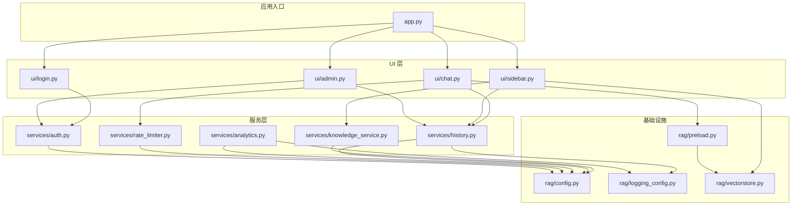
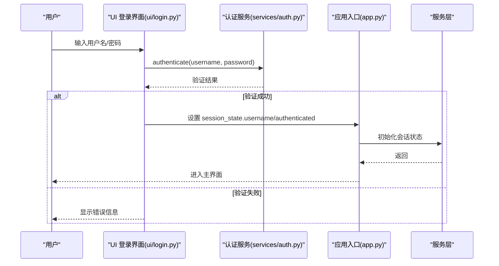
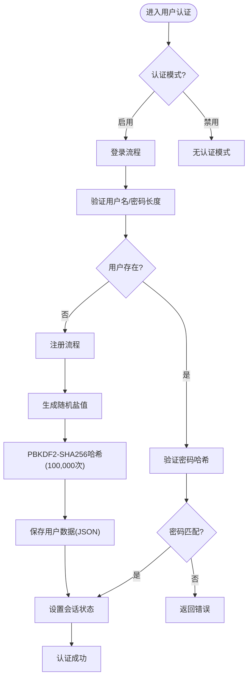
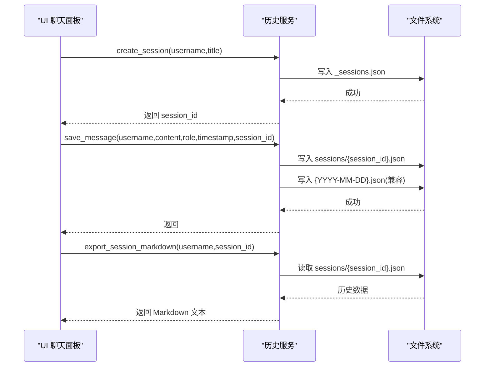
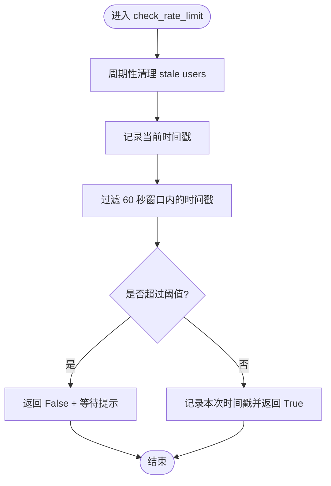
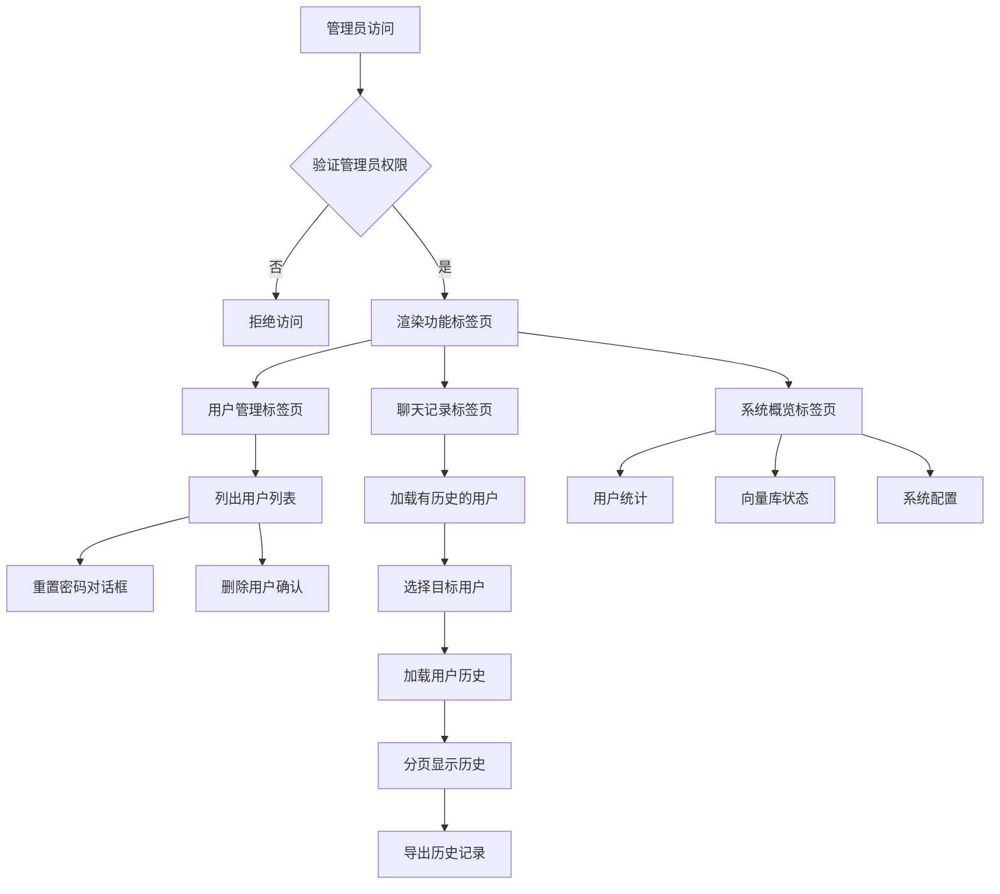
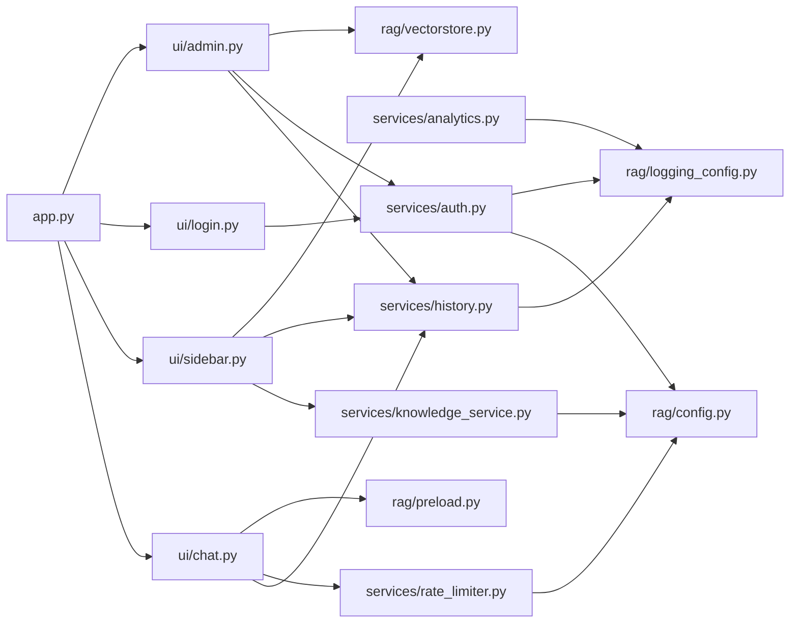

# 业务服务层

<cite>
**本文引用的文件**
- [services/knowledge_service.py](file://services/knowledge_service.py)
- [services/history.py](file://services/history.py)
- [services/analytics.py](file://services/analytics.py)
- [services/rate_limiter.py](file://services/rate_limiter.py)
- [services/auth.py](file://services/auth.py)
- [app.py](file://app.py)
- [rag/config.py](file://rag/config.py)
- [rag/logging_config.py](file://rag/logging_config.py)
- [rag/vectorstore.py](file://rag/vectorstore.py)
- [rag/preload.py](file://rag/preload.py)
- [ui/chat.py](file://ui/chat.py)
- [ui/sidebar.py](file://ui/sidebar.py)
- [ui/login.py](file://ui/login.py)
- [ui/admin.py](file://ui/admin.py)
- [config.yaml](file://config.yaml)
- [tests/test_history.py](file://tests/test_history.py)
- [tests/test_rate_limiter.py](file://tests/test_rate_limiter.py)
</cite>

## 更新摘要
**变更内容**
- 新增完整用户认证系统，包括PBKDF2-SHA256密码哈希、用户注册登录验证
- 新增角色访问控制系统，支持管理员和普通用户权限管理
- 新增用户数据持久化和会话状态管理
- 新增管理员面板，提供用户管理和聊天记录浏览功能
- 更新应用入口的认证流程和会话状态管理

## 目录
1. [简介](#简介)
2. [项目结构](#项目结构)
3. [核心组件](#核心组件)
4. [架构总览](#架构总览)
5. [详细组件分析](#详细组件分析)
6. [依赖分析](#依赖分析)
7. [性能考虑](#性能考虑)
8. [故障排查指南](#故障排查指南)
9. [结论](#结论)
10. [附录](#附录)

## 简介
本技术文档聚焦于业务服务层，围绕知识库服务、会话历史管理、统计分析、速率限制和用户认证五大核心能力，系统阐述其接口定义、数据模型、事务处理与错误处理机制，并提供扩展指南、性能优化建议与监控指标说明，帮助业务开发者快速理解与集成。

## 项目结构
业务服务层由六层组成：
- 服务层（services/）：封装业务逻辑（知识库读取、历史管理、统计分析、速率限制、用户认证）
- 应用入口（app.py）：Streamlit 页面编排与路由
- UI层（ui/）：用户界面组件（聊天面板、侧边栏、登录界面、管理员面板）
- 基础设施（rag/）：配置、日志、向量库、预加载等

**图表来源**
- [app.py:1-237](file://app.py#L1-L237)
- [ui/chat.py:1-190](file://ui/chat.py#L1-L190)
- [ui/sidebar.py:1-191](file://ui/sidebar.py#L1-L191)
- [ui/login.py:1-233](file://ui/login.py#L1-L233)
- [ui/admin.py:1-378](file://ui/admin.py#L1-L378)
- [services/knowledge_service.py:1-46](file://services/knowledge_service.py#L1-L46)
- [services/history.py:1-359](file://services/history.py#L1-L359)
- [services/analytics.py:1-122](file://services/analytics.py#L1-L122)
- [services/rate_limiter.py:1-71](file://services/rate_limiter.py#L1-L71)
- [services/auth.py:1-251](file://services/auth.py#L1-L251)
- [rag/config.py:1-221](file://rag/config.py#L1-L221)
- [rag/logging_config.py:1-129](file://rag/logging_config.py#L1-L129)
- [rag/vectorstore.py:1-209](file://rag/vectorstore.py#L1-L209)
- [rag/preload.py:1-73](file://rag/preload.py#L1-L73)

**章节来源**
- [app.py:1-237](file://app.py#L1-L237)
- [rag/config.py:1-221](file://rag/config.py#L1-L221)

## 核心组件
- 知识库服务：提供文档内容读取（支持 PDF/文本），用于侧边栏文档预览与元数据查询。
- 会话历史服务：按用户/会话隔离持久化，支持会话创建/切换/标题更新、消息保存、历史加载、导出 Markdown/JSON。
- 统计分析服务：从审计日志聚合仪表盘数据（查询总量、活跃用户、零结果、平均延迟、热门查询、日趋势等），支持按用户或全局视图。
- 速率限制服务：基于内存的滑动窗口限流，按用户维度限制每分钟请求数，周期性清理不活跃用户。
- **新增** 用户认证服务：提供PBKDF2-SHA256密码哈希、用户注册登录验证、角色访问控制、用户数据持久化和会话状态管理。

**章节来源**
- [services/knowledge_service.py:16-46](file://services/knowledge_service.py#L16-L46)
- [services/history.py:37-359](file://services/history.py#L37-L359)
- [services/analytics.py:17-122](file://services/analytics.py#L17-L122)
- [services/rate_limiter.py:45-71](file://services/rate_limiter.py#L45-L71)
- [services/auth.py:1-251](file://services/auth.py#L1-L251)

## 架构总览
业务服务层通过 UI 层调用服务，服务层再依赖基础设施模块完成配置、日志与向量库操作；应用入口负责页面路由与主题、会话状态初始化。新增的认证系统确保只有经过身份验证的用户才能访问系统功能。

**图表来源**
- [ui/login.py:186-227](file://ui/login.py#L186-L227)
- [services/auth.py:97-103](file://services/auth.py#L97-L103)
- [app.py:89-97](file://app.py#L89-L97)

## 详细组件分析

### 用户认证系统（PBKDF2-SHA256密码哈希与角色访问控制）
- **功能职责**
  - PBKDF2-SHA256密码哈希存储，不保存明文密码
  - 用户注册、登录验证、密码修改、管理员重置密码
  - 角色访问控制：管理员(admin)和普通用户(user)
  - 用户数据持久化在JSON文件中
  - 线程安全的用户管理器
- **关键接口**
  - authenticate(username, password) -> bool
  - register(username, password) -> tuple[bool, str]
  - change_password(username, old_password, new_password) -> tuple[bool, str]
  - reset_password(username, new_password) -> tuple[bool, str]
  - get_role(username) -> str
  - is_admin(username) -> bool
  - list_users() -> list[dict]
  - delete_user(username) -> tuple[bool, str]
- **数据模型**
  - 用户数据结构：{username: {password_hash, salt, role, created_at}}
  - 首个注册用户自动设为管理员
  - 支持最小密码长度配置
- **处理流程**
  - 密码注册：生成随机盐值，使用PBKDF2-SHA256哈希100,000次
  - 登录验证：验证密码哈希与存储的哈希是否匹配
  - 角色管理：管理员可重置他人密码，不可删除最后一个管理员
  - 文件持久化：线程安全的JSON文件读写
- **错误处理**
  - 用户名/密码长度验证
  - 用户存在性检查
  - 原密码验证
  - 文件损坏时的降级处理
- **安全特性**
  - PBKDF2-SHA256参数：100,000次迭代
  - 随机盐值生成
  - 线程安全的文件操作
  - 最小密码长度限制

**图表来源**
- [services/auth.py:39-53](file://services/auth.py#L39-L53)
- [services/auth.py:105-138](file://services/auth.py#L105-L138)
- [services/auth.py:140-158](file://services/auth.py#L140-L158)

**章节来源**
- [services/auth.py:1-251](file://services/auth.py#L1-L251)
- [ui/login.py:186-227](file://ui/login.py#L186-L227)
- [rag/config.py:111-117](file://rag/config.py#L111-L117)

### 知识库服务（文档内容读取与元数据查询）
- **功能职责**
  - 读取文档全文（支持 .md/.txt/.pdf），用于侧边栏文档预览
  - 与文档元数据查询配合，提供文档列表与简要预览
- **关键接口**
  - read_full_content(docs_dir, relative_path) -> Optional[str]
- **数据模型**
  - 输入：文档根目录与相对路径
  - 输出：字符串内容或 None
- **处理流程**
  - 校验文件存在性
  - 根据后缀选择读取策略：PDF 使用 pymupdf 解析；其他文本使用 UTF-8 读取
  - 异常捕获并记录告警日志
- **错误处理**
  - 文件不存在返回 None
  - PDF 解析失败回退为文本读取
  - 其他异常记录警告并返回 None
- **性能与扩展**
  - PDF 解析可能较慢，建议对大文件进行分页或缓存
  - 可扩展支持更多格式（如 Word/PPT）

**图表来源**
- [services/knowledge_service.py:16-46](file://services/knowledge_service.py#L16-L46)

**章节来源**
- [services/knowledge_service.py:16-46](file://services/knowledge_service.py#L16-L46)
- [ui/sidebar.py:103-126](file://ui/sidebar.py#L103-L126)

### 会话历史管理（按用户/会话隔离持久化）
- **功能职责**
  - 会话生命周期管理：创建、切换、标题更新
  - 消息持久化：按会话 JSON 存储，同时兼容旧版按日期文件
  - 历史查询：按会话/日期加载
  - 导出：Markdown/JSON
  - **新增** 管理员功能：列出所有用户、加载指定用户历史
- **关键接口**
  - list_sessions(username) -> list[dict]
  - get_active_session_id(username) -> Optional[str]
  - create_session(username, title="") -> str
  - update_session_title(username, session_id, title)
  - switch_session(session_id, username="")
  - save_message(username, content, role="user", timestamp="", session_id="")
  - load_session_history(username, session_id) -> list[dict]
  - export_session_markdown(username, session_id) -> str
  - export_session_json(username, session_id) -> str
  - **新增** list_all_users_with_history() -> list[dict]
  - **新增** load_user_history_for_admin(username) -> list[dict]
- **数据模型**
  - 会话项：id、title、created_at、updated_at、message_count
  - 消息项：role、content、timestamp
  - 历史文件：按用户目录 ./chat_history/{username}/ 下的 _sessions.json 与 sessions/{session_id}.json
  - **新增** 管理员统计：{username, session_count, total_messages, last_active, old_files}
- **处理流程**
  - 会话管理：维护 _sessions.json，保留 active_session 字段
  - 消息保存：先写入会话文件，再写入按日期的兼容文件
  - 导出：遍历会话历史，生成 Markdown/JSON 文本
  - **新增** 管理员功能：合并新旧格式的历史数据，按时间排序
- **错误处理**
  - 文件读写异常捕获并返回空结果或空会话
  - 会话标题更新限制长度，避免过长
  - **新增** 管理员功能的异常处理
- **扩展建议**
  - 支持会话标签、归档、删除
  - 增加历史压缩与分页加载

**图表来源**
- [services/history.py:73-113](file://services/history.py#L73-L113)
- [services/history.py:193-221](file://services/history.py#L193-L221)
- [services/history.py:247-269](file://services/history.py#L247-L269)

**章节来源**
- [services/history.py:37-359](file://services/history.py#L37-L359)
- [tests/test_history.py:20-98](file://tests/test_history.py#L20-L98)

### 统计分析与仪表板（审计日志聚合）
- **功能职责**
  - 从审计日志中提取查询量、热门查询、零结果、平均延迟、日趋势等指标
  - 支持按用户或全局视图展示
- **关键接口**
  - get_dashboard_stats(days=7, username: Optional[str]=None) -> dict
- **数据模型**
  - 统计字典包含 total_queries、unique_users、avg_result_count、no_result_count、total_feedback_positive、total_feedback_negative、daily_queries、top_queries、avg_latency_ms、username
  - 审计日志条目字段：timestamp、username、action、details、query、answer_preview、result_count、duration_ms
- **处理流程**
  - 遍历 AUDIT_DIR 下的 .jsonl 文件，按日期过滤
  - 解析每行 JSON，按用户过滤
  - 统计查询次数、结果数、延迟、每日趋势、热门查询
  - 计算平均值与排序取 Top N
- **错误处理**
  - 文件/行解析异常记录警告并继续
- **监控指标**
  - 查询总量、活跃用户数、零结果率、平均延迟、日趋势、热门查询 Top N

**图表来源**
- [services/analytics.py:17-122](file://services/analytics.py#L17-L122)
- [rag/logging_config.py:86-129](file://rag/logging_config.py#L86-L129)

**章节来源**
- [services/analytics.py:17-122](file://services/analytics.py#L17-L122)
- [app.py:128-206](file://app.py#L128-L206)

### 速率限制（内存滑动窗口）
- **功能职责**
  - 按用户维度限制每分钟请求数，周期性清理不活跃用户
- **关键接口**
  - check_rate_limit(username, max_per_minute=30) -> Tuple[bool, str]
- **数据模型**
  - _user_timestamps: dict[str, list[float]] 存储用户近一分钟内的请求时间戳
  - _last_cleanup: float 上次清理时间
- **处理流程**
  - 周期性清理：移除 60 秒外的时间戳，删除无近期请求的用户
  - 滑动窗口：过滤掉 60 秒外的时间戳，若长度达到阈值则拒绝
  - 记录允许请求的时间戳
- **错误处理**
  - 清理过程异常记录调试日志
- **扩展建议**
  - 支持多级限流（全局/用户/IP）、白名单、动态阈值

**图表来源**
- [services/rate_limiter.py:19-71](file://services/rate_limiter.py#L19-L71)

**章节来源**
- [services/rate_limiter.py:45-71](file://services/rate_limiter.py#L45-L71)
- [tests/test_rate_limiter.py:17-57](file://tests/test_rate_limiter.py#L17-L57)

### 管理员面板（用户管理与聊天记录浏览）
- **功能职责**
  - 用户管理：列出用户、重置密码、删除用户
  - 聊天记录浏览：查看所有用户的聊天历史
  - 系统概览：显示用户统计、向量库状态、系统配置
- **关键接口**
  - render_admin_panel(config) -> None
  - list_all_users_with_history() -> list[dict]
  - load_user_history_for_admin(username) -> list[dict]
- **数据模型**
  - 用户列表：[{username, role, created_at}]
  - 聊天记录：按时间排序的消息列表，包含会话信息和来源标识
  - 系统统计：注册用户、有聊天记录的用户、活跃用户数量
- **处理流程**
  - 权限验证：仅管理员可访问
  - 用户管理：提供交互式界面进行密码重置和用户删除
  - 历史浏览：支持分页显示和文本导出
  - 系统概览：实时获取向量库状态和配置信息
- **错误处理**
  - 权限不足时的安全保护
  - 管理面板加载异常的错误处理
  - 用户删除的完整性检查（防止删除最后一个管理员）
- **扩展建议**
  - 支持用户角色管理
  - 增加用户搜索和筛选功能
  - 添加批量操作功能

**图表来源**
- [ui/admin.py:15-45](file://ui/admin.py#L15-L45)
- [ui/admin.py:51-106](file://ui/admin.py#L51-L106)
- [ui/admin.py:182-305](file://ui/admin.py#L182-L305)

**章节来源**
- [ui/admin.py:1-378](file://ui/admin.py#L1-L378)
- [services/history.py:278-359](file://services/history.py#L278-L359)

## 依赖分析
- **服务层依赖**
  - services/history.py 依赖 rag/logging_config.py（审计日志目录、日志记录）
  - services/analytics.py 依赖 rag/logging_config.py（审计日志目录、日志读取）
  - services/knowledge_service.py 依赖 rag/config.py（文档目录配置）
  - services/rate_limiter.py 依赖 rag/config.py（速率限制配置）
  - **新增** services/auth.py 依赖 rag/config.py（认证配置）
  - **新增** services/auth.py 依赖 rag/logging_config.py（日志记录）
- **UI层依赖**
  - ui/chat.py 依赖 services/history.py、services/rate_limiter.py、rag/preload.py、rag/logging_config.py
  - ui/sidebar.py 依赖 services/knowledge_service.py、services/history.py、rag/vectorstore.py
  - **新增** ui/login.py 依赖 services/auth.py、rag/config.py
  - **新增** ui/admin.py 依赖 services/history.py、services/auth.py
- **应用入口**
  - app.py 依赖 ui/chat.py、ui/sidebar.py、ui/login.py、ui/admin.py、rag/config.py、rag/logging_config.py、rag/preload.py
  - **新增** app.py 依赖 services/auth.py 进行管理员权限检查

**图表来源**
- [services/history.py:12-14](file://services/history.py#L12-L14)
- [services/analytics.py:12-14](file://services/analytics.py#L12-L14)
- [services/knowledge_service.py:6-11](file://services/knowledge_service.py#L6-L11)
- [services/rate_limiter.py:7-16](file://services/rate_limiter.py#L7-L16)
- [services/auth.py:29-34](file://services/auth.py#L29-L34)
- [ui/chat.py:8-16](file://ui/chat.py#L8-L16)
- [ui/sidebar.py:11-22](file://ui/sidebar.py#L11-L22)
- [ui/login.py:16-20](file://ui/login.py#L16-L20)
- [ui/admin.py:11-12](file://ui/admin.py#L11-L12)
- [app.py:15-24](file://app.py#L15-L24)

**章节来源**
- [rag/config.py:1-221](file://rag/config.py#L1-L221)
- [rag/logging_config.py:1-129](file://rag/logging_config.py#L1-L129)
- [rag/vectorstore.py:1-209](file://rag/vectorstore.py#L1-L209)
- [rag/preload.py:1-73](file://rag/preload.py#L1-L73)
- [ui/chat.py:1-190](file://ui/chat.py#L1-L190)
- [ui/sidebar.py:1-191](file://ui/sidebar.py#L1-L191)
- [ui/login.py:1-233](file://ui/login.py#L1-L233)
- [ui/admin.py:1-378](file://ui/admin.py#L1-L378)
- [app.py:1-237](file://app.py#L1-L237)

## 性能考虑
- **会话历史**
  - 将消息写入两个位置（会话文件 + 日期文件）增加 IO，建议在高并发场景评估合并策略或异步写入
  - 导出功能遍历全量历史，建议分页或缓存常用会话
  - **新增** 管理员功能可能涉及大量历史数据的合并和排序，建议分批处理
- **速率限制**
  - 内存存储适合单进程部署；分布式场景建议使用 Redis 等共享存储
  - 清理周期可按 QPS 调整，避免过于频繁的 GC 开销
- **知识库服务**
  - PDF 解析成本较高，建议对大文件进行分页或缓存解析结果
- **统计分析**
  - 审计日志按天切分，建议定期归档与压缩，避免单文件过大
- **UI预加载**
  - 预加载线程避免每次 rerun 重建链，提升首屏响应；注意资源占用与错误恢复
- **认证系统**
  - PBKDF2-SHA256哈希计算成本较高，建议合理设置迭代次数
  - 用户数据文件读写需要线程安全，建议使用锁机制
  - 管理员权限检查应尽量减少数据库访问

## 故障排查指南
- **会话历史**
  - 症状：新建会话后无法加载历史
  - 排查：确认 _sessions.json 是否存在且格式正确；检查 sessions/{session_id}.json 是否可读写
  - 参考测试：[tests/test_history.py:20-58](file://tests/test_history.py#L20-L58)
- **速率限制**
  - 症状：频繁提示"请求过于频繁"
  - 排查：确认 max_requests_per_minute 配置；检查时间戳清理是否生效
  - 参考测试：[tests/test_rate_limiter.py:27-44](file://tests/test_rate_limiter.py#L27-L44)
- **知识库服务**
  - 症状：PDF 无法解析
  - 排查：确认安装了 pymupdf；检查文件编码与权限
- **统计分析**
  - 症状：仪表盘无数据
  - 排查：确认 audit_enabled 开启；检查 AUDIT_DIR 下 .jsonl 文件是否存在且格式正确
- **UI初始化**
  - 症状：聊天面板一直显示"系统初始化中"
  - 排查：检查 preload 状态；确认 LLM API 配置与网络连通性
- **认证系统**
  - 症状：登录失败或注册失败
  - 排查：检查用户名/密码长度限制；确认 users.json 文件权限；验证PBKDF2参数
  - 症状：管理员权限不足
  - 排查：确认用户角色；检查管理员配置；验证用户数据完整性
- **管理员面板**
  - 症状：无法访问管理员功能
  - 排查：确认管理员权限；检查用户数据文件；验证权限检查逻辑

**章节来源**
- [tests/test_history.py:20-98](file://tests/test_history.py#L20-L98)
- [tests/test_rate_limiter.py:17-57](file://tests/test_rate_limiter.py#L17-L57)
- [rag/logging_config.py:86-129](file://rag/logging_config.py#L86-L129)
- [rag/preload.py:22-73](file://rag/preload.py#L22-L73)
- [services/auth.py:105-138](file://services/auth.py#L105-L138)
- [services/auth.py:188-190](file://services/auth.py#L188-L190)
- [ui/admin.py:209-232](file://ui/admin.py#L209-L232)

## 结论
业务服务层以清晰的职责划分与简洁的接口设计，支撑了知识库文档读取、会话历史管理、统计分析、速率限制和用户认证等核心能力。新增的认证系统通过PBKDF2-SHA256密码哈希和角色访问控制，为系统提供了完善的安全保障。管理员面板进一步增强了系统的可管理性和可观测性。通过合理的数据模型与错误处理机制，保证了系统的稳定性与安全性。建议在生产环境中结合分布式限流、异步 IO 与缓存策略进一步优化性能与扩展性。

## 附录

### 服务接口定义与数据模型速览
- **知识库服务**
  - read_full_content(docs_dir: str, relative_path: str) -> Optional[str]
  - 输入：文档根目录、相对路径
  - 输出：文本内容或 None
- **会话历史服务**
  - list_sessions(username: str) -> list[dict]
  - get_active_session_id(username: str) -> Optional[str]
  - create_session(username: str, title: str="") -> str
  - update_session_title(username: str, session_id: str, title: str)
  - switch_session(session_id: str, username: str="")
  - save_message(username: str, content: str, role: str="user", timestamp: str="", session_id: str="")
  - load_session_history(username: str, session_id: str) -> list[dict]
  - export_session_markdown(username: str, session_id: str) -> str
  - export_session_json(username: str, session_id: str) -> str
  - **新增** list_all_users_with_history() -> list[dict]
  - **新增** load_user_history_for_admin(username: str) -> list[dict]
- **统计分析服务**
  - get_dashboard_stats(days: int=7, username: Optional[str]=None) -> dict
- **速率限制服务**
  - check_rate_limit(username: str, max_per_minute: int=30) -> Tuple[bool, str]
- **用户认证服务**
  - authenticate(username: str, password: str) -> bool
  - register(username: str, password: str) -> tuple[bool, str]
  - change_password(username: str, old_password: str, new_password: str) -> tuple[bool, str]
  - reset_password(username: str, new_password: str) -> tuple[bool, str]
  - get_role(username: str) -> str
  - is_admin(username: str) -> bool
  - list_users() -> list[dict]
  - delete_user(username: str) -> tuple[bool, str]
  - user_exists(username: str) -> bool
  - user_count() -> int

**章节来源**
- [services/knowledge_service.py:16-46](file://services/knowledge_service.py#L16-L46)
- [services/history.py:37-359](file://services/history.py#L37-L359)
- [services/analytics.py:17-122](file://services/analytics.py#L17-L122)
- [services/rate_limiter.py:45-71](file://services/rate_limiter.py#L45-L71)
- [services/auth.py:97-234](file://services/auth.py#L97-L234)

### 配置与环境
- **关键配置项**
  - llm、embedding、vectorstore、knowledge、rate_limit、ui、max_conversation_turns、audit_enabled、admin_users
  - **新增** auth：enabled、users_file、min_password_length、admin_users
- **环境变量替换**
  - 支持 ${ENV_VAR} 与 ${ENV_VAR:-默认值} 形式
- **认证配置详情**
  - enabled: 是否启用用户认证
  - users_file: 用户数据文件路径，默认"data/users.json"
  - min_password_length: 最小密码长度，默认4位
  - admin_users: 管理员用户名列表

**章节来源**
- [rag/config.py:111-139](file://rag/config.py#L111-L139)
- [config.yaml:1-46](file://config.yaml#L1-L46)