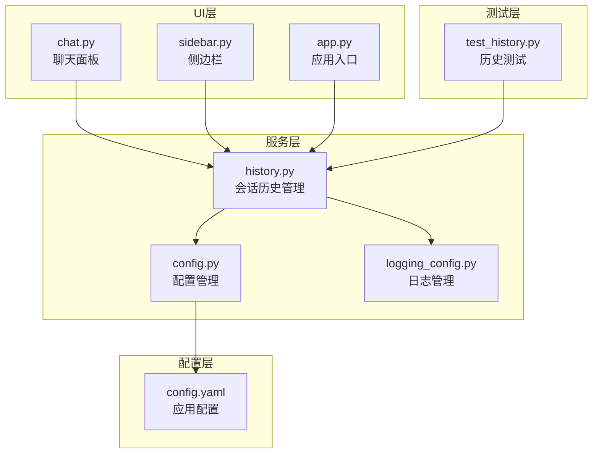
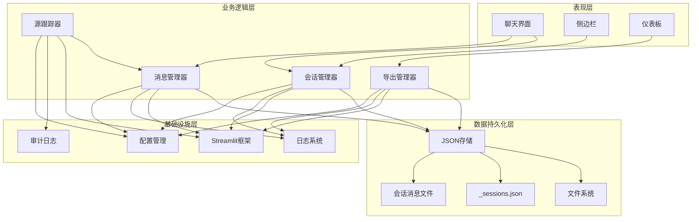
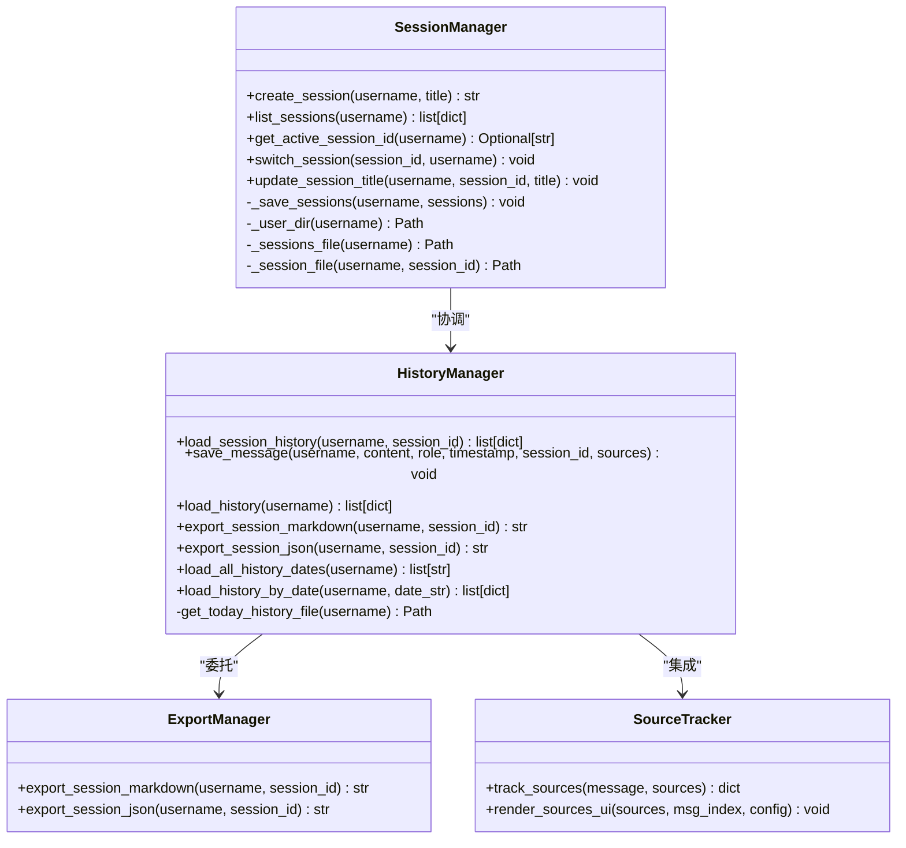
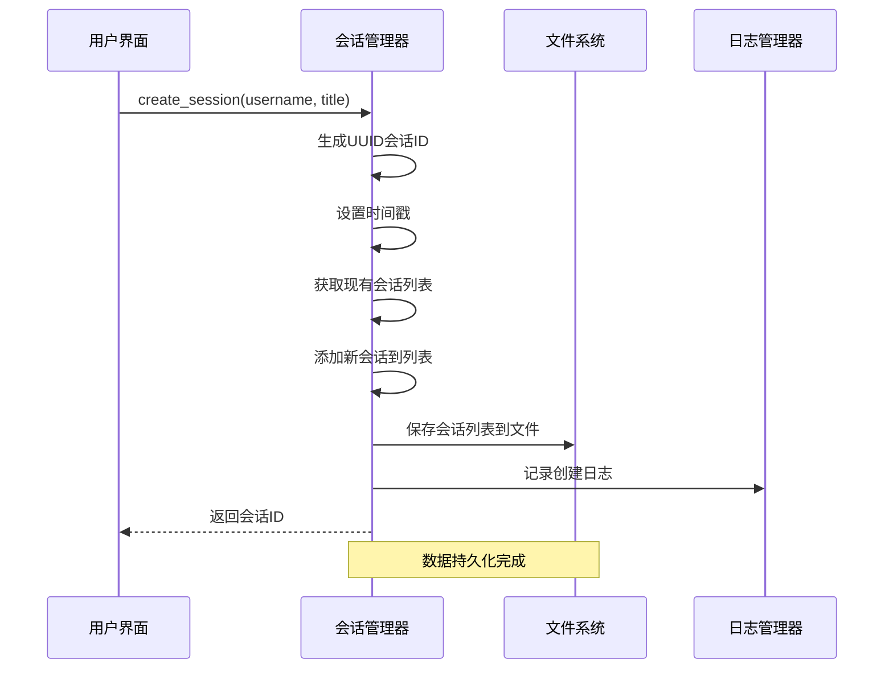
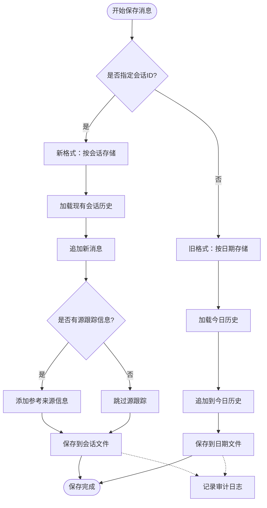
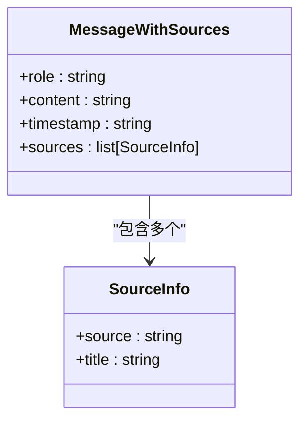
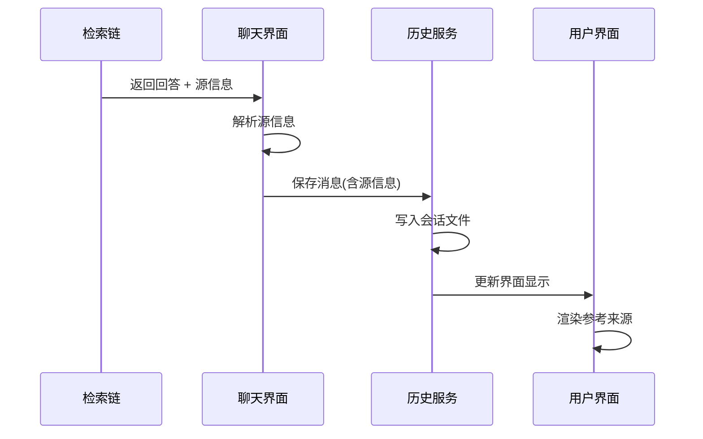
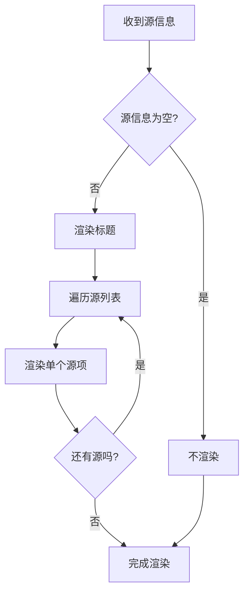
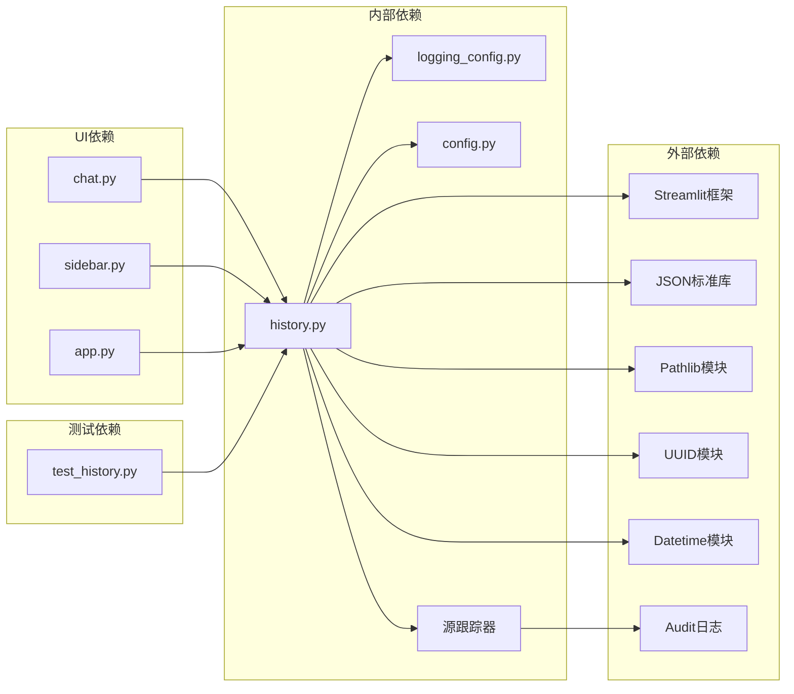

# 会话历史管理

<cite>
**本文档引用的文件**
- [services/history.py](file://services/history.py)
- [tests/test_history.py](file://tests/test_history.py)
- [ui/chat.py](file://ui/chat.py)
- [ui/sidebar.py](file://ui/sidebar.py)
- [app.py](file://app.py)
- [rag/logging_config.py](file://rag/logging_config.py)
- [config.yaml](file://config.yaml)
- [rag/config.py](file://rag/config.py)
</cite>

## 更新摘要
**变更内容**
- 新增源跟踪功能，支持在消息中记录参考来源信息
- 改进的消息持久化机制，增强数据完整性
- 扩展的会话管理功能，支持更灵活的会话状态维护
- 增强的UI集成，提供更好的用户体验

## 目录
1. [简介](#简介)
2. [项目结构](#项目结构)
3. [核心组件](#核心组件)
4. [架构概览](#架构概览)
5. [详细组件分析](#详细组件分析)
6. [源跟踪功能](#源跟踪功能)
7. [依赖关系分析](#依赖关系分析)
8. [性能考虑](#性能考虑)
9. [故障排除指南](#故障排除指南)
10. [结论](#结论)
11. [附录](#附录)

## 简介

会话历史管理服务是知识库智能问答系统的核心组件之一，负责管理用户的对话历史数据。该服务实现了多会话管理、JSON格式持久化、历史数据查询、会话状态维护等功能，为用户提供完整的对话历史管理能力。

**更新** 新增源跟踪功能，支持在消息中记录参考来源信息，增强对话的可追溯性和可信度。

该服务采用Streamlit框架构建，支持实时对话、历史记录查看、会话切换、数据导出等核心功能。通过文件系统进行数据持久化，确保数据的安全性和可靠性。

## 项目结构

会话历史管理服务位于项目的`services`目录下，主要包含以下关键文件：



**图表来源**
- [services/history.py:1-359](file://services/history.py#L1-L359)
- [ui/chat.py:1-223](file://ui/chat.py#L1-L223)
- [ui/sidebar.py:1-491](file://ui/sidebar.py#L1-L491)
- [app.py:1-237](file://app.py#L1-L237)

**章节来源**
- [services/history.py:1-359](file://services/history.py#L1-L359)
- [ui/chat.py:1-223](file://ui/chat.py#L1-L223)
- [ui/sidebar.py:1-491](file://ui/sidebar.py#L1-L491)
- [app.py:1-237](file://app.py#L1-L237)

## 核心组件

会话历史管理服务由多个核心组件构成，每个组件都有明确的职责和功能：

### 1. 会话管理组件
- **会话创建与管理**：支持创建新会话、列出用户会话、切换活跃会话
- **会话状态维护**：跟踪活跃会话ID，维护会话元数据
- **会话持久化**：将会话信息保存到JSON文件中

### 2. 消息持久化组件
- **消息存储**：支持按会话存储和按日期存储两种模式
- **历史查询**：提供多种历史数据查询接口
- **数据兼容性**：向后兼容旧版本的历史存储格式
- **源跟踪**：新增的参考来源记录功能

### 3. 数据导出组件
- **Markdown导出**：将会话历史导出为Markdown格式
- **JSON导出**：将会话历史导出为JSON格式
- **格式化输出**：提供友好的文本格式化选项

**章节来源**
- [services/history.py:37-359](file://services/history.py#L37-L359)

## 架构概览

会话历史管理服务采用分层架构设计，各层之间职责清晰，耦合度低：



**图表来源**
- [services/history.py:19-359](file://services/history.py#L19-L359)
- [ui/chat.py:11-223](file://ui/chat.py#L11-L223)
- [ui/sidebar.py:14-491](file://ui/sidebar.py#L14-L491)

## 详细组件分析

### 会话管理器

会话管理器是会话历史管理的核心组件，负责处理所有会话相关的操作：



**图表来源**
- [services/history.py:37-359](file://services/history.py#L37-L359)

#### 会话创建流程

会话创建是一个复杂的过程，涉及多个步骤和数据验证：



**图表来源**
- [services/history.py:73-89](file://services/history.py#L73-L89)

#### 消息持久化流程

**更新** 消息持久化同时支持新旧两种存储格式，并新增源跟踪功能：



**图表来源**
- [services/history.py:193-226](file://services/history.py#L193-L226)

**章节来源**
- [services/history.py:37-359](file://services/history.py#L37-L359)

### 数据存储结构

会话历史管理服务采用文件系统进行数据持久化，数据结构设计简洁而高效：

#### 会话元数据结构

每个用户会话的信息存储在`_sessions.json`文件中：

| 字段名 | 类型 | 描述 | 示例 |
|--------|------|------|------|
| id | string | 会话唯一标识符 | "a1b2c3d4e5f6" |
| title | string | 会话标题 | "新会话" |
| created_at | string | 创建时间 | "2026-01-01 12:00:00" |
| updated_at | string | 更新时间 | "2026-01-01 12:00:00" |
| message_count | integer | 消息数量 | 0 |

#### 消息记录结构

**更新** 单条消息记录现在包含参考来源信息：

| 字段名 | 类型 | 描述 | 示例 |
|--------|------|------|------|
| role | string | 角色类型 | "user" 或 "assistant" |
| content | string | 消息内容 | "你好，有什么可以帮助你的？" |
| timestamp | string | 时间戳 | "2026-01-01 12:00:00" |
| sources | list | 参考来源列表 | [{"source": "doc1.md", "title": "文档1"}, ...] |

#### 参考来源结构

**新增** 参考来源信息的数据结构：

| 字段名 | 类型 | 描述 | 示例 |
|--------|------|------|------|
| source | string | 源文件路径 | "docs/faq.md" |
| title | string | 源文件标题 | "常见问题解答" |

#### 文件组织结构

数据文件按照以下层次结构组织：

```
./chat_history/
├── [username]/                    # 用户目录
│   ├── _sessions.json             # 会话元数据文件
│   └── sessions/                  # 会话消息目录
│       ├── [session_id].json      # 会话消息文件
│       └── [session_id].json      # 另一个会话消息文件
└── [username]/                    # 另一个用户目录
    └── ...
```

**章节来源**
- [services/history.py:16-35](file://services/history.py#L16-L35)

### 查询接口设计

会话历史管理服务提供了丰富的查询接口，满足不同场景的需求：

#### 会话查询接口

| 接口名称 | 参数 | 返回值 | 描述 |
|----------|------|--------|------|
| list_sessions | username: str | list[dict] | 列出用户的所有会话 |
| get_active_session_id | username: str | Optional[str] | 获取用户当前活跃会话ID |
| load_session_history | username: str, session_id: str | list[dict] | 加载指定会话的历史记录 |

#### 历史查询接口

| 接口名称 | 参数 | 返回值 | 描述 |
|----------|------|--------|------|
| load_all_history_dates | username: str | list[str] | 列出所有有历史记录的日期 |
| load_history_by_date | username: str, date_str: str | list[dict] | 加载指定日期的历史记录 |
| load_history | username: str | list[dict] | 加载今日对话历史（兼容旧格式） |

#### 导出接口

| 接口名称 | 参数 | 返回值 | 描述 |
|----------|------|--------|------|
| export_session_markdown | username: str, session_id: str | str | 将会话导出为Markdown文本 |
| export_session_json | username: str, session_id: str | str | 将会话导出为JSON文本 |

**章节来源**
- [services/history.py:37-359](file://services/history.py#L37-L359)

## 源跟踪功能

**新增** 源跟踪功能是本次更新的核心特性，为对话系统提供了重要的可追溯性：

### 功能概述

源跟踪功能允许系统在生成回答时记录参考的文档来源，并将其与相应的消息关联起来。这增强了对话的可信度和可验证性。

### 技术实现

#### 源跟踪数据结构



**图表来源**
- [services/history.py:193-226](file://services/history.py#L193-L226)

#### 源跟踪流程



**图表来源**
- [ui/chat.py:165-202](file://ui/chat.py#L165-L202)

### UI集成

#### 源信息渲染

**更新** 源信息在UI中的渲染方式：



**图表来源**
- [ui/chat.py:205-223](file://ui/chat.py#L205-L223)

**章节来源**
- [services/history.py:193-226](file://services/history.py#L193-L226)
- [ui/chat.py:165-223](file://ui/chat.py#L165-L223)

## 依赖关系分析

会话历史管理服务与其他组件存在密切的依赖关系：



**图表来源**
- [services/history.py:6-14](file://services/history.py#L6-L14)
- [ui/chat.py:11-223](file://ui/chat.py#L11-L223)
- [ui/sidebar.py:14-491](file://ui/sidebar.py#L14-L491)

### 外部依赖分析

会话历史管理服务依赖于以下外部库和模块：

| 依赖项 | 版本要求 | 用途 | 重要性 |
|--------|----------|------|--------|
| streamlit | >=1.0.0 | UI框架 | 核心依赖 |
| json | 内置 | 数据序列化 | 核心依赖 |
| pathlib | Python 3.4+ | 文件路径处理 | 核心依赖 |
| uuid | 内置 | 唯一标识符生成 | 核心依赖 |
| datetime | 内置 | 时间戳处理 | 核心依赖 |
| logging | 内置 | 日志记录 | 支持依赖 |

**章节来源**
- [services/history.py:6-14](file://services/history.py#L6-L14)

## 性能考虑

会话历史管理服务在设计时充分考虑了性能优化，采用了多种策略来提升系统性能：

### 1. 文件I/O优化

- **批量读取**：在加载历史记录时采用一次性读取整个文件的方式，减少磁盘I/O操作次数
- **增量写入**：消息保存采用追加写入方式，避免频繁的文件重写操作
- **缓存机制**：利用Streamlit的session_state缓存已加载的历史数据，避免重复读取

### 2. 内存管理

- **流式处理**：对于大文件的处理采用流式方式，避免一次性加载到内存
- **数据截断**：对历史记录显示采用截断策略，限制显示数量
- **及时释放**：在不需要时及时释放内存，避免内存泄漏

### 3. 并发控制

- **文件锁机制**：通过文件系统特性实现基本的并发控制
- **原子操作**：确保文件写入的原子性，避免数据损坏
- **异常处理**：完善的异常处理机制，防止并发操作导致的问题

### 4. 存储优化

- **压缩存储**：对于大量历史数据，可以考虑添加压缩机制
- **分片存储**：对于超大数据集，可以考虑按时间分片存储
- **索引机制**：建立消息索引，提升查询效率

### 5. 源跟踪优化

**新增** 源跟踪功能的性能考虑：
- **轻量级存储**：源信息采用简单的键值对结构，存储开销小
- **按需渲染**：源信息仅在需要时渲染，避免不必要的UI更新
- **缓存机制**：源信息可以被缓存，减少重复计算

## 故障排除指南

会话历史管理服务可能遇到的各种问题及解决方案：

### 1. 文件权限问题

**问题症状**：
- 无法创建会话文件
- 保存消息失败
- 读取历史记录异常

**解决方案**：
- 检查`./chat_history`目录的写入权限
- 确保应用程序有足够的磁盘空间
- 验证文件系统是否正常

### 2. 数据损坏问题

**问题症状**：
- JSON解析失败
- 会话列表为空
- 历史记录不完整

**解决方案**：
- 检查JSON文件格式是否正确
- 验证文件编码是否为UTF-8
- 使用备份文件恢复数据

### 3. 源跟踪问题

**新增** 源跟踪功能相关问题：
- **源信息丢失**：检查检索链是否正确返回源信息
- **UI渲染异常**：验证源信息格式是否符合预期
- **性能问题**：优化源信息的存储和渲染逻辑

**解决方案**：
- 检查源信息的数据结构
- 验证UI渲染函数的参数传递
- 实施适当的缓存机制

### 4. 性能问题

**问题症状**：
- 加载历史记录缓慢
- 保存消息延迟
- UI响应迟缓

**解决方案**：
- 优化文件读取策略
- 减少不必要的文件操作
- 实施适当的缓存机制

### 5. 并发冲突

**问题症状**：
- 文件写入冲突
- 数据不一致
- 异常中断

**解决方案**：
- 实现文件锁机制
- 使用事务性操作
- 增加重试机制

**章节来源**
- [services/history.py:42-52](file://services/history.py#L42-L52)
- [services/history.py:175-179](file://services/history.py#L175-L179)

## 结论

会话历史管理服务是一个设计合理、功能完善的数据持久化组件。它通过清晰的分层架构、合理的数据结构设计和完善的错误处理机制，为知识库智能问答系统提供了可靠的会话历史管理能力。

**更新** 本次更新显著增强了服务的功能性和实用性：

### 主要优势
- **简单可靠**：基于文件系统的简单设计，易于理解和维护
- **功能完整**：涵盖了会话管理、消息持久化、数据导出等核心功能
- **兼容性强**：向后兼容旧版本的数据格式
- **扩展性好**：模块化设计便于功能扩展和性能优化
- **可追溯性**：新增的源跟踪功能增强了对话的可信度和可验证性

### 新增特性
- **源跟踪功能**：支持在消息中记录参考来源信息
- **增强的UI集成**：提供更好的用户体验和交互效果
- **改进的错误处理**：更加健壮的异常处理机制

### 未来发展方向
- 添加数据库支持，提升大规模数据处理能力
- 实现更高级的并发控制机制
- 增加数据压缩和索引功能
- 提供更多样化的数据导出格式
- 优化源跟踪功能的性能和可用性

## 附录

### 最佳实践建议

1. **数据备份**：定期备份`./chat_history`目录，防止数据丢失
2. **监控告警**：设置文件系统监控，及时发现存储问题
3. **性能监控**：监控文件I/O性能，及时发现性能瓶颈
4. **安全考虑**：确保会话数据的访问控制和隐私保护
5. **源信息管理**：合理管理参考来源信息，避免冗余和过期数据

### 使用示例

#### 基本会话管理
```python
# 创建新会话
session_id = create_session("user123", "技术支持会话")

# 切换活跃会话
switch_session(session_id)

# 获取活跃会话ID
active_id = get_active_session_id("user123")
```

#### 消息持久化
```python
# 保存用户消息
save_message("user123", "如何安装软件？", role="user", session_id=session_id)

# 保存助手回复（包含源信息）
sources = [{"source": "docs/install.md", "title": "安装指南"}]
save_message("user123", "请参考安装手册", role="assistant", session_id=session_id, sources=sources)
```

#### 历史查询
```python
# 加载会话历史
history = load_session_history("user123", session_id)

# 列出所有会话
sessions = list_sessions("user123")

# 导出会话数据
markdown = export_session_markdown("user123", session_id)
```

### 配置参数

| 参数名 | 类型 | 默认值 | 描述 |
|--------|------|--------|------|
| CHAT_HISTORY_DIR | Path | "./chat_history" | 历史数据存储根目录 |
| max_conversation_turns | int | 10 | 最大对话轮数 |
| audit_enabled | bool | True | 是否启用审计日志 |

### 源跟踪配置

**新增** 源跟踪功能的配置选项：

| 参数名 | 类型 | 默认值 | 描述 |
|--------|------|--------|------|
| enable_source_tracking | bool | True | 是否启用源跟踪功能 |
| max_sources_per_message | int | 10 | 每条消息最多包含的源数量 |
| source_render_limit | int | 5 | UI中显示的源数量限制 |