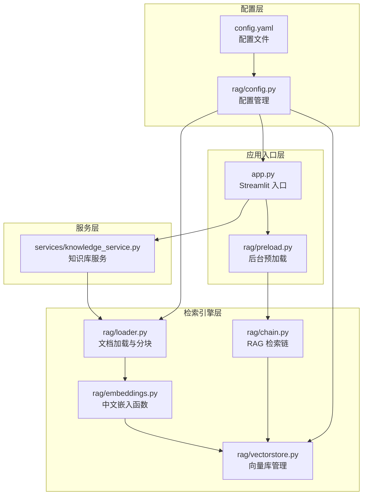
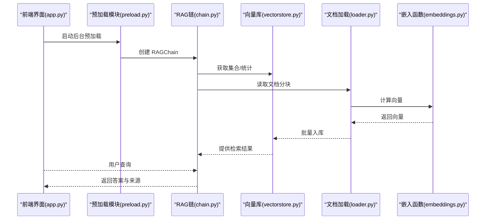
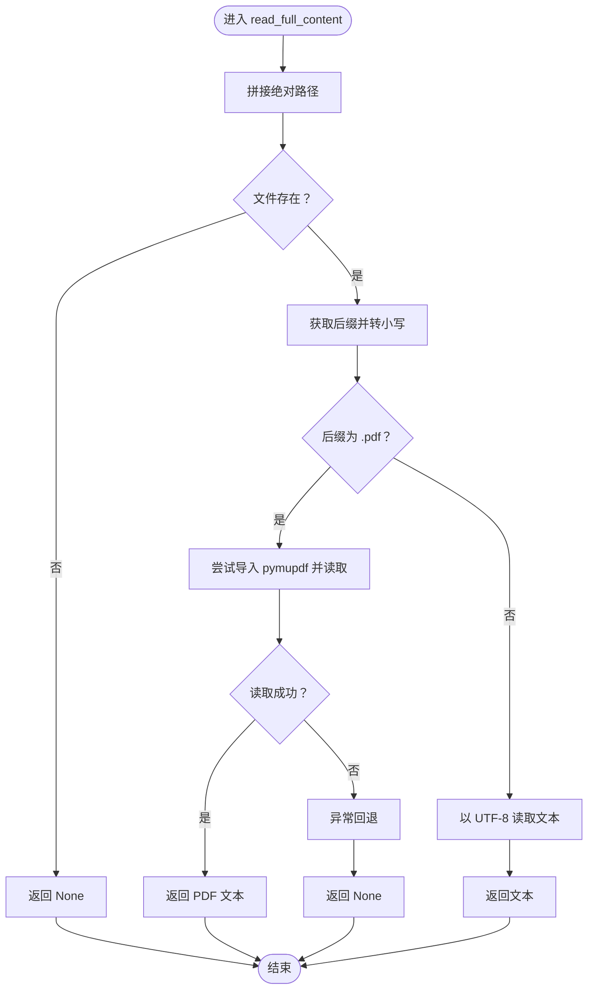
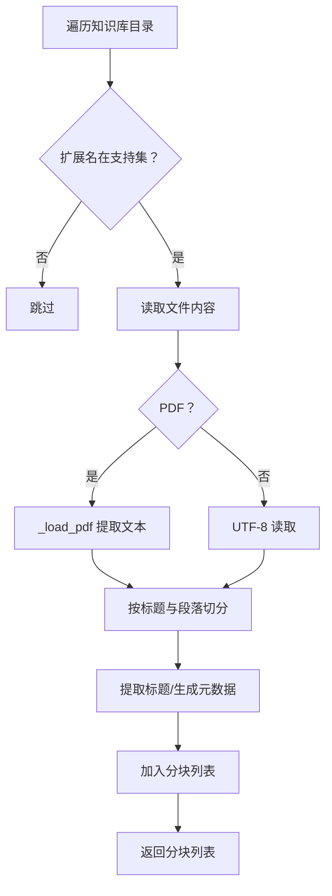
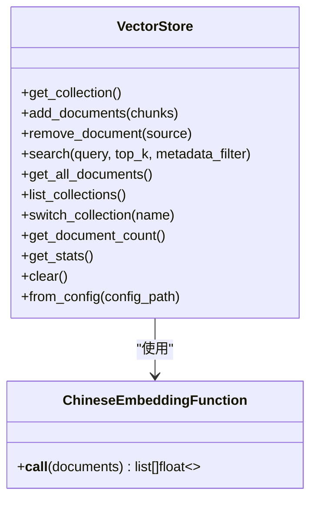
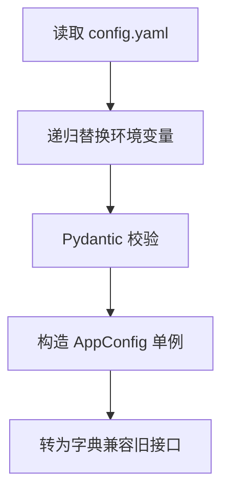
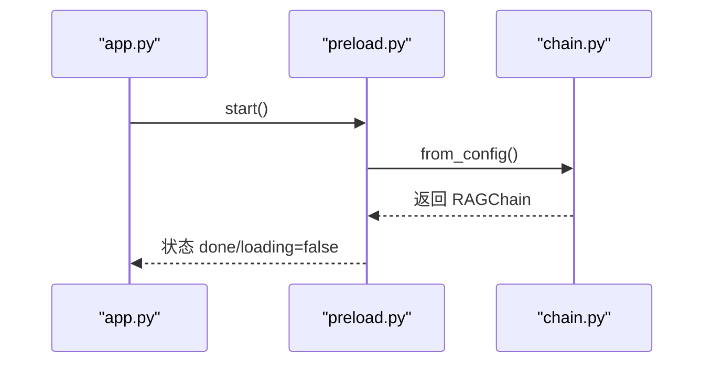
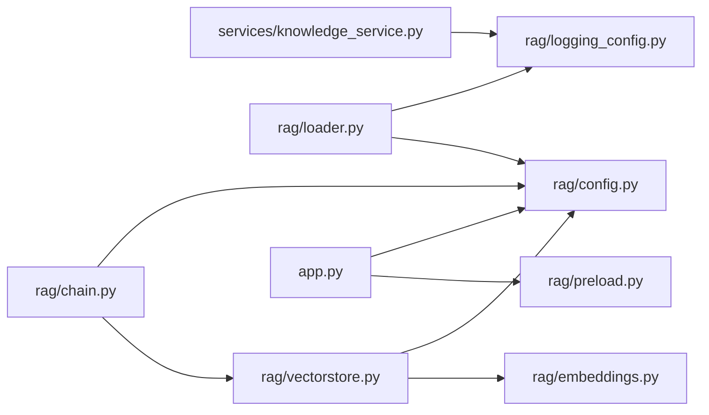

# 知识库服务

<cite>
**本文引用的文件**
- [services/knowledge_service.py](file://services/knowledge_service.py)
- [rag/loader.py](file://rag/loader.py)
- [rag/config.py](file://rag/config.py)
- [rag/vectorstore.py](file://rag/vectorstore.py)
- [rag/preload.py](file://rag/preload.py)
- [rag/chain.py](file://rag/chain.py)
- [rag/embeddings.py](file://rag/embeddings.py)
- [app.py](file://app.py)
- [config.yaml](file://config.yaml)
- [knowledge/README.md](file://knowledge/README.md)
</cite>

## 目录
1. [简介](#简介)
2. [项目结构](#项目结构)
3. [核心组件](#核心组件)
4. [架构总览](#架构总览)
5. [详细组件分析](#详细组件分析)
6. [依赖关系分析](#依赖关系分析)
7. [性能考量](#性能考量)
8. [故障排查指南](#故障排查指南)
9. [结论](#结论)
10. [附录](#附录)

## 简介
本文件面向“知识库服务”模块，聚焦于文档内容读取、多格式文件支持、元数据查询等核心能力，深入解析 read_full_content 函数的实现机制，覆盖 PDF、Markdown、纯文本的处理逻辑，文件路径验证、编码处理、异常处理等技术细节，并给出支持的文件格式、读取流程、错误处理策略、性能优化方案与使用示例及最佳实践，帮助开发者正确使用知识库服务进行文档内容访问。

## 项目结构
知识库服务位于知识库工程的知识库目录下，采用分层设计：
- 服务层：对外提供文档内容读取与元数据查询的服务函数
- 检索引擎层：负责文档加载、分块、向量化、检索与持久化
- 应用入口层：Streamlit Web 界面，集成预加载与聊天页面渲染
- 配置层：集中管理 LLM、嵌入、向量库、知识库、速率限制、UI 等配置

图表来源
- [app.py:1-184](file://app.py#L1-L184)
- [services/knowledge_service.py:1-46](file://services/knowledge_service.py#L1-L46)
- [rag/loader.py:1-259](file://rag/loader.py#L1-L259)
- [rag/vectorstore.py:1-209](file://rag/vectorstore.py#L1-L209)
- [rag/embeddings.py:1-48](file://rag/embeddings.py#L1-L48)
- [rag/preload.py:1-73](file://rag/preload.py#L1-L73)
- [rag/chain.py:1-200](file://rag/chain.py#L1-L200)
- [rag/config.py:1-184](file://rag/config.py#L1-L184)
- [config.yaml:1-46](file://config.yaml#L1-L46)

章节来源
- [app.py:1-184](file://app.py#L1-L184)
- [rag/config.py:1-184](file://rag/config.py#L1-L184)
- [config.yaml:1-46](file://config.yaml#L1-L46)

## 核心组件
- 知识库服务（services/knowledge_service.py）
  - 提供 read_full_content 函数，用于读取文档全文内容（预览），支持 .md、.txt、.pdf
  - 内部进行路径存在性检查、后缀判断、编码处理与异常捕获
- 文档加载与分块（rag/loader.py）
  - 支持 .md、.txt、.pdf 递归扫描知识库目录，按语义切分为文档块，保留元数据
  - 提供 get_knowledge_files_meta 元数据查询接口，不加载全文
- 向量库管理（rag/vectorstore.py）
  - 基于 ChromaDB 的持久化向量库，支持集合切换、增删改查、统计信息查询
  - 提供 from_config 单例缓存，避免重复加载嵌入模型
- 配置管理（rag/config.py）
  - 使用 Pydantic 校验配置，支持环境变量替换，提供全局单例访问
- 预加载模块（rag/preload.py）
  - 后台线程加载 RAGChain，避免 Streamlit 重渲染导致状态丢失
- RAG 检索链（rag/chain.py）
  - 混合检索（向量 + BM25 + RRF 融合），支持多轮对话、可选重排器
- 中文嵌入函数（rag/embeddings.py）
  - 基于 sentence-transformers 的中文嵌入函数，支持在线/离线模型加载

章节来源
- [services/knowledge_service.py:16-46](file://services/knowledge_service.py#L16-L46)
- [rag/loader.py:131-197](file://rag/loader.py#L131-L197)
- [rag/loader.py:200-244](file://rag/loader.py#L200-L244)
- [rag/vectorstore.py:24-209](file://rag/vectorstore.py#L24-L209)
- [rag/config.py:102-184](file://rag/config.py#L102-L184)
- [rag/preload.py:22-73](file://rag/preload.py#L22-L73)
- [rag/chain.py:160-200](file://rag/chain.py#L160-L200)
- [rag/embeddings.py:19-48](file://rag/embeddings.py#L19-L48)

## 架构总览
知识库服务围绕“文档读取—加载分块—向量化—检索—生成回答”的闭环展开。应用入口通过预加载模块在后台加载 RAGChain，服务层提供文档内容读取与元数据查询，检索引擎层负责文档入库与检索。

图表来源
- [app.py:17-41](file://app.py#L17-L41)
- [rag/preload.py:33-49](file://rag/preload.py#L33-L49)
- [rag/chain.py:160-200](file://rag/chain.py#L160-L200)
- [rag/vectorstore.py:89-112](file://rag/vectorstore.py#L89-L112)
- [rag/loader.py:131-197](file://rag/loader.py#L131-L197)
- [rag/embeddings.py:41-47](file://rag/embeddings.py#L41-L47)

## 详细组件分析

### read_full_content 函数实现机制
- 输入参数
  - docs_dir：文档根目录
  - relative_path：文档相对路径
- 处理流程
  - 路径拼接与存在性检查：使用 Path 拼接并判断文件是否存在
  - 后缀判断：区分 .pdf 与其他文本格式
  - PDF 处理：动态导入 pymupdf，打开 PDF，逐页提取文本并合并；异常时回退
  - 文本文件处理：以 UTF-8 编码读取全文
  - 异常处理：捕获读取过程中的异常并记录告警日志，返回 None
- 返回值：成功返回字符串，失败返回 None

图表来源
- [services/knowledge_service.py:16-46](file://services/knowledge_service.py#L16-L46)

章节来源
- [services/knowledge_service.py:16-46](file://services/knowledge_service.py#L16-L46)

### 文档加载与分块（load_documents）
- 功能概述
  - 递归扫描知识库目录，过滤支持的扩展名，排除 README.md
  - PDF 使用 pymupdf 提取文本；其他格式以 UTF-8 读取
  - 按 Markdown 标题分段，保持代码块完整性，支持重叠切分
  - 为每个分块生成元数据（source、title、chunk_index、file_type）
- 关键点
  - _split_by_headers：按二级标题切分，超长段落再按段落边界切分，避免在代码块中间截断
  - _extract_title：从文档首行提取标题，若无则使用文件名
  - _load_pdf：优先使用 pymupdf，回退至 fitz；缺失依赖时报错
  - get_knowledge_files_meta：仅读取前若干行提取标题，不加载全文，提升性能

图表来源
- [rag/loader.py:131-197](file://rag/loader.py#L131-L197)
- [rag/loader.py:29-89](file://rag/loader.py#L29-L89)
- [rag/loader.py:101-118](file://rag/loader.py#L101-L118)
- [rag/loader.py:200-244](file://rag/loader.py#L200-L244)

章节来源
- [rag/loader.py:131-197](file://rag/loader.py#L131-L197)
- [rag/loader.py:29-89](file://rag/loader.py#L29-L89)
- [rag/loader.py:101-118](file://rag/loader.py#L101-L118)
- [rag/loader.py:200-244](file://rag/loader.py#L200-L244)

### 向量库管理（VectorStore）
- 功能概述
  - 延迟初始化客户端与集合，支持持久化存储
  - 批量添加文档分块，先删除同 ID 的旧块，再新增，支持增量更新
  - 支持按来源路径删除文档，支持检索与统计
  - from_config 提供全局单例缓存，避免重复加载嵌入模型
- 性能要点
  - 使用集合 ID 规范化（source_chunk_index）避免重复入库
  - 统计信息仅基于元数据中的 source 字段去重计数

图表来源
- [rag/vectorstore.py:24-209](file://rag/vectorstore.py#L24-L209)
- [rag/embeddings.py:19-48](file://rag/embeddings.py#L19-L48)

章节来源
- [rag/vectorstore.py:24-209](file://rag/vectorstore.py#L24-L209)
- [rag/embeddings.py:19-48](file://rag/embeddings.py#L19-L48)

### 配置管理（get_config/load_config）
- 功能概述
  - 从 YAML 加载配置，支持 ${VAR} 与 ${VAR:-默认值} 的环境变量替换
  - 使用 Pydantic 校验字段范围与类型，提供全局单例与热重载
- 关键字段
  - knowledge：docs_directory、chunk_size、chunk_overlap
  - embedding：model、local_path
  - vectorstore：persist_directory、collection_name、top_k、distance_threshold
  - rate_limit：enabled、max_requests_per_minute、max_input_length
  - ui：title、subtitle、company_name、logo_text、default_theme

图表来源
- [rag/config.py:118-184](file://rag/config.py#L118-L184)

章节来源
- [rag/config.py:118-184](file://rag/config.py#L118-L184)
- [config.yaml:1-46](file://config.yaml#L1-46)

### 预加载与 RAG 链
- 预加载模块
  - 后台线程启动，幂等启动，状态共享于模块级字典
  - 成功加载后保存 RAGChain 实例，失败记录错误信息
- RAG 链
  - 混合检索：向量检索 + BM25 关键词检索 + RRF 融合
  - 支持多轮对话、可选 Cross-Encoder 重排器、查询改写
  - 类级缓存避免重复加载重排器模型

图表来源
- [app.py:33-41](file://app.py#L33-L41)
- [rag/preload.py:22-49](file://rag/preload.py#L22-L49)
- [rag/chain.py:160-200](file://rag/chain.py#L160-L200)

章节来源
- [rag/preload.py:22-73](file://rag/preload.py#L22-L73)
- [rag/chain.py:160-200](file://rag/chain.py#L160-L200)

## 依赖关系分析
- 组件耦合
  - services/knowledge_service.py 仅依赖 rag/logging_config，耦合度低
  - rag/loader.py 依赖 config、logging_config，内部逻辑清晰
  - rag/vectorstore.py 依赖 chromadb、embeddings、config、loader
  - rag/chain.py 依赖 vectorstore、config、logging_config
  - app.py 依赖 preload、config、ui 子模块
- 外部依赖
  - PDF：pymupdf（或 fitz）
  - 向量库：chromadb
  - 嵌入：sentence-transformers
  - 配置：yaml、pydantic
  - UI：streamlit
- 循环依赖
  - 未发现循环依赖，模块职责清晰

图表来源
- [services/knowledge_service.py:9](file://services/knowledge_service.py#L9)
- [rag/loader.py:12-15](file://rag/loader.py#L12-L15)
- [rag/vectorstore.py:12-15](file://rag/vectorstore.py#L12-L15)
- [rag/chain.py:14-16](file://rag/chain.py#L14-L16)
- [app.py:15-17](file://app.py#L15-L17)

章节来源
- [services/knowledge_service.py:9](file://services/knowledge_service.py#L9)
- [rag/loader.py:12-15](file://rag/loader.py#L12-L15)
- [rag/vectorstore.py:12-15](file://rag/vectorstore.py#L12-L15)
- [rag/chain.py:14-16](file://rag/chain.py#L14-L16)
- [app.py:15-17](file://app.py#L15-L17)

## 性能考量
- 文档加载与分块
  - 按标题与段落切分，避免在代码块中间截断，提高可读性
  - 支持重叠切分，减少跨段落信息丢失
- 向量库入库
  - 使用 ID 去重与增量更新，避免重复入库
  - 批量操作减少网络/磁盘往返
- 预加载
  - 后台线程加载 RAGChain，避免每次交互触发重载
  - 单例缓存嵌入模型，降低重复初始化开销
- 检索
  - 向量检索 + BM25 + RRF 融合，兼顾召回与相关性
  - 类级缓存重排器模型，减少重复加载
- I/O 与编码
  - 文本文件统一 UTF-8 读取，避免编码问题
  - PDF 使用 pymupdf，性能稳定；缺失依赖时提供明确报错

[本节为通用性能讨论，无需特定文件来源]

## 故障排查指南
- PDF 读取失败
  - 现象：返回 None 或日志警告
  - 排查：确认已安装 pymupdf；若仅安装了 pyMuPDF，需同时安装 pymupdf 或使用 fitz 别名
  - 参考：[services/knowledge_service.py:32-40](file://services/knowledge_service.py#L32-L40)、[rag/loader.py:101-118](file://rag/loader.py#L101-L118)
- 文本编码错误
  - 现象：读取异常或乱码
  - 排查：确保文本文件为 UTF-8 编码；loader 默认 UTF-8 读取
  - 参考：[services/knowledge_service.py:42](file://services/knowledge_service.py#L42)、[rag/loader.py:127](file://rag/loader.py#L127)
- 配置加载失败
  - 现象：配置校验失败或环境变量未替换
  - 排查：检查 config.yaml 语法与字段范围；确认环境变量存在或提供默认值
  - 参考：[rag/config.py:118-184](file://rag/config.py#L118-L184)
- 向量库入库异常
  - 现象：入库失败或计数异常
  - 排查：检查 persist_directory 权限、集合名称、ID 规范化
  - 参考：[rag/vectorstore.py:89-112](file://rag/vectorstore.py#L89-L112)
- 预加载未完成
  - 现象：界面显示加载中或链路不可用
  - 排查：确认后台线程已启动，查看日志错误信息
  - 参考：[rag/preload.py:22-49](file://rag/preload.py#L22-L49)

章节来源
- [services/knowledge_service.py:32-40](file://services/knowledge_service.py#L32-L40)
- [rag/loader.py:101-118](file://rag/loader.py#L101-L118)
- [services/knowledge_service.py:42](file://services/knowledge_service.py#L42)
- [rag/config.py:118-184](file://rag/config.py#L118-L184)
- [rag/vectorstore.py:89-112](file://rag/vectorstore.py#L89-L112)
- [rag/preload.py:22-49](file://rag/preload.py#L22-L49)

## 结论
知识库服务模块以清晰的分层架构实现了文档内容读取、多格式支持、元数据查询与检索增强生成的完整链路。read_full_content 函数针对 PDF、Markdown、纯文本提供了稳健的处理流程与完善的异常处理策略。结合向量库管理、预加载与配置管理，系统具备良好的可维护性与可扩展性。建议在生产环境中关注 PDF 依赖、嵌入模型加载与向量库持久化路径的稳定性，并通过合理的分块策略与重叠设置提升检索质量。

[本节为总结性内容，无需特定文件来源]

## 附录

### 支持的文件格式
- .md：Markdown 文档，按标题与段落切分
- .txt：纯文本文件，UTF-8 编码读取
- .pdf：PDF 文档，使用 pymupdf 提取文本

章节来源
- [services/knowledge_service.py:13](file://services/knowledge_service.py#L13)
- [rag/loader.py:18-19](file://rag/loader.py#L18-L19)

### 使用示例与最佳实践
- 读取文档全文（预览）
  - 调用 read_full_content(docs_dir, relative_path)，注意 relative_path 为知识库内的相对路径
  - 若返回 None，检查文件是否存在与编码是否正确
  - 参考：[services/knowledge_service.py:16-46](file://services/knowledge_service.py#L16-L46)
- 元数据查询
  - 使用 get_knowledge_files_meta 获取文件列表与基本信息（不加载全文）
  - 参考：[rag/loader.py:200-244](file://rag/loader.py#L200-L244)
- 入库与检索
  - 运行脚本将知识库文档加载到向量库，随后通过 RAG 链进行检索与生成
  - 参考：[rag/loader.py:131-197](file://rag/loader.py#L131-L197)、[rag/vectorstore.py:89-112](file://rag/vectorstore.py#L89-L112)
- 配置与部署
  - 修改 config.yaml 中的 knowledge、embedding、vectorstore 等参数
  - 参考：[config.yaml:1-46](file://config.yaml#L1-46)、[rag/config.py:118-184](file://rag/config.py#L118-L184)
- 知识库目录规范
  - 将 Markdown 文档放入 knowledge/ 目录，支持子目录
  - 参考：[knowledge/README.md:1-29](file://knowledge/README.md#L1-L29)