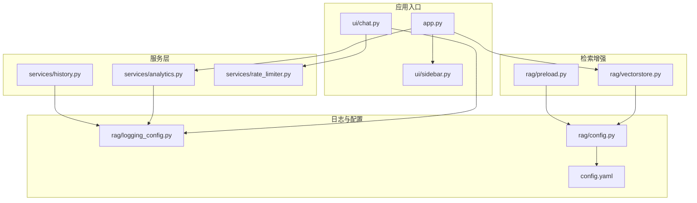
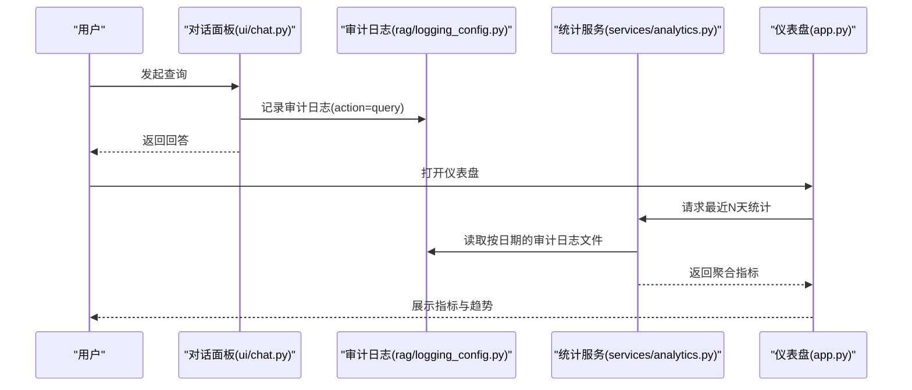
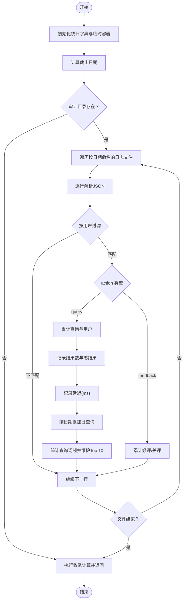
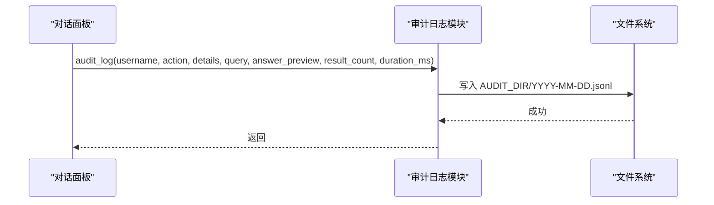
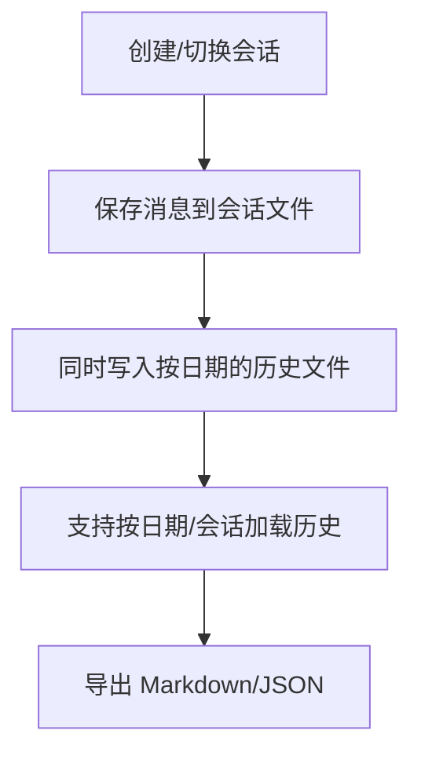
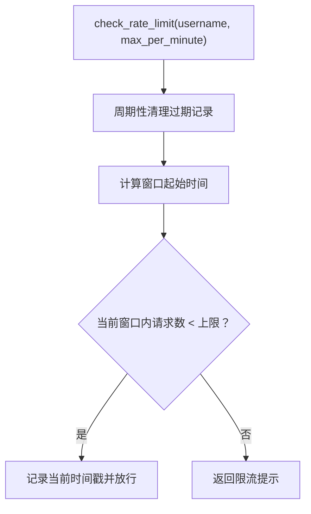
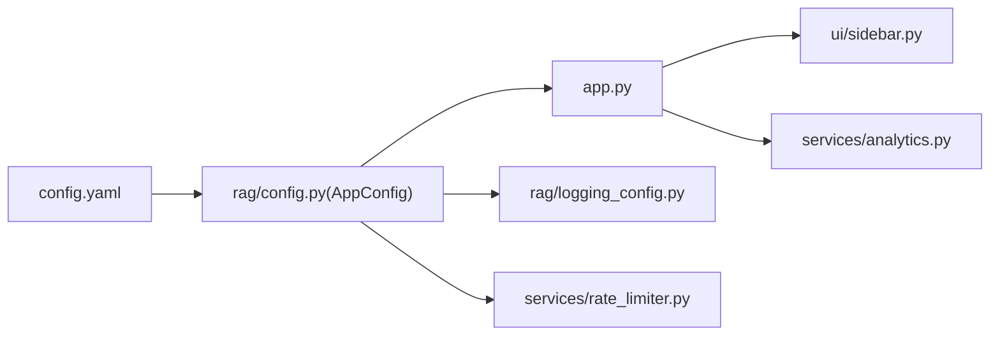
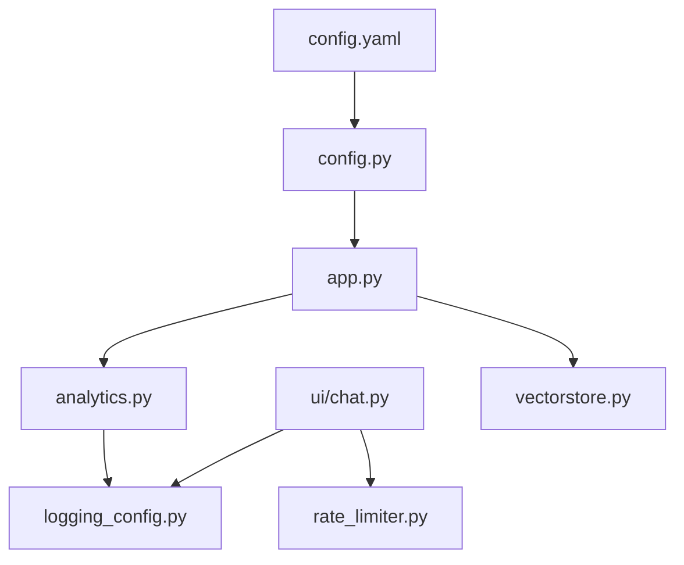

# 统计分析服务

<cite>
**本文引用的文件**
- [analytics.py](file://services/analytics.py)
- [history.py](file://services/history.py)
- [rate_limiter.py](file://services/rate_limiter.py)
- [app.py](file://app.py)
- [logging_config.py](file://rag/logging_config.py)
- [config.py](file://rag/config.py)
- [sidebar.py](file://ui/sidebar.py)
- [chat.py](file://ui/chat.py)
- [vectorstore.py](file://rag/vectorstore.py)
- [preload.py](file://rag/preload.py)
- [config.yaml](file://config.yaml)
- [test_rate_limiter.py](file://tests/test_rate_limiter.py)
</cite>

## 目录
1. [简介](#简介)
2. [项目结构](#项目结构)
3. [核心组件](#核心组件)
4. [架构总览](#架构总览)
5. [详细组件分析](#详细组件分析)
6. [依赖分析](#依赖分析)
7. [性能考虑](#性能考虑)
8. [故障排查指南](#故障排查指南)
9. [结论](#结论)
10. [附录](#附录)

## 简介
本文件面向“统计分析服务”的技术文档，聚焦于以下目标：
- 仪表板数据采集：从审计日志中提取查询总量、热门查询、用户活跃度、零结果查询、平均延迟、评价统计、日查询趋势等指标。
- 用户行为分析：基于审计日志的结构化字段进行聚合与排序，支持按用户或全局维度展示。
- 系统监控：结合日志目录结构、审计开关、速率限制、向量库状态等，形成可观测性闭环。
- 数据准确性与性能：通过时间窗口清理、日志文件按日期切分、聚合计算与可视化准备，确保统计稳定可靠。

## 项目结构
围绕统计分析的关键模块与文件如下：
- 服务层
  - 仪表板统计：services/analytics.py
  - 历史记录与会话：services/history.py
  - 速率限制：services/rate_limiter.py
- 应用入口与界面
  - 主程序入口：app.py
  - 侧边栏导航：ui/sidebar.py
  - 对话面板与审计日志上报：ui/chat.py
- 日志与配置
  - 结构化日志与审计日志：rag/logging_config.py
  - 配置管理：rag/config.py、config.yaml
- 检索增强（RAG）
  - 向量库状态：rag/vectorstore.py
  - 预加载链路：rag/preload.py

图表来源
- [app.py:1-189](file://app.py#L1-L189)
- [analytics.py:1-122](file://services/analytics.py#L1-L122)
- [history.py:1-270](file://services/history.py#L1-L270)
- [rate_limiter.py:1-71](file://services/rate_limiter.py#L1-L71)
- [logging_config.py:1-129](file://rag/logging_config.py#L1-L129)
- [config.py:1-184](file://rag/config.py#L1-L184)
- [vectorstore.py:1-209](file://rag/vectorstore.py#L1-L209)
- [preload.py:1-73](file://rag/preload.py#L1-L73)

章节来源
- [app.py:1-189](file://app.py#L1-L189)
- [analytics.py:1-122](file://services/analytics.py#L1-L122)
- [logging_config.py:1-129](file://rag/logging_config.py#L1-L129)
- [config.py:1-184](file://rag/config.py#L1-L184)
- [config.yaml:1-46](file://config.yaml#L1-L46)

## 核心组件
- 仪表板统计服务：从审计日志目录按日期切分的 JSON Lines 文件中解析条目，按 action、用户、时间等字段进行聚合，输出指标字典。
- 审计日志模块：统一记录用户行为（查询、反馈等），并落盘到按日期命名的日志文件，便于后续统计。
- 历史记录与会话：提供会话生命周期管理、消息持久化、导出功能，支撑用户行为回溯与报表导出。
- 速率限制：基于内存的时间戳队列，按用户与一分钟窗口限制请求次数，并周期性清理不活跃用户。
- 配置与UI：集中配置审计开关、管理员名单、UI主题等；仪表盘页面支持管理员切换“全局/个人”视图。

章节来源
- [analytics.py:17-122](file://services/analytics.py#L17-L122)
- [logging_config.py:86-129](file://rag/logging_config.py#L86-L129)
- [history.py:37-270](file://services/history.py#L37-L270)
- [rate_limiter.py:45-71](file://services/rate_limiter.py#L45-L71)
- [config.py:102-116](file://rag/config.py#L102-L116)
- [app.py:107-185](file://app.py#L107-L185)

## 架构总览
统计分析服务的运行链路如下：
- 用户在对话面板发起查询，系统记录审计日志（含查询、结果数、耗时等）。
- 仪表盘页面按天拉取审计日志，进行聚合统计与可视化展示。
- 历史记录模块负责会话与消息的持久化，支持导出。
- 速率限制模块在查询前进行限流判断，避免过载。
- 配置模块统一管理审计开关、管理员名单、UI主题等。

图表来源
- [chat.py:96-190](file://ui/chat.py#L96-L190)
- [logging_config.py:86-129](file://rag/logging_config.py#L86-L129)
- [analytics.py:17-122](file://services/analytics.py#L17-L122)
- [app.py:107-185](file://app.py#L107-L185)

## 详细组件分析

### 仪表板统计服务（services/analytics.py）
- 功能职责
  - 读取审计日志目录下按日期命名的 JSON Lines 文件。
  - 按用户过滤或全局聚合，统计查询总量、唯一用户数、平均结果数、零结果查询数、平均延迟、日查询趋势、热门查询Top 10、好评/差评总数。
- 关键流程
  - 计算截止日期，遍历日志文件，解析每行 JSON。
  - 根据 action 字段区分“query”和“feedback”，分别累加指标。
  - 对查询按日期截取 key 进行日查询趋势统计，对查询文本进行频次统计并取 Top 10。
  - 在最终阶段计算平均值、去重用户数、排序与裁剪。
- 性能与健壮性
  - 异常行与文件读取失败会被忽略并记录告警，保证统计过程不中断。
  - 仅处理最近 N 天的日志文件，避免无限扫描。
- 输出结构
  - 字典包含 total_queries、unique_users、avg_result_count、no_result_count、total_feedback_positive、total_feedback_negative、daily_queries、top_queries、avg_latency_ms、username 等键。

图表来源
- [analytics.py:17-122](file://services/analytics.py#L17-L122)

章节来源
- [analytics.py:17-122](file://services/analytics.py#L17-L122)

### 审计日志模块（rag/logging_config.py）
- 功能职责
  - 统一日志输出（控制台彩色、文件完整日志）。
  - 审计日志写入：按日期创建文件，追加 JSON Lines 条目，包含时间戳、用户名、动作、查询、结果数、耗时等。
- 关键点
  - 审计开关由配置控制，默认启用。
  - 日志目录结构清晰，便于统计服务按日期扫描。
- 与统计服务的关系
  - 统计服务读取该目录下的日志文件，作为统计数据源。

图表来源
- [logging_config.py:86-129](file://rag/logging_config.py#L86-L129)

章节来源
- [logging_config.py:86-129](file://rag/logging_config.py#L86-L129)

### 历史记录与会话（services/history.py）
- 功能职责
  - 会话管理：列出、创建、切换、更新标题。
  - 消息持久化：按会话与按日期两种格式存储，兼容历史。
  - 导出功能：支持 Markdown 与 JSON 导出。
- 与统计的关系
  - 仪表盘页面可导出当前会话内容，便于离线分析与归档。

图表来源
- [history.py:73-270](file://services/history.py#L73-L270)

章节来源
- [history.py:37-270](file://services/history.py#L37-L270)

### 速率限制（services/rate_limiter.py）
- 功能职责
  - 基于用户的时间戳队列，限制每分钟请求数。
  - 周期性清理过期时间戳与不活跃用户，防止内存膨胀。
- 与统计的关系
  - 通过限制请求频率，间接影响查询总量与日趋势的稳定性。

图表来源
- [rate_limiter.py:45-71](file://services/rate_limiter.py#L45-L71)

章节来源
- [rate_limiter.py:19-71](file://services/rate_limiter.py#L19-L71)

### 配置与UI（rag/config.py、config.yaml、app.py、ui/sidebar.py）
- 配置项要点
  - 审计开关 audit_enabled：决定是否记录审计日志。
  - 管理员名单 admin_users：用于仪表盘“全局视图”权限。
  - UI 主题、标题、副标题等。
- UI 交互
  - 仪表盘页面支持管理员勾选“查看全局数据”，非管理员仅能看到自己的数据。
  - 侧边栏提供导航、会话管理、知识库文档浏览、历史记录查看、系统状态展示等。

图表来源
- [config.py:102-116](file://rag/config.py#L102-L116)
- [config.yaml:36-46](file://config.yaml#L36-L46)
- [app.py:107-185](file://app.py#L107-L185)
- [sidebar.py:26-192](file://ui/sidebar.py#L26-L192)

章节来源
- [config.py:102-116](file://rag/config.py#L102-L116)
- [config.yaml:36-46](file://config.yaml#L36-L46)
- [app.py:107-185](file://app.py#L107-L185)
- [sidebar.py:26-192](file://ui/sidebar.py#L26-L192)

### 向量库状态（rag/vectorstore.py）
- 功能职责
  - 提供向量库统计信息（集合名、块数、文件数），用于仪表盘“知识库状态”区域展示。
- 与统计的关系
  - 作为系统健康度指标之一，辅助判断检索质量与数据规模。

章节来源
- [vectorstore.py:149-169](file://rag/vectorstore.py#L149-L169)

## 依赖分析
- 组件耦合
  - 仪表盘统计服务依赖审计日志目录结构与审计开关。
  - 对话面板依赖审计日志模块与速率限制模块。
  - 仪表盘页面依赖配置模块（管理员名单）、向量库模块（状态展示）。
- 外部依赖
  - 日志与配置文件系统路径。
  - 向量库客户端（ChromaDB）。
- 循环依赖
  - 当前模块间无循环导入，结构清晰。

图表来源
- [analytics.py:12](file://services/analytics.py#L12)
- [logging_config.py:12](file://rag/logging_config.py#L12)
- [chat.py:9-11](file://ui/chat.py#L9-L11)
- [rate_limiter.py:11](file://services/rate_limiter.py#L11)
- [app.py:15-17](file://app.py#L15-L17)
- [vectorstore.py:12](file://rag/vectorstore.py#L12)
- [config.py:138-143](file://rag/config.py#L138-L143)
- [config.yaml:1-46](file://config.yaml#L1-46)

章节来源
- [analytics.py:12-14](file://services/analytics.py#L12-L14)
- [logging_config.py:12-16](file://rag/logging_config.py#L12-L16)
- [chat.py:9-11](file://ui/chat.py#L9-L11)
- [rate_limiter.py:11](file://services/rate_limiter.py#L11)
- [app.py:15-17](file://app.py#L15-L17)
- [vectorstore.py:12](file://rag/vectorstore.py#L12)
- [config.py:138-143](file://rag/config.py#L138-L143)
- [config.yaml:1-46](file://config.yaml#L1-46)

## 性能考虑
- 日志扫描范围控制
  - 通过截止日期仅扫描最近 N 天的日志文件，避免全量扫描带来的 IO 压力。
- 聚合计算复杂度
  - 查询词频统计使用字典计数，Top 10 采用排序后截断，整体复杂度可控。
- 内存占用与清理
  - 速率限制器周期性清理过期时间戳与不活跃用户，防止内存无限增长。
- I/O 与并发
  - 审计日志写入为顺序追加，统计读取为顺序扫描，适合本地文件系统。
- 可扩展建议
  - 若日志量持续增大，可考虑引入滚动压缩、分区索引或外部统计数据库（如 ClickHouse）进行离线聚合。

## 故障排查指南
- 仪表盘无数据
  - 检查审计开关是否开启、审计目录是否存在且有最新日志文件。
  - 确认用户过滤条件与管理员权限设置。
- 速率限制导致频繁提示
  - 调整每分钟上限或等待冷却窗口。
- 向量库状态异常
  - 检查配置中的持久化目录与集合名，确认向量库已正确初始化。
- 单元测试参考
  - 速率限制器行为可通过测试用例验证：初始请求放行、达到上限后拦截、不同用户相互隔离、清理过期用户。

章节来源
- [logging_config.py:108-129](file://rag/logging_config.py#L108-L129)
- [config.py:112-116](file://rag/config.py#L112-L116)
- [rate_limiter.py:19-71](file://services/rate_limiter.py#L19-L71)
- [vectorstore.py:182-209](file://rag/vectorstore.py#L182-L209)
- [test_rate_limiter.py:10-57](file://tests/test_rate_limiter.py#L10-L57)

## 结论
统计分析服务通过“审计日志 + 仪表盘统计 + 历史记录 + 速率限制 + 配置管理”的协同，实现了对用户行为与系统运行状态的可观测与可视化。其设计强调：
- 数据来源明确（审计日志按日期切分）；
- 统计口径清晰（按用户/全局、按天趋势、Top 10 热门查询）；
- 性能与健壮性兼顾（截止日期扫描、异常容错、周期清理）；
- 可扩展空间（可接入外部统计数据库、增加更细粒度的指标）。

## 附录
- 生成流程（统计报表）
  - 数据采集：读取 AUDIT_DIR 下最近 N 天的 JSON Lines 文件。
  - 数据清洗：跳过无效行，按 action 与用户过滤。
  - 指标计算：查询总量、唯一用户、平均结果数、零结果、平均延迟、日趋势、Top 10 查询、好评/差评。
  - 可视化准备：将字典指标渲染到仪表盘页面，支持导出当前会话。
- 数据准确性保障
  - 审计开关与目录结构标准化，避免遗漏。
  - 速率限制减少抖动，提升趋势稳定性。
  - 单元测试覆盖关键行为，降低回归风险。