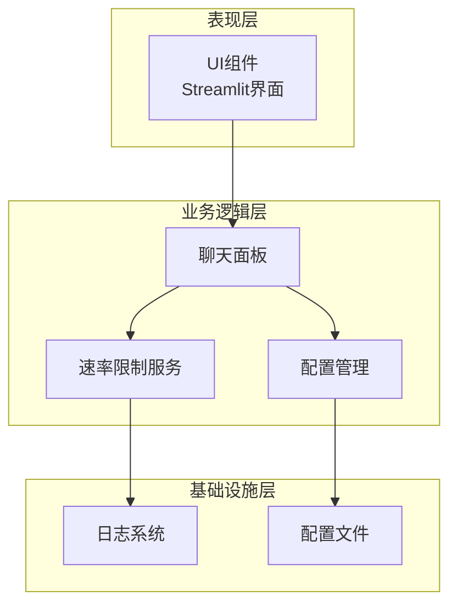
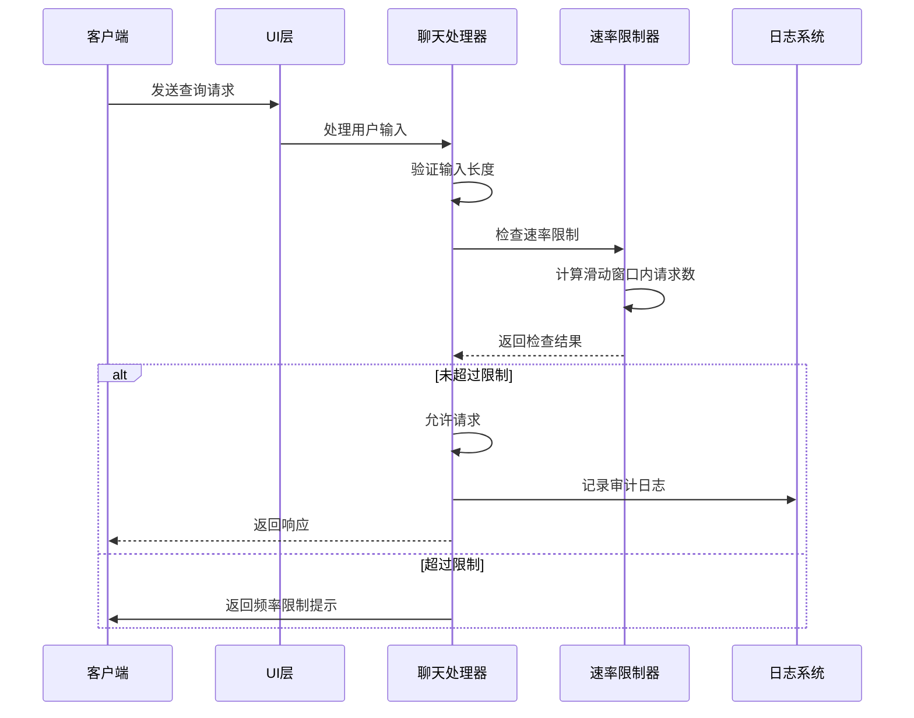
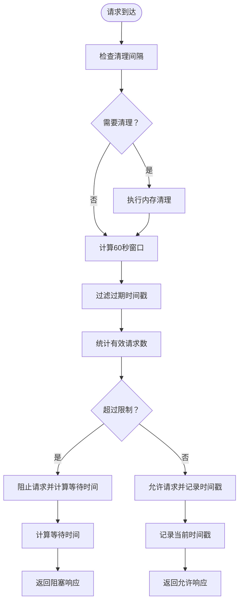
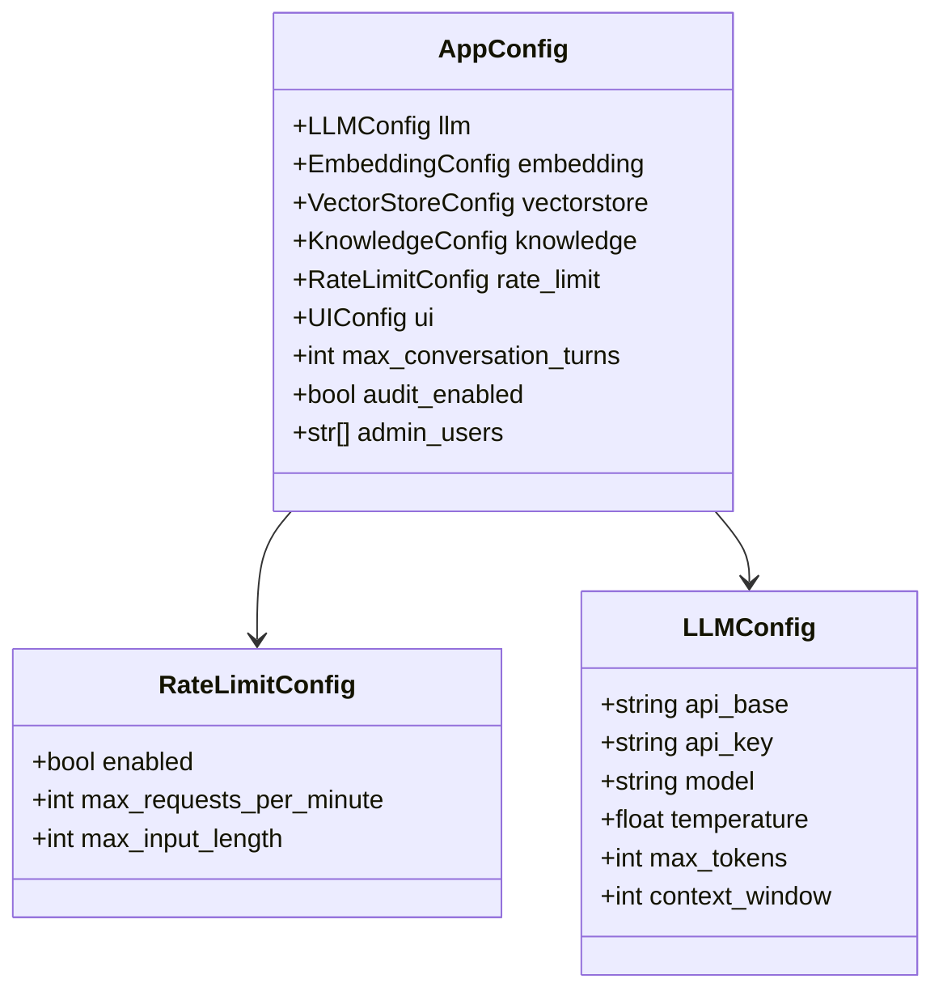
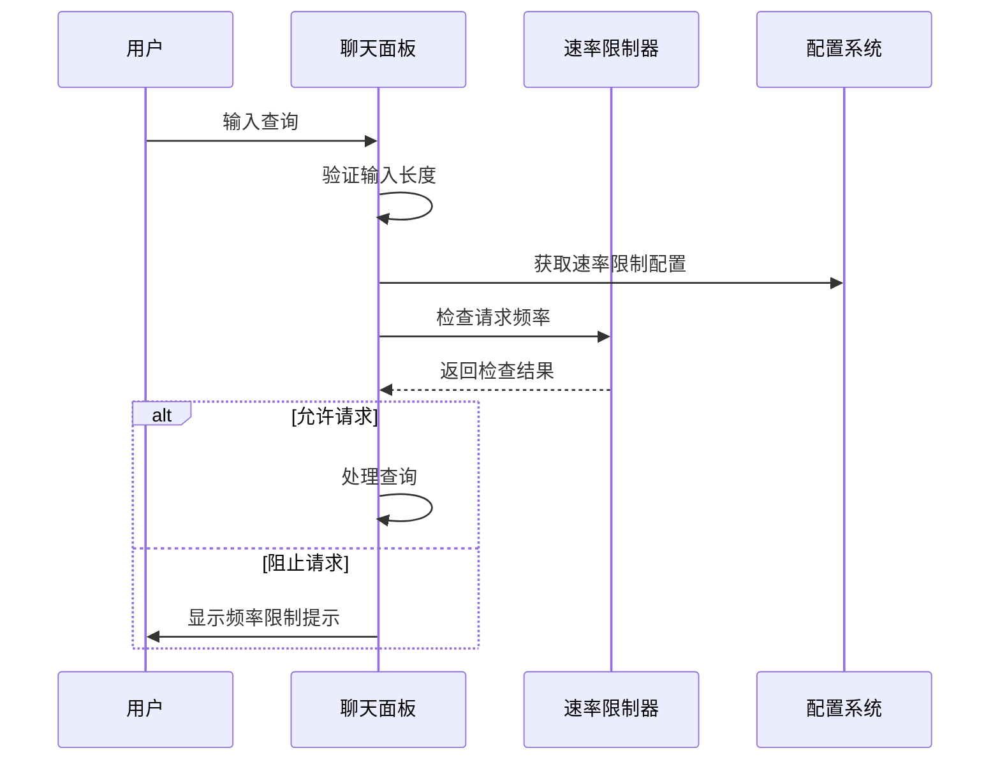
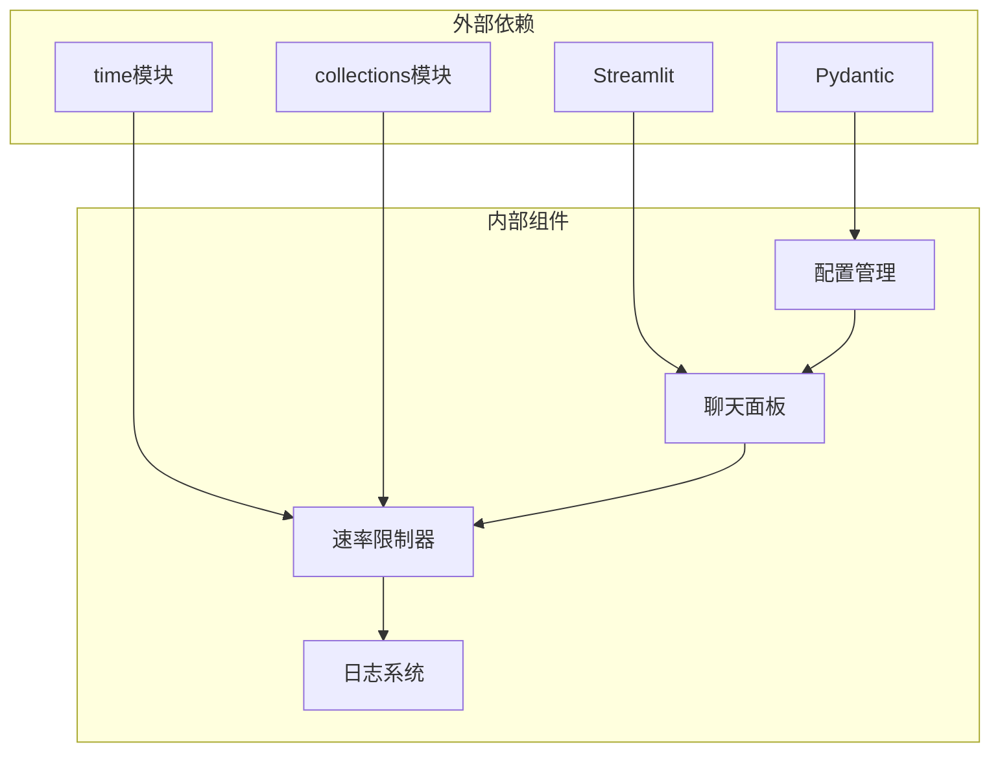

# 速率限制服务

<cite>
**本文档引用的文件**
- [services/rate_limiter.py](file://services/rate_limiter.py)
- [tests/test_rate_limiter.py](file://tests/test_rate_limiter.py)
- [config.yaml](file://config.yaml)
- [rag/config.py](file://rag/config.py)
- [ui/chat.py](file://ui/chat.py)
- [rag/logging_config.py](file://rag/logging_config.py)
- [app.py](file://app.py)
</cite>

## 目录
1. [简介](#简介)
2. [项目结构](#项目结构)
3. [核心组件](#核心组件)
4. [架构概览](#架构概览)
5. [详细组件分析](#详细组件分析)
6. [依赖分析](#依赖分析)
7. [性能考虑](#性能考虑)
8. [故障排除指南](#故障排除指南)
9. [结论](#结论)
10. [附录](#附录)

## 简介

本项目实现了一个基于内存的简单速率限制服务，采用滑动窗口算法来控制用户的请求频率。该服务通过时间戳记录用户在60秒窗口内的请求次数，并根据配置的最大请求数进行限制。系统还包含了内存清理机制，定期清理不活跃用户的记录，防止内存泄漏。

## 项目结构

该项目采用分层架构设计，主要包含以下层次：



**图表来源**
- [app.py:54-90](file://app.py#L54-L90)
- [ui/chat.py:19-73](file://ui/chat.py#L19-L73)
- [services/rate_limiter.py:1-71](file://services/rate_limiter.py#L1-L71)

**章节来源**
- [app.py:1-189](file://app.py#L1-L189)
- [ui/chat.py:1-190](file://ui/chat.py#L1-L190)

## 核心组件

### 速率限制服务

速率限制服务是系统的核心防护组件，实现了基于滑动窗口的请求频率控制。其主要特点包括：

- **滑动窗口算法**：维护每个用户在60秒时间窗口内的请求时间戳
- **内存清理机制**：定期清理不活跃用户的记录，防止内存泄漏
- **实时检查**：每次请求时进行实时频率检查
- **用户隔离**：不同用户之间的请求限制相互独立

### 配置管理系统

系统通过Pydantic模型实现了强类型的配置管理，支持：
- 环境变量替换
- 运行时配置热更新
- 类型验证和默认值设置

### UI集成层

前端界面通过Streamlit框架实现，集成了：
- 实时聊天功能
- 请求频率检查
- 输入长度验证
- 审计日志记录

**章节来源**
- [services/rate_limiter.py:1-71](file://services/rate_limiter.py#L1-L71)
- [rag/config.py:86-91](file://rag/config.py#L86-L91)
- [ui/chat.py:96-134](file://ui/chat.py#L96-L134)

## 架构概览

系统采用客户端-服务器架构，速率限制服务作为中间件嵌入在请求处理流程中：



**图表来源**
- [ui/chat.py:96-134](file://ui/chat.py#L96-L134)
- [services/rate_limiter.py:45-70](file://services/rate_limiter.py#L45-L70)

## 详细组件分析

### 速率限制算法实现

#### 滑动窗口算法

系统采用滑动窗口算法实现精确的请求频率控制：



**图表来源**
- [services/rate_limiter.py:19-70](file://services/rate_limiter.py#L19-L70)

#### 内存清理机制

系统实现了智能的内存清理策略：

| 参数 | 默认值 | 说明 |
|------|--------|------|
| 清理间隔 | 600秒 | 每10分钟检查一次内存使用情况 |
| 不活跃超时 | 1800秒 | 30分钟无请求的用户将被清理 |
| 时间窗口 | 60秒 | 滑动窗口大小 |

清理过程分为两个阶段：
1. **时间戳清理**：移除60秒之前的过期请求记录
2. **用户清理**：移除没有任何活跃请求的用户记录

**章节来源**
- [services/rate_limiter.py:19-43](file://services/rate_limiter.py#L19-L43)

### 配置系统设计

#### 强类型配置模型

系统使用Pydantic实现了强类型的配置管理：



**图表来源**
- [rag/config.py:86-116](file://rag/config.py#L86-L116)

#### 配置加载流程


**图表来源**
- [rag/config.py:118-150](file://rag/config.py#L118-L150)

**章节来源**
- [rag/config.py:86-150](file://rag/config.py#L86-L150)
- [config.yaml:29-34](file://config.yaml#L29-L34)

### UI集成实现

#### 聊天面板集成

UI层通过以下步骤集成速率限制：

1. **输入验证**：检查用户输入长度是否超过配置限制
2. **频率检查**：调用速率限制服务检查请求频率
3. **响应处理**：根据检查结果显示相应的提示信息



**图表来源**
- [ui/chat.py:96-134](file://ui/chat.py#L96-L134)

**章节来源**
- [ui/chat.py:96-134](file://ui/chat.py#L96-L134)

## 依赖分析

### 组件间依赖关系



**图表来源**
- [services/rate_limiter.py:7-9](file://services/rate_limiter.py#L7-L9)
- [rag/config.py:12-13](file://rag/config.py#L12-L13)

### 数据流分析

系统中的数据流向可以概括为：

1. **配置数据流**：config.yaml → Pydantic模型 → 运行时配置
2. **请求数据流**：用户输入 → UI验证 → 速率限制检查 → 业务处理
3. **日志数据流**：审计事件 → 日志系统 → 文件存储

**章节来源**
- [services/rate_limiter.py:1-71](file://services/rate_limiter.py#L1-L71)
- [rag/config.py:1-184](file://rag/config.py#L1-L184)

## 性能考虑

### 时间复杂度分析

- **检查操作**：O(n)，其中n为用户在60秒窗口内的请求数
- **清理操作**：O(m)，其中m为活跃用户数量
- **空间复杂度**：O(k)，其中k为活跃用户总数

### 优化建议

1. **批量清理**：可以考虑在清理时批量删除多个用户，减少循环开销
2. **缓存优化**：对于高频用户，可以考虑使用更高效的数据结构
3. **异步清理**：将清理操作移到后台线程执行
4. **内存池**：使用内存池管理时间戳数组，减少垃圾回收压力

### 并发安全性

系统目前使用全局字典存储用户状态，在多线程环境下可能存在竞态条件。建议：

1. **添加锁机制**：为用户状态访问添加互斥锁
2. **使用线程安全容器**：考虑使用ThreadLocal或其他线程安全的数据结构
3. **原子操作**：确保时间戳记录和清理操作的原子性

## 故障排除指南

### 常见问题及解决方案

#### 问题1：内存持续增长

**症状**：系统运行一段时间后内存使用量持续增加

**原因分析**：用户清理机制可能没有按预期工作

**解决方案**：
1. 检查清理间隔配置
2. 验证时间戳过滤逻辑
3. 确认用户活跃度判断标准

#### 问题2：请求被错误地拒绝

**症状**：用户在正常频率下被限制

**原因分析**：
1. 时间窗口计算错误
2. 配置参数设置不当
3. 系统时间不同步

**解决方案**：
1. 检查系统时间设置
2. 验证配置文件中的限制参数
3. 查看日志中的详细信息

#### 问题3：性能下降

**症状**：系统响应变慢

**原因分析**：
1. 用户数量过多导致清理开销增大
2. 频繁的内存分配和回收
3. 配置不合理导致频繁检查

**解决方案**：
1. 调整清理间隔
2. 优化数据结构
3. 考虑分布式部署

**章节来源**
- [services/rate_limiter.py:19-43](file://services/rate_limiter.py#L19-L43)
- [tests/test_rate_limiter.py:1-57](file://tests/test_rate_limiter.py#L1-L57)

### 调试技巧

1. **启用详细日志**：查看清理操作的日志输出
2. **监控内存使用**：定期检查用户状态存储的大小
3. **测试边界条件**：验证极限情况下的行为
4. **性能基准测试**：测量不同负载下的系统表现

## 结论

本项目的速率限制服务实现了基础但有效的请求频率控制功能。通过滑动窗口算法和智能内存清理机制，系统能够在保证防护效果的同时控制资源消耗。

### 主要优势

1. **实现简洁**：算法简单易懂，易于维护
2. **内存友好**：内置清理机制防止内存泄漏
3. **配置灵活**：支持运行时配置调整
4. **集成方便**：与现有系统无缝集成

### 改进建议

1. **分布式支持**：考虑使用Redis等外部存储实现跨节点共享
2. **更精细的控制**：支持按IP、API密钥等多种维度的限制
3. **动态调整**：实现基于负载的自适应限制策略
4. **监控增强**：添加更详细的性能指标和告警机制

## 附录

### 配置示例

#### 基础配置
```yaml
rate_limit:
  enabled: true
  max_requests_per_minute: 30
  max_input_length: 2000
```

#### 高并发场景配置
```yaml
rate_limit:
  enabled: true
  max_requests_per_minute: 100
  max_input_length: 5000
```

#### 严格防护配置
```yaml
rate_limit:
  enabled: true
  max_requests_per_minute: 10
  max_input_length: 1000
```

### 最佳实践

1. **合理设置阈值**：根据业务需求和系统承载能力设置合适的限制
2. **监控告警**：建立监控体系，及时发现异常流量模式
3. **灰度发布**：新版本上线时先小范围测试
4. **定期评估**：根据实际使用情况进行配置优化