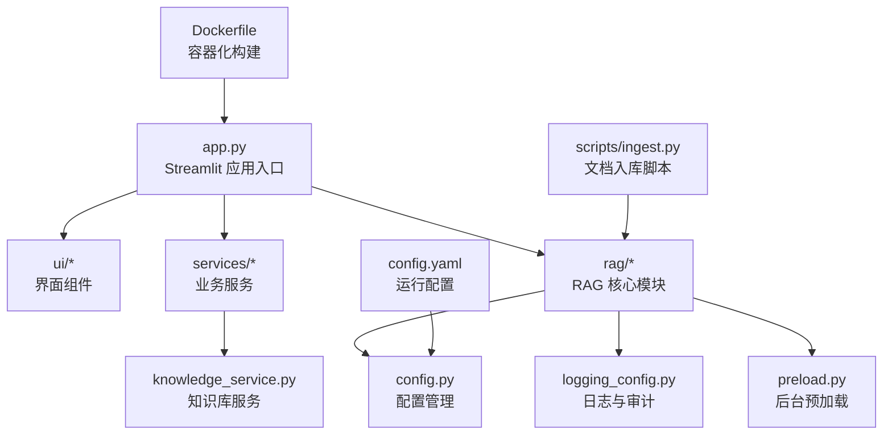
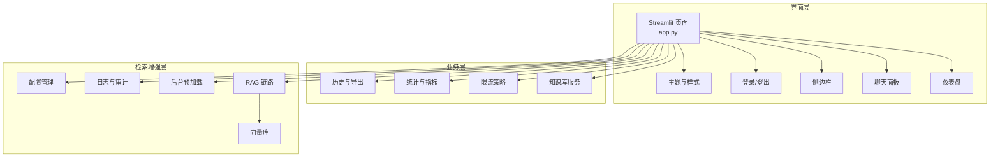
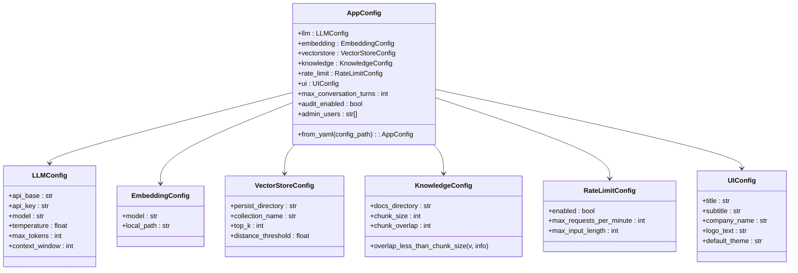
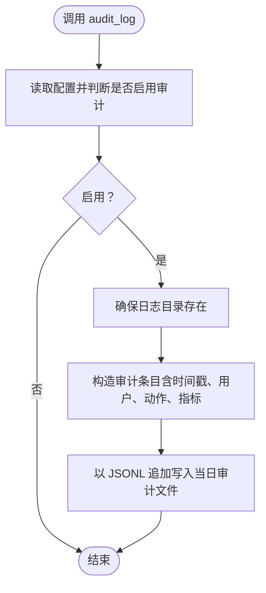
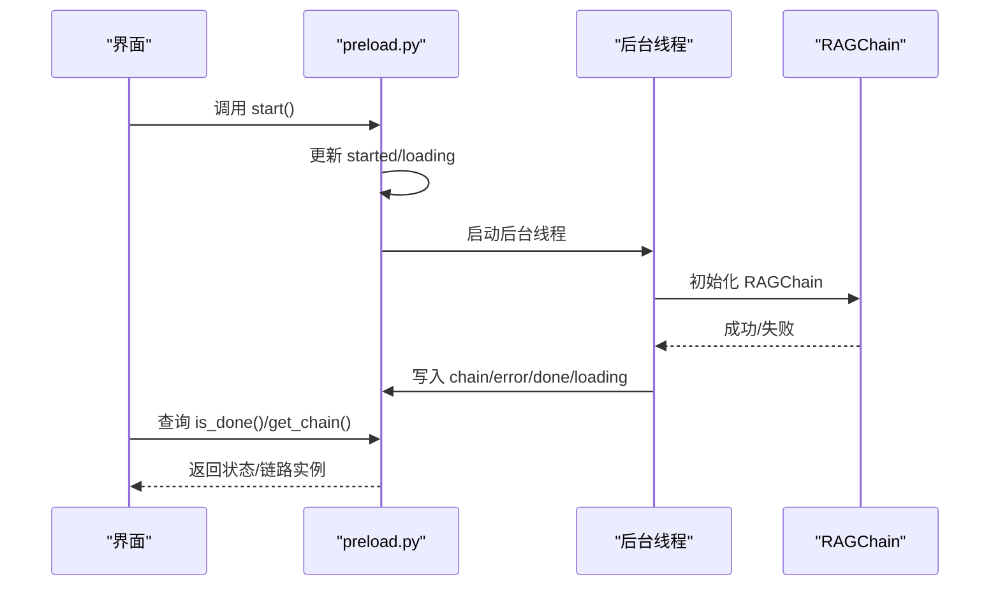
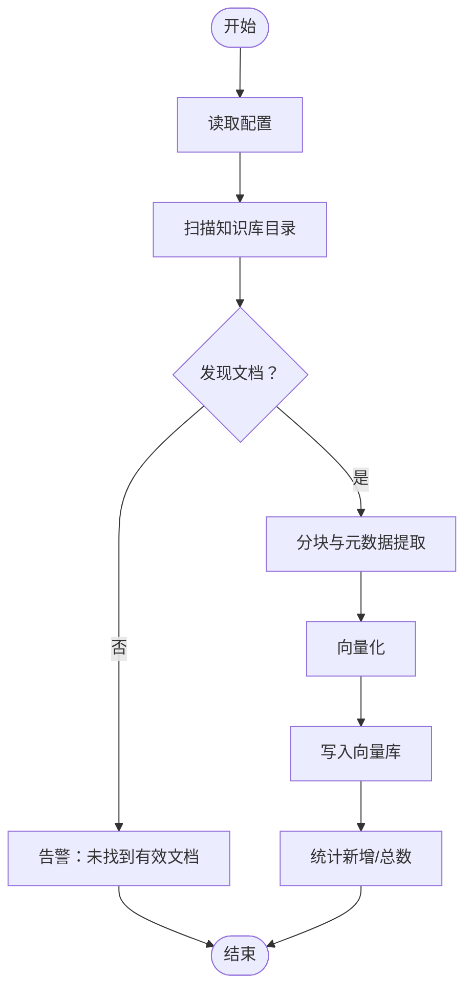
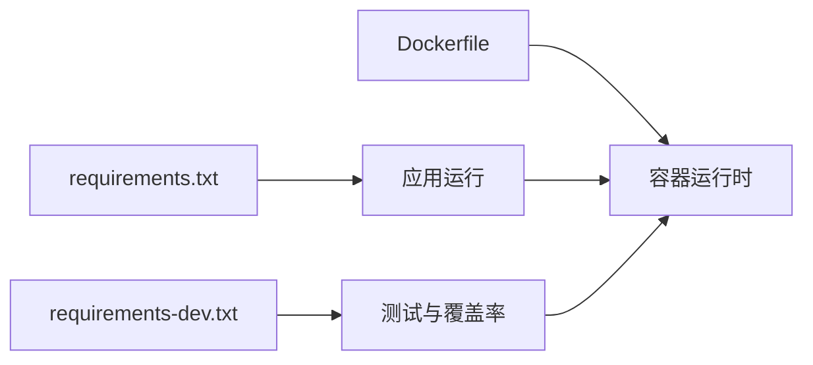

# 开发指南

<cite>
**本文引用的文件**
- [README.md](file://README.md)
- [知识库文档目录](file://knowledge/README.md)
- [Dockerfile](file://Dockerfile)
- [requirements.txt](file://requirements.txt)
- [requirements-dev.txt](file://requirements-dev.txt)
- [app.py](file://app.py)
- [config.yaml](file://config.yaml)
- [rag/config.py](file://rag/config.py)
- [rag/logging_config.py](file://rag/logging_config.py)
- [rag/preload.py](file://rag/preload.py)
- [services/knowledge_service.py](file://services/knowledge_service.py)
- [scripts/ingest.py](file://scripts/ingest.py)
</cite>

## 目录
1. [简介](#简介)
2. [项目结构](#项目结构)
3. [核心组件](#核心组件)
4. [架构总览](#架构总览)
5. [详细组件分析](#详细组件分析)
6. [依赖关系分析](#依赖关系分析)
7. [性能考虑](#性能考虑)
8. [故障排查指南](#故障排查指南)
9. [结论](#结论)
10. [附录](#附录)

## 简介
本开发指南面向新加入的开发者，提供从环境搭建、代码规范、提交与审查、发布流程到性能优化与调试的全流程规范。项目采用 Python + Streamlit 构建，结合 RAG（检索增强生成）技术，支持知识库文档入库、检索与对话交互，并提供审计日志与仪表盘能力。

## 项目结构
项目采用按功能域划分的组织方式：
- 应用入口与界面层：ui/（界面组件）、app.py（Streamlit 应用入口）
- 业务逻辑层：services/（业务服务，如历史、分析、限流等）
- 检索增强层：rag/（配置、日志、预加载、向量库、链路等）
- 示例与脚本：scripts/（文档入库、安装器构建等）
- 测试：tests/（单元测试）
- 容器化与部署：Dockerfile、docker-compose.yml、.dockerignore
- 配置：config.yaml、requirements*.txt

图表来源
- [app.py:1-184](file://app.py#L1-L184)
- [rag/config.py:1-184](file://rag/config.py#L1-L184)
- [rag/logging_config.py:1-129](file://rag/logging_config.py#L1-L129)
- [rag/preload.py:1-73](file://rag/preload.py#L1-L73)
- [services/knowledge_service.py:1-46](file://services/knowledge_service.py#L1-L46)
- [scripts/ingest.py:1-62](file://scripts/ingest.py#L1-L62)
- [Dockerfile:1-68](file://Dockerfile#L1-L68)
- [config.yaml:1-46](file://config.yaml#L1-L46)

章节来源
- [README.md:1-3](file://README.md#L1-L3)
- [知识库文档目录:1-29](file://knowledge/README.md#L1-L29)

## 核心组件
- 配置管理：基于 Pydantic 的强类型配置，支持环境变量替换与单例访问，便于集中管理 LLM、嵌入、向量库、知识库、限流与 UI 等参数。
- 日志与审计：统一日志输出（控制台彩色 + 文件），并提供审计日志 JSONL 写入，支持按日期切分与字段标准化。
- 预加载：后台线程异步加载 RAG 链路，避免每次页面刷新重复初始化，提升首屏体验。
- 知识库服务：提供文档读取（含 PDF 解析）与元数据查询等基础能力。
- 文档入库：扫描知识库目录，分块、向量化并写入向量数据库，支持增量覆盖。
- 应用入口：Streamlit 页面编排，主题、登录、侧边栏、聊天面板与仪表盘。

章节来源
- [rag/config.py:1-184](file://rag/config.py#L1-L184)
- [rag/logging_config.py:1-129](file://rag/logging_config.py#L1-L129)
- [rag/preload.py:1-73](file://rag/preload.py#L1-L73)
- [services/knowledge_service.py:1-46](file://services/knowledge_service.py#L1-L46)
- [scripts/ingest.py:1-62](file://scripts/ingest.py#L1-L62)
- [app.py:1-184](file://app.py#L1-L184)

## 架构总览
应用采用“界面层 + 业务层 + 检索增强层”的三层架构，配合容器化与配置驱动，实现可扩展、可观测与可维护。

图表来源
- [app.py:1-184](file://app.py#L1-L184)
- [rag/config.py:1-184](file://rag/config.py#L1-L184)
- [rag/logging_config.py:1-129](file://rag/logging_config.py#L1-L129)
- [rag/preload.py:1-73](file://rag/preload.py#L1-L73)
- [services/knowledge_service.py:1-46](file://services/knowledge_service.py#L1-L46)

## 详细组件分析

### 配置管理（rag/config.py）
- 设计要点
  - 使用 Pydantic 模型对各子配置进行强类型约束与校验，保证运行时参数一致性。
  - 支持在 YAML 中使用 ${ENV_VAR} 或 ${ENV_VAR:-默认值} 形式的环境变量替换，便于不同环境差异化配置。
  - 提供单例访问与运行时重载，满足动态切换配置场景。
- 关键字段与约束
  - LLM：api_base、api_key、model、temperature、max_tokens、context_window
  - 嵌入：model、local_path
  - 向量库：persist_directory、collection_name、top_k、distance_threshold
  - 知识库：docs_directory、chunk_size、chunk_overlap（重叠必须小于分块大小）
  - 速率限制：enabled、max_requests_per_minute、max_input_length
  - UI：title、subtitle、company_name、logo_text、default_theme
  - 其他：max_conversation_turns、audit_enabled、admin_users
- 访问方式
  - get_config()/reload_config() 获取/重载全局配置对象；load_config() 返回兼容字典。

图表来源
- [rag/config.py:48-116](file://rag/config.py#L48-L116)

章节来源
- [rag/config.py:1-184](file://rag/config.py#L1-L184)
- [config.yaml:1-46](file://config.yaml#L1-L46)

### 日志与审计（rag/logging_config.py）
- 设计要点
  - 统一日志 Logger，支持控制台彩色输出与文件落盘，便于本地调试与生产排障。
  - 审计日志按天切分 JSONL 文件，记录关键行为与指标，便于合规与追踪。
- 关键函数
  - setup_logging(level)：初始化日志系统，注册控制台与文件 Handler。
  - get_logger(name)：获取 Logger 实例。
  - audit_log(username, action, details, query, answer_preview, result_count, duration_ms)：写入审计条目。
- 目录结构
  - 日志根目录：logs/
  - 审计日志目录：logs/audit/
  - 系统日志文件：logs/system.log

图表来源
- [rag/logging_config.py:86-129](file://rag/logging_config.py#L86-L129)

章节来源
- [rag/logging_config.py:1-129](file://rag/logging_config.py#L1-L129)

### 后台预加载（rag/preload.py）
- 设计要点
  - 使用模块级可变字典保存状态，避免 Streamlit 重渲染导致的丢失。
  - 后台线程异步加载 RAGChain，加载完成后置完成标志，前端轮询状态即可。
- 关键状态
  - chain、error、done、started、loading
- 关键函数
  - start()：幂等启动后台线程。
  - is_done()/get_chain()/get_error()/reset()：状态查询与重置。

图表来源
- [rag/preload.py:22-73](file://rag/preload.py#L22-L73)

章节来源
- [rag/preload.py:1-73](file://rag/preload.py#L1-L73)

### 知识库服务（services/knowledge_service.py）
- 设计要点
  - 支持 .md/.txt/.pdf 文档读取，PDF 通过 pymupdf 解析文本。
  - 统一异常捕获与日志告警，失败返回 None，便于上层容错。
- 关键函数
  - read_full_content(docs_dir, relative_path)：读取指定文档全文。

章节来源
- [services/knowledge_service.py:1-46](file://services/knowledge_service.py#L1-L46)

### 文档入库（scripts/ingest.py）
- 设计要点
  - 扫描知识库目录，按配置分块与去重，向量化后写入向量库。
  - 支持增量覆盖，入库完成后统计新增与总数。
- 关键步骤
  - 读取配置（知识库目录、分块大小与重叠）
  - 加载并分块文档
  - 向量化并写入向量库
  - 输出入库统计

图表来源
- [scripts/ingest.py:25-62](file://scripts/ingest.py#L25-L62)

章节来源
- [scripts/ingest.py:1-62](file://scripts/ingest.py#L1-L62)

### 应用入口（app.py）
- 设计要点
  - 初始化会话状态（主题、消息、页面）、后台预加载与日志。
  - 登录态缺失时渲染登录页，登录后渲染侧边栏与聊天/仪表盘页面。
  - 仪表盘支持管理员切换全局/个人视图，展示查询趋势与知识库状态。
- 关键流程
  - init_session_state()：初始化主题、消息、页面与后台预加载。
  - do_logout()：安全退出，仅清理用户相关状态。
  - main()：页面编排与路由。

章节来源
- [app.py:1-184](file://app.py#L1-L184)

## 依赖关系分析
- 运行时依赖：通过 requirements.txt 管理，包含 Streamlit、ChromaDB、OpenAI、Sentence Transformers、Pydantic、Loguru 等。
- 开发与测试依赖：pytest、pytest-cov、pytest-mock 等。
- 容器化：Dockerfile 多阶段构建，使用国内镜像加速，健康检查与非 root 用户运行。

图表来源
- [requirements.txt:1-11](file://requirements.txt#L1-L11)
- [requirements-dev.txt:1-5](file://requirements-dev.txt#L1-L5)
- [Dockerfile:1-68](file://Dockerfile#L1-L68)

章节来源
- [requirements.txt:1-11](file://requirements.txt#L1-L11)
- [requirements-dev.txt:1-5](file://requirements-dev.txt#L1-L5)
- [Dockerfile:1-68](file://Dockerfile#L1-L68)

## 性能考虑
- 预加载与缓存
  - 后台线程加载 RAG 链路，减少页面首次渲染等待；通过状态共享避免重复初始化。
- 分块与检索
  - 合理设置 chunk_size 与 chunk_overlap，平衡召回质量与检索开销。
  - 向量库 top_k 与距离阈值影响召回数量与准确性，需结合业务调优。
- I/O 与并发
  - PDF 解析与向量化为 CPU 密集任务，建议在后台线程或专用队列执行。
  - 限流策略防止突发流量压垮 LLM 与向量库。
- 日志与审计
  - 控制台彩色日志仅用于开发，生产建议降低级别并关注文件落盘性能。
- 容器化
  - 多阶段构建减小镜像体积；非 root 用户与健康检查提升安全性与稳定性。

## 故障排查指南
- 配置问题
  - 使用 get_config() 校验字段是否符合约束；确认 config.yaml 与环境变量替换是否正确。
- 日志定位
  - 查看 logs/system.log 与 logs/audit/<日期>.jsonl，结合审计条目定位用户行为与异常。
- 预加载失败
  - 检查后台线程状态与错误信息；必要时调用 reset() 重置后再次启动。
- 文档入库异常
  - 确认知识库目录下存在 .md/.txt/.pdf 文件；检查分块参数与向量库连接状态。
- 容器运行
  - 查看健康检查输出与端口暴露；确认非 root 用户权限与持久化目录挂载。

章节来源
- [rag/config.py:138-150](file://rag/config.py#L138-L150)
- [rag/logging_config.py:86-129](file://rag/logging_config.py#L86-L129)
- [rag/preload.py:66-73](file://rag/preload.py#L66-L73)
- [scripts/ingest.py:35-57](file://scripts/ingest.py#L35-L57)
- [Dockerfile:57-67](file://Dockerfile#L57-L67)

## 结论
本指南提供了从环境搭建到发布运维的完整开发流程与规范。建议团队在日常开发中严格遵循配置驱动、日志可观测、后台预加载与限流策略，持续优化分块与检索参数，保障系统性能与稳定性。

## 附录

### 开发环境搭建
- Python 版本：3.11（容器内使用）
- 安装依赖
  - 运行时：pip install -r requirements.txt
  - 开发与测试：pip install -r requirements-dev.txt
- 启动应用
  - streamlit run app.py
- 文档入库
  - 将 .md/.txt/.pdf 放入 knowledge/ 目录后执行 python scripts/ingest.py

章节来源
- [requirements.txt:1-11](file://requirements.txt#L1-L11)
- [requirements-dev.txt:1-5](file://requirements-dev.txt#L1-L5)
- [知识库文档目录:5-9](file://knowledge/README.md#L5-L9)

### 代码规范与注释规范
- 命名与结构
  - 模块命名采用小写与下划线；类名使用 PascalCase；函数与变量使用 snake_case。
  - 按功能域划分目录（ui/、services/、rag/、scripts/、tests/）。
- 注释与文档
  - 模块顶部提供简要说明与职责；复杂函数提供参数与返回说明。
  - 使用中文注释，保持简洁清晰。
- 错误处理
  - 明确区分业务异常与系统异常；统一通过日志记录与审计上报。
- 可观测性
  - 关键路径打点日志；审计日志记录用户行为与关键指标。

### 提交规范与代码审查流程
- 分支策略
  - 主分支：保护分支，禁止直接推送。
  - 开发分支：develop（或 feature/*），合并前需通过 CI。
  - 热修复分支：hotfix/*，修复后同步回主分支与 develop。
- 提交信息
  - 格式：类型(作用域): 描述；正文说明动机与变更点；尾部引用 Issue 编号。
  - 类型：feat、fix、docs、style、refactor、perf、test、build、ci、chore。
- 代码审查
  - 至少一名 reviewer 通过；确保新增/修改有测试覆盖；CI 通过后方可合并。

### 发布流程
- 本地验证
  - 单元测试与集成测试通过；日志与审计可用；容器镜像构建成功。
- 版本标记
  - 语义化版本：主版本.次版本.修订；更新 CHANGELOG。
- 容器发布
  - 构建镜像并推送到镜像仓库；更新 docker-compose.yml 或部署清单。
- 健康检查
  - 部署后检查健康检查与端口连通性；观察 logs/audit 与 system.log。

### IDE 配置建议
- Python
  - 使用 Pylance/Pyright 进行类型检查；启用 Black/Isort 规范格式化。
- Streamlit
  - 在 IDE 中以脚本方式运行 app.py，便于断点调试。
- Docker
  - 使用 Docker Desktop 或 VS Code Remote - Containers，直接在容器内开发。

### 调试技巧与性能分析
- 调试
  - 使用日志级别 DEBUG 观察关键路径；在关键函数前后打点。
  - 审计日志用于复现用户行为与异常。
- 性能分析
  - 使用 cProfile/Py-Spy 分析 CPU 热点；结合日志耗时统计。
  - 向量库检索与 LLM 调用可通过审计日志中的 duration_ms 字段评估。