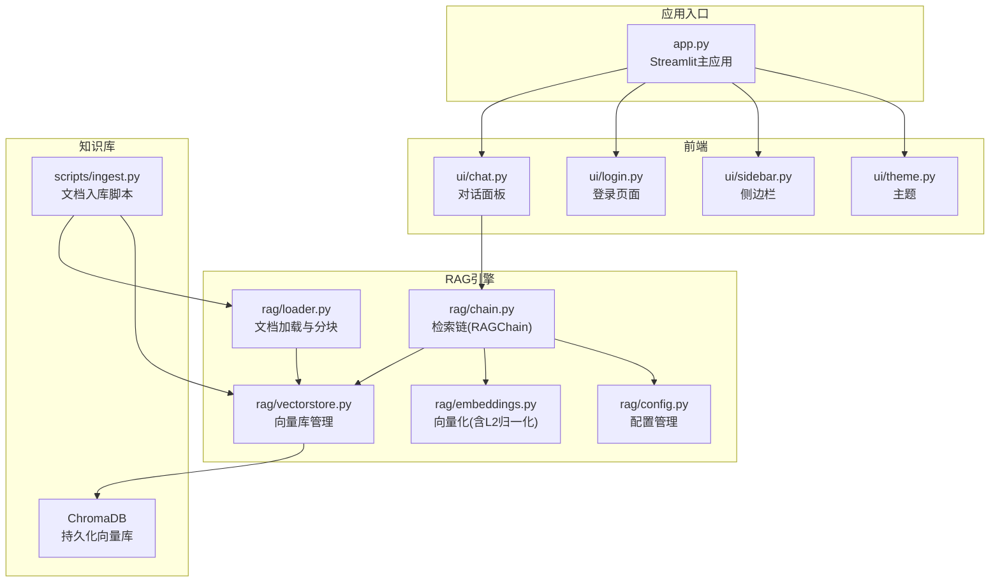
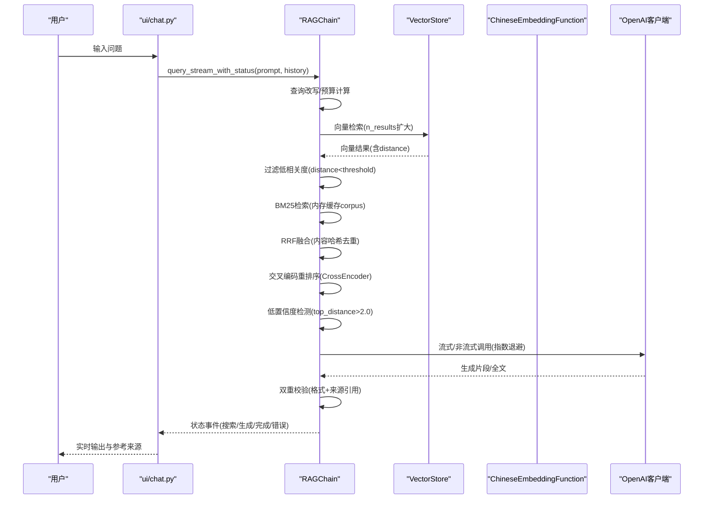
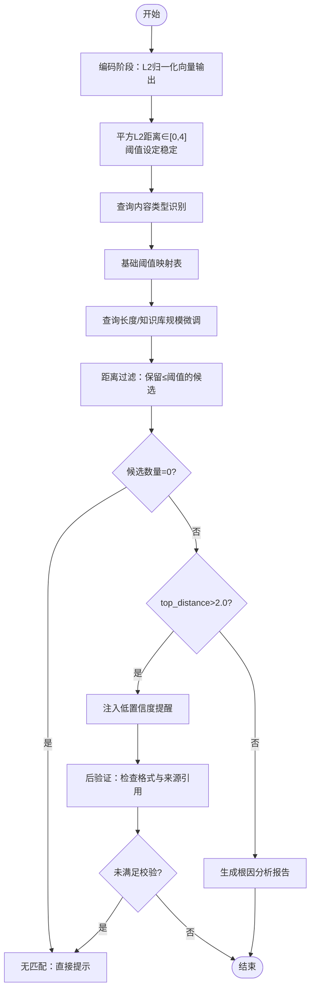
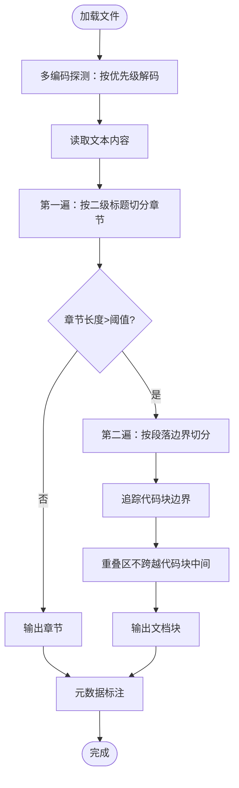
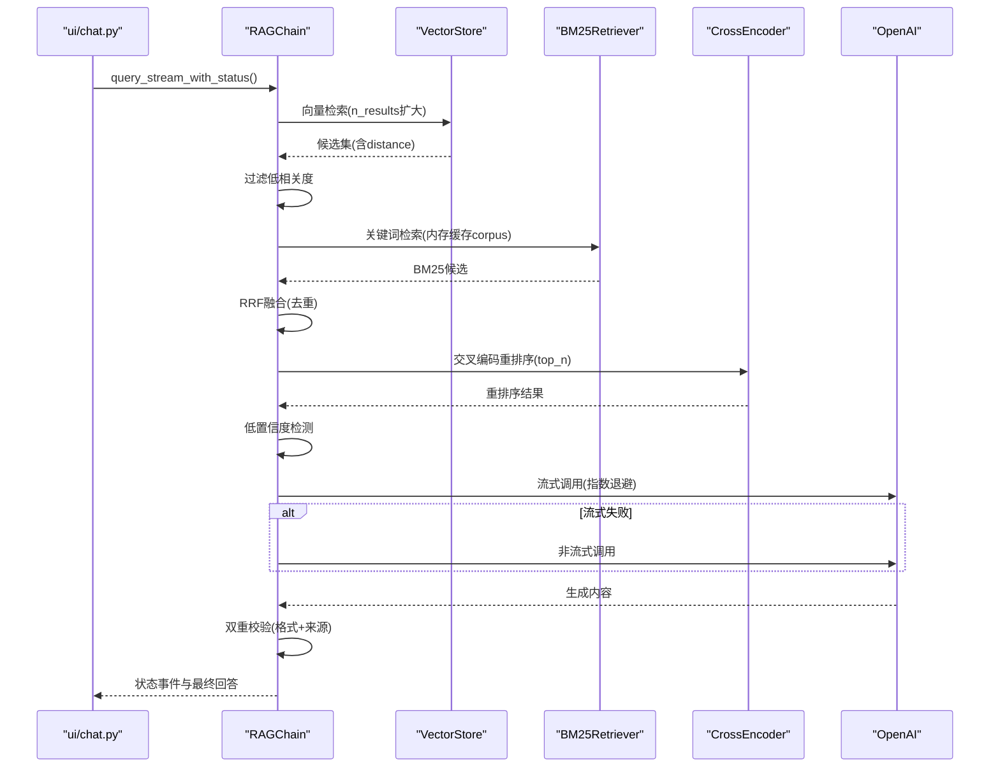
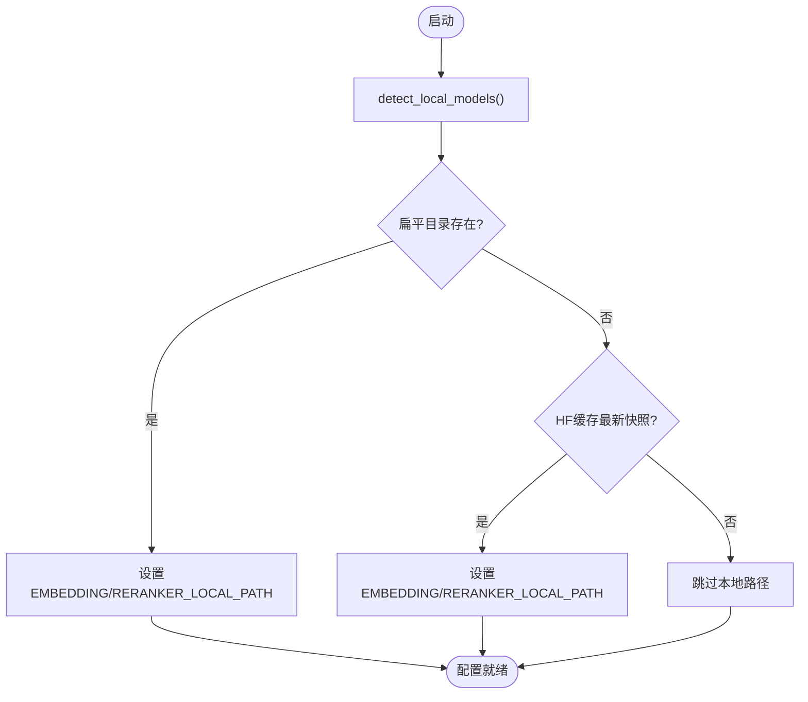
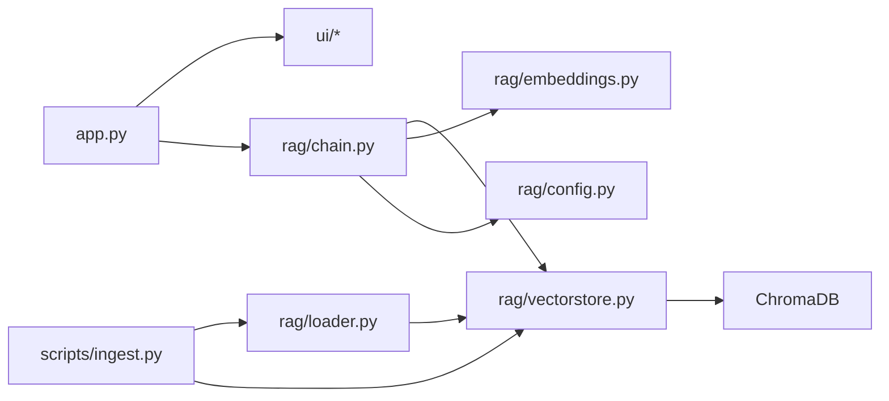

# 专利文档集

<cite>
**本文引用的文件**
- [README.md](file://README.md)
- [docs/patent_2_向量归一化与自适应阈值的日志检索方法_交底书.md](file://docs/patent_2_向量归一化与自适应阈值的日志检索方法_交底书.md)
- [docs/patent_4_源代码文档智能分块方法_交底书.md](file://docs/patent_4_源代码文档智能分块方法_交底书.md)
- [docs/专利申请书.md](file://docs/专利申请书.md)
- [config.yaml](file://config.yaml)
- [app.py](file://app.py)
- [rag/chain.py](file://rag/chain.py)
- [rag/loader.py](file://rag/loader.py)
- [rag/config.py](file://rag/config.py)
- [rag/vectorstore.py](file://rag/vectorstore.py)
- [rag/embeddings.py](file://rag/embeddings.py)
- [scripts/ingest.py](file://scripts/ingest.py)
- [ui/chat.py](file://ui/chat.py)
</cite>

## 目录
1. [简介](#简介)
2. [项目结构](#项目结构)
3. [核心组件](#核心组件)
4. [架构总览](#架构总览)
5. [详细组件分析](#详细组件分析)
6. [依赖关系分析](#依赖关系分析)
7. [性能考量](#性能考量)
8. [故障排查指南](#故障排查指南)
9. [结论](#结论)
10. [附录](#附录)

## 简介
本专利文档集围绕“面向日志检索与源代码文档的知识库智能问答系统”展开，涵盖两项核心技术交底书与配套的专利申请书。系统基于企业级 RAG（检索增强生成）架构，结合向量检索、BM25 关键词检索、交叉编码重排序与可信生成机制，提供多级混合检索、低置信度检测与双重校验、源代码与混合格式文档的智能分块与多编码兼容读取等能力。本文档旨在系统化梳理项目架构、核心算法与实现细节，为专利撰写与技术评审提供全面支撑。

## 项目结构
项目采用模块化分层设计，前端通过 Streamlit 提供交互界面，后端以 Python 实现 RAG 检索链与知识库管理，底层依赖 ChromaDB 向量库与本地/远程模型加载机制。

图表来源
- [app.py:1-240](file://app.py#L1-L240)
- [ui/chat.py:1-223](file://ui/chat.py#L1-L223)
- [rag/chain.py:189-746](file://rag/chain.py#L189-L746)
- [rag/loader.py:151-283](file://rag/loader.py#L151-L283)
- [rag/vectorstore.py:32-217](file://rag/vectorstore.py#L32-L217)
- [rag/embeddings.py:48-88](file://rag/embeddings.py#L48-L88)
- [scripts/ingest.py:26-63](file://scripts/ingest.py#L26-L63)

章节来源
- [README.md:32-57](file://README.md#L32-L57)

## 核心组件
- 检索链（RAGChain）：实现三级混合检索（向量检索扩大候选集 + BM25 关键词检索补位 + RRF 融合），支持查询改写、交叉编码重排序、上下文预算与低置信度检测、流式/非流式 LLM 调用与指数退避重试、可信度双重校验。
- 文档加载与分块（Loader）：支持 Markdown、纯文本、PDF、C/C++ 源码等格式；两遍分块算法保护代码块完整性；多编码自动探测（UTF-8、GBK、GB2312、GB18030、Latin-1）。
- 向量库管理（VectorStore）：ChromaDB 持久化客户端封装，提供集合管理、文档增删改查、统计信息查询与全局单例缓存。
- 向量化（ChineseEmbeddingFunction）：SentenceTransformer 中文模型封装，输出经 L2 归一化的向量，平方 L2 距离 ∈ [0,4]，便于阈值设定。
- 配置管理（Config）：Pydantic 验证配置，支持环境变量替换与本地模型检测（扁平目录/HF 缓存）。
- 应用入口（app.py）：Streamlit 入口，初始化日志、预加载检索链、渲染界面与路由。
- 文档入库脚本（scripts/ingest.py）：扫描知识库目录，分块、向量化并入库。

章节来源
- [rag/chain.py:189-746](file://rag/chain.py#L189-L746)
- [rag/loader.py:151-283](file://rag/loader.py#L151-L283)
- [rag/vectorstore.py:32-217](file://rag/vectorstore.py#L32-L217)
- [rag/embeddings.py:48-88](file://rag/embeddings.py#L48-L88)
- [rag/config.py:48-248](file://rag/config.py#L48-L248)
- [app.py:71-240](file://app.py#L71-L240)
- [scripts/ingest.py:26-63](file://scripts/ingest.py#L26-L63)

## 架构总览
系统采用“前端界面 + 检索链 + 向量库 + 模型加载”的分层架构。检索链负责混合检索与重排序，向量库提供持久化存储，配置模块负责模型路径检测与环境变量解析，前端通过 Streamlit 提供对话与仪表盘。

图表来源
- [ui/chat.py:111-203](file://ui/chat.py#L111-L203)
- [rag/chain.py:502-707](file://rag/chain.py#L502-L707)
- [rag/vectorstore.py:132-150](file://rag/vectorstore.py#L132-L150)
- [rag/embeddings.py:77-87](file://rag/embeddings.py#L77-L87)

## 详细组件分析

### 组件A：向量归一化与自适应阈值过滤（专利二）
- 核心思想：在编码阶段对向量执行 L2 归一化，使平方 L2 距离落入 [0,4] 区间；基于查询内容类型与特征动态计算阈值；多层级置信度评估（空结果判定、低置信度检测、高置信度生成、后验证）。
- 关键实现：
  - 向量归一化：ChineseEmbeddingFunction 输出已 L2 归一化向量，平方 L2 距离范围 [0,4]。
  - 阈值映射：配置文件中 distance_threshold 默认 1.5（对应余弦相似度≈0.25），结合查询类型与长度、知识库规模进行微调。
  - 置信度评估：RAGChain._build_context 中 top_distance > 2.0 视为低置信度；query_stream_with_status 中对无匹配与低置信度分别注入提示与拒绝回答。
  - 后验证：若回答未以“知识库回答/拒绝回答”开头且未引用来源，替换为“知识库中暂无匹配内容”。

图表来源
- [docs/patent_2_向量归一化与自适应阈值的日志检索方法_交底书.md:51-113](file://docs/patent_2_向量归一化与自适应阈值的日志检索方法_交底书.md#L51-L113)
- [rag/embeddings.py:77-87](file://rag/embeddings.py#L77-L87)
- [config.yaml:42-44](file://config.yaml#L42-L44)
- [rag/chain.py:563-620](file://rag/chain.py#L563-L620)

章节来源
- [docs/patent_2_向量归一化与自适应阈值的日志检索方法_交底书.md:194-222](file://docs/patent_2_向量归一化与自适应阈值的日志检索方法_交底书.md#L194-L222)
- [rag/chain.py:563-620](file://rag/chain.py#L563-L620)
- [rag/embeddings.py:77-87](file://rag/embeddings.py#L77-L87)

### 组件B：源代码文档智能分块与多编码读取（专利四）
- 核心思想：两遍分块算法在标题与段落边界处追踪代码块边界，确保代码片段不被截断；多编码探测按优先级链自动识别中文 Windows 源码编码，兜底 Latin-1 保证流程健壮。
- 关键实现：
  - 两遍分块：按二级标题切分章节，再按段落边界精细切分；在代码块内部不切分，重叠区域不跨越代码块中间。
  - 编码探测：优先级链 UTF-8 → GBK → GB2312 → GB18030 → Latin-1；最终兜底 UTF-8 + errors=replace。
  - 元数据：记录来源文件路径、标题、块序号、文件类型，便于溯源与统计。

图表来源
- [docs/patent_4_源代码文档智能分块方法_交底书.md:45-71](file://docs/patent_4_源代码文档智能分块方法_交底书.md#L45-L71)
- [rag/loader.py:33-93](file://rag/loader.py#L33-L93)
- [rag/loader.py:129-139](file://rag/loader.py#L129-L139)

章节来源
- [docs/patent_4_源代码文档智能分块方法_交底书.md:135-191](file://docs/patent_4_源代码文档智能分块方法_交底书.md#L135-L191)
- [rag/loader.py:33-93](file://rag/loader.py#L33-L93)
- [rag/loader.py:129-139](file://rag/loader.py#L129-L139)

### 组件C：三级混合检索与可信生成（专利申请书）
- 核心思想：三级递进式混合检索（向量扩大候选集 + BM25 关键词补位 + RRF 融合），Cross-Encoder 精排，Prompt 约束 + 后处理双重校验，流式/非流式降级与指数退避重试。
- 关键实现：
  - 混合检索：向量检索扩大 n_results×3，BM25 使用内存缓存 corpus，RRF 去重融合，不足时 BM25 补位。
  - Reranker：类级别缓存模型，top_n 控制计算量，失败时熔断标记避免反复超时。
  - 可信度校验：严格要求“知识库回答/拒绝回答”开头；若未满足，检查回答中是否包含来源文件名或常见引用模式，否则替换为拒绝回答。
  - LLM 调用：优先流式，失败自动降级为非流式；最多 3 次指数退避重试；空响应检测触发重试。

图表来源
- [docs/专利申请书.md:21-54](file://docs/专利申请书.md#L21-L54)
- [rag/chain.py:277-350](file://rag/chain.py#L277-L350)
- [rag/chain.py:351-409](file://rag/chain.py#L351-L409)
- [rag/chain.py:502-707](file://rag/chain.py#L502-L707)

章节来源
- [docs/专利申请书.md:9-110](file://docs/专利申请书.md#L9-L110)
- [rag/chain.py:277-409](file://rag/chain.py#L277-L409)
- [rag/chain.py:502-707](file://rag/chain.py#L502-L707)

### 组件D：模型自适应检测与熔断（专利申请书）
- 核心思想：自动检测本地模型布局（扁平目录/HF 缓存），设置环境变量启用 local_files_only；类级别缓存与熔断标记避免远程加载失败导致的反复超时。
- 关键实现：
  - 本地模型检测：优先扁平目录，其次 HF 缓存最新快照，校验 config.json 与权重文件存在性。
  - 熔断机制：远程加载失败标记 _reranker_load_failed，后续查询跳过加载；模型名变更时自动清除熔断标记。

图表来源
- [docs/专利申请书.md:212-266](file://docs/专利申请书.md#L212-L266)
- [rag/config.py:48-113](file://rag/config.py#L48-L113)
- [rag/chain.py:371-409](file://rag/chain.py#L371-L409)

章节来源
- [docs/专利申请书.md:212-266](file://docs/专利申请书.md#L212-L266)
- [rag/config.py:48-113](file://rag/config.py#L48-L113)
- [rag/chain.py:371-409](file://rag/chain.py#L371-L409)

## 依赖关系分析
- 模块耦合与内聚：
  - RAGChain 与 VectorStore、Embeddings、Config 高内聚，负责检索、重排序与生成的完整链路。
  - Loader 与 VectorStore 解耦，通过 DocumentChunk 数据结构传递，便于独立演进。
  - app.py 仅负责界面与预加载，不直接参与检索逻辑，职责清晰。
- 外部依赖：
  - ChromaDB：持久化向量库，支持集合管理与查询。
  - sentence-transformers：中文嵌入模型，支持本地/远程加载与 L2 归一化。
  - OpenAI SDK：调用 LLM，支持流式与非流式，配合指数退避与降级。
  - jieba：中文分词，用于自研 BM25 引擎。
- 潜在环依赖：
  - 通过模块导入与延迟初始化避免环依赖，全局单例缓存 VectorStore 与 Reranker 模型，减少重复加载。

图表来源
- [app.py:71-240](file://app.py#L71-L240)
- [rag/chain.py:189-746](file://rag/chain.py#L189-L746)
- [rag/loader.py:151-283](file://rag/loader.py#L151-L283)
- [rag/vectorstore.py:32-217](file://rag/vectorstore.py#L32-L217)
- [scripts/ingest.py:26-63](file://scripts/ingest.py#L26-L63)

章节来源
- [README.md:32-57](file://README.md#L32-L57)

## 性能考量
- 检索性能：
  - 向量检索扩大候选集（n_results×3）提高融合机会，BM25 使用内存缓存 corpus 避免重复加载。
  - RRF 融合与内容哈希去重减少重复文档计分，提升排序稳定性。
- 重排序性能：
  - Cross-Encoder 仅对前 top_n 候选进行精排，控制计算开销；类级别缓存避免重复加载。
  - 熔断机制在远程加载失败后跳过重试，避免每次查询超时。
- 生成性能：
  - 优先流式输出，失败自动降级为非流式；指数退避重试避免触发限流。
  - 上下文预算与 token 估算，避免超出 LLM 上下文窗口。
- 存储与加载：
  - VectorStore 全局单例缓存，embedding 模型仅加载一次；向量库持久化，避免重复入库。
  - 模型路径检测幂等，已有环境变量不覆盖，确保启动一致性。

## 故障排查指南
- 检索无结果：
  - 检查 distance_threshold 配置与查询类型；确认知识库已入库且文档块有效。
  - 观察 query_stream_with_status 的“无匹配”分支，必要时启用 BM25 兜底。
- 低置信度回答：
  - 检查 top_distance 是否接近 2.0；可在配置中调整阈值或增加查询上下文。
  - 关注后验证逻辑，若回答未引用来源将被替换为拒绝回答。
- LLM 调用失败：
  - 查看流式/非流式重试日志；检查 API 配置与网络连通性。
  - 指数退避期间避免频繁重试，等待超时恢复。
- 模型加载失败：
  - 检查 detect_local_models 是否正确设置 EMBEDDING_LOCAL_PATH/RERANKER_LOCAL_PATH。
  - 确认模型目录包含 config.json 与权重文件；远程加载失败将触发熔断标记。
- 文档入库异常：
  - 检查 scripts/ingest.py 的日志输出，确认文档目录与分块参数设置。
  - PDF 解析依赖 pymupdf/fitz，缺失时按提示安装。

章节来源
- [rag/chain.py:545-601](file://rag/chain.py#L545-L601)
- [rag/chain.py:633-707](file://rag/chain.py#L633-L707)
- [rag/config.py:48-113](file://rag/config.py#L48-L113)
- [scripts/ingest.py:26-63](file://scripts/ingest.py#L26-L63)

## 结论
本专利文档集系统化呈现了面向日志检索与源代码文档的知识库智能问答系统，涵盖向量归一化与自适应阈值过滤、源代码文档智能分块与多编码读取、三级混合检索与可信生成、模型自适应检测与熔断等关键技术。通过严格的阈值设定、代码块完整性保护、低置信度检测与双重校验机制，系统在准确性、鲁棒性与用户体验方面取得平衡，具备良好的工程落地价值与专利保护前景。

## 附录
- 关键代码位置索引（专利申请书附录）
  - 自研 BM25 检索引擎：[rag/chain.py::BM25Retriever:56-149](file://rag/chain.py#L56-L149)
  - RRF 融合算法：[rag/chain.py::reciprocal_rank_fusion:158-186](file://rag/chain.py#L158-L186)
  - 三级混合检索：[rag/chain.py::RAGChain._retrieve:277-349](file://rag/chain.py#L277-L349)
  - Cross-Encoder 重排序：[rag/chain.py::RAGChain._rerank:351-409](file://rag/chain.py#L351-L409)
  - 低置信度上下文提醒：[rag/chain.py::RAGChain._build_context:411-454](file://rag/chain.py#L411-L454)
  - 流式降级重试：[rag/chain.py::RAGChain._call_llm_stream:633-673](file://rag/chain.py#L633-L673)
  - 答案可信度校验：[rag/chain.py::RAGChain.query_stream_with_status:502-620](file://rag/chain.py#L502-L620)
  - 代码块保护分块：[rag/loader.py::load_documents/_split_by_headers:151-217](file://rag/loader.py#L151-L217)
  - 多编码探测：[rag/loader.py::load_documents/_read_text_file:129-139](file://rag/loader.py#L129-L139)
  - BM25 版本感知索引：[rag/chain.py::RAGChain._ensure_bm25_ready:224-249](file://rag/chain.py#L224-L249)
  - 模型自适应检测：[rag/config.py::detect_local_models:48-113](file://rag/config.py#L48-L113)
  - 熔断器机制：[rag/chain.py::RAGChain._rerank:379-406](file://rag/chain.py#L379-L406)