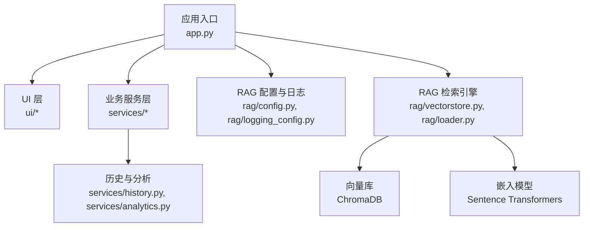
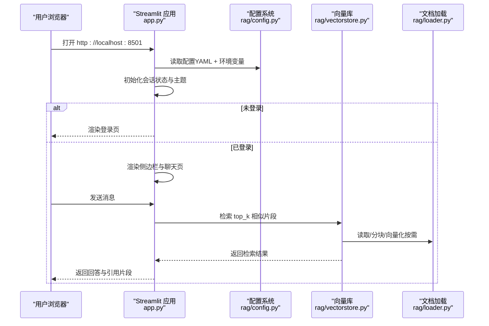
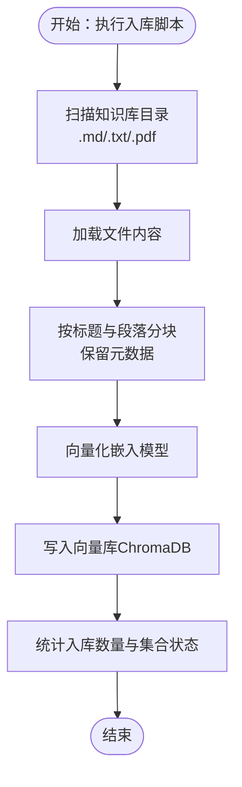
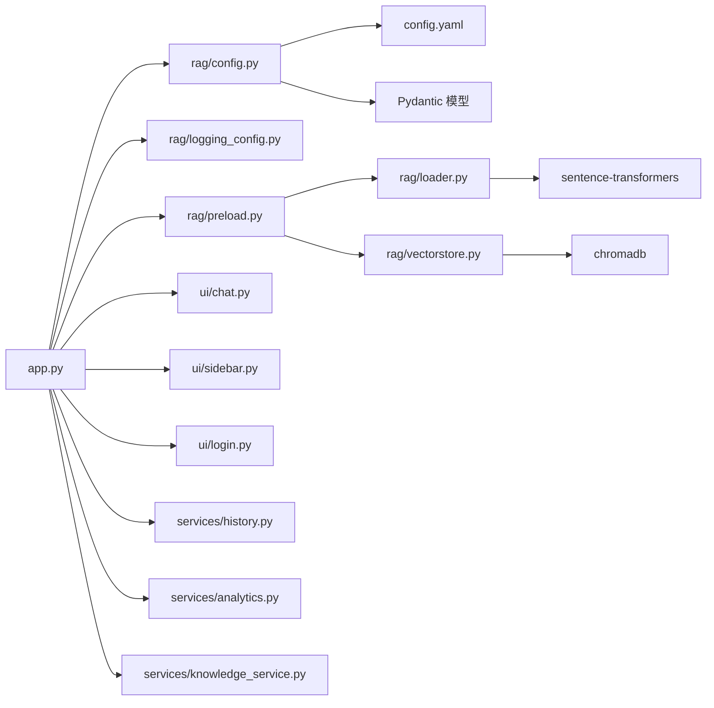

# 快速开始

<cite>
**本文引用的文件**
- [README.md](file://README.md)
- [app.py](file://app.py)
- [config.yaml](file://config.yaml)
- [Dockerfile](file://Dockerfile)
- [docker-compose.yml](file://docker-compose.yml)
- [requirements.txt](file://requirements.txt)
- [rag/config.py](file://rag/config.py)
- [rag/vectorstore.py](file://rag/vectorstore.py)
- [rag/loader.py](file://rag/loader.py)
- [scripts/ingest.py](file://scripts/ingest.py)
- [scripts/installer/windows/launch.bat](file://scripts/installer/windows/launch.bat)
- [scripts/installer/linux/launch.sh](file://scripts/installer/linux/launch.sh)
- [scripts/build_installer.py](file://scripts/build_installer.py)
- [services/knowledge_service.py](file://services/knowledge_service.py)
</cite>

## 目录
1. [简介](#简介)
2. [项目结构](#项目结构)
3. [核心组件](#核心组件)
4. [架构总览](#架构总览)
5. [详细组件解析](#详细组件解析)
6. [依赖关系分析](#依赖关系分析)
7. [性能与容量建议](#性能与容量建议)
8. [故障排查指南](#故障排查指南)
9. [结论](#结论)
10. [附录](#附录)

## 简介
本指南面向首次接触“知识管理系统”的用户，帮助你在最短时间内完成环境准备、依赖安装、配置与启动，并掌握三种部署方式：本地开发环境、Docker 容器化部署、以及生产环境部署。你将学会如何导入知识文档、启动应用、进行基本问答与仪表盘查看，并解决常见问题。

## 项目结构
该系统采用“前端界面（Streamlit）+ 业务服务（services）+ 检索增强（RAG）”三层架构，核心入口为应用主程序，配置由 YAML 提供，RAG 子系统负责文档加载、分块、向量化与检索。

图表来源
- [app.py:1-184](file://app.py#L1-L184)
- [rag/config.py:1-184](file://rag/config.py#L1-L184)
- [rag/vectorstore.py:1-209](file://rag/vectorstore.py#L1-L209)
- [rag/loader.py:1-259](file://rag/loader.py#L1-L259)

章节来源
- [README.md:1-3](file://README.md#L1-L3)
- [app.py:1-184](file://app.py#L1-L184)

## 核心组件
- 应用入口与页面渲染：负责初始化会话、主题、登录态、侧边栏与聊天页/仪表盘渲染。
- 配置系统：基于 Pydantic 的强类型配置，支持 YAML 加载与环境变量替换。
- RAG 引擎：文档加载与分块、向量库持久化与检索、嵌入模型封装。
- 业务服务：历史导出、统计分析、知识文件读取等。
- 启动与打包：本地启动脚本、Dockerfile 与 docker-compose、离线安装包构建工具。

章节来源
- [app.py:1-184](file://app.py#L1-L184)
- [rag/config.py:1-184](file://rag/config.py#L1-L184)
- [rag/vectorstore.py:1-209](file://rag/vectorstore.py#L1-L209)
- [rag/loader.py:1-259](file://rag/loader.py#L1-L259)
- [services/knowledge_service.py:1-46](file://services/knowledge_service.py#L1-L46)

## 架构总览
下图展示从浏览器访问到后端处理、RAG 检索与响应的端到端流程。

图表来源
- [app.py:54-100](file://app.py#L54-L100)
- [rag/config.py:117-150](file://rag/config.py#L117-L150)
- [rag/vectorstore.py:124-142](file://rag/vectorstore.py#L124-L142)
- [rag/loader.py:131-197](file://rag/loader.py#L131-L197)

## 详细组件解析

### 本地开发环境（Python 直接运行）
适用场景：开发者在本地调试、修改代码、热更新。

- 环境要求
  - Python 3.11（推荐使用虚拟环境隔离依赖）
  - 首次运行时若未配置离线模型，系统需网络访问以自动下载嵌入与重排序模型
- 依赖安装
  - 使用项目提供的依赖清单安装所需包
- 启动步骤
  - 准备知识库文档：将 .md/.txt/.pdf 文件放入知识库目录（默认 ./knowledge）
  - 首次启动会触发预加载：后台自动扫描知识库、分块、向量化并持久化至向量库
  - 通过本地脚本启动 Streamlit 应用，浏览器访问 http://localhost:8501
- 关键命令
  - 安装依赖：pip install -r requirements.txt
  - 启动应用：python -m streamlit run app.py
  - 导入知识库：python scripts/ingest.py

章节来源
- [requirements.txt:1-11](file://requirements.txt#L1-L11)
- [app.py:23-41](file://app.py#L23-L41)
- [scripts/ingest.py:25-58](file://scripts/ingest.py#L25-L58)
- [scripts/installer/windows/launch.bat:34-39](file://scripts/installer/windows/launch.bat#L34-L39)
- [scripts/installer/linux/launch.sh:20-25](file://scripts/installer/linux/launch.sh#L20-L25)

### Docker 容器化部署
适用场景：快速获得一致运行环境，便于测试与演示。

- 构建镜像
  - 使用仓库根目录下的 Dockerfile 构建镜像，通过 model_root 配置支持离线模型加载
- 启动容器
  - 映射知识库目录、向量库、聊天历史与日志目录，挂载只读配置文件
  - 暴露 8501 端口，健康检查通过 curl 访问 Streamlit 内部健康端点
- 关键命令
  - 构建镜像：docker build -t knowledge-assistant .
  - 启动容器：docker run -d --name knowledge-app -p 8501:8501 -v ./knowledge:/app/knowledge -v ./chroma_db:/app/chroma_db -v ./chat_history:/app/chat_history -v ./logs:/app/logs -v ./config.yaml:/app/config.yaml:ro knowledge-assistant
  - 或使用 docker-compose：docker compose up -d

章节来源
- [Dockerfile:1-68](file://Dockerfile#L1-L68)
- [docker-compose.yml:1-60](file://docker-compose.yml#L1-L60)

### 生产环境部署（离线安装包）
适用场景：在无外网或受限网络环境中部署，提供 Windows/Linux 一键安装包。

- 构建安装包
  - 在有网络的机器上运行构建脚本，自动下载 Python 运行时、wheel 包、嵌入模型等资源
  - 输出 Windows 可执行安装包与 Linux DEB 包
- 安装与启动
  - Windows：双击安装包，安装完成后通过桌面快捷方式或命令行启动
  - Linux：使用 dpkg 安装 DEB 包，通过 systemd 或服务脚本启动
- 关键命令
  - 构建安装包：python scripts/build_installer.py --platform both
  - 启动应用（Windows）：scripts/installer/windows/launch.bat
  - 启动应用（Linux）：scripts/installer/linux/launch.sh

章节来源
- [scripts/build_installer.py:1-260](file://scripts/build_installer.py#L1-L260)
- [scripts/installer/windows/launch.bat:1-42](file://scripts/installer/windows/launch.bat#L1-L42)
- [scripts/installer/linux/launch.sh:1-26](file://scripts/installer/linux/launch.sh#L1-L26)

### 配置文件与参数说明
- 配置来源与优先级
  - 默认从 config.yaml 加载；可通过环境变量覆盖（支持 ${VAR} 与 ${VAR:-默认值} 语法）
- 主要配置项
  - LLM：推理 API 基础地址、API Key、模型名、温度、最大输出长度、上下文窗口
  - Embedding：嵌入模型名与本地模型路径
  - VectorStore：向量库持久化目录、集合名、检索 top_k、距离阈值
  - Knowledge：知识库文档目录、分块大小、分块重叠
  - 速率限制：是否启用、每分钟最大请求数、输入长度上限
  - 多轮对话：最大轮次
  - 审计日志：是否启用
  - UI：标题、副标题、公司名、Logo 文本、默认主题
- 配置加载与校验
  - 使用 Pydantic 模型进行字段校验与默认值填充
  - 提供从 YAML 加载、环境变量替换、全局单例访问等便捷方法

章节来源
- [config.yaml:1-46](file://config.yaml#L1-L46)
- [rag/config.py:48-150](file://rag/config.py#L48-L150)

### 启动流程与预加载机制
- 登录与页面渲染
  - 未登录时渲染登录页；登录后渲染侧边栏与聊天页
- 预加载与链路初始化
  - 启动时异步触发预加载，后台完成知识库扫描、分块、向量化与持久化
  - 成功后将检索链路注入会话状态，后续问答直接使用
- 仪表盘与导出
  - 管理员可查看全局统计；支持导出当前会话为 Markdown

章节来源
- [app.py:23-86](file://app.py#L23-L86)
- [app.py:102-180](file://app.py#L102-L180)

### 文档导入与检索流程
- 文档导入（入库）
  - 扫描知识库目录，支持 .md/.txt/.pdf；按标题与段落切分，保留元数据
  - 向量化后写入 ChromaDB，支持增量更新（同 ID 覆盖）
- 检索流程
  - 输入查询，按 top_k 与元数据过滤进行相似度检索
  - 返回片段内容、元数据与距离

图表来源
- [scripts/ingest.py:25-58](file://scripts/ingest.py#L25-L58)
- [rag/loader.py:131-197](file://rag/loader.py#L131-L197)
- [rag/vectorstore.py:89-112](file://rag/vectorstore.py#L89-L112)

章节来源
- [scripts/ingest.py:1-62](file://scripts/ingest.py#L1-L62)
- [rag/loader.py:1-259](file://rag/loader.py#L1-L259)
- [rag/vectorstore.py:1-209](file://rag/vectorstore.py#L1-L209)

## 依赖关系分析

图表来源
- [app.py:15-17](file://app.py#L15-L17)
- [rag/config.py:117-150](file://rag/config.py#L117-L150)
- [rag/vectorstore.py:12-15](file://rag/vectorstore.py#L12-L15)
- [rag/loader.py:12-13](file://rag/loader.py#L12-L13)

章节来源
- [app.py:1-184](file://app.py#L1-L184)
- [rag/config.py:1-184](file://rag/config.py#L1-L184)
- [rag/vectorstore.py:1-209](file://rag/vectorstore.py#L1-L209)
- [rag/loader.py:1-259](file://rag/loader.py#L1-L259)

## 性能与容量建议
- 向量库与检索
  - 合理设置 top_k 与距离阈值，平衡召回与速度
  - 分块大小与重叠应结合文档结构与查询粒度权衡
- 模型与硬件
  - 嵌入模型首次加载较慢，建议在预热阶段完成
  - 如需本地推理，可参考 docker-compose 中注释的 vLLM 服务配置
- 容器与持久化
  - 将 chroma_db、chat_history、logs、knowledge 目录映射到宿主机，确保重启后数据不丢失
- 网络与镜像
  - 使用离线本地模型可完全避免网络依赖，提升部署稳定性。

[本节为通用建议，无需特定文件引用]

## 故障排查指南
- 无法访问应用
  - 检查端口占用与防火墙；确认容器/进程已启动且健康
  - 查看健康检查输出与容器日志
- 无法加载模型或报错
  - 确认离线模型路径（model_root）正确配置；首次启动若缺少离线模型会自动下载
- 知识库导入失败
  - 检查知识库目录是否存在、文件格式是否受支持、磁盘空间是否充足
  - 查看导入日志输出，定位具体文件与错误原因
- 向量库异常
  - 清空并重建集合（谨慎操作），或检查集合名与持久化目录权限
- 登录与会话问题
  - 清除浏览器缓存或更换无痕模式；确认会话状态未被意外清理

章节来源
- [Dockerfile:57-67](file://Dockerfile#L57-L67)
- [scripts/ingest.py:35-41](file://scripts/ingest.py#L35-L41)
- [rag/vectorstore.py:171-179](file://rag/vectorstore.py#L171-L179)

## 结论
通过本指南，你可以选择适合的部署方式快速运行系统：本地开发环境适合调试与迭代，Docker 适合快速验证，离线安装包适合生产与受限网络环境。配合正确的配置与知识库导入流程，即可实现“即开即用”的知识问答体验。

[本节为总结性内容，无需特定文件引用]

## 附录

### 常用命令速查
- 安装依赖：pip install -r requirements.txt
- 启动应用（本地）：python -m streamlit run app.py
- 导入知识库：python scripts/ingest.py
- 构建镜像：docker build -t knowledge-assistant .
- 启动容器：docker run -d --name knowledge-app -p 8501:8501 -v ./knowledge:/app/knowledge -v ./chroma_db:/app/chroma_db -v ./chat_history:/app/chat_history -v ./logs:/app/logs -v ./config.yaml:/app/config.yaml:ro knowledge-assistant
- 使用 Compose：docker compose up -d
- 构建安装包：python scripts/build_installer.py --platform both

章节来源
- [requirements.txt:1-11](file://requirements.txt#L1-L11)
- [scripts/ingest.py:60-61](file://scripts/ingest.py#L60-L61)
- [Dockerfile:62-67](file://Dockerfile#L62-L67)
- [docker-compose.yml:13-14](file://docker-compose.yml#L13-L14)
- [scripts/build_installer.py:230-256](file://scripts/build_installer.py#L230-L256)