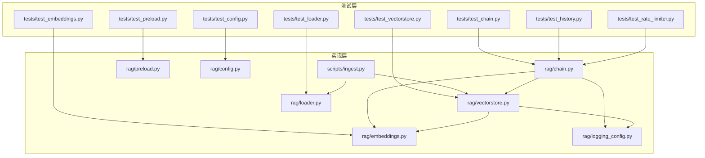
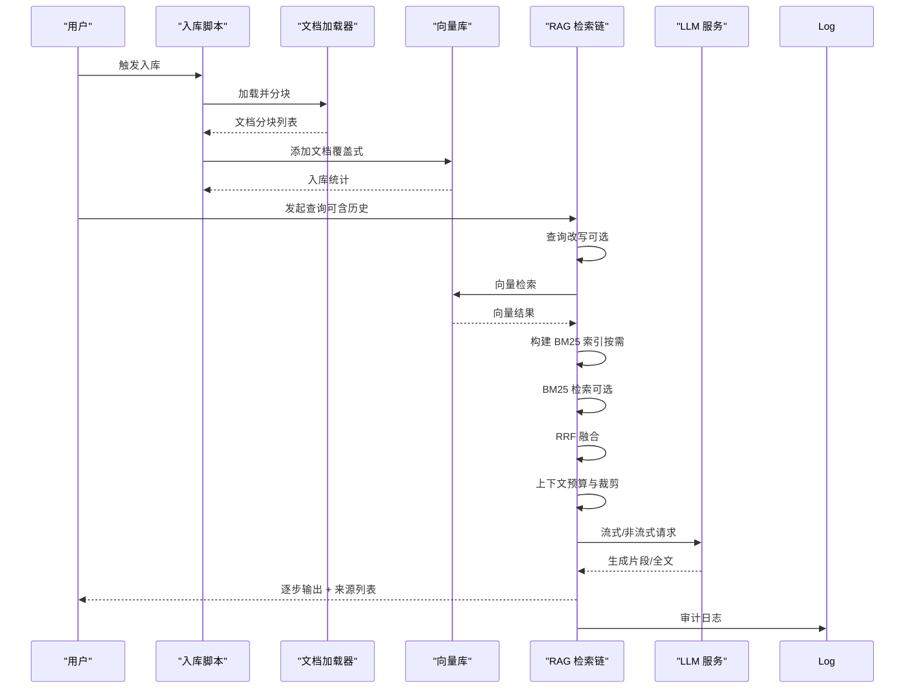
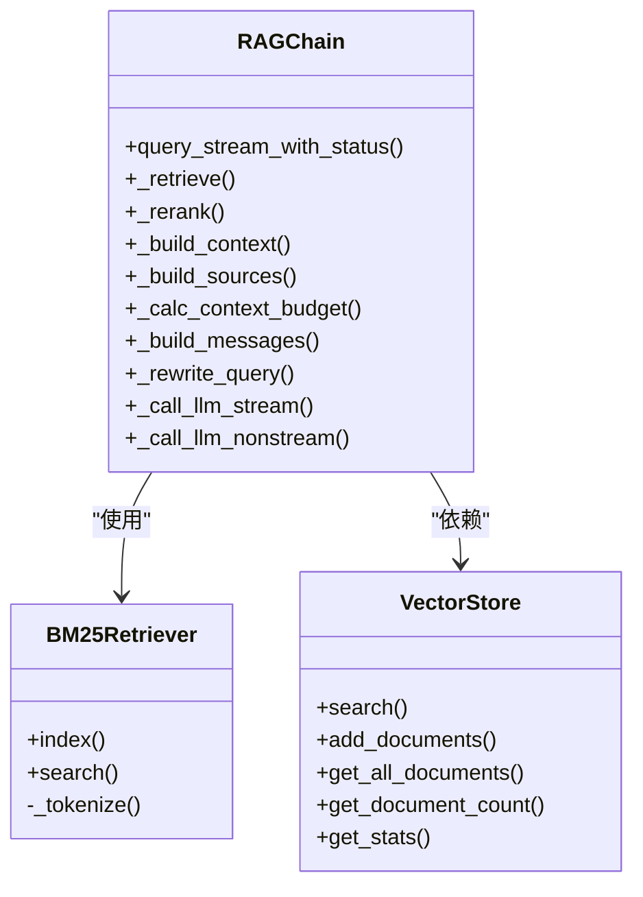
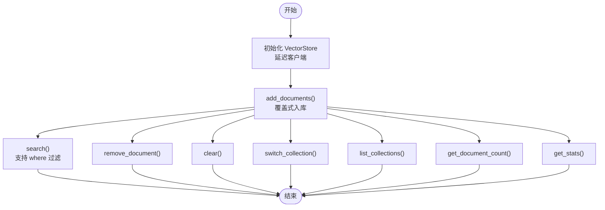
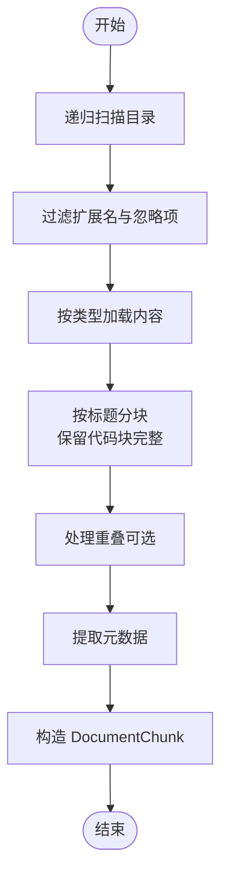
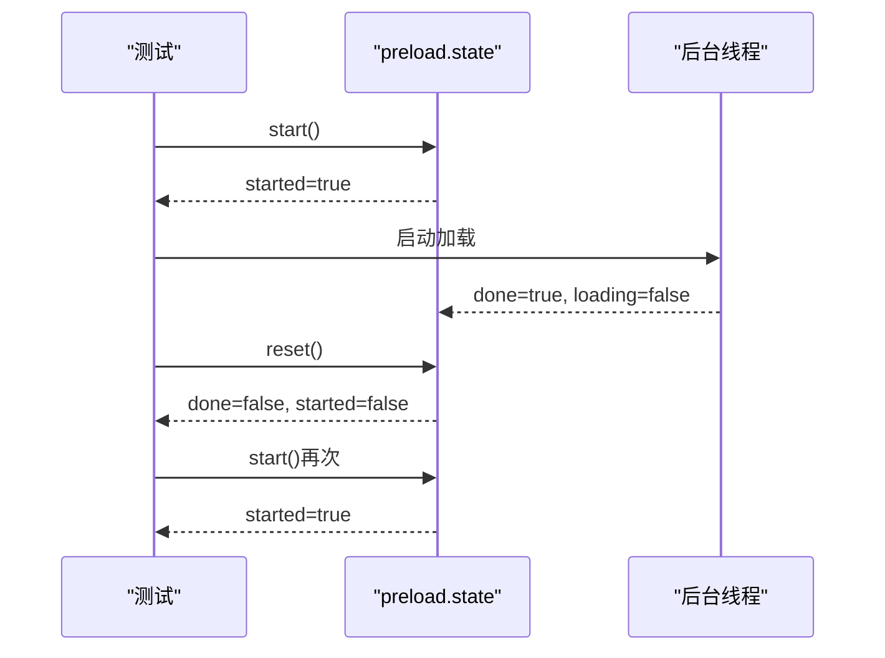
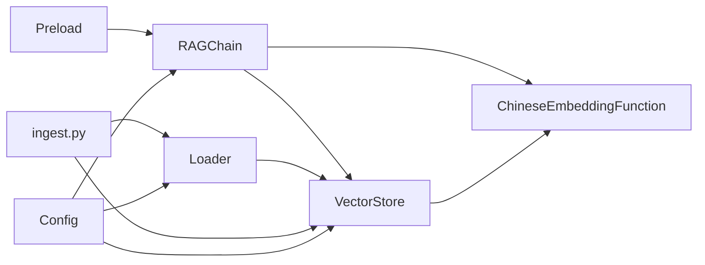

# 功能测试

<cite>
**本文引用的文件**
- [tests/test_chain.py](file://tests/test_chain.py)
- [rag/chain.py](file://rag/chain.py)
- [tests/test_vectorstore.py](file://tests/test_vectorstore.py)
- [rag/vectorstore.py](file://rag/vectorstore.py)
- [tests/test_loader.py](file://tests/test_loader.py)
- [rag/loader.py](file://rag/loader.py)
- [tests/test_preload.py](file://tests/test_preload.py)
- [rag/preload.py](file://rag/preload.py)
- [tests/test_embeddings.py](file://tests/test_embeddings.py)
- [rag/embeddings.py](file://rag/embeddings.py)
- [tests/test_config.py](file://tests/test_config.py)
- [rag/config.py](file://rag/config.py)
- [tests/test_history.py](file://tests/test_history.py)
- [tests/test_rate_limiter.py](file://tests/test_rate_limiter.py)
- [config.yaml](file://config.yaml)
- [scripts/ingest.py](file://scripts/ingest.py)
- [rag/logging_config.py](file://rag/logging_config.py)
</cite>

## 目录
1. [简介](#简介)
2. [项目结构](#项目结构)
3. [核心组件](#核心组件)
4. [架构总览](#架构总览)
5. [详细组件分析](#详细组件分析)
6. [依赖分析](#依赖分析)
7. [性能考虑](#性能考虑)
8. [故障排查指南](#故障排查指南)
9. [结论](#结论)
10. [附录](#附录)

## 简介
本文件面向功能测试，系统化梳理并设计 RAG 链路、向量数据库、文档加载器、预加载机制与错误处理的测试方案。重点覆盖：
- 检索链正确性验证（向量检索、BM25 关键词检索、RRF 融合、查询改写）
- 混合检索策略测试（向量 + BM25 + RRF）
- 向量数据库功能测试（文档存储、向量检索、元数据管理）
- 文档加载器功能测试（多格式支持、分块策略、元数据提取）
- 预加载机制与错误处理验证
- 功能测试用例设计原则与测试数据准备方法

## 项目结构
围绕功能测试，关键模块与测试文件分布如下：
- RAG 链路：rag/chain.py 与 tests/test_chain.py
- 向量库：rag/vectorstore.py 与 tests/test_vectorstore.py
- 文档加载器：rag/loader.py 与 tests/test_loader.py
- 预加载：rag/preload.py 与 tests/test_preload.py
- Embedding：rag/embeddings.py 与 tests/test_embeddings.py
- 配置：rag/config.py 与 tests/test_config.py，以及 config.yaml
- 历史与限流：tests/test_history.py、tests/test_rate_limiter.py
- 入库脚本：scripts/ingest.py
- 日志：rag/logging_config.py

图表来源
- [tests/test_chain.py:1-160](file://tests/test_chain.py#L1-L160)
- [rag/chain.py:1-590](file://rag/chain.py#L1-L590)
- [tests/test_vectorstore.py:1-146](file://tests/test_vectorstore.py#L1-L146)
- [rag/vectorstore.py:1-209](file://rag/vectorstore.py#L1-L209)
- [tests/test_loader.py:1-138](file://tests/test_loader.py#L1-L138)
- [rag/loader.py:1-259](file://rag/loader.py#L1-L259)
- [tests/test_preload.py:1-36](file://tests/test_preload.py#L1-L36)
- [rag/preload.py:1-73](file://rag/preload.py#L1-L73)
- [tests/test_embeddings.py:1-30](file://tests/test_embeddings.py#L1-L30)
- [rag/embeddings.py:1-48](file://rag/embeddings.py#L1-L48)
- [tests/test_config.py:1-117](file://tests/test_config.py#L1-L117)
- [rag/config.py:1-184](file://rag/config.py#L1-L184)
- [tests/test_history.py:1-98](file://tests/test_history.py#L1-L98)
- [tests/test_rate_limiter.py:1-57](file://tests/test_rate_limiter.py#L1-L57)
- [scripts/ingest.py:1-62](file://scripts/ingest.py#L1-L62)
- [rag/logging_config.py:1-129](file://rag/logging_config.py#L1-L129)

章节来源
- [tests/test_chain.py:1-160](file://tests/test_chain.py#L1-L160)
- [rag/chain.py:1-590](file://rag/chain.py#L1-L590)
- [tests/test_vectorstore.py:1-146](file://tests/test_vectorstore.py#L1-L146)
- [rag/vectorstore.py:1-209](file://rag/vectorstore.py#L1-L209)
- [tests/test_loader.py:1-138](file://tests/test_loader.py#L1-L138)
- [rag/loader.py:1-259](file://rag/loader.py#L1-L259)
- [tests/test_preload.py:1-36](file://tests/test_preload.py#L1-L36)
- [rag/preload.py:1-73](file://rag/preload.py#L1-L73)
- [tests/test_embeddings.py:1-30](file://tests/test_embeddings.py#L1-L30)
- [rag/embeddings.py:1-48](file://rag/embeddings.py#L1-L48)
- [tests/test_config.py:1-117](file://tests/test_config.py#L1-L117)
- [rag/config.py:1-184](file://rag/config.py#L1-L184)
- [tests/test_history.py:1-98](file://tests/test_history.py#L1-L98)
- [tests/test_rate_limiter.py:1-57](file://tests/test_rate_limiter.py#L1-L57)
- [scripts/ingest.py:1-62](file://scripts/ingest.py#L1-L62)
- [rag/logging_config.py:1-129](file://rag/logging_config.py#L1-L129)

## 核心组件
- RAG 检索链：支持混合检索（向量 + BM25 + RRF）、查询改写、上下文预算与裁剪、消息构建、流式/非流式 LLM 调用与重试、审计日志。
- 向量库：ChromaDB 持久化、集合管理、文档增删改查、统计信息、全局单例缓存。
- 文档加载器：多格式支持（.md/.txt/.pdf）、按标题分块、保留代码块完整性、元数据提取与文件清单。
- 预加载：后台线程加载 RAGChain，状态持久化，避免 Streamlit rerun 导致的重置。
- 配置：Pydantic 校验、环境变量替换、全局单例。

章节来源
- [rag/chain.py:160-590](file://rag/chain.py#L160-L590)
- [rag/vectorstore.py:24-209](file://rag/vectorstore.py#L24-L209)
- [rag/loader.py:18-259](file://rag/loader.py#L18-L259)
- [rag/preload.py:12-73](file://rag/preload.py#L12-L73)
- [rag/config.py:48-184](file://rag/config.py#L48-L184)

## 架构总览
下图展示功能测试关注的端到端流程：文档入库 → 向量检索 → 混合检索与重排 → 上下文构建 → LLM 生成 → 审计日志。

图表来源
- [scripts/ingest.py:25-62](file://scripts/ingest.py#L25-L62)
- [rag/loader.py:131-197](file://rag/loader.py#L131-L197)
- [rag/vectorstore.py:89-112](file://rag/vectorstore.py#L89-L112)
- [rag/chain.py:236-507](file://rag/chain.py#L236-L507)
- [rag/logging_config.py:86-129](file://rag/logging_config.py#L86-L129)

## 详细组件分析

### 检索链功能测试（RAGChain）
目标：
- 验证向量检索、BM25 检索、RRF 融合的正确性与稳定性
- 验证查询改写在多轮对话中的行为
- 验证上下文预算计算、裁剪与来源提取
- 验证流式/非流式 LLM 调用与错误回退

建议测试用例设计原则：
- 输入覆盖：空结果、部分匹配、完全匹配、无相关结果
- 行为覆盖：混合检索开关、BM25 索引复用、Reranker 可用性
- 边界覆盖：极短/极长查询、历史长度、上下文窗口边界
- 错误覆盖：检索异常、LLM 流式失败、非流式失败

图表来源
- [rag/chain.py:39-120](file://rag/chain.py#L39-L120)
- [rag/chain.py:160-590](file://rag/chain.py#L160-L590)
- [rag/vectorstore.py:124-147](file://rag/vectorstore.py#L124-L147)

章节来源
- [tests/test_chain.py:15-160](file://tests/test_chain.py#L15-L160)
- [rag/chain.py:160-590](file://rag/chain.py#L160-L590)

### 向量数据库功能测试（VectorStore）
目标：
- 验证目录延迟初始化、集合创建与切换
- 验证文档入库（覆盖式）、去重、统计信息
- 验证检索（含元数据过滤）、删除、清空
- 验证全局单例缓存与配置键一致性

建议测试用例设计原则：
- 独立性：临时目录隔离，避免污染
- 幂等性：重复入库应覆盖而非重复
- 一致性：统计信息与实际数据一致
- 过滤性：元数据过滤字段生效

图表来源
- [tests/test_vectorstore.py:13-146](file://tests/test_vectorstore.py#L13-L146)
- [rag/vectorstore.py:24-209](file://rag/vectorstore.py#L24-L209)

章节来源
- [tests/test_vectorstore.py:13-146](file://tests/test_vectorstore.py#L13-L146)
- [rag/vectorstore.py:24-209](file://rag/vectorstore.py#L24-L209)

### 文档加载器功能测试（Loader）
目标：
- 验证多格式支持（.md/.txt/.pdf）
- 验证分块策略（按标题、段落、代码块完整性、重叠）
- 验证元数据提取（标题、来源、索引、类型）

建议测试用例设计原则：
- 结构覆盖：无标题、多标题、代码块、超长段落
- 边界覆盖：空文件、极小/极大 chunk_size、overlap 边界
- 元数据覆盖：缺失标题时回退文件名、chunk_index 连续性

图表来源
- [tests/test_loader.py:16-138](file://tests/test_loader.py#L16-L138)
- [rag/loader.py:29-197](file://rag/loader.py#L29-L197)

章节来源
- [tests/test_loader.py:16-138](file://tests/test_loader.py#L16-L138)
- [rag/loader.py:18-259](file://rag/loader.py#L18-L259)

### 预加载机制与错误处理测试（Preload）
目标：
- 验证后台线程加载幂等性与状态持久化
- 验证多次 rerun 场景下状态不被重置
- 验证错误捕获与恢复

建议测试用例设计原则：
- 幂等性：重复 start() 不重复启动
- 生命周期：loading/done/error 状态流转
- 重置：reset() 后可再次启动

图表来源
- [tests/test_preload.py:10-36](file://tests/test_preload.py#L10-L36)
- [rag/preload.py:22-73](file://rag/preload.py#L22-L73)

章节来源
- [tests/test_preload.py:1-36](file://tests/test_preload.py#L1-L36)
- [rag/preload.py:1-73](file://rag/preload.py#L1-L73)

### 配置与环境变量替换测试
目标：
- 验证环境变量替换（存在/默认/缺失）
- 验证 Pydantic 模型校验（范围、依赖约束）
- 验证从 YAML 加载与全局单例

建议测试用例设计原则：
- 替换覆盖：简单替换、默认值、保留原样
- 校验覆盖：越界、非法组合
- 单例覆盖：重复加载一致性

章节来源
- [tests/test_config.py:21-117](file://tests/test_config.py#L21-L117)
- [rag/config.py:17-184](file://rag/config.py#L17-L184)
- [config.yaml:1-46](file://config.yaml#L1-L46)

### Embedding 函数测试
目标：
- 验证模型名称与本地路径解析
- 验证延迟加载与接口签名

建议测试用例设计原则：
- 初始化覆盖：默认在线模型、本地路径
- 延迟加载：首次调用才实例化模型

章节来源
- [tests/test_embeddings.py:8-30](file://tests/test_embeddings.py#L8-L30)
- [rag/embeddings.py:19-48](file://rag/embeddings.py#L19-L48)

### 历史与限流功能测试
目标：
- 验证会话创建、切换、消息保存与导出
- 验证速率限制（配额、清理）

建议测试用例设计原则：
- 会话隔离：不同用户互不影响
- 导出格式：Markdown/JSON 结构正确
- 限流边界：配额用尽与清理

章节来源
- [tests/test_history.py:10-98](file://tests/test_history.py#L10-L98)
- [tests/test_rate_limiter.py:10-57](file://tests/test_rate_limiter.py#L10-L57)

## 依赖分析
- RAGChain 依赖 VectorStore 与 EmbeddingFunction；VectorStore 依赖 ChromaDB 与 EmbeddingFunction；Loader 依赖 PDF 解析库（可选）；Preload 依赖后台线程；Config 提供全局单例；Ingest 脚本串联 Loader 与 VectorStore。

图表来源
- [rag/chain.py:14-18](file://rag/chain.py#L14-L18)
- [rag/vectorstore.py:12-16](file://rag/vectorstore.py#L12-L16)
- [rag/loader.py:12-13](file://rag/loader.py#L12-L13)
- [scripts/ingest.py:17-20](file://scripts/ingest.py#L17-L20)
- [rag/preload.py:37-39](file://rag/preload.py#L37-L39)
- [rag/config.py:138-150](file://rag/config.py#L138-L150)

章节来源
- [rag/chain.py:14-18](file://rag/chain.py#L14-L18)
- [rag/vectorstore.py:12-16](file://rag/vectorstore.py#L12-L16)
- [rag/loader.py:12-13](file://rag/loader.py#L12-L13)
- [scripts/ingest.py:17-20](file://scripts/ingest.py#L17-L20)
- [rag/preload.py:37-39](file://rag/preload.py#L37-L39)
- [rag/config.py:138-150](file://rag/config.py#L138-L150)

## 性能考虑
- 向量检索与 BM25 检索的组合与阈值过滤可显著影响召回质量与速度，建议在测试中覆盖不同 top_k 与距离阈值场景。
- Reranker 模型类级别缓存避免重复加载，测试中应验证缓存命中与模型切换。
- 流式 LLM 调用具备指数退避重试，测试应覆盖失败与降级路径。
- 预加载后台线程避免 UI 卡顿，测试应验证状态流转与幂等性。

## 故障排查指南
- 审计日志：通过审计日志定位查询耗时、结果数、错误详情，便于回归与监控。
- 日志系统：统一控制台与文件输出，便于快速定位问题。
- 配置校验：Pydantic 校验失败时检查字段范围与依赖约束。
- PDF 加载：缺少依赖时抛出 ImportError，需安装 pymupdf。

章节来源
- [rag/logging_config.py:86-129](file://rag/logging_config.py#L86-L129)
- [rag/config.py:78-83](file://rag/config.py#L78-L83)
- [rag/loader.py:101-118](file://rag/loader.py#L101-L118)

## 结论
本文针对 RAG 链路、向量数据库、文档加载器、预加载机制与配置/日志/历史/限流等模块，给出了系统化的功能测试设计与实施要点。通过覆盖正确性、混合检索策略、查询改写、向量检索准确性、元数据管理、多格式支持、分块策略、预加载状态持久化与错误处理，可有效保障系统在真实场景下的稳定性与可靠性。

## 附录

### 功能测试用例设计原则
- 输入覆盖：空输入、边界输入、异常输入
- 行为覆盖：开关控制（混合检索、Reranker、查询改写）、历史注入
- 输出覆盖：结果顺序、来源去重、上下文裁剪、审计日志
- 性能覆盖：吞吐、延迟、缓存命中率
- 错误覆盖：异常捕获、降级策略、重试机制

### 测试数据准备方法
- 文档目录：准备多格式样本（.md/.txt/.pdf），包含代码块、长段落、无标题等场景
- 向量库：使用临时目录，避免污染；准备重复来源以验证覆盖
- 配置：提供 config.yaml 示例，必要时通过环境变量注入敏感字段
- 历史与限流：使用临时目录与内存状态，确保测试隔离

章节来源
- [config.yaml:1-46](file://config.yaml#L1-L46)
- [scripts/ingest.py:25-62](file://scripts/ingest.py#L25-L62)
- [tests/test_vectorstore.py:16-22](file://tests/test_vectorstore.py#L16-L22)
- [tests/test_loader.py:87-121](file://tests/test_loader.py#L87-L121)
- [tests/test_preload.py:10-31](file://tests/test_preload.py#L10-L31)