# 单元测试框架

<cite>
**本文档引用的文件**
- [tests/__init__.py](file://tests/__init__.py)
- [tests/test_chain.py](file://tests/test_chain.py)
- [tests/test_config.py](file://tests/test_config.py)
- [tests/test_embeddings.py](file://tests/test_embeddings.py)
- [tests/test_history.py](file://tests/test_history.py)
- [tests/test_loader.py](file://tests/test_loader.py)
- [tests/test_preload.py](file://tests/test_preload.py)
- [tests/test_rate_limiter.py](file://tests/test_rate_limiter.py)
- [tests/test_vectorstore.py](file://tests/test_vectorstore.py)
- [rag/chain.py](file://rag/chain.py)
- [rag/config.py](file://rag/config.py)
- [rag/embeddings.py](file://rag/embeddings.py)
- [rag/vectorstore.py](file://rag/vectorstore.py)
- [services/history.py](file://services/history.py)
- [services/rate_limiter.py](file://services/rate_limiter.py)
- [requirements-dev.txt](file://requirements-dev.txt)
</cite>

## 目录
1. [简介](#简介)
2. [项目结构](#项目结构)
3. [核心组件](#核心组件)
4. [架构概览](#架构概览)
5. [详细组件分析](#详细组件分析)
6. [依赖分析](#依赖分析)
7. [性能考虑](#性能考虑)
8. [故障排除指南](#故障排除指南)
9. [结论](#结论)
10. [附录](#附录)

## 简介
本文件系统性地梳理并文档化了该项目的单元测试框架，重点覆盖以下方面：
- pytest 测试框架的配置与使用方法
- 测试文件组织结构与命名规范
- 模拟对象的创建与使用策略
- 各模块单元测试实现细节（RAG 链、配置、嵌入模型、向量数据库、历史管理、预加载、速率限制等）
- 测试数据准备、断言验证、异常处理最佳实践
- 测试覆盖率统计、测试报告生成、持续集成中的测试执行流程

## 项目结构
测试相关文件集中在 tests 目录，采用按功能模块划分的组织方式，每个模块对应一个独立的测试文件，便于维护与扩展。

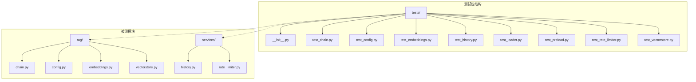

**图表来源**
- [tests/__init__.py](file://tests/__init__.py)
- [tests/test_chain.py](file://tests/test_chain.py)
- [tests/test_config.py](file://tests/test_config.py)
- [tests/test_embeddings.py](file://tests/test_embeddings.py)
- [tests/test_history.py](file://tests/test_history.py)
- [tests/test_loader.py](file://tests/test_loader.py)
- [tests/test_preload.py](file://tests/test_preload.py)
- [tests/test_rate_limiter.py](file://tests/test_rate_limiter.py)
- [tests/test_vectorstore.py](file://tests/test_vectorstore.py)
- [rag/chain.py](file://rag/chain.py)
- [rag/config.py](file://rag/config.py)
- [rag/embeddings.py](file://rag/embeddings.py)
- [rag/vectorstore.py](file://rag/vectorstore.py)
- [services/history.py](file://services/history.py)
- [services/rate_limiter.py](file://services/rate_limiter.py)

**章节来源**
- [tests/__init__.py](file://tests/__init__.py)
- [requirements-dev.txt](file://requirements-dev.txt)

## 核心组件
本项目使用 pytest 作为测试框架，配合 pytest-cov 进行覆盖率统计、pytest-mock 提供模拟能力。测试文件遵循以下约定：
- 文件命名：以 test_ 前缀 + 功能模块名，例如 test_chain.py、test_config.py
- 类命名：以 Test 前缀 + 被测类或功能模块名，例如 TestBM25Retriever、TestVectorStore
- 方法命名：以 test_ 前缀 + 功能描述，例如 test_basic_search、test_get_document_count
- 断言：使用 pytest 的内置断言，必要时结合 pytest.raises 进行异常断言
- 模拟：使用 pytest-mock 提供的 mocker fixture 或 unittest.mock

开发依赖通过 requirements-dev.txt 管理，包含 pytest、pytest-cov、pytest-mock。

**章节来源**
- [requirements-dev.txt](file://requirements-dev.txt)
- [tests/test_chain.py](file://tests/test_chain.py)
- [tests/test_config.py](file://tests/test_config.py)
- [tests/test_embeddings.py](file://tests/test_embeddings.py)
- [tests/test_history.py](file://tests/test_history.py)
- [tests/test_loader.py](file://tests/test_loader.py)
- [tests/test_preload.py](file://tests/test_preload.py)
- [tests/test_rate_limiter.py](file://tests/test_rate_limiter.py)
- [tests/test_vectorstore.py](file://tests/test_vectorstore.py)

## 架构概览
下图展示了测试框架与被测模块之间的关系，以及测试执行的关键流程。

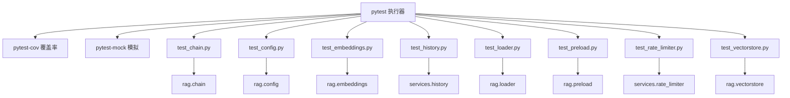

**图表来源**
- [tests/test_chain.py](file://tests/test_chain.py)
- [tests/test_config.py](file://tests/test_config.py)
- [tests/test_embeddings.py](file://tests/test_embeddings.py)
- [tests/test_history.py](file://tests/test_history.py)
- [tests/test_loader.py](file://tests/test_loader.py)
- [tests/test_preload.py](file://tests/test_preload.py)
- [tests/test_rate_limiter.py](file://tests/test_rate_limiter.py)
- [tests/test_vectorstore.py](file://tests/test_vectorstore.py)
- [rag/chain.py](file://rag/chain.py)
- [rag/config.py](file://rag/config.py)
- [rag/embeddings.py](file://rag/embeddings.py)
- [services/history.py](file://services/history.py)
- [rag/loader.py](file://rag/loader.py)
- [rag/preload.py](file://rag/preload.py)
- [services/rate_limiter.py](file://services/rate_limiter.py)
- [rag/vectorstore.py](file://rag/vectorstore.py)
- [requirements-dev.txt](file://requirements-dev.txt)

## 详细组件分析

### RAG 链测试
本模块测试检索、上下文构建、token 估算等核心逻辑，覆盖 BM25 检索器、RRF 融合算法、上下文预算计算、来源提取等功能。

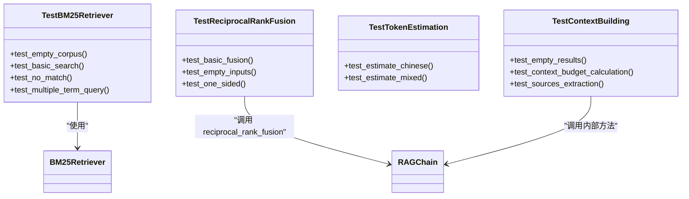

**图表来源**
- [tests/test_chain.py](file://tests/test_chain.py)
- [rag/chain.py](file://rag/chain.py)

**章节来源**
- [tests/test_chain.py](file://tests/test_chain.py)
- [rag/chain.py](file://rag/chain.py)

#### 测试流程序列图（BM25 检索）
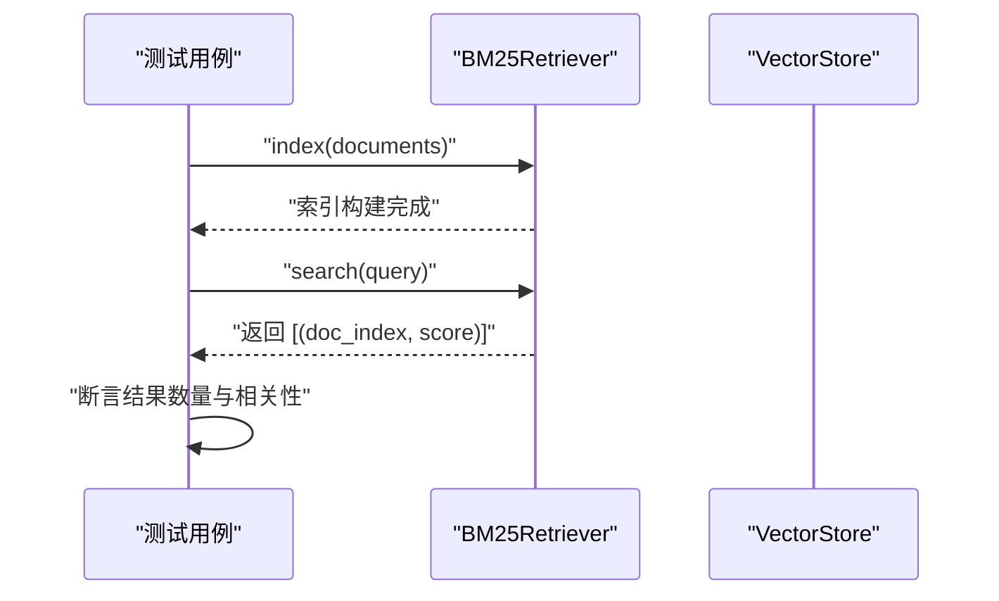

**图表来源**
- [tests/test_chain.py](file://tests/test_chain.py)
- [rag/chain.py](file://rag/chain.py)

### 配置测试
本模块测试配置解析、环境变量替换、Pydantic 模型校验、从 YAML 文件加载配置等功能。

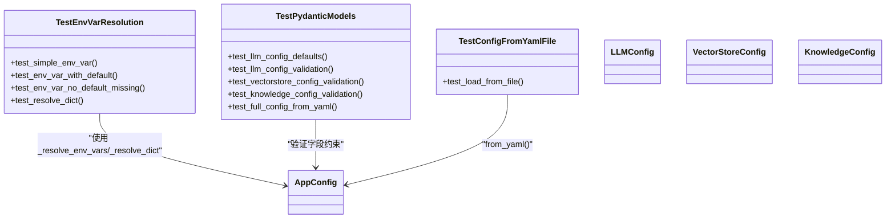

**图表来源**
- [tests/test_config.py](file://tests/test_config.py)
- [rag/config.py](file://rag/config.py)

**章节来源**
- [tests/test_config.py](file://tests/test_config.py)
- [rag/config.py](file://rag/config.py)

### 嵌入模型测试
本模块测试中文嵌入函数的初始化、延迟加载行为及默认参数设置。

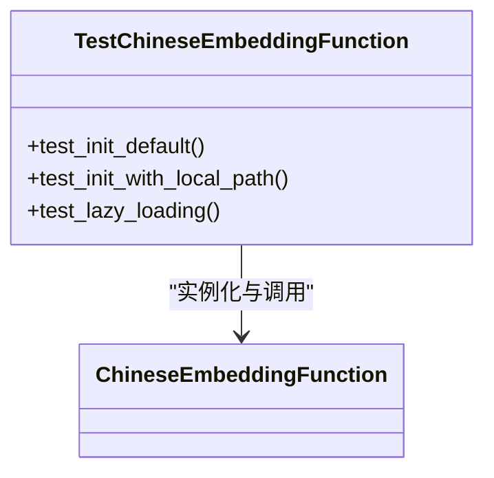

**图表来源**
- [tests/test_embeddings.py](file://tests/test_embeddings.py)
- [rag/embeddings.py](file://rag/embeddings.py)

**章节来源**
- [tests/test_embeddings.py](file://tests/test_embeddings.py)
- [rag/embeddings.py](file://rag/embeddings.py)

### 向量数据库测试
本模块测试向量库的初始化、文档增删查改、集合切换与统计信息获取等核心功能。

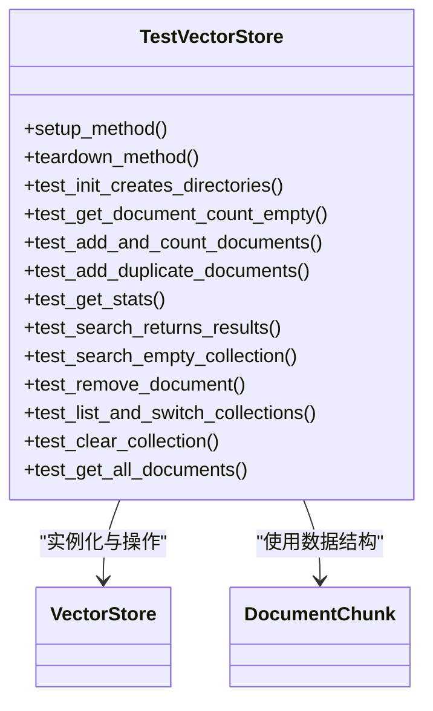

**图表来源**
- [tests/test_vectorstore.py](file://tests/test_vectorstore.py)
- [rag/vectorstore.py](file://rag/vectorstore.py)
- [rag/loader.py](file://rag/loader.py)

**章节来源**
- [tests/test_vectorstore.py](file://tests/test_vectorstore.py)
- [rag/vectorstore.py](file://rag/vectorstore.py)

### 历史管理测试
本模块测试会话管理（创建、列出、切换）、消息持久化与导出功能。

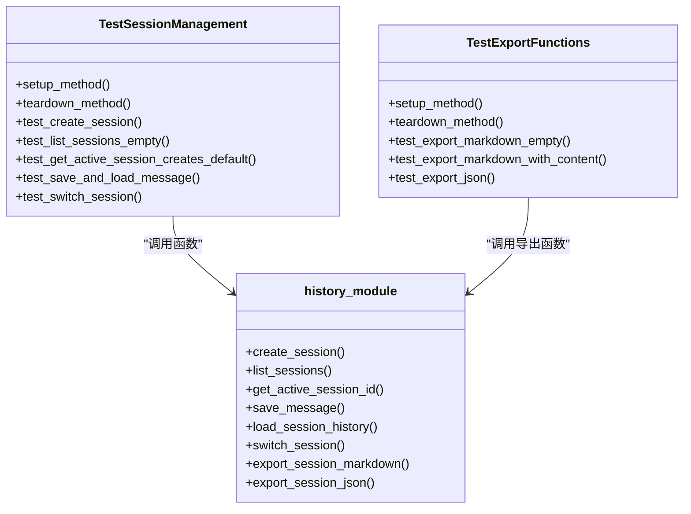

**图表来源**
- [tests/test_history.py](file://tests/test_history.py)
- [services/history.py](file://services/history.py)

**章节来源**
- [tests/test_history.py](file://tests/test_history.py)
- [services/history.py](file://services/history.py)

### 预加载模块测试
本模块验证预加载模块在模拟 Streamlit 多次 rerun 场景下的状态一致性。

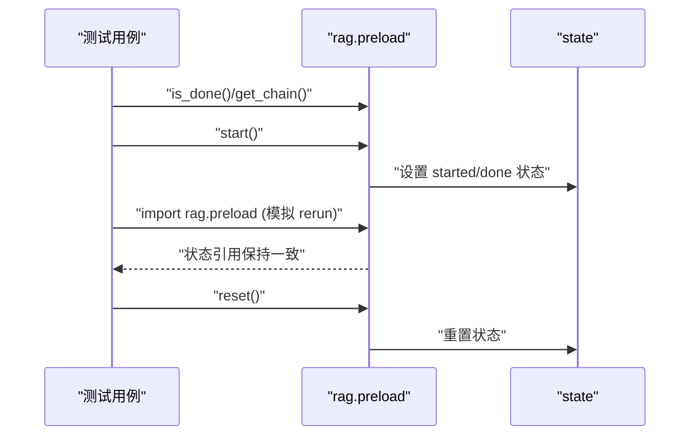

**图表来源**
- [tests/test_preload.py](file://tests/test_preload.py)
- [rag/preload.py](file://rag/preload.py)

**章节来源**
- [tests/test_preload.py](file://tests/test_preload.py)

### 速率限制器测试
本模块测试速率限制器的请求控制、配额耗尽拦截、不同用户隔离与过期清理机制。

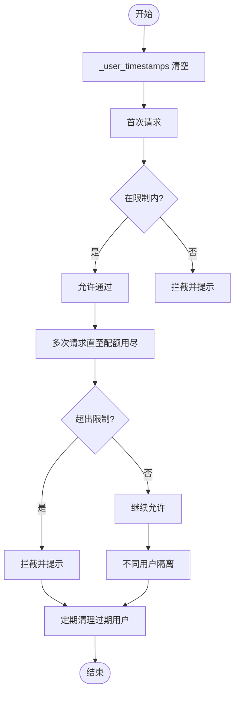

**图表来源**
- [tests/test_rate_limiter.py](file://tests/test_rate_limiter.py)
- [services/rate_limiter.py](file://services/rate_limiter.py)

**章节来源**
- [tests/test_rate_limiter.py](file://tests/test_rate_limiter.py)
- [services/rate_limiter.py](file://services/rate_limiter.py)

### 文档加载器测试
本模块测试文档分块、标题提取、文件元数据获取与 DocumentChunk 数据结构。

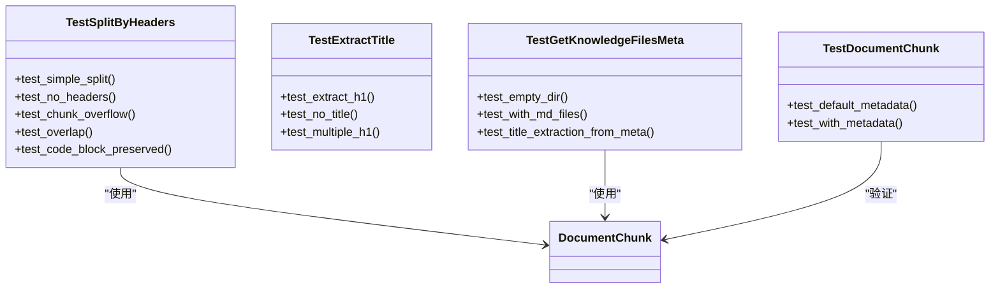

**图表来源**
- [tests/test_loader.py](file://tests/test_loader.py)
- [rag/loader.py](file://rag/loader.py)

**章节来源**
- [tests/test_loader.py](file://tests/test_loader.py)
- [rag/loader.py](file://rag/loader.py)

## 依赖分析
测试框架依赖关系如下：
- pytest：测试执行器
- pytest-cov：覆盖率统计
- pytest-mock：模拟对象支持

这些依赖通过 requirements-dev.txt 统一管理，确保开发与测试环境的一致性。

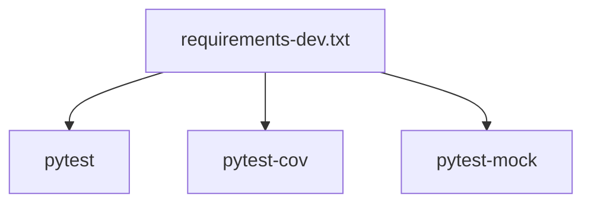

**图表来源**
- [requirements-dev.txt](file://requirements-dev.txt)

**章节来源**
- [requirements-dev.txt](file://requirements-dev.txt)

## 性能考虑
- 测试执行性能优化建议
  - 使用 pytest 的并发执行能力（如 --workers 参数，若项目支持）以提升整体测试速度
  - 将大文件或耗时操作（如模型下载）通过模拟或缓存替代，避免在单元测试中真实执行
  - 合理拆分测试用例，避免单个测试文件过大导致执行时间过长
- 覆盖率统计
  - 使用 pytest-cov 生成覆盖率报告，关注关键路径与边界条件的覆盖情况
  - 结合阈值配置（如行覆盖率、分支覆盖率）确保核心逻辑得到充分验证

[本节为通用指导，无需特定文件引用]

## 故障排除指南
- 环境变量未生效
  - 确认环境变量键名与模板语法一致（${VAR_NAME} 或 ${VAR_NAME:-default}）
  - 检查 _resolve_env_vars 与 _resolve_dict 的递归替换逻辑
- 配置校验失败
  - Pydantic 字段范围校验（如 temperature、max_tokens、chunk_overlap）需满足约束
  - 从 YAML 加载配置时，确认文件路径存在且格式正确
- 向量库操作异常
  - ChromaDB 客户端延迟初始化，确保先调用 _get_client 或相关公开接口
  - 文档重复入库时，注意按 ID 覆盖策略与统计信息一致性
- 会话与历史持久化问题
  - 临时目录权限与路径有效性检查
  - 导出功能依赖会话历史文件存在性，空会话应返回占位文本
- 速率限制误判
  - 清理过期时间戳与周期性清理逻辑，确保不活跃用户及时释放内存
  - 配额计算基于 60 秒窗口，注意并发场景下的边界条件

**章节来源**
- [tests/test_config.py](file://tests/test_config.py)
- [rag/config.py](file://rag/config.py)
- [tests/test_vectorstore.py](file://tests/test_vectorstore.py)
- [rag/vectorstore.py](file://rag/vectorstore.py)
- [tests/test_history.py](file://tests/test_history.py)
- [services/history.py](file://services/history.py)
- [tests/test_rate_limiter.py](file://tests/test_rate_limiter.py)
- [services/rate_limiter.py](file://services/rate_limiter.py)

## 结论
本测试框架以 pytest 为核心，围绕 RAG 系统的关键模块（配置、嵌入、向量库、历史管理、预加载、速率限制）建立了全面的单元测试体系。通过合理的测试组织、断言策略与模拟手段，有效保障了各模块的功能正确性与稳定性。建议在持续集成流程中启用覆盖率统计与报告生成，进一步提升测试质量与可追溯性。

[本节为总结性内容，无需特定文件引用]

## 附录
- 测试执行流程建议
  - 在 CI 环境中，先安装开发依赖，再执行 pytest 并生成覆盖率报告
  - 可结合 pytest.ini 或 pyproject.toml 配置默认参数（如 --cov、--tb=short）
- 测试数据准备最佳实践
  - 使用临时目录与临时文件，确保测试隔离与可重复性
  - 对于外部资源（如模型下载），优先使用模拟或本地缓存
- 断言与异常处理
  - 明确断言目标，避免过度断言
  - 使用 pytest.raises 精确捕获预期异常，结合错误消息进行验证

[本节为通用指导，无需特定文件引用]