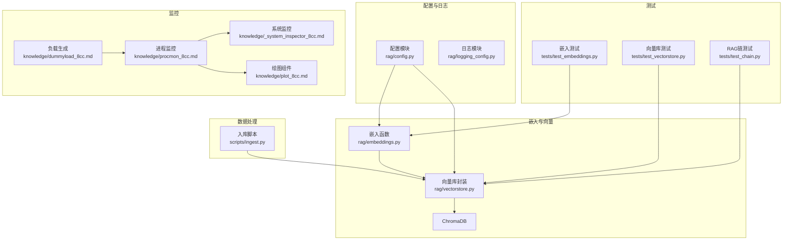
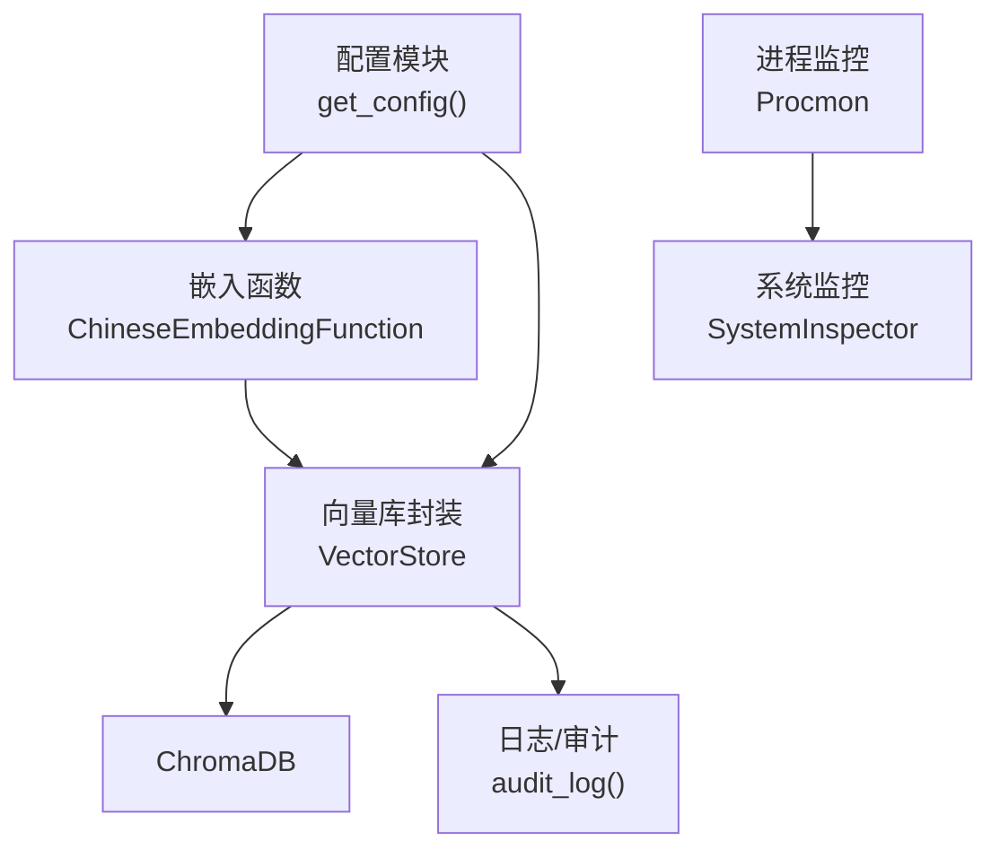
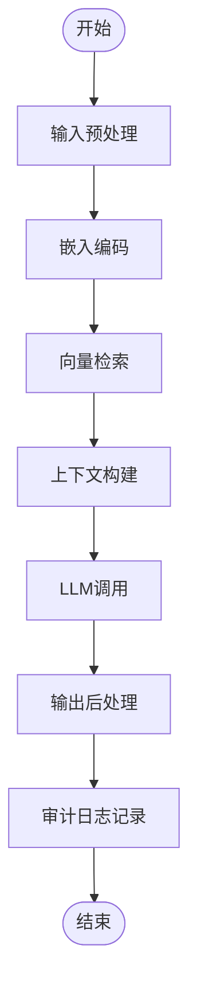
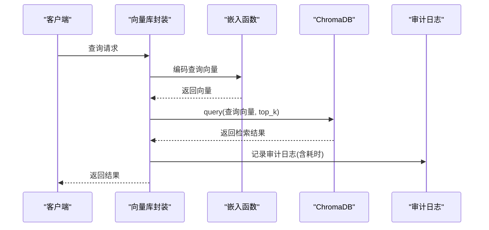
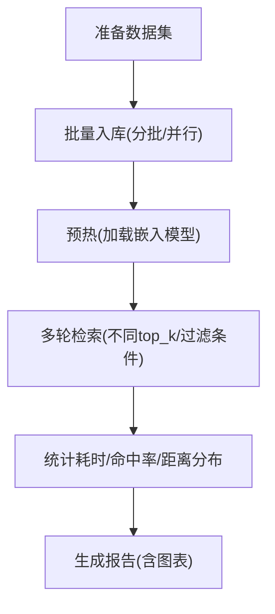
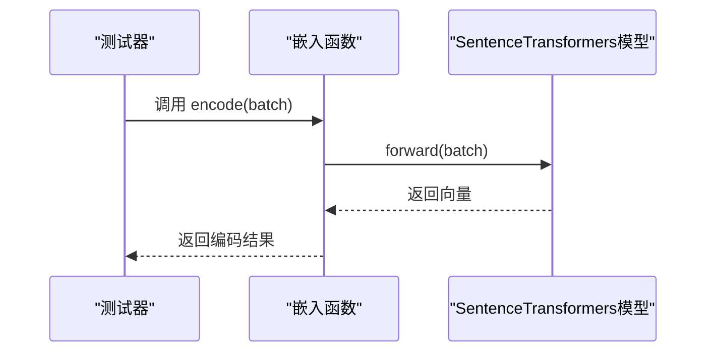
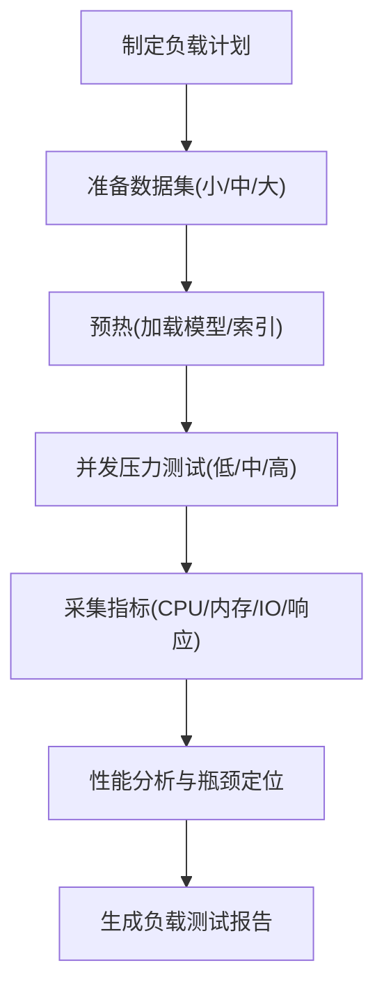
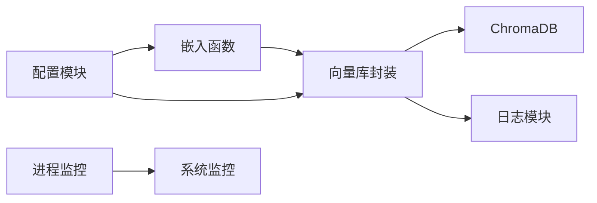

# 性能测试

<cite>
**本文引用的文件**
- [rag/config.py](file://rag/config.py)
- [rag/embeddings.py](file://rag/embeddings.py)
- [rag/vectorstore.py](file://rag/vectorstore.py)
- [rag/logging_config.py](file://rag/logging_config.py)
- [scripts/ingest.py](file://scripts/ingest.py)
- [tests/test_embeddings.py](file://tests/test_embeddings.py)
- [tests/test_vectorstore.py](file://tests/test_vectorstore.py)
- [tests/test_chain.py](file://tests/test_chain.py)
- [knowledge/procmon_8cc.md](file://knowledge/procmon_8cc.md)
- [knowledge/dummyload_8cc.md](file://knowledge/dummyload_8cc.md)
- [knowledge/_system_inspector_8cc.md](file://knowledge/_system_inspector_8cc.md)
- [knowledge/plot_8cc.md](file://knowledge/plot_8cc.md)
</cite>

## 目录
1. [简介](#简介)
2. [项目结构](#项目结构)
3. [核心组件](#核心组件)
4. [架构总览](#架构总览)
5. [详细组件分析](#详细组件分析)
6. [依赖分析](#依赖分析)
7. [性能考虑](#性能考虑)
8. [故障排查指南](#故障排查指南)
9. [结论](#结论)
10. [附录](#附录)

## 简介
本文件面向RAG系统的性能测试与优化，围绕响应时间、吞吐量、并发处理能力、向量检索性能、嵌入模型推理性能以及内存使用监控等方面，给出可操作的测试策略、方法与工具使用指导。文档同时涵盖负载测试设计、性能瓶颈识别与优化建议、性能回归测试实施方法，并结合现有代码实现与监控组件，提供可视化流程与时序图以帮助非专业读者理解。

## 项目结构
RAG系统主要由以下模块构成：
- 配置与日志：集中管理LLM、嵌入、向量库、速率限制等配置；提供审计日志与系统日志。
- 向量检索：ChromaDB向量库封装，支持延迟加载嵌入模型、集合管理、检索与统计。
- 嵌入模型：SentenceTransformers中文嵌入函数，支持在线/离线模型加载。
- 数据入库：文档扫描、分块、向量化与入库流程。
- 测试：针对嵌入、向量库、RAG链路的单元测试，便于回归与性能对比。
- 监控：进程CPU/内存监控、系统概览、绘图组件，辅助性能观测与定位。

**图表来源**
- [rag/config.py:102-131](file://rag/config.py#L102-L131)
- [rag/embeddings.py:19-48](file://rag/embeddings.py#L19-L48)
- [rag/vectorstore.py:24-60](file://rag/vectorstore.py#L24-L60)
- [scripts/ingest.py:25-57](file://scripts/ingest.py#L25-L57)
- [tests/test_embeddings.py:8-30](file://tests/test_embeddings.py#L8-L30)
- [tests/test_vectorstore.py:13-146](file://tests/test_vectorstore.py#L13-L146)
- [tests/test_chain.py:8-160](file://tests/test_chain.py#L8-L160)
- [knowledge/procmon_8cc.md:154-196](file://knowledge/procmon_8cc.md#L154-L196)
- [knowledge/_system_inspector_8cc.md:52-95](file://knowledge/_system_inspector_8cc.md#L52-L95)
- [knowledge/plot_8cc.md:32-89](file://knowledge/plot_8cc.md#L32-L89)
- [knowledge/dummyload_8cc.md:173-217](file://knowledge/dummyload_8cc.md#L173-L217)

**章节来源**
- [rag/config.py:102-131](file://rag/config.py#L102-L131)
- [rag/embeddings.py:19-48](file://rag/embeddings.py#L19-L48)
- [rag/vectorstore.py:24-60](file://rag/vectorstore.py#L24-L60)
- [scripts/ingest.py:25-57](file://scripts/ingest.py#L25-L57)
- [tests/test_embeddings.py:8-30](file://tests/test_embeddings.py#L8-L30)
- [tests/test_vectorstore.py:13-146](file://tests/test_vectorstore.py#L13-L146)
- [tests/test_chain.py:8-160](file://tests/test_chain.py#L8-L160)
- [knowledge/procmon_8cc.md:154-196](file://knowledge/procmon_8cc.md#L154-L196)
- [knowledge/_system_inspector_8cc.md:52-95](file://knowledge/_system_inspector_8cc.md#L52-L95)
- [knowledge/plot_8cc.md:32-89](file://knowledge/plot_8cc.md#L32-L89)
- [knowledge/dummyload_8cc.md:173-217](file://knowledge/dummyload_8cc.md#L173-L217)

## 核心组件
- 配置模块：提供全局单例配置，支持从YAML加载、环境变量替换、字段校验与运行时重载。关键字段包括嵌入模型、向量库参数、知识分块策略、速率限制与UI配置。
- 嵌入函数：封装SentenceTransformers中文模型，支持延迟加载与进度提示，避免首次请求阻塞。
- 向量库封装：提供ChromaDB客户端与集合的延迟初始化、集合切换、文档增删改查、检索与统计，以及全局单例缓存以复用嵌入模型。
- 日志与审计：统一控制台与文件输出，支持彩色高亮；审计日志记录查询、答案摘要、结果数与耗时，便于性能追踪与回归。
- 入库脚本：扫描知识目录、分块、向量化并入库，支持增量覆盖，便于大规模数据集的性能基线建立。
- 监控组件：进程CPU/内存监控、系统概览、绘图组件，支持周期性采样与图像输出，辅助性能观测。

**章节来源**
- [rag/config.py:102-131](file://rag/config.py#L102-L131)
- [rag/embeddings.py:19-48](file://rag/embeddings.py#L19-L48)
- [rag/vectorstore.py:24-60](file://rag/vectorstore.py#L24-L60)
- [rag/logging_config.py:46-75](file://rag/logging_config.py#L46-L75)
- [scripts/ingest.py:25-57](file://scripts/ingest.py#L25-L57)
- [knowledge/procmon_8cc.md:154-196](file://knowledge/procmon_8cc.md#L154-L196)
- [knowledge/_system_inspector_8cc.md:52-95](file://knowledge/_system_inspector_8cc.md#L52-L95)
- [knowledge/plot_8cc.md:32-89](file://knowledge/plot_8cc.md#L32-L89)

## 架构总览
下图展示RAG系统在性能测试场景下的关键交互：配置驱动嵌入与向量库，嵌入函数延迟加载模型，向量库进行检索与统计，日志与审计记录关键指标，监控组件采集系统资源。

**图表来源**
- [rag/config.py:138-150](file://rag/config.py#L138-L150)
- [rag/embeddings.py:31-39](file://rag/embeddings.py#L31-L39)
- [rag/vectorstore.py:40-55](file://rag/vectorstore.py#L40-L55)
- [rag/logging_config.py:86-129](file://rag/logging_config.py#L86-L129)
- [knowledge/procmon_8cc.md:154-196](file://knowledge/procmon_8cc.md#L154-L196)
- [knowledge/_system_inspector_8cc.md:52-95](file://knowledge/_system_inspector_8cc.md#L52-L95)

## 详细组件分析

### 响应时间测试策略
目标：测量从“用户输入”到“返回检索结果”的端到端响应时间，重点拆解嵌入编码、向量检索、上下文构建与LLM调用阶段的耗时贡献。

- 流程拆解
  - 输入预处理：文本清洗、长度截断（受速率限制配置影响）。
  - 嵌入编码：延迟加载模型后执行encode，记录开始/结束时间。
  - 向量检索：调用collection.query，记录检索耗时。
  - 上下文构建：根据token预算裁剪检索结果，记录构建耗时。
  - LLM调用：通过配置的LLM接口发起请求，记录往返时间。
  - 输出后处理：生成答案、记录审计日志。

- 关键指标
  - P50/P95/P99响应时间
  - 每阶段耗时占比
  - 并发下的尾延迟变化

- 可视化流程

**图表来源**
- [rag/embeddings.py:41-47](file://rag/embeddings.py#L41-L47)
- [rag/vectorstore.py:124-142](file://rag/vectorstore.py#L124-L142)
- [rag/logging_config.py:86-129](file://rag/logging_config.py#L86-L129)

**章节来源**
- [rag/embeddings.py:41-47](file://rag/embeddings.py#L41-L47)
- [rag/vectorstore.py:124-142](file://rag/vectorstore.py#L124-L142)
- [rag/logging_config.py:86-129](file://rag/logging_config.py#L86-L129)

### 吞吐量测试策略
目标：在固定资源约束下，测量系统每秒处理的查询数量（QPS），并观察不同批大小、并发线程数对吞吐的影响。

- 设计要点
  - 固定持续时间（如300秒）内持续压测，统计成功/失败次数与平均QPS。
  - 分层设置并发：从1、10、50、100逐步增加，观察拐点。
  - 批大小：调整每次检索的top_k与上下文拼接长度，评估对吞吐的影响。
  - 资源上限：CPU/内存/磁盘IO达到瓶颈时的QPS与错误率。

- 可视化序列

**图表来源**
- [rag/vectorstore.py:124-142](file://rag/vectorstore.py#L124-L142)
- [rag/embeddings.py:41-47](file://rag/embeddings.py#L41-L47)
- [rag/logging_config.py:86-129](file://rag/logging_config.py#L86-L129)

**章节来源**
- [rag/vectorstore.py:124-142](file://rag/vectorstore.py#L124-L142)
- [rag/embeddings.py:41-47](file://rag/embeddings.py#L41-L47)
- [rag/logging_config.py:86-129](file://rag/logging_config.py#L86-L129)

### 并发处理能力测试
目标：评估系统在高并发下的稳定性与资源占用，识别锁竞争、I/O瓶颈与GC停顿。

- 方法
  - 使用线程池模拟并发请求，逐步提升并发度，记录错误率与响应时间。
  - 观察向量库单例缓存是否有效降低嵌入模型重复加载开销。
  - 结合系统监控（CPU/内存/IO）与进程监控（用户态/内核态时间）定位瓶颈。

- 关键关注点
  - 嵌入模型延迟加载是否在预热阶段完成，避免首请求高峰。
  - ChromaDB写入/删除操作的事务开销与索引重建成本。
  - 检索过滤条件（metadata_filter）对查询计划的影响。

**章节来源**
- [rag/vectorstore.py:181-209](file://rag/vectorstore.py#L181-L209)
- [knowledge/procmon_8cc.md:477-496](file://knowledge/procmon_8cc.md#L477-L496)
- [knowledge/_system_inspector_8cc.md:97-154](file://knowledge/_system_inspector_8cc.md#L97-L154)

### 向量检索性能基准测试
目标：在不同规模数据集上评估检索性能，包括召回质量与速度。

- 数据集规模
  - 小规模：千级文档块，验证基础可用性。
  - 中规模：万级文档块，评估日常使用性能。
  - 大规模：十/百万级文档块，评估扩展性与索引策略。

- 指标
  - 检索耗时（P50/P95/P99）、命中率、平均距离分布。
  - top_k对召回与耗时的影响。
  - 元数据过滤（metadata_filter）的代价。

- 基准流程

**图表来源**
- [scripts/ingest.py:25-57](file://scripts/ingest.py#L25-L57)
- [rag/vectorstore.py:89-142](file://rag/vectorstore.py#L89-L142)

**章节来源**
- [scripts/ingest.py:25-57](file://scripts/ingest.py#L25-L57)
- [rag/vectorstore.py:89-142](file://rag/vectorstore.py#L89-L142)

### 嵌入模型推理性能测试
目标：评估嵌入编码的吞吐与延迟，识别模型加载与编码阶段的性能瓶颈。

- 测试维度
  - 模型加载：首次加载耗时、内存占用。
  - 编码吞吐：单次编码耗时、批量编码吞吐。
  - 模式切换：在线/离线模型切换的性能差异。

- 方法
  - 预热：先执行一次编码以触发模型加载。
  - 批量测试：以不同批次大小（如1、10、50、100）测量吞吐。
  - 并发测试：多线程/多进程编码，观察扩展性。

- 可视化

**图表来源**
- [rag/embeddings.py:31-39](file://rag/embeddings.py#L31-L39)
- [rag/embeddings.py:41-47](file://rag/embeddings.py#L41-L47)

**章节来源**
- [rag/embeddings.py:31-39](file://rag/embeddings.py#L31-L39)
- [rag/embeddings.py:41-47](file://rag/embeddings.py#L41-L47)

### 内存使用情况监控
目标：在不同并发与数据规模下，监控进程内存占用与系统内存使用，识别泄漏与峰值风险。

- 监控项
  - 进程内存：VSize/RSS随时间变化曲线。
  - 系统内存：总/空闲/缓存/真实使用量。
  - 垃圾回收：若嵌入模型驻留内存过大，需评估GC影响。

- 工具与方法
  - 使用进程监控组件定期采样CPU/内存并生成图像。
  - 使用系统监控组件读取/proc数据，输出系统概览。
  - 结合绘图组件将采样数据可视化。

**章节来源**
- [knowledge/procmon_8cc.md:154-196](file://knowledge/procmon_8cc.md#L154-L196)
- [knowledge/_system_inspector_8cc.md:97-154](file://knowledge/_system_inspector_8cc.md#L97-L154)
- [knowledge/plot_8cc.md:56-89](file://knowledge/plot_8cc.md#L56-L89)

### 负载测试设计
目标：在不同规模数据集与高并发请求下，评估系统整体表现与资源使用效率。

- 数据集梯度
  - 小：1K文档块，验证基本路径。
  - 中：10K文档块，评估日常负载。
  - 大：100K/1M文档块，评估扩展性与索引策略。

- 并发梯度
  - 低：10并发，验证稳定性。
  - 中：50/100并发，观察尾延迟与错误率。
  - 高：200+并发，识别瓶颈与恢复能力。

- 资源效率评估
  - CPU利用率、内存占用、磁盘IO、网络带宽。
  - QPS/错误率/响应时间的权衡。

- 可视化

**图表来源**
- [scripts/ingest.py:25-57](file://scripts/ingest.py#L25-L57)
- [knowledge/procmon_8cc.md:154-196](file://knowledge/procmon_8cc.md#L154-L196)
- [knowledge/_system_inspector_8cc.md:97-154](file://knowledge/_system_inspector_8cc.md#L97-L154)

**章节来源**
- [scripts/ingest.py:25-57](file://scripts/ingest.py#L25-L57)
- [knowledge/procmon_8cc.md:154-196](file://knowledge/procmon_8cc.md#L154-L196)
- [knowledge/_system_inspector_8cc.md:97-154](file://knowledge/_system_inspector_8cc.md#L97-L154)

### 性能瓶颈识别与优化建议
- 嵌入模型加载
  - 现状：延迟加载，首次请求可能阻塞。
  - 建议：预热机制、模型缓存、离线本地模型部署。
- 向量库写入与检索
  - 现状：批量入库、增量覆盖；检索支持过滤。
  - 建议：分批入库、索引参数调优、合理top_k与过滤条件。
- 并发与资源
  - 现状：进程监控与系统监控可用。
  - 建议：线程池大小与队列长度调优、GC参数优化。
- 审计与可观测性
  - 现状：审计日志记录耗时与结果数。
  - 建议：埋点细化、分布式追踪集成。

**章节来源**
- [rag/embeddings.py:31-39](file://rag/embeddings.py#L31-L39)
- [rag/vectorstore.py:89-142](file://rag/vectorstore.py#L89-L142)
- [rag/logging_config.py:86-129](file://rag/logging_config.py#L86-L129)
- [knowledge/procmon_8cc.md:154-196](file://knowledge/procmon_8cc.md#L154-L196)
- [knowledge/_system_inspector_8cc.md:97-154](file://knowledge/_system_inspector_8cc.md#L97-L154)

### 性能回归测试实施方法
- 单元测试回归
  - 嵌入函数：验证延迟加载、默认模型名与接口行为。
  - 向量库：验证增删改查、集合切换、统计信息。
  - RAG链：验证BM25检索、RRF融合、上下文预算与来源提取。
- 基准回归
  - 固定数据集与查询集，定期运行响应时间与吞吐测试，对比历史基线。
- 监控回归
  - 持续采集CPU/内存/IO，设定阈值告警，防止回归。

**章节来源**
- [tests/test_embeddings.py:8-30](file://tests/test_embeddings.py#L8-L30)
- [tests/test_vectorstore.py:13-146](file://tests/test_vectorstore.py#L13-L146)
- [tests/test_chain.py:8-160](file://tests/test_chain.py#L8-L160)

### 性能测试工具使用与结果分析指导
- 进程监控
  - 启动Procmon监控目标进程，定时采样CPU/内存，生成图像。
  - 使用SystemInspector查看系统负载与内存概况。
- 负载生成
  - 使用dummyload生成可调占空比的CPU负载，模拟高并发场景。
- 结果分析
  - 以时间为横轴，CPU/内存/响应时间/吞吐为纵轴绘制趋势图。
  - 关注尾延迟与错误率突增的时间点，结合审计日志定位异常。

**章节来源**
- [knowledge/procmon_8cc.md:154-196](file://knowledge/procmon_8cc.md#L154-L196)
- [knowledge/_system_inspector_8cc.md:97-154](file://knowledge/_system_inspector_8cc.md#L97-L154)
- [knowledge/dummyload_8cc.md:173-217](file://knowledge/dummyload_8cc.md#L173-L217)
- [knowledge/plot_8cc.md:56-89](file://knowledge/plot_8cc.md#L56-L89)

## 依赖分析
- 组件耦合
  - 配置模块为嵌入与向量库提供参数来源，耦合度低、内聚性强。
  - 向量库封装依赖嵌入函数与ChromaDB，对外暴露简洁接口。
  - 日志模块被向量库与入库脚本广泛使用，形成跨模块依赖。
- 外部依赖
  - SentenceTransformers：嵌入模型加载与编码。
  - ChromaDB：向量存储与检索。
  - 进程/系统监控：/proc文件系统与gd绘图库。

**图表来源**
- [rag/config.py:102-131](file://rag/config.py#L102-L131)
- [rag/embeddings.py:19-48](file://rag/embeddings.py#L19-L48)
- [rag/vectorstore.py:24-60](file://rag/vectorstore.py#L24-L60)
- [rag/logging_config.py:46-75](file://rag/logging_config.py#L46-L75)
- [knowledge/procmon_8cc.md:154-196](file://knowledge/procmon_8cc.md#L154-L196)
- [knowledge/_system_inspector_8cc.md:52-95](file://knowledge/_system_inspector_8cc.md#L52-L95)

**章节来源**
- [rag/config.py:102-131](file://rag/config.py#L102-L131)
- [rag/embeddings.py:19-48](file://rag/embeddings.py#L19-L48)
- [rag/vectorstore.py:24-60](file://rag/vectorstore.py#L24-L60)
- [rag/logging_config.py:46-75](file://rag/logging_config.py#L46-L75)
- [knowledge/procmon_8cc.md:154-196](file://knowledge/procmon_8cc.md#L154-L196)
- [knowledge/_system_inspector_8cc.md:52-95](file://knowledge/_system_inspector_8cc.md#L52-L95)

## 性能考虑
- 延迟与吞吐平衡：合理设置top_k与过滤条件，避免过度检索导致延迟上升。
- 资源预留：为嵌入模型与ChromaDB索引预留充足内存，避免频繁换页。
- 并发控制：结合速率限制配置与线程池参数，平滑处理突发流量。
- 监控与告警：持续采集关键指标，建立阈值告警，快速发现异常。

## 故障排查指南
- 响应时间异常升高
  - 检查嵌入模型是否完成预热。
  - 查看向量库检索是否启用过滤条件。
  - 核对审计日志中的耗时与结果数。
- 吞吐下降
  - 观察进程CPU/内存曲线，确认是否存在GC停顿或IO瓶颈。
  - 检查ChromaDB索引状态与磁盘空间。
- 并发报错
  - 逐步降并发验证稳定性，定位临界点。
  - 检查速率限制配置与请求长度。

**章节来源**
- [rag/logging_config.py:86-129](file://rag/logging_config.py#L86-L129)
- [knowledge/procmon_8cc.md:154-196](file://knowledge/procmon_8cc.md#L154-L196)
- [knowledge/_system_inspector_8cc.md:97-154](file://knowledge/_system_inspector_8cc.md#L97-L154)

## 结论
通过明确的测试策略、可量化的指标与完善的监控体系，RAG系统可在不同规模数据与并发场景下实现稳定、高效的性能表现。建议将性能测试纳入CI/CD流程，持续跟踪回归，确保系统在演进过程中保持优良的用户体验。

## 附录
- 测试用例参考
  - 嵌入函数测试：验证默认模型名、本地路径与延迟加载行为。
  - 向量库测试：覆盖增删改查、集合切换、统计信息与检索结果。
  - RAG链测试：验证BM25检索、RRF融合、上下文预算与来源提取。

**章节来源**
- [tests/test_embeddings.py:8-30](file://tests/test_embeddings.py#L8-L30)
- [tests/test_vectorstore.py:13-146](file://tests/test_vectorstore.py#L13-L146)
- [tests/test_chain.py:8-160](file://tests/test_chain.py#L8-L160)