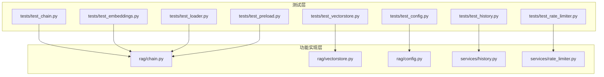
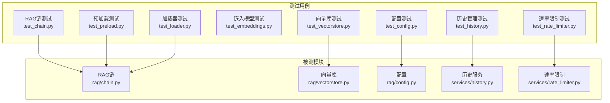
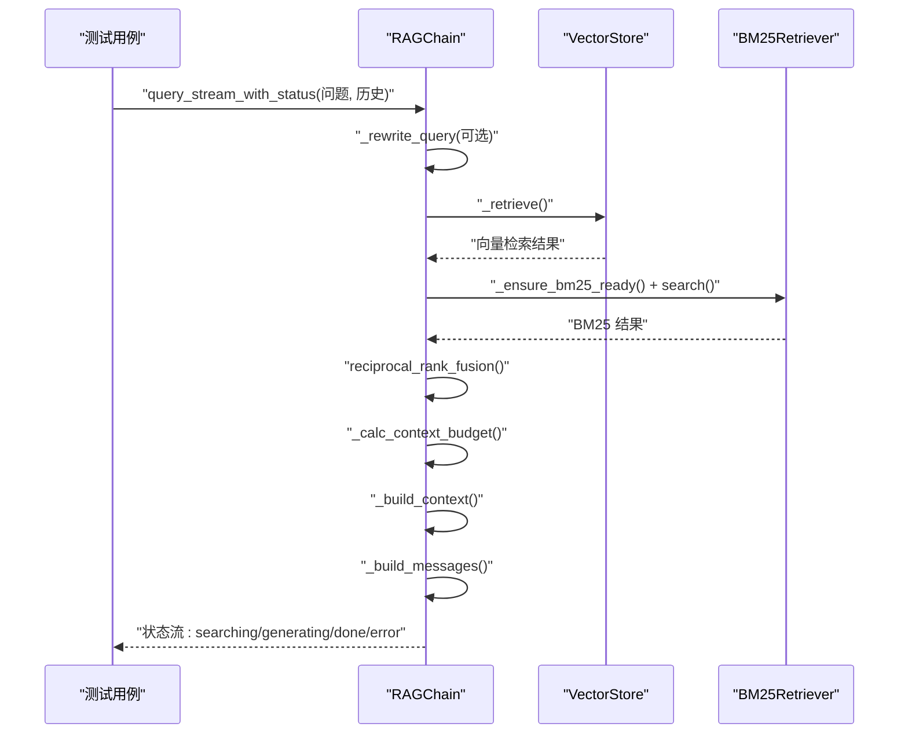
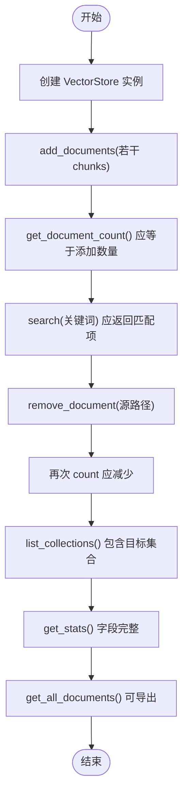
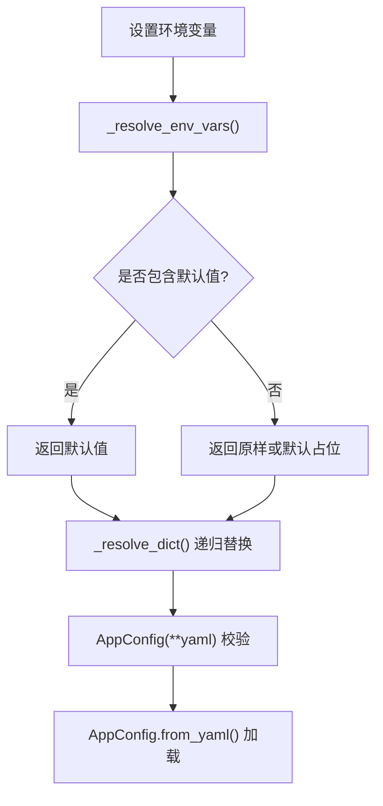
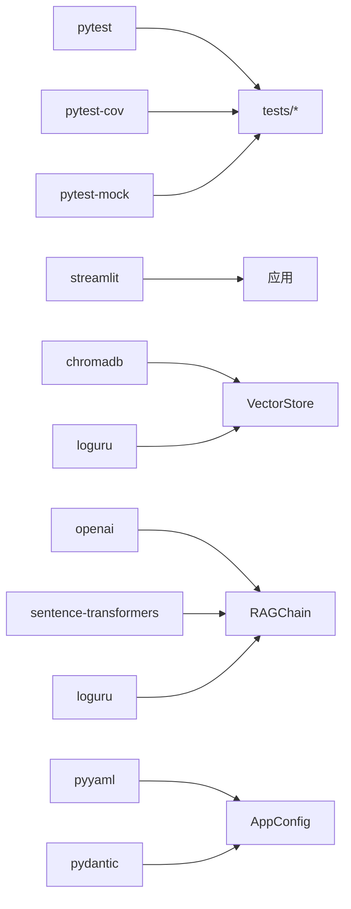

# 测试与质量保证

<cite>
**本文引用的文件**
- [tests/test_chain.py](file://tests/test_chain.py)
- [tests/test_embeddings.py](file://tests/test_embeddings.py)
- [tests/test_vectorstore.py](file://tests/test_vectorstore.py)
- [tests/test_config.py](file://tests/test_config.py)
- [tests/test_history.py](file://tests/test_history.py)
- [tests/test_loader.py](file://tests/test_loader.py)
- [tests/test_preload.py](file://tests/test_preload.py)
- [tests/test_rate_limiter.py](file://tests/test_rate_limiter.py)
- [requirements-dev.txt](file://requirements-dev.txt)
- [requirements.txt](file://requirements.txt)
- [rag/chain.py](file://rag/chain.py)
- [rag/vectorstore.py](file://rag/vectorstore.py)
- [rag/config.py](file://rag/config.py)
- [services/history.py](file://services/history.py)
- [services/rate_limiter.py](file://services/rate_limiter.py)
</cite>

## 目录
1. [简介](#简介)
2. [项目结构](#项目结构)
3. [核心组件](#核心组件)
4. [架构总览](#架构总览)
5. [详细组件分析](#详细组件分析)
6. [依赖分析](#依赖分析)
7. [性能考虑](#性能考虑)
8. [故障排查指南](#故障排查指南)
9. [结论](#结论)
10. [附录](#附录)

## 简介
本文件面向测试与质量保证，系统梳理本项目的单元测试框架、测试用例组织方式、模拟数据准备策略、断言验证机制，并深入解析 RAG 链测试、向量数据库测试、配置测试、嵌入模型测试、历史管理测试等关键功能测试的实现。同时给出测试覆盖率建议、持续集成配置思路、性能测试方法、安全测试要点、最佳实践、调试技巧以及质量度量指标，帮助开发者建立完善的测试指导与质量保证体系。

## 项目结构
项目采用“功能域 + 测试”分离的组织方式：
- 功能模块位于 rag/ 与 services/ 下，分别负责 RAG 链、向量库、配置、历史与限流等能力。
- 测试用例集中于 tests/，按功能模块一一对应，便于维护与回归。
- 开发与测试依赖集中在 requirements-dev.txt，运行依赖在 requirements.txt。

图表来源
- [tests/test_chain.py:1-160](file://tests/test_chain.py#L1-L160)
- [tests/test_vectorstore.py:1-146](file://tests/test_vectorstore.py#L1-L146)
- [tests/test_config.py:1-117](file://tests/test_config.py#L1-L117)
- [tests/test_embeddings.py:1-30](file://tests/test_embeddings.py#L1-L30)
- [tests/test_history.py:1-98](file://tests/test_history.py#L1-L98)
- [tests/test_loader.py:1-138](file://tests/test_loader.py#L1-L138)
- [tests/test_rate_limiter.py:1-57](file://tests/test_rate_limiter.py#L1-L57)
- [tests/test_preload.py:1-36](file://tests/test_preload.py#L1-L36)
- [rag/chain.py:1-590](file://rag/chain.py#L1-L590)
- [rag/vectorstore.py:1-209](file://rag/vectorstore.py#L1-L209)
- [rag/config.py:1-184](file://rag/config.py#L1-L184)
- [services/history.py:1-270](file://services/history.py#L1-L270)
- [services/rate_limiter.py:1-71](file://services/rate_limiter.py#L1-L71)

章节来源
- [requirements-dev.txt:1-5](file://requirements-dev.txt#L1-L5)
- [requirements.txt:1-11](file://requirements.txt#L1-L11)

## 核心组件
- 单元测试框架：pytest，配合 pytest-cov、pytest-mock。
- 断言与模拟：pytest 断言 + pytest-mock 模拟外部依赖。
- 测试组织：按模块划分，每个模块一个测试文件，类与函数分别以类/函数名命名，清晰定位。
- 模拟数据：通过临时目录、临时文件、构造最小化输入、Mock 对象等方式准备。

章节来源
- [requirements-dev.txt:1-5](file://requirements-dev.txt#L1-L5)
- [tests/test_chain.py:1-160](file://tests/test_chain.py#L1-L160)
- [tests/test_vectorstore.py:1-146](file://tests/test_vectorstore.py#L1-L146)
- [tests/test_config.py:1-117](file://tests/test_config.py#L1-L117)
- [tests/test_embeddings.py:1-30](file://tests/test_embeddings.py#L1-L30)
- [tests/test_history.py:1-98](file://tests/test_history.py#L1-L98)
- [tests/test_loader.py:1-138](file://tests/test_loader.py#L1-L138)
- [tests/test_rate_limiter.py:1-57](file://tests/test_rate_limiter.py#L1-L57)
- [tests/test_preload.py:1-36](file://tests/test_preload.py#L1-L36)

## 架构总览
下图展示测试与被测模块之间的映射关系，体现测试如何覆盖核心功能。

图表来源
- [tests/test_chain.py:1-160](file://tests/test_chain.py#L1-L160)
- [tests/test_vectorstore.py:1-146](file://tests/test_vectorstore.py#L1-L146)
- [tests/test_config.py:1-117](file://tests/test_config.py#L1-L117)
- [tests/test_embeddings.py:1-30](file://tests/test_embeddings.py#L1-L30)
- [tests/test_history.py:1-98](file://tests/test_history.py#L1-L98)
- [tests/test_loader.py:1-138](file://tests/test_loader.py#L1-L138)
- [tests/test_rate_limiter.py:1-57](file://tests/test_rate_limiter.py#L1-L57)
- [tests/test_preload.py:1-36](file://tests/test_preload.py#L1-L36)
- [rag/chain.py:1-590](file://rag/chain.py#L1-L590)
- [rag/vectorstore.py:1-209](file://rag/vectorstore.py#L1-L209)
- [rag/config.py:1-184](file://rag/config.py#L1-L184)
- [services/history.py:1-270](file://services/history.py#L1-L270)
- [services/rate_limiter.py:1-71](file://services/rate_limiter.py#L1-L71)

## 详细组件分析

### RAG 链测试（检索、融合、上下文构建、token 估算）
- 测试目标
  - BM25 检索器：空语料、基本检索、无匹配、多词查询。
  - RRF 融合：去重、空输入、单侧输入。
  - Token 估算：中文、中英混合估算合理性。
  - 上下文构建：空结果处理、预算计算、历史注入、来源抽取。
- 测试策略
  - 使用最小化输入与 Mock 替换真实外部调用，确保可重复性。
  - 通过构造不同长度与内容的文本，验证 token 估算与上下文截断逻辑。
  - 对异常分支（空结果）进行显式断言，保障健壮性。
- 关键断言点
  - 结果数量与顺序、去重后来源数量、预算值与历史注入比例、错误状态码与提示信息。

图表来源
- [tests/test_chain.py:1-160](file://tests/test_chain.py#L1-L160)
- [rag/chain.py:160-590](file://rag/chain.py#L160-L590)
- [rag/vectorstore.py:24-209](file://rag/vectorstore.py#L24-L209)

章节来源
- [tests/test_chain.py:1-160](file://tests/test_chain.py#L1-L160)
- [rag/chain.py:160-590](file://rag/chain.py#L160-L590)

### 向量数据库测试（ChromaDB）
- 测试目标
  - 初始化与持久化目录创建、文档计数、增删改查、集合切换与列举、统计信息、全量文档导出。
- 测试策略
  - 使用临时目录与临时文件，避免污染磁盘；在每个测试前后清理资源。
  - 通过重复添加同名文档验证覆盖逻辑；通过删除特定来源验证按源删除。
- 关键断言点
  - 计数一致性、集合存在性、统计字段完整性、查询命中与相关性。

图表来源
- [tests/test_vectorstore.py:1-146](file://tests/test_vectorstore.py#L1-L146)
- [rag/vectorstore.py:24-209](file://rag/vectorstore.py#L24-L209)

章节来源
- [tests/test_vectorstore.py:1-146](file://tests/test_vectorstore.py#L1-L146)
- [rag/vectorstore.py:24-209](file://rag/vectorstore.py#L24-L209)

### 配置测试（Pydantic 校验、环境变量替换、YAML 加载）
- 测试目标
  - 环境变量替换：存在默认值与缺失默认值场景；字典递归替换。
  - Pydantic 模型校验：LLM/向量库/知识库参数边界与约束。
  - YAML 文件加载：从文件加载配置并转换为字典。
- 测试策略
  - 设置环境变量，断言替换结果；构造越界数据断言异常。
  - 临时文件写入 YAML，断言加载后的字段值与默认值。
- 关键断言点
  - 替换后的字符串、字段默认值、异常抛出、类型与范围约束。

图表来源
- [tests/test_config.py:1-117](file://tests/test_config.py#L1-L117)
- [rag/config.py:1-184](file://rag/config.py#L1-L184)

章节来源
- [tests/test_config.py:1-117](file://tests/test_config.py#L1-L117)
- [rag/config.py:1-184](file://rag/config.py#L1-L184)

### 嵌入模型测试（ChineseEmbeddingFunction）
- 测试目标
  - 初始化默认模型名与延迟加载行为；本地路径优先策略。
- 测试策略
  - 不实际加载模型（避免下载大模型），仅断言初始化参数与延迟加载标志。
- 关键断言点
  - 模型名与本地路径映射、延迟加载状态。

章节来源
- [tests/test_embeddings.py:1-30](file://tests/test_embeddings.py#L1-L30)
- [rag/chain.py:1-590](file://rag/chain.py#L1-L590)

### 历史管理测试（会话、消息、导出）
- 测试目标
  - 会话生命周期：创建、列举、切换、默认活跃会话。
  - 消息持久化：按会话与按日期双写兼容。
  - 导出功能：Markdown 与 JSON 导出格式与内容。
- 测试策略
  - 使用临时目录隔离用户与会话数据；断言文件存在与内容结构。
- 关键断言点
  - 会话 ID 长度与唯一性、活跃会话切换、导出文本片段与 JSON 结构。

章节来源
- [tests/test_history.py:1-98](file://tests/test_history.py#L1-L98)
- [services/history.py:1-270](file://services/history.py#L1-L270)

### 加载器测试（分块、标题提取、元数据）
- 测试目标
  - 标题提取：H1 优先、无标题回退。
  - 分块逻辑：无标题、溢出拆分、重叠、代码块完整性。
  - 元数据：文件列表、标题、类型、不含全文。
- 测试策略
  - 临时目录写入多种文件，断言元数据字段与分块内容。
- 关键断言点
  - 分块数量与边界、代码块标记成对、元数据字段齐全。

章节来源
- [tests/test_loader.py:1-138](file://tests/test_loader.py#L1-L138)
- [rag/chain.py:1-590](file://rag/chain.py#L1-L590)

### 速率限制测试
- 测试目标
  - 首次请求放行、限额内放行、超限拦截、不同用户隔离、过期清理。
- 测试策略
  - 清空全局状态，循环请求直至超限，断言拦截消息与等待时间。
  - 强制触发清理，断言过期用户被移除。
- 关键断言点
  - 允许/拒绝状态、消息文案、用户隔离、清理生效。

章节来源
- [tests/test_rate_limiter.py:1-57](file://tests/test_rate_limiter.py#L1-L57)
- [services/rate_limiter.py:1-71](file://services/rate_limiter.py#L1-L71)

### 预加载测试（Streamlit rerun 场景）
- 测试目标
  - 模拟多次 rerun：模块重导入不应重置状态；提供 reset 重置。
- 测试策略
  - 断言状态引用一致、重置后恢复初始态。
- 关键断言点
  - 状态对象同一性、reset 行为。

章节来源
- [tests/test_preload.py:1-36](file://tests/test_preload.py#L1-L36)
- [rag/chain.py:1-590](file://rag/chain.py#L1-L590)

## 依赖分析
- 测试依赖
  - pytest、pytest-cov、pytest-mock。
- 运行依赖
  - streamlit、chromadb、openai、sentence-transformers、pyyaml、markdown、pymupdf、httpx、pydantic、loguru。
- 模块耦合
  - 测试与被测模块通过公开接口交互，尽量避免直接依赖内部细节。
  - 向量库与配置模块耦合紧密，测试中通过构造最小化配置与临时目录隔离。

图表来源
- [requirements-dev.txt:1-5](file://requirements-dev.txt#L1-L5)
- [requirements.txt:1-11](file://requirements.txt#L1-L11)
- [rag/chain.py:1-590](file://rag/chain.py#L1-L590)
- [rag/vectorstore.py:1-209](file://rag/vectorstore.py#L1-L209)
- [rag/config.py:1-184](file://rag/config.py#L1-L184)

章节来源
- [requirements-dev.txt:1-5](file://requirements-dev.txt#L1-L5)
- [requirements.txt:1-11](file://requirements.txt#L1-L11)

## 性能考虑
- 检索性能
  - 向量检索与 BM25 检索结合，RRF 融合提升召回与精度平衡。
  - 通过距离阈值过滤低相关度结果，减少后续处理开销。
- 上下文预算
  - 基于字符/token 估算与上下文窗口、历史轮数动态计算预算，避免 OOM。
- 模型加载
  - Reranker 与嵌入模型类级别缓存，避免重复加载。
- 存储与 IO
  - ChromaDB 持久化目录延迟初始化；批量增删改查减少 IO 次数。
- 并发与限流
  - 速率限制器按用户维度控制 QPS，定期清理过期记录，防止内存膨胀。

章节来源
- [rag/chain.py:160-590](file://rag/chain.py#L160-L590)
- [rag/vectorstore.py:24-209](file://rag/vectorstore.py#L24-L209)
- [services/rate_limiter.py:1-71](file://services/rate_limiter.py#L1-L71)

## 故障排查指南
- 检索无结果
  - 检查向量库是否已入库、集合名称是否正确、查询是否被 BM25/BM25兜底。
  - 关注日志中的“向量检索无结果，使用 BM25 兜底”提示。
- Reranker 失败
  - 检查模型缓存是否加载成功；若不可用则自动降级为无重排。
- LLM 调用失败
  - 观察流式/非流式回退逻辑与重试策略；关注审计日志中的错误详情。
- 速率限制
  - 查看拦截消息中的等待时间；确认是否因超限或未清理导致。
- 历史导出为空
  - 确认会话是否存在、文件是否被清理；检查导出函数的空会话处理。

章节来源
- [rag/chain.py:408-590](file://rag/chain.py#L408-L590)
- [services/rate_limiter.py:45-71](file://services/rate_limiter.py#L45-L71)
- [services/history.py:247-270](file://services/history.py#L247-L270)

## 结论
本项目测试体系以 pytest 为核心，围绕 RAG 链、向量库、配置、嵌入模型、历史管理、加载器、速率限制与预加载等关键模块建立了完备的单元测试。通过最小化输入、临时资源与断言验证，确保功能正确性与稳定性。建议在 CI 中引入覆盖率报告与基准测试，持续完善质量度量与回归保障。

## 附录

### 测试覆盖率要求
- 建议目标
  - 语句覆盖率 ≥ 85%，分支覆盖率 ≥ 75%，函数/类覆盖率 ≥ 90%。
- 覆盖率收集
  - 使用 pytest-cov 生成 HTML 报告，结合 CI 汇总与阈值告警。

章节来源
- [requirements-dev.txt:1-5](file://requirements-dev.txt#L1-L5)

### 持续集成配置思路
- 触发条件
  - push 到主分支与拉取请求。
- 步骤建议
  - 安装依赖（开发与运行依赖）。
  - 运行 pytest 并生成覆盖率报告。
  - 可选：运行静态分析工具（如 flake8/mypy）与安全扫描。
  - 上传覆盖率报告至 CI 平台（如 Codecov）。

章节来源
- [requirements-dev.txt:1-5](file://requirements-dev.txt#L1-L5)
- [requirements.txt:1-11](file://requirements.txt#L1-L11)

### 性能测试方法
- 检索性能
  - 使用固定查询集与不同规模知识库，测量检索耗时与命中率。
- 生成性能
  - 测量流式/非流式调用的吞吐与首 token 延迟。
- 存储性能
  - 批量入库/删除的吞吐与延迟；集合切换与统计查询耗时。
- 建议工具
  - pytest-benchmark（需安装）或自定义基准脚本。

章节来源
- [tests/test_vectorstore.py:1-146](file://tests/test_vectorstore.py#L1-L146)
- [tests/test_chain.py:1-160](file://tests/test_chain.py#L1-L160)

### 安全测试要点
- 配置安全
  - 确保敏感字段（如 API Key）不泄露；环境变量替换仅在受控场景使用。
- 输入校验
  - 对用户输入与文件元数据进行边界与格式校验，防止异常输入导致崩溃。
- 权限与隔离
  - 历史与向量库目录权限最小化；会话与用户数据隔离。
- 审计日志
  - 关键操作（查询、入库、删除、导出）记录审计日志，便于追踪。

章节来源
- [rag/config.py:1-184](file://rag/config.py#L1-L184)
- [services/history.py:1-270](file://services/history.py#L1-L270)
- [rag/chain.py:1-590](file://rag/chain.py#L1-L590)

### 测试最佳实践
- 用例命名规范：以被测类/函数名 + 场景描述，便于定位。
- 断言粒度：关注关键路径与边界条件，避免冗余断言。
- 模拟与隔离：对外部依赖（网络、文件系统）进行模拟或使用临时资源。
- 可重复性：避免依赖全局状态；必要时在 setup/teardown 中重置。
- 文档与注释：为复杂用例添加注释说明前置条件与期望结果。

### 调试技巧
- 使用 pytest --pdb 快速定位异常点。
- 通过 pytest -s 输出中间状态与日志。
- 对关键流程绘制序列图与流程图，辅助理解与验证。