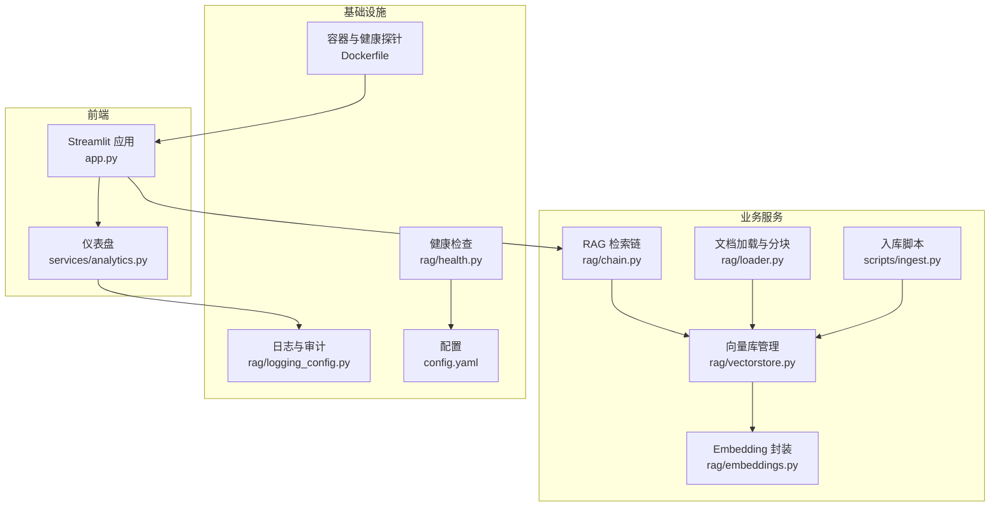
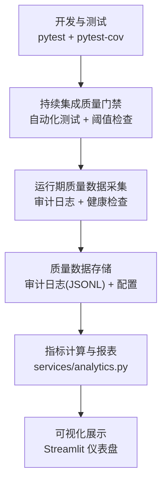
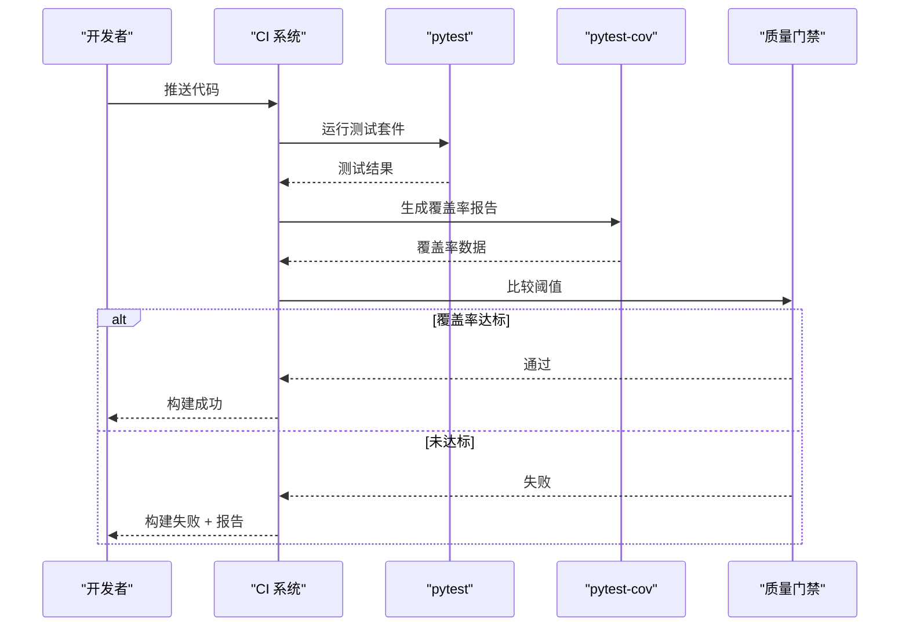
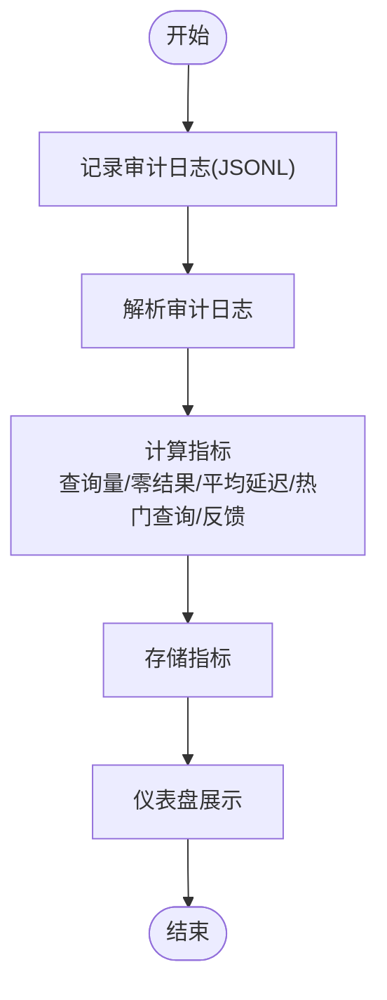
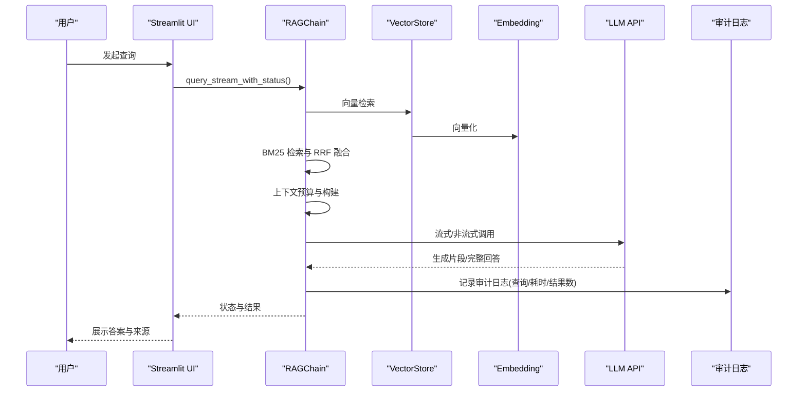
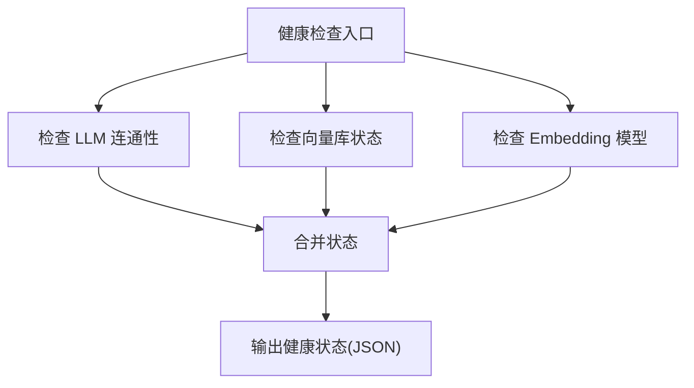
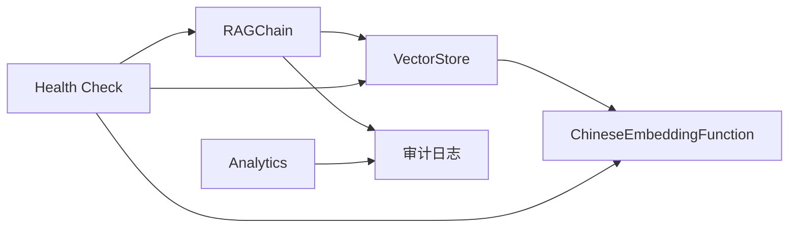

# 质量度量与监控

<cite>
**本文引用的文件**   
- [README.md](file://README.md)
- [requirements-dev.txt](file://requirements-dev.txt)
- [config.yaml](file://config.yaml)
- [Dockerfile](file://Dockerfile)
- [app.py](file://app.py)
- [rag/logging_config.py](file://rag/logging_config.py)
- [services/analytics.py](file://services/analytics.py)
- [rag/chain.py](file://rag/chain.py)
- [rag/vectorstore.py](file://rag/vectorstore.py)
- [rag/embeddings.py](file://rag/embeddings.py)
- [rag/health.py](file://rag/health.py)
- [rag/loader.py](file://rag/loader.py)
- [scripts/ingest.py](file://scripts/ingest.py)
- [tests/test_chain.py](file://tests/test_chain.py)
- [tests/test_embeddings.py](file://tests/test_embeddings.py)
</cite>

## 目录
1. [简介](#简介)
2. [项目结构](#项目结构)
3. [核心组件](#核心组件)
4. [架构总览](#架构总览)
5. [详细组件分析](#详细组件分析)
6. [依赖关系分析](#依赖关系分析)
7. [性能考量](#性能考量)
8. [故障排查指南](#故障排查指南)
9. [结论](#结论)
10. [附录](#附录)

## 简介
本文件面向“质量度量与监控”，围绕测试覆盖率统计方法（代码覆盖率、分支覆盖率、功能覆盖率）、质量度量指标体系（测试通过率、缺陷密度、修复时间、系统稳定性）、持续集成质量门禁（自动化测试执行、质量阈值检查、构建失败处理）、测试质量报告与趋势分析、以及质量度量数据的采集、存储与可视化展示，结合仓库现有实现进行系统化说明与落地建议。

## 项目结构
该项目采用“UI层 + 业务服务层 + 检索增强生成（RAG）引擎”的分层组织，配合审计日志与健康检查能力，形成可观测、可度量的质量基线。关键质量相关模块分布如下：
- 测试与覆盖率：pytest + pytest-cov（开发依赖）
- 日志与审计：统一结构化日志 + 审计日志（JSONL）
- 指标采集：审计日志解析与仪表盘统计
- 健康检查：LLM、向量库、Embedding 组件健康状态
- 可观测性：Streamlit 仪表盘展示查询量、延迟、反馈等指标

图表来源
- [app.py:1-189](file://app.py#L1-L189)
- [services/analytics.py:1-122](file://services/analytics.py#L1-L122)
- [rag/chain.py:1-610](file://rag/chain.py#L1-L610)
- [rag/vectorstore.py:1-209](file://rag/vectorstore.py#L1-L209)
- [rag/embeddings.py:1-48](file://rag/embeddings.py#L1-L48)
- [rag/loader.py:1-259](file://rag/loader.py#L1-L259)
- [scripts/ingest.py:1-62](file://scripts/ingest.py#L1-L62)
- [rag/logging_config.py:1-129](file://rag/logging_config.py#L1-L129)
- [rag/health.py:1-81](file://rag/health.py#L1-L81)
- [config.yaml:1-48](file://config.yaml#L1-L48)
- [Dockerfile:1-68](file://Dockerfile#L1-L68)

章节来源
- [README.md:1-3](file://README.md#L1-L3)
- [config.yaml:1-48](file://config.yaml#L1-L48)
- [Dockerfile:1-68](file://Dockerfile#L1-L68)

## 核心组件
- 测试与覆盖率
  - 使用 pytest 与 pytest-cov 作为测试与覆盖率工具，满足代码覆盖率、分支覆盖率与功能覆盖率的统计基础。
- 日志与审计
  - 统一结构化日志输出，支持控制台与文件双通道；审计日志以 JSONL 形式按日期分文件存储，便于后续统计分析。
- 指标采集与仪表盘
  - 从审计日志聚合查询总量、零结果查询、平均结果数、平均延迟、热门查询、正负反馈等指标，并在 Streamlit 仪表盘中展示。
- 健康检查
  - 提供 LLM 连通性、向量库状态、Embedding 模型加载健康检查，支撑系统稳定性监控。
- 可观测性与容器化
  - Dockerfile 中配置健康检查探针，结合应用启动参数，保障容器环境下的可用性与可观测性。

章节来源
- [requirements-dev.txt:1-5](file://requirements-dev.txt#L1-L5)
- [rag/logging_config.py:1-129](file://rag/logging_config.py#L1-L129)
- [services/analytics.py:1-122](file://services/analytics.py#L1-L122)
- [rag/health.py:1-81](file://rag/health.py#L1-L81)
- [Dockerfile:1-68](file://Dockerfile#L1-L68)

## 架构总览
下图展示了质量度量与监控在系统中的位置与交互关系：测试与覆盖率在开发阶段提供质量基线；运行期通过审计日志与健康检查采集质量数据；仪表盘对关键指标进行可视化呈现。

图表来源
- [requirements-dev.txt:1-5](file://requirements-dev.txt#L1-L5)
- [rag/logging_config.py:1-129](file://rag/logging_config.py#L1-L129)
- [services/analytics.py:1-122](file://services/analytics.py#L1-L122)
- [app.py:1-189](file://app.py#L1-L189)

## 详细组件分析

### 测试覆盖率统计与分析
- 覆盖率工具链
  - 使用 pytest 与 pytest-cov，可直接统计行覆盖率、分支覆盖率与函数/方法覆盖率。
- 覆盖率采集与报告
  - 建议在 CI 中以命令行参数启用覆盖率导出（如 XML/HTML），并与制品库或覆盖率平台对接。
- 功能覆盖率建议
  - 结合测试用例覆盖的场景集（输入域、异常路径、边界条件），通过测试矩阵与用例清单进行功能覆盖率度量。
- 代码覆盖率与分支覆盖率的落地
  - 在本地与 CI 中分别执行 pytest --cov=rag --cov-report=term-missing 或 --cov-report=xml/--cov-report=html，确保关键模块（如检索链、向量库、嵌入函数）达到预期阈值。

章节来源
- [requirements-dev.txt:1-5](file://requirements-dev.txt#L1-L5)
- [tests/test_chain.py:1-160](file://tests/test_chain.py#L1-L160)
- [tests/test_embeddings.py:1-30](file://tests/test_embeddings.py#L1-L30)

### 质量度量指标体系
- 测试通过率
  - 计算公式：测试通过数 / 测试总执行数。可在 CI 中统计并作为质量门禁指标。
- 缺陷密度
  - 计算公式：缺陷总数 / 代码行数（或功能点数）。建议结合审计日志中的错误事件与告警进行统计。
- 修复时间
  - 从缺陷发现到修复上线的时间周期，建议在版本发布记录中追踪并统计。
- 系统稳定性指标
  - 健康检查成功率、错误率、P95/P99 延迟、重启频率等。健康检查模块可提供 LLM、向量库、Embedding 的可用性状态。

章节来源
- [rag/health.py:1-81](file://rag/health.py#L1-L81)
- [services/analytics.py:1-122](file://services/analytics.py#L1-L122)

### 持续集成中的质量门禁
- 自动化测试执行
  - 在 CI 中执行 pytest，建议并行运行测试套件以缩短时长。
- 质量阈值检查
  - 通过 pytest-cov 的阈值配置（如行覆盖率、分支覆盖率）与最小阈值比较，未达标则阻断构建。
- 构建失败处理
  - 失败时输出详细日志与覆盖率报告，定位失败原因并触发通知。

图表来源
- [requirements-dev.txt:1-5](file://requirements-dev.txt#L1-L5)
- [tests/test_chain.py:1-160](file://tests/test_chain.py#L1-L160)
- [tests/test_embeddings.py:1-30](file://tests/test_embeddings.py#L1-L30)

### 测试质量报告生成、趋势分析与质量改进跟踪
- 报告生成
  - 使用 pytest-cov 的 XML/HTML 报告，结合 CI 的制品库进行归档。
- 趋势分析
  - 按周/月对比覆盖率、缺陷密度、平均延迟等指标，识别波动与回归。
- 改进跟踪
  - 建立改进任务清单，关联缺陷与用例，追踪修复闭环。

章节来源
- [services/analytics.py:1-122](file://services/analytics.py#L1-L122)
- [rag/logging_config.py:1-129](file://rag/logging_config.py#L1-L129)

### 质量度量数据的采集、存储与可视化展示
- 数据采集
  - 审计日志：在查询与反馈等关键路径记录结构化事件，包含用户、查询、结果数、耗时等字段。
  - 健康检查：定期输出组件健康状态与延迟。
- 数据存储
  - 审计日志以 JSONL 按日期分文件存储于 logs/audit 目录；健康检查状态可写入日志或指标系统。
- 可视化展示
  - 仪表盘聚合统计指标并在 Streamlit 中展示，支持管理员查看全局数据。

图表来源
- [rag/logging_config.py:1-129](file://rag/logging_config.py#L1-L129)
- [services/analytics.py:1-122](file://services/analytics.py#L1-L122)
- [app.py:1-189](file://app.py#L1-L189)

章节来源
- [rag/logging_config.py:1-129](file://rag/logging_config.py#L1-L129)
- [services/analytics.py:1-122](file://services/analytics.py#L1-L122)
- [app.py:1-189](file://app.py#L1-L189)

### 关键流程与质量保障

#### RAG 查询流程与可观测性
- 查询链路包含检索、重排、上下文构建、LLM 调用与流式输出，全程记录审计日志，便于延迟与错误分析。

图表来源
- [rag/chain.py:1-610](file://rag/chain.py#L1-L610)
- [rag/vectorstore.py:1-209](file://rag/vectorstore.py#L1-L209)
- [rag/embeddings.py:1-48](file://rag/embeddings.py#L1-L48)
- [rag/logging_config.py:1-129](file://rag/logging_config.py#L1-L129)

#### 健康检查流程
- 健康检查模块对 LLM、向量库、Embedding 进行连通性与可用性检测，输出统一健康状态。

图表来源
- [rag/health.py:1-81](file://rag/health.py#L1-L81)

## 依赖关系分析
- 组件耦合
  - RAGChain 依赖 VectorStore 与 Embeddings；VectorStore 依赖 EmbeddingFunction；审计日志贯穿查询链路；仪表盘依赖审计日志解析。
- 外部依赖
  - OpenAI SDK、ChromaDB、sentence-transformers、pytest 与 pytest-cov 等。
- 潜在风险
  - LLM 连通性与模型加载失败会影响查询链路；向量库持久化目录权限与磁盘空间影响入库与检索；审计日志文件过多可能影响解析性能。

图表来源
- [rag/chain.py:1-610](file://rag/chain.py#L1-L610)
- [rag/vectorstore.py:1-209](file://rag/vectorstore.py#L1-L209)
- [rag/embeddings.py:1-48](file://rag/embeddings.py#L1-L48)
- [rag/logging_config.py:1-129](file://rag/logging_config.py#L1-L129)
- [services/analytics.py:1-122](file://services/analytics.py#L1-L122)
- [rag/health.py:1-81](file://rag/health.py#L1-L81)

章节来源
- [rag/chain.py:1-610](file://rag/chain.py#L1-L610)
- [rag/vectorstore.py:1-209](file://rag/vectorstore.py#L1-L209)
- [rag/embeddings.py:1-48](file://rag/embeddings.py#L1-L48)
- [rag/logging_config.py:1-129](file://rag/logging_config.py#L1-L129)
- [services/analytics.py:1-122](file://services/analytics.py#L1-L122)
- [rag/health.py:1-81](file://rag/health.py#L1-L81)

## 性能考量
- 覆盖率与性能平衡
  - 在 CI 中启用并行测试与覆盖率导出，避免过度降低构建速度。
- 检索与生成性能
  - 通过上下文预算与 Reranker 缓存减少重复开销；合理设置 top_k 与阈值，避免无效检索。
- 日志与存储
  - 审计日志按天切分，定期清理旧文件；仪表盘统计仅读取近期日志，避免全量扫描。

## 故障排查指南
- 审计日志缺失或解析失败
  - 检查日志目录权限与磁盘空间；确认审计开关配置；核对 JSONL 格式与字段完整性。
- 查询延迟过高
  - 检查 LLM 连通性与限流配置；评估向量库文档数量与检索阈值；确认 Reranker 模型是否缓存命中。
- 健康检查失败
  - 核对 LLM API Base/Key；确认向量库持久化目录存在且可写；确认 Embedding 模型加载路径与网络可达性。
- 容器健康探针失败
  - 检查容器端口映射与健康检查 URL；确认应用启动参数与工作目录权限。

章节来源
- [rag/logging_config.py:1-129](file://rag/logging_config.py#L1-L129)
- [services/analytics.py:1-122](file://services/analytics.py#L1-L122)
- [rag/health.py:1-81](file://rag/health.py#L1-L81)
- [Dockerfile:1-68](file://Dockerfile#L1-L68)

## 结论
本项目已具备完善的日志与审计、健康检查与仪表盘展示能力，结合 pytest 与 pytest-cov 可实现测试覆盖率统计与质量门禁。建议在 CI 中固化覆盖率阈值与健康检查策略，完善趋势分析与改进跟踪闭环，持续提升系统质量与稳定性。

## 附录
- 关键实现参考路径
  - 测试与覆盖率：[requirements-dev.txt:1-5](file://requirements-dev.txt#L1-L5)
  - 审计日志与仪表盘：[rag/logging_config.py:1-129](file://rag/logging_config.py#L1-L129)、[services/analytics.py:1-122](file://services/analytics.py#L1-L122)
  - RAG 查询链路：[rag/chain.py:1-610](file://rag/chain.py#L1-L610)
  - 向量库与嵌入：[rag/vectorstore.py:1-209](file://rag/vectorstore.py#L1-L209)、[rag/embeddings.py:1-48](file://rag/embeddings.py#L1-L48)
  - 健康检查：[rag/health.py:1-81](file://rag/health.py#L1-L81)
  - 容器与健康探针：[Dockerfile:1-68](file://Dockerfile#L1-L68)
  - 文档加载与入库：[rag/loader.py:1-259](file://rag/loader.py#L1-L259)、[scripts/ingest.py:1-62](file://scripts/ingest.py#L1-L62)