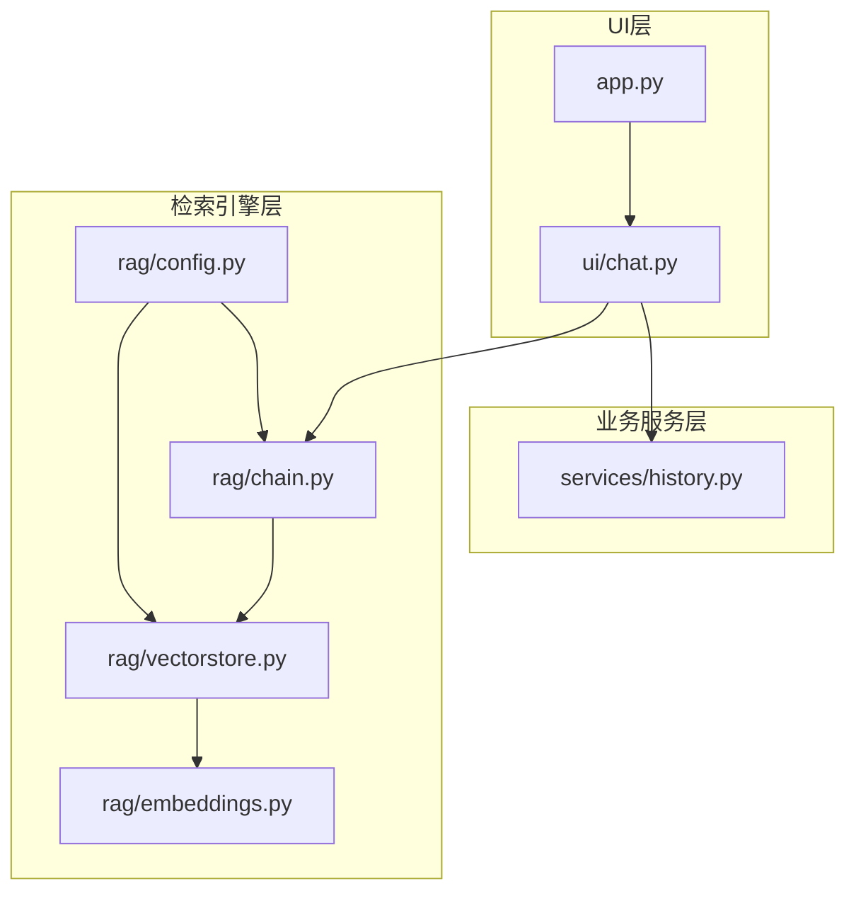
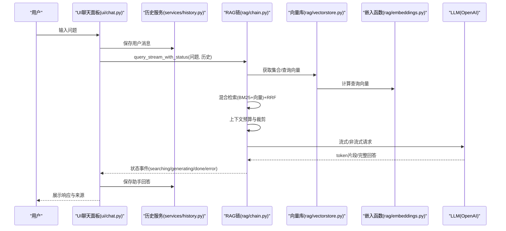
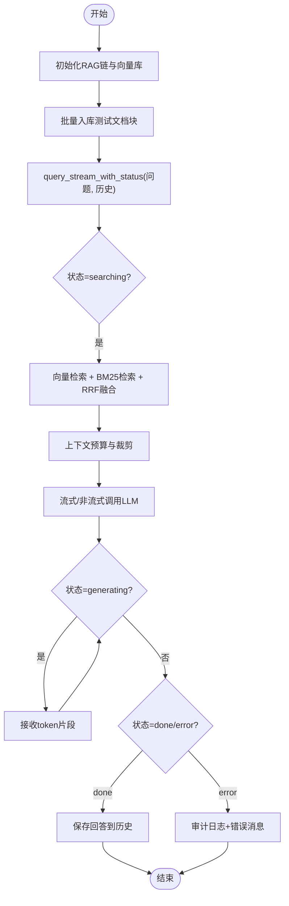
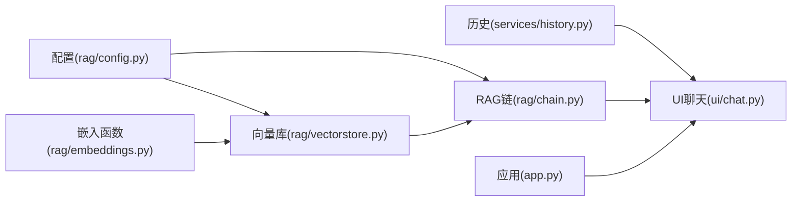

# 集成测试

<cite>
**本文引用的文件**   
- [rag/chain.py](file://rag/chain.py)
- [rag/vectorstore.py](file://rag/vectorstore.py)
- [rag/embeddings.py](file://rag/embeddings.py)
- [rag/config.py](file://rag/config.py)
- [config.yaml](file://config.yaml)
- [ui/chat.py](file://ui/chat.py)
- [services/history.py](file://services/history.py)
- [app.py](file://app.py)
- [tests/test_chain.py](file://tests/test_chain.py)
- [tests/test_vectorstore.py](file://tests/test_vectorstore.py)
- [tests/test_embeddings.py](file://tests/test_embeddings.py)
- [tests/test_history.py](file://tests/test_history.py)
</cite>

## 目录
1. [简介](#简介)
2. [项目结构](#项目结构)
3. [核心组件](#核心组件)
4. [架构总览](#架构总览)
5. [详细组件分析](#详细组件分析)
6. [依赖分析](#依赖分析)
7. [性能考量](#性能考量)
8. [故障排查指南](#故障排查指南)
9. [结论](#结论)
10. [附录](#附录)

## 简介
本文件面向RAG系统的集成测试设计，围绕以下目标展开：
- RAG链与向量数据库的集成测试：验证检索、融合、重排序、上下文构建与LLM调用的端到端流程。
- 嵌入模型与检索链的集成测试：验证嵌入函数、向量库、检索链之间的协同工作。
- 历史管理与UI组件的集成测试：验证会话管理、消息持久化与前端交互的联动。
- 模块间数据传递验证、接口调用正确性、异步/流式操作协调测试。
- 端到端对话流程测试：用户输入处理、检索生成流程、响应显示验证。
- 集成测试环境搭建、测试数据准备、测试场景设计的最佳实践。

## 项目结构
系统采用“UI组件 + 业务服务 + 检索引擎”的分层组织：
- UI层：Streamlit页面与组件，负责用户交互与状态展示。
- 业务服务层：历史管理、速率限制、分析统计等。
- 检索引擎层：配置解析、嵌入模型、向量库、RAG链。

图表来源
- [app.py:1-189](file://app.py#L1-L189)
- [ui/chat.py:1-190](file://ui/chat.py#L1-L190)
- [services/history.py:1-270](file://services/history.py#L1-L270)
- [rag/config.py:1-184](file://rag/config.py#L1-L184)
- [rag/embeddings.py:1-48](file://rag/embeddings.py#L1-L48)
- [rag/vectorstore.py:1-209](file://rag/vectorstore.py#L1-L209)
- [rag/chain.py:1-590](file://rag/chain.py#L1-L590)

章节来源
- [app.py:1-189](file://app.py#L1-L189)
- [ui/chat.py:1-190](file://ui/chat.py#L1-L190)
- [services/history.py:1-270](file://services/history.py#L1-L270)
- [rag/config.py:1-184](file://rag/config.py#L1-L184)
- [rag/embeddings.py:1-48](file://rag/embeddings.py#L1-L48)
- [rag/vectorstore.py:1-209](file://rag/vectorstore.py#L1-L209)
- [rag/chain.py:1-590](file://rag/chain.py#L1-L590)

## 核心组件
- 配置管理：提供LLM、嵌入、向量库、知识库、速率限制、UI等配置的加载与校验，并支持环境变量替换。
- 嵌入函数：封装sentence-transformers中文模型，延迟加载，适配ChromaDB的EmbeddingFunction接口。
- 向量库：ChromaDB客户端封装，支持集合管理、文档增删、检索、统计与清空。
- RAG链：混合检索（向量+BM25+RRF）、上下文预算与裁剪、查询改写、流式/非流式LLM调用、审计日志。
- 历史服务：按用户/会话隔离的消息持久化、会话列表与切换、导出Markdown/JSON。
- UI聊天面板：初始化预加载、会话历史加载、输入处理、流式响应展示、反馈收集。

章节来源
- [rag/config.py:1-184](file://rag/config.py#L1-L184)
- [rag/embeddings.py:1-48](file://rag/embeddings.py#L1-L48)
- [rag/vectorstore.py:1-209](file://rag/vectorstore.py#L1-L209)
- [rag/chain.py:1-590](file://rag/chain.py#L1-L590)
- [services/history.py:1-270](file://services/history.py#L1-L270)
- [ui/chat.py:1-190](file://ui/chat.py#L1-L190)

## 架构总览
下图展示了从用户输入到最终响应的关键调用链路与数据传递：

图表来源
- [ui/chat.py:96-190](file://ui/chat.py#L96-L190)
- [services/history.py:193-221](file://services/history.py#L193-L221)
- [rag/chain.py:408-508](file://rag/chain.py#L408-L508)
- [rag/vectorstore.py:47-59](file://rag/vectorstore.py#L47-L59)
- [rag/embeddings.py:31-47](file://rag/embeddings.py#L31-L47)

## 详细组件分析

### RAG链与向量数据库的集成测试
目标：
- 验证向量检索、BM25检索、RRF融合、上下文构建、LLM调用的端到端流程。
- 验证异常情况下的降级与错误上报（流式失败回退非流式、空结果、审计日志）。

建议测试场景：
- 正常检索：存在匹配文档块，返回若干结果，上下文裁剪合理，生成成功。
- 无匹配：向量检索无结果，触发BM25兜底或返回空结果。
- 流式失败：模拟流式调用异常，验证非流式回退与错误消息。
- 审计日志：验证查询耗时、命中数、摘要等字段记录。
- 多轮历史：注入最近N轮对话，验证上下文预算与消息截断。

图表来源
- [rag/chain.py:408-508](file://rag/chain.py#L408-L508)
- [rag/vectorstore.py:89-142](file://rag/vectorstore.py#L89-L142)
- [services/history.py:193-221](file://services/history.py#L193-L221)

章节来源
- [rag/chain.py:160-590](file://rag/chain.py#L160-L590)
- [rag/vectorstore.py:24-209](file://rag/vectorstore.py#L24-L209)
- [tests/test_chain.py:1-160](file://tests/test_chain.py#L1-L160)
- [tests/test_vectorstore.py:1-146](file://tests/test_vectorstore.py#L1-L146)

### 嵌入模型与检索链的集成测试
目标：
- 验证嵌入函数延迟加载、向量化维度与输出格式。
- 验证向量库检索与RAG链检索结果一致性。
- 验证BM25索引与向量库同步、去重与评分。

建议测试场景：
- 嵌入函数：默认模型名、本地路径覆盖、延迟加载行为。
- 向量库：新增/覆盖同名文档、按来源删除、集合切换、统计信息。
- 检索链：混合检索开启/关闭、阈值过滤、RRF融合、上下文长度控制。

章节来源
- [rag/embeddings.py:19-48](file://rag/embeddings.py#L19-L48)
- [rag/vectorstore.py:24-209](file://rag/vectorstore.py#L24-L209)
- [rag/chain.py:160-590](file://rag/chain.py#L160-L590)
- [tests/test_embeddings.py:1-30](file://tests/test_embeddings.py#L1-L30)
- [tests/test_vectorstore.py:1-146](file://tests/test_vectorstore.py#L1-L146)
- [tests/test_chain.py:1-160](file://tests/test_chain.py#L1-L160)

### 历史管理与UI组件的集成测试
目标：
- 验证会话创建、切换、标题更新、消息持久化。
- 验证UI聊天面板的输入处理、流式响应展示、错误提示与反馈收集。
- 验证导出Markdown/JSON的格式与内容完整性。

建议测试场景：
- 会话生命周期：创建、列表、切换、默认会话、标题更新。
- 消息持久化：用户/助手消息保存、时间戳、按会话隔离。
- UI交互：输入长度限制、速率限制、防重复提交、流式渲染、错误提示。
- 导出功能：Markdown/JSON导出内容校验。

章节来源
- [services/history.py:37-270](file://services/history.py#L37-L270)
- [ui/chat.py:19-190](file://ui/chat.py#L19-L190)
- [tests/test_history.py:1-98](file://tests/test_history.py#L1-L98)

## 依赖分析
- 配置依赖：RAG链与向量库均依赖配置模块；配置支持环境变量替换与Pydantic校验。
- 向量库依赖：ChromaDB客户端、自定义嵌入函数；提供集合管理与检索接口。
- RAG链依赖：向量库、嵌入函数、OpenAI客户端；实现混合检索、RRF、上下文构建与LLM调用。
- UI依赖：历史服务、预加载链、配置；负责渲染与事件驱动。
- 历史服务：JSON文件持久化、会话管理、导出工具。

图表来源
- [rag/config.py:138-184](file://rag/config.py#L138-L184)
- [rag/vectorstore.py:182-209](file://rag/vectorstore.py#L182-L209)
- [rag/embeddings.py:19-48](file://rag/embeddings.py#L19-L48)
- [rag/chain.py:176-590](file://rag/chain.py#L176-L590)
- [services/history.py:19-270](file://services/history.py#L19-L270)
- [ui/chat.py:19-190](file://ui/chat.py#L19-L190)
- [app.py:23-74](file://app.py#L23-L74)

章节来源
- [rag/config.py:1-184](file://rag/config.py#L1-L184)
- [rag/vectorstore.py:1-209](file://rag/vectorstore.py#L1-L209)
- [rag/embeddings.py:1-48](file://rag/embeddings.py#L1-L48)
- [rag/chain.py:1-590](file://rag/chain.py#L1-L590)
- [services/history.py:1-270](file://services/history.py#L1-L270)
- [ui/chat.py:1-190](file://ui/chat.py#L1-L190)
- [app.py:1-189](file://app.py#L1-L189)

## 性能考量
- 向量检索与BM25检索的组合：通过阈值过滤与RRF融合平衡召回与重排成本。
- 上下文预算：基于字符/token估算与截断策略，避免超出LLM上下文窗口。
- LLM调用：优先流式，失败自动回退非流式；指数退避重试提升稳定性。
- 嵌入模型延迟加载：首次调用时加载，避免启动时阻塞。
- 向量库统计：提供文档块与文件数统计，辅助容量规划。

章节来源
- [rag/chain.py:209-582](file://rag/chain.py#L209-L582)
- [rag/vectorstore.py:149-169](file://rag/vectorstore.py#L149-L169)
- [rag/embeddings.py:31-47](file://rag/embeddings.py#L31-L47)

## 故障排查指南
常见问题与定位要点：
- 初始化失败：UI等待预加载完成，若失败显示错误并提供重试按钮。
- LLM调用异常：流式失败自动回退非流式；若仍失败返回错误消息并记录审计日志。
- 无匹配结果：返回空结果并提示知识库无相关内容，建议确认文档入库或调整问法。
- 速率限制：超过最大请求/输入长度时拦截并提示。
- 历史导出：空会话导出Markdown提示“空会话”，JSON导出为空数组。

章节来源
- [ui/chat.py:24-45](file://ui/chat.py#L24-L45)
- [ui/chat.py:150-184](file://ui/chat.py#L150-L184)
- [services/history.py:247-269](file://services/history.py#L247-L269)

## 结论
通过上述集成测试设计，可系统验证RAG系统各模块在真实数据与接口约束下的协同表现，覆盖检索、生成、历史与UI交互的全链路行为。建议在CI中结合临时向量库与Mock LLM进行自动化回归，持续保障系统稳定性与性能。

## 附录

### 集成测试环境搭建最佳实践
- 配置隔离：使用独立的config.yaml副本，设置独立的向量库持久化目录与集合名，避免与生产数据冲突。
- 数据准备：准备少量代表性文档块，覆盖中文、英文、代码片段等场景；确保嵌入模型可离线加载或提前缓存。
- Mock策略：对LLM调用进行Mock，验证状态事件与错误分支；对网络依赖（如模型下载）进行本地镜像或缓存。
- 并发与异步：在UI侧模拟并发输入，验证防重复提交与历史截断；对流式响应进行断言。
- 日志与审计：开启审计日志，验证查询耗时、命中数、摘要字段；对异常路径进行日志断言。

### 端到端对话流程测试清单
- 用户输入处理：长度限制、重复提交拦截、会话标题自动命名。
- 检索生成流程：向量检索、BM25兜底、RRF融合、上下文预算、流式/非流式LLM调用。
- 响应显示验证：状态事件顺序、响应片段拼接、来源列表渲染、错误提示。
- 历史持久化：用户/助手消息保存、时间戳、按会话隔离、导出内容校验。

章节来源
- [config.yaml:1-48](file://config.yaml#L1-L48)
- [rag/config.py:117-184](file://rag/config.py#L117-L184)
- [ui/chat.py:96-190](file://ui/chat.py#L96-L190)
- [services/history.py:193-221](file://services/history.py#L193-L221)
- [rag/chain.py:408-508](file://rag/chain.py#L408-L508)