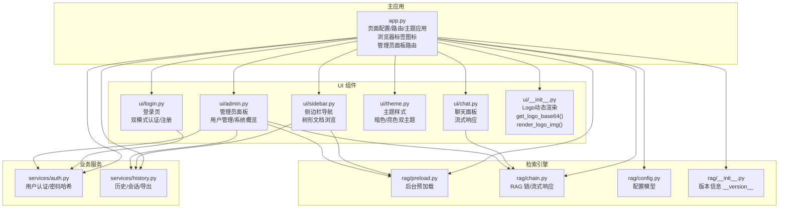
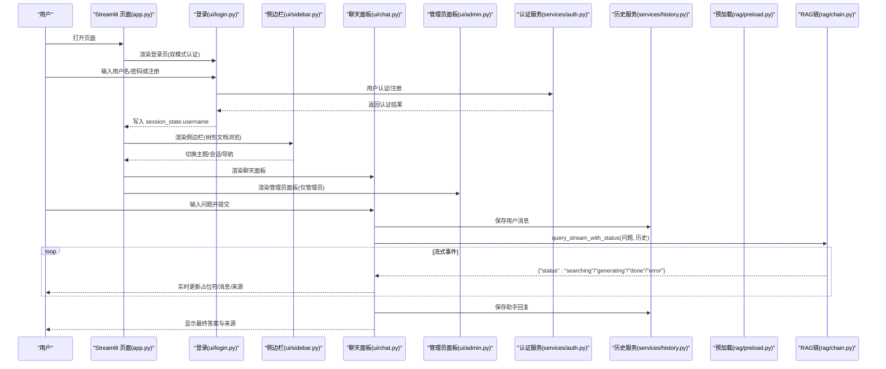
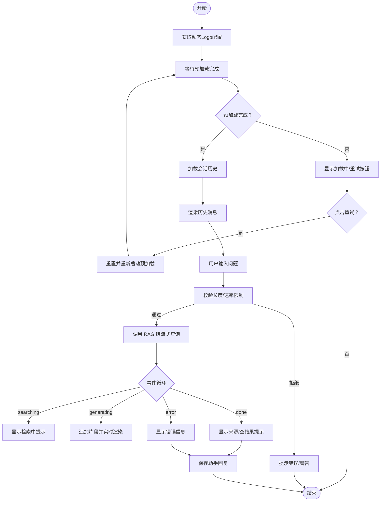
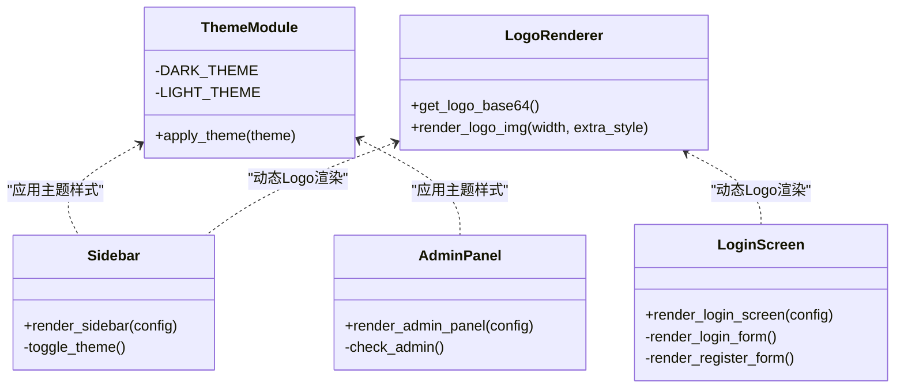
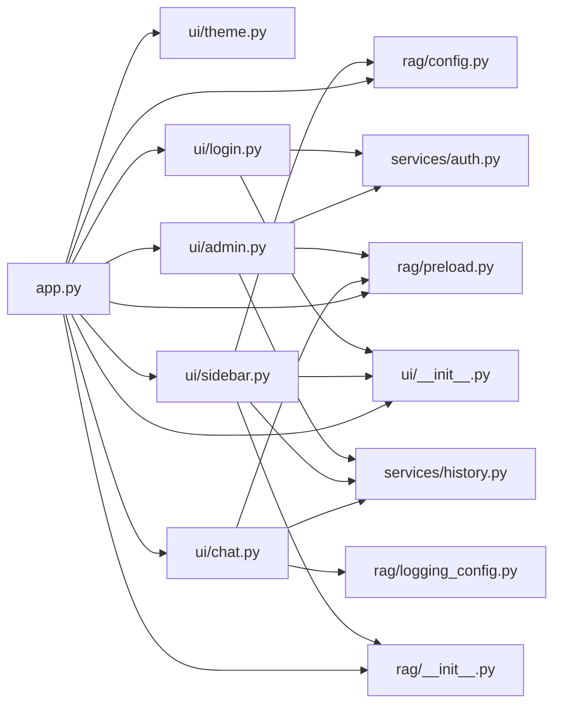

# 用户界面系统

<cite>
**本文引用的文件**
- [app.py](file://app.py)
- [config.yaml](file://config.yaml)
- [rag/config.py](file://rag/config.py)
- [ui/__init__.py](file://ui/__init__.py)
- [ui/chat.py](file://ui/chat.py)
- [ui/sidebar.py](file://ui/sidebar.py)
- [ui/theme.py](file://ui/theme.py)
- [ui/login.py](file://ui/login.py)
- [ui/admin.py](file://ui/admin.py)
- [services/auth.py](file://services/auth.py)
- [services/history.py](file://services/history.py)
- [rag/preload.py](file://rag/preload.py)
- [rag/logging_config.py](file://rag/logging_config.py)
- [rag/chain.py](file://rag/chain.py)
- [rag/__init__.py](file://rag/__init__.py)
</cite>

## 更新摘要
**变更内容**
- 全面增强的管理员面板：包含用户管理、密码重置、账户删除、聊天记录浏览和系统概览
- 重新设计的登录界面：支持注册和双模式认证（登录/注册）
- 改进的侧边栏树形导航：支持知识库文档的树形折叠浏览
- 增强的主题系统：支持暗色/亮色双主题切换
- 完善的用户认证服务：基于PBKDF2-SHA256的密码哈希存储
- 增强的历史记录管理：支持多会话管理和聊天记录导出

## 目录
1. [简介](#简介)
2. [项目结构](#项目结构)
3. [核心组件](#核心组件)
4. [架构总览](#架构总览)
5. [详细组件分析](#详细组件分析)
6. [依赖关系分析](#依赖关系分析)
7. [性能考量](#性能考量)
8. [故障排查指南](#故障排查指南)
9. [结论](#结论)
10. [附录](#附录)

## 简介
本文件面向"用户界面系统"的开发者与维护者，系统性阐述基于 Streamlit 的前端界面实现，涵盖聊天面板、侧边栏导航、登录认证、管理员面板与主题系统。文档重点解释实时对话界面的实现机制、消息处理流程与流式响应显示技术；描述用户交互模式、界面状态管理与响应式设计；并提供组件属性、事件处理、自定义选项说明，以及界面定制指南、主题切换机制与无障碍访问建议。目标是帮助 UI 开发者快速理解并高效扩展该界面系统。

**更新** 本版本引入了全面增强的管理员面板、重新设计的登录界面、改进的侧边栏树形导航和增强的主题系统等重要UI改进。

## 项目结构
界面系统采用"主应用 + UI 组件 + 业务服务 + 检索引擎"分层组织：
- 主应用入口负责页面配置、主题应用、会话初始化与页面路由
- UI 组件层包含聊天面板、侧边栏、登录页、管理员面板与主题样式，支持动态Logo渲染
- 业务服务层提供历史记录、会话管理、用户认证、速率限制与数据分析
- 检索引擎层提供预加载、RAG 链与流式响应，集成版本信息

**图表来源**
- [app.py:68-109](file://app.py#L68-L109)
- [ui/login.py:14-75](file://ui/login.py#L14-L75)
- [ui/sidebar.py:30-212](file://ui/sidebar.py#L30-L212)
- [ui/admin.py:15-45](file://ui/admin.py#L15-L45)
- [ui/theme.py:1-36](file://ui/theme.py#L1-L36)
- [services/auth.py:64-251](file://services/auth.py#L64-L251)
- [services/history.py:37-200](file://services/history.py#L37-L200)

**章节来源**
- [app.py:68-109](file://app.py#L68-L109)
- [config.yaml:57-79](file://config.yaml#L57-L79)
- [ui/admin.py:15-45](file://ui/admin.py#L15-L45)

## 核心组件
- 登录认证：提供企业风格登录界面，支持用户名密码认证和用户注册，具备动态Logo渲染与版权信息显示
- 侧边栏导航：包含动态Logo、版本信息展示、主题切换、会话管理、知识库文档树形浏览、历史记录与系统状态
- 聊天面板：展示历史消息、接收用户输入、调用 RAG 链进行流式回答、支持反馈
- 管理员面板：提供用户管理、密码重置、账户删除、聊天记录浏览和系统概览功能
- 主题系统：支持暗色/亮色双主题，通过配置与运行时切换控制
- 用户认证服务：基于PBKDF2-SHA256的密码哈希存储，支持用户注册、登录、密码修改和角色管理
- 历史与会话：按用户与会话隔离持久化，支持导出
- **新增** 树形文档浏览：支持知识库文档的树形折叠展示，增强文档导航体验

**更新** 新增管理员面板、树形文档浏览、增强的用户认证服务等核心组件。

**章节来源**
- [ui/login.py:14-233](file://ui/login.py#L14-L233)
- [ui/sidebar.py:30-491](file://ui/sidebar.py#L30-L491)
- [ui/admin.py:15-378](file://ui/admin.py#L15-L378)
- [services/auth.py:64-251](file://services/auth.py#L64-L251)
- [services/history.py:37-200](file://services/history.py#L37-L200)

## 架构总览
下图展示了从用户交互到检索生成的端到端流程，包括状态管理、事件触发与流式渲染，以及新增的管理员面板和树形文档浏览机制。

**图表来源**
- [app.py:68-109](file://app.py#L68-L109)
- [ui/login.py:186-227](file://ui/login.py#L186-L227)
- [ui/sidebar.py:30-212](file://ui/sidebar.py#L30-L212)
- [ui/admin.py:209-233](file://ui/admin.py#L209-L233)
- [services/auth.py:97-138](file://services/auth.py#L97-L138)
- [services/history.py:193-200](file://services/history.py#L193-L200)

## 详细组件分析

### 登录认证组件
- 功能要点
  - 企业风格卡片布局，居中显示品牌信息
  - **新增** 双模式认证：支持登录模式（用户名+密码）和注册模式（用户名+密码+确认密码）
  - **新增** 无密码模式：当 `auth.enabled=false` 时仅需输入用户名
  - 动态Logo渲染：智能检测logo.png文件，不存在时显示 `ui.logo_text` 配置的文本
  - 用户名输入与提交按钮，注册模式包含密码强度验证
  - 提交成功后写入 session_state.username 并触发重渲染
  - 版权信息动态显示：根据 `ui.company_name` 和 `ui.company_url` 动态生成版权信息
- 交互与事件
  - 用户点击"登录"或"注册"按钮触发相应验证
  - 注册模式下自动验证密码一致性
  - 成功后进入主界面，侧边栏与聊天面板可用
- 自定义选项
  - 标题、副标题、公司名、Logo 文本由配置项控制
  - **新增** `company_url` 字段支持品牌化部署
  - **新增** `min_password_length` 配置密码最小长度
- 无障碍建议
  - 为输入框设置合适的标签与占位符，确保键盘可达性

**更新** 新增双模式认证和无密码模式支持。

**章节来源**
- [ui/login.py:14-233](file://ui/login.py#L14-L233)
- [config.yaml:57-63](file://config.yaml#L57-L63)
- [ui/__init__.py:11-41](file://ui/__init__.py#L11-L41)

### 侧边栏导航组件
- 功能要点
  - 动态Logo渲染：智能检测logo.png文件，不存在时显示 `ui.logo_text` 配置的文本
  - **新增** 版本信息显示：显示 `v{__version__}` 版本号，增强应用识别度
  - 用户信息与主题切换按钮
  - 导航页签（智能问答/仪表盘/管理员面板），支持当前页高亮
  - 会话管理：新建、切换、清空会话
  - **新增** 知识库文档树形浏览：支持关键词搜索、目录折叠展开
  - 历史记录：按日期展开，显示部分消息
  - 系统状态：模型/接口信息、向量库就绪状态
  - 操作按钮：清除会话、断开连接（保留 chain 与 theme）
  - 版权信息动态显示：根据 `ui.company_name` 和 `ui.company_url` 动态生成版权信息
- 交互与事件
  - 点击导航按钮切换页面并重渲染
  - 点击会话按钮切换活跃会话并清空本地消息
  - 点击"断开连接"保留 chain 与 theme，清理用户状态
  - **新增** 树形文档支持：点击目录展开/折叠，点击文件查看元数据
- 自定义选项
  - 标题、副标题、公司名、默认主题由配置项控制
  - **新增** `company_url` 字段支持品牌化部署
- 无障碍建议
  - 为按钮添加工具提示与语义化标签
  - 展开面板使用 expander 并提供折叠/展开状态提示

**更新** 新增版本信息显示、知识库文档树形浏览和增强的版权信息功能。

**章节来源**
- [ui/sidebar.py:30-491](file://ui/sidebar.py#L30-L491)
- [config.yaml:71-79](file://config.yaml#L71-L79)
- [rag/__init__.py:3](file://rag/__init__.py#L3)

### 聊天面板组件
- 功能要点
  - 首次加载等待预加载完成，失败时提供重试
  - 加载持久化会话历史，渲染历史消息与时间戳
  - 用户输入框，防重复提交与长度限制
  - 速率限制：请求频率与输入长度控制
  - 调用 RAG 链进行流式回答，实时更新占位符
  - 显示参考来源，支持空结果提示
  - 助手消息支持"有帮助/无帮助"反馈
  - 动态Logo渲染：智能检测logo.png文件，不存在时显示 `ui.logo_text` 配置的文本
  - **新增** 版本信息显示：在聊天界面顶部显示应用版本号
- 实时对话与流式响应
  - 通过 RAG 链的 query_stream_with_status 事件驱动
  - 事件状态包括 searching/generating/done/error
  - 生成阶段增量拼接并实时渲染
- 状态管理
  - 使用 st.session_state 存储 theme、messages、page、active session 等
  - 预加载状态通过独立模块保持跨 rerun 可见
- 自定义选项
  - 最大对话轮数、输入长度限制、默认主题等由配置控制
  - **新增** `company_url` 字段支持品牌化部署
- 无障碍建议
  - 为输入框提供清晰的占位符与提示
  - 反馈按钮提供图标+文字提示，确保可读性

**更新** 新增版本信息显示功能。

**图表来源**
- [ui/chat.py:19-190](file://ui/chat.py#L19-L190)
- [rag/preload.py:22-73](file://rag/preload.py#L22-L73)
- [rag/chain.py:408-508](file://rag/chain.py#L408-L508)
- [services/history.py:182-200](file://services/history.py#L182-L200)
- [ui/__init__.py:11-41](file://ui/__init__.py#L11-L41)

**章节来源**
- [ui/chat.py:19-190](file://ui/chat.py#L19-L190)
- [rag/preload.py:22-73](file://rag/preload.py#L22-L73)
- [rag/chain.py:408-508](file://rag/chain.py#L408-L508)
- [services/history.py:182-200](file://services/history.py#L182-L200)
- [ui/__init__.py:11-41](file://ui/__init__.py#L11-L41)

### 管理员面板组件
- 功能要点
  - **新增** 用户管理：显示所有用户列表，支持密码重置和账户删除
  - **新增** 聊天记录浏览：管理员可查看所有用户的聊天记录，支持分页和导出
  - **新增** 系统概览：显示用户统计、向量库状态、LLM配置和系统配置
  - **新增** 权限控制：仅管理员可访问，自动判断用户角色
  - **新增** 版本信息显示：在管理员面板顶部显示应用版本号
  - **新增** 错误处理：管理员面板加载失败时提供详细错误信息
- 用户管理功能
  - 统计卡片：总用户数、管理员数量、普通用户数量
  - 用户列表：显示用户名、角色、注册时间，支持重置密码和删除操作
  - 密码重置：管理员可为任意用户重置密码，无需旧密码
  - 账户删除：管理员可删除用户账户，保护最后一个管理员账户
- 聊天记录浏览
  - 用户选择：下拉菜单选择要查看的用户
  - 统计信息：显示会话数、消息数、最后活跃时间
  - 分页显示：每页20条消息，支持页码跳转
  - 导出功能：支持将用户聊天记录导出为TXT文件
- 系统概览
  - 用户统计：注册用户、有聊天记录的用户、活跃用户
  - 向量库状态：文档块数量、文件数量、集合名
  - LLM配置：模型、接口、上下文窗口、Embedding、Reranker
  - 系统配置：版本、数据目录、知识库目录、分块参数、速率限制、认证配置
- 交互与事件
  - 点击"用户管理"、"聊天记录"、"系统概览"标签页切换功能
  - 点击"重置密码"弹出密码重置对话框
  - 点击"删除"弹出删除确认对话框
  - 选择用户后自动加载其聊天记录
- 自定义选项
  - 通过配置文件控制认证启用状态和用户文件路径
  - 支持自定义用户数据文件位置
- 无障碍建议
  - 为按钮添加工具提示与语义化标签
  - 表格数据提供清晰的列标题和排序功能

**新增** 全面增强的管理员面板，提供用户管理、聊天记录浏览和系统概览功能。

**章节来源**
- [ui/admin.py:15-378](file://ui/admin.py#L15-L378)
- [services/auth.py:97-224](file://services/auth.py#L97-L224)
- [services/history.py:182-200](file://services/history.py#L182-L200)

### 用户认证服务组件
- 功能要点
  - **新增** PBKDF2-SHA256密码哈希：使用随机盐值进行安全密码存储
  - **新增** 用户注册：支持用户名长度验证、密码强度检查、自动角色分配
  - **新增** 用户登录：验证用户名存在性和密码正确性
  - **新增** 密码修改：需要提供正确原密码
  - **新增** 密码重置：管理员可重置任意用户密码（无需旧密码）
  - **新增** 角色管理：支持管理员和普通用户角色
  - **新增** 用户列表：管理员可查看所有用户信息
  - **新增** 用户删除：支持删除用户账户，保护最后一个管理员
- 安全特性
  - 密码使用PBKDF2-SHA256算法，迭代次数100,000次
  - 每个用户拥有独立随机盐值
  - 用户数据持久化在JSON文件中，支持线程安全
- 数据结构
  - 用户数据文件：`data/users.json`
  - 数据结构：包含用户字典，每个用户包含密码哈希、盐值、角色、创建时间
  - 首个注册用户自动设为管理员
- 自定义选项
  - 通过配置文件控制认证启用状态和用户文件路径
  - 支持自定义最小密码长度
- 无障碍建议
  - 密码强度提示应清晰可见
  - 错误信息应具体明确，便于用户理解

**新增** 基于PBKDF2-SHA256的安全用户认证服务。

**章节来源**
- [services/auth.py:64-251](file://services/auth.py#L64-L251)
- [config.yaml:57-63](file://config.yaml#L57-L63)

### Logo动态渲染组件
- 功能要点
  - **新增** 智能Logo检测：自动检测项目根目录下的 `logo.png` 文件是否存在
  - **新增** Base64编码：将图片转换为data URI格式，无需外部文件依赖
  - **新增** Fallback机制：当logo.png不存在时，返回 `ui.logo_text` 配置的文本符号
  - **新增** 可配置尺寸：支持通过 `width` 参数控制Logo大小
  - **新增** 样式定制：支持额外CSS样式的传入
- 技术实现
  - `get_logo_base64()`: 读取logo.png并返回Base64编码的data URI
  - `render_logo_img()`: 生成HTML img标签，支持width和样式参数
  - 自动路径解析：基于项目根目录定位logo.png文件
- 自定义选项
  - 通过 `ui.logo_text` 配置fallback文本符号
  - 支持不同尺寸的Logo显示需求
- 无障碍建议
  - img标签包含 `alt="logo"` 属性，确保屏幕阅读器可识别

**新增** 专门的Logo动态渲染组件，提供智能Logo管理和品牌化支持。

**章节来源**
- [ui/__init__.py:11-41](file://ui/__init__.py#L11-L41)
- [config.yaml:71-79](file://config.yaml#L71-L79)

### 主题系统组件
- 功能要点
  - 支持暗色/亮色双主题，通过配置与运行时切换控制
  - 应用主题时注入内联样式，覆盖 Streamlit 默认样式
  - 主题样式覆盖全局背景、侧边栏、气泡、输入框、按钮、展开面板、状态提示、指标卡片、链接与代码、滚动条等
- 切换机制
  - 侧边栏顶部提供主题按钮，点击后切换并重渲染
  - 主题状态保存在 session_state 中，页面初始化时应用
- 自定义选项
  - 默认主题由配置项 ui.default_theme 指定
- 无障碍建议
  - 高对比度颜色与可读性优先，避免纯色背景

**图表来源**
- [ui/theme.py:1-36](file://ui/theme.py#L1-L36)
- [ui/sidebar.py:56-60](file://ui/sidebar.py#L56-L60)
- [ui/admin.py:15-45](file://ui/admin.py#L15-L45)
- [ui/login.py:14-75](file://ui/login.py#L14-L75)
- [ui/__init__.py:11-41](file://ui/__init__.py#L11-L41)

**章节来源**
- [ui/theme.py:1-36](file://ui/theme.py#L1-L36)
- [ui/sidebar.py:56-60](file://ui/sidebar.py#L56-L60)
- [config.yaml:71-79](file://config.yaml#L71-L79)

### 历史与会话管理
- 会话管理
  - 按用户隔离，记录会话标题、创建/更新时间、消息数量
  - 支持创建、切换、更新标题、列出会话
- 消息持久化
  - 按会话 JSON 文件存储，支持导出 Markdown
  - 支持按日期兼容旧格式
- 历史记录
  - 按日期展开，显示部分消息与时间戳
- 事件审计
  - 审计日志记录查询、反馈等操作，支持开关控制

**章节来源**
- [services/history.py:37-200](file://services/history.py#L37-L200)
- [rag/logging_config.py:86-129](file://rag/logging_config.py#L86-L129)

### 树形文档浏览组件
- 功能要点
  - **新增** 知识库文档树形展示：支持目录折叠展开
  - **新增** 关键词搜索：支持按标题和路径搜索文档
  - **新增** 文档元数据：显示文件大小、路径等信息
  - **新增** 缓存机制：仅在目录变化时重新扫描文件元数据
  - **新增** Doxygen兼容：支持Doxygen生成的文档文件名解析
- 技术实现
  - `_build_file_tree()`: 将文件列表构建为树结构
  - `_render_file_tree()`: 递归渲染文件树（HTML details/summary实现）
  - `_load_files_meta_cached()`: 带缓存的文件元数据加载
  - `_parse_doxygen_name()`: 解析Doxygen文件名为树路径
- 自定义选项
  - 通过配置文件控制知识库目录和分块参数
  - 支持自定义文档目录位置
- 无障碍建议
  - 为展开/折叠按钮提供清晰的视觉指示
  - 为搜索框提供占位符和辅助文本

**新增** 专门的树形文档浏览组件，提供知识库文档的高效导航。

**章节来源**
- [ui/sidebar.py:214-491](file://ui/sidebar.py#L214-L491)
- [config.yaml:46-49](file://config.yaml#L46-L49)

### 版本信息显示组件
- 功能要点
  - **新增** 标题栏版本信息：聊天界面顶部显示应用版本号
  - **新增** 侧边栏版本信息：侧边栏区域显示应用版本号
  - **新增** 管理员面板版本信息：管理员面板顶部显示应用版本号
  - **新增** 版本号来源：从 `rag/__init__.py` 中的 `__version__` 获取
  - **新增** 版本号配置：支持从 `config.yaml` 中读取版本号
- 技术实现
  - `_render_chat_page()` 函数中集成版本信息显示
  - 侧边栏通过 `__version__` 变量显示版本号
  - 管理员面板同样集成版本信息显示
  - 版本号获取优先级：配置文件 > 硬编码默认值
- 自定义选项
  - 通过 `config.yaml` 中的 `version` 字段自定义版本号
  - 支持环境变量替换机制
- 无障碍建议
  - 版本信息使用较小字体显示，不影响主要内容阅读

**新增** 专门的版本信息显示组件，提供统一的版本标识功能。

**章节来源**
- [app.py:111-125](file://app.py#L111-L125)
- [ui/sidebar.py:40-46](file://ui/sidebar.py#L40-L46)
- [ui/admin.py:22-29](file://ui/admin.py#L22-L29)
- [rag/__init__.py:3](file://rag/__init__.py#L3)
- [config.yaml:4-5](file://config.yaml#L4-L5)

### 综合错误详情组件
- 功能要点
  - **新增** 详细错误追踪：提供完整的堆栈跟踪信息
  - **新增** 错误日志文件：自动写入磁盘便于离线诊断
  - **新增** 多层次错误信息：提供摘要和详细两种错误信息
  - **新增** 错误恢复机制：支持重置和重新加载
- 技术实现
  - `get_error()`：获取简要错误信息（含异常类型）
  - `get_error_detail()`：获取完整错误详情（含堆栈跟踪）
  - `_write_error_log()`：将错误信息写入磁盘文件
  - 错误信息包含：Python版本、系统路径、异常类型、完整堆栈
- 自定义选项
  - 错误日志文件自动命名：包含时间戳
  - 支持错误日志文件路径配置
- 无障碍建议
  - 错误信息使用易读的格式显示
  - 提供重试按钮便于用户自助恢复

**新增** 专门的综合错误详情组件，提供完善的错误诊断和恢复机制。

**章节来源**
- [rag/preload.py:105-141](file://rag/preload.py#L105-L141)
- [rag/preload.py:75-93](file://rag/preload.py#L75-L93)

## 依赖关系分析
- 主应用依赖
  - 配置模块：获取全局配置与 UI 设置
  - 主题模块：应用主题样式
  - 预加载模块：后台加载检索引擎
  - UI 组件：登录、侧边栏、聊天面板、管理员面板、Logo渲染
  - 业务服务：历史与会话、用户认证
  - 版本模块：提供应用版本信息
- UI 组件内部依赖
  - 聊天面板依赖预加载状态、历史服务、审计日志、Logo渲染
  - 侧边栏依赖配置、历史服务、知识服务、Logo渲染、版本信息
  - 管理员面板依赖认证服务、历史服务、预加载状态
  - 主题模块独立，仅依赖 Streamlit
  - 登录模块依赖配置、Logo渲染、认证服务
  - Logo渲染模块：提供动态Logo功能
  - 版本信息模块：提供版本号显示功能
- 业务服务依赖
  - 用户认证服务：提供用户管理、密码哈希、角色管理
  - 历史服务：提供会话管理、消息持久化、导出功能
- 检索引擎依赖
  - RAG 链提供流式查询接口，事件驱动 UI 更新

**图表来源**
- [app.py:68-109](file://app.py#L68-L109)
- [ui/chat.py:8-16](file://ui/chat.py#L8-L16)
- [ui/sidebar.py:10-28](file://ui/sidebar.py#L10-L28)
- [ui/admin.py:51-56](file://ui/admin.py#L51-L56)
- [services/auth.py:64-71](file://services/auth.py#L64-L71)
- [services/history.py:16-24](file://services/history.py#L16-L24)
- [ui/__init__.py:11-41](file://ui/__init__.py#L11-L41)
- [rag/__init__.py:3](file://rag/__init__.py#L3)

**章节来源**
- [app.py:68-109](file://app.py#L68-L109)
- [ui/chat.py:8-16](file://ui/chat.py#L8-L16)
- [ui/sidebar.py:10-28](file://ui/sidebar.py#L10-L28)
- [ui/admin.py:51-56](file://ui/admin.py#L51-L56)
- [services/auth.py:64-71](file://services/auth.py#L64-L71)
- [services/history.py:16-24](file://services/history.py#L16-L24)
- [ui/__init__.py:11-41](file://ui/__init__.py#L11-L41)
- [rag/__init__.py:3](file://rag/__init__.py#L3)

## 性能考量
- 预加载策略
  - 后台线程加载检索引擎，避免首次请求阻塞
  - 状态持久于独立模块，跨 rerun 可见
- 流式响应
  - RAG 链分阶段返回事件，UI 实时更新，降低感知延迟
  - 失败时自动降级为非流式，保证可用性
- 会话与历史
  - 仅加载当前会话历史，避免全量加载
  - 限制会话消息数量与标题长度，减少存储与渲染压力
- 主题与渲染
  - 主题样式一次性注入，避免频繁重计算
  - 使用占位符与增量渲染，减少 DOM 重绘
- **新增** Logo渲染性能
  - Base64编码的Logo在内存中缓存，避免重复文件读取
  - 智能检测机制仅在组件初始化时执行一次
- **新增** 树形文档浏览性能
  - 文件元数据缓存：仅在目录指纹变化时重新扫描
  - 目录指纹基于文件数量和最新修改时间计算
  - HTML details/summary实现避免深层嵌套限制
- **新增** 管理员面板性能
  - 聊天记录分页显示，避免大量数据一次性渲染
  - 用户列表虚拟滚动，支持大数据集浏览
- **新增** 版本信息性能
  - 版本号信息在应用启动时获取，避免重复计算
  - 侧边栏和标题栏的版本信息共享同一数据源

**更新** 新增树形文档浏览、管理员面板和版本信息的性能考量。

**章节来源**
- [rag/preload.py:22-73](file://rag/preload.py#L22-L73)
- [rag/chain.py:408-508](file://rag/chain.py#L408-L508)
- [services/history.py:182-200](file://services/history.py#L182-L200)
- [ui/__init__.py:11-41](file://ui/__init__.py#L11-L41)
- [ui/sidebar.py:217-250](file://ui/sidebar.py#L217-L250)
- [ui/admin.py:227-248](file://ui/admin.py#L227-L248)
- [rag/__init__.py:3](file://rag/__init__.py#L3)

## 故障排查指南
- 预加载失败
  - 现象：聊天面板显示初始化失败与重试按钮
  - 处理：检查 LLM API 配置与网络连接，点击重试重新加载
  - **新增** 详细错误信息：查看综合错误详情面板获取完整堆栈跟踪
- 流式响应异常
  - 现象：生成阶段报错或无内容
  - 处理：查看审计日志与系统日志，确认模型可用性与上下文长度
- 会话历史缺失
  - 现象：切换会话后消息为空
  - 处理：确认历史文件存在与格式正确，必要时重建会话
- 主题切换无效
  - 现象：点击主题按钮无变化
  - 处理：确认 session_state.theme 更新与页面重渲染
- **新增** 登录认证失败
  - 现象：登录或注册失败
  - 处理：检查用户名密码格式，确认认证服务正常运行
- **新增** 管理员权限不足
  - 现象：访问管理员面板显示权限不足
  - 处理：确认用户角色为管理员，检查认证配置
- **新增** 树形文档浏览异常
  - 现象：知识库文档无法显示或搜索无效
  - 处理：检查知识库目录配置，确认文档文件存在
- **新增** Logo显示问题
  - 现象：Logo显示为文本符号而非图片
  - 处理：确认项目根目录存在 `logo.png` 文件，检查文件权限
- **新增** 版本信息显示异常
  - 现象：侧边栏版本号显示不正确
  - 处理：检查 `rag/__init__.py` 中的 `__version__` 定义
- **新增** 错误诊断工具
  - 现象：需要详细错误信息进行故障排查
  - 处理：查看预加载模块生成的错误日志文件，包含完整堆栈跟踪

**更新** 新增管理员面板、树形文档浏览、登录认证和版本信息相关的故障排查指南。

**章节来源**
- [ui/chat.py:24-45](file://ui/chat.py#L24-L45)
- [rag/logging_config.py:86-129](file://rag/logging_config.py#L86-L129)
- [services/history.py:182-200](file://services/history.py#L182-L200)
- [ui/__init__.py:11-41](file://ui/__init__.py#L11-L41)
- [ui/admin.py:214-219](file://ui/admin.py#L214-L219)
- [ui/sidebar.py:217-250](file://ui/sidebar.py#L217-L250)
- [rag/__init__.py:3](file://rag/__init__.py#L3)
- [rag/preload.py:75-93](file://rag/preload.py#L75-L93)

## 结论
该用户界面系统以 Streamlit 为基础，结合后台预加载与 RAG 链的流式响应，提供了流畅、可定制的企业级对话体验。通过明确的组件职责、完善的会话与历史管理、灵活的主题系统与简洁的登录流程，开发者可以在此基础上快速扩展功能、优化性能并提升用户体验。

**更新** 本版本显著增强了系统功能完整性，通过全面的管理员面板、重新设计的登录界面、改进的侧边栏树形导航和增强的主题系统，为企业用户提供更加专业和统一的品牌体验。同时新增了用户认证服务、树形文档浏览、版本信息显示等核心功能，提供了更完善的系统管理能力和更好的用户体验。

## 附录

### 组件属性与事件清单
- 登录组件
  - 属性：标题、副标题、公司名、Logo 文本、动态Logo配置、认证配置
  - 事件：用户名提交、密码验证、注册提交、双模式切换
- 侧边栏组件
  - 属性：默认主题、管理员标识、系统状态、动态Logo、版本信息、版权信息、文档树配置
  - 事件：主题切换、导航切换、会话切换/新建、清除会话、断开连接、文档搜索
- 聊天面板
  - 属性：最大对话轮数、输入长度限制、默认主题、动态Logo、版本信息
  - 事件：用户输入、流式事件（searching/generating/done/error）、反馈
- **新增** 管理员面板组件
  - 属性：用户管理配置、聊天记录配置、系统概览配置、版本信息
  - 事件：用户列表显示、密码重置、账户删除、聊天记录浏览、系统配置查看
- **新增** 用户认证服务组件
  - 属性：用户数据文件、密码哈希配置、角色配置
  - 事件：用户注册、用户登录、密码修改、密码重置、用户删除
- **新增** 树形文档浏览组件
  - 属性：文档目录配置、搜索配置、缓存配置、Doxygen兼容配置
  - 事件：目录展开/折叠、文件点击、关键词搜索、元数据显示
- **新增** Logo渲染组件
  - 属性：Logo文件路径、Base64编码、fallback文本、尺寸配置
  - 事件：Logo检测、图片加载、文本回退
- **新增** 版本信息组件
  - 属性：版本号、版本配置、版本来源
  - 事件：版本号获取、版本信息显示
- **新增** 错误详情组件
  - 属性：错误信息、堆栈跟踪、错误日志文件
  - 事件：错误捕获、错误记录、错误恢复
- 主题系统
  - 属性：暗色/亮色主题样式
  - 事件：主题切换、页面初始化应用

**更新** 新增管理员面板、用户认证服务、树形文档浏览、Logo渲染、版本信息和错误详情组件的属性和事件清单。

**章节来源**
- [config.yaml:57-79](file://config.yaml#L57-L79)
- [ui/sidebar.py:30-491](file://ui/sidebar.py#L30-L491)
- [ui/admin.py:15-378](file://ui/admin.py#L15-L378)
- [services/auth.py:64-251](file://services/auth.py#L64-L251)
- [ui/__init__.py:11-41](file://ui/__init__.py#L11-L41)
- [rag/__init__.py:3](file://rag/__init__.py#L3)
- [rag/preload.py:105-141](file://rag/preload.py#L105-L141)

### 界面定制指南
- 修改品牌信息
  - 在配置文件中调整 ui.title、ui.subtitle、ui.company_name、ui.logo_text、ui.company_url
- 自定义主题
  - 在主题模块中扩展样式覆盖范围，或新增主题常量
- 调整对话行为
  - 在配置文件中修改 rate_limit、max_conversation_turns 等参数
- 扩展侧边栏功能
  - 在侧边栏模块中增加新的导航项与操作按钮
- **新增** 管理员面板定制
  - 配置管理员权限：通过 `auth.enabled` 和 `auth.admin_users` 控制
  - 自定义用户管理界面：调整用户列表显示字段和操作按钮
  - 配置聊天记录导出格式：修改导出函数和文件格式
- **新增** 用户认证定制
  - 配置认证方式：通过 `auth.enabled` 控制是否启用认证
  - 自定义密码策略：调整 `auth.min_password_length` 和用户数据文件路径
  - 管理用户角色：通过用户数据文件中的 role 字段管理管理员权限
- **新增** 树形文档浏览定制
  - 配置知识库目录：通过 `knowledge.docs_directory` 指定文档根目录
  - 调整文档分块参数：修改 `knowledge.chunk_size` 和 `knowledge.chunk_overlap`
  - 自定义文档图标：在 `_render_file_html()` 中调整文件图标显示
- **新增** Logo定制
  - 将自定义Logo文件命名为 `logo.png` 放置在项目根目录
  - 如需使用文本Logo，配置 `ui.logo_text` 为期望的符号
- **新增** 版本信息定制
  - 修改 `rag/__init__.py` 中的 `__version__` 常量
  - 或在 `config.yaml` 中的 `version` 字段设置自定义版本号
- **新增** 错误信息定制
  - 配置错误日志文件路径和格式
  - 自定义错误信息显示样式
- **新增** 标题栏定制
  - 调整标题栏布局和样式
  - 自定义版本信息显示位置和格式

**更新** 新增管理员面板、用户认证、树形文档浏览、Logo、版本信息、错误信息和标题栏的定制指南。

**章节来源**
- [config.yaml:57-79](file://config.yaml#L57-L79)
- [ui/theme.py:1-36](file://ui/theme.py#L1-L36)
- [ui/sidebar.py:30-491](file://ui/sidebar.py#L30-L491)
- [ui/admin.py:15-378](file://ui/admin.py#L15-L378)
- [services/auth.py:64-251](file://services/auth.py#L64-L251)
- [ui/__init__.py:11-41](file://ui/__init__.py#L11-L41)
- [rag/__init__.py:3](file://rag/__init__.py#L3)
- [rag/preload.py:75-93](file://rag/preload.py#L75-L93)