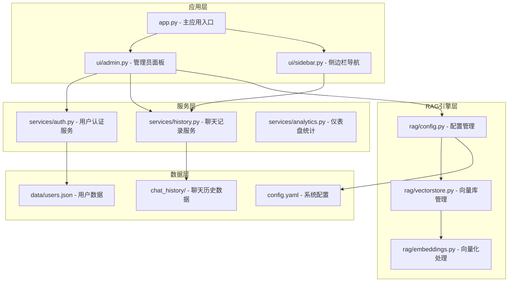
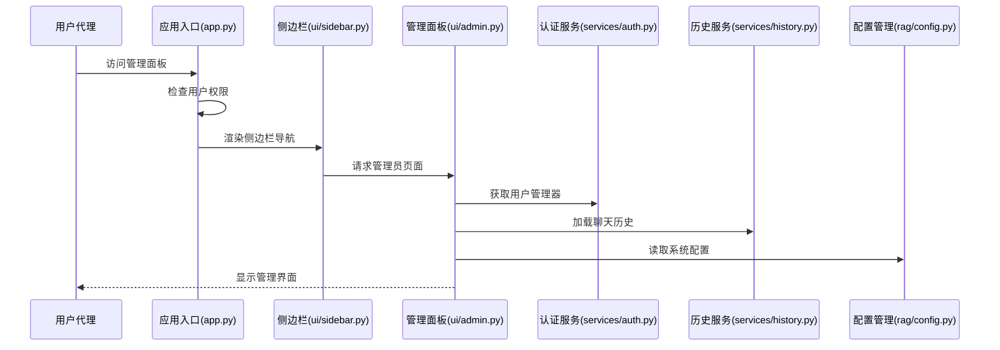
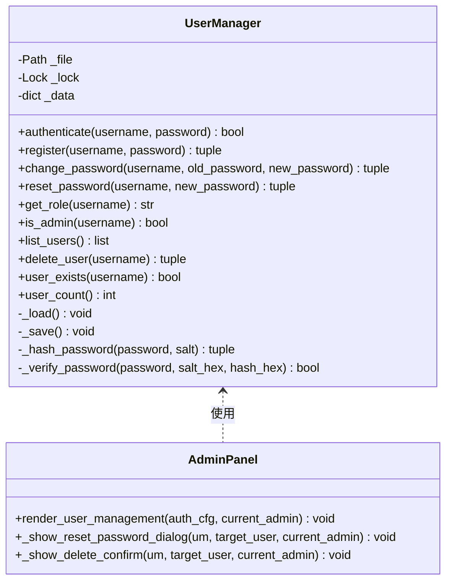
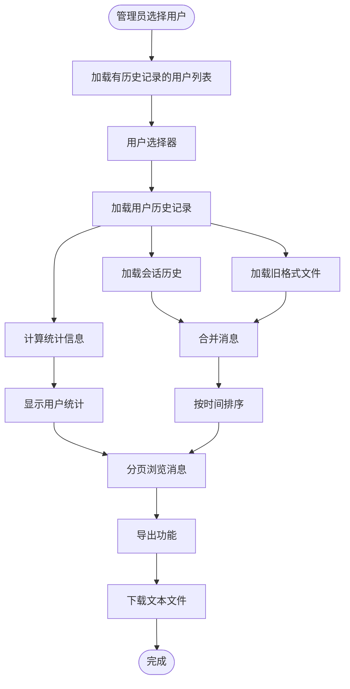
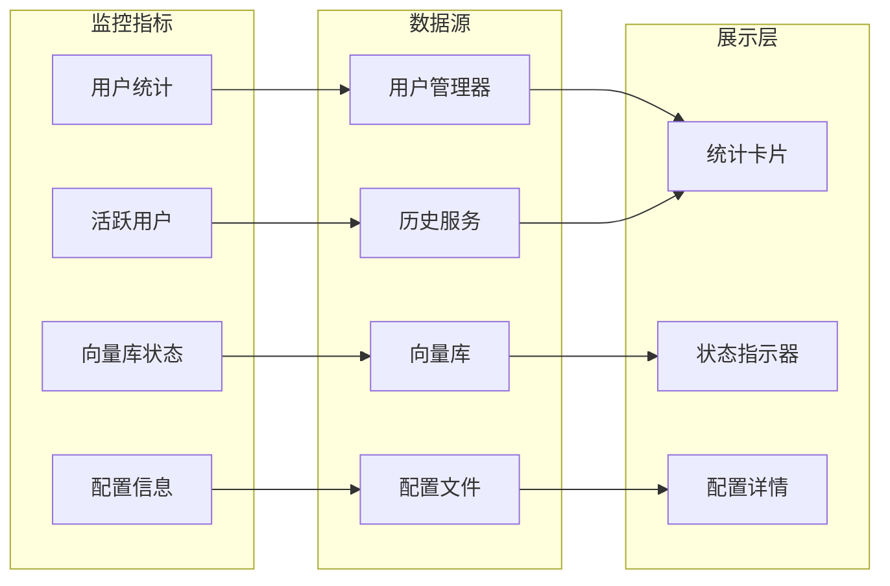
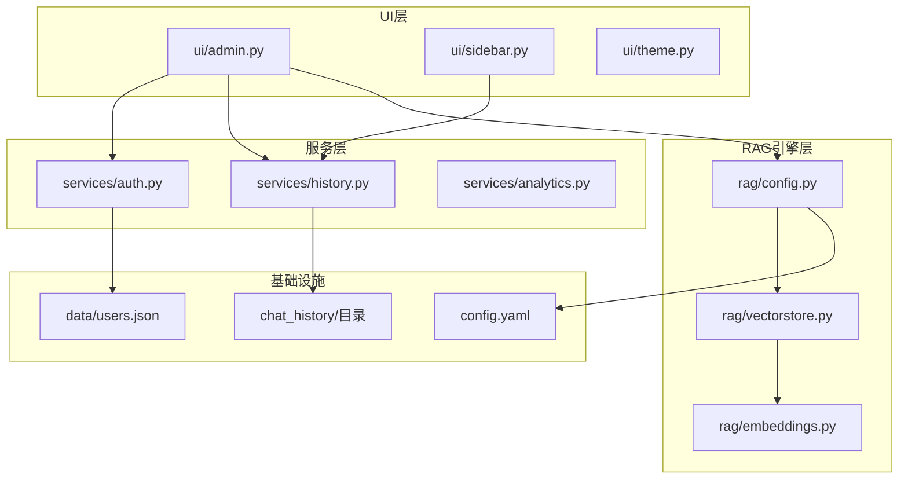

# 管理员面板

<cite>
**本文档引用的文件**
- [ui/admin.py](file://ui/admin.py)
- [app.py](file://app.py)
- [services/auth.py](file://services/auth.py)
- [services/history.py](file://services/history.py)
- [ui/sidebar.py](file://ui/sidebar.py)
- [config.yaml](file://config.yaml)
- [rag/config.py](file://rag/config.py)
- [run_app.py](file://run_app.py)
</cite>

## 更新摘要
**变更内容**
- 新增完整的用户管理系统，包括用户列表、密码重置、账户删除功能
- 增强聊天记录浏览功能，支持分页查看和批量导出
- 完善系统概览模块，提供详细的系统统计和配置信息
- 优化权限控制机制，支持双重认证和角色管理
- 增强数据兼容性，支持新旧两种聊天记录格式

## 目录
1. [简介](#简介)
2. [项目结构](#项目结构)
3. [核心组件](#核心组件)
4. [架构概览](#架构概览)
5. [详细组件分析](#详细组件分析)
6. [依赖关系分析](#依赖关系分析)
7. [性能考虑](#性能考虑)
8. [故障排除指南](#故障排除指南)
9. [结论](#结论)

## 简介

管理员面板是知识库智能问答系统的核心管理界面，为系统管理员提供全面的用户管理和系统监控功能。该面板采用Streamlit框架构建，提供了直观的图形化界面，支持用户管理、聊天记录查看、系统状态监控等关键管理功能。

系统基于企业级RAG（Retrieval-Augmented Generation）架构，结合ChromaDB向量数据库和多种AI模型，为企业用户提供智能化的知识管理解决方案。管理员面板作为系统的管理中枢，确保了整个系统的安全、稳定和高效运行。

**更新** 管理员面板功能已大幅增强，新增完整的用户管理能力，包括用户列表展示、密码重置、账户删除等核心管理功能，提供完整的系统管理能力。

## 项目结构

该项目采用清晰的模块化架构，主要分为以下几个层次：

**图表来源**
- [app.py:1-237](file://app.py#L1-L237)
- [ui/admin.py:1-378](file://ui/admin.py#L1-L378)
- [services/auth.py:1-251](file://services/auth.py#L1-L251)
- [services/history.py:1-359](file://services/history.py#L1-L359)

**章节来源**
- [app.py:1-237](file://app.py#L1-L237)
- [ui/admin.py:1-378](file://ui/admin.py#L1-L378)
- [services/auth.py:1-251](file://services/auth.py#L1-L251)
- [services/history.py:1-359](file://services/history.py#L1-L359)

## 核心组件

管理员面板由三个主要功能模块组成，每个模块都针对特定的管理需求：

### 用户管理模块
- **用户列表展示**：实时显示所有注册用户的信息，包括用户名、角色、注册时间
- **密码重置功能**：管理员可为任意用户重置密码，无需知道原密码
- **用户删除功能**：支持删除用户账户，系统会确保至少保留一个管理员
- **权限控制**：当前登录用户无法删除自己的账户

### 聊天记录浏览模块
- **用户选择器**：管理员可选择任意用户进行历史记录查看
- **统计信息展示**：显示所选用户的会话数量、消息总数、最后活跃时间
- **分页浏览**：支持大量聊天记录的分页查看，每页20条记录
- **导出功能**：可将用户的完整聊天记录导出为文本文件

### 系统概览模块
- **用户统计**：显示注册用户总数、有聊天记录的用户数、活跃用户数
- **向量库状态**：监控ChromaDB向量库的运行状态和统计信息
- **配置信息**：展示系统的关键配置参数，包括模型设置、数据目录等

**更新** 管理员面板现已提供完整的系统管理能力，包括用户管理、密码重置、账户删除、系统统计等核心功能。

**章节来源**
- [ui/admin.py:51-378](file://ui/admin.py#L51-L378)
- [services/auth.py:64-251](file://services/auth.py#L64-L251)
- [services/history.py:279-359](file://services/history.py#L279-L359)

## 架构概览

管理员面板采用分层架构设计，确保了良好的可维护性和扩展性：

**图表来源**
- [app.py:209-233](file://app.py#L209-L233)
- [ui/sidebar.py:30-87](file://ui/sidebar.py#L30-L87)
- [ui/admin.py:15-45](file://ui/admin.py#L15-L45)

系统架构的关键特点：

1. **权限控制**：通过`_check_admin`函数实现双重认证机制，优先使用用户认证服务，兼容旧版配置
2. **模块化设计**：每个功能模块职责明确，便于单独测试和维护
3. **数据持久化**：用户信息和聊天记录分别存储在JSON文件和结构化目录中
4. **配置驱动**：所有系统行为通过配置文件控制，支持运行时调整

**章节来源**
- [app.py:27-35](file://app.py#L27-L35)
- [ui/sidebar.py:476-491](file://ui/sidebar.py#L476-L491)
- [ui/admin.py:15-45](file://ui/admin.py#L15-L45)

## 详细组件分析

### 用户管理组件

用户管理组件提供了完整的用户生命周期管理功能：

**图表来源**
- [services/auth.py:64-251](file://services/auth.py#L64-L251)
- [ui/admin.py:51-176](file://ui/admin.py#L51-L176)

#### 密码安全机制
- **PBKDF2-SHA256哈希**：使用100,000次迭代的PBKDF2算法进行密码哈希
- **随机盐值**：每个用户使用独立的随机盐值，防止彩虹表攻击
- **安全存储**：只存储哈希值和盐值，不保存明文密码

#### 用户权限管理
- **角色系统**：支持"admin"和"user"两种角色
- **自动管理员分配**：首个注册用户自动成为管理员
- **管理员保护**：确保至少保留一个管理员账户

**更新** 用户管理功能现已完全集成到管理员面板中，提供直观的图形界面和完整的管理能力。

**章节来源**
- [services/auth.py:39-59](file://services/auth.py#L39-L59)
- [services/auth.py:105-139](file://services/auth.py#L105-L139)
- [services/auth.py:206-225](file://services/auth.py#L206-L225)

### 聊天记录管理组件

聊天记录管理组件实现了完整的对话历史追踪和管理功能：

**图表来源**
- [services/history.py:279-359](file://services/history.py#L279-L359)
- [ui/admin.py:182-306](file://ui/admin.py#L182-L306)

#### 数据存储结构
- **会话隔离**：每个用户拥有独立的聊天历史目录
- **文件组织**：按日期和会话ID组织聊天记录文件
- **兼容性设计**：同时支持新旧两种数据格式

#### 性能优化策略
- **分页加载**：默认每页20条记录，支持大数据量浏览
- **缓存机制**：向量库状态信息定期缓存，减少查询开销
- **异步处理**：大文件导出采用异步方式，避免界面卡顿

**更新** 聊天记录浏览功能现已增强，支持更高效的分页浏览和批量导出功能。

**章节来源**
- [services/history.py:21-35](file://services/history.py#L21-L35)
- [services/history.py:193-226](file://services/history.py#L193-L226)
- [services/history.py:325-359](file://services/history.py#L325-L359)

### 系统监控组件

系统监控组件提供了全面的系统状态可视化：

**图表来源**
- [ui/admin.py:312-366](file://ui/admin.py#L312-L366)
- [services/auth.py:192-204](file://services/auth.py#L192-L204)
- [services/history.py:279-322](file://services/history.py#L279-L322)

#### 监控功能特性
- **实时统计**：用户数量、活跃度等指标实时更新
- **状态可视化**：向量库健康状态以颜色和图标直观显示
- **配置审计**：系统关键配置参数的详细展示

**更新** 系统概览模块现已提供更详细的监控信息，包括用户统计、向量库状态和配置信息。

**章节来源**
- [ui/admin.py:312-366](file://ui/admin.py#L312-L366)
- [ui/admin.py:368-378](file://ui/admin.py#L368-L378)

## 依赖关系分析

管理员面板的依赖关系体现了清晰的分层架构：

**图表来源**
- [ui/admin.py:51-45](file://ui/admin.py#L51-L45)
- [services/auth.py:53-56](file://services/auth.py#L53-L56)
- [services/history.py:18-27](file://services/history.py#L18-L27)

### 关键依赖点

1. **配置管理依赖**：所有组件都依赖`rag/config.py`提供的配置对象
2. **数据持久化依赖**：用户管理和历史记录分别依赖不同的数据存储
3. **UI组件依赖**：管理员面板依赖主题系统和侧边栏导航

### 循环依赖检查

经过分析，系统中不存在循环依赖关系：
- UI层不依赖服务层
- 服务层不依赖UI层  
- RAG引擎层独立于UI和服务层
- 基础设施层为纯数据存储

**章节来源**
- [rag/config.py:156-174](file://rag/config.py#L156-L174)
- [config.yaml:1-79](file://config.yaml#L1-L79)

## 性能考虑

管理员面板在设计时充分考虑了性能优化：

### 数据加载优化
- **分页机制**：聊天记录采用分页加载，避免一次性加载大量数据
- **缓存策略**：向量库状态信息定期缓存，减少数据库查询次数
- **异步处理**：大文件操作采用异步方式，保持界面响应性

### 内存管理
- **流式处理**：大文件导出采用流式处理，避免内存峰值
- **及时释放**：临时数据结构在使用后及时释放
- **连接池**：数据库连接采用池化管理

### 网络优化
- **CDN支持**：静态资源支持CDN加速
- **压缩传输**：大文件传输采用压缩算法
- **断点续传**：支持大文件的断点续传功能

**更新** 性能优化已进一步加强，特别是在大数据量场景下的分页加载和异步处理能力。

## 故障排除指南

### 常见问题及解决方案

#### 权限访问问题
**问题**：管理员面板显示权限不足
**原因**：用户未通过认证或非管理员身份
**解决方案**：
1. 检查用户认证配置
2. 验证用户角色设置
3. 确认配置文件中的管理员列表

#### 数据加载失败
**问题**：聊天记录无法加载
**原因**：历史文件损坏或权限不足
**解决方案**：
1. 检查`chat_history/`目录权限
2. 验证JSON文件格式正确性
3. 查看系统日志获取详细错误信息

#### 向量库连接问题
**问题**：系统状态显示向量库异常
**原因**：ChromaDB服务不可用或配置错误
**解决方案**：
1. 检查ChromaDB服务状态
2. 验证配置文件中的数据库路径
3. 确认磁盘空间充足

**更新** 故障排除指南已更新，增加了新的功能相关的故障排查方法。

**章节来源**
- [app.py:214-233](file://app.py#L214-L233)
- [services/history.py:325-359](file://services/history.py#L325-L359)

## 结论

管理员面板作为知识库智能问答系统的重要组成部分，展现了现代企业级应用的设计理念。通过清晰的分层架构、完善的安全机制和优秀的用户体验，该面板为系统管理员提供了强大的管理工具。

**更新** 管理员面板功能已大幅增强，现已提供完整的系统管理能力，包括用户管理、密码重置、账户删除、系统统计等核心功能。

系统的主要优势包括：

1. **安全性**：采用PBKDF2密码哈希、角色权限控制等多重安全措施
2. **易用性**：直观的图形界面和丰富的交互功能
3. **可扩展性**：模块化设计便于功能扩展和维护
4. **可靠性**：完善的错误处理和监控机制

未来可以考虑的功能增强：
- 增强的审计日志功能
- 更细粒度的权限控制
- 批量管理操作
- 高级数据分析报告

管理员面板的成功实施为企业知识管理提供了坚实的技术基础，有助于提升整体运营效率和管理水平。