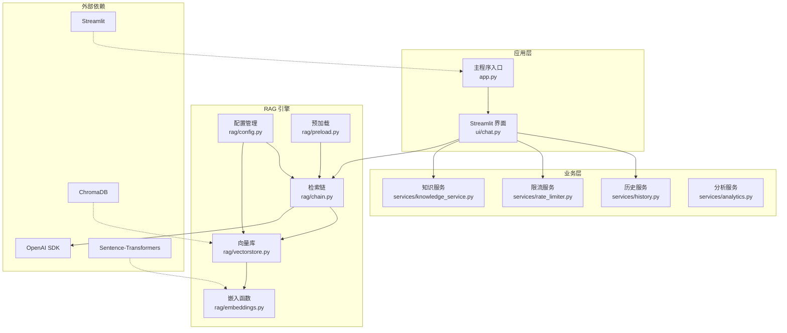
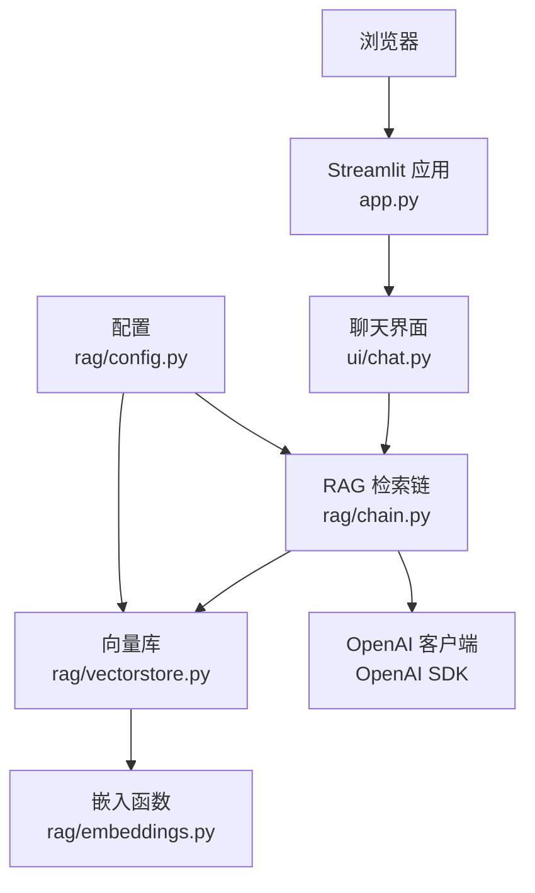
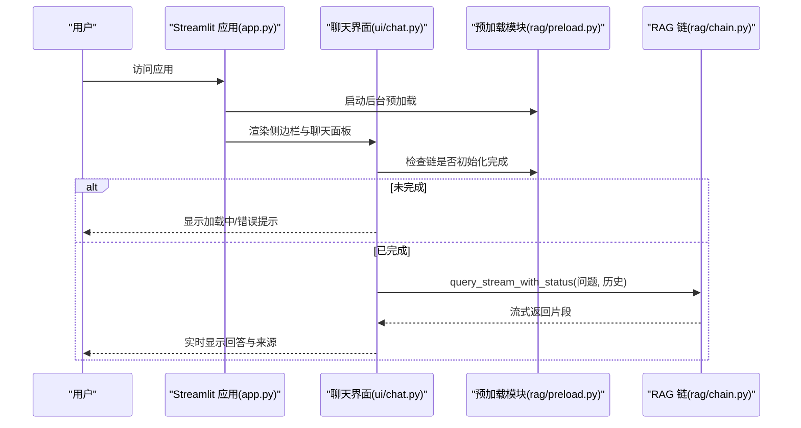
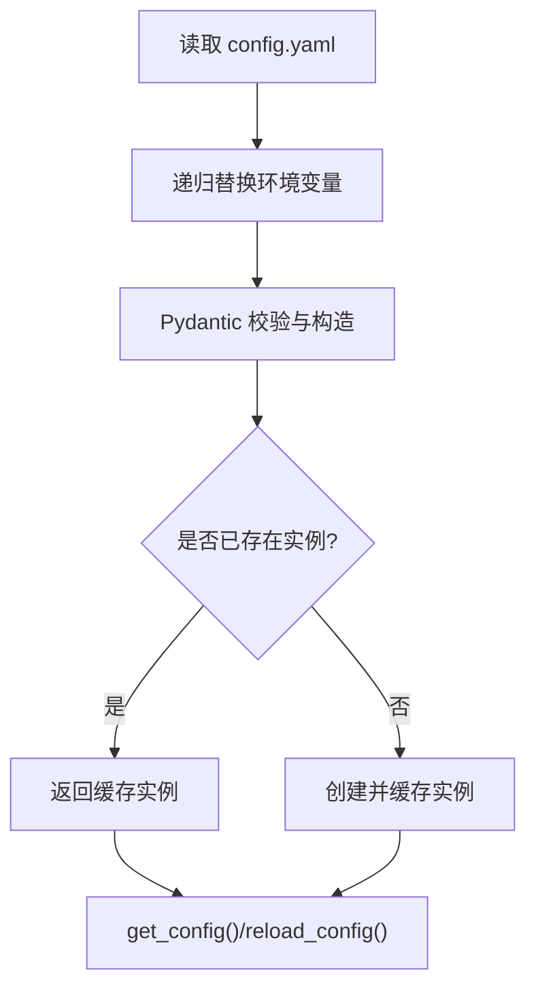
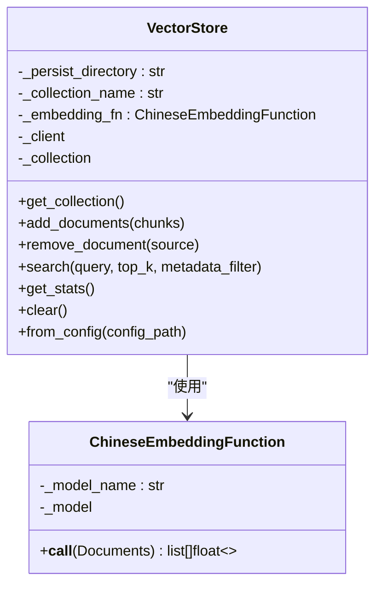
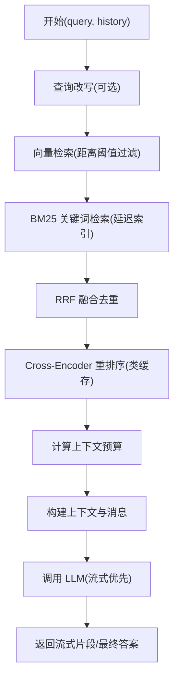
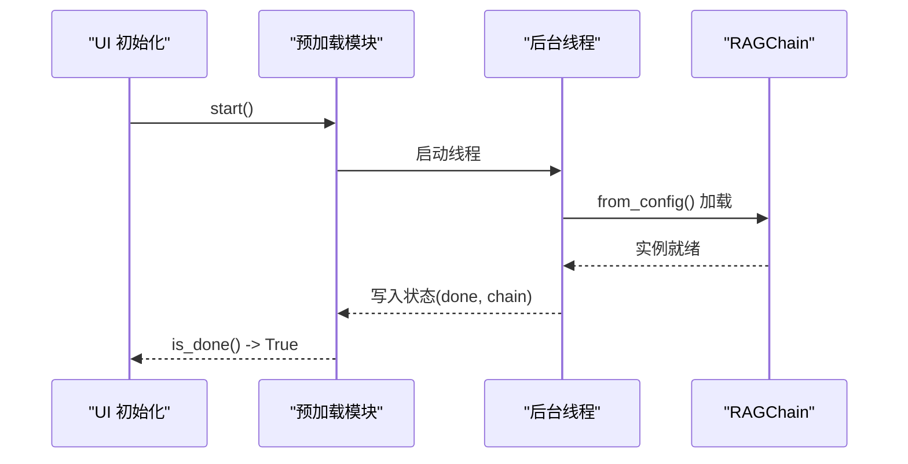
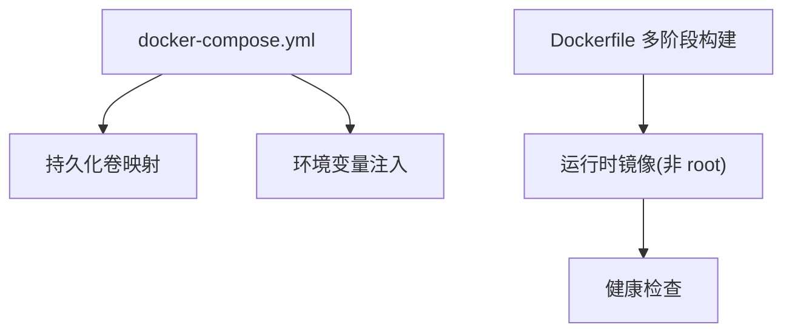

# 技术栈选型

<cite>
**本文引用的文件**
- [README.md](file://README.md)
- [requirements.txt](file://requirements.txt)
- [requirements-dev.txt](file://requirements-dev.txt)
- [Dockerfile](file://Dockerfile)
- [docker-compose.yml](file://docker-compose.yml)
- [app.py](file://app.py)
- [config.yaml](file://config.yaml)
- [rag/config.py](file://rag/config.py)
- [rag/embeddings.py](file://rag/embeddings.py)
- [rag/vectorstore.py](file://rag/vectorstore.py)
- [rag/chain.py](file://rag/chain.py)
- [rag/preload.py](file://rag/preload.py)
- [services/knowledge_service.py](file://services/knowledge_service.py)
- [ui/chat.py](file://ui/chat.py)
</cite>

## 目录
1. [简介](#简介)
2. [项目结构](#项目结构)
3. [核心组件](#核心组件)
4. [架构总览](#架构总览)
5. [详细组件分析](#详细组件分析)
6. [依赖分析](#依赖分析)
7. [性能考量](#性能考量)
8. [故障排查指南](#故障排查指南)
9. [结论](#结论)
10. [附录](#附录)

## 简介
本技术栈选型文档面向“知识管理系统”，聚焦于项目采用的核心技术与框架，包括 Python 生态（Streamlit、ChromaDB、Sentence-Transformers、OpenAI）、容器化（Docker）、依赖管理工具，以及版本兼容性、性能与安全考量，并提供演进路线与替代方案对比，帮助读者快速理解并高效落地。

## 项目结构
该项目采用“前端界面（Streamlit）+ 业务服务（services）+ 检索增强生成（RAG）”三层组织方式，配合容器化部署与配置驱动的参数化设计，形成可扩展、可维护的知识问答系统。

图表来源
- [app.py:1-185](file://app.py#L1-L185)
- [ui/chat.py:1-190](file://ui/chat.py#L1-L190)
- [rag/config.py:1-184](file://rag/config.py#L1-L184)
- [rag/preload.py:1-73](file://rag/preload.py#L1-L73)
- [rag/embeddings.py:1-48](file://rag/embeddings.py#L1-L48)
- [rag/vectorstore.py:1-209](file://rag/vectorstore.py#L1-L209)
- [rag/chain.py:1-590](file://rag/chain.py#L1-L590)
- [services/knowledge_service.py:1-46](file://services/knowledge_service.py#L1-L46)

章节来源
- [README.md:1-3](file://README.md#L1-L3)
- [app.py:1-185](file://app.py#L1-L185)
- [ui/chat.py:1-190](file://ui/chat.py#L1-L190)
- [rag/config.py:1-184](file://rag/config.py#L1-L184)
- [rag/preload.py:1-73](file://rag/preload.py#L1-L73)
- [rag/embeddings.py:1-48](file://rag/embeddings.py#L1-L48)
- [rag/vectorstore.py:1-209](file://rag/vectorstore.py#L1-L209)
- [rag/chain.py:1-590](file://rag/chain.py#L1-L590)
- [services/knowledge_service.py:1-46](file://services/knowledge_service.py#L1-L46)

## 核心组件
- Streamlit：提供交互式 Web 界面，负责登录、侧边栏、聊天面板、仪表盘与导出功能。
- ChromaDB：本地向量数据库，持久化存储文档向量与元数据，支持相似度检索与集合管理。
- Sentence-Transformers：中文嵌入模型封装，提供中文语义向量化能力，支持在线/离线模型加载。
- OpenAI SDK：统一调用各类大模型 API（兼容 OpenAI 协议），支持流式与非流式响应、指数退避重试。
- 配置系统：基于 Pydantic 的强类型配置，支持 YAML 加载与环境变量替换，提供全局单例访问。
- 预加载机制：后台线程加载 RAGChain，避免 Streamlit 重渲染导致状态丢失。
- 容器化：多阶段 Docker 构建，非 root 用户运行，健康检查与持久化卷挂载。

章节来源
- [app.py:1-185](file://app.py#L1-L185)
- [rag/config.py:1-184](file://rag/config.py#L1-L184)
- [rag/embeddings.py:1-48](file://rag/embeddings.py#L1-L48)
- [rag/vectorstore.py:1-209](file://rag/vectorstore.py#L1-L209)
- [rag/chain.py:1-590](file://rag/chain.py#L1-L590)
- [rag/preload.py:1-73](file://rag/preload.py#L1-L73)
- [Dockerfile:1-68](file://Dockerfile#L1-L68)

## 架构总览
系统采用“前端界面 + 检索增强生成引擎 + 向量数据库”的典型 RAG 架构。前端通过 Streamlit 与用户交互；RAG 引擎负责检索、重排序与提示工程；向量库提供高维语义检索；配置系统贯穿全局，保证参数一致性与可运维性。

图表来源
- [app.py:1-185](file://app.py#L1-L185)
- [ui/chat.py:1-190](file://ui/chat.py#L1-L190)
- [rag/chain.py:1-590](file://rag/chain.py#L1-L590)
- [rag/vectorstore.py:1-209](file://rag/vectorstore.py#L1-L209)
- [rag/embeddings.py:1-48](file://rag/embeddings.py#L1-L48)
- [rag/config.py:1-184](file://rag/config.py#L1-L184)

## 详细组件分析

### Streamlit 界面与会话管理
- 登录与主题：根据配置设置页面标题、图标、布局与默认主题，支持用户登录态与主题切换。
- 会话状态：初始化消息、页面、链实例；后台预加载完成后注入链对象，避免每次重渲染丢失。
- 聊天面板：渲染历史消息、处理输入、调用 RAG 链流式生成、记录反馈与审计日志。
- 仪表盘：展示查询统计、知识库状态、导出会话等。

图表来源
- [app.py:1-185](file://app.py#L1-L185)
- [ui/chat.py:1-190](file://ui/chat.py#L1-L190)
- [rag/preload.py:1-73](file://rag/preload.py#L1-L73)
- [rag/chain.py:1-590](file://rag/chain.py#L1-L590)

章节来源
- [app.py:1-185](file://app.py#L1-L185)
- [ui/chat.py:1-190](file://ui/chat.py#L1-L190)
- [rag/preload.py:1-73](file://rag/preload.py#L1-L73)

### 配置系统（Pydantic + YAML）
- 支持环境变量替换（${VAR}、${VAR:-默认值}），便于容器化与多环境部署。
- 强类型模型：LLM、Embedding、VectorStore、Knowledge、RateLimit、UI 等配置项均有字段校验。
- 全局单例：首次加载后缓存，提供线程安全的全局访问与运行时重载。

图表来源
- [rag/config.py:1-184](file://rag/config.py#L1-L184)
- [config.yaml:1-46](file://config.yaml#L1-L46)

章节来源
- [rag/config.py:1-184](file://rag/config.py#L1-L184)
- [config.yaml:1-46](file://config.yaml#L1-L46)

### 向量库与嵌入函数（ChromaDB + Sentence-Transformers）
- 向量库管理：支持持久化客户端、集合创建/切换、增删改查、统计信息与全局单例缓存。
- 嵌入函数：封装中文 Sentence-Transformers 模型，支持在线/离线模型加载与延迟初始化。
- 检索策略：向量检索 + BM25 关键词检索 + RRF 融合，提升召回质量与鲁棒性。

图表来源
- [rag/vectorstore.py:1-209](file://rag/vectorstore.py#L1-L209)
- [rag/embeddings.py:1-48](file://rag/embeddings.py#L1-L48)

章节来源
- [rag/vectorstore.py:1-209](file://rag/vectorstore.py#L1-L209)
- [rag/embeddings.py:1-48](file://rag/embeddings.py#L1-L48)

### RAG 检索链（检索 + 重排序 + 提示工程 + LLM）
- 检索：向量检索（阈值过滤）+ BM25 关键词检索（延迟构建索引）+ RRF 融合。
- 重排序：Cross-Encoder 缓存式重排序，提升相关性。
- 上下文预算：基于字符/token 估算，动态裁剪，避免越界。
- LLM 调用：流式优先，失败自动降级为非流式，带指数退避重试与审计日志。
- 多轮对话：注入最近若干轮历史，支持查询改写优化指代消解。

图表来源
- [rag/chain.py:1-590](file://rag/chain.py#L1-L590)

章节来源
- [rag/chain.py:1-590](file://rag/chain.py#L1-L590)

### 预加载与后台初始化
- 独立模块 + 线程：避免 Streamlit 重渲染导致状态丢失，后台加载 RAGChain，首开体验更佳。
- 幂等启动：多次调用仅启动一次，加载完成后标记完成状态。

图表来源
- [rag/preload.py:1-73](file://rag/preload.py#L1-L73)
- [rag/chain.py:584-590](file://rag/chain.py#L584-L590)

章节来源
- [rag/preload.py:1-73](file://rag/preload.py#L1-L73)

### 容器化与部署
- 多阶段构建：分离构建与运行时镜像，减少体积与攻击面。
- 非 root 用户：降低权限风险，符合容器安全最佳实践。
- 健康检查：基于 Streamlit 内部健康端点，保障容器存活探测。
- 持久化卷：知识库、向量库、聊天历史、日志目录独立挂载，便于运维与备份。
- 环境变量：通过 compose 与镜像 ENV 注入，支持国内镜像加速与 LLM API 配置覆盖。

图表来源
- [Dockerfile:1-68](file://Dockerfile#L1-L68)
- [docker-compose.yml:1-60](file://docker-compose.yml#L1-L60)

章节来源
- [Dockerfile:1-68](file://Dockerfile#L1-L68)
- [docker-compose.yml:1-60](file://docker-compose.yml#L1-L60)

## 依赖分析
- Python 依赖：Streamlit、ChromaDB、OpenAI、Sentence-Transformers、Pydantic、PyYAML、Markdown、PyMuPDF、HTTPX、Loguru 等。
- 开发与测试：pytest、pytest-cov、pytest-mock。
- 版本选择依据：
  - Streamlit：稳定版本，生态成熟，适合快速构建 Web 界面。
  - ChromaDB：轻量、易部署、支持持久化，满足中小规模知识库。
  - Sentence-Transformers：中文语义效果好，支持本地/在线模型，便于内网部署。
  - OpenAI：统一 API 调用，兼容多种模型，便于切换与迁移。
  - Pydantic：强类型配置，自动校验与序列化，降低配置错误风险。
- 兼容性建议：
  - Python 3.11（镜像基础）。
  - 依赖版本遵循 requirements.txt，建议使用虚拟环境隔离。
  - 国内镜像加速（HF_ENDPOINT）以提升模型下载稳定性。

章节来源
- [requirements.txt:1-11](file://requirements.txt#L1-L11)
- [requirements-dev.txt:1-5](file://requirements-dev.txt#L1-L5)
- [Dockerfile:3](file://Dockerfile#L3)

## 性能考量
- 检索性能
  - 向量检索：通过距离阈值过滤与 top_k 控制，减少无关候选。
  - BM25：延迟构建索引，与向量检索互补，提高召回稳定性。
  - RRF 融合：综合排序，兼顾语义与关键词相关性。
- 生成性能
  - 流式输出：提升用户体验，降低首字节延迟。
  - 指数退避重试：在网络抖动或上游限流时提升成功率。
  - 上下文预算：动态裁剪，避免超出模型上下文窗口。
- 存储与加载
  - 向量库持久化：重启后无需重新入库，提升可用性。
  - 预加载：后台加载 RAGChain，缩短首次交互等待。
- 资源占用
  - Sentence-Transformers 模型首次加载耗时较长，建议在容器启动阶段完成或通过预热脚本触发。
  - ChromaDB 默认内存友好，大规模场景可考虑外部向量数据库（见替代方案）。

[本节为通用性能讨论，不直接分析具体文件]

## 故障排查指南
- 初始化失败
  - 现象：聊天面板显示“系统初始化失败”。
  - 排查：检查 LLM API 配置、网络连通性与密钥有效性；查看容器日志与审计日志。
  - 处理：点击“重试加载”，或修正 config.yaml 与环境变量后重启。
- 无结果
  - 现象：回答“知识库中暂无相关内容”。
  - 排查：确认文档已入库、分块策略合理、向量库集合正确；检查检索阈值与 top_k。
- 生成异常
  - 现象：流式调用失败或返回空内容。
  - 排查：查看 LLM 返回状态、重试日志与审计日志；确认模型名称与上下文预算。
- 容器健康
  - 现象：容器频繁重启或健康检查失败。
  - 排查：检查端口占用、卷挂载权限、HF_ENDPOINT 与 API 基础地址。

章节来源
- [ui/chat.py:36-44](file://ui/chat.py#L36-L44)
- [rag/chain.py:440-495](file://rag/chain.py#L440-L495)
- [Dockerfile:57-67](file://Dockerfile#L57-L67)

## 结论
本技术栈以 Streamlit 为入口、以 ChromaDB + Sentence-Transformers 为基础的 RAG 引擎为核心，结合 OpenAI SDK 的统一调用与 Pydantic 的强类型配置，实现了可扩展、可运维、可容器化的知识问答系统。通过预加载、持久化与健康检查等工程化手段，兼顾了用户体验与系统稳定性。对于更大规模或更高并发场景，可考虑引入外部向量数据库与分布式部署方案。

[本节为总结性内容，不直接分析具体文件]

## 附录

### 技术栈选型与替代方案对比
- Streamlit vs FastAPI/Gradio
  - 选型：快速原型与内部门户场景首选，界面简洁、上手快。
  - 替代：生产级高并发场景可考虑 FastAPI + Vue/React 前端，或 Gradio 作为演示入口。
- ChromaDB vs Pinecone/LanceDB
  - 选型：本地部署、易用性强，适合中小规模知识库。
  - 替代：大规模场景可迁移到云端向量数据库（如 Pinecone、Qdrant）或本地 LanceDB。
- Sentence-Transformers vs HuggingFace Inference
  - 选型：本地可控、可离线部署，模型加载灵活。
  - 替代：云推理服务（如 HuggingFace Inference）可降低本地资源占用。
- OpenAI SDK vs Azure/OpenAI 兼容服务
  - 选型：统一 API，便于切换与迁移。
  - 替代：企业私有化或合规要求高的场景可接入自有推理集群或 Azure OpenAI。

[本节为概念性对比，不直接分析具体文件]