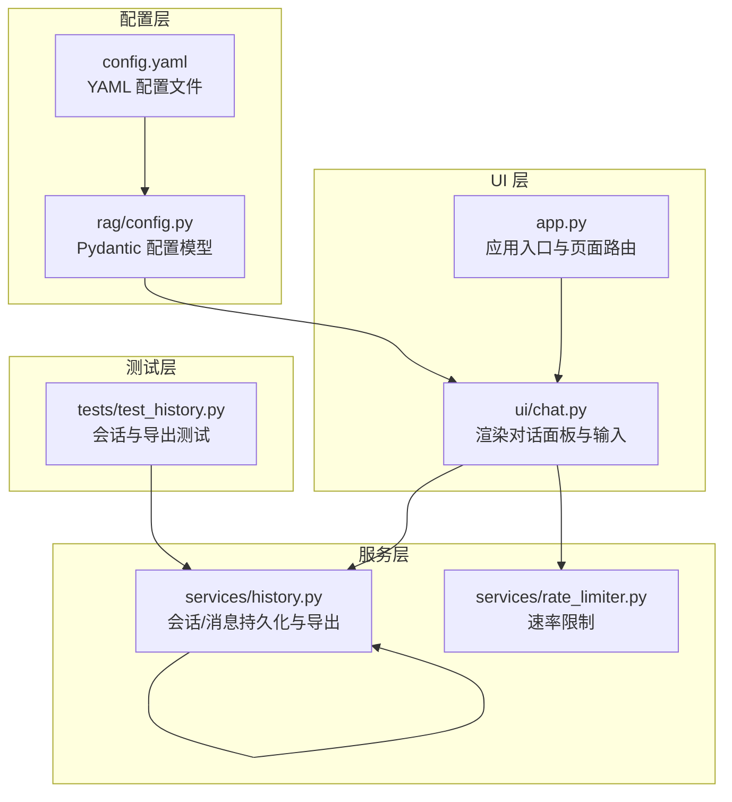
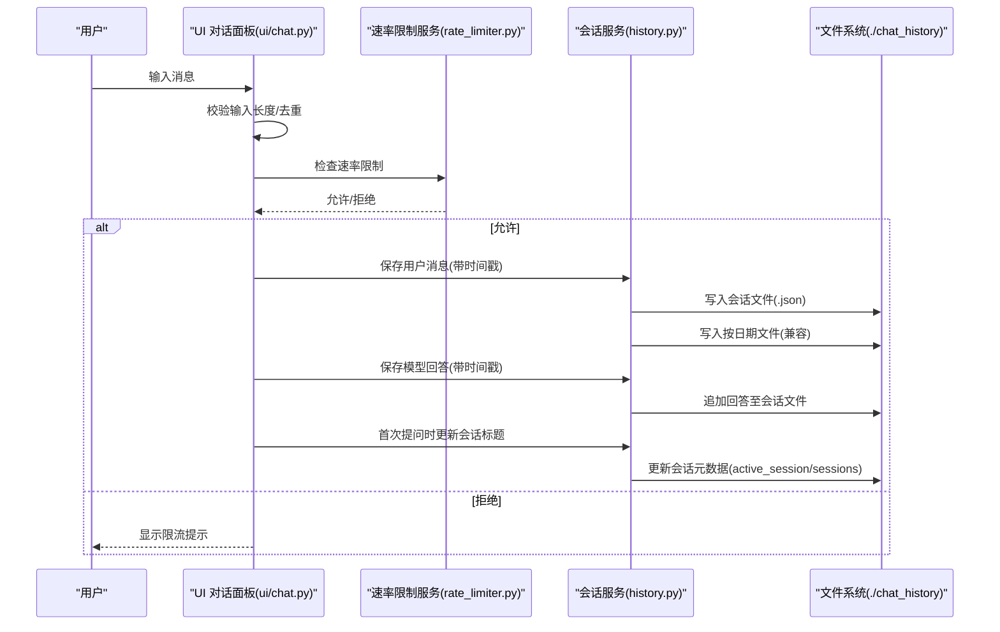
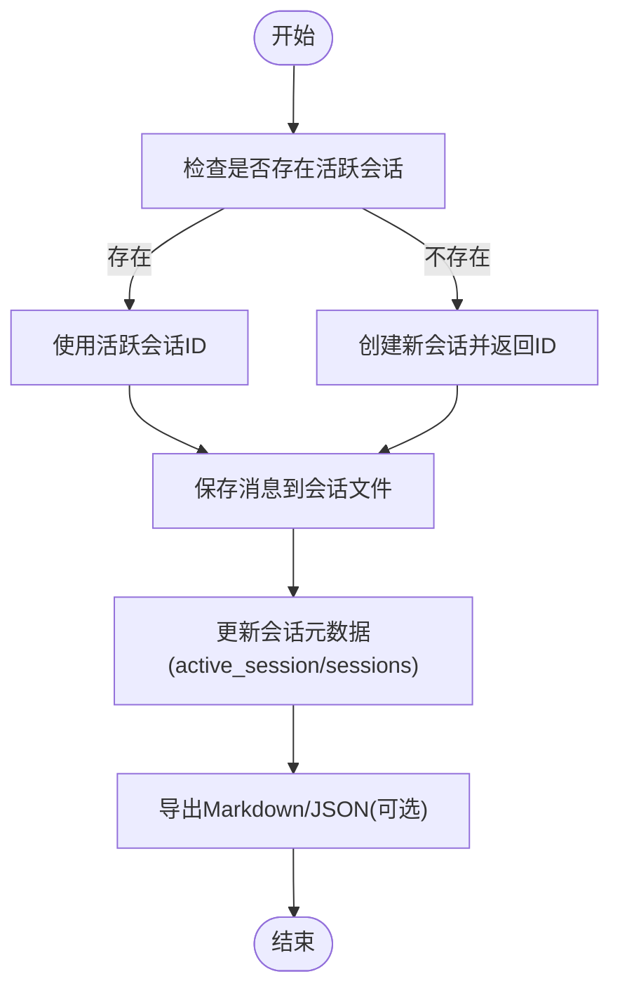
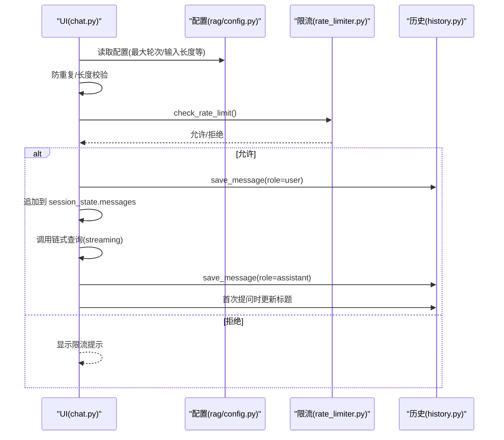
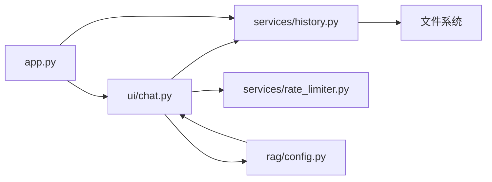
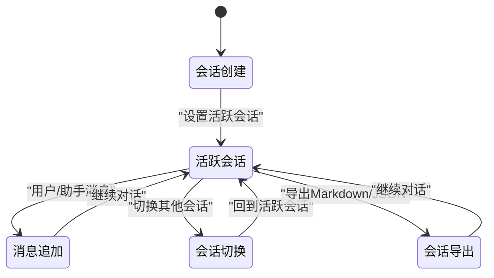

# 会话管理流程

<cite>
**本文引用的文件**
- [services/history.py](file://services/history.py)
- [ui/chat.py](file://ui/chat.py)
- [app.py](file://app.py)
- [rag/config.py](file://rag/config.py)
- [config.yaml](file://config.yaml)
- [services/rate_limiter.py](file://services/rate_limiter.py)
- [tests/test_history.py](file://tests/test_history.py)
</cite>

## 目录
1. [简介](#简介)
2. [项目结构](#项目结构)
3. [核心组件](#核心组件)
4. [架构总览](#架构总览)
5. [详细组件分析](#详细组件分析)
6. [依赖关系分析](#依赖关系分析)
7. [性能考量](#性能考量)
8. [故障排查指南](#故障排查指南)
9. [结论](#结论)
10. [附录](#附录)

## 简介
本文面向知识管理系统的“会话管理流程”，聚焦从用户消息输入到会话历史存储的完整数据处理链路，涵盖：
- 消息格式标准化（时间戳、角色、内容）
- 历史记录持久化（按用户/会话/日期分层）
- 会话状态维护（活跃会话、标题、消息计数）
- 消息检索与导出（Markdown/JSON）
- 会话数据的存储结构、历史查询索引策略、消息序列管理机制
- 并发访问控制与数据一致性保障

## 项目结构
围绕会话管理的关键模块与文件如下：
- UI 层：负责渲染对话面板、接收用户输入、调用服务层
- 服务层：负责会话生命周期管理、消息持久化、历史查询与导出
- 配置层：统一读取与解析配置，提供运行参数
- 测试层：验证会话创建、消息保存、导出等功能

图表来源
- [ui/chat.py:1-190](file://ui/chat.py#L1-L190)
- [app.py:1-189](file://app.py#L1-L189)
- [services/history.py:1-270](file://services/history.py#L1-L270)
- [services/rate_limiter.py:1-71](file://services/rate_limiter.py#L1-L71)
- [rag/config.py:1-185](file://rag/config.py#L1-L185)
- [config.yaml:1-50](file://config.yaml#L1-L50)
- [tests/test_history.py:1-98](file://tests/test_history.py#L1-L98)

章节来源
- [ui/chat.py:1-190](file://ui/chat.py#L1-L190)
- [app.py:1-189](file://app.py#L1-L189)
- [services/history.py:1-270](file://services/history.py#L1-L270)
- [services/rate_limiter.py:1-71](file://services/rate_limiter.py#L1-L71)
- [rag/config.py:1-185](file://rag/config.py#L1-L185)
- [config.yaml:1-50](file://config.yaml#L1-L50)
- [tests/test_history.py:1-98](file://tests/test_history.py#L1-L98)

## 核心组件
- 会话管理服务（history.py）
  - 会话列表与活跃会话管理
  - 按会话与按日期的消息持久化
  - 会话标题更新与消息计数
  - Markdown/JSON 导出
- UI 对话面板（chat.py）
  - 初始化会话状态、加载历史
  - 输入校验、速率限制、消息追加
  - 调用服务层进行持久化与导出
- 应用入口（app.py）
  - 页面路由、主题应用、仪表盘导出按钮
- 配置系统（rag/config.py + config.yaml）
  - LLM/Embedding/向量库/速率限制/UI 等配置
- 速率限制（rate_limiter.py）
  - 内存级滑动窗口限流，周期清理不活跃用户

章节来源
- [services/history.py:1-270](file://services/history.py#L1-L270)
- [ui/chat.py:1-190](file://ui/chat.py#L1-L190)
- [app.py:1-189](file://app.py#L1-L189)
- [rag/config.py:1-185](file://rag/config.py#L1-L185)
- [config.yaml:1-50](file://config.yaml#L1-L50)
- [services/rate_limiter.py:1-71](file://services/rate_limiter.py#L1-L71)

## 架构总览
下图展示从用户输入到历史持久化的端到端流程，以及会话状态与导出能力：

图表来源
- [ui/chat.py:96-190](file://ui/chat.py#L96-L190)
- [services/rate_limiter.py:45-71](file://services/rate_limiter.py#L45-L71)
- [services/history.py:193-221](file://services/history.py#L193-L221)

## 详细组件分析

### 会话与消息持久化（history.py）
- 存储目录与文件组织
  - 用户根目录：./chat_history/{username}/
  - 会话列表与活跃会话：./chat_history/{username}/_sessions.json
  - 会话历史：./chat_history/{username}/sessions/{session_id}.json
  - 兼容旧格式：./chat_history/{username}/{YYYY-MM-DD}.json
- 会话生命周期
  - 创建会话：生成短 ID，记录创建/更新时间、消息计数
  - 切换活跃会话：仅更新活跃标记，保留历史
  - 更新标题：基于首次用户消息自动命名，限制长度
- 消息持久化
  - 保存消息：按会话追加 JSON；同时写入按日期文件（兼容）
  - 加载历史：按会话或按日期读取
  - 导出：Markdown/JSON 两种格式
- 数据结构要点
  - 会话条目包含 id、title、created_at、updated_at、message_count
  - 消息条目包含 role、content、timestamp

图表来源
- [services/history.py:37-153](file://services/history.py#L37-L153)
- [services/history.py:193-221](file://services/history.py#L193-L221)
- [services/history.py:247-270](file://services/history.py#L247-L270)

章节来源
- [services/history.py:1-270](file://services/history.py#L1-L270)

### UI 对话面板（chat.py）
- 初始化与加载
  - 初始化 session_state（主题、消息列表、页面）
  - 首次进入时加载当前活跃会话的历史消息
- 输入处理
  - 防重复提交：若最后一条消息与当前输入相同且角色为用户，则忽略
  - 输入长度校验与速率限制检查
  - 将用户消息追加到 session_state，并持久化
- 回答生成与持久化
  - 调用链式查询（streaming），实时显示生成片段
  - 将最终回答追加到 session_state 并持久化
- 首次提问自动命名
  - 统计用户消息数量，若为 1 则以问题内容截断命名
- 反馈与审计日志
  - 为助手回复提供点赞/点踩反馈，触发审计日志

图表来源
- [ui/chat.py:96-190](file://ui/chat.py#L96-L190)
- [services/rate_limiter.py:45-71](file://services/rate_limiter.py#L45-L71)
- [services/history.py:193-221](file://services/history.py#L193-L221)

章节来源
- [ui/chat.py:1-190](file://ui/chat.py#L1-L190)

### 应用入口与页面路由（app.py）
- 初始化 session_state（主题、消息列表、页面）
- 登录态判断与侧边栏渲染
- 仪表盘页面提供“下载当前会话 Markdown”按钮，调用导出函数

章节来源
- [app.py:1-189](file://app.py#L1-L189)

### 配置系统（rag/config.py + config.yaml）
- 配置模型：LLM、Embedding、向量库、知识库、速率限制、UI、多轮对话轮数、审计开关、管理员列表
- 环境变量替换：支持 ${VAR} 与 ${VAR:-默认值}
- 单例访问：全局缓存配置实例，避免重复加载

章节来源
- [rag/config.py:1-185](file://rag/config.py#L1-L185)
- [config.yaml:1-50](file://config.yaml#L1-L50)

### 速率限制（rate_limiter.py）
- 内存级滑动窗口：按用户记录最近 60 秒内的请求时间戳
- 周期清理：每 600 秒清理不活跃用户，防止内存膨胀
- 限流阈值：默认每分钟最多 30 次请求

章节来源
- [services/rate_limiter.py:1-71](file://services/rate_limiter.py#L1-L71)

### 测试覆盖（tests/test_history.py）
- 会话创建与列表
- 活跃会话默认创建
- 消息保存与加载
- 会话切换与标题更新
- Markdown/JSON 导出

章节来源
- [tests/test_history.py:1-98](file://tests/test_history.py#L1-L98)

## 依赖关系分析
- UI 依赖服务层进行消息持久化与会话管理
- 服务层依赖文件系统进行 JSON 持久化
- UI 依赖配置系统读取运行参数
- UI 依赖速率限制服务进行请求节流
- 应用入口负责页面路由与导出按钮

图表来源
- [ui/chat.py:1-190](file://ui/chat.py#L1-L190)
- [services/history.py:1-270](file://services/history.py#L1-L270)
- [services/rate_limiter.py:1-71](file://services/rate_limiter.py#L1-L71)
- [rag/config.py:1-185](file://rag/config.py#L1-L185)
- [app.py:1-189](file://app.py#L1-L189)

章节来源
- [ui/chat.py:1-190](file://ui/chat.py#L1-L190)
- [services/history.py:1-270](file://services/history.py#L1-L270)
- [services/rate_limiter.py:1-71](file://services/rate_limiter.py#L1-L71)
- [rag/config.py:1-185](file://rag/config.py#L1-L185)
- [app.py:1-189](file://app.py#L1-L189)

## 性能考量
- 消息持久化
  - 每条消息写入两次：会话文件与按日期文件（兼容旧格式）
  - JSON 追加写入，适合小到中等规模会话
- 会话列表与活跃会话
  - 会话元数据采用 JSON 存储，读写简单
  - 列表按更新时间倒序排序，便于快速定位最新会话
- 导出
  - Markdown/JSON 导出一次性读取整个会话历史，适合中小规模导出
- 速率限制
  - 内存滑动窗口，开销低，适合高并发场景
- 并发与一致性
  - 当前实现未显式加锁，建议在生产环境引入文件锁或数据库事务以保证并发一致性

[本节为通用性能讨论，不直接分析具体文件]

## 故障排查指南
- 会话无法加载
  - 检查 ./chat_history/{username}/_sessions.json 是否存在且可读
  - 若不存在，确认是否已创建会话或切换活跃会话
- 消息未持久化
  - 确认 save_message 调用是否成功，检查会话 ID 与用户名
  - 查看会话文件与按日期文件是否写入
- 导出为空
  - 确认会话 ID 正确，会话文件是否存在
  - 检查导出函数是否正确读取历史
- 限流导致请求被拒绝
  - 检查速率限制配置与当前用户请求频率
  - 等待窗口期或调整阈值

章节来源
- [services/history.py:1-270](file://services/history.py#L1-L270)
- [services/rate_limiter.py:1-71](file://services/rate_limiter.py#L1-L71)
- [tests/test_history.py:1-98](file://tests/test_history.py#L1-L98)

## 结论
本会话管理流程通过清晰的分层设计实现了从用户输入到历史持久化的闭环：
- 消息格式标准化（角色、内容、时间戳）
- 多层级存储（按会话、按日期、会话元数据）
- 会话状态维护（活跃会话、标题、计数）
- 检索与导出（按会话读取、Markdown/JSON 导出）
- 速率限制与基础并发控制

建议在生产环境中增强并发一致性保障（如文件锁或数据库事务），并考虑对大体量历史进行分片与索引优化。

[本节为总结性内容，不直接分析具体文件]

## 附录

### 会话状态转换图

[该图为概念性状态图，不直接映射到具体源码文件]

### 数据持久化流程（文件组织）
- 用户目录：./chat_history/{username}/
- 会话列表与活跃会话：./chat_history/{username}/_sessions.json
- 会话历史：./chat_history/{username}/sessions/{session_id}.json
- 兼容旧格式：./chat_history/{username}/{YYYY-MM-DD}.json

章节来源
- [services/history.py:16-35](file://services/history.py#L16-L35)