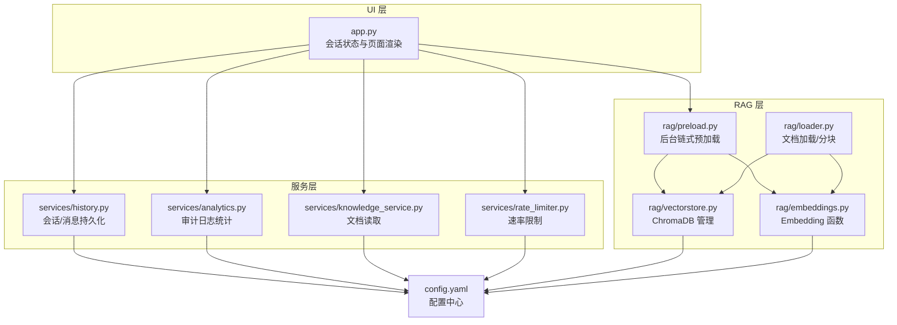
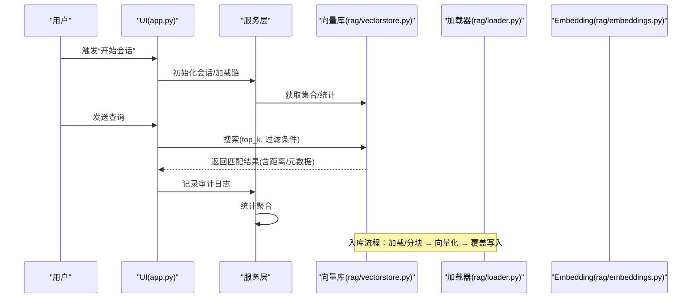
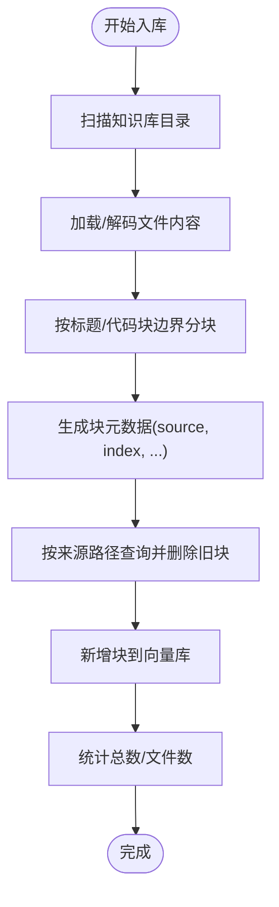
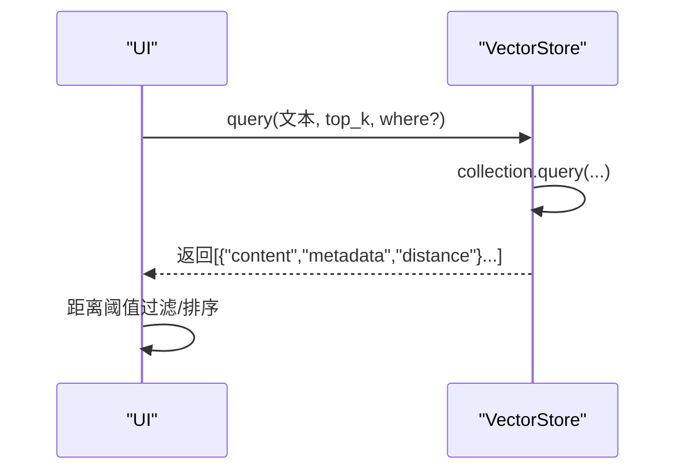
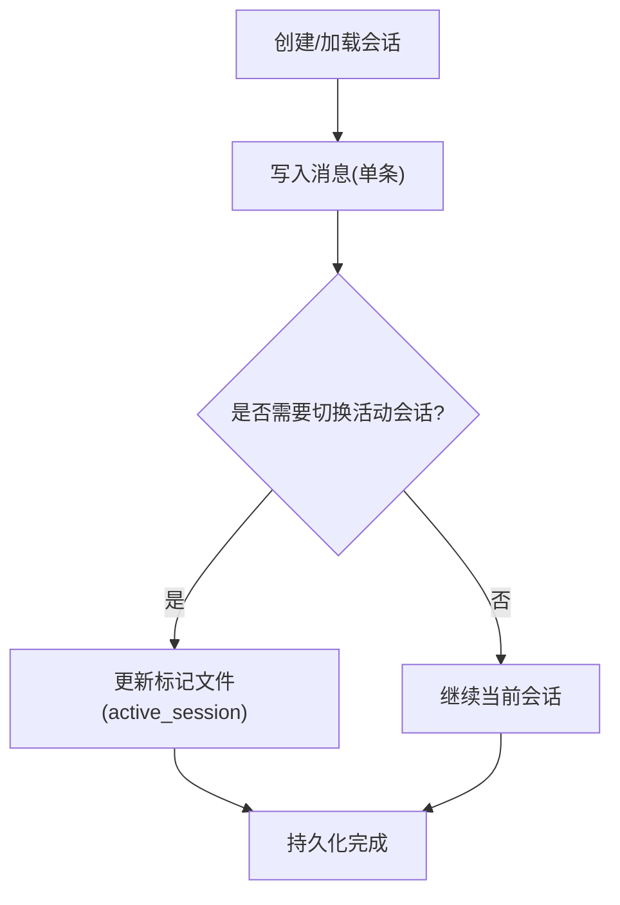
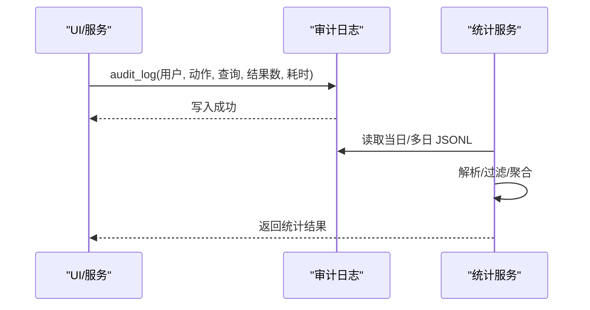
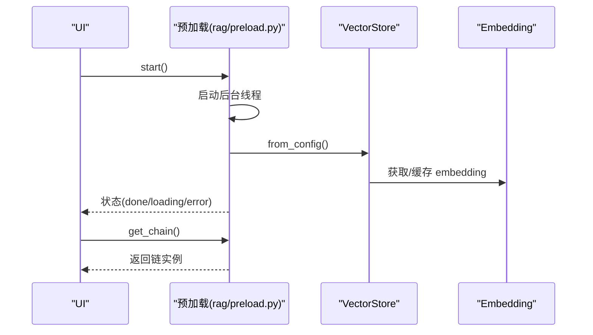
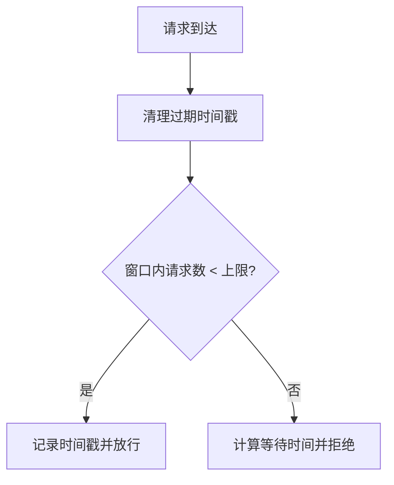
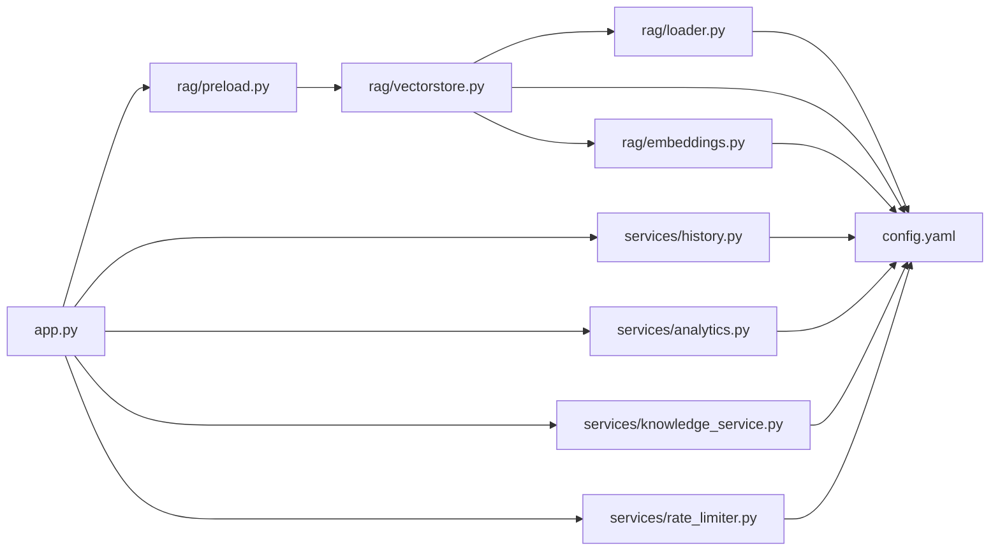

# 数据一致性保障

<cite>
**本文引用的文件**
- [app.py](file://app.py)
- [config.yaml](file://config.yaml)
- [rag/vectorstore.py](file://rag/vectorstore.py)
- [rag/embeddings.py](file://rag/embeddings.py)
- [rag/loader.py](file://rag/loader.py)
- [rag/logging_config.py](file://rag/logging_config.py)
- [services/history.py](file://services/history.py)
- [services/analytics.py](file://services/analytics.py)
- [services/knowledge_service.py](file://services/knowledge_service.py)
- [services/rate_limiter.py](file://services/rate_limiter.py)
- [scripts/ingest.py](file://scripts/ingest.py)
- [rag/preload.py](file://rag/preload.py)
- [tests/test_vectorstore.py](file://tests/test_vectorstore.py)
- [tests/test_history.py](file://tests/test_history.py)
</cite>

## 目录
1. [简介](#简介)
2. [项目结构](#项目结构)
3. [核心组件](#核心组件)
4. [架构总览](#架构总览)
5. [详细组件分析](#详细组件分析)
6. [依赖分析](#依赖分析)
7. [性能考量](#性能考量)
8. [故障排查指南](#故障排查指南)
9. [结论](#结论)
10. [附录](#附录)

## 简介
本文件聚焦于知识管理系统的“数据一致性保障机制”，围绕文档入库、查询检索、会话管理、审计日志与故障恢复等环节，系统阐述事务处理、缓存同步、版本控制与冲突解决策略，并给出一致性约束图与数据同步流程，同时进行性能影响分析与优化建议。

## 项目结构
系统采用三层架构：UI 层（Streamlit）、服务层（业务逻辑与会话/分析/限流）、RAG 层（向量检索与嵌入）。数据流贯穿“文档加载与分块 → 向量化 → 持久化（ChromaDB）→ 查询检索 → 会话持久化 → 审计日志 → 统计分析”。

图表来源
- [app.py:54-90](file://app.py#L54-L90)
- [services/history.py:19-90](file://services/history.py#L19-L90)
- [services/analytics.py:17-106](file://services/analytics.py#L17-L106)
- [services/knowledge_service.py:16-46](file://services/knowledge_service.py#L16-L46)
- [services/rate_limiter.py:45-71](file://services/rate_limiter.py#L45-L71)
- [rag/preload.py:22-59](file://rag/preload.py#L22-L59)
- [rag/loader.py:131-197](file://rag/loader.py#L131-L197)
- [rag/embeddings.py:19-48](file://rag/embeddings.py#L19-L48)
- [rag/vectorstore.py:24-209](file://rag/vectorstore.py#L24-L209)
- [config.yaml:1-50](file://config.yaml#L1-L50)

章节来源
- [app.py:54-90](file://app.py#L54-L90)
- [config.yaml:1-50](file://config.yaml#L1-L50)

## 核心组件
- 文档加载与分块（rag/loader.py）：按标题与代码块边界切分，保留元数据，支持增量更新标识。
- 向量数据库（rag/vectorstore.py）：ChromaDB 客户端与集合管理，支持按来源路径删除与覆盖写入，提供统计与集合切换。
- Embedding（rag/embeddings.py）：SentenceTransformers 封装，延迟加载与进度提示。
- 会话管理（services/history.py）：按用户/会话隔离持久化，支持会话切换、标题更新、消息追加与导出。
- 审计日志（rag/logging_config.py）：JSONL 按日写入，字段标准化，支持查询/反馈等动作记录。
- 统计分析（services/analytics.py）：从审计日志聚合查询量、热门查询、延迟与结果数。
- 配置中心（config.yaml）：LLM/Embedding/向量库/限流/审计开关/UI 等配置。
- 预加载（rag/preload.py）：后台线程加载 RAG 链，避免 UI 重绘导致状态丢失。
- 速率限制（services/rate_limiter.py）：按用户每分钟令牌桶式限制，周期清理不活跃用户。

章节来源
- [rag/loader.py:131-197](file://rag/loader.py#L131-L197)
- [rag/vectorstore.py:89-147](file://rag/vectorstore.py#L89-L147)
- [rag/embeddings.py:19-48](file://rag/embeddings.py#L19-L48)
- [services/history.py:19-90](file://services/history.py#L19-L90)
- [rag/logging_config.py:86-129](file://rag/logging_config.py#L86-L129)
- [services/analytics.py:17-106](file://services/analytics.py#L17-L106)
- [config.yaml:1-50](file://config.yaml#L1-L50)
- [rag/preload.py:22-59](file://rag/preload.py#L22-L59)
- [services/rate_limiter.py:45-71](file://services/rate_limiter.py#L45-L71)

## 架构总览
系统通过“文档入库 → 向量检索 → 会话持久化 → 审计日志”的闭环实现数据一致性：

- 入库一致性：以“来源路径+块索引”作为唯一键，先查重再删除旧块，最后新增，确保同一来源的增量更新幂等。
- 查询一致性：检索参数来自配置，返回结果包含距离与元数据，前端按阈值过滤，避免无关召回。
- 会话一致性：按用户目录隔离，会话文件与“活动会话”标记文件原子写入，消息追加采用单条写入，兼容旧版按日期文件。
- 审计一致性：审计日志按天追加写入，字段标准化，统计模块按时间窗口聚合，保证统计口径一致。
- 并发与恢复：会话文件为单进程写入；向量库由 ChromaDB 内部管理；预加载状态为模块级共享内存，重启后可再次触发。

图表来源
- [app.py:72-90](file://app.py#L72-L90)
- [services/history.py:193-221](file://services/history.py#L193-L221)
- [rag/vectorstore.py:124-142](file://rag/vectorstore.py#L124-L142)
- [rag/loader.py:131-197](file://rag/loader.py#L131-L197)
- [rag/embeddings.py:41-48](file://rag/embeddings.py#L41-L48)

## 详细组件分析

### 文档入库与版本控制
- 增量更新策略：入库前按“来源路径+块索引”查询并删除旧块，再新增，保证同一来源的块版本覆盖。
- 版本标识：块元数据包含 source、chunk_index、title、file_type，便于去重与统计。
- 批处理与幂等：脚本一次性加载并入库，若重复执行，旧块先删后增，最终数量不变。

图表来源
- [scripts/ingest.py:25-58](file://scripts/ingest.py#L25-L58)
- [rag/loader.py:131-197](file://rag/loader.py#L131-L197)
- [rag/vectorstore.py:89-112](file://rag/vectorstore.py#L89-L112)

章节来源
- [scripts/ingest.py:25-58](file://scripts/ingest.py#L25-L58)
- [rag/loader.py:131-197](file://rag/loader.py#L131-L197)
- [rag/vectorstore.py:89-112](file://rag/vectorstore.py#L89-L112)
- [tests/test_vectorstore.py:50-65](file://tests/test_vectorstore.py#L50-L65)

### 查询检索与阈值过滤
- 检索参数：来自配置的 top_k 与距离阈值，前端可进一步过滤。
- 结果结构：包含 content、metadata、distance，便于后续排序与阈值过滤。
- 元数据过滤：支持 where 条件，按 source 等字段筛选。

图表来源
- [rag/vectorstore.py:124-142](file://rag/vectorstore.py#L124-L142)
- [config.yaml:16-24](file://config.yaml#L16-L24)

章节来源
- [rag/vectorstore.py:124-142](file://rag/vectorstore.py#L124-L142)
- [config.yaml:16-24](file://config.yaml#L16-L24)

### 会话管理与并发控制
- 目录与文件：按用户创建目录，会话列表与活动会话标记文件，每个会话独立 JSON 文件。
- 并发写入：消息追加采用单条写入，兼容旧版按日期文件；会话切换通过更新标记文件实现。
- 并发访问：同一用户多会话并行写入，但 UI 侧通常单用户单会话交互，避免竞争；若存在并发，建议引入文件锁或序列化写入。

图表来源
- [services/history.py:193-221](file://services/history.py#L193-L221)
- [services/history.py:115-139](file://services/history.py#L115-L139)

章节来源
- [services/history.py:19-90](file://services/history.py#L19-L90)
- [services/history.py:193-221](file://services/history.py#L193-L221)
- [services/history.py:115-139](file://services/history.py#L115-L139)
- [tests/test_history.py:20-59](file://tests/test_history.py#L20-L59)

### 审计日志与数据完整性
- 写入策略：按日追加 JSONL，字段标准化，包含时间戳、用户、动作、查询、答案预览、结果数、耗时。
- 读取与聚合：统计模块按天读取，按用户过滤，聚合查询量、热门查询、平均结果数与延迟。
- 完整性保障：单行写入，异常跳过；统计模块忽略解析失败行，保证整体可用。

图表来源
- [rag/logging_config.py:86-129](file://rag/logging_config.py#L86-L129)
- [services/analytics.py:17-106](file://services/analytics.py#L17-L106)

章节来源
- [rag/logging_config.py:86-129](file://rag/logging_config.py#L86-L129)
- [services/analytics.py:17-106](file://services/analytics.py#L17-L106)

### 缓存同步与预加载
- Embedding 模型缓存：向量库单例缓存 embedding 函数，避免重复加载。
- 链式预加载：后台线程加载 RAGChain，状态为模块级共享字典，UI 重绘不影响已加载状态。
- 同步策略：预加载完成后，UI 从共享状态获取链实例，避免重复初始化。

图表来源
- [rag/preload.py:22-59](file://rag/preload.py#L22-L59)
- [rag/vectorstore.py:182-209](file://rag/vectorstore.py#L182-L209)
- [rag/embeddings.py:31-39](file://rag/embeddings.py#L31-L39)

章节来源
- [rag/preload.py:22-59](file://rag/preload.py#L22-L59)
- [rag/vectorstore.py:182-209](file://rag/vectorstore.py#L182-L209)
- [rag/embeddings.py:31-39](file://rag/embeddings.py#L31-L39)

### 速率限制与冲突解决
- 令牌桶：每用户维护近一分钟时间戳列表，超过上限阻塞并提示等待时间。
- 冲突解决：同一窗口内请求过多时，按到达顺序排队；清理不活跃用户，防止内存膨胀。
- 与会话一致性：限流在查询阶段生效，不影响会话持久化；若限流导致请求失败，应记录审计日志以便追踪。

图表来源
- [services/rate_limiter.py:45-71](file://services/rate_limiter.py#L45-L71)

章节来源
- [services/rate_limiter.py:45-71](file://services/rate_limiter.py#L45-L71)

### 故障恢复机制
- 向量库：集合清空/重建由管理命令触发；客户端异常时可重建集合。
- 会话：会话文件损坏不影响其他用户；可通过会话列表重建活动会话。
- 审计日志：按日文件，单行损坏不影响其他行；统计模块跳过无效行。
- 预加载：失败状态记录，UI 可提示重试或降级；重启后可再次触发。

章节来源
- [rag/vectorstore.py:171-179](file://rag/vectorstore.py#L171-L179)
- [services/history.py:55-71](file://services/history.py#L55-L71)
- [rag/logging_config.py:115-129](file://rag/logging_config.py#L115-L129)
- [rag/preload.py:42-48](file://rag/preload.py#L42-L48)

## 依赖分析
- 组件耦合
  - UI 依赖服务层与预加载模块，服务层依赖配置与日志。
  - RAG 层内部：加载器依赖配置与日志；向量库依赖加载器与嵌入函数；嵌入函数依赖模型库。
- 外部依赖
  - ChromaDB（持久化）、sentence-transformers（向量化）、pymupdf（PDF 解析）。
- 循环依赖
  - 未发现直接循环；模块间通过函数调用与配置传递数据。

图表来源
- [app.py:54-90](file://app.py#L54-L90)
- [services/history.py:19-90](file://services/history.py#L19-L90)
- [services/analytics.py:17-106](file://services/analytics.py#L17-L106)
- [services/knowledge_service.py:16-46](file://services/knowledge_service.py#L16-L46)
- [services/rate_limiter.py:45-71](file://services/rate_limiter.py#L45-L71)
- [rag/preload.py:22-59](file://rag/preload.py#L22-L59)
- [rag/vectorstore.py:24-209](file://rag/vectorstore.py#L24-L209)
- [rag/loader.py:131-197](file://rag/loader.py#L131-L197)
- [rag/embeddings.py:19-48](file://rag/embeddings.py#L19-L48)
- [config.yaml:1-50](file://config.yaml#L1-50)

章节来源
- [app.py:54-90](file://app.py#L54-L90)
- [rag/vectorstore.py:24-209](file://rag/vectorstore.py#L24-L209)
- [rag/loader.py:131-197](file://rag/loader.py#L131-L197)
- [rag/embeddings.py:19-48](file://rag/embeddings.py#L19-L48)
- [services/history.py:19-90](file://services/history.py#L19-L90)
- [services/analytics.py:17-106](file://services/analytics.py#L17-L106)
- [services/knowledge_service.py:16-46](file://services/knowledge_service.py#L16-L46)
- [services/rate_limiter.py:45-71](file://services/rate_limiter.py#L45-L71)
- [rag/preload.py:22-59](file://rag/preload.py#L22-L59)
- [config.yaml:1-50](file://config.yaml#L1-50)

## 性能考量
- 向量入库
  - 增量覆盖写入避免重复存储，减少磁盘占用与写放大。
  - Embedding 模型延迟加载与单例缓存降低冷启动成本。
- 查询检索
  - top_k 与距离阈值控制召回规模，前端二次过滤提升命中质量。
  - 元数据 where 条件可缩小检索范围。
- 会话持久化
  - 单条消息追加写入，I/O 开销小；会话文件按用户隔离，避免跨用户竞争。
- 审计日志
  - JSONL 追加写入，统计模块按天聚合，避免全量扫描。
- 速率限制
  - 内存中维护时间戳，O(1) 判断；定期清理降低内存占用。

优化建议
- 入库：批量提交（如分批 add_documents）减少客户端往返；对大文件分块设置合理 overlap。
- 检索：对高频查询建立热点词缓存；结合向量与关键词混合检索。
- 会话：对并发写入场景增加文件锁或队列化写入。
- 日志：按周/月轮转压缩，清理过期日志；统计模块异步化。
- 预加载：在低峰时段触发，避免与用户高峰冲突。

## 故障排查指南
- 向量库不可用
  - 现象：入库/查询报错。
  - 排查：确认 persist_directory 存在且可写；尝试清空集合后重建；检查模型加载日志。
- 会话丢失或错乱
  - 现象：切换会话后消息不正确。
  - 排查：检查“活动会话”标记文件；确认会话 JSON 文件未损坏；必要时重建会话。
- 审计日志缺失
  - 现象：统计为空。
  - 排查：确认 audit_enabled 开启；检查 audit 日志目录权限；核对日期文件是否存在。
- 预加载失败
  - 现象：UI 显示加载失败。
  - 排查：查看后台线程错误信息；确认模型下载镜像可用；重启后重试。
- 速率限制频繁
  - 现象：用户频繁被限流。
  - 排查：调整 max_requests_per_minute；检查客户端是否短时间大量请求。

章节来源
- [rag/vectorstore.py:171-179](file://rag/vectorstore.py#L171-L179)
- [services/history.py:55-71](file://services/history.py#L55-L71)
- [rag/logging_config.py:106-129](file://rag/logging_config.py#L106-L129)
- [rag/preload.py:42-48](file://rag/preload.py#L42-L48)
- [services/rate_limiter.py:65-71](file://services/rate_limiter.py#L65-L71)

## 结论
系统通过“来源路径+块索引”的幂等覆盖、JSONL 审计日志、按用户隔离的会话文件与模块级预加载状态，实现了文档入库、查询检索、会话管理与审计统计的多环节一致性。建议在并发写入、日志轮转与检索缓存方面进一步优化，以提升稳定性与性能。

## 附录
- 关键配置项
  - 向量库：persist_directory、collection_name、top_k、distance_threshold
  - Embedding：model、local_path
  - 限流：enabled、max_requests_per_minute、max_input_length
  - 审计：audit_enabled
- 测试验证点
  - 向量库：重复入库覆盖、统计文件数、集合切换、清空集合。
  - 会话：创建/切换/标题更新、消息追加、导出功能。

章节来源
- [config.yaml:16-50](file://config.yaml#L16-L50)
- [tests/test_vectorstore.py:50-78](file://tests/test_vectorstore.py#L50-L78)
- [tests/test_history.py:20-59](file://tests/test_history.py#L20-L59)