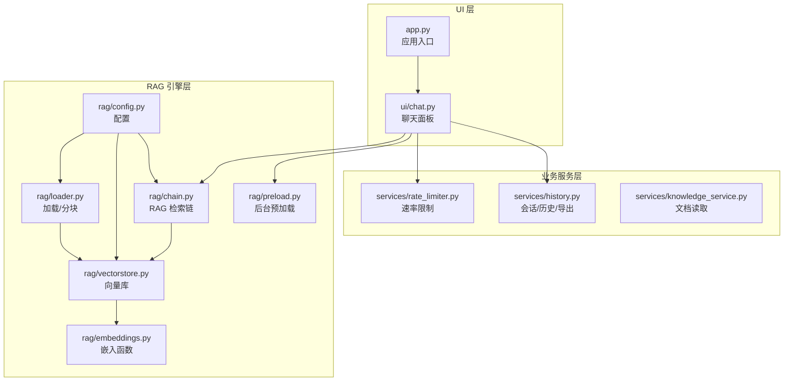
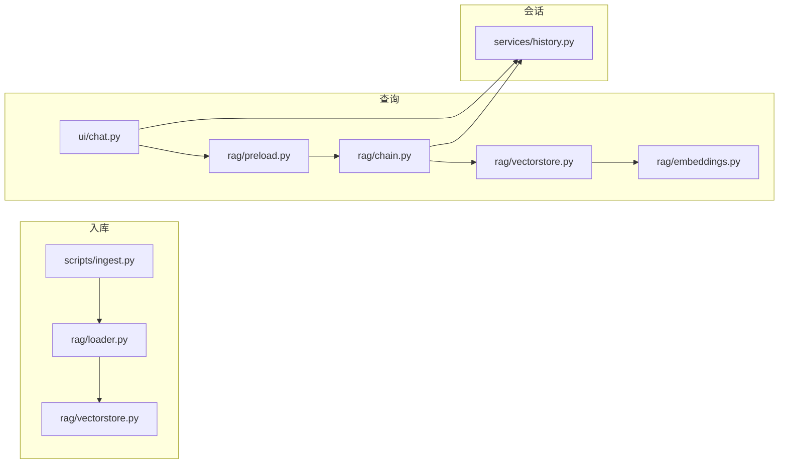
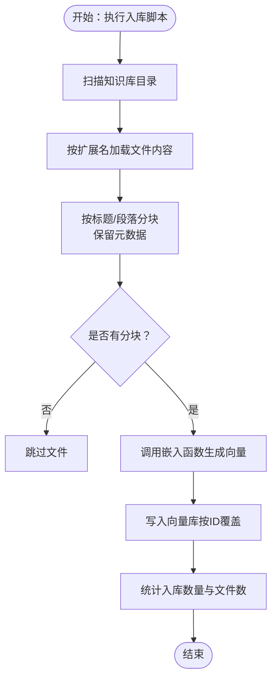
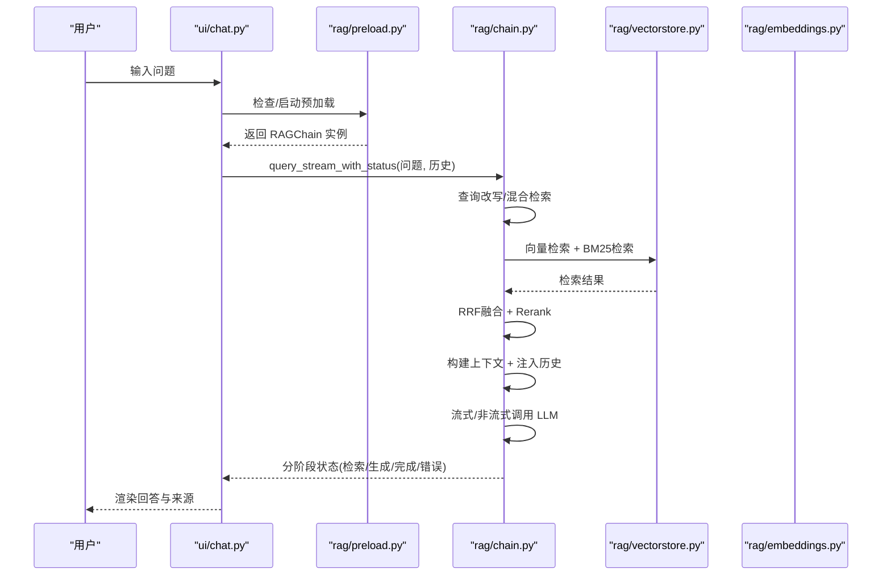
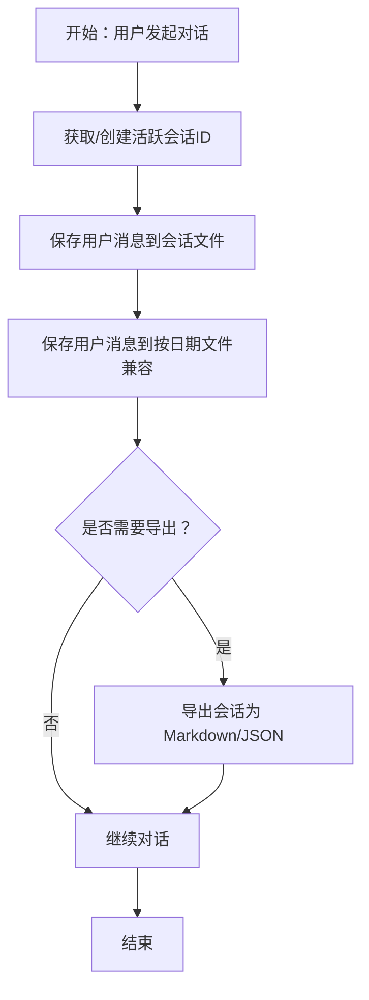
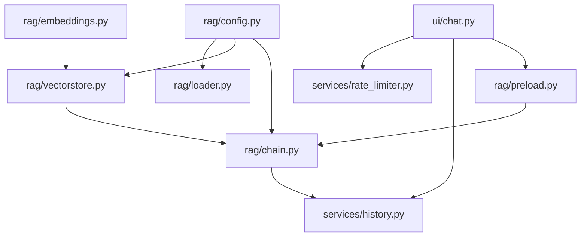
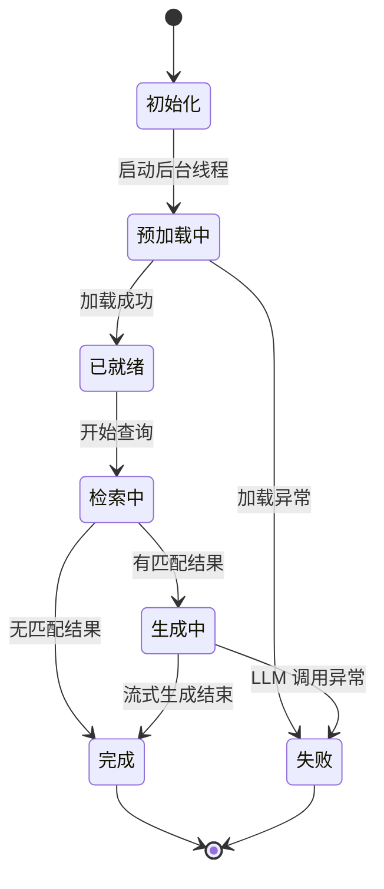

# 数据流架构

<cite>
**本文引用的文件**
- [app.py](file://app.py)
- [config.yaml](file://config.yaml)
- [rag/config.py](file://rag/config.py)
- [rag/loader.py](file://rag/loader.py)
- [rag/vectorstore.py](file://rag/vectorstore.py)
- [rag/embeddings.py](file://rag/embeddings.py)
- [rag/chain.py](file://rag/chain.py)
- [rag/preload.py](file://rag/preload.py)
- [services/history.py](file://services/history.py)
- [services/rate_limiter.py](file://services/rate_limiter.py)
- [ui/chat.py](file://ui/chat.py)
- [scripts/ingest.py](file://scripts/ingest.py)
- [tests/test_chain.py](file://tests/test_chain.py)
- [tests/test_vectorstore.py](file://tests/test_vectorstore.py)
</cite>

## 目录
1. [简介](#简介)
2. [项目结构](#项目结构)
3. [核心组件](#核心组件)
4. [架构总览](#架构总览)
5. [详细组件分析](#详细组件分析)
6. [依赖关系分析](#依赖关系分析)
7. [性能考量](#性能考量)
8. [故障排查指南](#故障排查指南)
9. [结论](#结论)
10. [附录](#附录)

## 简介
本文件面向知识管理系统，聚焦“数据流架构”，系统性梳理从用户输入到最终响应的完整数据路径，覆盖三大主流程：
- 文档入库流程：文件上传→解析→分块→向量化→存储
- 查询处理流程：用户提问→检索→生成→响应
- 会话管理流程：消息存储→历史查询→导出

同时给出数据流图与状态转换图，说明各组件间的数据转换与处理过程，并讨论数据一致性与性能优化策略。

## 项目结构
系统采用“UI 层 + 业务服务层 + RAG 引擎层”的分层组织：
- UI 层：Streamlit 页面与组件（登录、侧边栏、聊天面板）
- 业务服务层：历史管理、速率限制、知识服务等
- RAG 引擎层：配置、文档加载与分块、向量库、嵌入、检索链、预加载

图表来源
- [app.py:54-90](file://app.py#L54-L90)
- [ui/chat.py:19-73](file://ui/chat.py#L19-L73)
- [services/history.py:182-221](file://services/history.py#L182-L221)
- [services/rate_limiter.py:45-71](file://services/rate_limiter.py#L45-L71)
- [rag/preload.py:22-49](file://rag/preload.py#L22-L49)
- [rag/chain.py:425-528](file://rag/chain.py#L425-L528)
- [rag/vectorstore.py:89-142](file://rag/vectorstore.py#L89-L142)
- [rag/loader.py:131-197](file://rag/loader.py#L131-L197)
- [rag/config.py:138-150](file://rag/config.py#L138-L150)

章节来源
- [app.py:54-90](file://app.py#L54-L90)
- [ui/chat.py:19-73](file://ui/chat.py#L19-L73)
- [services/history.py:182-221](file://services/history.py#L182-L221)
- [services/rate_limiter.py:45-71](file://services/rate_limiter.py#L45-L71)
- [rag/preload.py:22-49](file://rag/preload.py#L22-L49)
- [rag/chain.py:425-528](file://rag/chain.py#L425-L528)
- [rag/vectorstore.py:89-142](file://rag/vectorstore.py#L89-L142)
- [rag/loader.py:131-197](file://rag/loader.py#L131-L197)
- [rag/config.py:138-150](file://rag/config.py#L138-L150)

## 核心组件
- 配置管理：集中管理 LLM、Embedding、向量库、知识库、速率限制、UI 等配置，支持环境变量替换与单例访问。
- 文档加载与分块：递归扫描知识库目录，按 Markdown 标题与段落切分，保留元数据；支持 PDF 文本抽取。
- 向量库：基于 ChromaDB 的持久化向量存储，支持集合切换、批量增删、检索与统计。
- 嵌入函数：封装 sentence-transformers 中文模型，延迟加载并兼容本地/在线模型。
- RAG 检索链：混合检索（向量 + BM25）+ RRF 融合 + Cross-Encoder 重排 + 上下文预算控制 + 流式/非流式 LLM 调用。
- 预加载：后台线程加载 RAGChain，避免首查延迟。
- 会话管理：按用户/会话隔离的 JSON 持久化，支持导出 Markdown/JSON。
- 速率限制：基于内存的时间戳队列，定期清理不活跃用户。

章节来源
- [rag/config.py:138-150](file://rag/config.py#L138-L150)
- [rag/loader.py:131-197](file://rag/loader.py#L131-L197)
- [rag/vectorstore.py:89-142](file://rag/vectorstore.py#L89-L142)
- [rag/embeddings.py:19-48](file://rag/embeddings.py#L19-L48)
- [rag/chain.py:162-333](file://rag/chain.py#L162-L333)
- [rag/preload.py:22-49](file://rag/preload.py#L22-L49)
- [services/history.py:182-221](file://services/history.py#L182-L221)
- [services/rate_limiter.py:45-71](file://services/rate_limiter.py#L45-L71)

## 架构总览
系统通过“配置驱动 + 组件协作”的方式实现数据流闭环：
- 入库链路：scripts/ingest.py 作为 CLI 入口，调用 rag/loader 与 rag/vectorstore 完成入库。
- 查询链路：ui/chat.py 触发预加载与 RAGChain，经向量检索/BM25/RRF/Rerank 后构造上下文，调用 LLM 生成并流式返回。
- 会话链路：ui/chat.py 与 services/history.py 协作，持久化消息并支持导出。

图表来源
- [scripts/ingest.py:25-58](file://scripts/ingest.py#L25-L58)
- [rag/loader.py:131-197](file://rag/loader.py#L131-L197)
- [rag/vectorstore.py:89-142](file://rag/vectorstore.py#L89-L142)
- [ui/chat.py:19-73](file://ui/chat.py#L19-L73)
- [rag/preload.py:22-49](file://rag/preload.py#L22-L49)
- [rag/chain.py:425-528](file://rag/chain.py#L425-L528)
- [services/history.py:182-221](file://services/history.py#L182-L221)

## 详细组件分析

### 文档入库流程（文件上传→解析→分块→向量化→存储）
- 入口：scripts/ingest.py 扫描知识库目录，读取 .md/.txt/.pdf，按配置分块，向量化后写入 ChromaDB。
- 解析与分块：rag/loader.py 依据 Markdown 标题与段落切分，保留 source/title/chunk_index 等元数据。
- 向量化：rag/embeddings.py 封装中文嵌入模型，延迟加载；rag/vectorstore.py 调用嵌入函数并将文档写入集合。
- 存储：向量库支持同 ID 覆盖（增量更新），并提供统计与集合切换能力。

图表来源
- [scripts/ingest.py:25-58](file://scripts/ingest.py#L25-L58)
- [rag/loader.py:131-197](file://rag/loader.py#L131-L197)
- [rag/embeddings.py:19-48](file://rag/embeddings.py#L19-L48)
- [rag/vectorstore.py:89-142](file://rag/vectorstore.py#L89-L142)

章节来源
- [scripts/ingest.py:25-58](file://scripts/ingest.py#L25-L58)
- [rag/loader.py:131-197](file://rag/loader.py#L131-L197)
- [rag/embeddings.py:19-48](file://rag/embeddings.py#L19-L48)
- [rag/vectorstore.py:89-142](file://rag/vectorstore.py#L89-L142)

### 查询处理流程（用户提问→检索→生成→响应）
- UI 触发：ui/chat.py 渲染聊天面板，收集用户输入，触发预加载与 RAGChain。
- 预加载：rag/preload.py 后台线程加载 RAGChain，避免首查卡顿。
- 检索：rag/chain.py 执行混合检索（向量 + BM25），RRF 融合，Cross-Encoder 重排。
- 上下文构建：按 LLM 上下文窗口预算裁剪检索结果，注入历史对话。
- 生成：OpenAI SDK 流式/非流式调用，逐步返回 token，最终汇总并返回。
- 审计与状态：分阶段返回 searching/generating/done/error，记录审计日志。

图表来源
- [ui/chat.py:96-190](file://ui/chat.py#L96-L190)
- [rag/preload.py:22-49](file://rag/preload.py#L22-L49)
- [rag/chain.py:425-528](file://rag/chain.py#L425-L528)
- [rag/vectorstore.py:124-142](file://rag/vectorstore.py#L124-L142)
- [rag/embeddings.py:19-48](file://rag/embeddings.py#L19-L48)

章节来源
- [ui/chat.py:96-190](file://ui/chat.py#L96-L190)
- [rag/preload.py:22-49](file://rag/preload.py#L22-L49)
- [rag/chain.py:425-528](file://rag/chain.py#L425-L528)
- [rag/vectorstore.py:124-142](file://rag/vectorstore.py#L124-L142)
- [rag/embeddings.py:19-48](file://rag/embeddings.py#L19-L48)

### 会话管理流程（消息存储→历史查询→导出）
- 创建/切换会话：services/history.py 提供会话列表、创建、切换、标题更新。
- 消息持久化：按会话 JSON 存储，同时兼容旧版按日期文件；支持加载指定会话历史。
- 导出：支持 Markdown 与 JSON 两种格式，便于归档与分享。

图表来源
- [services/history.py:55-90](file://services/history.py#L55-L90)
- [services/history.py:182-221](file://services/history.py#L182-L221)
- [services/history.py:247-270](file://services/history.py#L247-L270)

章节来源
- [services/history.py:55-90](file://services/history.py#L55-L90)
- [services/history.py:182-221](file://services/history.py#L182-L221)
- [services/history.py:247-270](file://services/history.py#L247-L270)

### 速率限制与防抖
- 速率限制：按用户每分钟请求数限制，定期清理不活跃记录，防止内存膨胀。
- 防重复提交：UI 层检测最后一条消息与当前输入一致则跳过。

章节来源
- [services/rate_limiter.py:45-71](file://services/rate_limiter.py#L45-L71)
- [ui/chat.py:100-107](file://ui/chat.py#L100-L107)

## 依赖关系分析
- 配置依赖：所有组件通过 rag/config.py 的单例配置对象访问参数，避免分散硬编码。
- 组件耦合：
  - RAGChain 依赖 VectorStore 与配置；VectorStore 依赖 EmbeddingsFunction。
  - UI 依赖预加载模块与历史服务；历史服务依赖文件系统。
- 外部依赖：ChromaDB、sentence-transformers、OpenAI SDK、PyMuPDF（PDF）。

图表来源
- [rag/config.py:138-150](file://rag/config.py#L138-L150)
- [rag/chain.py:604-610](file://rag/chain.py#L604-L610)
- [rag/vectorstore.py:181-209](file://rag/vectorstore.py#L181-L209)
- [rag/embeddings.py:19-48](file://rag/embeddings.py#L19-L48)
- [rag/preload.py:56-58](file://rag/preload.py#L56-L58)
- [services/history.py:182-221](file://services/history.py#L182-L221)
- [services/rate_limiter.py:45-71](file://services/rate_limiter.py#L45-L71)
- [ui/chat.py:19-73](file://ui/chat.py#L19-L73)

章节来源
- [rag/config.py:138-150](file://rag/config.py#L138-L150)
- [rag/chain.py:604-610](file://rag/chain.py#L604-L610)
- [rag/vectorstore.py:181-209](file://rag/vectorstore.py#L181-L209)
- [rag/embeddings.py:19-48](file://rag/embeddings.py#L19-L48)
- [rag/preload.py:56-58](file://rag/preload.py#L56-L58)
- [services/history.py:182-221](file://services/history.py#L182-L221)
- [services/rate_limiter.py:45-71](file://services/rate_limiter.py#L45-L71)
- [ui/chat.py:19-73](file://ui/chat.py#L19-L73)

## 性能考量
- 预加载与缓存
  - 预加载：后台线程加载 RAGChain，避免首查延迟。
  - 向量库缓存：VectorStore 全局单例缓存，相同配置仅创建一次实例，避免重复加载嵌入模型。
  - Reranker 缓存：RAGChain 类级别缓存 Cross-Encoder 模型，避免重复加载。
- 检索优化
  - 混合检索：向量检索兜底 BM25，提升召回质量。
  - RRF 融合：统一排序，兼顾语义与关键词相关性。
  - 距离阈值过滤：过滤低相关度文档块，减少上下文噪声。
- 上下文预算
  - Token 估算与裁剪：根据 LLM 上下文窗口动态计算预算，避免溢出。
- I/O 与并发
  - 批量写入：向量库按 ID 批量 upsert，减少多次往返。
  - 流式生成：LLM 流式返回，降低首字节延迟。
- 配置建议
  - 合理设置 chunk_size/chunk_overlap，平衡语义完整性与向量规模。
  - top_k 与 distance_threshold 根据数据规模与精度需求调优。

章节来源
- [rag/preload.py:22-49](file://rag/preload.py#L22-L49)
- [rag/vectorstore.py:181-209](file://rag/vectorstore.py#L181-L209)
- [rag/chain.py:174-177](file://rag/chain.py#L174-L177)
- [rag/chain.py:238-301](file://rag/chain.py#L238-L301)
- [rag/chain.py:393-406](file://rag/chain.py#L393-L406)
- [config.yaml:24-27](file://config.yaml#L24-L27)
- [config.yaml:16-22](file://config.yaml#L16-L22)

## 故障排查指南
- 初始化失败
  - 现象：UI 显示“系统初始化失败”。
  - 排查：检查 rag/preload.py 的错误信息；确认 config.yaml 的 LLM API 配置与网络连通性。
- 检索无结果
  - 现象：回答“知识库中暂无相关内容”。
  - 排查：确认入库是否成功（VectorStore 统计）；检查 distance_threshold 设置；尝试增大 top_k。
- 生成异常
  - 现象：返回 error 状态。
  - 排查：查看 LLM 调用日志与重试机制；确认模型可用性与 API Key。
- 会话导出为空
  - 现象：导出内容为空。
  - 排查：确认当前会话是否存在历史；检查 services/history.py 的会话文件路径与权限。
- 速率限制频繁
  - 现象：提示“请求过于频繁”。
  - 排查：调整 rate_limit.max_requests_per_minute；观察用户请求频率。

章节来源
- [ui/chat.py:37-44](file://ui/chat.py#L37-L44)
- [rag/preload.py:42-48](file://rag/preload.py#L42-L48)
- [rag/chain.py:458-471](file://rag/chain.py#L458-L471)
- [rag/vectorstore.py:149-169](file://rag/vectorstore.py#L149-L169)
- [services/history.py:247-270](file://services/history.py#L247-L270)
- [services/rate_limiter.py:65-71](file://services/rate_limiter.py#L65-L71)

## 结论
本系统通过清晰的分层与模块化设计，实现了从文档入库到查询响应的完整数据流闭环。预加载、缓存与混合检索等策略有效提升了性能与稳定性；严格的配置驱动与审计日志保障了可维护性与可观测性。后续可在大规模场景下进一步引入向量库分片、Reranker 模型量化与检索加速索引等优化手段。

## 附录

### 数据一致性保证
- 入库一致性：同 ID 覆盖写入，确保同一源文件的增量更新；统计接口提供入库前后对比。
- 检索一致性：RRF 融合与去重哈希，避免重复文档影响排序；距离阈值过滤降低噪声。
- 会话一致性：按用户/会话隔离存储，导出时一次性读取，避免并发写入冲突。

章节来源
- [rag/vectorstore.py:105-112](file://rag/vectorstore.py#L105-L112)
- [rag/chain.py:131-160](file://rag/chain.py#L131-L160)
- [services/history.py:182-221](file://services/history.py#L182-L221)

### 关键流程状态图（查询链路）

图表来源
- [rag/preload.py:22-49](file://rag/preload.py#L22-L49)
- [rag/chain.py:425-528](file://rag/chain.py#L425-L528)