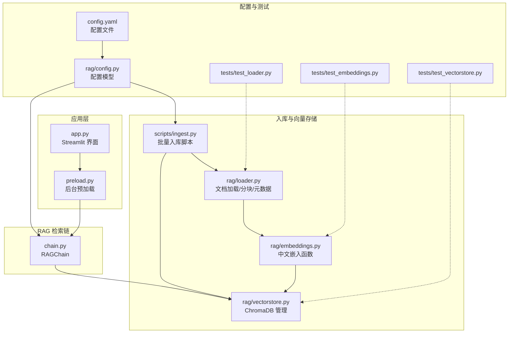
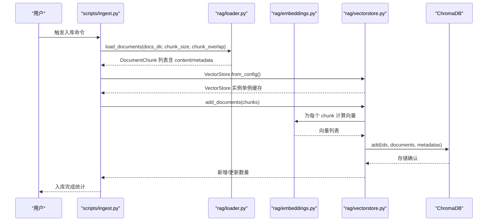
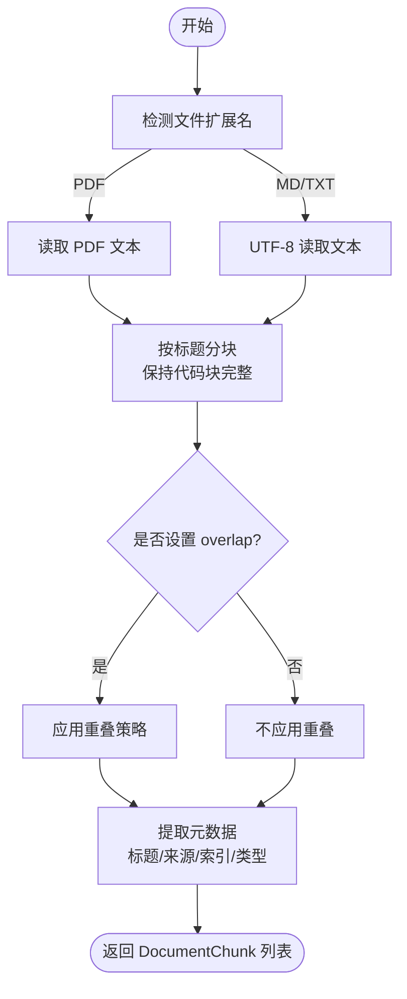
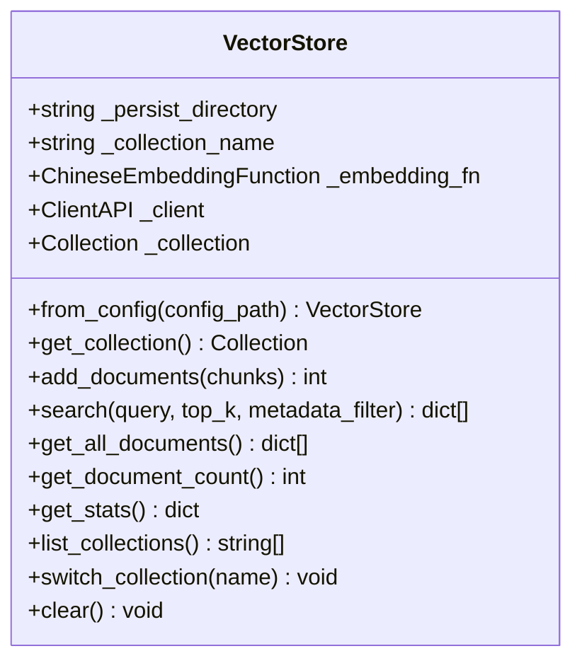
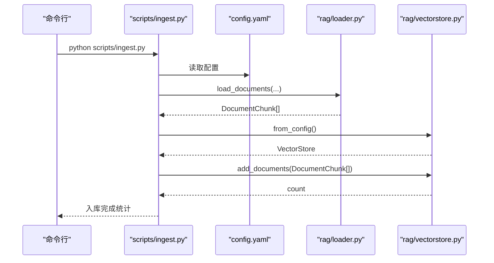
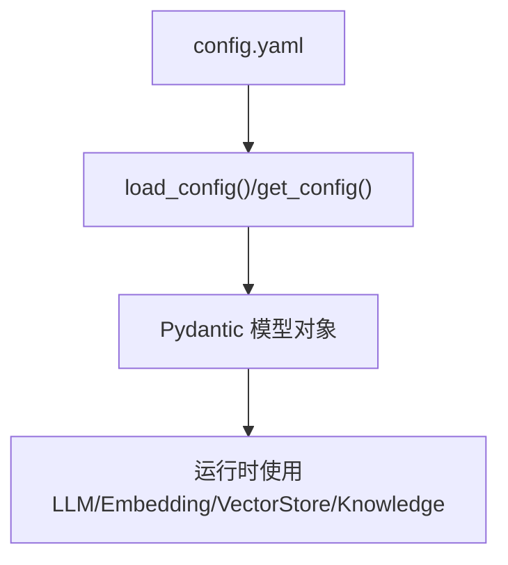
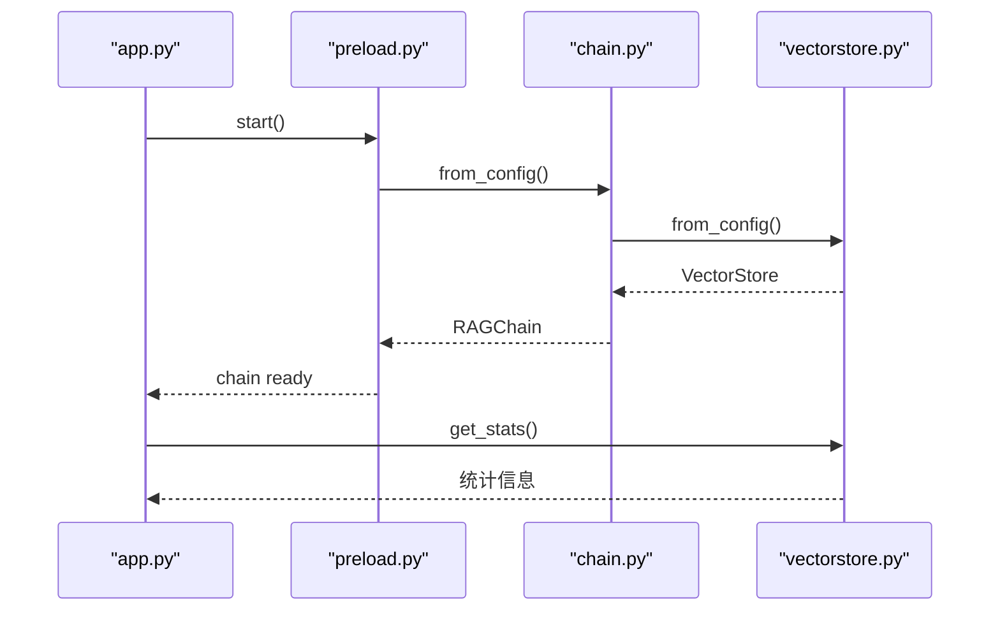
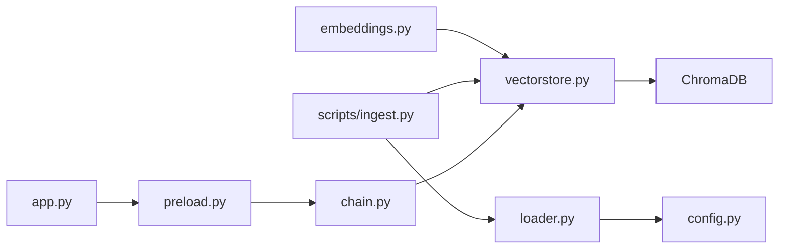

# 文档入库流程

<cite>
**本文引用的文件**
- [loader.py](file://rag/loader.py)
- [embeddings.py](file://rag/embeddings.py)
- [vectorstore.py](file://rag/vectorstore.py)
- [ingest.py](file://scripts/ingest.py)
- [config.py](file://rag/config.py)
- [config.yaml](file://config.yaml)
- [chain.py](file://rag/chain.py)
- [preload.py](file://rag/preload.py)
- [app.py](file://app.py)
- [test_loader.py](file://tests/test_loader.py)
- [test_embeddings.py](file://tests/test_embeddings.py)
- [test_vectorstore.py](file://tests/test_vectorstore.py)
</cite>

## 目录
1. [简介](#简介)
2. [项目结构](#项目结构)
3. [核心组件](#核心组件)
4. [架构总览](#架构总览)
5. [详细组件分析](#详细组件分析)
6. [依赖关系分析](#依赖关系分析)
7. [性能考量](#性能考量)
8. [故障排查指南](#故障排查指南)
9. [结论](#结论)
10. [附录](#附录)

## 简介
本文面向知识管理系统的“文档入库流程”，系统性梳理从文件上传到向量存储的完整数据处理链路，涵盖文件格式检测、内容解析、文档分块、向量嵌入、元数据提取与存储优化。重点说明多格式文档（MD、TXT、PDF）的处理策略、分块算法选择原则、嵌入模型使用方式以及向量数据库的存储结构，并提供数据流图、错误处理机制与性能优化建议。

## 项目结构
系统采用分层设计：
- 应用入口与界面：app.py（Streamlit Web 界面），通过 preload 模块后台加载 RAGChain，提升交互体验
- 检索增强生成（RAG）链：chain.py（检索、重排序、Prompt 构建、LLM 调用）
- 文档入库与检索：scripts/ingest.py（批量入库脚本），配合 rag/loader.py、rag/embeddings.py、rag/vectorstore.py
- 配置管理：rag/config.py（Pydantic 配置模型），config.yaml（配置文件）
- 单元测试：tests/ 下的对应模块测试



图表来源
- [app.py:1-189](file://app.py#L1-L189)
- [preload.py:1-73](file://rag/preload.py#L1-L73)
- [chain.py:1-610](file://rag/chain.py#L1-L610)
- [ingest.py:1-62](file://scripts/ingest.py#L1-L62)
- [loader.py:1-259](file://rag/loader.py#L1-L259)
- [embeddings.py:1-48](file://rag/embeddings.py#L1-L48)
- [vectorstore.py:1-209](file://rag/vectorstore.py#L1-L209)
- [config.py:1-185](file://rag/config.py#L1-L185)
- [config.yaml:1-49](file://config.yaml#L1-L49)
- [test_loader.py:1-138](file://tests/test_loader.py#L1-L138)
- [test_embeddings.py:1-30](file://tests/test_embeddings.py#L1-L30)
- [test_vectorstore.py:1-146](file://tests/test_vectorstore.py#L1-L146)

章节来源
- [app.py:1-189](file://app.py#L1-L189)
- [chain.py:1-610](file://rag/chain.py#L1-L610)
- [ingest.py:1-62](file://scripts/ingest.py#L1-L62)
- [loader.py:1-259](file://rag/loader.py#L1-L259)
- [embeddings.py:1-48](file://rag/embeddings.py#L1-L48)
- [vectorstore.py:1-209](file://rag/vectorstore.py#L1-L209)
- [config.py:1-185](file://rag/config.py#L1-L185)
- [config.yaml:1-49](file://config.yaml#L1-L49)

## 核心组件
- 文档加载与分块：支持 MD、TXT、PDF；按 Markdown 标题分块，保留代码块完整性；支持 overlap；提取标题与文件元数据
- 向量嵌入：基于 sentence-transformers 的中文模型，支持在线/离线加载，延迟初始化
- 向量存储：基于 ChromaDB，支持集合管理、增量更新、检索与统计
- 入库脚本：扫描知识库目录，批量加载、分块、向量化并入库
- 配置管理：统一的 Pydantic 配置模型，支持环境变量替换与全局单例

章节来源
- [loader.py:18-197](file://rag/loader.py#L18-L197)
- [embeddings.py:19-48](file://rag/embeddings.py#L19-L48)
- [vectorstore.py:24-209](file://rag/vectorstore.py#L24-L209)
- [ingest.py:25-58](file://scripts/ingest.py#L25-L58)
- [config.py:48-144](file://rag/config.py#L48-L144)

## 架构总览
下图展示从“文件上传”到“向量存储”的端到端数据流，包括错误处理与性能优化要点。



图表来源
- [ingest.py:25-58](file://scripts/ingest.py#L25-L58)
- [loader.py:131-197](file://rag/loader.py#L131-L197)
- [embeddings.py:31-47](file://rag/embeddings.py#L31-L47)
- [vectorstore.py:89-112](file://rag/vectorstore.py#L89-L112)

## 详细组件分析

### 文档加载与分块（loader.py）
- 支持格式：.md、.txt、.pdf
- 加载策略：
  - PDF：使用 pymupdf/fitz 提取文本
  - 文本：UTF-8 读取
- 分块算法（_split_by_headers）：
  - 优先按 Markdown 二级标题“## ”切分
  - 保持代码块完整（``` 区域不被截断）
  - 超长段落按段落边界进一步切分
  - 支持 overlap，保证相邻块语义连贯
- 元数据提取：
  - 标题：从文档首行“# ”提取，否则使用文件名
  - 来源：相对路径
  - 索引：chunk_index
  - 类型：file_type
- 元数据枚举（get_knowledge_files_meta）：不加载全文，仅读取前若干行以提取标题，避免 IO 开销



图表来源
- [loader.py:101-128](file://rag/loader.py#L101-L128)
- [loader.py:29-89](file://rag/loader.py#L29-L89)
- [loader.py:176-194](file://rag/loader.py#L176-L194)

章节来源
- [loader.py:18-197](file://rag/loader.py#L18-L197)

### 向量嵌入（embeddings.py）
- 模型封装：ChineseEmbeddingFunction，继承 ChromaDB 的 EmbeddingFunction 接口
- 加载方式：支持在线模型名或本地模型路径
- 延迟加载：首次调用 __call__ 时加载模型，避免启动时阻塞
- 环境优化：推荐使用离线本地模型（通过 model_root 配置），避免网络下载


图表来源
- [embeddings.py:19-48](file://rag/embeddings.py#L19-L48)

章节来源
- [embeddings.py:19-48](file://rag/embeddings.py#L19-L48)

### 向量存储（vectorstore.py）
- 客户端与集合：延迟初始化 ChromaDB PersistentClient，按 collection_name 获取或创建集合
- 单例缓存：全局缓存 VectorStore 实例，避免重复加载 embedding 模型
- 增量更新：入库前先按 ids 删除已存在文档，再 add，实现覆盖更新
- 检索与统计：支持按 query 文本检索、按元数据过滤、统计总数与文件数
- 集合管理：支持切换集合、列出集合、清空集合



图表来源
- [vectorstore.py:24-209](file://rag/vectorstore.py#L24-L209)

章节来源
- [vectorstore.py:24-209](file://rag/vectorstore.py#L24-L209)

### 入库脚本（scripts/ingest.py）
- 功能：扫描知识库目录，加载并分块，向量化后存入 ChromaDB
- 增量更新：对同名文档覆盖入库
- 统计与日志：输出涉及文件数、入库数量、最终向量库统计



图表来源
- [ingest.py:25-58](file://scripts/ingest.py#L25-L58)
- [config.yaml:24-27](file://config.yaml#L24-L27)

章节来源
- [ingest.py:25-58](file://scripts/ingest.py#L25-L58)

### 配置管理（config.py 与 config.yaml）
- 配置模型：LLM、Embedding、VectorStore、Knowledge、RateLimit、UI 等
- 环境变量替换：支持 ${VAR} 与 ${VAR:-default} 形式
- 全局单例：get_config/load_config 提供全局访问
- 默认值与约束：字段校验（如 chunk_overlap < chunk_size）



图表来源
- [config.py:118-144](file://rag/config.py#L118-L144)
- [config.yaml:1-49](file://config.yaml#L1-49)

章节来源
- [config.py:48-144](file://rag/config.py#L48-L144)
- [config.yaml:1-49](file://config.yaml#L1-L49)

### RAG 检索链与前端集成（chain.py 与 app.py）
- RAGChain：混合检索（向量 + BM25）+ RRF 融合 + Cross-Encoder 重排序 + 查询改写
- 预加载：preload.py 后台线程加载 RAGChain，避免 Streamlit 重渲染导致状态丢失
- 前端：app.py 初始化会话状态、启动预加载、渲染侧边栏与仪表盘，展示向量库统计



图表来源
- [app.py:32-41](file://app.py#L32-L41)
- [preload.py:22-49](file://rag/preload.py#L22-L49)
- [chain.py:604-610](file://rag/chain.py#L604-L610)
- [vectorstore.py:181-209](file://rag/vectorstore.py#L181-L209)

章节来源
- [chain.py:162-610](file://rag/chain.py#L162-L610)
- [app.py:32-41](file://app.py#L32-L41)
- [preload.py:22-49](file://rag/preload.py#L22-L49)

## 依赖关系分析
- 组件耦合
  - loader.py 与 config.py：依赖配置中的 docs_directory、chunk_size、chunk_overlap
  - embeddings.py 与 vectorstore.py：embeddings 作为 vectorstore 的 embedding_function 注入
  - chain.py 与 vectorstore.py：RAGChain 通过 VectorStore 查询与检索
  - ingest.py 与 loader.py、vectorstore.py：批量入库流程串联
- 外部依赖
  - ChromaDB：持久化向量存储
  - sentence-transformers：中文嵌入模型
  - pymupdf/fitz：PDF 文本提取
  - OpenAI SDK：LLM 调用（RAGChain）



图表来源
- [loader.py:12-15](file://rag/loader.py#L12-L15)
- [embeddings.py:12-16](file://rag/embeddings.py#L12-L16)
- [vectorstore.py:12-15](file://rag/vectorstore.py#L12-L15)
- [ingest.py:17-20](file://scripts/ingest.py#L17-L20)
- [chain.py:14-16](file://rag/chain.py#L14-L16)
- [app.py:15-17](file://app.py#L15-L17)
- [preload.py:37-38](file://rag/preload.py#L37-L38)

章节来源
- [loader.py:12-15](file://rag/loader.py#L12-L15)
- [embeddings.py:12-16](file://rag/embeddings.py#L12-L16)
- [vectorstore.py:12-15](file://rag/vectorstore.py#L12-L15)
- [ingest.py:17-20](file://scripts/ingest.py#L17-L20)
- [chain.py:14-16](file://rag/chain.py#L14-L16)
- [app.py:15-17](file://app.py#L15-L17)
- [preload.py:37-38](file://rag/preload.py#L37-L38)

## 性能考量
- 延迟加载与单例缓存
  - embeddings.ChineseEmbeddingFunction 首次调用才加载模型，避免启动阻塞
  - vectorstore.VectorStore.from_config 使用全局单例缓存，避免重复加载 embedding 模型
- 增量更新与去重
  - 入库前按 ids 删除已存在文档，减少重复存储
  - 检索阶段使用 Reciprocal Rank Fusion（RRF）融合向量与 BM25 结果，提高召回质量
- 上下文预算与裁剪
  - RAGChain 根据上下文窗口与最大输出 token 计算预算，动态裁剪检索上下文，避免溢出
- 环境优化
  - 推荐使用离线本地模型（通过 model_root 配置），避免网络下载依赖
- I/O 优化
  - 元数据枚举（get_knowledge_files_meta）仅读取前若干行，避免全量加载 PDF/TXT

章节来源
- [embeddings.py:31-39](file://rag/embeddings.py#L31-L39)
- [vectorstore.py:181-209](file://rag/vectorstore.py#L181-L209)
- [chain.py:393-405](file://rag/chain.py#L393-L405)
- [loader.py:200-244](file://rag/loader.py#L200-L244)

## 故障排查指南
- PDF 无法读取
  - 现象：ImportError 提示缺少 pymupdf
  - 处理：安装 pymupdf；若仍失败，检查 fitz 兼容性
  - 参考：[loader.py:101-118](file://rag/loader.py#L101-L118)
- 模型加载缓慢或失败
  - 现象：首次加载 embedding 模型耗时较长或网络超时
  - 处理：推荐使用离线本地模型（`local_files_only=True`）；若在线部署，检查网络连通性
  - 参考：[embeddings.py:9-10](file://rag/embeddings.py#L9-L10), [embeddings.py:31-39](file://rag/embeddings.py#L31-L39)
- 入库无结果
  - 现象：向量库统计为 0 或检索不到
  - 处理：确认知识库目录路径与权限；检查文件扩展名；查看日志 warning
  - 参考：[ingest.py:35-41](file://scripts/ingest.py#L35-L41), [loader.py:150-153](file://rag/loader.py#L150-L153)
- 检索质量不佳
  - 现象：相关性低或无结果
  - 处理：调整 chunk_size/chunk_overlap；启用 Reranker；检查 distance_threshold
  - 参考：[config.yaml:16-22](file://config.yaml#L16-L22), [chain.py:238-301](file://rag/chain.py#L238-L301)
- 前端状态异常
  - 现象：RAGChain 未就绪或报错
  - 处理：检查 preload 状态；查看后台线程日志；必要时 reset
  - 参考：[preload.py:22-49](file://rag/preload.py#L22-L49), [app.py:32-41](file://app.py#L32-L41)

章节来源
- [loader.py:101-118](file://rag/loader.py#L101-L118)
- [embeddings.py:9-10](file://rag/embeddings.py#L9-L10)
- [embeddings.py:31-39](file://rag/embeddings.py#L31-L39)
- [ingest.py:35-41](file://scripts/ingest.py#L35-L41)
- [config.yaml:16-22](file://config.yaml#L16-L22)
- [chain.py:238-301](file://rag/chain.py#L238-L301)
- [preload.py:22-49](file://rag/preload.py#L22-L49)
- [app.py:32-41](file://app.py#L32-L41)

## 结论
本系统通过清晰的分层设计与模块化实现，完成了从多格式文档到向量存储的高效入库流程。loader 提供稳健的分块与元数据提取，embeddings 与 vectorstore 实现了可扩展的向量化与持久化，ingest 脚本提供了便捷的批量入库能力。结合 RAGChain 的混合检索与重排序策略，系统在准确性与性能上取得平衡。建议在生产环境中关注模型加载、网络与磁盘 I/O 的优化，并定期清理与统计向量库，以维持长期稳定运行。

## 附录
- 配置项说明（节选）
  - knowledge.docs_directory：知识库根目录
  - knowledge.chunk_size/chunk_overlap：分块大小与重叠
  - vectorstore.persist_directory/collection_name：ChromaDB 持久化路径与集合名
  - embedding.model/local_path：嵌入模型名或本地路径
  - llm.api_base/api_key/model/temperature/max_tokens/context_window：LLM 配置
- 测试覆盖
  - loader：分块、标题提取、元数据枚举
  - embeddings：初始化与延迟加载
  - vectorstore：增删改查、集合管理、统计

章节来源
- [config.py:48-117](file://rag/config.py#L48-L117)
- [test_loader.py:16-138](file://tests/test_loader.py#L16-L138)
- [test_embeddings.py:8-30](file://tests/test_embeddings.py#L8-L30)
- [test_vectorstore.py:13-146](file://tests/test_vectorstore.py#L13-L146)