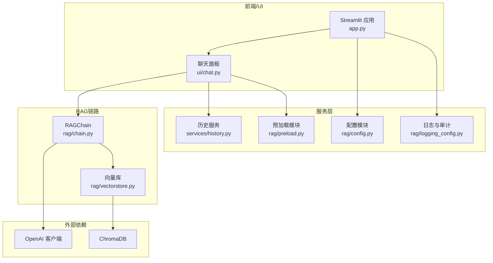
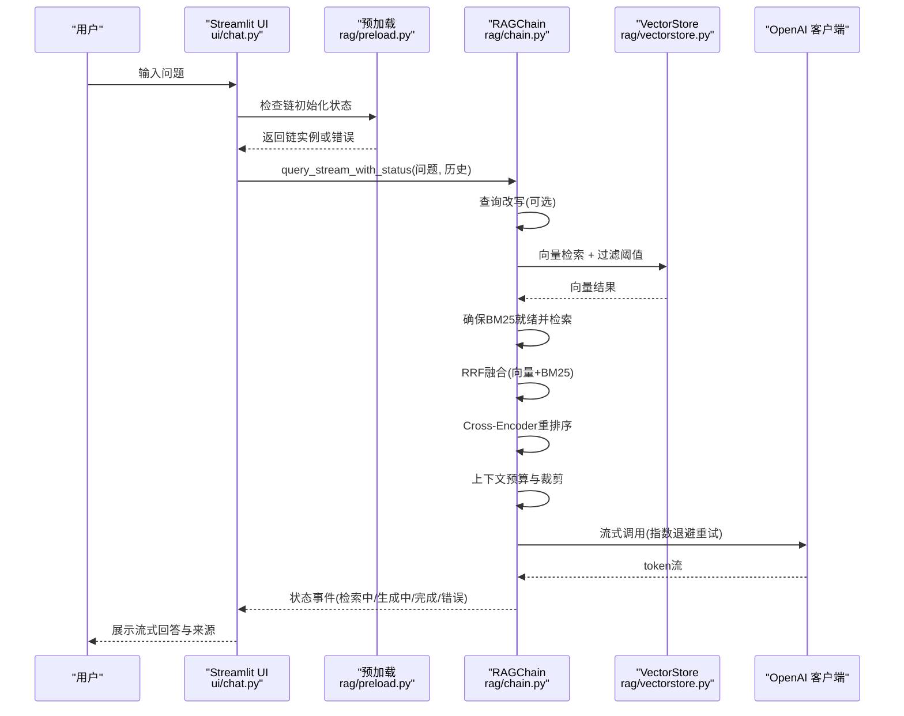
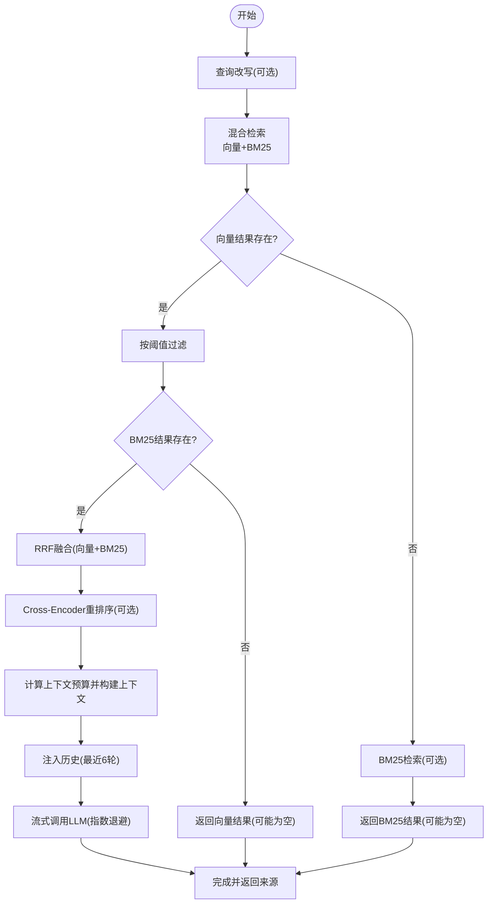
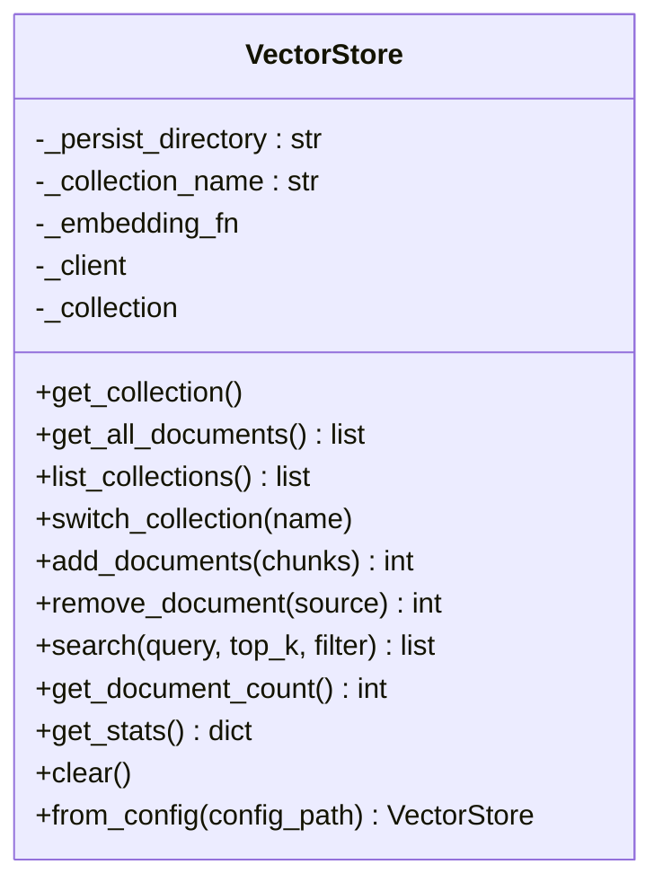
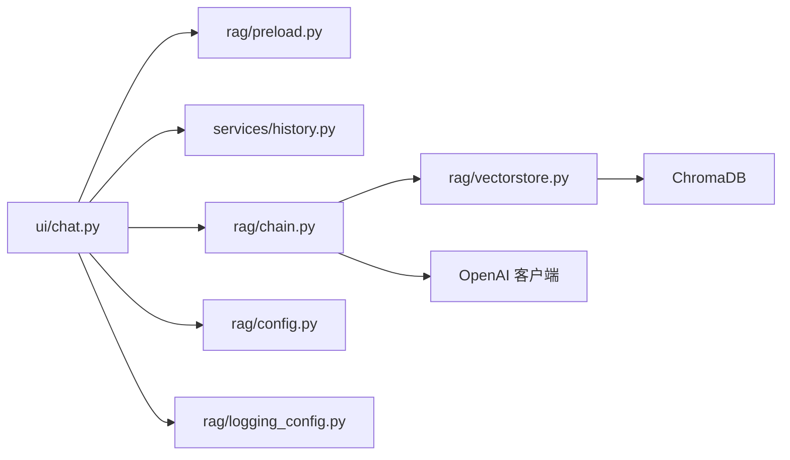
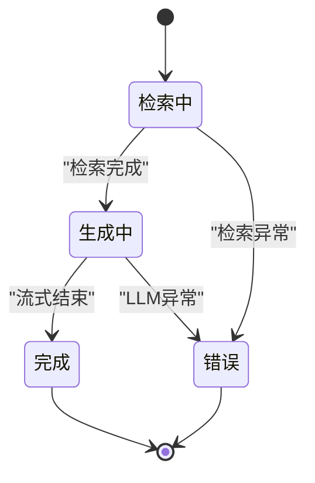

# 查询处理流程

<cite>
**本文引用的文件**
- [README.md](file://README.md)
- [app.py](file://app.py)
- [ui/chat.py](file://ui/chat.py)
- [rag/chain.py](file://rag/chain.py)
- [rag/vectorstore.py](file://rag/vectorstore.py)
- [rag/config.py](file://rag/config.py)
- [rag/preload.py](file://rag/preload.py)
- [rag/logging_config.py](file://rag/logging_config.py)
- [services/history.py](file://services/history.py)
- [config.yaml](file://config.yaml)
</cite>

## 目录
1. [简介](#简介)
2. [项目结构](#项目结构)
3. [核心组件](#核心组件)
4. [架构总览](#架构总览)
5. [详细组件分析](#详细组件分析)
6. [依赖关系分析](#依赖关系分析)
7. [性能考量](#性能考量)
8. [故障排查指南](#故障排查指南)
9. [结论](#结论)
10. [附录](#附录)

## 简介
本文件面向知识管理系统的“查询处理流程”，系统目标是通过大模型以对话方式回答用户关于公共接口的调用方法，并提供示例代码。本文围绕从用户提问到最终响应的完整数据处理过程，详细说明查询改写、混合检索（向量+BM25）、Reciprocal Rank Fusion融合、Cross-Encoder重排序、上下文构建和LLM生成；解释RAGChain工作机制、检索策略选择逻辑、结果重排序算法、流式响应生成、多轮对话历史注入；并提供查询处理的状态机图与数据转换流程，包含异常处理与性能监控机制。

## 项目结构
- 应用入口与UI层：Streamlit前端负责渲染聊天界面、接收用户输入、展示流式回答与来源信息。
- 服务层：历史管理、速率限制、分析统计等辅助能力。
- RAG链路：检索增强生成链，包含查询改写、混合检索、融合、重排序、上下文构建与LLM调用。
- 向量库：ChromaDB持久化与检索，提供嵌入函数与集合管理。
- 配置与日志：统一配置加载、环境变量替换、审计日志与结构化日志。

图表来源
- [app.py:1-189](file://app.py#L1-L189)
- [ui/chat.py:1-190](file://ui/chat.py#L1-L190)
- [rag/chain.py:174-651](file://rag/chain.py#L174-L651)
- [rag/vectorstore.py:24-209](file://rag/vectorstore.py#L24-L209)
- [rag/preload.py:1-73](file://rag/preload.py#L1-L73)
- [rag/config.py:103-185](file://rag/config.py#L103-L185)
- [rag/logging_config.py:86-129](file://rag/logging_config.py#L86-L129)

章节来源
- [README.md:1-3](file://README.md#L1-L3)
- [app.py:1-189](file://app.py#L1-L189)
- [ui/chat.py:1-190](file://ui/chat.py#L1-L190)
- [rag/chain.py:174-651](file://rag/chain.py#L174-L651)
- [rag/vectorstore.py:24-209](file://rag/vectorstore.py#L24-L209)
- [rag/preload.py:1-73](file://rag/preload.py#L1-L73)
- [rag/config.py:103-185](file://rag/config.py#L103-L185)
- [rag/logging_config.py:86-129](file://rag/logging_config.py#L86-L129)

## 核心组件
- RAGChain：实现完整的RAG工作流，包括查询改写、混合检索、RRF融合、Cross-Encoder重排序、上下文构建、消息注入与LLM流式生成。
- VectorStore：封装ChromaDB客户端、集合管理、文档增删查、统计信息与全局单例缓存。
- 配置系统：Pydantic模型定义各模块配置，支持环境变量替换与全局单例访问。
- 预加载模块：后台线程加载RAGChain，避免Streamlit rerun导致的重复初始化。
- 历史服务：按用户与会话隔离持久化聊天记录，支持导出。
- 日志与审计：统一结构化日志输出与审计日志JSONL落盘。

章节来源
- [rag/chain.py:174-651](file://rag/chain.py#L174-L651)
- [rag/vectorstore.py:24-209](file://rag/vectorstore.py#L24-L209)
- [rag/config.py:103-185](file://rag/config.py#L103-L185)
- [rag/preload.py:1-73](file://rag/preload.py#L1-L73)
- [services/history.py:1-270](file://services/history.py#L1-L270)
- [rag/logging_config.py:86-129](file://rag/logging_config.py#L86-L129)

## 架构总览
系统采用“前端交互 + 后端RAG链 + 向量库 + LLM”的分层架构。前端负责用户输入与展示，RAG链负责检索与生成，向量库提供高效相似度检索，LLM提供流式回答。预加载模块在后台完成RAGChain初始化，提升首屏体验。

图表来源
- [ui/chat.py:96-190](file://ui/chat.py#L96-L190)
- [rag/preload.py:22-73](file://rag/preload.py#L22-L73)
- [rag/chain.py:437-651](file://rag/chain.py#L437-L651)
- [rag/vectorstore.py:124-147](file://rag/vectorstore.py#L124-L147)

## 详细组件分析

### RAGChain：查询处理主流程
- 查询改写：针对极短查询与历史上下文进行指代消解，提升检索质量。
- 混合检索：向量检索（基于ChromaDB集合）+ BM25关键词检索（延迟构建索引），在结果不足时互为兜底。
- RRF融合：对向量与BM25结果按排名位置进行倒数融合，使用内容MD5去重，避免重复文档影响。
- Cross-Encoder重排序：类级别缓存模型，对候选对(query, content)打分并排序。
- 上下文构建：估算token预算，按来源与标题组织文档块，必要时截断，低置信度场景插入系统提示。
- 多轮对话注入：最多最近6轮历史，注入system与user/assistant消息。
- 流式生成：优先流式调用LLM，失败则降级为非流式；失败时指数退避重试，最终返回错误状态。
- 审计日志：记录查询、答案摘要、耗时、命中数等，便于监控与分析。

图表来源
- [rag/chain.py:227-344](file://rag/chain.py#L227-L344)
- [rag/chain.py:437-651](file://rag/chain.py#L437-L651)

章节来源
- [rag/chain.py:174-651](file://rag/chain.py#L174-L651)

### VectorStore：向量库与集合管理
- 延迟初始化客户端与集合，支持多集合切换与统计信息。
- 提供文档增删查、相似度检索与计数，支持按来源删除。
- 全局单例缓存：相同配置仅创建一次实例，避免重复加载嵌入模型。

图表来源
- [rag/vectorstore.py:24-209](file://rag/vectorstore.py#L24-L209)

章节来源
- [rag/vectorstore.py:24-209](file://rag/vectorstore.py#L24-L209)

### 配置系统：Pydantic模型与环境变量替换
- 定义LLM、Embedding、VectorStore、Knowledge、RateLimit、UI等配置项。
- 支持${VAR}与${VAR:-默认值}的环境变量替换，保证部署灵活性。
- 提供全局单例访问与运行时重载。

章节来源
- [rag/config.py:103-185](file://rag/config.py#L103-L185)
- [config.yaml:1-49](file://config.yaml#L1-L49)

### 预加载模块：后台初始化RAGChain
- 在独立线程中加载RAGChain，避免Streamlit rerun导致的重复初始化。
- 状态共享：done/done/loading/error/started/chain字段，UI轮询状态并展示加载进度或错误。

章节来源
- [rag/preload.py:1-73](file://rag/preload.py#L1-L73)
- [app.py:23-41](file://app.py#L23-L41)

### 历史服务：多会话与持久化
- 按用户隔离会话，支持会话列表、活动会话切换、标题更新。
- 消息持久化：支持按会话与按日期两种格式，导出会话为Markdown/JSON。
- 与UI联动：加载历史、保存消息、导出下载。

章节来源
- [services/history.py:1-270](file://services/history.py#L1-L270)
- [ui/chat.py:47-73](file://ui/chat.py#L47-L73)

### 日志与审计：结构化输出与JSONL落盘
- 控制台彩色输出与文件完整日志，统一格式。
- 审计日志按天JSONL落盘，包含时间戳、用户、动作、详情、查询、摘要、命中数、耗时等。

章节来源
- [rag/logging_config.py:86-129](file://rag/logging_config.py#L86-L129)

## 依赖关系分析
- UI依赖预加载模块获取链实例，依赖历史服务加载/保存消息。
- RAGChain依赖VectorStore进行检索，依赖OpenAI客户端进行LLM调用。
- VectorStore依赖ChromaDB客户端与嵌入函数。
- 配置模块为所有组件提供统一配置来源。
- 日志模块为全链路提供统一输出与审计。

图表来源
- [ui/chat.py:1-190](file://ui/chat.py#L1-L190)
- [rag/preload.py:1-73](file://rag/preload.py#L1-L73)
- [services/history.py:1-270](file://services/history.py#L1-L270)
- [rag/chain.py:174-651](file://rag/chain.py#L174-L651)
- [rag/vectorstore.py:24-209](file://rag/vectorstore.py#L24-L209)
- [rag/config.py:103-185](file://rag/config.py#L103-L185)
- [rag/logging_config.py:86-129](file://rag/logging_config.py#L86-L129)

章节来源
- [ui/chat.py:1-190](file://ui/chat.py#L1-L190)
- [rag/chain.py:174-651](file://rag/chain.py#L174-L651)
- [rag/vectorstore.py:24-209](file://rag/vectorstore.py#L24-L209)
- [rag/preload.py:1-73](file://rag/preload.py#L1-L73)
- [rag/config.py:103-185](file://rag/config.py#L103-L185)
- [rag/logging_config.py:86-129](file://rag/logging_config.py#L86-L129)

## 性能考量
- 检索性能
  - 向量检索：使用ChromaDB集合查询，支持阈值过滤减少无关文档。
  - BM25检索：延迟构建索引，与向量库文档数量同步，避免重复构建。
  - RRF融合：O(n+m)复杂度，使用内容哈希去重，兼顾召回与多样性。
- 重排序性能
  - Cross-Encoder模型类级别缓存，避免重复加载；仅对候选集进行预测。
- 上下文与预算
  - 基于字符/token估算，动态裁剪，避免超出LLM上下文窗口。
- 流式生成
  - 优先流式调用，失败指数退避重试，降低端到端延迟。
- 预加载
  - 后台线程加载RAGChain，缩短首次响应时间。

[本节为通用性能讨论，无需特定文件引用]

## 故障排查指南
- 初始化失败
  - 现象：UI显示“系统初始化失败”并提示重试。
  - 排查：检查预加载状态与错误信息，确认配置文件与网络连通性。
  - 参考：预加载模块状态字段与UI重试按钮。
- 检索失败
  - 现象：状态为error，返回“检索失败: …”。
  - 排查：检查向量库是否正常、集合是否存在、文档是否入库。
  - 参考：RAGChain检索异常捕获与审计日志。
- LLM调用失败
  - 现象：流式调用失败后尝试非流式，仍失败则返回错误。
  - 排查：检查LLM API密钥、网络、模型参数与温度/上下文窗口设置。
  - 参考：流式与非流式调用的重试逻辑与审计日志。
- 无结果
  - 现象：返回兜底prompt，提示知识库无匹配。
  - 排查：确认文档是否正确入库、分块大小与重叠设置是否合理。
  - 参考：RAGChain兜底分支与审计日志。
- 日志定位
  - 查看系统日志与审计日志，定位异常发生时间、用户、查询与耗时。

章节来源
- [rag/preload.py:22-73](file://rag/preload.py#L22-L73)
- [ui/chat.py:37-44](file://ui/chat.py#L37-L44)
- [rag/chain.py:469-556](file://rag/chain.py#L469-L556)
- [rag/logging_config.py:86-129](file://rag/logging_config.py#L86-L129)

## 结论
本系统通过RAGChain实现了从用户提问到最终响应的完整数据流：查询改写、混合检索、RRF融合、Cross-Encoder重排序、上下文构建与LLM流式生成，并在UI层提供多轮对话历史注入与来源展示。系统具备完善的异常处理与性能优化策略（预加载、类级别模型缓存、指数退避重试、上下文预算裁剪），并通过统一的日志与审计机制支撑运维与监控。

[本节为总结，无需特定文件引用]

## 附录

### 查询处理状态机图

图表来源
- [rag/chain.py:437-568](file://rag/chain.py#L437-L568)

### 数据转换流程（关键步骤）
- 输入：用户问题 + 历史消息
- 输出：流式token片段 + 最终回答 + 来源列表
- 关键节点：
  - 查询改写：将短查询与历史合并，提升检索准确性。
  - 混合检索：向量检索 + BM25检索，阈值过滤。
  - RRF融合：跨源去重与排名融合。
  - 重排序：Cross-Encoder对候选对打分。
  - 上下文构建：按预算裁剪，注入历史。
  - LLM生成：流式优先，失败降级，指数退避重试。

章节来源
- [rag/chain.py:227-344](file://rag/chain.py#L227-L344)
- [rag/chain.py:437-651](file://rag/chain.py#L437-L651)