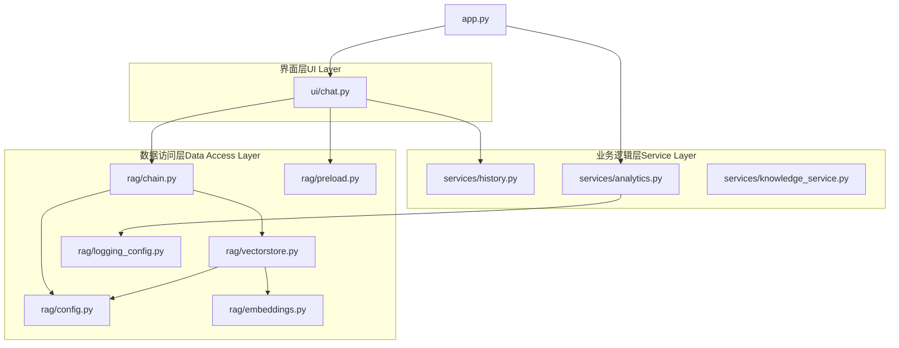
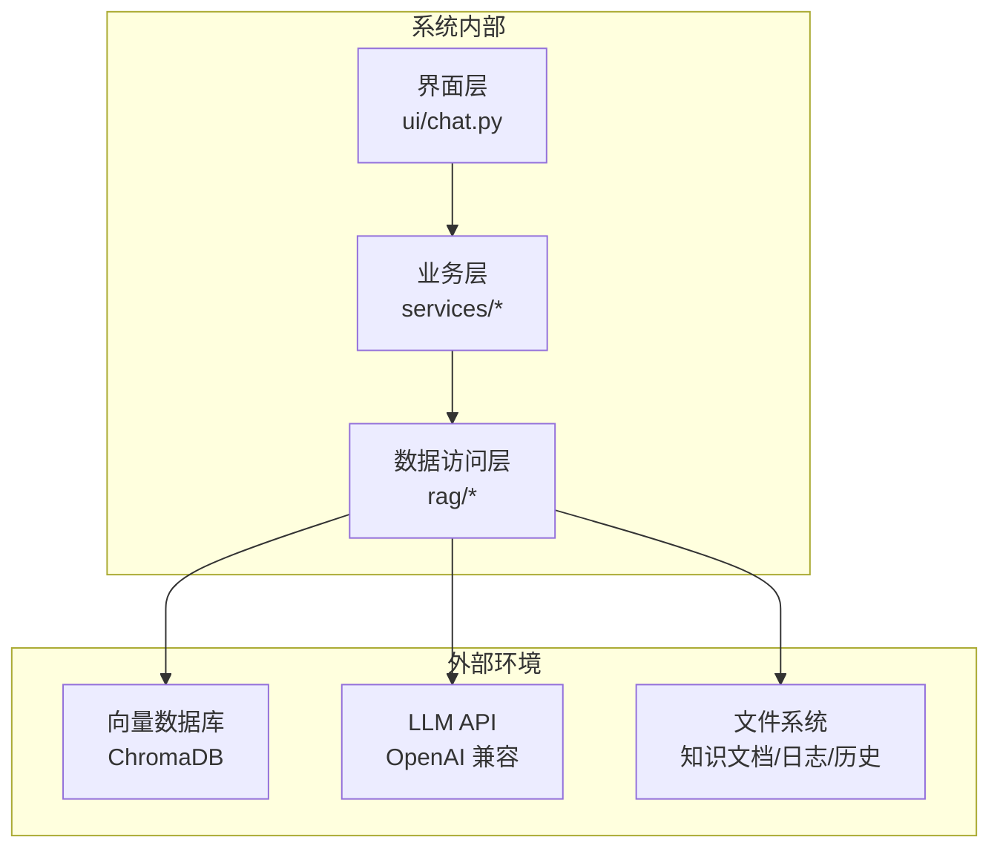
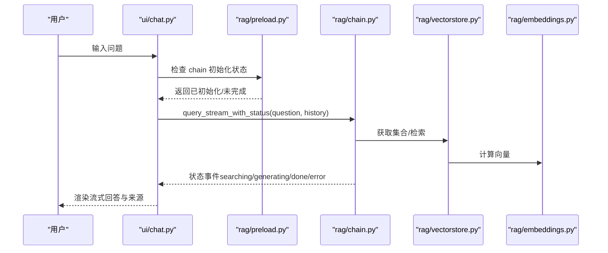
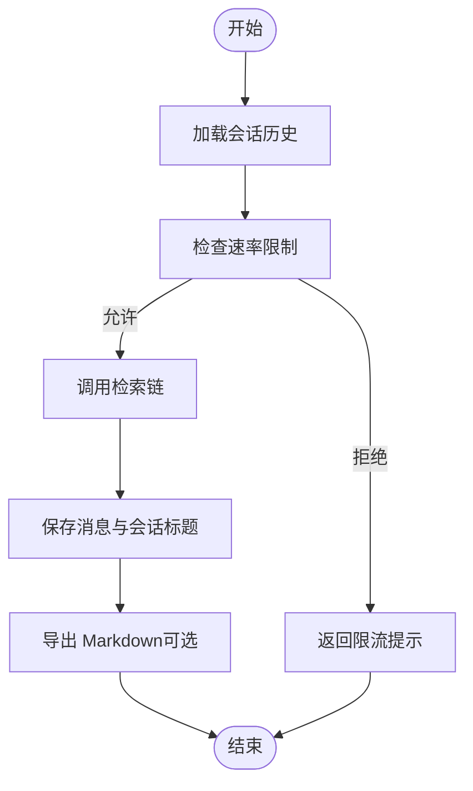
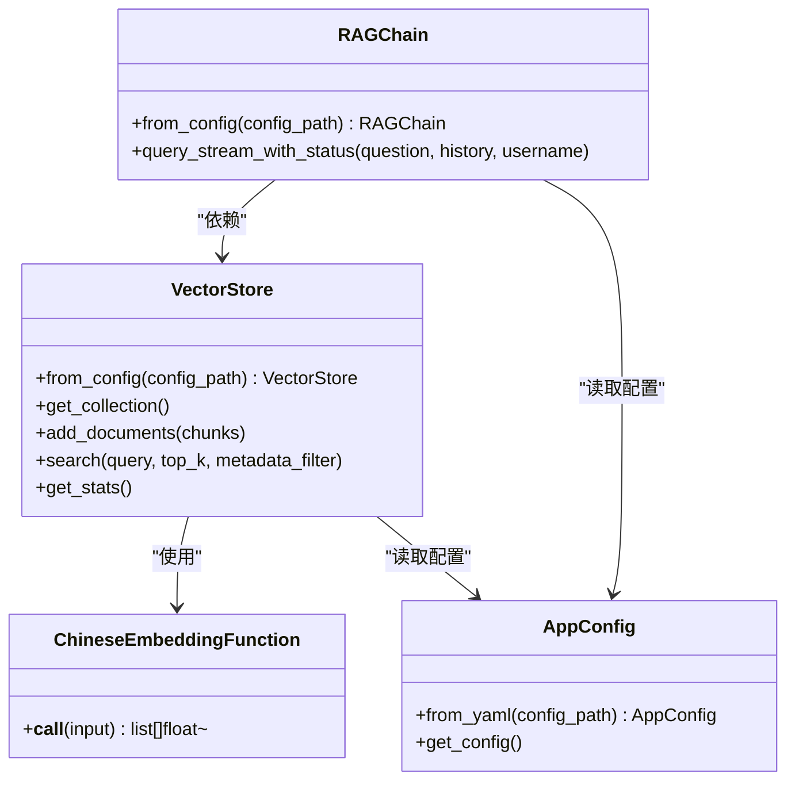
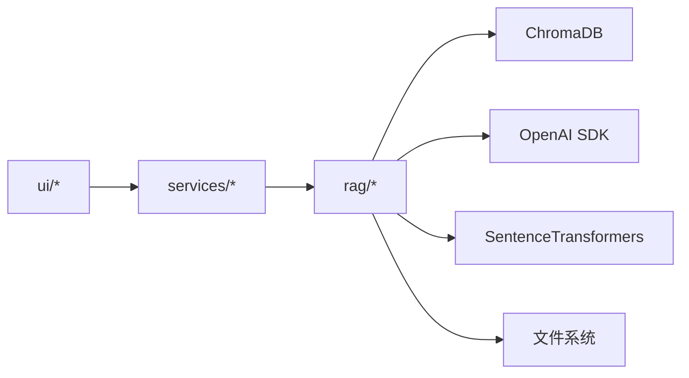

# 整体架构概览

<cite>
**本文档引用的文件**
- [README.md](file://README.md)
- [app.py](file://app.py)
- [config.yaml](file://config.yaml)
- [rag/config.py](file://rag/config.py)
- [rag/vectorstore.py](file://rag/vectorstore.py)
- [rag/embeddings.py](file://rag/embeddings.py)
- [rag/chain.py](file://rag/chain.py)
- [rag/preload.py](file://rag/preload.py)
- [rag/logging_config.py](file://rag/logging_config.py)
- [services/knowledge_service.py](file://services/knowledge_service.py)
- [services/analytics.py](file://services/analytics.py)
- [services/history.py](file://services/history.py)
- [ui/chat.py](file://ui/chat.py)
- [Dockerfile](file://Dockerfile)
- [requirements.txt](file://requirements.txt)
</cite>

## 目录
1. [简介](#简介)
2. [项目结构](#项目结构)
3. [核心组件](#核心组件)
4. [架构总览](#架构总览)
5. [详细组件分析](#详细组件分析)
6. [依赖关系分析](#依赖关系分析)
7. [性能考量](#性能考量)
8. [故障排查指南](#故障排查指南)
9. [结论](#结论)

## 简介
本系统是一个基于 RAG（检索增强生成）的知识管理系统，采用三层架构设计：界面层（UI Layer）、业务逻辑层（Service Layer）、数据访问层（Data Access Layer）。系统通过向量数据库（ChromaDB）与嵌入模型（SentenceTransformers）实现知识检索，并结合 LLM API（OpenAI 兼容接口）生成高质量回答。系统强调模块化、可扩展性与可维护性，支持多轮对话、混合检索、重排序、审计日志与仪表盘统计。

## 项目结构
系统采用按功能域划分的目录组织方式：
- ui：Streamlit 界面组件，负责用户交互与展示
- services：业务逻辑服务，包括历史管理、分析统计、速率限制等
- rag：核心检索增强引擎与配置管理，包含向量库、嵌入、检索链、预加载与日志
- scripts：部署与安装脚本
- tests：单元测试
- 根目录：应用入口、配置文件、Dockerfile、依赖清单

图表来源
- [app.py:54-100](file://app.py#L54-L100)
- [ui/chat.py:19-73](file://ui/chat.py#L19-L73)
- [services/history.py:182-221](file://services/history.py#L182-L221)
- [services/analytics.py:17-106](file://services/analytics.py#L17-L106)
- [services/knowledge_service.py:16-46](file://services/knowledge_service.py#L16-L46)
- [rag/chain.py:160-590](file://rag/chain.py#L160-L590)
- [rag/vectorstore.py:24-209](file://rag/vectorstore.py#L24-L209)
- [rag/embeddings.py:19-48](file://rag/embeddings.py#L19-L48)
- [rag/config.py:102-184](file://rag/config.py#L102-L184)
- [rag/preload.py:22-73](file://rag/preload.py#L22-L73)
- [rag/logging_config.py:86-129](file://rag/logging_config.py#L86-L129)

章节来源
- [README.md:1-3](file://README.md#L1-L3)
- [app.py:54-100](file://app.py#L54-L100)
- [ui/chat.py:19-73](file://ui/chat.py#L19-L73)

## 核心组件
- 应用入口与会话管理：app.py 负责初始化主题、日志、预加载与页面渲染；管理用户登录态与页面切换。
- 配置中心：rag/config.py 提供 Pydantic 驱动的配置模型与全局单例，支持环境变量替换与运行时重载。
- 检索链：rag/chain.py 实现 RAG 主流程，包含混合检索（向量+BM25）、RRF 融合、交叉编码重排序、上下文预算与流式 LLM 调用。
- 向量库：rag/vectorstore.py 封装 ChromaDB，提供集合管理、增删改查、统计与全局单例缓存。
- 嵌入模型：rag/embeddings.py 基于 SentenceTransformers 的中文嵌入函数，支持在线/离线模型加载。
- 预加载：rag/preload.py 在后台线程异步加载检索链，避免首屏卡顿。
- 历史与导出：services/history.py 提供多会话管理、消息持久化与导出。
- 分析与审计：services/analytics.py 从审计日志聚合统计；rag/logging_config.py 记录结构化审计日志。
- 知识服务：services/knowledge_service.py 提供文档读取能力（含 PDF 解析）。

章节来源
- [app.py:23-52](file://app.py#L23-L52)
- [rag/config.py:102-184](file://rag/config.py#L102-L184)
- [rag/chain.py:160-590](file://rag/chain.py#L160-L590)
- [rag/vectorstore.py:24-209](file://rag/vectorstore.py#L24-L209)
- [rag/embeddings.py:19-48](file://rag/embeddings.py#L19-L48)
- [rag/preload.py:22-73](file://rag/preload.py#L22-L73)
- [services/history.py:182-221](file://services/history.py#L182-L221)
- [services/analytics.py:17-106](file://services/analytics.py#L17-L106)
- [services/knowledge_service.py:16-46](file://services/knowledge_service.py#L16-L46)

## 架构总览
系统采用分层架构实现关注点分离：
- 界面层（UI Layer）：负责用户交互、状态渲染与事件触发，不直接处理业务逻辑。
- 业务逻辑层（Service Layer）：封装领域服务（历史、分析、知识读取），协调数据访问与界面层。
- 数据访问层（Data Access Layer）：封装配置、向量库、嵌入、检索链与日志，向上提供稳定接口。

系统上下文图（与外部环境交互）：
- 向量数据库：ChromaDB（持久化目录 ./chroma_db）
- LLM API：OpenAI 兼容接口（配置项 llm.api_base 与 llm.api_key）
- 文件系统：知识文档目录（config.knowledge.docs_directory）、日志与历史目录

图表来源
- [rag/vectorstore.py:182-209](file://rag/vectorstore.py#L182-L209)
- [rag/chain.py:176-186](file://rag/chain.py#L176-L186)
- [config.yaml:4-46](file://config.yaml#L4-L46)
- [Dockerfile:48-49](file://Dockerfile#L48-L49)

## 详细组件分析

### 界面层（UI Layer）
- 职责：渲染登录页、侧边栏、聊天面板；管理会话状态与用户输入；调用预加载与检索链。
- 关键交互：用户输入触发历史加载、速率限制检查、检索链查询与流式回答渲染。
- 与业务层协作：通过 services/history.py 读写会话历史；通过 rag/preload.py 获取已初始化的检索链。
- 与数据访问层协作：通过 rag/chain.py 的 query_stream_with_status 获取检索与生成过程状态。

图表来源
- [ui/chat.py:96-190](file://ui/chat.py#L96-L190)
- [rag/preload.py:51-58](file://rag/preload.py#L51-L58)
- [rag/chain.py:408-508](file://rag/chain.py#L408-L508)
- [rag/vectorstore.py:57-142](file://rag/vectorstore.py#L57-L142)
- [rag/embeddings.py:41-47](file://rag/embeddings.py#L41-L47)

章节来源
- [ui/chat.py:19-73](file://ui/chat.py#L19-L73)
- [ui/chat.py:96-190](file://ui/chat.py#L96-L190)
- [rag/preload.py:22-73](file://rag/preload.py#L22-L73)

### 业务逻辑层（Service Layer）
- 历史服务：按用户与会话隔离持久化，支持会话列表、切换、消息保存与导出。
- 分析服务：从审计日志聚合查询量、热门查询、延迟与反馈等指标。
- 知识服务：读取文档全文（含 PDF），用于预览与调试。
- 速率限制：在业务层进行请求频率与输入长度控制，保护下游资源。

图表来源
- [services/history.py:182-221](file://services/history.py#L182-L221)
- [services/analytics.py:17-106](file://services/analytics.py#L17-L106)
- [services/knowledge_service.py:16-46](file://services/knowledge_service.py#L16-L46)

章节来源
- [services/history.py:37-153](file://services/history.py#L37-L153)
- [services/analytics.py:17-106](file://services/analytics.py#L17-L106)
- [services/knowledge_service.py:16-46](file://services/knowledge_service.py#L16-L46)

### 数据访问层（Data Access Layer）
- 配置管理：集中管理 LLM、嵌入、向量库、知识库、速率限制与 UI 配置，支持环境变量替换与运行时重载。
- 向量库：封装 ChromaDB 客户端与集合，提供增删改查、统计与全局单例缓存，避免重复加载嵌入模型。
- 嵌入函数：延迟加载中文嵌入模型，支持在线/离线模式。
- 检索链：实现混合检索（向量+BM25）、RRF 融合、交叉编码重排序、上下文预算与流式 LLM 调用。
- 预加载：后台线程异步加载检索链，提升首屏体验。
- 日志与审计：统一日志输出与结构化审计日志，便于追踪与统计。

图表来源
- [rag/vectorstore.py:24-209](file://rag/vectorstore.py#L24-L209)
- [rag/embeddings.py:19-48](file://rag/embeddings.py#L19-L48)
- [rag/chain.py:160-590](file://rag/chain.py#L160-L590)
- [rag/config.py:102-184](file://rag/config.py#L102-L184)

章节来源
- [rag/config.py:102-184](file://rag/config.py#L102-L184)
- [rag/vectorstore.py:24-209](file://rag/vectorstore.py#L24-L209)
- [rag/embeddings.py:19-48](file://rag/embeddings.py#L19-L48)
- [rag/chain.py:160-590](file://rag/chain.py#L160-L590)
- [rag/preload.py:22-73](file://rag/preload.py#L22-L73)
- [rag/logging_config.py:86-129](file://rag/logging_config.py#L86-L129)

## 依赖关系分析
- 模块内聚：每个包职责清晰，如 rag 专注检索增强，services 专注业务逻辑，ui 专注界面交互。
- 层间依赖：UI 依赖业务层，业务层依赖数据访问层，数据访问层依赖外部组件（ChromaDB、LLM API、文件系统）。
- 外部依赖：Streamlit、ChromaDB、OpenAI SDK、SentenceTransformers、Pydantic、PyMuPDF 等。
- 配置驱动：所有外部依赖参数由 config.yaml 与 rag/config.py 统一管理，便于运维与扩展。

图表来源
- [requirements.txt:1-11](file://requirements.txt#L1-L11)
- [rag/vectorstore.py:10-15](file://rag/vectorstore.py#L10-L15)
- [rag/chain.py:12-16](file://rag/chain.py#L12-L16)
- [rag/embeddings.py:34-37](file://rag/embeddings.py#L34-L37)

章节来源
- [requirements.txt:1-11](file://requirements.txt#L1-L11)
- [config.yaml:4-46](file://config.yaml#L4-L46)

## 性能考量
- 预加载与缓存：后台线程预加载检索链，全局单例缓存向量库与嵌入模型，减少重复初始化开销。
- 检索优化：混合检索（向量+BM25）与 RRF 融合，提高召回质量；距离阈值过滤与上下文预算控制降低无效计算。
- 流式输出：LLM 流式调用与增量渲染，改善用户体验；失败时自动降级为非流式。
- 存储与 IO：向量库与日志目录持久化，建议挂载到高性能存储；历史与审计日志按天切分，便于清理与归档。

## 故障排查指南
- 初始化失败：检查 LLM API 配置（api_base、api_key）与网络连通性；查看预加载错误信息并重试。
- 检索无结果：确认知识库已入库、文档格式受支持；调整 top_k 与距离阈值；检查 BM25 索引是否构建成功。
- 嵌入模型加载慢：国内镜像环境变量已设置，确保网络可达；首次加载需约 400MB 下载。
- 审计日志缺失：确认审计开关开启与日志目录可写；检查 JSONL 文件格式与日期切分。
- Docker 运行：容器暴露 8501 端口，健康检查基于 /_stcore/health；确保挂载持久化目录。

章节来源
- [rag/preload.py:33-48](file://rag/preload.py#L33-L48)
- [rag/chain.py:408-508](file://rag/chain.py#L408-L508)
- [rag/embeddings.py:31-39](file://rag/embeddings.py#L31-L39)
- [rag/logging_config.py:106-129](file://rag/logging_config.py#L106-L129)
- [Dockerfile:58-67](file://Dockerfile#L58-L67)

## 结论
本系统通过三层架构实现了清晰的关注点分离与稳定的扩展边界。界面层专注于用户体验，业务层封装领域逻辑，数据访问层抽象外部依赖。配合预加载、缓存与混合检索策略，系统在保证性能的同时具备良好的可维护性与可观测性。未来可在以下方向演进：引入更丰富的检索策略、增强多模态支持、完善监控告警体系与自动化运维工具链。