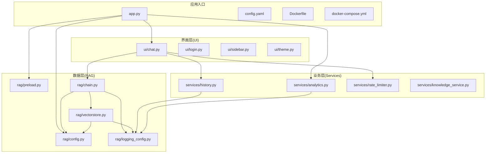
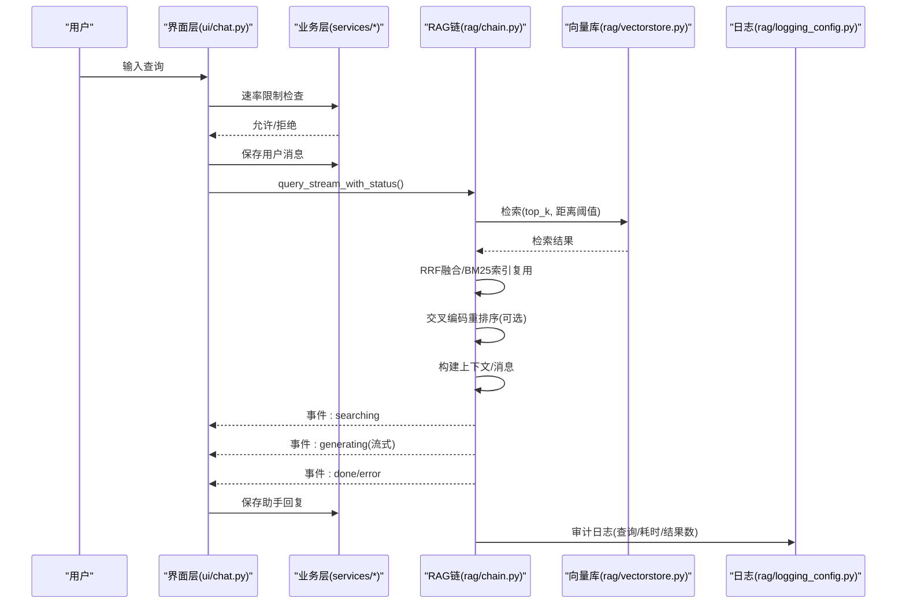
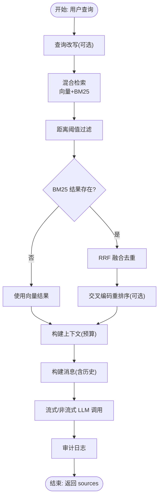
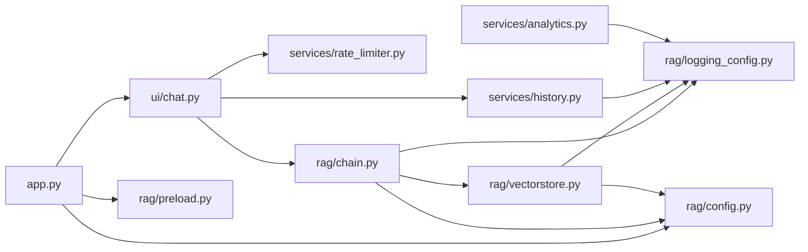

# 系统架构设计

<cite>
**本文档引用的文件**
- [README.md](file://README.md)
- [app.py](file://app.py)
- [config.yaml](file://config.yaml)
- [Dockerfile](file://Dockerfile)
- [docker-compose.yml](file://docker-compose.yml)
- [rag/config.py](file://rag/config.py)
- [rag/preload.py](file://rag/preload.py)
- [rag/chain.py](file://rag/chain.py)
- [rag/vectorstore.py](file://rag/vectorstore.py)
- [rag/logging_config.py](file://rag/logging_config.py)
- [ui/chat.py](file://ui/chat.py)
- [services/history.py](file://services/history.py)
- [services/analytics.py](file://services/analytics.py)
- [services/rate_limiter.py](file://services/rate_limiter.py)
- [services/knowledge_service.py](file://services/knowledge_service.py)
</cite>

## 目录
1. [简介](#简介)
2. [项目结构](#项目结构)
3. [核心组件](#核心组件)
4. [架构总览](#架构总览)
5. [详细组件分析](#详细组件分析)
6. [依赖关系分析](#依赖关系分析)
7. [性能考量](#性能考量)
8. [故障排查指南](#故障排查指南)
9. [结论](#结论)
10. [附录](#附录)

## 简介
本系统是一个基于 RAG（检索增强生成）的知识管理系统，采用流式 Web 界面与后端服务分离的架构设计。系统围绕“界面层（UI）—业务层（Services）—数据层（RAG/VectorStore）”三层组织，结合预加载机制、事件驱动的流式响应、速率限制与审计日志等横切关注点，实现稳定、可观测、可扩展的知识问答体验。

## 项目结构
系统采用模块化分层设计，主要目录与职责如下：
- ui：Streamlit 界面组件，负责用户交互与状态展示
- services：业务逻辑层，包含历史管理、分析统计、速率限制、知识服务等
- rag：核心检索与生成引擎，包含配置、预加载、RAG 链、向量库、日志等
- scripts：安装与打包脚本
- tests：单元测试
- 根目录：应用入口、容器化与配置

**图表来源**
- [app.py:1-184](file://app.py#L1-L184)
- [ui/chat.py:1-190](file://ui/chat.py#L1-L190)
- [services/history.py:1-270](file://services/history.py#L1-L270)
- [services/analytics.py:1-122](file://services/analytics.py#L1-L122)
- [services/rate_limiter.py:1-71](file://services/rate_limiter.py#L1-L71)
- [services/knowledge_service.py:1-46](file://services/knowledge_service.py#L1-L46)
- [rag/config.py:1-184](file://rag/config.py#L1-L184)
- [rag/preload.py:1-73](file://rag/preload.py#L1-L73)
- [rag/chain.py:1-590](file://rag/chain.py#L1-L590)
- [rag/vectorstore.py:1-209](file://rag/vectorstore.py#L1-L209)
- [rag/logging_config.py:1-129](file://rag/logging_config.py#L1-L129)

**章节来源**
- [README.md:1-3](file://README.md#L1-L3)
- [app.py:1-184](file://app.py#L1-L184)
- [config.yaml:1-46](file://config.yaml#L1-L46)
- [Dockerfile:1-68](file://Dockerfile#L1-L68)
- [docker-compose.yml:1-60](file://docker-compose.yml#L1-L60)

## 核心组件
- 应用入口与会话管理：app.py 负责页面配置、主题应用、登录态与会话初始化，并协调 UI 与 RAG 预加载
- 配置中心：rag/config.py 提供强类型的配置模型与环境变量替换，支持全局单例访问
- 预加载引擎：rag/preload.py 在后台线程加载 RAGChain，避免 Streamlit 重渲染导致的状态丢失
- RAG 检索链：rag/chain.py 实现混合检索（向量+BM25）、RRF 融合、交叉编码重排序、流式 LLM 调用与审计日志
- 向量库：rag/vectorstore.py 封装 ChromaDB，提供持久化、增量更新、统计查询与集合切换
- 历史与会话：services/history.py 提供多会话隔离、JSON 持久化与导出能力
- 速率限制：services/rate_limiter.py 实现基于时间窗口的内存限流与周期清理
- 分析仪表盘：services/analytics.py 从审计日志聚合统计指标
- 日志与审计：rag/logging_config.py 提供结构化日志与审计日志写入

**章节来源**
- [app.py:23-70](file://app.py#L23-L70)
- [rag/config.py:138-150](file://rag/config.py#L138-L150)
- [rag/preload.py:22-64](file://rag/preload.py#L22-L64)
- [rag/chain.py:160-590](file://rag/chain.py#L160-L590)
- [rag/vectorstore.py:24-209](file://rag/vectorstore.py#L24-L209)
- [services/history.py:19-153](file://services/history.py#L19-L153)
- [services/rate_limiter.py:45-71](file://services/rate_limiter.py#L45-L71)
- [services/analytics.py:17-122](file://services/analytics.py#L17-L122)
- [rag/logging_config.py:86-129](file://rag/logging_config.py#L86-L129)

## 架构总览
系统采用事件驱动的流式处理：用户输入触发 UI 层事件，经业务层校验与持久化，进入 RAG 检索链，逐步产出“检索中—生成中—完成/错误”的事件流，最终回写会话历史并记录审计日志。

**图表来源**
- [ui/chat.py:96-190](file://ui/chat.py#L96-L190)
- [services/rate_limiter.py:45-71](file://services/rate_limiter.py#L45-L71)
- [services/history.py:193-221](file://services/history.py#L193-L221)
- [rag/chain.py:408-508](file://rag/chain.py#L408-L508)
- [rag/vectorstore.py:124-143](file://rag/vectorstore.py#L124-L143)
- [rag/logging_config.py:86-129](file://rag/logging_config.py#L86-L129)

## 详细组件分析

### 配置管理（rag/config.py）
- 设计要点
  - 使用 Pydantic 模型定义各子系统配置，提供字段校验与默认值
  - 支持环境变量替换，键值形式为 ${VAR} 或 ${VAR:-默认值}
  - 提供全局单例 get_config()/reload_config()，保证配置一致性与可热更新
- 数据结构与复杂度
  - 配置对象为 O(1) 访问；环境变量替换为 O(N)（N 为字符串长度）
- 优化与健壮性
  - 字段范围校验（如温度、最大 token、chunk_overlap < chunk_size）
  - YAML 解析失败时抛出明确异常
- 集成点
  - RAGChain/VectorStore/预加载模块均通过 get_config/load_config 获取配置

**章节来源**
- [rag/config.py:16-44](file://rag/config.py#L16-L44)
- [rag/config.py:48-116](file://rag/config.py#L48-L116)
- [rag/config.py:118-150](file://rag/config.py#L118-L150)

### 预加载引擎（rag/preload.py）
- 设计要点
  - 后台线程加载 RAGChain，状态共享于模块级字典，避免 Streamlit rerun 导致的重置
  - 幂等启动，支持重试与错误回显
- 并发与线程安全
  - 使用模块级可变字典，配合日志记录状态变更
- 集成点
  - app.py 初始化时调用 start，UI 在渲染前等待 is_done()

**章节来源**
- [rag/preload.py:22-64](file://rag/preload.py#L22-L64)
- [app.py:32-41](file://app.py#L32-L41)

### RAG 检索链（rag/chain.py）
- 核心流程
  - 查询改写（短查询+历史拼接）
  - 混合检索：向量检索（距离阈值过滤）+ BM25 关键词检索（延迟构建索引）
  - RRF 融合去重，交叉编码重排序（类级缓存模型）
  - 上下文预算计算，消息构建，流式/非流式 LLM 调用（指数退避重试）
  - 审计日志记录查询详情、耗时与结果数
- 关键算法
  - BM25：O(D·Q) 检索（D 为文档数，Q 为查询词）
  - RRF：O(D) 融合与排序
  - Token 估算：O(1) 粗估，上下文拼接 O(C)（C 为候选数）
- 错误处理
  - 检索失败、LLM 流式/非流式调用失败均有降级与错误事件
- 事件驱动
  - query_stream_with_status 以生成器分阶段返回事件，UI 实现流式展示

**图表来源**
- [rag/chain.py:236-508](file://rag/chain.py#L236-L508)

**章节来源**
- [rag/chain.py:160-590](file://rag/chain.py#L160-L590)

### 向量库（rag/vectorstore.py）
- 设计要点
  - 单例缓存 embedding 模型与客户端，避免重复加载
  - 支持增量更新（按 ID 删除后新增），提供统计与集合切换
- 数据结构
  - ChromaDB 集合：文档、元数据、距离
- 性能
  - 延迟初始化客户端与集合；批量 add/query

**章节来源**
- [rag/vectorstore.py:24-209](file://rag/vectorstore.py#L24-L209)

### 会话与历史（services/history.py）
- 设计要点
  - 按用户隔离，多会话管理，JSON 文件持久化
  - 支持会话切换、标题更新、导出 Markdown/JSON
- 数据流
  - 新消息写入当前会话与历史文件，同时记录审计日志

**章节来源**
- [services/history.py:19-270](file://services/history.py#L19-L270)

### 速率限制（services/rate_limiter.py）
- 设计要点
  - 基于时间窗口的内存限流，定期清理不活跃用户
  - 窗口内请求数超过阈值时返回等待提示

**章节来源**
- [services/rate_limiter.py:19-71](file://services/rate_limiter.py#L19-L71)

### 分析仪表盘（services/analytics.py）
- 设计要点
  - 从审计日志聚合查询量、热门查询、零结果率、平均延迟、反馈分布等
  - 支持按用户或全局视图

**章节来源**
- [services/analytics.py:17-122](file://services/analytics.py#L17-L122)

### 日志与审计（rag/logging_config.py）
- 设计要点
  - 控制台彩色输出 + 文件落盘，统一格式
  - 审计日志按天切分 JSONL，记录查询、耗时、结果数等

**章节来源**
- [rag/logging_config.py:46-129](file://rag/logging_config.py#L46-L129)

## 依赖关系分析

**图表来源**
- [app.py:15-17](file://app.py#L15-L17)
- [ui/chat.py:8-16](file://ui/chat.py#L8-L16)
- [rag/chain.py:14-16](file://rag/chain.py#L14-L16)
- [rag/vectorstore.py:12-15](file://rag/vectorstore.py#L12-L15)
- [services/history.py:12](file://services/history.py#L12)
- [services/analytics.py:12](file://services/analytics.py#L12)

**章节来源**
- [app.py:15-17](file://app.py#L15-L17)
- [ui/chat.py:8-16](file://ui/chat.py#L8-L16)
- [rag/chain.py:14-16](file://rag/chain.py#L14-L16)
- [rag/vectorstore.py:12-15](file://rag/vectorstore.py#L12-L15)
- [services/history.py:12](file://services/history.py#L12)
- [services/analytics.py:12](file://services/analytics.py#L12)

## 性能考量
- 检索性能
  - 向量检索：依赖 ChromaDB，查询复杂度与 top_k、集合大小相关
  - BM25：延迟构建索引，与文档块数量成正比；RRF 融合 O(D)
  - 距离阈值过滤减少无效候选，降低上下文拼接成本
- 上下文与 Token
  - 基于字符估算 token，动态裁剪避免超出上下文窗口
- LLM 调用
  - 流式优先，失败时非流式降级；指数退避重试提升稳定性
- 缓存与复用
  - Reranker 类级缓存、VectorStore 单例缓存 embedding 模型
  - BM25 索引与向量库文档数同步，避免重复构建
- 存储与 IO
  - JSON 文件按用户/会话/日期组织，导出会话时一次性读取
- 速率限制
  - 内存窗口限流，定期清理降低内存占用

[本节为通用性能讨论，无需具体文件分析]

## 故障排查指南
- 初始化失败
  - 现象：后台加载失败，UI 显示错误并提供重试按钮
  - 排查：检查 config.yaml 的 LLM 配置与网络连通性；查看日志文件
- 检索无结果
  - 现象：回答提示“知识库中暂无相关内容”
  - 排查：确认文档已入库、chunk_overlap < chunk_size；调整 distance_threshold 或启用 BM25
- LLM 调用异常
  - 现象：生成回答时报错或为空
  - 排查：查看审计日志中的 details 字段；检查模型名称与 API Key；观察重试日志
- 会话历史缺失
  - 现象：重启后历史不显示
  - 排查：确认 chat_history 目录挂载与权限；检查会话文件是否存在
- 仪表盘无数据
  - 现象：统计为空
  - 排查：确认审计日志目录存在且有当日 JSONL 文件；检查 audit_enabled 开关

**章节来源**
- [ui/chat.py:24-45](file://ui/chat.py#L24-L45)
- [rag/chain.py:440-454](file://rag/chain.py#L440-L454)
- [rag/logging_config.py:106-129](file://rag/logging_config.py#L106-L129)
- [services/history.py:182-191](file://services/history.py#L182-L191)
- [services/analytics.py:46-56](file://services/analytics.py#L46-L56)

## 结论
本系统通过清晰的分层架构与模块化设计，实现了从界面交互到检索生成再到持久化的完整闭环。预加载与事件驱动的流式响应提升了用户体验，配置中心与审计日志保障了可观测性与可维护性。在性能方面，通过缓存、阈值过滤与上下文预算控制，兼顾了准确性与效率。建议后续在生产环境中引入更完善的监控告警、分布式缓存与异步任务队列，以进一步增强可扩展性与可靠性。

[本节为总结性内容，无需具体文件分析]

## 附录

### 系统边界与集成模式
- 系统边界
  - 内部：UI、Services、RAG 模块
  - 外部：LLM API（OpenAI 兼容）、ChromaDB、文件系统（知识库、历史、日志）
- 集成模式
  - 配置驱动：通过 config.yaml 与环境变量统一管理外部依赖
  - 文件持久化：知识库、会话历史、审计日志均采用本地文件
  - 容器化部署：Dockerfile 与 docker-compose 提供一键部署

**章节来源**
- [config.yaml:4-46](file://config.yaml#L4-L46)
- [Dockerfile:1-68](file://Dockerfile#L1-L68)
- [docker-compose.yml:1-60](file://docker-compose.yml#L1-L60)