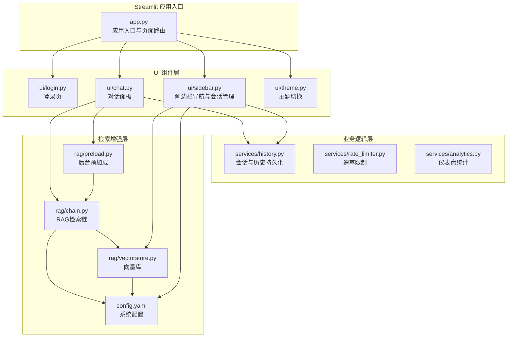
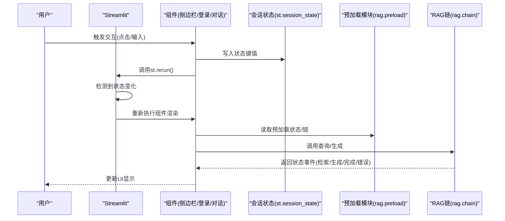
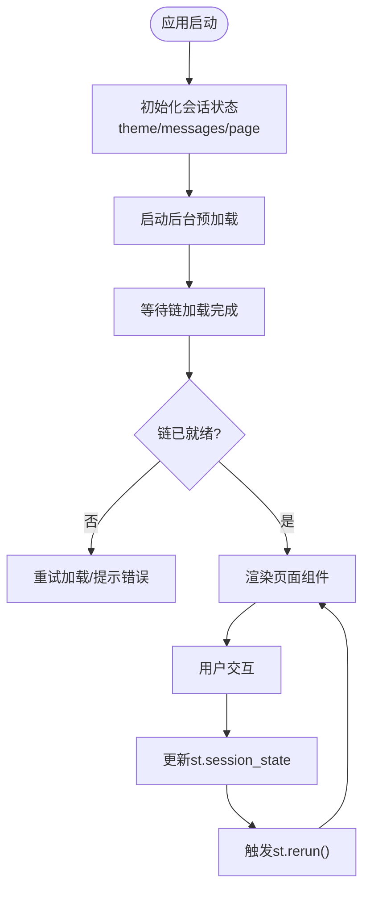
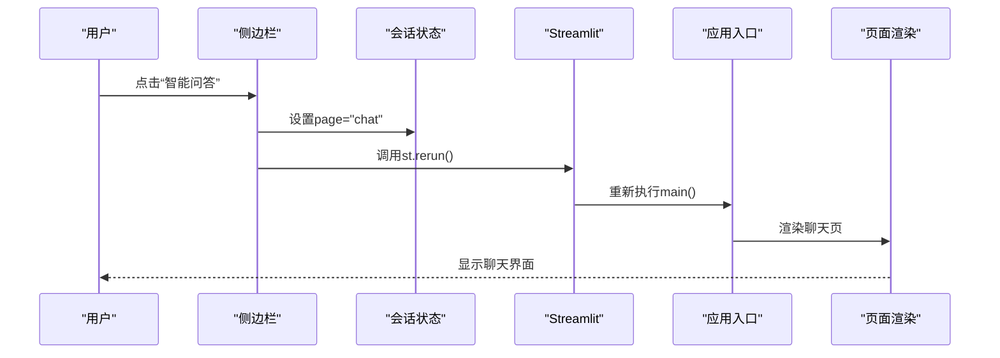
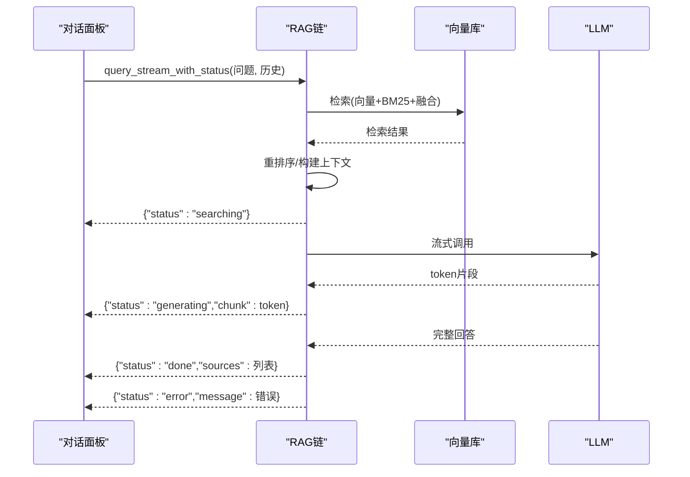
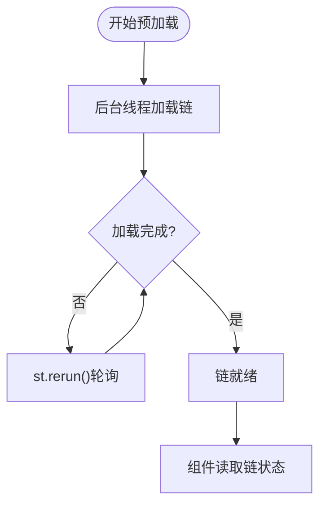
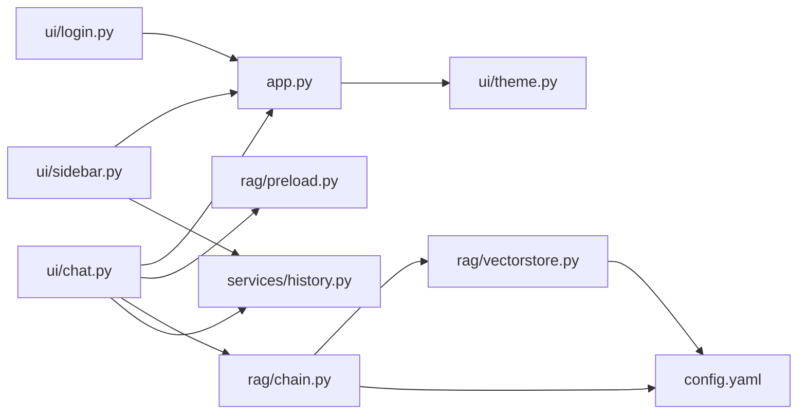

# Streamlit事件驱动模型

<cite>
**本文档引用的文件**
- [app.py](file://app.py)
- [ui/chat.py](file://ui/chat.py)
- [ui/sidebar.py](file://ui/sidebar.py)
- [ui/login.py](file://ui/login.py)
- [ui/theme.py](file://ui/theme.py)
- [rag/preload.py](file://rag/preload.py)
- [rag/chain.py](file://rag/chain.py)
- [rag/vectorstore.py](file://rag/vectorstore.py)
- [services/history.py](file://services/history.py)
- [config.yaml](file://config.yaml)
- [tests/test_preload.py](file://tests/test_preload.py)
</cite>

## 目录
1. [简介](#简介)
2. [项目结构](#项目结构)
3. [核心组件](#核心组件)
4. [架构总览](#架构总览)
5. [详细组件分析](#详细组件分析)
6. [依赖关系分析](#依赖关系分析)
7. [性能考量](#性能考量)
8. [故障排查指南](#故障排查指南)
9. [结论](#结论)
10. [附录](#附录)

## 简介
本文件围绕知识管理系统的Streamlit事件驱动模型展开，系统性阐述以下主题：
- Streamlit的重新运行机制与会话状态管理
- 组件生命周期与st.rerun的使用场景
- 事件触发条件与状态同步机制
- 事件处理时序图：从用户交互到页面刷新的完整流程
- 组件间通信模式、回调函数设计与状态持久化策略

## 项目结构
该项目采用“UI组件层(ui/) + 业务逻辑层(services/) + 检索增强层(rag/)”的分层架构，配合Streamlit的事件驱动模型实现交互式Web应用。

图表来源
- [app.py:54-90](file://app.py#L54-L90)
- [ui/chat.py:19-73](file://ui/chat.py#L19-L73)
- [ui/sidebar.py:26-195](file://ui/sidebar.py#L26-L195)
- [ui/login.py:9-75](file://ui/login.py#L9-L75)
- [rag/preload.py:22-73](file://rag/preload.py#L22-L73)
- [rag/chain.py:425-528](file://rag/chain.py#L425-L528)
- [rag/vectorstore.py:24-200](file://rag/vectorstore.py#L24-L200)
- [services/history.py:19-270](file://services/history.py#L19-L270)
- [config.yaml:1-49](file://config.yaml#L1-L49)

章节来源
- [app.py:54-90](file://app.py#L54-L90)
- [config.yaml:1-49](file://config.yaml#L1-L49)

## 核心组件
- 应用入口与页面路由：负责设置页面配置、应用主题、初始化会话状态，并根据用户状态与页面参数渲染登录页或主页面。
- 登录页：接收用户名输入，写入会话状态并触发重新运行。
- 侧边栏：提供导航、主题切换、会话管理、知识库文档浏览、历史记录查看与系统状态展示；大量使用st.rerun实现状态同步。
- 对话面板：等待后台预加载完成，加载历史消息，处理用户输入，调用RAG链进行检索与生成，实时展示状态与结果。
- 预加载模块：在后台线程中加载RAG链，状态持久化于模块级字典，不受Streamlit多次重新运行影响。
- RAG链：实现混合检索、重排序、上下文构建与LLM流式生成，提供状态化事件流。
- 向量库：封装ChromaDB客户端与集合，提供检索、统计与缓存能力。
- 历史服务：按用户与会话隔离持久化消息，支持会话列表、标题更新、切换与导出。

章节来源
- [app.py:23-52](file://app.py#L23-L52)
- [ui/login.py:48-60](file://ui/login.py#L48-L60)
- [ui/sidebar.py:56-100](file://ui/sidebar.py#L56-L100)
- [ui/chat.py:24-46](file://ui/chat.py#L24-L46)
- [rag/preload.py:22-73](file://rag/preload.py#L22-L73)
- [rag/chain.py:425-528](file://rag/chain.py#L425-L528)
- [rag/vectorstore.py:24-200](file://rag/vectorstore.py#L24-L200)
- [services/history.py:19-270](file://services/history.py#L19-L270)

## 架构总览
Streamlit事件驱动模型在本项目中的体现：
- 事件源：用户点击、输入、选择等交互控件。
- 事件处理器：各组件内的回调函数（如按钮点击、输入框提交）。
- 事件传播：通过修改st.session_state中的键值，触发组件重新渲染。
- 重新运行：Streamlit检测到st.session_state变化后，按顺序重新执行脚本，渲染最新UI。
- 状态持久化：部分状态（如预加载状态）位于模块级字典，不受重新运行影响。

图表来源
- [ui/sidebar.py:52-70](file://ui/sidebar.py#L52-L70)
- [ui/login.py:54-60](file://ui/login.py#L54-L60)
- [ui/chat.py:71-72](file://ui/chat.py#L71-L72)
- [rag/preload.py:51-59](file://rag/preload.py#L51-L59)
- [rag/chain.py:425-528](file://rag/chain.py#L425-L528)

## 详细组件分析

### 会话状态管理与生命周期
- 初始化：应用入口在首次运行时初始化主题、消息列表、页面类型等基础状态，并启动后台预加载。
- 生命周期：组件在每次重新运行时读取st.session_state，渲染对应UI；若需要异步资源（如RAG链），通过预加载模块提供状态。
- 清理：登出时仅清理用户相关状态，保留预加载链与主题，保证后续快速恢复。

图表来源
- [app.py:23-52](file://app.py#L23-L52)
- [rag/preload.py:22-73](file://rag/preload.py#L22-L73)
- [ui/chat.py:24-46](file://ui/chat.py#L24-L46)

章节来源
- [app.py:23-52](file://app.py#L23-L52)
- [app.py:43-52](file://app.py#L43-L52)

### st.rerun的使用场景与触发条件
- 页面切换：侧边栏导航按钮点击后设置page并调用st.rerun()，实现聊天页与仪表盘之间的切换。
- 主题切换：侧边栏主题按钮点击后更新theme并调用st.rerun()，立即应用新主题。
- 登录成功：登录页按钮点击后写入username并调用st.rerun()，进入主页面。
- 会话管理：新建/切换会话后清空消息并调用st.rerun()，加载对应会话历史。
- 预加载状态：对话面板等待后台预加载完成，未完成时调用st.rerun()继续轮询。
- 仪表盘返回：仪表盘返回按钮点击后设置page并调用st.rerun()，回到聊天页。

章节来源
- [ui/sidebar.py:52-70](file://ui/sidebar.py#L52-L70)
- [ui/sidebar.py:80-97](file://ui/sidebar.py#L80-L97)
- [ui/login.py:54-60](file://ui/login.py#L54-L60)
- [ui/chat.py:35-43](file://ui/chat.py#L35-L43)
- [app.py:116-118](file://app.py#L116-L118)

### 事件处理时序图：从用户交互到页面刷新

图表来源
- [ui/sidebar.py:60-70](file://ui/sidebar.py#L60-L70)
- [app.py:85-89](file://app.py#L85-L89)

### 组件间通信模式
- 会话状态共享：所有组件通过st.session_state共享状态（如theme、messages、page、active_session等）。
- 事件驱动：组件通过修改st.session_state键值触发重新运行，实现松耦合通信。
- 模块级状态：预加载状态位于模块级字典，避免被重新运行重置，供多个组件共享。
- 服务层解耦：历史、速率限制、分析等服务通过函数调用与st.session_state交互，不直接持有UI状态。

章节来源
- [services/history.py:19-270](file://services/history.py#L19-L270)
- [rag/preload.py:12-19](file://rag/preload.py#L12-L19)

### 回调函数设计
- 登录回调：接收用户名输入，写入st.session_state并触发重新运行。
- 导航回调：根据当前page高亮显示，点击后更新page并触发重新运行。
- 主题回调：切换theme并触发重新运行。
- 会话回调：新建/切换会话后清空消息并触发重新运行。
- 对话回调：用户输入触发查询处理，内部通过RAG链的事件流实时更新UI。

章节来源
- [ui/login.py:48-60](file://ui/login.py#L48-L60)
- [ui/sidebar.py:52-70](file://ui/sidebar.py#L52-L70)
- [ui/sidebar.py:80-97](file://ui/sidebar.py#L80-L97)
- [ui/chat.py:71-72](file://ui/chat.py#L71-L72)

### 状态持久化策略
- 会话持久化：按用户与会话隔离存储消息，支持标题更新、切换与导出。
- 预加载持久化：模块级字典保存链实例与加载状态，不受重新运行影响。
- 主题持久化：theme键值保存在st.session_state，页面切换后仍保持。
- 登出保留：do_logout()仅清理用户相关状态，保留chain与theme，便于快速恢复。

章节来源
- [services/history.py:19-270](file://services/history.py#L19-L270)
- [rag/preload.py:12-19](file://rag/preload.py#L12-L19)
- [app.py:43-52](file://app.py#L43-L52)

### RAG链事件流与状态同步
RAG链提供状态化事件流，对话面板通过循环消费事件，实时更新UI：
- 状态事件：检索中、生成中、完成、错误
- 结果聚合：累积生成片段、收集参考来源
- 错误处理：捕获异常并返回错误状态

图表来源
- [rag/chain.py:425-528](file://rag/chain.py#L425-L528)
- [ui/chat.py:150-189](file://ui/chat.py#L150-L189)

章节来源
- [rag/chain.py:425-528](file://rag/chain.py#L425-L528)
- [ui/chat.py:150-189](file://ui/chat.py#L150-L189)

### 预加载与重新运行的协同
- 预加载模块在后台线程中加载RAG链，状态保存在模块级字典，避免被重新运行重置。
- 对话面板在未就绪时通过st.rerun()轮询预加载状态，完成后渲染聊天界面。
- 测试用例验证：模块在多次“重新运行”后状态保持一致，证明其不受重新运行影响。

图表来源
- [rag/preload.py:22-73](file://rag/preload.py#L22-L73)
- [ui/chat.py:24-46](file://ui/chat.py#L24-L46)
- [tests/test_preload.py:10-31](file://tests/test_preload.py#L10-L31)

章节来源
- [rag/preload.py:22-73](file://rag/preload.py#L22-L73)
- [tests/test_preload.py:10-31](file://tests/test_preload.py#L10-L31)

## 依赖关系分析
- 组件依赖：UI组件依赖会话状态与服务层；对话面板进一步依赖预加载模块与RAG链；RAG链依赖向量库与配置。
- 循环依赖：未发现循环导入；模块职责清晰，通过函数调用与状态共享实现解耦。
- 外部依赖：OpenAI SDK、ChromaDB、PDF解析库等。

图表来源
- [app.py:54-90](file://app.py#L54-L90)
- [ui/chat.py:19-73](file://ui/chat.py#L19-L73)
- [ui/sidebar.py:26-195](file://ui/sidebar.py#L26-L195)
- [rag/preload.py:22-73](file://rag/preload.py#L22-L73)
- [rag/chain.py:425-528](file://rag/chain.py#L425-L528)
- [rag/vectorstore.py:24-200](file://rag/vectorstore.py#L24-L200)
- [services/history.py:19-270](file://services/history.py#L19-L270)
- [config.yaml:1-49](file://config.yaml#L1-L49)

章节来源
- [app.py:54-90](file://app.py#L54-L90)
- [rag/chain.py:425-528](file://rag/chain.py#L425-L528)

## 性能考量
- 后台预加载：避免首次请求阻塞，提升用户体验。
- 模块级缓存：RAG链与向量库实例缓存减少重复初始化成本。
- 流式生成：RAG链支持流式输出，降低首屏等待时间。
- 重试与降级：LLM调用具备指数退避重试与非流式降级策略，提高稳定性。
- UI渲染优化：通过st.rerun精准触发局部重绘，避免不必要的全量刷新。

## 故障排查指南
- 预加载失败：对话面板检测到错误时提供重试按钮，重置预加载状态后重新启动。
- 会话历史异常：历史服务读取失败时返回空列表，不影响其他功能。
- 主题切换无效：确认theme键值更新与st.rerun调用是否正确。
- 登录无响应：检查用户名输入与st.session_state写入逻辑。
- 仪表盘数据为空：确认管理员权限与数据过滤逻辑。

章节来源
- [ui/chat.py:37-43](file://ui/chat.py#L37-L43)
- [services/history.py:19-270](file://services/history.py#L19-L270)
- [ui/sidebar.py:52-70](file://ui/sidebar.py#L52-L70)
- [ui/login.py:54-60](file://ui/login.py#L54-L60)
- [app.py:116-118](file://app.py#L116-L118)

## 结论
本项目通过Streamlit的事件驱动模型实现了高内聚、低耦合的UI交互体系：
- 以st.session_state为核心的状态管理，结合st.rerun实现事件驱动的UI更新。
- 通过模块级状态与服务层解耦，确保复杂业务逻辑的可维护性与可扩展性。
- RAG链的状态化事件流与流式生成，显著提升了用户体验与系统稳定性。
- 预加载与缓存策略有效降低了冷启动成本，保障了交互流畅性。

## 附录
- 配置文件：包含LLM、嵌入、向量库、速率限制、多轮对话、审计日志与UI自定义等参数。
- 测试用例：验证预加载模块在多次重新运行后的状态一致性。

章节来源
- [config.yaml:1-49](file://config.yaml#L1-L49)
- [tests/test_preload.py:10-31](file://tests/test_preload.py#L10-L31)