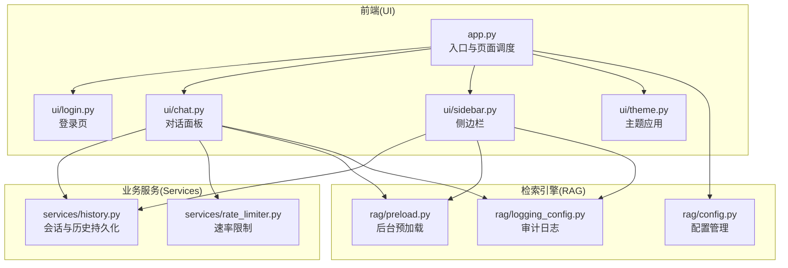
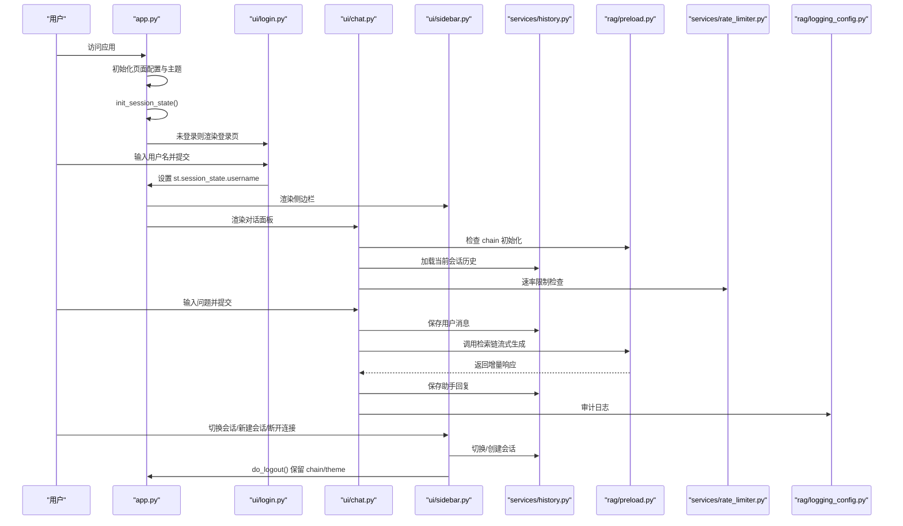
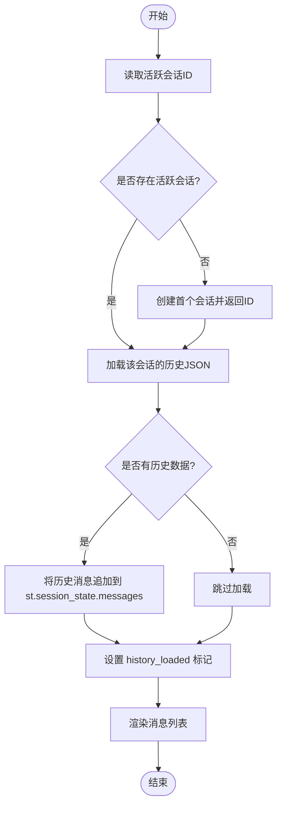
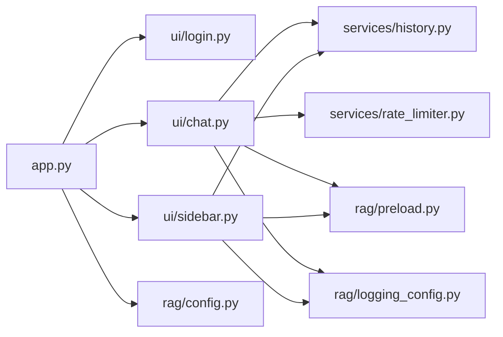

# 会话状态管理

<cite>
**本文引用的文件**
- [app.py](file://app.py)
- [ui/chat.py](file://ui/chat.py)
- [ui/login.py](file://ui/login.py)
- [ui/sidebar.py](file://ui/sidebar.py)
- [ui/theme.py](file://ui/theme.py)
- [services/history.py](file://services/history.py)
- [services/rate_limiter.py](file://services/rate_limiter.py)
- [rag/preload.py](file://rag/preload.py)
- [rag/config.py](file://rag/config.py)
- [rag/logging_config.py](file://rag/logging_config.py)
</cite>

## 目录
1. [简介](#简介)
2. [项目结构](#项目结构)
3. [核心组件](#核心组件)
4. [架构总览](#架构总览)
5. [详细组件分析](#详细组件分析)
6. [依赖分析](#依赖分析)
7. [性能考虑](#性能考虑)
8. [故障排查指南](#故障排查指南)
9. [结论](#结论)

## 简介
本文件围绕知识管理系统的会话状态管理进行系统化梳理，重点覆盖以下方面：
- st.session_state 初始化流程与关键键值设计
- 跨页面状态保持策略
- 用户认证状态、主题设置、消息历史、活动会话ID的管理机制
- 状态迁移与数据流向
- 状态清理策略、内存优化与并发访问控制

目标是帮助开发者与运维人员理解状态在不同组件间的传递与持久化，并提供可视化图示与最佳实践建议。

## 项目结构
该系统采用“前端界面(ui) + 业务服务(services) + 检索引擎(rag)”分层架构，会话状态主要由 Streamlit 的 st.session_state 承载，配合后端预加载模块与历史服务实现跨页面状态保持与持久化。

图表来源
- [app.py:54-89](file://app.py#L54-L89)
- [ui/chat.py:19-72](file://ui/chat.py#L19-L72)
- [ui/sidebar.py:26-183](file://ui/sidebar.py#L26-L183)
- [services/history.py:182-221](file://services/history.py#L182-L221)
- [services/rate_limiter.py:45-71](file://services/rate_limiter.py#L45-L71)
- [rag/preload.py:22-59](file://rag/preload.py#L22-L59)
- [rag/config.py:139-144](file://rag/config.py#L139-L144)
- [rag/logging_config.py:86-129](file://rag/logging_config.py#L86-L129)

章节来源
- [app.py:54-89](file://app.py#L54-L89)
- [ui/chat.py:19-72](file://ui/chat.py#L19-L72)
- [ui/sidebar.py:26-183](file://ui/sidebar.py#L26-L183)
- [services/history.py:182-221](file://services/history.py#L182-L221)
- [services/rate_limiter.py:45-71](file://services/rate_limiter.py#L45-L71)
- [rag/preload.py:22-59](file://rag/preload.py#L22-L59)
- [rag/config.py:139-144](file://rag/config.py#L139-L144)
- [rag/logging_config.py:86-129](file://rag/logging_config.py#L86-L129)

## 核心组件
- 应用入口与状态初始化：负责页面配置、主题应用、日志初始化与会话状态初始化。
- 登录页：设置用户名到 st.session_state，触发页面重绘。
- 对话面板：加载历史、处理输入、调用检索链、保存消息与会话标题。
- 侧边栏：导航、主题切换、会话管理、历史浏览、系统状态展示与断开连接。
- 历史服务：按用户/会话隔离的 JSON 持久化，支持会话列表、活动会话、消息读写与导出。
- 预加载模块：后台线程加载检索链，避免阻塞主线程。
- 速率限制：基于内存的时间戳队列，带周期性清理。
- 审计日志：结构化输出，支持按日期追加。

章节来源
- [app.py:23-52](file://app.py#L23-L52)
- [ui/login.py:9-75](file://ui/login.py#L9-L75)
- [ui/chat.py:19-190](file://ui/chat.py#L19-L190)
- [ui/sidebar.py:26-195](file://ui/sidebar.py#L26-L195)
- [services/history.py:19-270](file://services/history.py#L19-L270)
- [rag/preload.py:12-73](file://rag/preload.py#L12-L73)
- [services/rate_limiter.py:1-71](file://services/rate_limiter.py#L1-L71)
- [rag/logging_config.py:86-129](file://rag/logging_config.py#L86-L129)

## 架构总览
下图展示了会话状态在不同组件之间的流转与持久化路径，包括初始化、登录、对话、会话切换与断开连接的关键节点。

图表来源
- [app.py:54-89](file://app.py#L54-L89)
- [ui/login.py:54-60](file://ui/login.py#L54-L60)
- [ui/chat.py:47-190](file://ui/chat.py#L47-L190)
- [ui/sidebar.py:77-98](file://ui/sidebar.py#L77-L98)
- [services/history.py:55-90](file://services/history.py#L55-L90)
- [services/rate_limiter.py:45-71](file://services/rate_limiter.py#L45-L71)
- [rag/preload.py:22-59](file://rag/preload.py#L22-L59)
- [rag/logging_config.py:86-129](file://rag/logging_config.py#L86-L129)

## 详细组件分析

### 会话状态初始化与键值设计
- 初始化流程
  - 页面配置与主题应用在入口处完成。
  - init_session_state() 负责：
    - theme：默认主题来自配置，支持运行时切换。
    - messages：消息数组，用于当前会话的内存缓存。
    - page：当前页面标识（chat/dashboard）。
    - chain 与 chain_initialized：后台预加载完成后注入，避免每次 rerun 丢失。
    - 启动预加载（幂等），确保检索链在后台加载。
- 关键键值
  - username：登录态标识，决定后续页面渲染与历史隔离。
  - theme：主题键，驱动 ui/theme.py 应用样式。
  - messages：当前会话的消息列表，包含 role/content/timestamp。
  - page：页面路由键，影响主面板渲染。
  - chain / chain_initialized：检索链实例与初始化状态，跨 rerun 保持。
  - history_loaded：标记是否已从磁盘加载历史，避免重复加载。
  - feedback_*：每条助手消息对应的反馈键，用于记录用户评价。
- 跨页面保持
  - 由于 st.session_state 在同一浏览器标签页内持久存在，且 chain 通过后台线程加载并在模块级状态中共享，因此跨页面切换（chat/dashboard）仍可复用链与主题。

章节来源
- [app.py:23-52](file://app.py#L23-L52)
- [app.py:70-73](file://app.py#L70-L73)
- [rag/preload.py:22-59](file://rag/preload.py#L22-L59)
- [ui/theme.py:190-196](file://ui/theme.py#L190-L196)

### 用户认证状态管理
- 登录流程
  - 登录页收集用户名，写入 st.session_state.username 并触发 rerun。
  - 未登录时仅渲染登录页；登录后进入侧边栏与对话面板。
- 退出与断开连接
  - 侧边栏提供“断开连接”按钮，执行 do_logout()，仅保留 chain、chain_initialized、theme，清除其余用户相关状态，保证下次登录快速恢复链与主题。

章节来源
- [ui/login.py:9-75](file://ui/login.py#L9-L75)
- [app.py:43-52](file://app.py#L43-L52)
- [ui/sidebar.py:174-183](file://ui/sidebar.py#L174-L183)

### 主题设置与切换
- 默认主题来源于配置，运行时可在侧边栏点击图标切换明暗主题。
- 主题切换通过设置 st.session_state.theme 并调用 apply_theme() 应用对应 CSS 片段。

章节来源
- [app.py:69-70](file://app.py#L69-L70)
- [ui/sidebar.py:50-54](file://ui/sidebar.py#L50-L54)
- [ui/theme.py:190-196](file://ui/theme.py#L190-L196)

### 消息历史与活动会话ID
- 活动会话ID
  - get_active_session_id() 从用户会话元数据文件读取 active_session，若不存在则创建首个会话并返回。
- 历史加载
  - 首次渲染对话面板时，若未加载历史，则根据活动会话ID读取对应 JSON 文件并填充 st.session_state.messages，同时设置 history_loaded 防止重复加载。
- 消息持久化
  - save_message() 将消息写入当前会话文件，并兼容旧格式写入按日期的文件。
  - 首次提问时，根据会话历史数量判断是否需要自动命名会话标题。
- 会话管理
  - 新建会话：create_session() 生成新 ID，写入会话列表并切换为活跃。
  - 切换会话：switch_session() 更新活跃标记，清空内存消息并重置加载标志，触发 rerun。
  - 清除会话：清空 messages，移除 history_loaded，清空当日历史文件。

图表来源
- [services/history.py:55-71](file://services/history.py#L55-L71)
- [services/history.py:182-191](file://services/history.py#L182-L191)
- [ui/chat.py:47-58](file://ui/chat.py#L47-L58)

章节来源
- [services/history.py:55-71](file://services/history.py#L55-L71)
- [services/history.py:182-191](file://services/history.py#L182-L191)
- [ui/chat.py:47-58](file://ui/chat.py#L47-L58)
- [ui/sidebar.py:80-98](file://ui/sidebar.py#L80-L98)

### 检索链初始化与跨页面保持
- 后台预加载
  - start() 幂等启动后台线程，加载 RAGChain 并写入模块级状态。
  - is_done()/get_chain()/get_error()/reset() 提供状态查询与重置能力。
- 页面使用
  - 对话面板与侧边栏在渲染前检查 chain_initialized 与 chain，确保检索链可用。
  - 退出时 do_logout() 保留 chain 与 theme，避免重复初始化。

章节来源
- [rag/preload.py:22-73](file://rag/preload.py#L22-L73)
- [ui/chat.py:24-45](file://ui/chat.py#L24-L45)
- [ui/sidebar.py:153-161](file://ui/sidebar.py#L153-L161)
- [app.py:43-52](file://app.py#L43-L52)

### 速率限制与防抖
- 速率限制
  - 基于内存的用户时间戳队列，每分钟窗口限制请求数。
  - 定期清理不活跃用户，防止内存膨胀。
- 防重复提交
  - 对话面板在用户输入时检查最后一条消息是否相同，避免重复提交。

章节来源
- [services/rate_limiter.py:19-71](file://services/rate_limiter.py#L19-L71)
- [ui/chat.py:100-102](file://ui/chat.py#L100-L102)

### 审计日志与反馈
- 审计日志
  - 记录用户行为（如 feedback），按日期写入 JSONL 文件，包含时间戳、用户、动作、查询摘要等字段。
- 反馈记录
  - 助手消息下方提供“👍/👎”按钮，记录到 st.session_state.feedback_*，并写入审计日志。

章节来源
- [rag/logging_config.py:86-129](file://rag/logging_config.py#L86-L129)
- [ui/chat.py:75-94](file://ui/chat.py#L75-L94)

## 依赖分析
- 组件耦合
  - app.py 作为入口，依赖 ui/* 与 services/*，并调用 rag/* 进行配置与日志初始化。
  - ui/chat.py 与 ui/sidebar.py 同时依赖 services/history.py 与 services/rate_limiter.py。
  - 预加载模块与历史服务相互独立，但共同服务于对话面板。
- 外部依赖
  - Streamlit 提供 st.session_state、rerun、组件渲染等能力。
  - Python 标准库用于文件系统与时间管理。
- 潜在循环依赖
  - 当前文件间无直接循环导入，依赖方向清晰。

图表来源
- [app.py:54-89](file://app.py#L54-L89)
- [ui/chat.py:10-16](file://ui/chat.py#L10-L16)
- [ui/sidebar.py:14-23](file://ui/sidebar.py#L14-L23)
- [services/history.py:182-221](file://services/history.py#L182-L221)
- [services/rate_limiter.py:45-71](file://services/rate_limiter.py#L45-L71)
- [rag/preload.py:22-59](file://rag/preload.py#L22-L59)
- [rag/logging_config.py:86-129](file://rag/logging_config.py#L86-L129)
- [rag/config.py:139-144](file://rag/config.py#L139-L144)

## 性能考虑
- 预加载与后台线程
  - 通过后台线程加载检索链，避免阻塞 UI，提升首帧速度。
- 内存优化
  - 仅在当前会话维护 messages，避免将历史全部驻留内存。
  - 速率限制器定期清理不活跃用户，防止内存泄漏。
- I/O 优化
  - 历史文件按会话与日期分片存储，读写粒度小，便于并发访问。
- 渲染优化
  - 使用 st.rerun() 精准触发局部重绘，减少不必要的全量刷新。

[本节为通用性能讨论，无需具体文件来源]

## 故障排查指南
- 检索链未初始化
  - 现象：对话面板显示“系统初始化失败”。
  - 处理：重试加载或检查 LLM 配置与网络连接。
- 会话历史为空
  - 现象：新建会话后无历史。
  - 处理：确认会话 ID 正确，检查会话文件是否存在与可读。
- 速率限制频繁
  - 现象：提示“请求过于频繁”。
  - 处理：降低请求频率或调整配置中的 max_requests_per_minute。
- 主题切换无效
  - 现象：切换主题后未生效。
  - 处理：确认 st.session_state.theme 已更新并重新调用 apply_theme()。
- 退出后状态残留
  - 现象：断开连接后仍有用户相关状态。
  - 处理：使用 do_logout() 保留 chain 与 theme，确保只清除用户相关键。

章节来源
- [ui/chat.py:37-44](file://ui/chat.py#L37-L44)
- [services/history.py:55-71](file://services/history.py#L55-L71)
- [services/rate_limiter.py:65-68](file://services/rate_limiter.py#L65-L68)
- [app.py:43-52](file://app.py#L43-L52)

## 结论
本系统通过合理的 st.session_state 设计与模块化服务，实现了：
- 明确的初始化流程与键值规范
- 跨页面状态保持与持久化
- 用户认证、主题、消息历史与会话ID的协同管理
- 预加载与速率限制等性能与稳定性保障

建议在后续迭代中：
- 引入更细粒度的状态分区（如按用户/会话拆分键空间）
- 增强历史文件的并发写入保护
- 提供状态快照与恢复能力
- 优化审计日志的批量写入与压缩