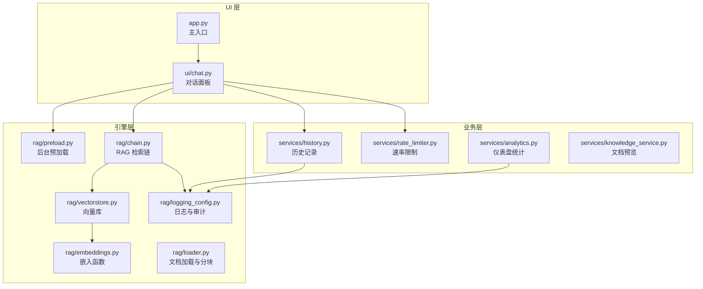
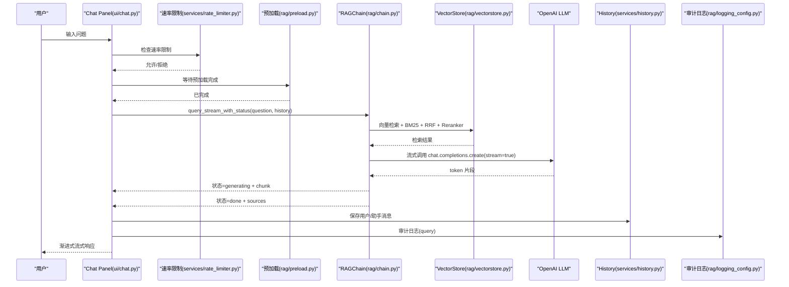
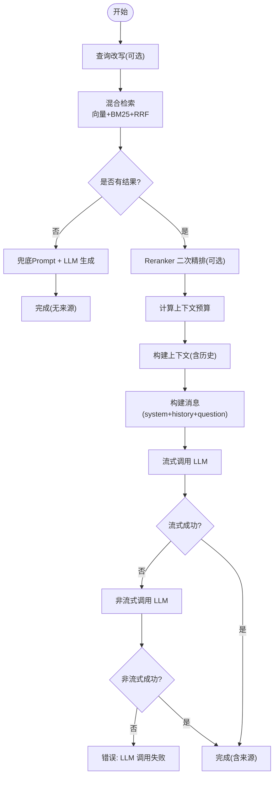
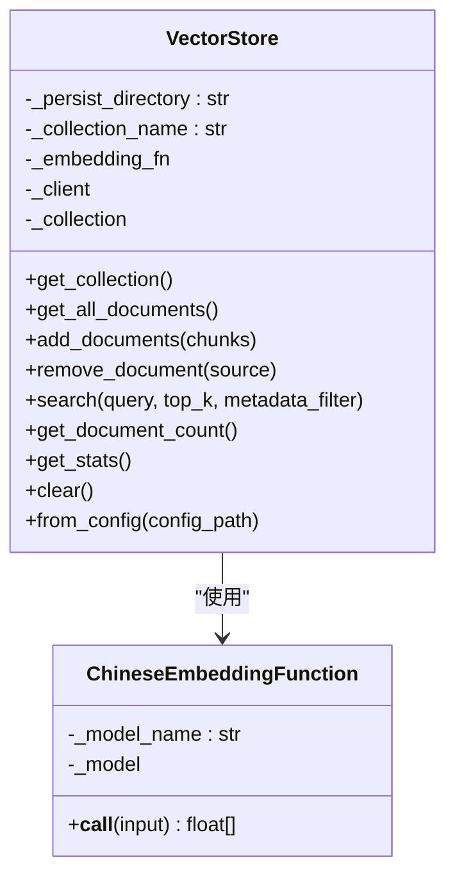
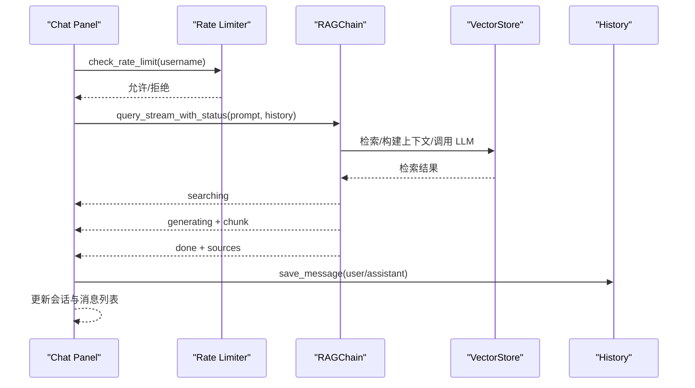
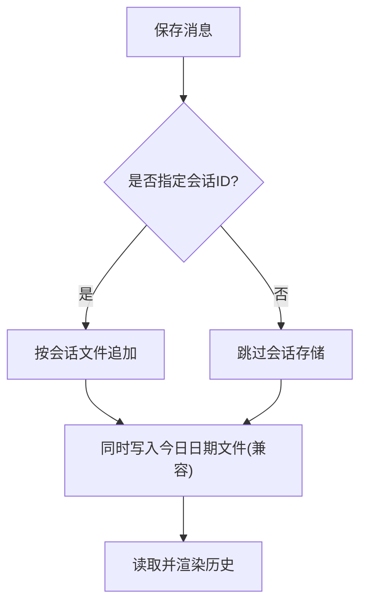
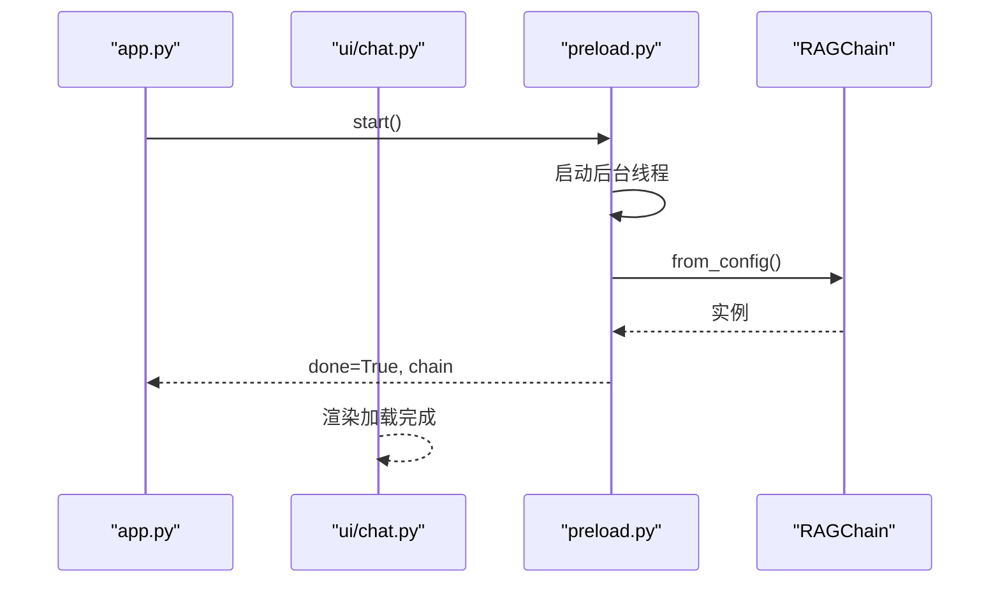
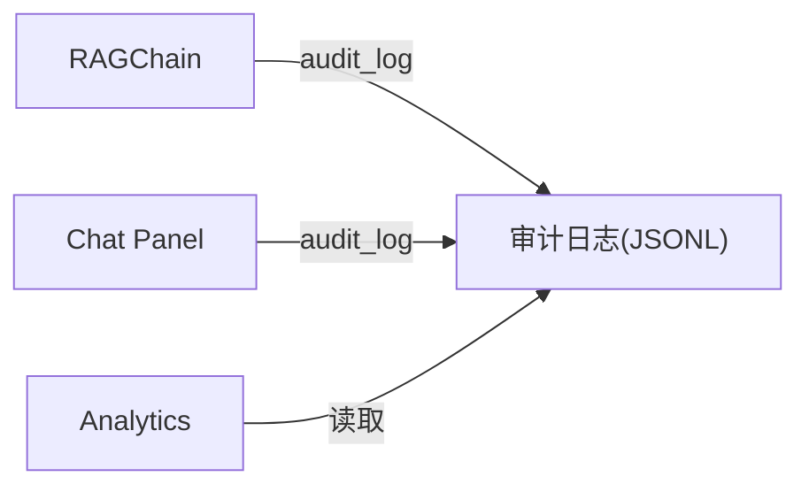
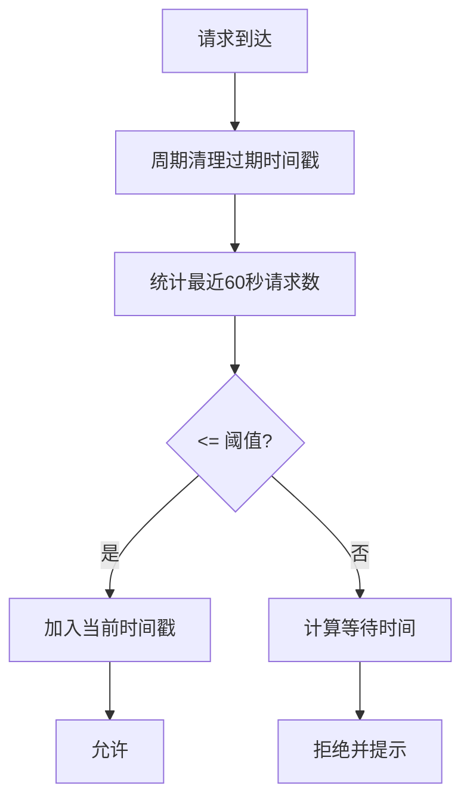
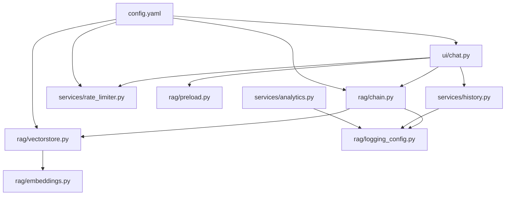

# 数据流架构

<cite>
**本文档引用的文件**
- [app.py](file://app.py)
- [config.yaml](file://config.yaml)
- [ui/chat.py](file://ui/chat.py)
- [rag/chain.py](file://rag/chain.py)
- [rag/vectorstore.py](file://rag/vectorstore.py)
- [rag/embeddings.py](file://rag/embeddings.py)
- [rag/loader.py](file://rag/loader.py)
- [rag/preload.py](file://rag/preload.py)
- [rag/logging_config.py](file://rag/logging_config.py)
- [services/history.py](file://services/history.py)
- [services/rate_limiter.py](file://services/rate_limiter.py)
- [services/analytics.py](file://services/analytics.py)
- [services/knowledge_service.py](file://services/knowledge_service.py)
</cite>

## 目录
1. [简介](#简介)
2. [项目结构](#项目结构)
3. [核心组件](#核心组件)
4. [架构总览](#架构总览)
5. [详细组件分析](#详细组件分析)
6. [依赖关系分析](#依赖关系分析)
7. [性能考量](#性能考量)
8. [故障排查指南](#故障排查指南)
9. [结论](#结论)
10. [附录](#附录)

## 简介
本文件面向知识管理系统，聚焦“用户输入到响应输出”的完整数据流，覆盖消息路由、状态更新、历史记录保存；解释异步数据处理、流式响应生成、缓存策略；提供数据流图与处理时序图，说明各组件间的数据交换协议，并涵盖数据验证、错误传播与性能监控机制。

## 项目结构
系统采用三层架构：
- UI 层：Streamlit 页面与组件，负责用户交互与状态展示
- 业务层：服务模块（历史、速率限制、分析、知识服务）
- 引擎层：RAG 检索链、向量库、嵌入、文档加载与预加载

图表来源
- [app.py:1-189](file://app.py#L1-L189)
- [ui/chat.py:1-190](file://ui/chat.py#L1-L190)
- [rag/chain.py:1-651](file://rag/chain.py#L1-L651)
- [rag/vectorstore.py:1-209](file://rag/vectorstore.py#L1-L209)
- [rag/embeddings.py:1-48](file://rag/embeddings.py#L1-L48)
- [rag/loader.py:1-259](file://rag/loader.py#L1-L259)
- [rag/preload.py:1-73](file://rag/preload.py#L1-L73)
- [rag/logging_config.py:1-129](file://rag/logging_config.py#L1-L129)
- [services/history.py:1-270](file://services/history.py#L1-L270)
- [services/rate_limiter.py:1-71](file://services/rate_limiter.py#L1-L71)
- [services/analytics.py:1-122](file://services/analytics.py#L1-L122)
- [services/knowledge_service.py:1-46](file://services/knowledge_service.py#L1-L46)

章节来源
- [app.py:1-189](file://app.py#L1-L189)
- [config.yaml:1-50](file://config.yaml#L1-L50)

## 核心组件
- RAGChain：检索增强生成链，负责混合检索、重排序、上下文构建、流式/非流式 LLM 调用与降级
- VectorStore：ChromaDB 封装，提供全局单例缓存、集合管理、检索与统计
- Chat Panel：Streamlit 对话面板，驱动查询流程、状态渲染、历史持久化
- History Service：会话与消息持久化，支持多会话、导出
- Rate Limiter：内存速率限制器，按用户每分钟限流
- Preload：后台线程预加载 RAGChain，避免首查延迟
- Logging/Audit：结构化日志与审计日志，记录查询、反馈等事件
- Analytics：从审计日志聚合统计指标
- Knowledge Service：文档内容读取（含 PDF）

章节来源
- [rag/chain.py:174-651](file://rag/chain.py#L174-L651)
- [rag/vectorstore.py:24-209](file://rag/vectorstore.py#L24-L209)
- [ui/chat.py:19-190](file://ui/chat.py#L19-L190)
- [services/history.py:1-270](file://services/history.py#L1-L270)
- [services/rate_limiter.py:1-71](file://services/rate_limiter.py#L1-L71)
- [rag/preload.py:1-73](file://rag/preload.py#L1-L73)
- [rag/logging_config.py:86-129](file://rag/logging_config.py#L86-L129)
- [services/analytics.py:17-122](file://services/analytics.py#L17-L122)
- [services/knowledge_service.py:16-46](file://services/knowledge_service.py#L16-L46)

## 架构总览
系统采用“前端事件驱动 + 后端流式生成”的模式：
- 用户在 UI 输入问题，触发查询流程
- 预加载完成前显示加载状态；完成后进入“检索 → 生成 → 完成/错误”状态机
- 检索阶段：向量检索 + BM25 关键词检索 + RRF 融合 + Reranker 二次精排
- 生成阶段：构建系统提示与上下文，流式调用 LLM，失败自动降级为非流式
- 历史阶段：保存用户/助手消息，支持会话切换与导出
- 审计阶段：记录查询、反馈等事件，供仪表盘统计

图表来源
- [ui/chat.py:96-190](file://ui/chat.py#L96-L190)
- [services/rate_limiter.py:45-71](file://services/rate_limiter.py#L45-L71)
- [rag/preload.py:22-73](file://rag/preload.py#L22-L73)
- [rag/chain.py:437-569](file://rag/chain.py#L437-L569)
- [rag/vectorstore.py:124-142](file://rag/vectorstore.py#L124-L142)
- [services/history.py:193-221](file://services/history.py#L193-L221)
- [rag/logging_config.py:86-129](file://rag/logging_config.py#L86-L129)

## 详细组件分析

### RAG 检索链（RAGChain）
- 检索：向量检索 + BM25 关键词检索，使用 RRF 融合去重，阈值过滤低相关度
- 上下文：估算 token 预算，按模板与历史裁剪，低置信度插入系统提示
- 生成：优先流式调用，失败指数退避重试后降级为非流式；兜底场景使用通用知识 prompt
- 审计：记录检索条数、回答长度、耗时等

图表来源
- [rag/chain.py:437-569](file://rag/chain.py#L437-L569)
- [rag/chain.py:570-643](file://rag/chain.py#L570-L643)

章节来源
- [rag/chain.py:174-651](file://rag/chain.py#L174-L651)

### 向量库（VectorStore）
- 全局单例缓存：相同配置只创建一个实例，避免重复加载 embedding 模型
- 集合管理：延迟初始化客户端与集合，支持切换集合、统计、清空
- 检索：支持元数据过滤，返回内容、元数据与距离
- 文档管理：增量更新（按 ID 删除后新增），支持按来源删除

图表来源
- [rag/vectorstore.py:24-209](file://rag/vectorstore.py#L24-L209)
- [rag/embeddings.py:19-48](file://rag/embeddings.py#L19-L48)

章节来源
- [rag/vectorstore.py:1-209](file://rag/vectorstore.py#L1-L209)
- [rag/embeddings.py:1-48](file://rag/embeddings.py#L1-L48)

### 对话面板（Chat Panel）
- 初始化：等待预加载完成，加载当前会话历史
- 输入校验：防重复提交、输入长度限制、速率限制
- 查询流程：构造历史、调用 RAGChain 流式事件、渲染状态、保存消息
- 反馈：记录正/负反馈至审计日志

图表来源
- [ui/chat.py:96-190](file://ui/chat.py#L96-L190)
- [services/rate_limiter.py:45-71](file://services/rate_limiter.py#L45-L71)
- [rag/chain.py:437-569](file://rag/chain.py#L437-L569)
- [services/history.py:193-221](file://services/history.py#L193-L221)

章节来源
- [ui/chat.py:1-190](file://ui/chat.py#L1-L190)

### 历史记录服务（History）
- 会话管理：按用户目录隔离，维护会话列表与活跃会话
- 消息持久化：按会话 JSON 存储，同时兼容旧版按日期文件
- 导出：支持 Markdown 与 JSON 导出

图表来源
- [services/history.py:193-221](file://services/history.py#L193-L221)
- [services/history.py:171-191](file://services/history.py#L171-L191)

章节来源
- [services/history.py:1-270](file://services/history.py#L1-L270)

### 预加载（Preload）
- 后台线程加载 RAGChain，避免 Streamlit 重绘导致状态丢失
- 状态共享：模块级可变字典，线程安全写入，支持重试与错误恢复

图表来源
- [app.py:32-41](file://app.py#L32-L41)
- [rag/preload.py:22-73](file://rag/preload.py#L22-L73)
- [rag/chain.py:645-651](file://rag/chain.py#L645-L651)

章节来源
- [rag/preload.py:1-73](file://rag/preload.py#L1-L73)

### 审计与日志（Logging/Audit）
- 结构化日志：控制台彩色输出 + 文件完整日志
- 审计日志：JSONL 按日拆分，记录查询、反馈等事件，支持仪表盘统计

图表来源
- [rag/logging_config.py:86-129](file://rag/logging_config.py#L86-L129)
- [services/analytics.py:17-122](file://services/analytics.py#L17-L122)

章节来源
- [rag/logging_config.py:1-129](file://rag/logging_config.py#L1-L129)
- [services/analytics.py:1-122](file://services/analytics.py#L1-L122)

### 速率限制（Rate Limiter）
- 内存计数器：按用户记录最近 60 秒请求时间戳
- 清理策略：周期性清理不活跃用户，防止内存膨胀
- 限流判定：超过阈值返回等待提示

图表来源
- [services/rate_limiter.py:19-71](file://services/rate_limiter.py#L19-L71)

章节来源
- [services/rate_limiter.py:1-71](file://services/rate_limiter.py#L1-L71)

## 依赖关系分析
- UI 依赖业务层与引擎层：对话面板依赖历史、速率限制、预加载与 RAGChain
- 引擎层内部耦合：RAGChain 依赖 VectorStore 与嵌入函数；VectorStore 依赖 ChromaDB 与嵌入函数
- 审计日志贯穿：RAGChain 与 UI 均调用审计日志接口
- 配置驱动：config.yaml 为全局配置来源，影响 LLM、向量库、分块参数、限流与 UI

图表来源
- [ui/chat.py:1-190](file://ui/chat.py#L1-L190)
- [services/history.py:1-270](file://services/history.py#L1-L270)
- [services/rate_limiter.py:1-71](file://services/rate_limiter.py#L1-L71)
- [rag/preload.py:1-73](file://rag/preload.py#L1-L73)
- [rag/chain.py:1-651](file://rag/chain.py#L1-L651)
- [rag/vectorstore.py:1-209](file://rag/vectorstore.py#L1-L209)
- [rag/embeddings.py:1-48](file://rag/embeddings.py#L1-L48)
- [rag/logging_config.py:1-129](file://rag/logging_config.py#L1-L129)
- [services/analytics.py:1-122](file://services/analytics.py#L1-L122)
- [config.yaml:1-50](file://config.yaml#L1-L50)

章节来源
- [config.yaml:1-50](file://config.yaml#L1-L50)

## 性能考量
- 向量库缓存：VectorStore 全局单例，避免重复加载嵌入模型与集合初始化
- 检索优化：向量检索 + BM25 + RRF 融合，阈值过滤降低无关结果
- 上下文预算：按模板、历史、问题与最大输出估算 token 预算，避免越界
- 流式生成：优先流式调用，失败指数退避后降级，提升感知延迟
- 预加载：后台线程预热 RAGChain，减少首查等待
- 速率限制：防止突发流量压垮下游服务

## 故障排查指南
- 预加载失败：检查配置与网络，重试加载
  - 参考路径：[rag/preload.py:33-48](file://rag/preload.py#L33-L48)
- LLM 调用失败：查看审计日志与系统日志，确认模型、密钥与网络
  - 参考路径：[rag/chain.py:570-643](file://rag/chain.py#L570-L643)
- 检索无结果：确认知识库入库、分块参数与阈值设置
  - 参考路径：[rag/chain.py:250-312](file://rag/chain.py#L250-L312)
- 历史读写异常：检查 chat_history 目录权限与磁盘空间
  - 参考路径：[services/history.py:193-221](file://services/history.py#L193-L221)
- 速率限制频繁：调整每分钟上限或等待冷却
  - 参考路径：[services/rate_limiter.py:45-71](file://services/rate_limiter.py#L45-L71)

章节来源
- [rag/preload.py:1-73](file://rag/preload.py#L1-L73)
- [rag/chain.py:570-643](file://rag/chain.py#L570-L643)
- [services/history.py:193-221](file://services/history.py#L193-L221)
- [services/rate_limiter.py:1-71](file://services/rate_limiter.py#L1-L71)

## 结论
本系统通过“预加载 + 流式生成 + 多层缓存 + 审计日志”的组合，在保证用户体验的同时，兼顾了可维护性与可观测性。数据流自上而下清晰：UI 事件驱动 → 业务校验 → 引擎检索与生成 → 历史与审计持久化。建议持续关注嵌入模型加载与 LLM 调用的稳定性，结合审计日志与仪表盘进行容量与质量评估。

## 附录
- 配置项概览（节选）
  - LLM：api_base、api_key、model、temperature、max_tokens、context_window
  - 向量库：persist_directory、collection_name、top_k、distance_threshold
  - 知识库：docs_directory、chunk_size、chunk_overlap
  - 速率限制：enabled、max_requests_per_minute、max_input_length
  - 多轮对话：max_conversation_turns
  - 审计日志：audit_enabled
  - UI：title、subtitle、company_name、company_url、logo_text、default_theme

章节来源
- [config.yaml:1-50](file://config.yaml#L1-L50)