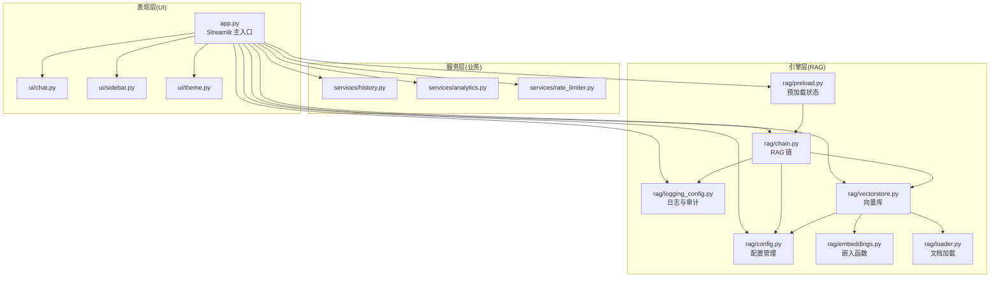
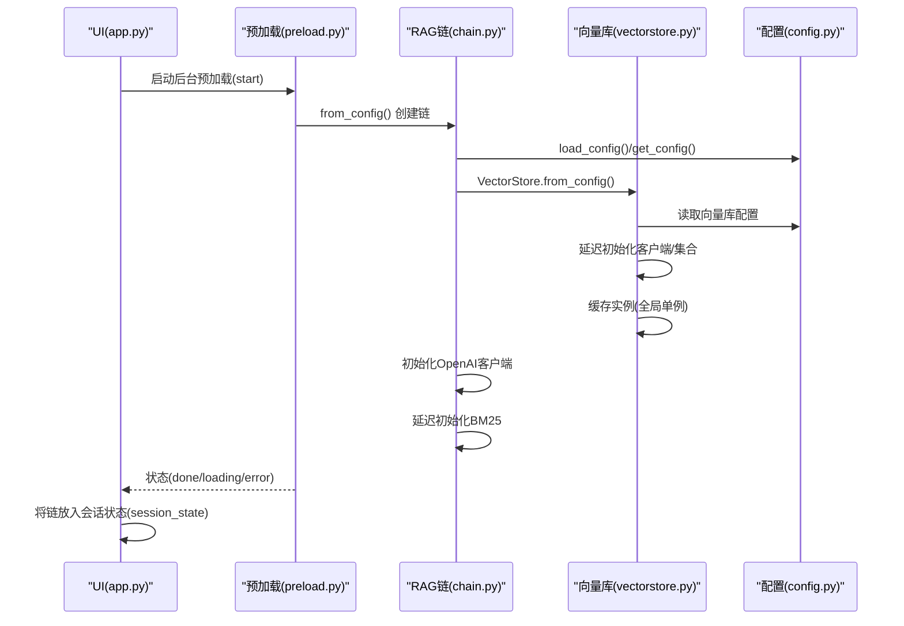
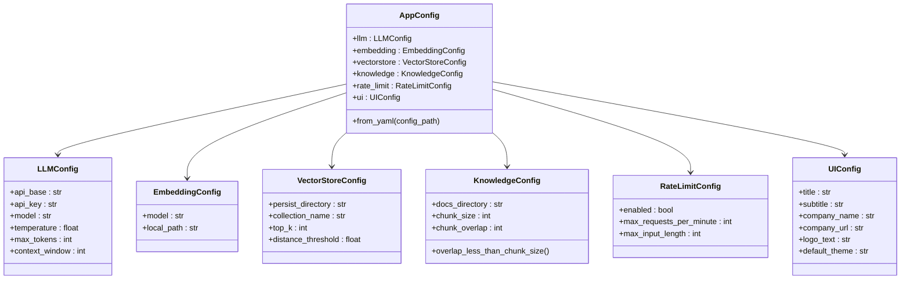
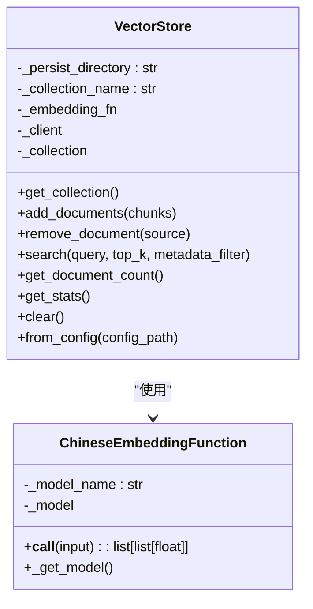
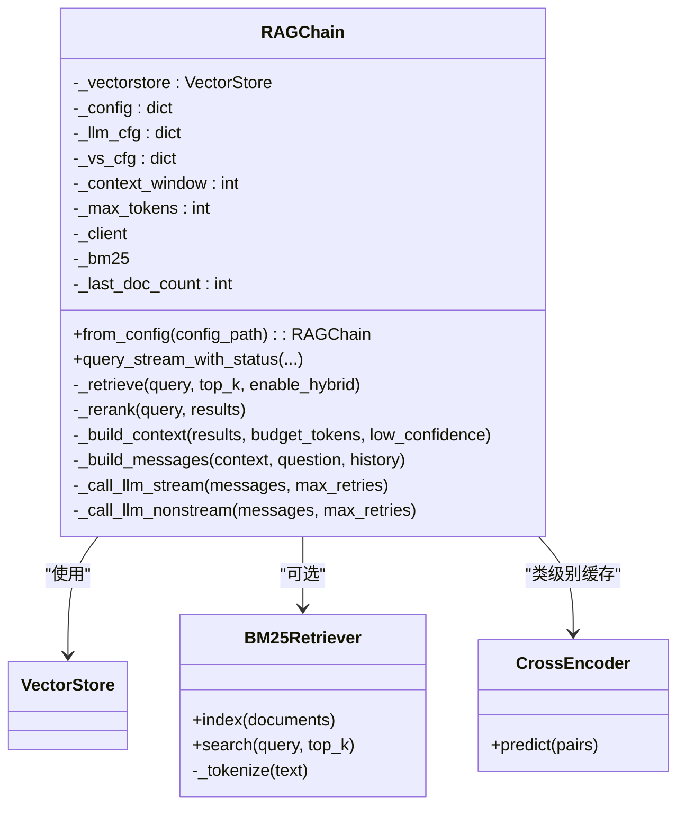
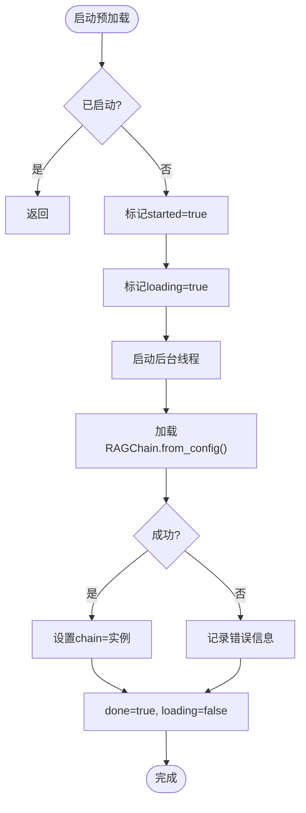
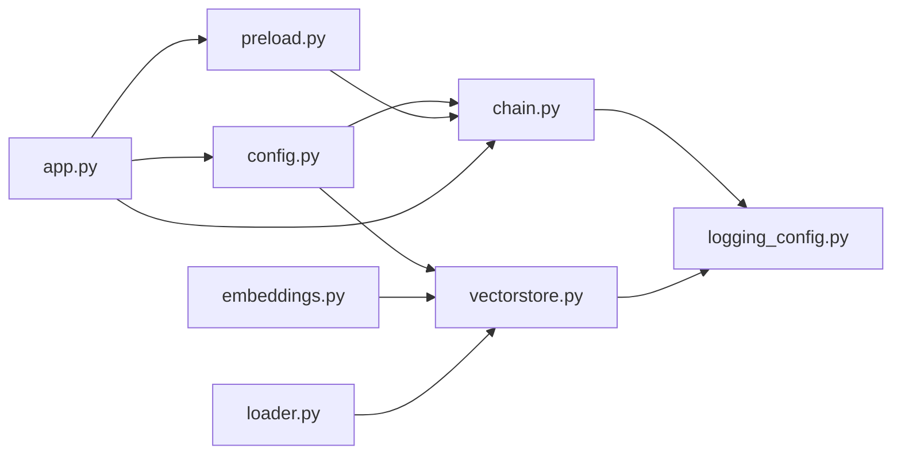

# 模块依赖注入机制

<cite>
**本文档引用的文件**
- [app.py](file://app.py)
- [rag/chain.py](file://rag/chain.py)
- [rag/config.py](file://rag/config.py)
- [rag/preload.py](file://rag/preload.py)
- [rag/vectorstore.py](file://rag/vectorstore.py)
- [rag/embeddings.py](file://rag/embeddings.py)
- [rag/logging_config.py](file://rag/logging_config.py)
- [rag/loader.py](file://rag/loader.py)
- [config.yaml](file://config.yaml)
- [tests/test_chain.py](file://tests/test_chain.py)
- [tests/test_preload.py](file://tests/test_preload.py)
</cite>

## 目录
1. [简介](#简介)
2. [项目结构](#项目结构)
3. [核心组件](#核心组件)
4. [架构总览](#架构总览)
5. [详细组件分析](#详细组件分析)
6. [依赖关系分析](#依赖关系分析)
7. [性能考量](#性能考量)
8. [故障排除指南](#故障排除指南)
9. [结论](#结论)

## 简介
本文件系统性阐述知识管理系统的模块依赖注入机制，重点覆盖以下方面：
- RAG 链的初始化过程与配置注入
- 预加载机制与后台线程状态管理
- 模块间依赖关系、接口抽象与工厂模式应用
- 依赖解析策略、循环依赖避免与错误处理机制
- 依赖图与初始化序列图，展示从配置加载到链实例化的完整流程

## 项目结构
系统采用分层架构，主要分为三层：
- 表现层（UI 层）：Streamlit 页面渲染与交互
- 服务层（业务层）：聊天面板、历史记录、分析仪表盘等
- 引擎层（RAG 引擎）：配置、向量库、嵌入、检索链、预加载与日志

图表来源
- [app.py:1-189](file://app.py#L1-L189)
- [rag/chain.py:1-651](file://rag/chain.py#L1-L651)
- [rag/config.py:1-185](file://rag/config.py#L1-L185)
- [rag/preload.py:1-73](file://rag/preload.py#L1-L73)
- [rag/vectorstore.py:1-209](file://rag/vectorstore.py#L1-L209)
- [rag/embeddings.py:1-48](file://rag/embeddings.py#L1-L48)
- [rag/logging_config.py:1-129](file://rag/logging_config.py#L1-L129)
- [rag/loader.py:1-259](file://rag/loader.py#L1-L259)

章节来源
- [app.py:1-189](file://app.py#L1-L189)
- [rag/chain.py:1-651](file://rag/chain.py#L1-L651)
- [rag/config.py:1-185](file://rag/config.py#L1-L185)
- [rag/preload.py:1-73](file://rag/preload.py#L1-L73)
- [rag/vectorstore.py:1-209](file://rag/vectorstore.py#L1-L209)
- [rag/embeddings.py:1-48](file://rag/embeddings.py#L1-L48)
- [rag/logging_config.py:1-129](file://rag/logging_config.py#L1-L129)
- [rag/loader.py:1-259](file://rag/loader.py#L1-L259)

## 核心组件
- 配置管理（Config）：基于 Pydantic 的强类型配置，支持环境变量替换与单例访问；提供全局配置对象与字典形式的兼容接口。
- 向量库（VectorStore）：封装 ChromaDB，提供延迟初始化、集合切换、文档增删查、统计信息与全局单例缓存。
- 嵌入函数（ChineseEmbeddingFunction）：封装 sentence-transformers 的中文嵌入，支持在线/离线模型加载。
- 检索链（RAGChain）：实现检索-重排序-构建 Prompt-调用 LLM 的完整链路，支持混合检索、RRF 融合、查询改写、流式/非流式 LLM 调用与重试。
- 预加载（Preload）：后台线程预加载 RAGChain，利用模块级可变状态在 Streamlit 多次 rerun 间保持一致。
- 日志与审计（Logging/Audit）：统一日志输出与审计日志 JSONL 记录，支持开关控制。
- 文档加载（Loader）：支持 Markdown、TXT、PDF 的递归扫描与分块，保留元数据。

章节来源
- [rag/config.py:103-185](file://rag/config.py#L103-L185)
- [rag/vectorstore.py:24-209](file://rag/vectorstore.py#L24-L209)
- [rag/embeddings.py:19-48](file://rag/embeddings.py#L19-L48)
- [rag/chain.py:174-651](file://rag/chain.py#L174-L651)
- [rag/preload.py:12-73](file://rag/preload.py#L12-L73)
- [rag/logging_config.py:86-129](file://rag/logging_config.py#L86-L129)
- [rag/loader.py:22-259](file://rag/loader.py#L22-L259)

## 架构总览
系统通过“配置驱动 + 工厂方法 + 延迟初始化 + 单例缓存”的组合实现依赖注入与模块解耦：
- 配置驱动：所有组件通过配置对象或配置字典获取参数，避免硬编码。
- 工厂方法：VectorStore.from_config、RAGChain.from_config 提供统一实例化入口。
- 延迟初始化：向量库客户端、嵌入模型、BM25 索引均在首次使用时创建，降低启动成本。
- 单例缓存：向量库与 Reranker 模型采用类级/模块级缓存，避免重复加载。

图表来源
- [app.py:32-41](file://app.py#L32-L41)
- [rag/preload.py:22-49](file://rag/preload.py#L22-L49)
- [rag/chain.py:646-651](file://rag/chain.py#L646-L651)
- [rag/vectorstore.py:181-209](file://rag/vectorstore.py#L181-L209)
- [rag/config.py:139-185](file://rag/config.py#L139-L185)

## 详细组件分析

### 配置管理（Config）
- 设计要点
  - 使用 Pydantic BaseModel 定义各子配置（LLM、Embedding、VectorStore、Knowledge、RateLimit、UI），内置字段校验与默认值。
  - 支持环境变量替换：${VAR} 或 ${VAR:-default}，递归应用于整个配置树。
  - 提供全局单例 get_config() 与可重载 reload_config()，以及兼容旧接口的 load_config()。
- 依赖关系
  - 被 RAGChain、VectorStore、UI 等广泛依赖。
  - 与 YAML 文件绑定，支持从文件加载并替换环境变量。
- 错误处理
  - 配置文件不存在时抛出 FileNotFoundError。
  - 字段校验失败抛出 ValueError。
- 性能影响
  - 单例缓存避免重复解析与校验；环境变量替换在首次加载时完成。

图表来源
- [rag/config.py:48-117](file://rag/config.py#L48-L117)

章节来源
- [rag/config.py:103-185](file://rag/config.py#L103-L185)

### 向量库（VectorStore）
- 设计要点
  - 延迟初始化：客户端与集合在首次使用时创建，避免启动时 IO。
  - 全局单例缓存：相同配置下复用同一实例，避免重复加载嵌入模型。
  - 支持集合切换与多知识库场景。
  - 提供文档增删、查询、统计与清空等操作。
- 依赖关系
  - 依赖配置模块获取持久化目录、集合名与嵌入配置。
  - 依赖嵌入函数模块提供向量化能力。
  - 依赖加载模块（在文档入库场景）。
- 错误处理
  - 集合查询/删除异常时记录警告并返回空结果或 0 计数。
- 性能影响
  - 单例缓存显著降低重复初始化成本；延迟初始化减少冷启动时间。

图表来源
- [rag/vectorstore.py:24-209](file://rag/vectorstore.py#L24-L209)
- [rag/embeddings.py:19-48](file://rag/embeddings.py#L19-L48)

章节来源
- [rag/vectorstore.py:24-209](file://rag/vectorstore.py#L24-L209)

### 嵌入函数（ChineseEmbeddingFunction）
- 设计要点
  - 延迟加载：首次调用时才加载模型，支持在线/离线路径。
  - 进度提示：加载过程中输出日志，便于用户感知。
- 依赖关系
  - 依赖 sentence-transformers 与 chromadb 的 EmbeddingFunction 接口。
- 错误处理
  - 加载失败时抛出异常，上层捕获并降级处理。
- 性能影响
  - 首次加载耗时较长，后续复用缓存。

章节来源
- [rag/embeddings.py:19-48](file://rag/embeddings.py#L19-L48)

### 检索链（RAGChain）
- 设计要点
  - 工厂方法：from_config() 统一从配置创建链实例。
  - 混合检索：向量检索 + BM25 关键词检索 + RRF 融合。
  - 查询改写：短查询结合历史上下文提升召回质量。
  - 重排序：类级别缓存 CrossEncoder 模型，避免重复加载。
  - 流式/非流式 LLM 调用与指数退避重试。
  - 上下文构建与 token 预算：动态裁剪以适配上下文窗口。
- 依赖关系
  - 依赖 VectorStore 获取集合与文档。
  - 依赖配置模块读取 LLM 参数。
  - 依赖日志模块记录审计日志。
- 错误处理
  - 检索失败、LLM 调用失败、空响应等均有降级与错误上报。
- 性能影响
  - BM25 索引与 Reranker 模型缓存显著提升后续查询速度。

图表来源
- [rag/chain.py:174-651](file://rag/chain.py#L174-L651)

章节来源
- [rag/chain.py:174-651](file://rag/chain.py#L174-L651)

### 预加载（Preload）
- 设计要点
  - 幕等启动：多次调用只启动一次后台线程。
  - 模块级状态：利用 Python 模块只导入一次特性，在多次 Streamlit rerun 间保持状态。
  - 线程安全：状态字典写入在后台线程完成，主线程读取幂等。
- 依赖关系
  - 依赖 RAGChain.from_config() 创建链实例。
  - 依赖日志模块输出加载状态。
- 错误处理
  - 加载失败捕获异常并记录错误信息，状态标记完成以便 UI 显示。
- 性能影响
  - 避免页面首次交互时的冷启动延迟，提升用户体验。

图表来源
- [rag/preload.py:22-73](file://rag/preload.py#L22-L73)

章节来源
- [rag/preload.py:12-73](file://rag/preload.py#L12-L73)

### 日志与审计（Logging/Audit）
- 设计要点
  - 控制台彩色输出 + 文件完整日志，便于开发调试与生产运维。
  - 审计日志 JSONL 文件按日期分片，支持开关控制。
- 依赖关系
  - 被链、向量库、UI 等广泛使用。
- 错误处理
  - 审计日志写入异常不影响主流程，仅记录警告。

章节来源
- [rag/logging_config.py:46-129](file://rag/logging_config.py#L46-L129)

### 文档加载（Loader）
- 设计要点
  - 支持 Markdown、TXT、PDF 递归扫描，按标题与语义边界切分，保留元数据。
  - 提供仅元数据的文件清单接口，便于 UI 展示。
- 依赖关系
  - 依赖配置模块读取分块参数。
  - 依赖嵌入函数模块进行向量化（在入库时）。
- 错误处理
  - 文件读取失败记录警告并跳过，不影响整体流程。

章节来源
- [rag/loader.py:131-259](file://rag/loader.py#L131-L259)

## 依赖关系分析
- 模块耦合与内聚
  - 高内聚：每个模块职责单一（配置、向量库、嵌入、链、预加载、日志、加载）。
  - 低耦合：通过工厂方法与配置注入解耦，避免硬编码依赖。
- 直接与间接依赖
  - RAGChain 直接依赖 VectorStore 与配置；间接依赖嵌入函数与日志。
  - VectorStore 直接依赖配置与嵌入函数；间接依赖加载模块。
  - 预加载模块依赖链工厂方法，间接依赖日志模块。
- 循环依赖避免
  - 通过“配置驱动 + 工厂方法”避免相互引用；模块级状态避免重复初始化。
- 外部依赖与集成点
  - ChromaDB、sentence-transformers、OpenAI SDK、Pydantic、YAML、Streamlit。
- 接口契约
  - VectorStore.from_config 与 RAGChain.from_config 提供稳定的工厂接口。
  - EmbeddingFunction 接口约定嵌入输出格式。

图表来源
- [rag/config.py:103-185](file://rag/config.py#L103-L185)
- [rag/chain.py:14-18](file://rag/chain.py#L14-L18)
- [rag/vectorstore.py:12-15](file://rag/vectorstore.py#L12-L15)
- [rag/embeddings.py:12-16](file://rag/embeddings.py#L12-L16)
- [rag/loader.py:12-13](file://rag/loader.py#L12-L13)
- [rag/preload.py:37-38](file://rag/preload.py#L37-L38)
- [app.py:15-17](file://app.py#L15-L17)

章节来源
- [rag/chain.py:14-18](file://rag/chain.py#L14-L18)
- [rag/vectorstore.py:12-15](file://rag/vectorstore.py#L12-L15)
- [rag/embeddings.py:12-16](file://rag/embeddings.py#L12-L16)
- [rag/loader.py:12-13](file://rag/loader.py#L12-L13)
- [rag/preload.py:37-38](file://rag/preload.py#L37-L38)
- [app.py:15-17](file://app.py#L15-L17)

## 性能考量
- 启动优化
  - 延迟初始化：向量库客户端、嵌入模型、BM25 索引仅在首次使用时创建。
  - 单例缓存：向量库与 Reranker 模型类级别缓存，避免重复加载。
- 运行时优化
  - 混合检索与 RRF 融合提升召回质量与稳定性。
  - token 预算与动态裁剪避免上下文溢出。
  - 流式 LLM 调用与指数退避重试提升鲁棒性。
- I/O 与网络
  - 配置文件一次性加载并缓存；嵌入模型首次下载可能较慢，建议离线部署或镜像加速。
  - 向量库持久化目录提前准备，避免首次写入阻塞。

## 故障排除指南
- 配置相关
  - 环境变量未设置：检查 ${VAR} 或 ${VAR:-default} 替换是否正确。
  - 字段校验失败：调整配置值至合法范围（如 max_tokens、context_window）。
- 向量库相关
  - 集合为空：确认文档已成功入库；检查 add_documents 与 metadata 字段。
  - 距离阈值过高：适当降低 distance_threshold 以提升召回。
- 检索链相关
  - BM25 索引构建失败：检查向量库文档数量与可用性；查看日志警告。
  - LLM 调用失败：检查 api_base、api_key、model 与网络连通性；查看重试日志。
- 预加载相关
  - 预加载未完成：等待后台线程完成；检查错误信息；必要时 reset() 重试。
- 日志与审计
  - 审计日志未生成：确认 audit_enabled 开关；检查日志目录权限。

章节来源
- [rag/config.py:118-185](file://rag/config.py#L118-L185)
- [rag/vectorstore.py:144-180](file://rag/vectorstore.py#L144-L180)
- [rag/chain.py:206-222](file://rag/chain.py#L206-L222)
- [rag/chain.py:570-643](file://rag/chain.py#L570-L643)
- [rag/preload.py:66-73](file://rag/preload.py#L66-L73)
- [rag/logging_config.py:106-129](file://rag/logging_config.py#L106-L129)

## 结论
本系统通过“配置驱动 + 工厂方法 + 延迟初始化 + 单例缓存”的依赖注入策略，实现了 RAG 引擎的高效初始化与稳定运行。预加载机制有效规避了 Streamlit 多次 rerun 带来的状态丢失问题，提升了用户体验。模块间通过清晰的接口与最小依赖实现了解耦，具备良好的可维护性与扩展性。建议在生产环境中：
- 预先准备嵌入模型与向量库数据，减少首次加载时间
- 合理设置距离阈值与 top_k，平衡召回与质量
- 监控审计日志与系统日志，及时发现并处理异常