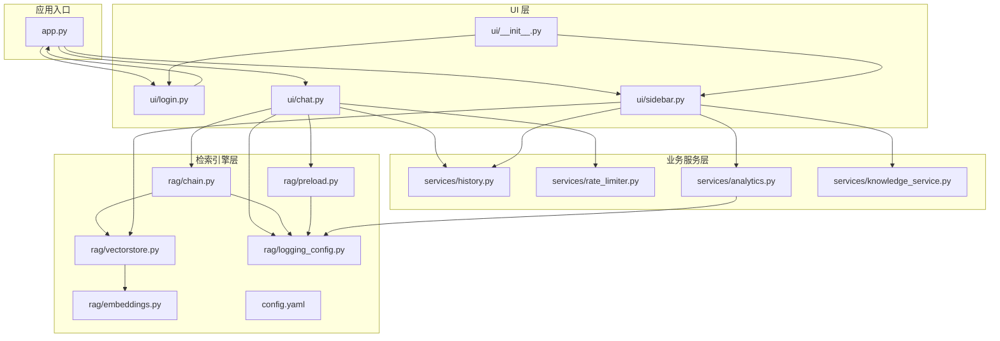
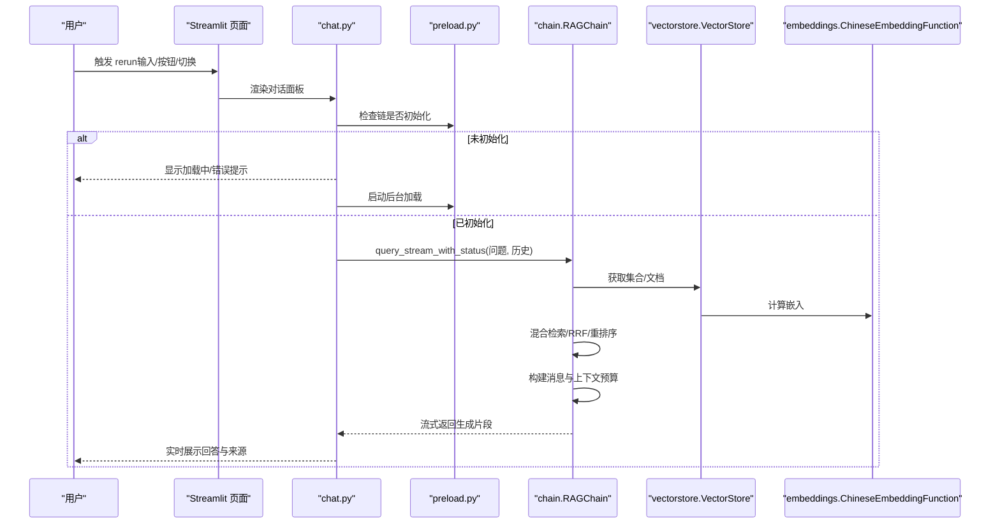
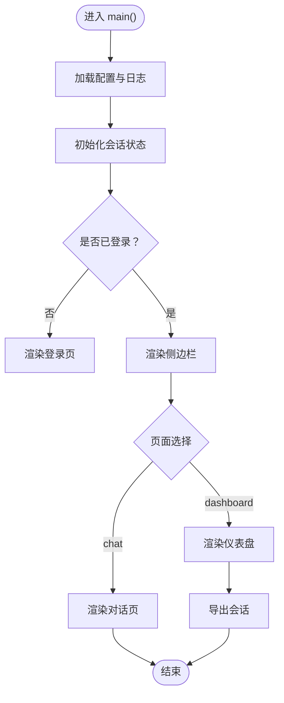
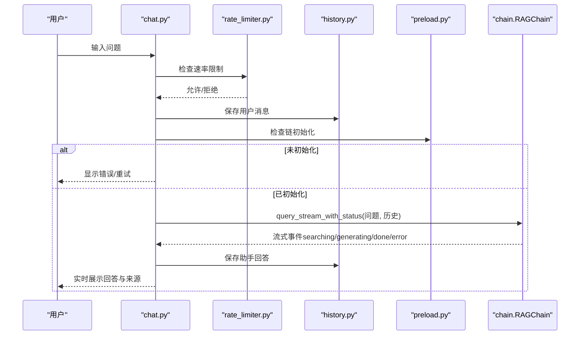
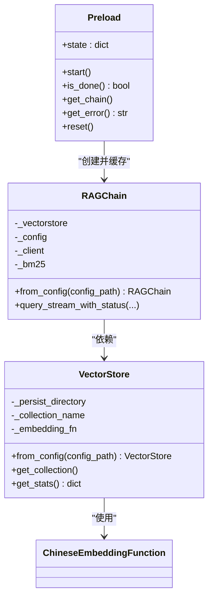
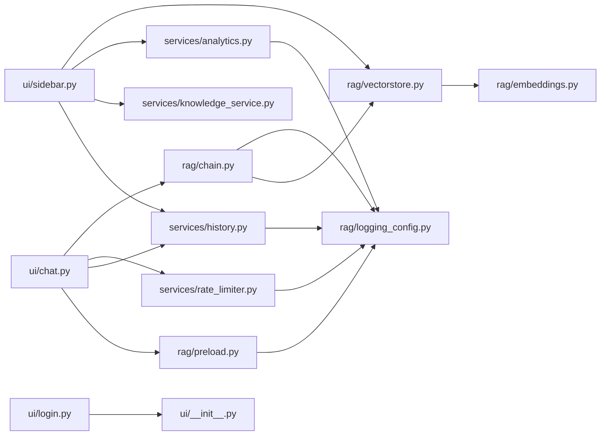

# 组件交互机制

<cite>
**本文引用的文件**
- [app.py](file://app.py)
- [config.yaml](file://config.yaml)
- [ui/chat.py](file://ui/chat.py)
- [ui/sidebar.py](file://ui/sidebar.py)
- [ui/login.py](file://ui/login.py)
- [ui/__init__.py](file://ui/__init__.py)
- [rag/chain.py](file://rag/chain.py)
- [rag/vectorstore.py](file://rag/vectorstore.py)
- [rag/preload.py](file://rag/preload.py)
- [rag/embeddings.py](file://rag/embeddings.py)
- [rag/logging_config.py](file://rag/logging_config.py)
- [services/history.py](file://services/history.py)
- [services/rate_limiter.py](file://services/rate_limiter.py)
- [services/analytics.py](file://services/analytics.py)
- [services/knowledge_service.py](file://services/knowledge_service.py)
</cite>

## 目录
1. [简介](#简介)
2. [项目结构](#项目结构)
3. [核心组件](#核心组件)
4. [架构总览](#架构总览)
5. [详细组件分析](#详细组件分析)
6. [依赖关系分析](#依赖关系分析)
7. [性能考量](#性能考量)
8. [故障排查指南](#故障排查指南)
9. [结论](#结论)
10. [附录](#附录)

## 简介
本文件面向知识管理系统，聚焦于组件交互机制的文档化，覆盖以下方面：
- Streamlit 事件驱动模型与会话状态管理
- 模块间依赖注入与解耦策略
- 组件生命周期管理、错误传播机制与异步处理模式
- 典型用户操作的完整调用链路与时序图
- 数据流图与接口设计原则

系统采用“ui/（界面组件） + services/（业务逻辑） + rag/（检索引擎）”三层架构，通过 Streamlit 的 rerun 机制驱动 UI 更新，结合后台线程预加载与流式生成实现高性能交互。

## 项目结构
系统主要由以下模块组成：
- 应用入口与页面路由：app.py
- UI 子模块：chat.py、sidebar.py、login.py、ui/__init__.py
- 业务服务：history.py、rate_limiter.py、analytics.py、knowledge_service.py
- 检索引擎：chain.py、vectorstore.py、preload.py、embeddings.py
- 日志与配置：logging_config.py、config.yaml

图表来源
- [app.py:54-90](file://app.py#L54-L90)
- [ui/chat.py:19-73](file://ui/chat.py#L19-L73)
- [ui/sidebar.py:26-192](file://ui/sidebar.py#L26-L192)
- [rag/chain.py:162-592](file://rag/chain.py#L162-L592)
- [rag/vectorstore.py:24-209](file://rag/vectorstore.py#L24-L209)
- [rag/preload.py:22-73](file://rag/preload.py#L22-L73)
- [rag/embeddings.py:19-48](file://rag/embeddings.py#L19-L48)
- [services/history.py:19-270](file://services/history.py#L19-L270)
- [services/rate_limiter.py:45-71](file://services/rate_limiter.py#L45-L71)
- [services/analytics.py:17-122](file://services/analytics.py#L17-L122)
- [services/knowledge_service.py:16-46](file://services/knowledge_service.py#L16-L46)
- [rag/logging_config.py:46-129](file://rag/logging_config.py#L46-L129)
- [config.yaml:1-48](file://config.yaml#L1-L48)

章节来源
- [app.py:54-90](file://app.py#L54-L90)
- [config.yaml:1-48](file://config.yaml#L1-L48)

## 核心组件
- 应用入口与页面路由
  - 初始化页面配置、主题、日志与会话状态；根据用户登录状态与页面状态渲染登录页或对话页；仪表盘页通过服务层聚合统计。
- UI 组件
  - 登录页：收集用户名并写入会话状态，触发 rerun。
  - 侧边栏：导航、会话管理、知识库浏览、历史记录、系统状态与操作按钮。
  - 对话面板：加载预加载的检索链、渲染历史消息、处理输入、流式展示回答、记录反馈与审计日志。
- 业务服务
  - 历史服务：按用户/会话持久化消息，支持导出会话。
  - 速率限制：基于内存的时间窗计数，定期清理不活跃用户。
  - 分析服务：从审计日志解析统计指标，支持全局/个人视图。
  - 知识服务：读取文档全文（含 PDF 解析）。
- 检索引擎
  - 预加载：后台线程加载 RAGChain，避免首访延迟。
  - RAG 链：混合检索（向量+BM25）+ RRF 融合 + 交叉编码重排序 + 流式 LLM 调用。
  - 向量库：ChromaDB 持久化、集合管理、统计查询。
  - 嵌入：SentenceTransformers 中文嵌入函数，延迟加载与进度提示。
- 日志与配置
  - 结构化日志：控制台彩色输出 + 文件落盘；审计日志 JSONL 按日切分。

章节来源
- [app.py:23-90](file://app.py#L23-L90)
- [ui/chat.py:19-190](file://ui/chat.py#L19-L190)
- [ui/sidebar.py:26-192](file://ui/sidebar.py#L26-L192)
- [ui/login.py:7-70](file://ui/login.py#L7-L70)
- [services/history.py:19-270](file://services/history.py#L19-L270)
- [services/rate_limiter.py:45-71](file://services/rate_limiter.py#L45-L71)
- [services/analytics.py:17-122](file://services/analytics.py#L17-L122)
- [services/knowledge_service.py:16-46](file://services/knowledge_service.py#L16-L46)
- [rag/chain.py:162-592](file://rag/chain.py#L162-L592)
- [rag/vectorstore.py:24-209](file://rag/vectorstore.py#L24-L209)
- [rag/preload.py:22-73](file://rag/preload.py#L22-L73)
- [rag/embeddings.py:19-48](file://rag/embeddings.py#L19-L48)
- [rag/logging_config.py:46-129](file://rag/logging_config.py#L46-L129)
- [config.yaml:1-48](file://config.yaml#L1-L48)

## 架构总览
系统采用事件驱动与状态驱动相结合的方式：
- Streamlit 事件驱动：用户交互（点击、输入、切换）触发 st.rerun，重新执行页面渲染逻辑。
- 会话状态管理：st.session_state 保存主题、消息、页面、活跃会话、链实例等，贯穿整个生命周期。
- 依赖注入：RAGChain 通过 VectorStore 注入向量库客户端；UI 通过 preload 模块注入链实例；服务层通过配置模块注入参数。
- 异步处理：后台线程预加载链；LLM 调用支持流式与非流式降级重试。

图表来源
- [ui/chat.py:19-190](file://ui/chat.py#L19-L190)
- [rag/preload.py:22-73](file://rag/preload.py#L22-L73)
- [rag/chain.py:410-510](file://rag/chain.py#L410-L510)
- [rag/vectorstore.py:57-147](file://rag/vectorstore.py#L57-L147)
- [rag/embeddings.py:41-47](file://rag/embeddings.py#L41-L47)

## 详细组件分析

### 组件 A：应用入口与页面路由（app.py）
- 职责
  - 设置页面配置、主题、日志与会话状态
  - 登录态判断与页面渲染（仪表盘/对话）
  - 仪表盘页聚合统计与导出
- 关键点
  - 会话状态初始化：主题、消息、页面、链实例
  - 预加载幂等启动：后台线程加载链
  - 仪表盘统计：按天聚合、管理员切换

图表来源
- [app.py:54-189](file://app.py#L54-L189)

章节来源
- [app.py:23-90](file://app.py#L23-L90)
- [app.py:107-185](file://app.py#L107-L185)

### 组件 B：对话面板（ui/chat.py）
- 职责
  - 等待链初始化，渲染历史消息
  - 处理用户输入：速率限制、历史截断、会话标题自动命名
  - 调用 RAGChain 流式生成，实时展示回答与来源
  - 记录反馈与审计日志
- 生命周期
  - 首次渲染加载持久化历史
  - 每次 rerun 重新渲染消息列表
  - 输入事件触发查询流程

图表来源
- [ui/chat.py:96-190](file://ui/chat.py#L96-L190)
- [services/rate_limiter.py:45-71](file://services/rate_limiter.py#L45-L71)
- [services/history.py:193-221](file://services/history.py#L193-L221)
- [rag/preload.py:51-58](file://rag/preload.py#L51-L58)
- [rag/chain.py:410-510](file://rag/chain.py#L410-L510)

章节来源
- [ui/chat.py:19-190](file://ui/chat.py#L19-L190)

### 组件 C：侧边栏（ui/sidebar.py）
- 职责
  - 导航与主题切换
  - 会话管理：新建、切换、清空
  - 知识库文档浏览与预览
  - 历史记录按日期展开
  - 系统状态：模型、接口、向量库就绪状态
  - 操作按钮：清除会话、断开连接（保留链与主题）
- 生命周期
  - 每次 rerun 重新渲染导航与状态
  - 按钮事件直接修改 st.session_state 并触发 rerun

章节来源
- [ui/sidebar.py:26-192](file://ui/sidebar.py#L26-L192)

### 组件 D：预加载与链注入（rag/preload.py、rag/chain.py）
- 预加载
  - 后台线程启动，加载 RAGChain，设置状态标志
  - 幂等：多次调用仅启动一次
  - 状态共享：模块级字典，不受 rerun 影响
- 链注入
  - UI 通过 get_chain 获取链实例
  - 链从配置创建 VectorStore，注入向量库客户端

图表来源
- [rag/preload.py:22-73](file://rag/preload.py#L22-L73)
- [rag/chain.py:587-592](file://rag/chain.py#L587-L592)
- [rag/vectorstore.py:181-209](file://rag/vectorstore.py#L181-L209)
- [rag/embeddings.py:19-48](file://rag/embeddings.py#L19-L48)

章节来源
- [rag/preload.py:22-73](file://rag/preload.py#L22-L73)
- [rag/chain.py:162-592](file://rag/chain.py#L162-L592)
- [rag/vectorstore.py:24-209](file://rag/vectorstore.py#L24-L209)

### 组件 E：检索链与向量库（rag/chain.py、rag/vectorstore.py）
- 检索链
  - 查询改写、混合检索（向量+BM25）、RRF 融合、交叉编码重排序
  - 上下文预算估算、消息构建、流式/非流式 LLM 调用与指数退避重试
  - 审计日志记录查询详情与耗时
- 向量库
  - 单例缓存嵌入函数，避免重复加载
  - 持久化客户端、集合管理、统计查询

章节来源
- [rag/chain.py:238-510](file://rag/chain.py#L238-L510)
- [rag/vectorstore.py:24-209](file://rag/vectorstore.py#L24-L209)

### 组件 F：历史与导出（services/history.py）
- 功能
  - 会话列表、活动会话、标题更新、切换
  - 按会话与日期持久化消息
  - 导出 Markdown/JSON
- 设计
  - 兼容旧版按日期存储格式
  - 会话文件夹隔离用户数据

章节来源
- [services/history.py:19-270](file://services/history.py#L19-L270)

### 组件 G：速率限制（services/rate_limiter.py）
- 算法
  - 基于时间窗的计数器，定期清理不活跃用户
  - 每分钟上限，超限返回等待时间
- 性能
  - O(1) 检查，常量额外空间

章节来源
- [services/rate_limiter.py:45-71](file://services/rate_limiter.py#L45-L71)

### 组件 H：分析仪表盘（services/analytics.py）
- 功能
  - 从审计日志聚合查询量、热门查询、零结果、平均延迟、每日趋势
  - 支持管理员全局视图与个人视图
- 设计
  - 按日切分 JSONL，逐行解析，避免一次性读取大文件

章节来源
- [services/analytics.py:17-122](file://services/analytics.py#L17-L122)

### 组件 I：知识服务（services/knowledge_service.py）
- 功能
  - 读取文档全文（支持 PDF），失败记录告警
- 设计
  - 扩展名白名单，异常捕获与降级

章节来源
- [services/knowledge_service.py:16-46](file://services/knowledge_service.py#L16-L46)

### 组件 J：日志与配置（rag/logging_config.py、config.yaml）
- 日志
  - 控制台彩色 + 文件落盘；审计日志 JSONL 按日切分
- 配置
  - LLM、向量库、知识库、速率限制、UI 主题等

章节来源
- [rag/logging_config.py:46-129](file://rag/logging_config.py#L46-L129)
- [config.yaml:1-48](file://config.yaml#L1-L48)

## 依赖关系分析
- UI 依赖
  - chat.py 依赖 preload、history、rate_limiter、chain
  - sidebar.py 依赖 history、knowledge_service、analytics、vectorstore、ui 工具
  - login.py 依赖 ui 工具
- 业务服务依赖
  - history 依赖 logging_config
  - analytics 依赖 logging_config（审计目录）
  - rate_limiter 依赖 logging_config
- 检索引擎依赖
  - chain 依赖 vectorstore、embeddings、logging_config、config
  - vectorstore 依赖 embeddings、config
  - preload 依赖 logging_config

图表来源
- [ui/chat.py:8-16](file://ui/chat.py#L8-L16)
- [ui/sidebar.py:14-23](file://ui/sidebar.py#L14-L23)
- [ui/login.py:3-4](file://ui/login.py#L3-L4)
- [rag/chain.py:14-16](file://rag/chain.py#L14-L16)
- [rag/vectorstore.py:12-15](file://rag/vectorstore.py#L12-L15)
- [rag/preload.py:8](file://rag/preload.py#L8)
- [services/analytics.py:12](file://services/analytics.py#L12)
- [services/history.py:12](file://services/history.py#L12)
- [services/rate_limiter.py:42](file://services/rate_limiter.py#L42)

章节来源
- [ui/chat.py:8-16](file://ui/chat.py#L8-L16)
- [ui/sidebar.py:14-23](file://ui/sidebar.py#L14-L23)
- [rag/chain.py:14-16](file://rag/chain.py#L14-L16)
- [rag/vectorstore.py:12-15](file://rag/vectorstore.py#L12-L15)
- [rag/preload.py:8](file://rag/preload.py#L8)
- [services/analytics.py:12](file://services/analytics.py#L12)
- [services/history.py:12](file://services/history.py#L12)
- [services/rate_limiter.py:42](file://services/rate_limiter.py#L42)

## 性能考量
- 预加载与单例缓存
  - 预加载后台线程避免首访卡顿；VectorStore 类级缓存嵌入模型，减少重复加载
- 检索优化
  - 向量检索 + BM25 + RRF 融合；距离阈值过滤；BM25 延迟初始化与复用
- LLM 调用
  - 流式优先，失败降级为非流式；指数退避重试；上下文预算估算避免越界
- IO 与持久化
  - 历史按会话与日期分文件存储，导出即时生成；审计日志按日切分，避免单文件过大

[本节为通用性能建议，无需特定文件引用]

## 故障排查指南
- 链加载失败
  - 现象：对话页显示加载失败，提供重试按钮
  - 排查：检查 config.yaml 中 LLM 配置与网络连通性；查看日志文件
- 无检索结果
  - 现象：回答提示无相关内容
  - 排查：确认知识库已入库；检查向量库统计；调整阈值或查询语句
- LLM 调用异常
  - 现象：流式失败后降级为非流式；仍失败则报错
  - 排查：检查模型名称、API Key、温度与上下文长度配置
- 速率限制
  - 现象：频繁请求被限制
  - 排查：降低输入频率或提升限额；关注清理周期导致的瞬时清空

章节来源
- [ui/chat.py:37-44](file://ui/chat.py#L37-L44)
- [rag/chain.py:471-497](file://rag/chain.py#L471-L497)
- [services/rate_limiter.py:65-70](file://services/rate_limiter.py#L65-L70)
- [rag/logging_config.py:111-129](file://rag/logging_config.py#L111-L129)

## 结论
本系统通过 Streamlit 的事件驱动与会话状态管理，结合后台预加载与流式生成，实现了低延迟、可扩展的知识问答体验。模块间通过清晰的职责划分与依赖注入实现解耦，日志与审计保障可观测性与合规。建议持续优化检索融合策略与缓存命中率，进一步提升吞吐与稳定性。

[本节为总结性内容，无需特定文件引用]

## 附录
- 配置项概览
  - LLM：api_base、api_key、model、temperature、max_tokens、context_window
  - 向量库：persist_directory、collection_name、top_k、distance_threshold
  - 知识库：docs_directory、chunk_size、chunk_overlap
  - 速率限制：enabled、max_requests_per_minute、max_input_length
  - UI：title、subtitle、company_name、logo_text、default_theme

章节来源
- [config.yaml:4-48](file://config.yaml#L4-L48)