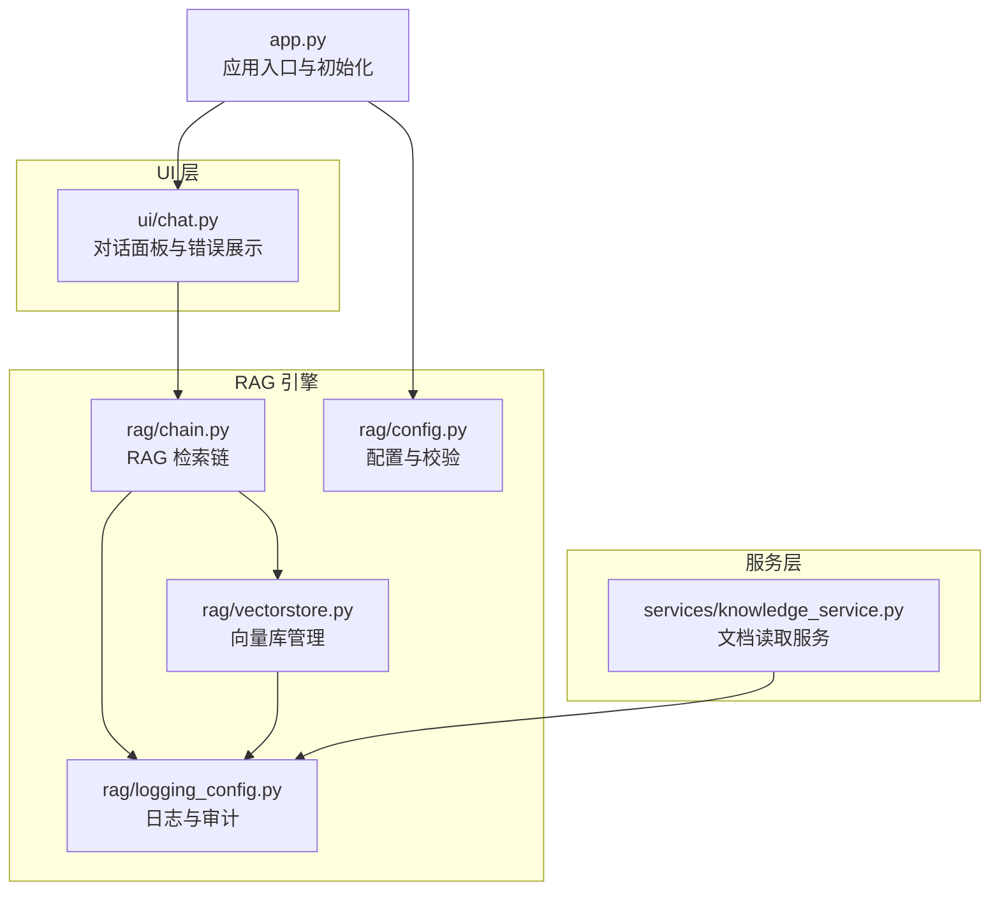
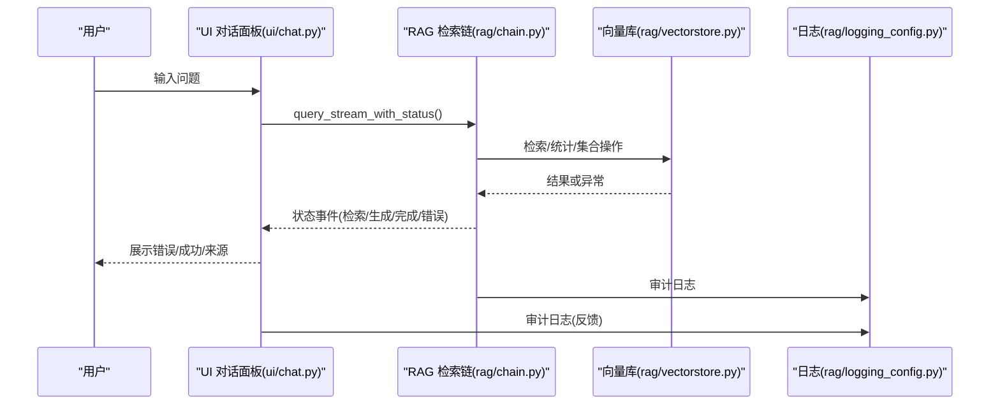
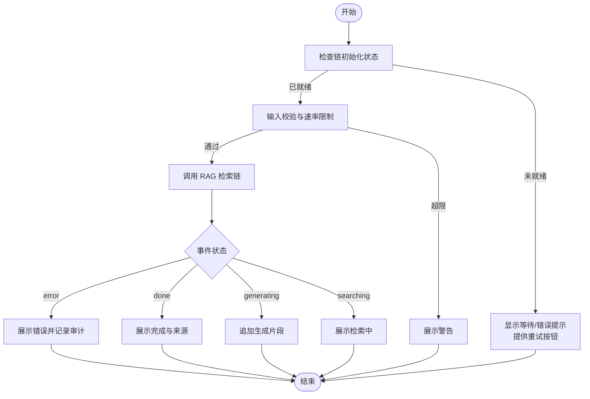
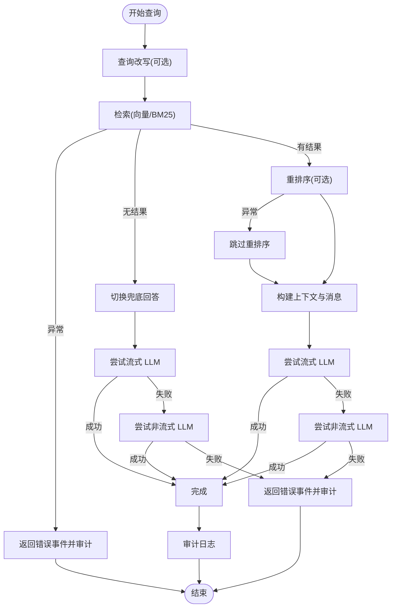
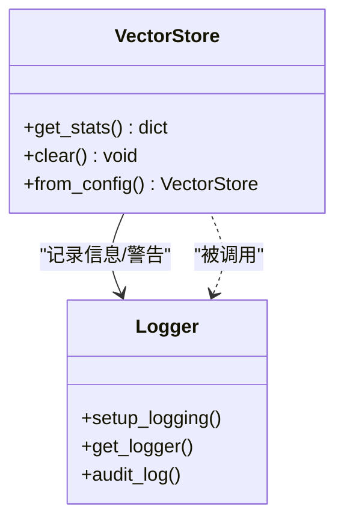
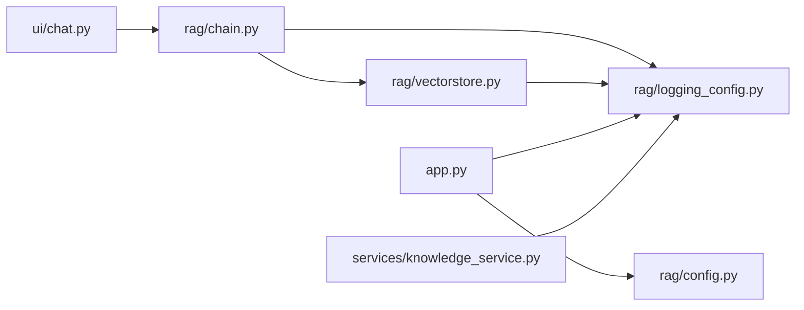

# 错误传播机制

<cite>
**本文引用的文件**
- [app.py](file://app.py)
- [ui/chat.py](file://ui/chat.py)
- [rag/chain.py](file://rag/chain.py)
- [rag/vectorstore.py](file://rag/vectorstore.py)
- [rag/logging_config.py](file://rag/logging_config.py)
- [rag/config.py](file://rag/config.py)
- [services/knowledge_service.py](file://services/knowledge_service.py)
</cite>

## 目录
1. [简介](#简介)
2. [项目结构](#项目结构)
3. [核心组件](#核心组件)
4. [架构总览](#架构总览)
5. [详细组件分析](#详细组件分析)
6. [依赖分析](#依赖分析)
7. [性能考虑](#性能考虑)
8. [故障排查指南](#故障排查指南)
9. [结论](#结论)

## 简介
本文件系统化阐述知识管理系统的错误传播机制，覆盖异常处理策略、错误信息传递、用户友好的错误展示；解释组件间的错误冒泡、降级处理与恢复机制；提供错误传播路径图与处理流程图；涵盖日志记录、错误分类与故障隔离策略。目标是帮助开发者与运维人员快速定位问题、理解错误如何在系统内传播与收敛，并掌握可操作的排障方法。

## 项目结构
系统采用“UI 层（Streamlit）—服务层（services）—RAG 引擎（rag）”三层架构：
- UI 层负责用户交互与错误展示，捕获底层异常并转化为用户可见的提示。
- 服务层封装业务逻辑（如文档读取），提供幂等与降级能力。
- RAG 引擎负责检索、重排序与 LLM 调用，内置多级降级与审计日志。

图表来源
- [app.py:54-90](file://app.py#L54-L90)
- [ui/chat.py:19-73](file://ui/chat.py#L19-L73)
- [rag/chain.py:174-651](file://rag/chain.py#L174-L651)
- [rag/vectorstore.py:24-209](file://rag/vectorstore.py#L24-L209)
- [rag/logging_config.py:46-83](file://rag/logging_config.py#L46-L83)
- [rag/config.py:103-144](file://rag/config.py#L103-L144)

章节来源
- [app.py:54-90](file://app.py#L54-L90)
- [ui/chat.py:19-73](file://ui/chat.py#L19-L73)
- [rag/chain.py:174-651](file://rag/chain.py#L174-L651)
- [rag/vectorstore.py:24-209](file://rag/vectorstore.py#L24-L209)
- [rag/logging_config.py:46-83](file://rag/logging_config.py#L46-L83)
- [rag/config.py:103-144](file://rag/config.py#L103-L144)

## 核心组件
- 应用入口与初始化：负责日志初始化、会话状态与预加载链路启动。
- 对话面板：负责用户输入、速率限制、错误展示与审计日志。
- RAG 检索链：负责检索、重排序、LLM 调用与多级降级（流式→非流式→兜底）。
- 向量库管理：负责集合获取、增删改查与统计信息。
- 日志与审计：统一输出到控制台与文件，支持审计日志 JSONL 写入。
- 配置管理：提供全局单例配置与环境变量替换，含校验逻辑。
- 文档读取服务：提供文档内容读取，异常时返回 None 并记录警告。

章节来源
- [app.py:72-73](file://app.py#L72-L73)
- [ui/chat.py:96-190](file://ui/chat.py#L96-L190)
- [rag/chain.py:174-651](file://rag/chain.py#L174-L651)
- [rag/vectorstore.py:24-209](file://rag/vectorstore.py#L24-L209)
- [rag/logging_config.py:46-129](file://rag/logging_config.py#L46-L129)
- [rag/config.py:103-185](file://rag/config.py#L103-L185)
- [services/knowledge_service.py:16-46](file://services/knowledge_service.py#L16-L46)

## 架构总览
错误传播遵循“就近处理、向上冒泡、降级兜底”的原则：
- UI 层捕获底层异常，转化为用户可见的错误提示与重试引导。
- RAG 引擎在检索、重排序、LLM 调用各阶段均有降级与审计日志。
- 向量库与日志模块提供基础的容错与可观测性。
- 配置模块通过校验与环境变量替换，减少因配置错误导致的传播。

图表来源
- [ui/chat.py:150-184](file://ui/chat.py#L150-L184)
- [rag/chain.py:437-568](file://rag/chain.py#L437-L568)
- [rag/vectorstore.py:149-169](file://rag/vectorstore.py#L149-L169)
- [rag/logging_config.py:86-129](file://rag/logging_config.py#L86-L129)

## 详细组件分析

### UI 层错误传播与用户展示
- 初始化失败：若预加载未完成或失败，UI 显示错误并提供重试按钮，避免继续执行。
- 输入校验：长度超限直接提示；速率限制触发时给出告警。
- 查询执行：通过事件驱动的状态机接收“检索/生成/完成/错误”，分别展示不同 UI 状态；错误时以 info/error 区分提示。
- 审计日志：对用户反馈（点赞/点踩）进行审计记录。

图表来源
- [ui/chat.py:19-73](file://ui/chat.py#L19-L73)
- [ui/chat.py:96-190](file://ui/chat.py#L96-L190)

章节来源
- [ui/chat.py:19-73](file://ui/chat.py#L19-L73)
- [ui/chat.py:96-190](file://ui/chat.py#L96-L190)

### RAG 引擎错误传播与降级处理
- 检索阶段：异常时构造错误消息并上报审计日志，立即返回错误事件，不继续生成。
- 兜底回答：当检索无结果时，切换到兜底 prompt，先尝试流式，再尝试非流式，最后返回错误事件。
- LLM 调用：流式失败→非流式；两次均失败→返回错误事件；空内容→返回错误事件。
- 重排序：异常时记录调试日志并跳过，保证主流程继续。
- 审计日志：记录查询耗时、检索条数、答案摘要等，便于故障定位与合规审计。

图表来源
- [rag/chain.py:437-568](file://rag/chain.py#L437-L568)
- [rag/chain.py:570-644](file://rag/chain.py#L570-L644)

章节来源
- [rag/chain.py:437-568](file://rag/chain.py#L437-L568)
- [rag/chain.py:570-644](file://rag/chain.py#L570-L644)

### 向量库与日志的故障隔离与可观测性
- 向量库统计：在获取统计信息时对异常进行捕获并降级为 0，避免影响整体 UI。
- 审计日志：按日期切分文件，支持禁用开关；记录查询、登录、登出、反馈等关键动作。
- 日志格式：控制台彩色高亮，文件完整时间戳，便于快速定位。

图表来源
- [rag/vectorstore.py:149-169](file://rag/vectorstore.py#L149-L169)
- [rag/logging_config.py:46-129](file://rag/logging_config.py#L46-L129)

章节来源
- [rag/vectorstore.py:149-169](file://rag/vectorstore.py#L149-L169)
- [rag/logging_config.py:46-129](file://rag/logging_config.py#L46-L129)

### 文档读取服务的错误处理
- 文件存在性检查：不存在直接返回 None。
- PDF 解析：失败时记录警告并回退到文本读取。
- 文本读取：异常时记录警告并返回 None，保持上层调用的幂等性。

章节来源
- [services/knowledge_service.py:16-46](file://services/knowledge_service.py#L16-L46)

## 依赖分析
- UI 依赖 RAG 检索链与预加载状态；RAG 依赖向量库与日志；向量库依赖配置与嵌入函数；日志依赖配置开关。
- 组件间耦合度低，错误在各自边界被捕获与降级，避免跨层复杂传播。

图表来源
- [ui/chat.py:150-184](file://ui/chat.py#L150-L184)
- [rag/chain.py:646-651](file://rag/chain.py#L646-L651)
- [rag/vectorstore.py:182-209](file://rag/vectorstore.py#L182-L209)
- [rag/logging_config.py:78-83](file://rag/logging_config.py#L78-L83)
- [app.py:72-73](file://app.py#L72-L73)
- [rag/config.py:139-144](file://rag/config.py#L139-L144)
- [services/knowledge_service.py:9](file://services/knowledge_service.py#L9)

章节来源
- [ui/chat.py:150-184](file://ui/chat.py#L150-L184)
- [rag/chain.py:646-651](file://rag/chain.py#L646-L651)
- [rag/vectorstore.py:182-209](file://rag/vectorstore.py#L182-L209)
- [rag/logging_config.py:78-83](file://rag/logging_config.py#L78-L83)
- [app.py:72-73](file://app.py#L72-L73)
- [rag/config.py:139-144](file://rag/config.py#L139-L144)
- [services/knowledge_service.py:9](file://services/knowledge_service.py#L9)

## 性能考虑
- 重试策略：LLM 调用采用指数退避重试，降低瞬时拥塞风险。
- 缓存与复用：BM25 索引按文档计数缓存，避免重复构建；Reranker 模型类级缓存。
- 上下文预算：基于字符与 token 估算，防止超出模型上下文窗口。
- IO 降级：向量库统计异常时快速降级为 0，不影响前端渲染。

## 故障排查指南
- 审计日志定位：启用审计日志后，可在审计目录按日期查看 JSONL 记录，结合查询、耗时、结果数定位问题。
- 日志级别：控制台彩色高亮便于快速识别 WARNING/ERROR；文件日志包含完整时间戳与模块名。
- 常见场景：
  - 检索失败：查看检索阶段错误事件与审计详情，确认向量库是否正常、集合是否存在。
  - LLM 调用失败：检查流式与非流式调用的错误差异，关注重试日志与最终错误消息。
  - 兜底回答：无检索结果时走兜底流程，若仍失败，检查 LLM 配置与网络连通性。
  - 配置错误：通过配置校验与环境变量替换，确认关键字段（API 地址、密钥、模型名）正确。

章节来源
- [rag/logging_config.py:86-129](file://rag/logging_config.py#L86-L129)
- [rag/chain.py:470-556](file://rag/chain.py#L470-L556)
- [rag/config.py:118-131](file://rag/config.py#L118-L131)

## 结论
本系统通过“就近处理、向上冒泡、降级兜底”的策略实现稳健的错误传播：UI 层负责用户可见的错误展示与重试；RAG 引擎在检索、重排序、LLM 调用各阶段具备多级降级与审计日志；向量库与日志模块提供基础的容错与可观测性；配置模块通过校验与环境变量替换减少配置错误引发的传播。建议在生产环境中开启审计日志与文件日志，配合合理的重试与降级策略，持续提升系统的稳定性与可维护性。