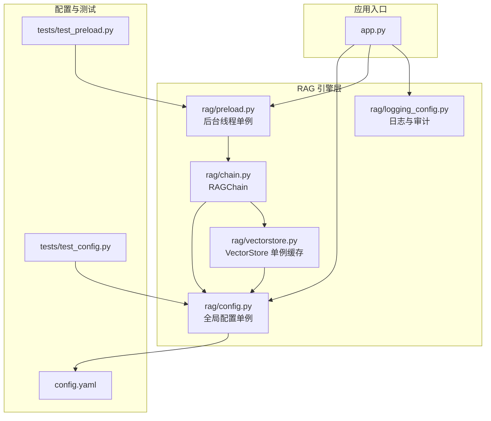
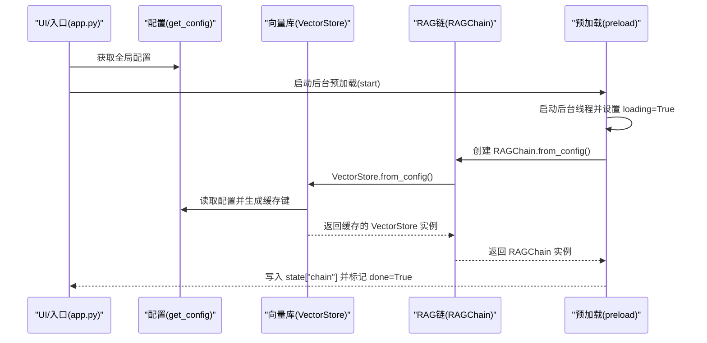
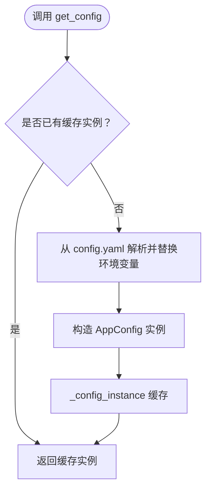
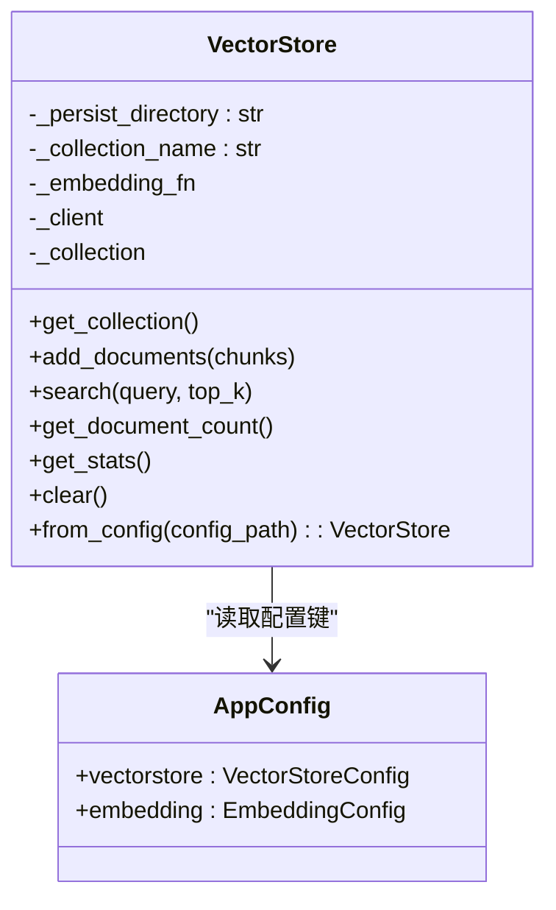
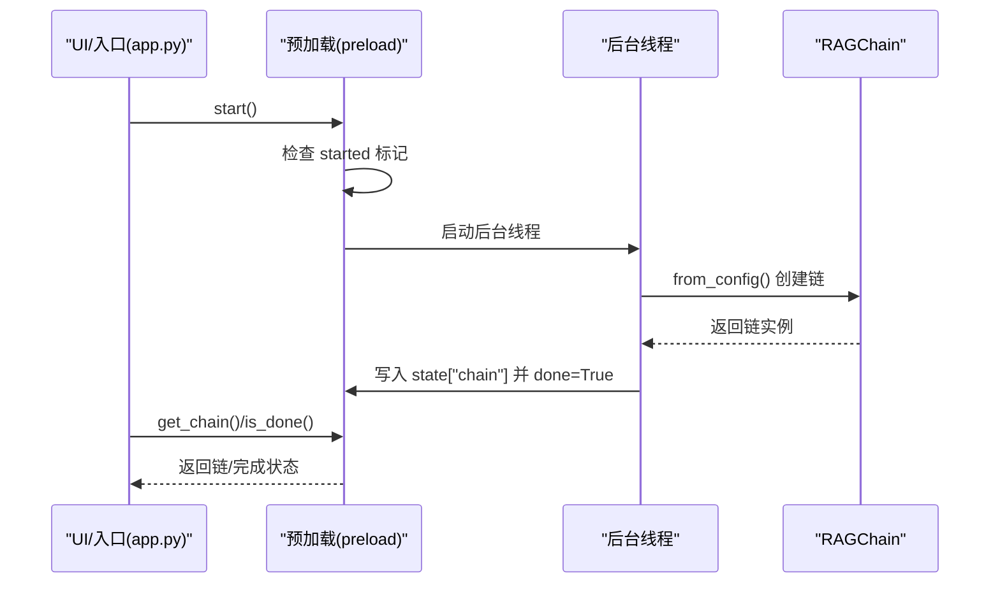
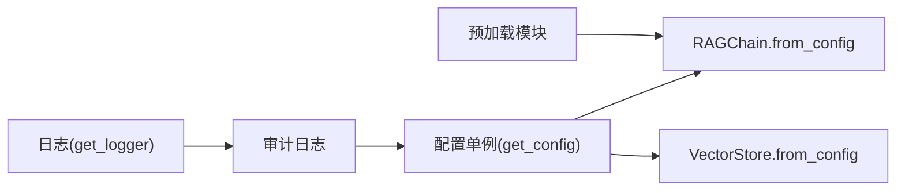

# 单例模式应用

<cite>
**本文引用的文件**
- [rag/config.py](file://rag/config.py)
- [rag/preload.py](file://rag/preload.py)
- [app.py](file://app.py)
- [rag/chain.py](file://rag/chain.py)
- [rag/vectorstore.py](file://rag/vectorstore.py)
- [rag/logging_config.py](file://rag/logging_config.py)
- [config.yaml](file://config.yaml)
- [tests/test_config.py](file://tests/test_config.py)
- [tests/test_preload.py](file://tests/test_preload.py)
</cite>

## 目录
1. [简介](#简介)
2. [项目结构](#项目结构)
3. [核心组件](#核心组件)
4. [架构总览](#架构总览)
5. [详细组件分析](#详细组件分析)
6. [依赖分析](#依赖分析)
7. [性能考虑](#性能考虑)
8. [故障排查指南](#故障排查指南)
9. [结论](#结论)
10. [附录](#附录)

## 简介
本文件聚焦知识管理系统中“单例模式”的落地实践，围绕两个关键场景展开：
- 配置管理模块中的全局配置单例（通过 get_config 函数实现），确保配置一致性与线程安全；
- 预加载模块中的后台线程单例（通过模块级可变状态共享），保障 Streamlit 多次 rerun 场景下状态不丢失。

同时，文档解释单例如何贯穿 RAG 引擎初始化与向量库管理，覆盖单例创建时机、生命周期管理与内存优化策略，并提供可追溯的代码片段路径与可视化图示。

## 项目结构
本项目采用“界面层(ui/) + 业务层(services/) + 检索引擎(rag/)”的分层组织。与单例相关的代码主要集中在 rag 子包内：
- 配置管理：rag/config.py
- 预加载：rag/preload.py
- RAG 引擎：rag/chain.py
- 向量库：rag/vectorstore.py
- 日志与审计：rag/logging_config.py
- 应用入口：app.py
- 配置文件：config.yaml
- 单元测试：tests/test_config.py、tests/test_preload.py

图表来源
- [app.py:15-33](file://app.py#L15-L33)
- [rag/config.py:139-151](file://rag/config.py#L139-L151)
- [rag/preload.py:22-48](file://rag/preload.py#L22-L48)
- [rag/chain.py:604-609](file://rag/chain.py#L604-L609)
- [rag/vectorstore.py:181-200](file://rag/vectorstore.py#L181-L200)
- [rag/logging_config.py:78-83](file://rag/logging_config.py#L78-L83)

章节来源
- [app.py:15-33](file://app.py#L15-L33)
- [rag/config.py:139-151](file://rag/config.py#L139-L151)
- [rag/preload.py:22-48](file://rag/preload.py#L22-L48)
- [rag/chain.py:604-609](file://rag/chain.py#L604-L609)
- [rag/vectorstore.py:181-200](file://rag/vectorstore.py#L181-L200)
- [rag/logging_config.py:78-83](file://rag/logging_config.py#L78-L83)

## 核心组件
- 全局配置单例：通过 get_config(config_path) 实现，内部维护 _config_instance，首次调用时从 config.yaml 解析并缓存；reload_config 可强制刷新。
- 向量库单例缓存：VectorStore.from_config 以配置键为缓存键，避免重复创建与重复加载 embedding 模型。
- 后台线程单例：模块级 state 字典作为全局状态容器，配合 start 幂等启动与后台线程，确保多次 rerun 不丢失状态。
- 日志与审计：get_logger 提供统一日志入口，审计日志在启用时写入独立文件，审计日志中同样通过 get_config 访问全局配置。

章节来源
- [rag/config.py:139-151](file://rag/config.py#L139-L151)
- [rag/vectorstore.py:181-200](file://rag/vectorstore.py#L181-L200)
- [rag/preload.py:22-48](file://rag/preload.py#L22-L48)
- [rag/logging_config.py:78-83](file://rag/logging_config.py#L78-L83)

## 架构总览
下图展示了单例在系统中的交互关系：应用入口通过 get_config 获取全局配置；RAGChain 初始化时读取配置并创建 VectorStore；VectorStore.from_config 使用配置键缓存实例；预加载模块在后台线程中加载 RAGChain 并写入模块级状态，供后续会话复用。

图表来源
- [app.py:15-33](file://app.py#L15-L33)
- [rag/preload.py:22-48](file://rag/preload.py#L22-L48)
- [rag/chain.py:604-609](file://rag/chain.py#L604-L609)
- [rag/vectorstore.py:181-200](file://rag/vectorstore.py#L181-L200)
- [rag/config.py:139-151](file://rag/config.py#L139-L151)

## 详细组件分析

### 全局配置单例（get_config）
- 设计要点
  - 使用全局变量 _config_instance 缓存 AppConfig 实例，首次访问时从 config.yaml 加载并解析环境变量，随后直接返回缓存。
  - 提供 reload_config 强制刷新，适用于运行时动态切换配置。
  - load_config 用于兼容旧接口，返回字典形式的配置。
- 线程安全
  - 由于 Python GIL 与模块级全局变量的原子性，单次赋值是安全的；但并发首次创建时仍建议在应用启动阶段串行化初始化。
- 生命周期
  - 随模块加载而存在，进程生命周期内常驻；可通过 reload_config 触发重建。
- 内存优化
  - Pydantic 模型占用相对固定，缓存避免重复解析与校验开销。

图表来源
- [rag/config.py:139-151](file://rag/config.py#L139-L151)
- [rag/config.py:119-131](file://rag/config.py#L119-L131)

章节来源
- [rag/config.py:139-151](file://rag/config.py#L139-L151)
- [rag/config.py:119-131](file://rag/config.py#L119-L131)
- [config.yaml:1-49](file://config.yaml#L1-L49)

### 向量库单例缓存（VectorStore.from_config）
- 设计要点
  - 以“持久化目录|集合名|Embedding 模型名|本地路径”拼接为配置键，若缓存命中则直接返回实例，避免重复创建与重复加载 embedding 模型。
  - 延迟初始化客户端与集合，按需创建。
- 线程安全
  - 全局缓存变量在模块级作用域，读写需注意并发访问；建议在应用启动阶段完成首次初始化。
- 生命周期
  - 进程常驻，缓存键变化时重建实例。
- 内存优化
  - 避免重复加载 embedding 模型，显著降低冷启动时间与内存占用。

图表来源
- [rag/vectorstore.py:24-200](file://rag/vectorstore.py#L24-L200)
- [rag/config.py:103-117](file://rag/config.py#L103-L117)

章节来源
- [rag/vectorstore.py:181-200](file://rag/vectorstore.py#L181-L200)
- [rag/vectorstore.py:40-55](file://rag/vectorstore.py#L40-L55)
- [rag/config.py:103-117](file://rag/config.py#L103-L117)

### 后台线程单例（预加载模块）
- 设计要点
  - 模块级 state 字典保存 chain、error、done、started、loading 等状态；start 幂等启动后台线程，仅首次启动。
  - _load 在后台线程中创建 RAGChain，完成后写回状态并清理 loading 标记。
  - 由于 Python 模块只导入一次，多次 rerun 不会重置模块状态，保证状态持久可见。
- 线程安全
  - state 为可变字典，写入操作在后台线程内串行进行；主线程读取时应避免并发修改。
- 生命周期
  - 随模块加载存在；reset 可重置状态以便重新加载。
- 内存优化
  - 预热 RAGChain 与 embedding 模型，减少首次查询延迟。

图表来源
- [app.py:32-40](file://app.py#L32-L40)
- [rag/preload.py:22-48](file://rag/preload.py#L22-L48)
- [rag/chain.py:604-609](file://rag/chain.py#L604-L609)

章节来源
- [rag/preload.py:22-48](file://rag/preload.py#L22-L48)
- [rag/preload.py:12-19](file://rag/preload.py#L12-L19)
- [app.py:32-40](file://app.py#L32-L40)

### 日志与审计中的单例访问
- get_logger 为模块级单例，首次调用时初始化控制台与文件处理器，后续直接返回同一 Logger 实例。
- 审计日志在启用时写入独立 JSONL 文件，审计过程中通过 get_config 读取审计开关与主题配置。

章节来源
- [rag/logging_config.py:78-83](file://rag/logging_config.py#L78-L83)
- [rag/logging_config.py:86-129](file://rag/logging_config.py#L86-L129)

## 依赖分析
- 配置单例依赖 config.yaml 与 Pydantic 校验，提供强类型配置对象。
- RAGChain 初始化依赖 VectorStore 单例缓存，避免重复加载 embedding 模型。
- 预加载模块依赖 RAGChain.from_config，后台线程写入模块级状态，供 UI 会话复用。
- 日志模块为全局单例，审计日志依赖配置单例以决定是否启用。

图表来源
- [rag/config.py:139-151](file://rag/config.py#L139-L151)
- [rag/chain.py:604-609](file://rag/chain.py#L604-L609)
- [rag/vectorstore.py:181-200](file://rag/vectorstore.py#L181-L200)
- [rag/preload.py:22-48](file://rag/preload.py#L22-L48)
- [rag/logging_config.py:78-83](file://rag/logging_config.py#L78-L83)
- [rag/logging_config.py:86-129](file://rag/logging_config.py#L86-L129)

章节来源
- [rag/config.py:139-151](file://rag/config.py#L139-L151)
- [rag/chain.py:604-609](file://rag/chain.py#L604-L609)
- [rag/vectorstore.py:181-200](file://rag/vectorstore.py#L181-L200)
- [rag/preload.py:22-48](file://rag/preload.py#L22-L48)
- [rag/logging_config.py:78-83](file://rag/logging_config.py#L78-L83)
- [rag/logging_config.py:86-129](file://rag/logging_config.py#L86-L129)

## 性能考虑
- 配置单例
  - 首次加载涉及 YAML 解析与环境变量替换，建议在应用启动阶段尽早调用 get_config，避免在热路径重复 IO。
  - reload_config 会重建实例，应谨慎使用，避免频繁触发。
- 向量库单例
  - 通过配置键缓存避免重复创建与模型加载，显著降低冷启动成本；在配置变更时由缓存键变化触发重建。
- 预加载
  - 后台线程一次性加载 RAGChain 与 embedding 模型，后续会话直接复用，极大改善首查询延迟。
  - 幂等启动避免重复线程创建，state 标记确保 UI 可感知加载状态。
- 日志
  - get_logger 为惰性初始化，避免不必要的处理器注册；审计日志按天切分文件，便于维护。

## 故障排查指南
- 配置相关
  - 确认 config.yaml 存在且可读；检查环境变量替换语法 ${VAR} 或 ${VAR:-默认值} 是否正确。
  - 若出现配置不生效，尝试调用 reload_config 强制刷新。
- 预加载相关
  - 若多次 rerun 后状态丢失，确认是否重复 import 模块导致状态被重置；实际运行中模块只导入一次，状态应持久。
  - 如需重新加载，调用 reset 清理状态后再启动。
- 审计日志
  - 若未产生审计文件，检查配置项 audit_enabled 是否开启。

章节来源
- [tests/test_config.py:98-117](file://tests/test_config.py#L98-L117)
- [tests/test_preload.py:10-31](file://tests/test_preload.py#L10-L31)
- [rag/logging_config.py:86-129](file://rag/logging_config.py#L86-L129)

## 结论
本项目通过“全局配置单例 + 向量库单例缓存 + 后台线程单例”的组合，实现了配置一致性、线程安全与性能优化的平衡：
- 配置单例确保全局一致与强类型校验；
- 向量库单例缓存避免重复加载，提升冷启动性能；
- 预加载单例在后台完成重型初始化，显著改善用户体验；
- 日志与审计模块通过单例访问全局配置，保障可观测性。

这些设计共同构成了知识管理系统的稳定基石，适合在生产环境中持续演进与扩展。

## 附录
- 代码片段路径参考
  - [全局配置单例 get_config:139-151](file://rag/config.py#L139-L151)
  - [向量库单例缓存 from_config:181-200](file://rag/vectorstore.py#L181-L200)
  - [后台线程单例 start/_load:22-48](file://rag/preload.py#L22-L48)
  - [RAGChain 初始化 from_config:604-609](file://rag/chain.py#L604-609)
  - [应用入口初始化与预加载:23-40](file://app.py#L23-L40)
  - [配置文件 config.yaml:1-49](file://config.yaml#L1-L49)
  - [配置测试:1-117](file://tests/test_config.py#L1-L117)
  - [预加载测试:1-36](file://tests/test_preload.py#L1-L36)