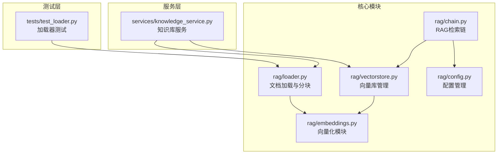
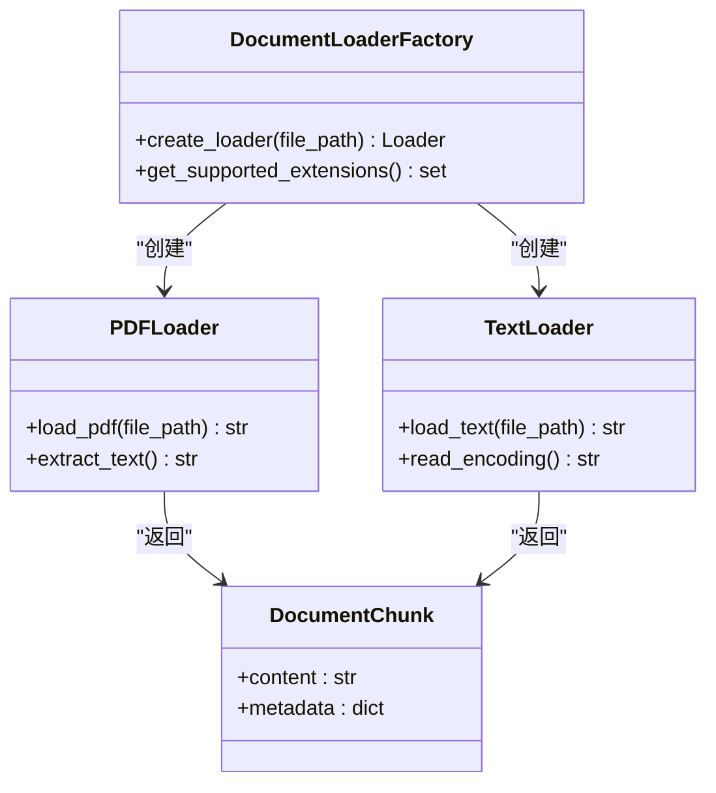
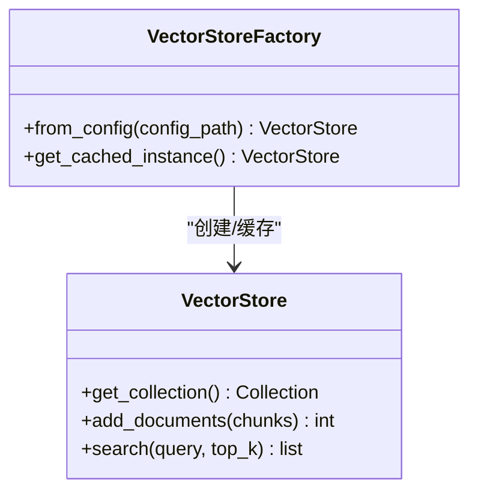
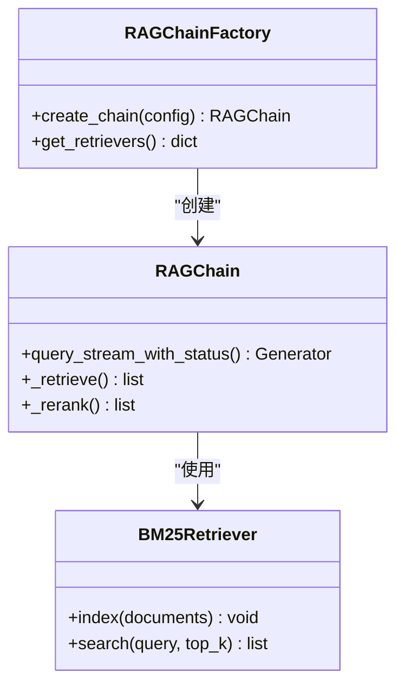
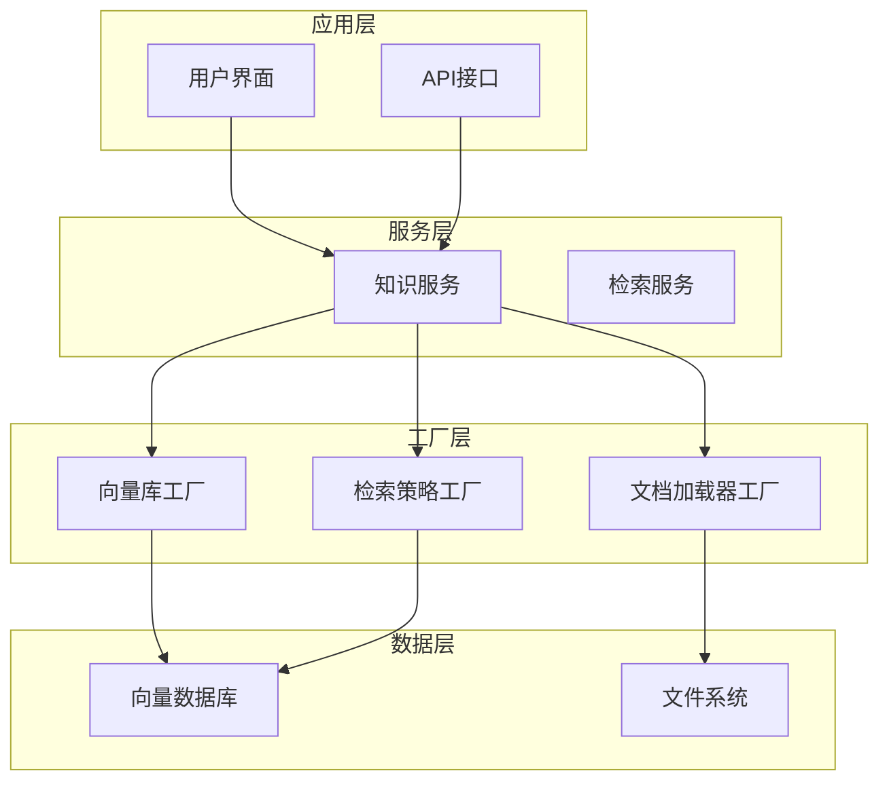
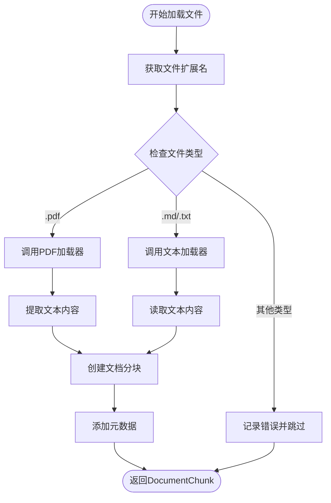
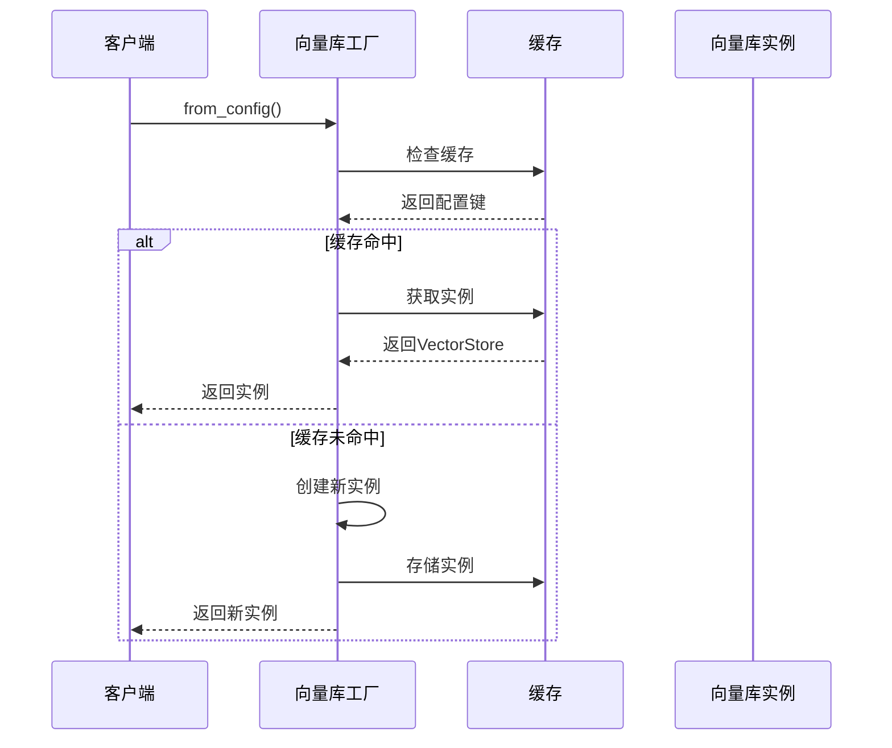
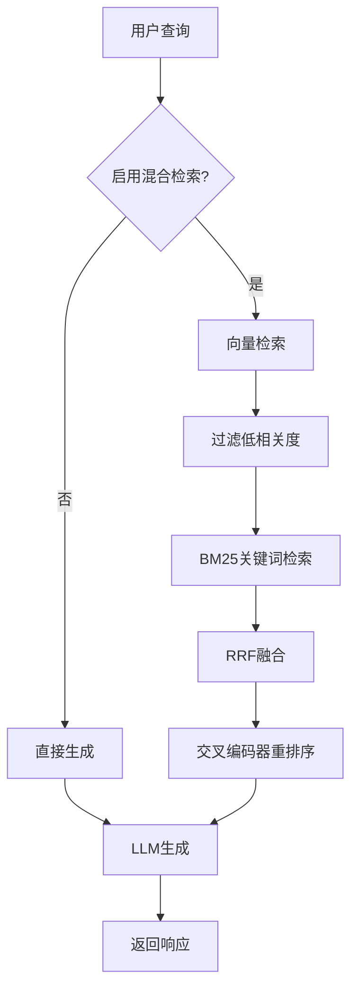
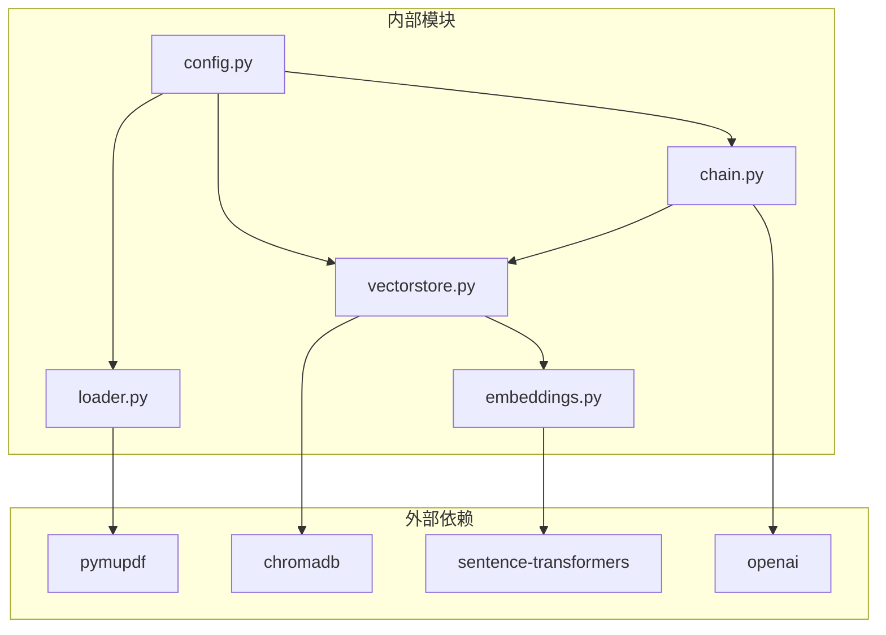
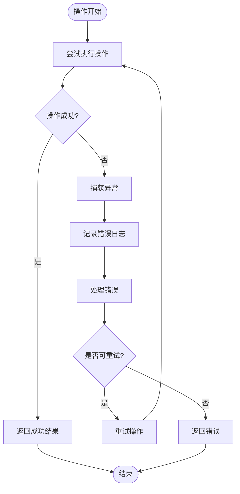

# 工厂模式应用

<cite>
**本文档引用的文件**
- [rag/loader.py](file://rag/loader.py)
- [rag/vectorstore.py](file://rag/vectorstore.py)
- [rag/chain.py](file://rag/chain.py)
- [rag/embeddings.py](file://rag/embeddings.py)
- [rag/config.py](file://rag/config.py)
- [services/knowledge_service.py](file://services/knowledge_service.py)
- [tests/test_loader.py](file://tests/test_loader.py)
</cite>

## 目录
1. [简介](#简介)
2. [项目结构](#项目结构)
3. [核心组件](#核心组件)
4. [架构概览](#架构概览)
5. [详细组件分析](#详细组件分析)
6. [依赖分析](#依赖分析)
7. [性能考虑](#性能考虑)
8. [故障排除指南](#故障排除指南)
9. [结论](#结论)

## 简介

本文件深入分析知识管理系统中工厂模式的应用实践。虽然项目中没有显式的"DocumentLoaderFactory"类，但通过条件判断和策略模式实现了类似的工厂模式功能。本文档详细说明了文档加载器如何根据文件类型动态创建相应的加载器实例，以及工厂模式在知识服务中的应用。

工厂模式在本系统中的主要应用场景包括：
- 文档加载器工厂：根据文件类型动态创建相应的加载器实例
- 向量库工厂：提供全局单例缓存机制
- 检索策略工厂：支持多种检索策略的统一管理

## 项目结构

知识管理系统采用模块化设计，核心功能分布在以下模块中：

**图表来源**
- [rag/loader.py:1-259](file://rag/loader.py#L1-L259)
- [rag/vectorstore.py:1-209](file://rag/vectorstore.py#L1-L209)
- [rag/chain.py:1-651](file://rag/chain.py#L1-L651)

**章节来源**
- [rag/loader.py:1-259](file://rag/loader.py#L1-L259)
- [rag/vectorstore.py:1-209](file://rag/vectorstore.py#L1-L209)
- [rag/chain.py:1-651](file://rag/chain.py#L1-L651)

## 核心组件

### 文档加载器工厂

系统通过条件判断实现了文档加载器工厂的核心功能：

**图表来源**
- [rag/loader.py:121-129](file://rag/loader.py#L121-L129)
- [rag/loader.py:22-27](file://rag/loader.py#L22-L27)

### 向量库工厂

向量库管理器实现了全局单例缓存机制：

**图表来源**
- [rag/vectorstore.py:181-209](file://rag/vectorstore.py#L181-L209)

### 检索策略工厂

RAG链实现了多种检索策略的统一管理：

**图表来源**
- [rag/chain.py:174-205](file://rag/chain.py#L174-L205)
- [rag/chain.py:53-134](file://rag/chain.py#L53-L134)

**章节来源**
- [rag/loader.py:121-129](file://rag/loader.py#L121-L129)
- [rag/vectorstore.py:181-209](file://rag/vectorstore.py#L181-L209)
- [rag/chain.py:174-205](file://rag/chain.py#L174-L205)

## 架构概览

系统采用分层架构设计，工厂模式贯穿整个应用：

**图表来源**
- [services/knowledge_service.py:16-45](file://services/knowledge_service.py#L16-L45)
- [rag/vectorstore.py:181-209](file://rag/vectorstore.py#L181-L209)
- [rag/chain.py:174-205](file://rag/chain.py#L174-L205)

## 详细组件分析

### 文档加载器工厂实现

#### 文件类型检测机制

系统通过扩展名检测实现文件类型识别：

**图表来源**
- [rag/loader.py:121-129](file://rag/loader.py#L121-L129)
- [rag/loader.py:167-171](file://rag/loader.py#L167-L171)

#### 加载器选择策略

系统实现了灵活的加载器选择机制：

| 文件类型 | 加载器 | 特殊处理 |
|---------|--------|----------|
| PDF | `_load_pdf` | 使用pymupdf提取文本 |
| Markdown | `Path.read_text` | UTF-8编码读取 |
| Text | `Path.read_text` | UTF-8编码读取 |

**章节来源**
- [rag/loader.py:101-129](file://rag/loader.py#L101-L129)
- [rag/loader.py:131-197](file://rag/loader.py#L131-L197)

### 向量库工厂实现

#### 全局单例缓存机制

向量库工厂实现了高效的缓存策略：

**图表来源**
- [rag/vectorstore.py:181-209](file://rag/vectorstore.py#L181-L209)

#### 性能优化策略

- 延迟初始化：客户端和服务集合按需创建
- 模型缓存：embedding模型只加载一次
- 增量更新：支持文档的增量更新和删除

**章节来源**
- [rag/vectorstore.py:19-22](file://rag/vectorstore.py#L19-L22)
- [rag/vectorstore.py:40-59](file://rag/vectorstore.py#L40-L59)

### 检索策略工厂实现

#### 混合检索策略

系统实现了多种检索策略的组合：

**图表来源**
- [rag/chain.py:250-313](file://rag/chain.py#L250-L313)
- [rag/chain.py:143-171](file://rag/chain.py#L143-L171)

#### 检索策略优化

- **向量检索**：使用ChromaDB进行相似度搜索
- **BM25检索**：关键词匹配，提高精确度
- **RRF融合**：平衡不同检索策略的结果
- **交叉编码器重排序**：提升最终结果质量

**章节来源**
- [rag/chain.py:250-313](file://rag/chain.py#L250-L313)
- [rag/chain.py:143-171](file://rag/chain.py#L143-L171)

## 依赖分析

系统采用松耦合设计，各模块间依赖关系清晰：

**图表来源**
- [rag/loader.py:104-111](file://rag/loader.py#L104-L111)
- [rag/vectorstore.py:10](file://rag/vectorstore.py#L10)
- [rag/embeddings.py:34](file://rag/embeddings.py#L34)

**章节来源**
- [rag/loader.py:104-111](file://rag/loader.py#L104-L111)
- [rag/vectorstore.py:10](file://rag/vectorstore.py#L10)
- [rag/embeddings.py:34](file://rag/embeddings.py#L34)

## 性能考虑

### 工厂模式性能优势

1. **对象复用**：通过缓存机制避免重复创建昂贵的对象
2. **延迟加载**：按需创建资源，减少启动时间
3. **内存优化**：共享相同的embedding模型实例

### 检索性能优化

- **索引预构建**：BM25索引与向量库同步更新
- **结果缓存**：最近检索结果的临时缓存
- **批量处理**：向量化和入库操作的批量优化

### 错误处理策略

系统实现了多层次的错误处理机制：

**图表来源**
- [rag/loader.py:167-171](file://rag/loader.py#L167-L171)

**章节来源**
- [rag/loader.py:167-171](file://rag/loader.py#L167-L171)
- [rag/vectorstore.py:196-197](file://rag/vectorstore.py#L196-L197)

## 故障排除指南

### 常见问题及解决方案

#### PDF文件加载失败

**问题症状**：PDF文件无法读取，抛出ImportError异常

**解决方案**：
1. 确保安装pymupdf库
2. 检查PDF文件完整性
3. 验证文件权限

#### 向量库初始化失败

**问题症状**：ChromaDB客户端创建失败

**解决方案**：
1. 检查持久化目录权限
2. 验证磁盘空间充足
3. 确认Python环境兼容性

#### 检索结果为空

**问题症状**：查询返回空结果

**解决方案**：
1. 检查向量库是否包含文档
2. 验证embedding模型加载成功
3. 调整相似度阈值参数

**章节来源**
- [rag/loader.py:109-111](file://rag/loader.py#L109-L111)
- [rag/vectorstore.py:42-45](file://rag/vectorstore.py#L42-L45)

## 结论

知识管理系统中的工厂模式应用体现了现代软件设计的最佳实践。通过条件判断实现的工厂模式有效地解决了多文件格式支持的问题，同时通过全局单例缓存机制提升了系统性能。

### 主要成就

1. **灵活的文档加载**：支持PDF、Markdown、文本等多种格式
2. **高性能的向量检索**：通过缓存和延迟加载优化性能
3. **可扩展的检索策略**：支持多种检索算法的组合使用
4. **健壮的错误处理**：完善的异常处理和恢复机制

### 未来改进方向

1. **抽象工厂模式**：引入更标准的工厂接口定义
2. **插件化架构**：支持动态加载新的文档格式处理器
3. **分布式缓存**：支持多节点间的缓存同步
4. **监控指标**：增加详细的性能监控和分析

通过持续优化工厂模式的应用，系统能够更好地支持大规模知识管理需求，为用户提供高效、稳定的智能检索体验。