# 策略模式应用

<cite>
**本文档引用的文件**
- [rag/chain.py](file://rag/chain.py)
- [services/rate_limiter.py](file://services/rate_limiter.py)
- [rag/vectorstore.py](file://rag/vectorstore.py)
- [rag/embeddings.py](file://rag/embeddings.py)
- [rag/config.py](file://rag/config.py)
- [ui/chat.py](file://ui/chat.py)
- [app.py](file://app.py)
- [rag/preload.py](file://rag/preload.py)
- [tests/test_chain.py](file://tests/test_chain.py)
- [tests/test_rate_limiter.py](file://tests/test_rate_limiter.py)
</cite>

## 目录
1. [简介](#简介)
2. [项目结构](#项目结构)
3. [核心组件](#核心组件)
4. [架构概览](#架构概览)
5. [详细组件分析](#详细组件分析)
6. [依赖关系分析](#依赖关系分析)
7. [性能考虑](#性能考虑)
8. [故障排除指南](#故障排除指南)
9. [结论](#结论)

## 简介

本项目展示了策略模式在知识管理系统中的实际应用，特别是在RAG（检索增强生成）检索链和速率限制策略方面的创新设计。策略模式通过定义一系列可互换的算法接口，使得系统能够在运行时动态选择和切换不同的检索策略，实现了算法的可插拔性和灵活性。

项目中的策略模式主要体现在两个方面：
1. **RAG检索链中的多种检索策略**：向量检索、BM25关键词检索、混合检索策略
2. **速率限制策略的动态切换机制**：基于用户行为的智能限流

这种设计不仅提升了系统的可维护性，还为未来的算法扩展和性能优化提供了便利的基础设施。

## 项目结构

该项目采用清晰的分层架构，将界面层、业务逻辑层和数据处理层有效分离：

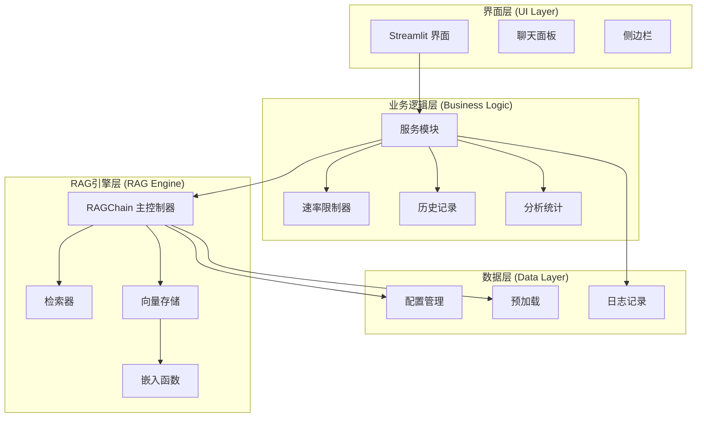

**图表来源**
- [app.py:1-189](file://app.py#L1-L189)
- [ui/chat.py:1-190](file://ui/chat.py#L1-L190)
- [rag/chain.py:174-651](file://rag/chain.py#L174-L651)

**章节来源**
- [app.py:1-189](file://app.py#L1-L189)
- [rag/chain.py:1-651](file://rag/chain.py#L1-L651)

## 核心组件

### RAGChain - 检索增强生成主控制器

RAGChain是整个系统的核心控制器，它实现了策略模式的统一接口，并协调各种检索策略的执行：

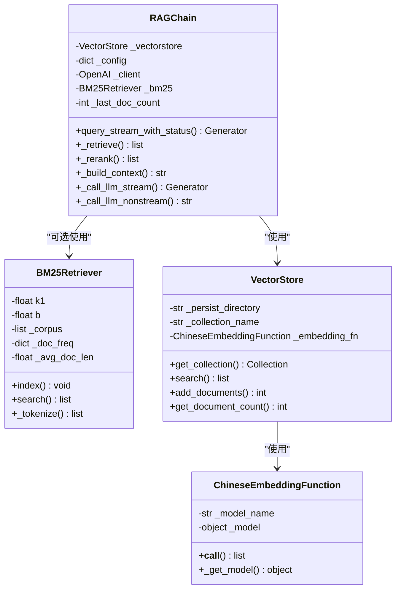

**图表来源**
- [rag/chain.py:174-651](file://rag/chain.py#L174-L651)
- [rag/vectorstore.py:24-209](file://rag/vectorstore.py#L24-L209)
- [rag/embeddings.py:19-48](file://rag/embeddings.py#L19-L48)

### 速率限制器 - 动态策略切换

速率限制器实现了基于用户行为的智能限流策略，支持动态配置和内存清理：

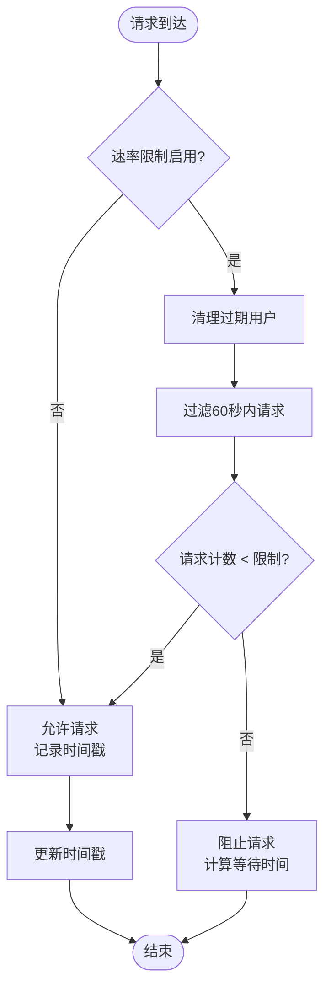

**图表来源**
- [services/rate_limiter.py:45-71](file://services/rate_limiter.py#L45-L71)

**章节来源**
- [rag/chain.py:174-651](file://rag/chain.py#L174-L651)
- [services/rate_limiter.py:1-71](file://services/rate_limiter.py#L1-L71)

## 架构概览

系统采用模块化的策略模式架构，通过统一的接口实现不同算法的可插拔性：

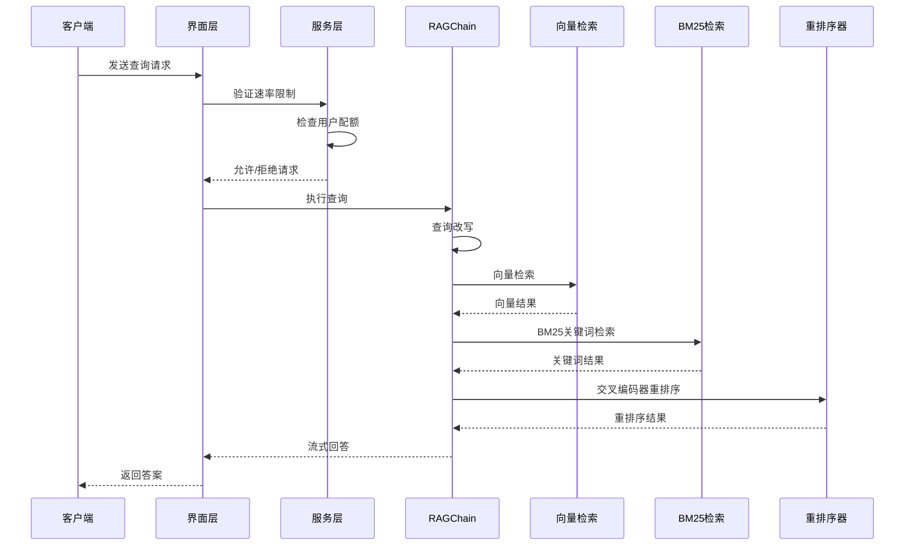

**图表来源**
- [ui/chat.py:96-190](file://ui/chat.py#L96-L190)
- [rag/chain.py:437-651](file://rag/chain.py#L437-L651)

## 详细组件分析

### 检索策略实现

#### 向量检索策略

向量检索策略利用预训练的中文嵌入模型，将查询和文档转换为高维向量空间中的向量表示，然后通过余弦相似度计算进行检索：

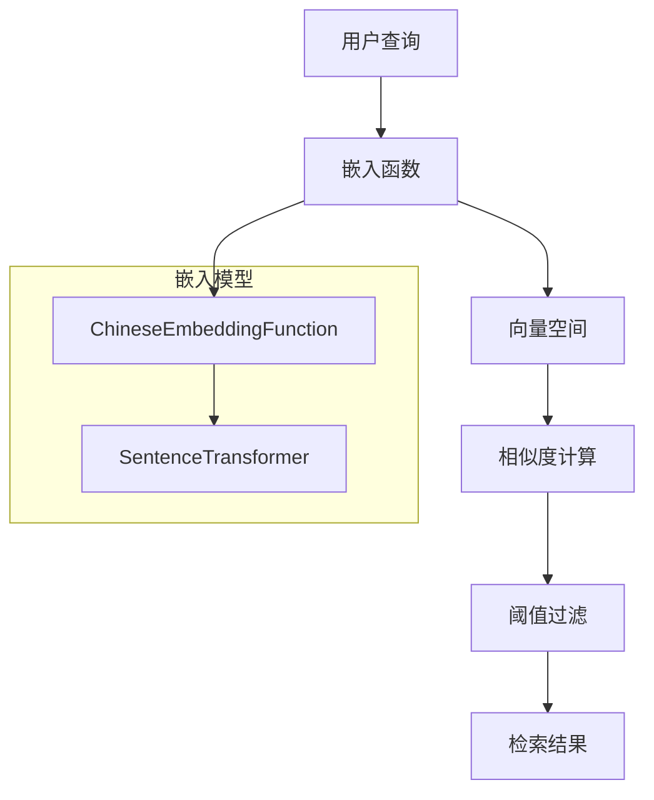

**图表来源**
- [rag/chain.py:265-284](file://rag/chain.py#L265-L284)
- [rag/embeddings.py:19-48](file://rag/embeddings.py#L19-L48)

#### BM25关键词检索策略

BM25检索策略基于经典的BM25算法，通过词频、逆文档频率和文档长度归一化来计算关键词匹配得分：

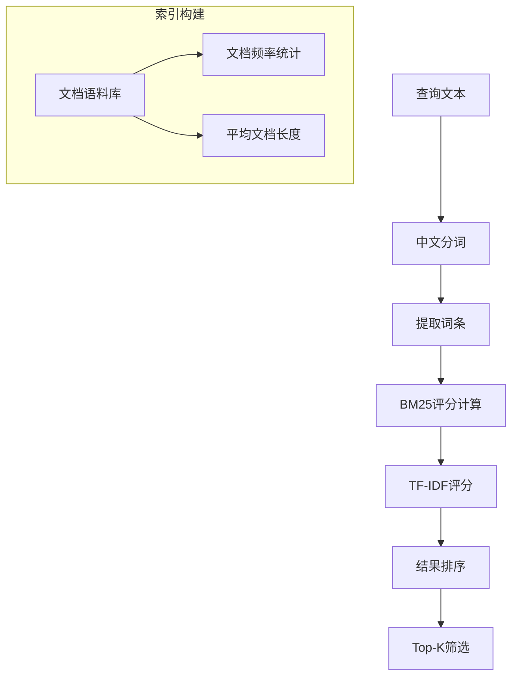

**图表来源**
- [rag/chain.py:53-134](file://rag/chain.py#L53-L134)

#### 混合检索策略

混合检索策略结合向量检索和BM25关键词检索的优势，通过RRF（Reciprocal Rank Fusion）算法进行结果融合：

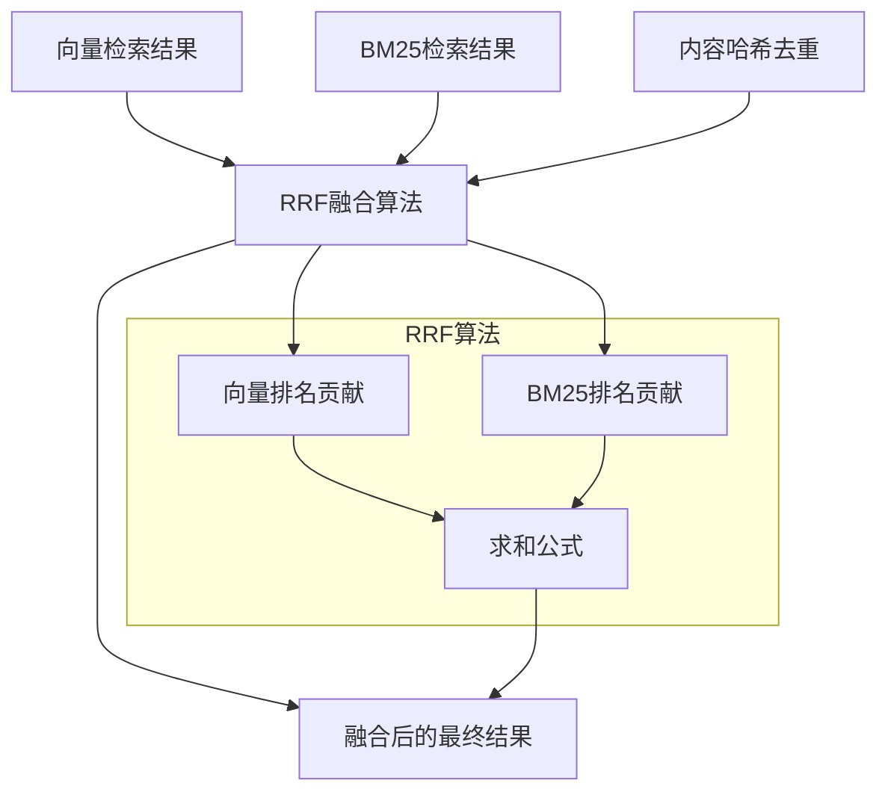

**图表来源**
- [rag/chain.py:143-172](file://rag/chain.py#L143-L172)

### 速率限制策略

#### 动态策略切换机制

系统实现了基于用户行为的智能速率限制策略，支持动态配置和实时调整：

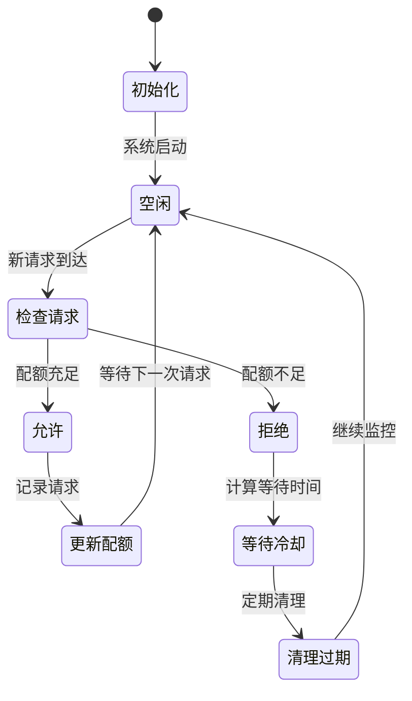

**图表来源**
- [services/rate_limiter.py:19-43](file://services/rate_limiter.py#L19-L43)

#### 内存管理策略

系统采用了智能的内存管理策略，防止长期运行导致的内存泄漏：

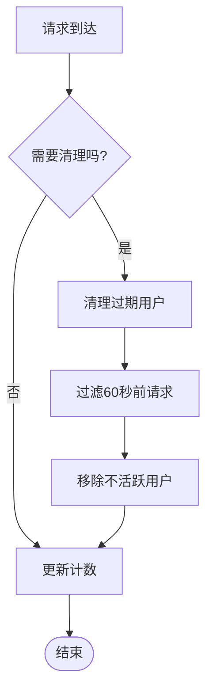

**图表来源**
- [services/rate_limiter.py:19-43](file://services/rate_limiter.py#L19-L43)

**章节来源**
- [rag/chain.py:53-172](file://rag/chain.py#L53-L172)
- [services/rate_limiter.py:19-71](file://services/rate_limiter.py#L19-L71)

### 配置管理策略

系统通过Pydantic实现了类型安全的配置管理，支持环境变量替换和运行时热重载：

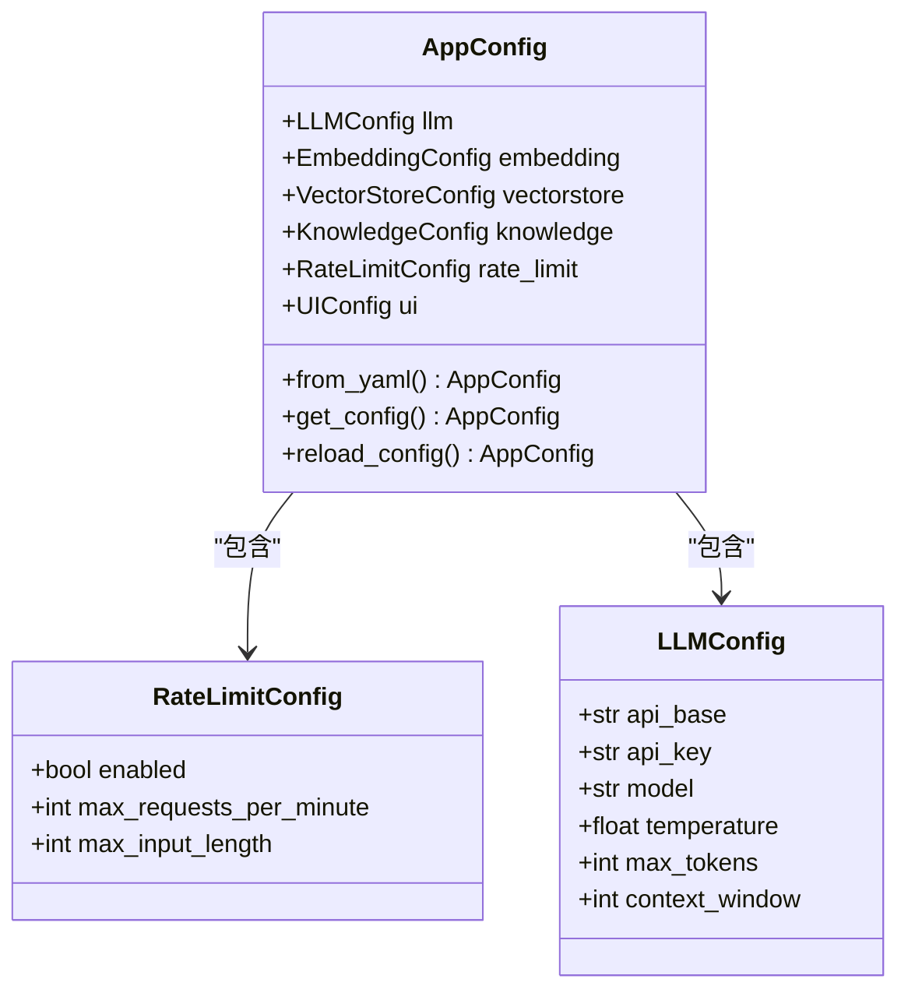

**图表来源**
- [rag/config.py:103-185](file://rag/config.py#L103-L185)

**章节来源**
- [rag/config.py:1-185](file://rag/config.py#L1-L185)

## 依赖关系分析

系统采用了松耦合的设计原则，通过接口抽象实现了模块间的低依赖关系：

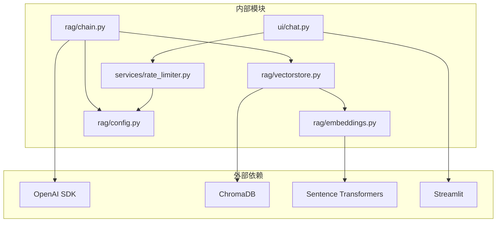

**图表来源**
- [rag/chain.py:12-16](file://rag/chain.py#L12-L16)
- [rag/vectorstore.py:10-15](file://rag/vectorstore.py#L10-L15)
- [rag/embeddings.py:34-37](file://rag/embeddings.py#L34-L37)

**章节来源**
- [rag/chain.py:1-651](file://rag/chain.py#L1-L651)
- [rag/vectorstore.py:1-209](file://rag/vectorstore.py#L1-L209)

## 性能考虑

### 检索性能优化

系统在多个层面实现了性能优化策略：

1. **向量检索优化**：通过距离阈值过滤和Top-K结果限制，减少不必要的计算
2. **BM25索引复用**：当文档数量不变时复用已构建的索引，避免重复构建
3. **交叉编码器缓存**：类级别的模型缓存，避免重复加载大型模型
4. **流式响应处理**：支持LLM的流式调用，提升用户体验

### 内存管理优化

1. **用户状态清理**：定期清理30分钟不活跃的用户记录
2. **模型缓存管理**：智能的模型加载和卸载策略
3. **向量库优化**：支持增量更新和高效检索

## 故障排除指南

### 常见问题及解决方案

#### 检索结果为空

**症状**：用户查询后无任何结果返回

**可能原因**：
1. 向量库中没有文档
2. 查询与文档内容不相关
3. 距离阈值设置过高

**解决方法**：
1. 检查向量库状态：`VectorStore.get_stats()`
2. 调整距离阈值配置
3. 确认文档已正确入库

#### 速率限制错误

**症状**：用户收到"请求过于频繁"的提示

**可能原因**：
1. 用户请求频率超过限制
2. 配额计算错误
3. 时间戳清理异常

**解决方法**：
1. 检查配置文件中的`max_requests_per_minute`
2. 等待60秒窗口重置
3. 查看日志中的清理记录

#### 模型加载失败

**症状**：系统初始化时嵌入模型加载失败

**可能原因**：
1. 网络连接问题
2. 模型文件损坏
3. 磁盘空间不足

**解决方法**：
1. 检查网络连接和代理设置
2. 清理缓存目录重新下载
3. 确保有足够的磁盘空间

**章节来源**
- [tests/test_chain.py:1-160](file://tests/test_chain.py#L1-L160)
- [tests/test_rate_limiter.py:1-56](file://tests/test_rate_limiter.py#L1-L56)

## 结论

本项目成功地将策略模式应用于知识管理系统的多个关键领域，实现了以下重要成果：

### 主要优势

1. **算法可插拔性**：通过统一的接口设计，系统可以轻松切换和组合不同的检索策略
2. **性能优化**：实现了多种性能优化技术，包括缓存、索引复用和流式处理
3. **可维护性**：清晰的模块划分和抽象接口，便于代码维护和功能扩展
4. **智能化**：支持基于用户行为的动态策略调整和智能限流

### 设计亮点

1. **混合检索策略**：结合向量检索和BM25关键词检索的优势，提升检索准确性
2. **智能速率限制**：基于用户行为的动态限流，平衡用户体验和系统稳定性
3. **配置驱动**：通过配置文件实现策略参数的灵活调整
4. **监控集成**：完整的审计日志和性能监控体系

### 未来扩展方向

1. **更多检索算法**：可以轻松集成更多类型的检索算法，如语义相似度、主题模型等
2. **自适应策略**：基于历史数据和用户反馈的自适应策略调整
3. **分布式部署**：支持大规模部署和负载均衡
4. **多模态检索**：扩展到图片、音频等多模态内容的检索

通过策略模式的应用，本系统不仅解决了当前的知识管理需求，还为未来的功能扩展和技术演进奠定了坚实的基础。这种设计模式的选择体现了现代软件工程中关注可扩展性和可维护性的最佳实践。