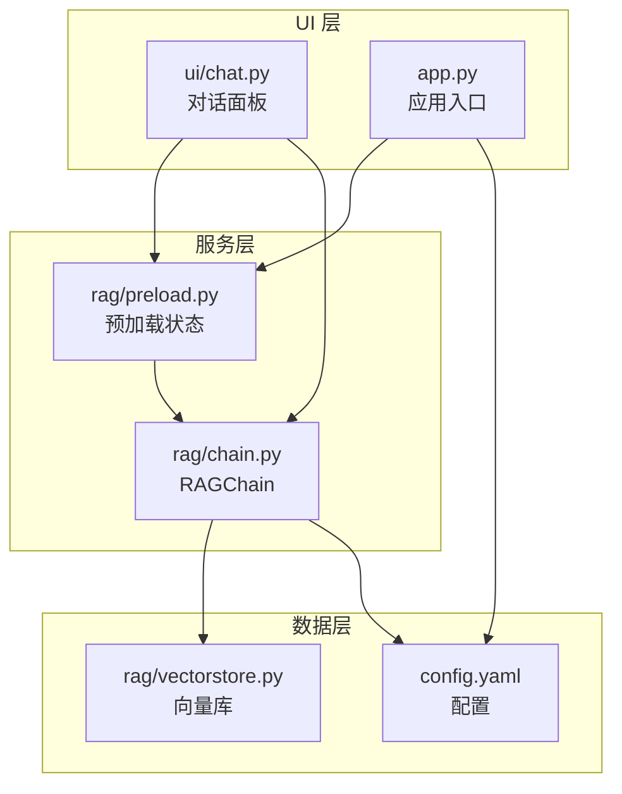
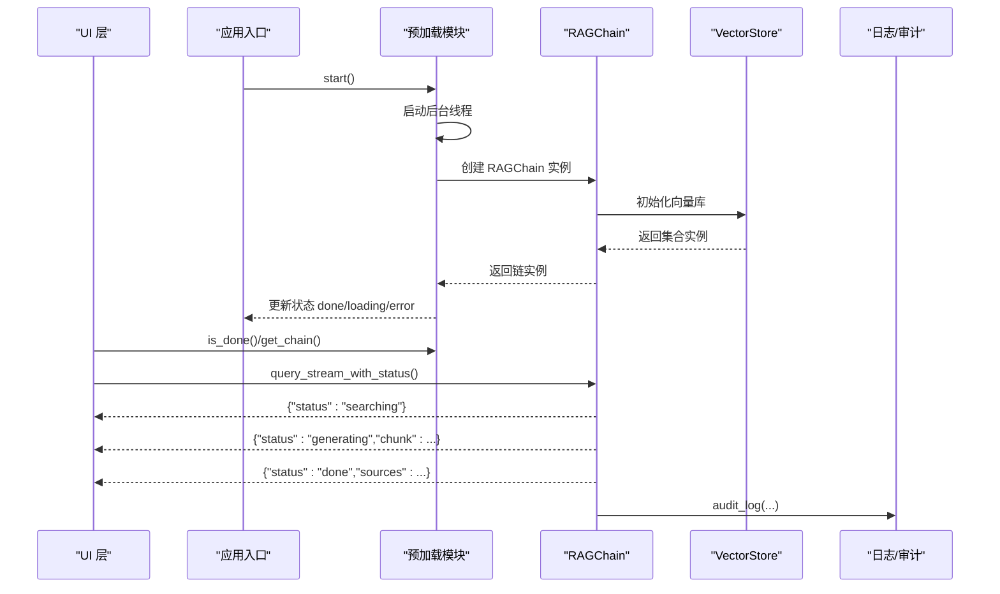
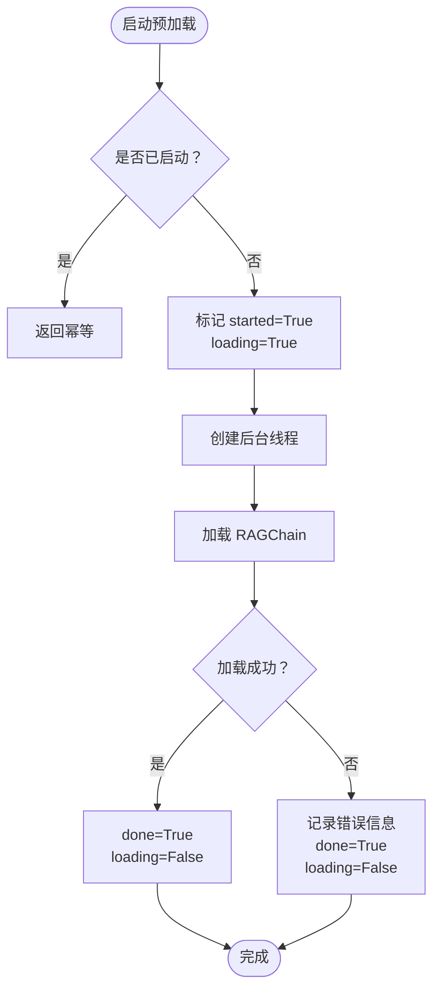
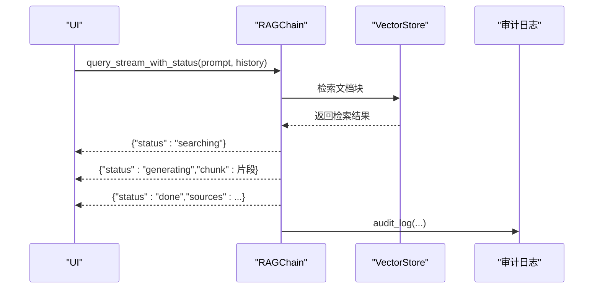
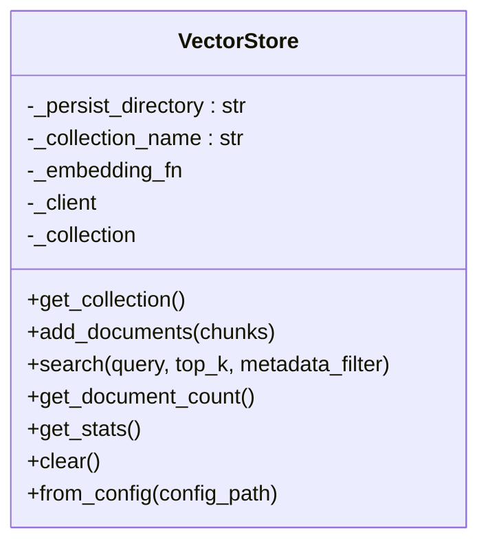
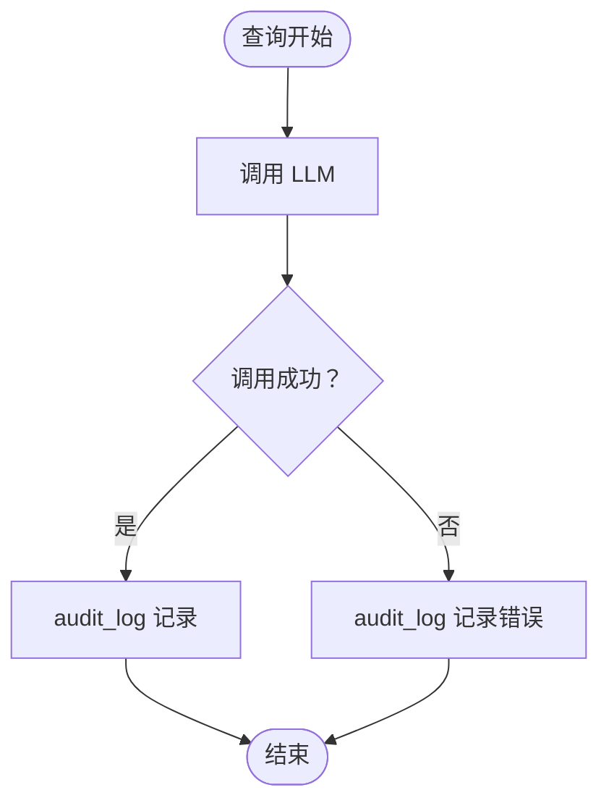
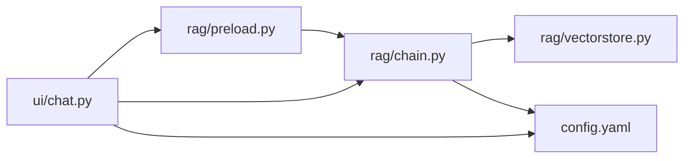

# 观察者模式应用

<cite>
**本文档引用的文件**
- [app.py](file://app.py)
- [rag/preload.py](file://rag/preload.py)
- [rag/chain.py](file://rag/chain.py)
- [rag/vectorstore.py](file://rag/vectorstore.py)
- [rag/logging_config.py](file://rag/logging_config.py)
- [ui/chat.py](file://ui/chat.py)
- [tests/test_preload.py](file://tests/test_preload.py)
- [config.yaml](file://config.yaml)
</cite>

## 目录
1. [简介](#简介)
2. [项目结构](#项目结构)
3. [核心组件](#核心组件)
4. [架构总览](#架构总览)
5. [详细组件分析](#详细组件分析)
6. [依赖关系分析](#依赖关系分析)
7. [性能考量](#性能考量)
8. [故障排查指南](#故障排查指南)
9. [结论](#结论)

## 简介
本文件聚焦于知识管理系统中观察者模式的应用，特别是预加载模块的后台线程监控机制与系统状态通知。系统通过“状态共享 + 事件驱动”的方式实现组件间松耦合通信，包括：
- 预加载进度监听：UI 在 Streamlit 页面中轮询预加载状态，实现无阻塞的初始化体验
- 系统状态变化通知：通过共享状态字典与日志审计，实现链路状态的可观测性
- 性能指标收集：通过审计日志记录查询耗时、命中数等关键指标，支撑系统优化

本方案不采用传统“回调函数”或“发布订阅”框架，而是利用 Python 模块级可变状态与生成器事件流，达到观察者模式的效果：状态变化被多个观察者（UI、日志、测试）感知，无需直接耦合。

## 项目结构
系统采用三层架构：
- UI 层：Streamlit 页面负责渲染与交互，观察预加载状态与查询事件流
- 服务层：RAGChain 提供检索与生成能力，通过事件流向 UI 推送状态
- 数据层：VectorStore 管理向量库，提供文档入库与检索能力

图表来源
- [app.py:1-189](file://app.py#L1-L189)
- [ui/chat.py:1-190](file://ui/chat.py#L1-L190)
- [rag/preload.py:1-73](file://rag/preload.py#L1-L73)
- [rag/chain.py:1-651](file://rag/chain.py#L1-L651)
- [rag/vectorstore.py:1-209](file://rag/vectorstore.py#L1-L209)
- [config.yaml:1-50](file://config.yaml#L1-L50)

章节来源
- [app.py:1-189](file://app.py#L1-L189)
- [ui/chat.py:1-190](file://ui/chat.py#L1-L190)
- [rag/preload.py:1-73](file://rag/preload.py#L1-L73)
- [rag/chain.py:1-651](file://rag/chain.py#L1-L651)
- [rag/vectorstore.py:1-209](file://rag/vectorstore.py#L1-L209)
- [config.yaml:1-50](file://config.yaml#L1-L50)

## 核心组件
- 预加载模块（观察者模式实现者）
  - 通过模块级可变状态字典共享加载状态，后台线程负责更新状态
  - UI 与测试通过读取状态字典实现“观察”
- RAGChain（事件流提供者）
  - 通过生成器方法向外抛出“状态事件”，UI 逐段消费
- VectorStore（数据提供者）
  - 提供文档入库、检索、统计等能力，支撑 RAGChain 的检索阶段
- 日志与审计（通知通道）
  - 通过统一日志模块与审计日志记录系统行为，形成“事件通知”

章节来源
- [rag/preload.py:12-73](file://rag/preload.py#L12-L73)
- [rag/chain.py:437-569](file://rag/chain.py#L437-L569)
- [rag/vectorstore.py:24-209](file://rag/vectorstore.py#L24-L209)
- [rag/logging_config.py:86-129](file://rag/logging_config.py#L86-L129)

## 架构总览
系统通过“状态共享 + 事件流”的方式实现观察者模式：
- 预加载状态：模块级字典，后台线程写入，UI/测试读取
- 查询事件流：RAGChain 的生成器方法，UI 逐段消费状态事件
- 审计日志：统一记录系统行为，作为“通知事件”的持久化载体

图表来源
- [app.py:32-41](file://app.py#L32-L41)
- [rag/preload.py:22-49](file://rag/preload.py#L22-L49)
- [rag/chain.py:437-569](file://rag/chain.py#L437-L569)
- [rag/vectorstore.py:181-209](file://rag/vectorstore.py#L181-L209)
- [rag/logging_config.py:86-129](file://rag/logging_config.py#L86-L129)

## 详细组件分析

### 预加载模块（后台线程监控与状态通知）
- 设计要点
  - 模块级可变状态字典，线程安全写入（后台线程更新）
  - 幂等启动：多次调用仅启动一次后台线程
  - UI 通过 is_done()/get_chain() 观察状态变化
- 关键流程
  - 启动后台线程，加载 RAGChain
  - 成功/失败分别设置 done/loading/error
  - UI 在页面渲染时轮询状态，实现无阻塞初始化

图表来源
- [rag/preload.py:22-49](file://rag/preload.py#L22-L49)

章节来源
- [rag/preload.py:12-73](file://rag/preload.py#L12-L73)
- [app.py:32-41](file://app.py#L32-L41)
- [tests/test_preload.py:10-31](file://tests/test_preload.py#L10-L31)

### RAGChain（事件驱动的查询处理）
- 设计要点
  - 通过生成器方法 query_stream_with_status() 输出状态事件
  - 事件类型：searching/generating/done/error
  - UI 逐段消费事件，实现流式展示
- 关键流程
  - 检索阶段：发出 searching 事件
  - 生成阶段：逐段输出生成内容
  - 结束阶段：发出 done 或 error 事件，并记录审计日志

图表来源
- [rag/chain.py:437-569](file://rag/chain.py#L437-L569)
- [rag/vectorstore.py:24-209](file://rag/vectorstore.py#L24-L209)
- [rag/logging_config.py:86-129](file://rag/logging_config.py#L86-L129)

章节来源
- [rag/chain.py:437-569](file://rag/chain.py#L437-L569)
- [ui/chat.py:144-190](file://ui/chat.py#L144-L190)

### VectorStore（数据提供者与状态采集）
- 设计要点
  - 单例缓存：避免重复加载 embedding 模型
  - 提供文档入库、检索、统计等能力
  - 统计信息可用于 UI 仪表盘展示
- 关键流程
  - add_documents：批量入库，支持增量更新
  - search：相似度检索，支持元数据过滤
  - get_stats：统计文档块数、文件数等

图表来源
- [rag/vectorstore.py:24-209](file://rag/vectorstore.py#L24-L209)

章节来源
- [rag/vectorstore.py:24-209](file://rag/vectorstore.py#L24-L209)
- [app.py:162-173](file://app.py#L162-L173)

### 日志与审计（系统状态通知通道）
- 设计要点
  - 统一日志输出：控制台彩色 + 文件完整日志
  - 审计日志：JSONL 文件记录查询行为，便于追踪与分析
- 关键流程
  - 审计日志记录查询耗时、命中数、用户行为等
  - 作为系统状态变化的“通知事件”持久化

图表来源
- [rag/logging_config.py:86-129](file://rag/logging_config.py#L86-L129)
- [rag/chain.py:470-569](file://rag/chain.py#L470-L569)

章节来源
- [rag/logging_config.py:86-129](file://rag/logging_config.py#L86-L129)
- [rag/chain.py:470-569](file://rag/chain.py#L470-L569)

## 依赖关系分析
- 组件耦合
  - UI 与预加载模块：通过 is_done()/get_chain() 间接耦合
  - UI 与 RAGChain：通过生成器事件流松耦合
  - RAGChain 与 VectorStore：直接依赖，用于检索与统计
  - 预加载模块与 RAGChain：通过模块级状态共享实现弱耦合
- 外部依赖
  - 配置文件 config.yaml 提供 LLM、嵌入模型、向量库参数
  - Streamlit 提供 UI 渲染与事件循环

图表来源
- [ui/chat.py:10-16](file://ui/chat.py#L10-L16)
- [rag/preload.py:37-38](file://rag/preload.py#L37-L38)
- [rag/chain.py:646-651](file://rag/chain.py#L646-L651)
- [config.yaml:1-50](file://config.yaml#L1-50)

章节来源
- [ui/chat.py:10-16](file://ui/chat.py#L10-L16)
- [rag/preload.py:37-38](file://rag/preload.py#L37-L38)
- [rag/chain.py:646-651](file://rag/chain.py#L646-L651)
- [config.yaml:1-50](file://config.yaml#L1-50)

## 性能考量
- 预加载策略
  - 后台线程加载 RAGChain，避免阻塞 UI；通过状态字典实现快速查询
  - 模块级状态保证多次 rerun 不重置，减少重复初始化开销
- 查询性能
  - VectorStore 提供向量检索与 BM25 检索，支持融合与重排序
  - 审计日志记录耗时，便于定位性能瓶颈
- 资源使用
  - 单例缓存避免重复加载嵌入模型，降低内存与时间开销
  - UI 通过事件流逐步渲染，避免一次性渲染大量内容

## 故障排查指南
- 预加载失败
  - 现象：UI 显示初始化失败，提示重试
  - 处理：检查 config.yaml 中 LLM API 配置与网络连接
  - 验证：通过测试用例模拟多次 rerun，确认状态不被重置
- 查询异常
  - 现象：UI 显示 error 事件
  - 处理：查看审计日志，定位具体错误与耗时
- 向量库异常
  - 现象：UI 仪表盘显示向量库状态异常
  - 处理：检查向量库持久化目录与集合名称配置

章节来源
- [ui/chat.py:37-44](file://ui/chat.py#L37-L44)
- [tests/test_preload.py:10-31](file://tests/test_preload.py#L10-L31)
- [rag/logging_config.py:86-129](file://rag/logging_config.py#L86-L129)
- [app.py:162-173](file://app.py#L162-L173)

## 结论
本系统通过“状态共享 + 事件流”的方式实现了观察者模式：
- 预加载模块以模块级状态字典承载系统状态，UI 与测试通过读取状态实现观察
- RAGChain 通过生成器事件流向 UI 推送状态，实现流式交互
- 审计日志作为系统状态通知的持久化通道，支撑可观测性与性能分析

该设计在不引入复杂框架的前提下，实现了组件间的松耦合通信，提升了系统的响应性与可扩展性，适合在资源受限的场景下稳定运行。