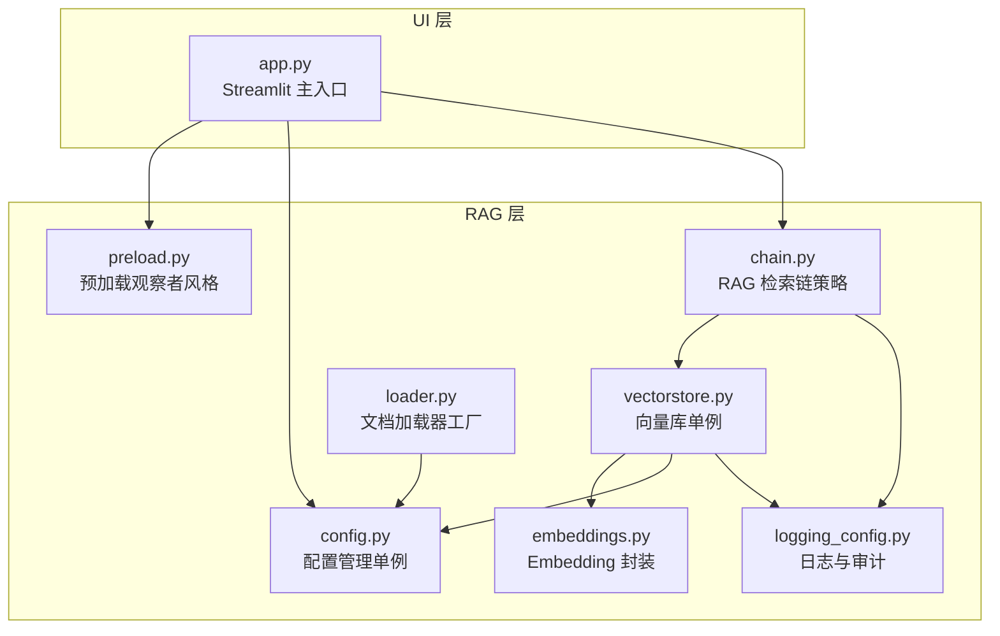
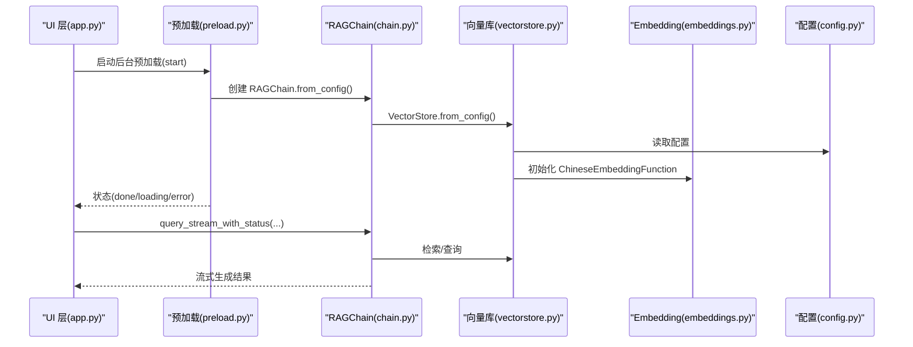
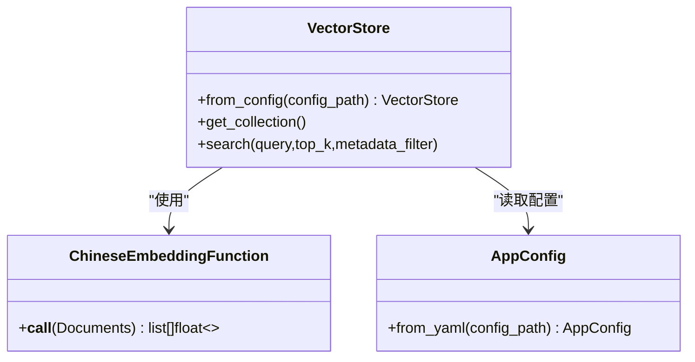
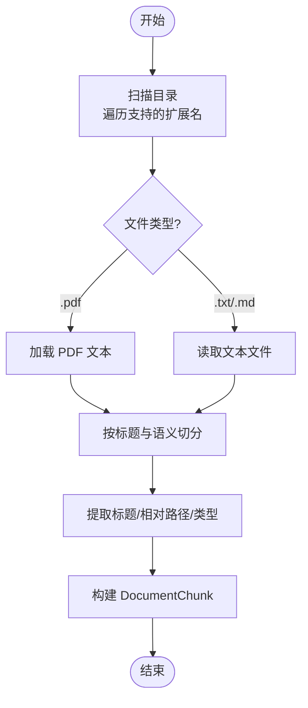
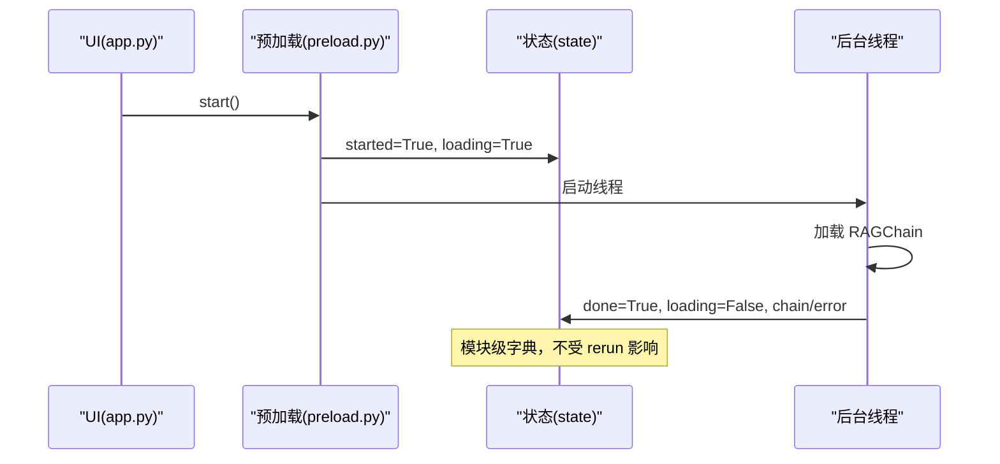
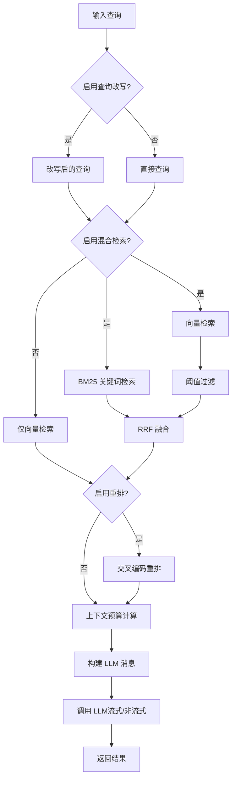
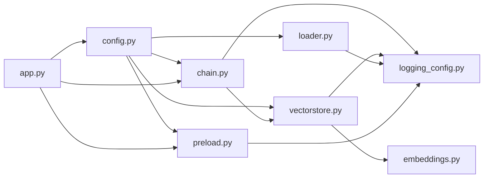

# 设计模式应用

<cite>
**本文档引用的文件**
- [config.py](file://rag/config.py)
- [vectorstore.py](file://rag/vectorstore.py)
- [loader.py](file://rag/loader.py)
- [preload.py](file://rag/preload.py)
- [embeddings.py](file://rag/embeddings.py)
- [chain.py](file://rag/chain.py)
- [logging_config.py](file://rag/logging_config.py)
- [app.py](file://app.py)
- [test_chain.py](file://tests/test_chain.py)
- [test_preload.py](file://tests/test_preload.py)
- [test_config.py](file://tests/test_config.py)
</cite>

## 目录
1. [简介](#简介)
2. [项目结构](#项目结构)
3. [核心设计模式](#核心设计模式)
4. [架构总览](#架构总览)
5. [详细组件分析](#详细组件分析)
6. [依赖关系分析](#依赖关系分析)
7. [性能考量](#性能考量)
8. [故障排查指南](#故障排查指南)
9. [结论](#结论)

## 简介
本文件聚焦于知识管理系统中设计模式的实际应用，系统采用“配置管理（单例）+ 向量库（单例）+ 文档加载器（工厂）+ 预加载机制（观察者风格）+ 检索策略（策略）”的设计组合，以提升可维护性、可扩展性与运行效率。文档将逐一解析各模式的实现、应用场景、优缺点及最佳实践，并给出可视化图示与参考路径。

## 项目结构
系统采用三层架构：
- UI 层：Streamlit 页面与组件（app.py、ui/*）
- 服务层：业务逻辑与工具（services/*）
- RAG 层：检索增强生成核心（rag/*）

图表来源
- [app.py:54-189](file://app.py#L54-L189)
- [config.py:138-184](file://rag/config.py#L138-L184)
- [vectorstore.py:181-209](file://rag/vectorstore.py#L181-L209)
- [embeddings.py:19-48](file://rag/embeddings.py#L19-L48)
- [loader.py:131-197](file://rag/loader.py#L131-L197)
- [preload.py:22-73](file://rag/preload.py#L22-L73)
- [chain.py:160-590](file://rag/chain.py#L160-L590)
- [logging_config.py:46-129](file://rag/logging_config.py#L46-L129)

章节来源
- [app.py:54-189](file://app.py#L54-L189)

## 核心设计模式
本系统主要应用以下设计模式：
- 单例模式：配置管理、向量库
- 工厂模式：文档加载器（按文件类型选择加载策略）
- 观察者模式：预加载机制（后台线程持续观察“状态”变化）
- 策略模式：检索策略（向量检索、BM25 检索、交叉编码重排、查询改写、混合检索）

章节来源
- [config.py:138-184](file://rag/config.py#L138-L184)
- [vectorstore.py:181-209](file://rag/vectorstore.py#L181-L209)
- [loader.py:131-197](file://rag/loader.py#L131-L197)
- [preload.py:22-73](file://rag/preload.py#L22-L73)
- [chain.py:160-590](file://rag/chain.py#L160-L590)

## 架构总览
系统通过“配置单例”提供全局一致的参数；“向量库单例”避免重复加载嵌入模型；“文档加载器工厂”按扩展名选择具体加载策略；“预加载观察者”在后台线程中准备 RAGChain；“检索策略”在 RAGChain 中组合多种检索方法并提供可插拔的重排与改写能力。

图表来源
- [app.py:32-41](file://app.py#L32-L41)
- [preload.py:22-73](file://rag/preload.py#L22-L73)
- [chain.py:408-508](file://rag/chain.py#L408-L508)
- [vectorstore.py:181-209](file://rag/vectorstore.py#L181-L209)
- [embeddings.py:19-48](file://rag/embeddings.py#L19-L48)
- [config.py:138-184](file://rag/config.py#L138-L184)

## 详细组件分析

### 单例模式：配置管理与向量库
- 配置管理单例
  - 作用：全局唯一配置实例，支持从 YAML 加载、环境变量替换、Pydantic 校验。
  - 关键点：全局变量保存实例，惰性初始化；提供 reload_config 强制刷新。
  - 参考路径：[config.py:138-150](file://rag/config.py#L138-L150)
- 向量库单例
  - 作用：全局缓存 VectorStore 实例，避免重复创建与嵌入模型加载。
  - 关键点：基于配置键缓存，相同配置只创建一次；提供 from_config 类方法。
  - 参考路径：[vectorstore.py:181-209](file://rag/vectorstore.py#L181-L209)

图表来源
- [config.py:102-131](file://rag/config.py#L102-L131)
- [vectorstore.py:24-60](file://rag/vectorstore.py#L24-L60)
- [embeddings.py:19-48](file://rag/embeddings.py#L19-L48)

章节来源
- [config.py:138-150](file://rag/config.py#L138-L150)
- [vectorstore.py:181-209](file://rag/vectorstore.py#L181-L209)

### 工厂模式：文档加载器
- 文档加载器工厂
  - 作用：根据文件扩展名选择加载策略（PDF/文本），统一输出 DocumentChunk 列表。
  - 关键点：扩展名集合常量、按类型调用不同加载函数、递归扫描目录、提取标题与元数据。
  - 参考路径：[loader.py:18-19](file://rag/loader.py#L18-L19), [loader.py:131-197](file://rag/loader.py#L131-L197)

图表来源
- [loader.py:101-129](file://rag/loader.py#L101-L129)
- [loader.py:29-89](file://rag/loader.py#L29-L89)
- [loader.py:185-194](file://rag/loader.py#L185-L194)

章节来源
- [loader.py:131-197](file://rag/loader.py#L131-L197)

### 观察者模式：预加载机制
- 预加载观察者
  - 作用：后台线程持续观察“状态”变化，完成 RAGChain 初始化，供 UI 在多次 rerun 后仍可见。
  - 关键点：模块级可变字典 state 作为观察目标；幂等启动；线程安全写入；支持 reset 重置。
  - 参考路径：[preload.py:12-19](file://rag/preload.py#L12-L19), [preload.py:22-73](file://rag/preload.py#L22-L73)

图表来源
- [app.py:32-41](file://app.py#L32-L41)
- [preload.py:22-73](file://rag/preload.py#L22-L73)

章节来源
- [preload.py:22-73](file://rag/preload.py#L22-L73)
- [test_preload.py:10-31](file://tests/test_preload.py#L10-L31)

### 策略模式：检索策略
- 检索策略
  - 作用：在 RAGChain 中组合多种检索与重排策略，支持向量检索、BM25 关键词检索、交叉编码重排、查询改写与混合检索。
  - 关键点：BM25Retriever 独立策略；reciprocal_rank_fusion(RRF) 跨源融合；类级别缓存 reranker 模型；按配置动态启用/禁用。
  - 参考路径：[chain.py:39-120](file://rag/chain.py#L39-L120), [chain.py:129-158](file://rag/chain.py#L129-L158), [chain.py:300-331](file://rag/chain.py#L300-L331), [chain.py:236-299](file://rag/chain.py#L236-L299)

图表来源
- [chain.py:236-299](file://rag/chain.py#L236-L299)
- [chain.py:300-331](file://rag/chain.py#L300-L331)
- [chain.py:376-406](file://rag/chain.py#L376-L406)
- [chain.py:408-508](file://rag/chain.py#L408-L508)

章节来源
- [chain.py:160-590](file://rag/chain.py#L160-L590)
- [test_chain.py:15-64](file://tests/test_chain.py#L15-L64)
- [test_chain.py:66-94](file://tests/test_chain.py#L66-L94)

## 依赖关系分析
- 配置依赖：config.py 被 vectorstore.py、chain.py、preload.py 等广泛依赖，确保全局一致性。
- 向量库依赖：vectorstore.py 依赖 config.py 与 embeddings.py，提供 Collection 访问与检索。
- 文档加载器依赖：loader.py 依赖 config.py 与 logging_config.py，负责文档切分与元数据提取。
- 预加载依赖：preload.py 依赖 logging_config.py，后台线程导入 chain.py 并写入状态。
- RAG 链依赖：chain.py 依赖 vectorstore.py、config.py、logging_config.py，实现检索、重排、消息构建与 LLM 调用。

图表来源
- [config.py:138-184](file://rag/config.py#L138-L184)
- [vectorstore.py:181-209](file://rag/vectorstore.py#L181-L209)
- [embeddings.py:19-48](file://rag/embeddings.py#L19-L48)
- [loader.py:131-197](file://rag/loader.py#L131-L197)
- [preload.py:22-73](file://rag/preload.py#L22-L73)
- [chain.py:160-590](file://rag/chain.py#L160-L590)
- [logging_config.py:46-129](file://rag/logging_config.py#L46-L129)
- [app.py:54-189](file://app.py#L54-L189)

章节来源
- [app.py:54-189](file://app.py#L54-L189)

## 性能考量
- 单例缓存
  - 配置单例避免重复解析 YAML；向量库单例避免重复加载嵌入模型，显著降低冷启动成本。
  - 参考路径：[config.py:138-150](file://rag/config.py#L138-L150), [vectorstore.py:181-209](file://rag/vectorstore.py#L181-L209)
- 延迟初始化
  - Embedding 与 Reranker 模型采用延迟加载并在类级别缓存，减少内存占用与启动时间。
  - 参考路径：[embeddings.py:31-47](file://rag/embeddings.py#L31-L47), [chain.py:310-320](file://rag/chain.py#L310-L320)
- 检索优化
  - 向量检索阈值过滤、BM25 作为兜底、RRF 融合提升召回质量；上下文预算与 token 估算避免越界。
  - 参考路径：[chain.py:268-299](file://rag/chain.py#L268-L299), [chain.py:376-388](file://rag/chain.py#L376-L388)
- I/O 与并发
  - 预加载在后台线程执行，避免阻塞 UI；PDF 解析使用第三方库，注意异常处理与资源释放。
  - 参考路径：[preload.py:33-49](file://rag/preload.py#L33-L49), [loader.py:101-118](file://rag/loader.py#L101-L118)

## 故障排查指南
- 配置加载失败
  - 症状：找不到配置文件或字段校验失败。
  - 排查：检查 YAML 路径与字段类型；确认环境变量替换是否正确；查看 Pydantic 报错。
  - 参考路径：[config.py:118-131](file://rag/config.py#L118-L131), [test_config.py:98-117](file://tests/test_config.py#L98-L117)
- 向量库初始化异常
  - 症状：持久化目录不可写、集合创建失败。
  - 排查：确认 persist_directory 权限；检查集合名与嵌入模型配置；查看日志。
  - 参考路径：[vectorstore.py:40-55](file://rag/vectorstore.py#L40-L55), [vectorstore.py:171-179](file://rag/vectorstore.py#L171-L179)
- 预加载未完成
  - 症状：UI 多次 rerun 后 chain 仍为 None。
  - 排查：确认后台线程已启动；检查状态 done/loading/error；必要时 reset 后重启。
  - 参考路径：[preload.py:22-73](file://rag/preload.py#L22-L73), [test_preload.py:10-31](file://tests/test_preload.py#L10-L31)
- 检索结果为空
  - 症状：向量检索无命中或阈值过滤后为空。
  - 排查：降低 distance_threshold；启用 BM25；检查文档入库与元数据完整性。
  - 参考路径：[chain.py:268-299](file://rag/chain.py#L268-L299)
- LLM 调用失败
  - 症状：流式/非流式调用异常或返回空内容。
  - 排查：检查 api_base/api_key/model；查看重试与降级逻辑；核对上下文长度。
  - 参考路径：[chain.py:509-582](file://rag/chain.py#L509-L582)

章节来源
- [test_config.py:98-117](file://tests/test_config.py#L98-L117)
- [vectorstore.py:40-55](file://rag/vectorstore.py#L40-L55)
- [preload.py:22-73](file://rag/preload.py#L22-L73)
- [chain.py:268-299](file://rag/chain.py#L268-L299)
- [chain.py:509-582](file://rag/chain.py#L509-L582)

## 结论
本系统通过“单例 + 工厂 + 观察者 + 策略”的设计组合，有效解决了配置一致性、模型加载成本、检索质量与用户体验等关键问题。建议在后续迭代中：
- 将策略部分进一步抽象为可插拔的检索器接口，便于新增检索算法；
- 增强预加载状态的可观测性与可调试性；
- 对 PDF 解析与嵌入模型加载增加更细粒度的缓存与降级策略。